# Distributors Tutorial

<!-- TOC -->

## Distributors

Distributors are modules that are useful for placing multiple copies of a
child across a line, area, volume, or ring.  Many transforms have one or
more distributive variation.

Transforms              | Related Distributors
----------------------- | ---------------------
`left()`, `right()`     | `xcopies()`
`fwd()`, `back()`       | `ycopies()`
`down()`, `up()`        | `zcopies()`
`move()`, `translate()` | `move_copies()`, `line_of()`, `grid2d()`
`xrot()`                | `xrot_copies()`
`yrot()`                | `yrot_copies()`
`zrot()`                | `zrot_copies()`
`rot()`, `rotate()`     | `rot_copies()`, `arc_of()`
`xflip()`               | `xflip_copy()`
`yflip()`               | `yflip_copy()`
`zflip()`               | `zflip_copy()`
`mirror()`              | `mirror_copy()`


### Transform Distributors
Using `xcopies()`, you can make a line of evenly spaced copies of a shape
centered along the X axis.  To make a line of 5 spheres, spaced every 20
units along the X axis, do:
```openscad
include <BOSL2/std.scad>
xcopies(20, n=5) sphere(d=10);
```
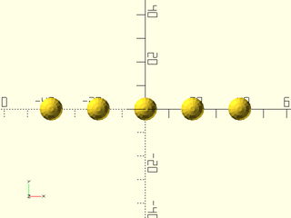
Note that the first expected argument to `xcopies()` is the spacing argument,
so you do not need to supply the `spacing=` argument name.

Similarly, `ycopies()` makes a line of evenly spaced copies centered along the
Y axis. To make a line of 5 spheres, spaced every 20 units along the Y
axis, do:
```openscad
include <BOSL2/std.scad>
ycopies(20, n=5) sphere(d=10);
```
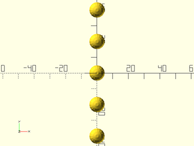

And, `zcopies()` makes a line of evenly spaced copies centered along the Z axis.
To make a line of 5 spheres, spaced every 20 units along the Z axis, do:
```openscad
include <BOSL2/std.scad>
zcopies(20, n=5) sphere(d=10);
```
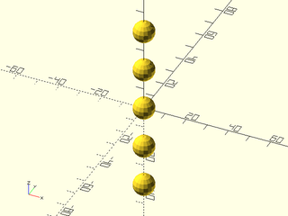

If you don't give the `n=` argument to `xcopies()`, `ycopies()` or `zcopies()`,
then it defaults to 2 (two) copies.  This actually is the most common usage:
```openscad
include <BOSL2/std.scad>
xcopies(20) sphere(d=10);
```
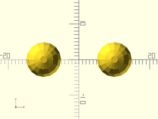

```openscad
include <BOSL2/std.scad>
ycopies(20) sphere(d=10);
```
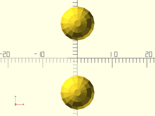

```openscad
include <BOSL2/std.scad>
zcopies(20) sphere(d=10);
```
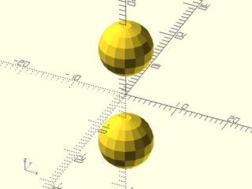

If you don't know the spacing you want, but instead know how long a line you
want the copies distributed over, you can use the `l=` argument instead of
the `spacing=` argument:
```openscad
include <BOSL2/std.scad>
xcopies(l=100, n=5) sphere(d=10);
```
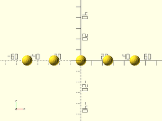

```openscad
include <BOSL2/std.scad>
ycopies(l=100, n=5) sphere(d=10);
```
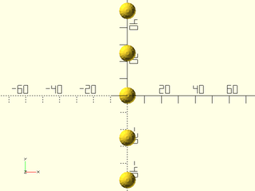

```openscad
include <BOSL2/std.scad>
zcopies(l=100, n=5) sphere(d=10);
```
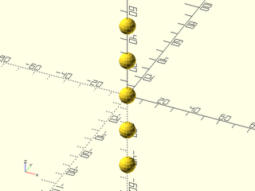

If you don't want the line of copies centered on the origin, you can give a
starting point `sp=`, and the line of copies will start there.  For `xcopies()`,
the line of copies will extend to the right of the starting point.
```openscad
include <BOSL2/std.scad>
xcopies(20, n=5, sp=[0,0,0]) sphere(d=10);
```
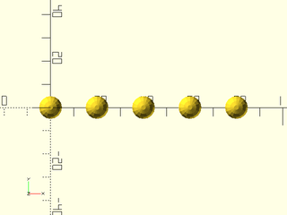

For `ycopies()`, the line of copies will extend to the back of the starting point.
```openscad
include <BOSL2/std.scad>
ycopies(20, n=5, sp=[0,0,0]) sphere(d=10);
```
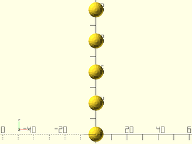

For `zcopies()`, the line of copies will extend upwards from the starting point.
```openscad
include <BOSL2/std.scad>
zcopies(20, n=5, sp=[0,0,0]) sphere(d=10);
```
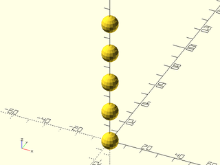

If you need to distribute copies along an arbitrary line, you can use the
`line_of()` command.  You can give both the direction vector and the spacing
of the line of copies with the `spacing=` argument:
```openscad
include <BOSL2/std.scad>
line_of(spacing=(BACK+RIGHT)*20, n=5) sphere(d=10);
```
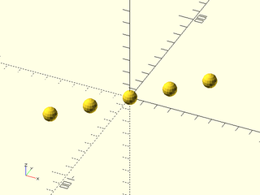

With the `p1=` argument, you can specify the starting point of the line:
```openscad
include <BOSL2/std.scad>
line_of(spacing=(BACK+RIGHT)*20, n=5, p1=[0,0,0]) sphere(d=10);
```
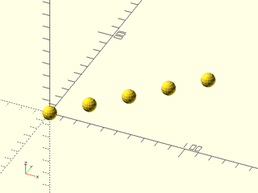

If you give both `p1=` and `p2=`, you can nail down both the start and
endpoints of the line of copies:
```openscad
include <BOSL2/std.scad>
line_of(p1=[0,100,0], p2=[100,0,0], n=4)
    sphere(d=10);
```
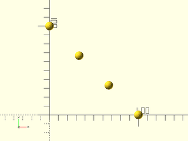

The `grid2d()` command will let you spread copies across both the X and Y
axes at the same time:
```openscad
include <BOSL2/std.scad>
grid2d(20, n=6) sphere(d=10);
```
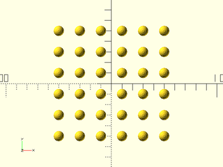

The spacing can be separately specified for both the X and Y axes, as can
the count of rows and columns:
```openscad
include <BOSL2/std.scad>
grid2d([20,30], n=[6,4]) sphere(d=10);
```
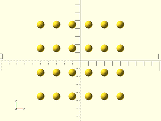

Another neat trick of `grid2d()`, is that you can stagger the output:
```openscad
include <BOSL2/std.scad>
grid2d(20, n=[12,6], stagger=true) sphere(d=10);
```
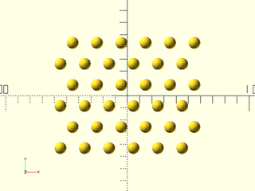

You can get the alternate stagger pattern if you set `stagger="alt"`:
```openscad
include <BOSL2/std.scad>
grid2d(20, n=[12,6], stagger="alt") sphere(d=10);
```
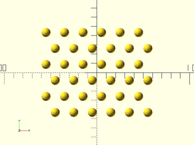

By default, if you give a scalar for the spacing value, staggering will give
you a hexagonal grid, with the spacing being the distance from an item to all
six of the surrounding items.  If you give the spacing as a 2-item vector,
then that will force the X and Y spacings between columns and rows instead.
```openscad
include <BOSL2/std.scad>
grid2d([20,20], n=6, stagger=true) sphere(d=10);
```
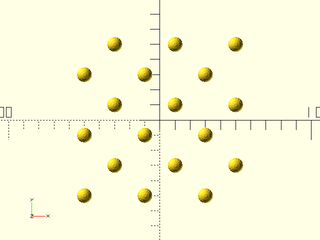

You can alternately specify a grid using size and spacing:
```openscad
include <BOSL2/std.scad>
grid2d(20, size=100) sphere(d=10);
```


```openscad
include <BOSL2/std.scad>
grid2d(20, size=[100,80]) sphere(d=10);
```
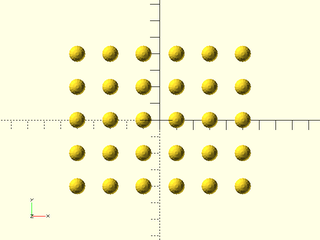

```openscad
include <BOSL2/std.scad>
grid2d(20, size=[100,80], stagger=true) sphere(d=10);
```
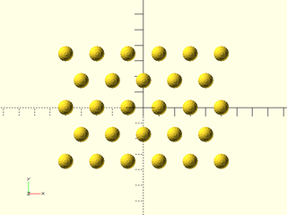

You can also make grids by specifying size and column/row count:
```openscad
include <BOSL2/std.scad>
grid2d(n=5, size=100) sphere(d=10);
```
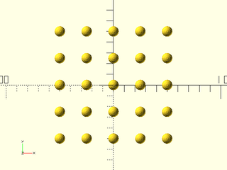

```openscad
include <BOSL2/std.scad>
grid2d(n=[4,5], size=100) sphere(d=10);
```
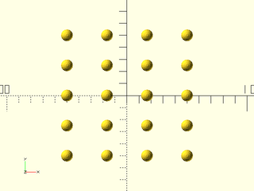

```openscad
include <BOSL2/std.scad>
grid2d(n=[4,5], size=[100,80]) sphere(d=10);
```
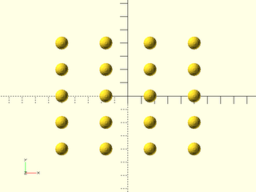

Finally, the `grid2d()` command will let you give a polygon or region shape
to fill with items.  Only the items in the grid whose center would be inside
the polygon or region will be created.  To fill a star shape with items, you
can do something like:
```openscad
include <BOSL2/std.scad>
poly = [for (i=[0:11]) polar_to_xy(50*(i%2+1), i*360/12-90)];
grid2d(5, stagger=true, inside=poly) {
    cylinder(d=4,h=10,spin=90,$fn=6);
}
```
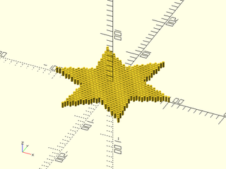


### Rotational Distributors
You can make six copies of a cone, rotated around a center:
```openscad
include <BOSL2/std.scad>
zrot_copies(n=6) yrot(90) cylinder(h=50,d1=0,d2=20);
```
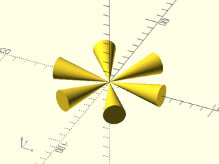

To Be Completed


