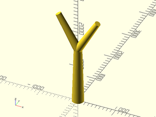
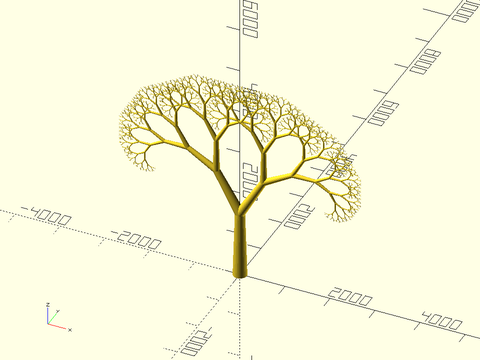

# Fractal Tree Tutorial

<!-- TOC -->

### Start with a Tree Trunk

Firstoff, include the BOSL2 library, then make a starting module that just has a tapered cylinder for the tree trunk.

```openscad
include <BOSL2/std.scad>
module tree(l=1500, sc=0.7)
    cylinder(l=l, d1=l/5, d2=l/5*sc);
tree();
```


### Attaching a Branch

You can attach a branch to the top of the trunk by using `attach()` as a child of the trunk cylinder.

```openscad
include <BOSL2/std.scad>
module tree(l=1500, sc=0.7)
    cylinder(l=l, d1=l/5, d2=l/5*sc)
        attach(TOP)
            yrot(30) cylinder(l=l*sc, d1=l/5*sc, d2=l/5*sc*sc);
tree();
```


### Replicating the Branch

Instead of attaching each branch individually, you can make multiple copies of one branch, that are rotated relative to each other.

```openscad
include <BOSL2/std.scad>
module tree(l=1500, sc=0.7)
    cylinder(l=l, d1=l/5, d2=l/5*sc)
        attach(TOP)
            zrot_copies(n=2)  // Replicate that branch
                yrot(30) cylinder(l=l*sc, d1=l/5*sc, d2=l/5*sc*sc);
tree();
```


### Use Recursion

Since branches look much like the main trunk, we can make the tree recursive. Don't forget the termination clause, or else it'll try to recurse forever!

```openscad
include <BOSL2/std.scad>
module tree(l=1500, sc=0.7, depth=10)
    cylinder(l=l, d1=l/5, d2=l/5*sc)
        attach(TOP)
            if (depth>0)  { // Important!
                zrot_copies(n=2)
                yrot(30) tree(depth=depth-1, l=l*sc, sc=sc);
            }
tree();
```


### Make it Not Flat

A flat planar tree isn't what we want, so lets bush it out a bit by rotating each level 90 degrees.

```openscad
include <BOSL2/std.scad>
module tree(l=1500, sc=0.7, depth=10)
    cylinder(l=l, d1=l/5, d2=l/5*sc)
        attach(TOP)
            if (depth>0) {
                zrot(90)  // Bush it out
                zrot_copies(n=2)
                yrot(30) tree(depth=depth-1, l=l*sc, sc=sc);
            }
tree();
```


### Adding Leaves

Let's add leaves. They look much like squashed versions of the standard teardrop() module, so lets use that.

```openscad
include <BOSL2/std.scad>
module tree(l=1500, sc=0.7, depth=10)
    cylinder(l=l, d1=l/5, d2=l/5*sc)
        attach(TOP)
            if (depth>0) {
                zrot(90)
                zrot_copies(n=2)
                yrot(30) tree(depth=depth-1, l=l*sc, sc=sc);
            } else {
                yscale(0.67)
                teardrop(d=l*3, l=1, anchor=BOT, spin=90);
            }
tree();
```


### Adding Color

We can finish this off with some color. The `color()` module will force all it's children and
their descendants to the new color, even if they were colored before. The `recolor()` module,
however, will only color children and decendants that don't already have a color set by a more
nested `recolor()`.

```openscad
include <BOSL2/std.scad>
module tree(l=1500, sc=0.7, depth=10)
    recolor("lightgray")
    cylinder(l=l, d1=l/5, d2=l/5*sc)
        attach(TOP)
            if (depth>0) {
                zrot(90)
                zrot_copies(n=2)
                yrot(30) tree(depth=depth-1, l=l*sc, sc=sc);
            } else {
                recolor("springgreen")
                yscale(0.67)
                teardrop(d=l*3, l=1, anchor=BOT, spin=90);
            }
tree();
```


