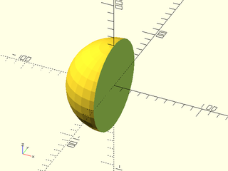
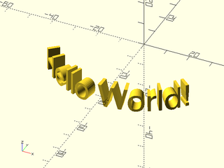
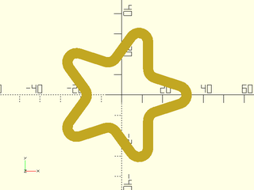

# Mutators Tutorial

<!-- TOC -->

## 3D Space Halving
Sometimes you want to take a 3D shape like a sphere, and cut it in half.
The BOSL2 library provides a number of ways to do this:

```openscad
include <BOSL2/std.scad>
left_half() sphere(d=100);
```


```openscad
include <BOSL2/std.scad>
right_half() sphere(d=100);
```


```openscad
include <BOSL2/std.scad>
front_half() sphere(d=100);
```


```openscad
include <BOSL2/std.scad>
back_half() sphere(d=100);
```


```openscad
include <BOSL2/std.scad>
bottom_half() sphere(d=100);
```


```openscad
include <BOSL2/std.scad>
top_half() sphere(d=100);
```


You can use the `half_of()` module if you want to split space in a way not aligned with an axis:

```openscad
include <BOSL2/std.scad>
half_of([-1,0,-1]) sphere(d=100);
```


The plane of dissection can be shifted along the axis of any of these operators:

```openscad
include <BOSL2/std.scad>
left_half(x=20) sphere(d=100);
```


```openscad
include <BOSL2/std.scad>
back_half(y=-20) sphere(d=100);
```


```openscad
include <BOSL2/std.scad>
bottom_half(z=20) sphere(d=100);
```


```openscad
include <BOSL2/std.scad>
half_of([-1,0,-1], cp=[20,0,20]) sphere(d=100);
```


By default, these operators can be applied to objects that fit in a cube 1000 on a side. If you need
to apply these halving operators to objects larger than this, you can give the size in the `s=`
argument:

```openscad
include <BOSL2/std.scad>
bottom_half(s=2000) sphere(d=1500);
```


## 2D Plane Halving
To cut 2D shapes in half, you will need to add the `planar=true` argument:

```openscad
include <BOSL2/std.scad>
left_half(planar=true) circle(d=100);
```


```openscad
include <BOSL2/std.scad>
right_half(planar=true) circle(d=100);
```


```openscad
include <BOSL2/std.scad>
front_half(planar=true) circle(d=100);
```


```openscad
include <BOSL2/std.scad>
back_half(planar=true) circle(d=100);
```


## Chained Mutators
If you have a set of shapes that you want to do pair-wise hulling of, you can use `chain_hull()`:

```openscad
include <BOSL2/std.scad>
chain_hull() {
    cube(5, center=true);
    translate([30, 0, 0]) sphere(d=15);
    translate([60, 30, 0]) cylinder(d=10, h=20);
    translate([60, 60, 0]) cube([10,1,20], center=false);
}
```


## Extrusion Mutators
The OpenSCAD `linear_extrude()` module can take a 2D shape and extrude it vertically in a line:

```openscad
include <BOSL2/std.scad>
linear_extrude(height=30) zrot(45) square(40,center=true);
```


The `rotate_extrude()` module can take a 2D shape and rotate it around the Z axis.

```openscad
include <BOSL2/std.scad>
linear_extrude(height=30) left(30) zrot(45) square(40,center=true);
```


In a similar manner, the BOSL2 `cylindrical_extrude()` module can take a 2d shape and extrude it
out radially from the center of a cylinder:

```openscad
include <BOSL2/std.scad>
cylindrical_extrude(or=40, ir=35)
    text(text="Hello World!", size=10, halign="center", valign="center");
```



## Offset Mutators

### Minkowski Difference
Openscad provides the `minkowski()` module to trace a shape over the entire surface of another shape:

```openscad
include <BOSL2/std.scad>
minkowski() {
    union() {
	cube([100,33,33], center=true);
	cube([33,100,33], center=true);
	cube([33,33,100], center=true);
    }
    sphere(r=8);
}
```


However, it doesn't provide the inverse of this operation; to remove a shape from the entire surface
of another object.  For this, the BOSL2 library provides the `minkowski_difference()` module:

```openscad
include <BOSL2/std.scad>
minkowski_difference() {
    union() {
        cube([100,33,33], center=true);
        cube([33,100,33], center=true);
        cube([33,33,100], center=true);
    }
    sphere(r=8);
}
```


To perform a `minkowski_difference()` on 2D shapes, you need to supply the `planar=true` argument:

```openscad
include <BOSL2/std.scad>
minkowski_difference(planar=true) {
    union() {
        square([100,33], center=true);
        square([33,100], center=true);
    }
    circle(r=8);
}
```


### Round2d
The `round2d()` module lets you take a 2D shape and round inside and outside corners.  The inner concave corners are rounded to the radius `ir=`, while the outer convex corners are rounded to the radius `or=`:

```openscad
include <BOSL2/std.scad>
round2d(or=8) star(6, step=2, d=100);
```


```openscad
include <BOSL2/std.scad>
round2d(ir=12) star(6, step=2, d=100);
```


```openscad
include <BOSL2/std.scad>
round2d(or=8,ir=12) star(6, step=2, d=100);
```


You can use `r=` to effectively set both `ir=` and `or=` to the same value:

```openscad
include <BOSL2/std.scad>
round2d(r=8) star(6, step=2, d=100);
```


### Shell2d
With the `shell2d()` module, you can take an arbitrary shape, and get the shell outline of it.
With a positive thickness, the shell is offset outwards from the original shape:

```openscad
include <BOSL2/std.scad>
shell2d(thickness=5) star(5,step=2,d=100);
color("blue") stroke(star(5,step=2,d=100),closed=true);
```


With a negative thickness, the shell if inset from the original shape:

```openscad
include <BOSL2/std.scad>
shell2d(thickness=-5) star(5,step=2,d=100);
color("blue") stroke(star(5,step=2,d=100),closed=true);
```


You can give a pair of thickness values if you want it both inset and outset from the original shape:

```openscad
include <BOSL2/std.scad>
shell2d(thickness=[-5,5]) star(5,step=2,d=100);
color("blue") stroke(star(5,step=2,d=100),closed=true);
```


You can add rounding to the outside by passing a radius to the `or=` argument.

```openscad
include <BOSL2/std.scad>
shell2d(thickness=-5,or=5) star(5,step=2,d=100);
```


If you need to pass different radii for the convex and concave corners of the outside, you can pass them as `or=[CONVEX,CONCAVE]`:

```openscad
include <BOSL2/std.scad>
shell2d(thickness=-5,or=[5,10]) star(5,step=2,d=100);
```


A radius of 0 can be used to specify no rounding:

```openscad
include <BOSL2/std.scad>
shell2d(thickness=-5,or=[5,0]) star(5,step=2,d=100);
```


You can add rounding to the inside by passing a radius to the `ir=` argument.

```openscad
include <BOSL2/std.scad>
shell2d(thickness=-5,ir=5) star(5,step=2,d=100);
```


If you need to pass different radii for the convex and concave corners of the inside, you can pass them as `ir=[CONVEX,CONCAVE]`:

```openscad
include <BOSL2/std.scad>
shell2d(thickness=-5,ir=[8,3]) star(5,step=2,d=100);
```


You can use `or=` and `ir=` together to get nice combined rounding effects:

```openscad
include <BOSL2/std.scad>
shell2d(thickness=-5,or=[7,2],ir=[7,2]) star(5,step=2,d=100);
```


```openscad
include <BOSL2/std.scad>
shell2d(thickness=-5,or=[5,0],ir=[5,0]) star(5,step=2,d=100);
```


### Round3d
### Offset3d
(To be Written)


## Color Manipulators
The built-in OpenSCAD `color()` module can let you set the RGB color of an object, but it's often
easier to select colors using other color schemes.  You can use the HSL or Hue-Saturation-Lightness
color scheme with the `HSL()` module:

```openscad
include <BOSL2/std.scad>
n = 10; size = 100/n;
for (a=count(n), b=count(n), c=count(n)) {
    let( h=360*a/n, s=1-b/(n-1), l=c/(n-1))
    translate(size*[a,b,c]) {
        HSL(h,s,l) cube(size);
    }
}
```


You can use the HSV or Hue-Saturation-Value color scheme with the `HSV()` module:

```openscad
include <BOSL2/std.scad>
n = 10; size = 100/n;
for (a=count(n), b=count(n), c=count(n)) {
    let( h=360*a/n, s=1-b/(n-1), v=c/(n-1))
    translate(size*[a,b,c]) {
        HSV(h,s,v) cube(size);
    }
}
```


