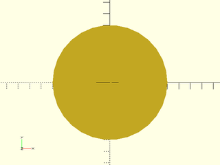
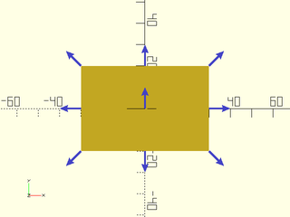
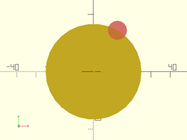
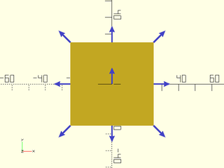
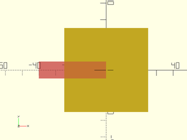
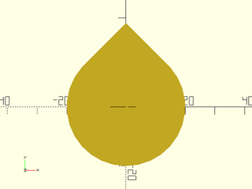
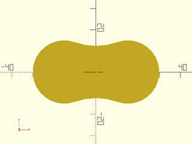

# 2D Shapes Tutorial

<!-- TOC -->

## Primitives
There are two built-in 2D primitive shapes that OpenSCAD provides: `square()`, and `circle()`.
You can still use them in the familiar ways that OpenSCAD provides:

```openscad
include <BOSL2/std.scad>
square([60,40], center=true);
```


```openscad
include <BOSL2/std.scad>
circle(r=50);
```


```openscad
include <BOSL2/std.scad>
circle(d=100, $fn=8);
```


These modules have also been enhanced in the BOSL2 library in three ways: Anchoring, spin, and
attachability.

#### Anchoring:
When you create a `square()`, you can specify what corner or side  will be anchored at the
origin.  This is used in place of the `center=` argument, and is more flexible.  The `anchor=`
argument takes a vector as a value, pointing roughly towards the side or corner you
want to align to the origin.  For example, to align the center of the back edge to the
origin, set the anchor to `[0,1]`:

```openscad
include <BOSL2/std.scad>
square([60,40], anchor=[0,1]);
```


To align the front right corner to the origin:

```openscad
include <BOSL2/std.scad>
square([60,40], anchor=[1,-1]);
```


To center:

```openscad
include <BOSL2/std.scad>
square([60,40], anchor=[0,0]);
```


To make it clearer when giving vectors, there are several standard vector constants defined:

Constant | Direction | Value
-------- | --------- | -----------
`LEFT`   | X-        | `[-1, 0, 0]`
`RIGHT`  | X+        | `[ 1, 0, 0]`
`FRONT`/`FORWARD`/`FWD` | Y- | `[ 0,-1, 0]`
`BACK`   | Y+        | `[ 0, 1, 0]`
`BOTTOM`/`BOT`/`BTM`/`DOWN` | Z- | `[ 0, 0,-1]` (3D only.)
`TOP`/`UP` | Z+      | `[ 0, 0, 1]` (3D only.)
`CENTER`/`CTR` | Centered | `[ 0, 0, 0]`

Note that even though these are 3D vectors, you can use most of them,
(except `UP`/`DOWN`, of course) for anchors in 2D shapes:

```openscad
include <BOSL2/std.scad>
square([60,40], anchor=BACK);
```


```openscad
include <BOSL2/std.scad>
square([60,40], anchor=CENTER);
```


You can add vectors together to point to corners:

```openscad
include <BOSL2/std.scad>
square([60,40], anchor=FRONT+RIGHT);
```


For `circle()`, the anchor vector can point at any part of the circle perimeter:

```openscad
include <BOSL2/std.scad>
circle(d=50, anchor=polar_to_xy(1,150));
```


You can see the typical anchor points by making `show_anchors()` the child of the shape:

```openscad
include <BOSL2/std.scad>
square([60,40], center=true)
    show_anchors();
```


```openscad
include <BOSL2/std.scad>
circle(d=50)
    show_anchors();
```


#### Spin:
The second way that `square()` and `circle()` have been enhanced is with spin.  When you create
the shape, you can spin it in place with the `spin=` argument.  You just pass it a number of
degrees to rotate clockwise:

```openscad
include <BOSL2/std.scad>
square([60,40], anchor=CENTER, spin=30);
```


Anchoring or centering is performed before the spin:

```openscad
include <BOSL2/std.scad>
square([60,40], anchor=BACK, spin=30);
```


For circles, spin can be useful when `$fn=` is also given:

```openscad
include <BOSL2/std.scad>
circle(d=50, $fn=6, spin=15);
```


Since anchoring is performed before spin, you can use them together to spin around the anchor:

```openscad
include <BOSL2/std.scad>
circle(d=50, $fn=6, anchor=LEFT, spin=15);
```


#### Attachability:

The third way `square()` and `circle()` have been enhanced is that you can attach them together
at anchoring points in various ways.  This is done by making one shape a child of the shape
you want to attach to.  By default, just making one shape a child of the other will position
the child shape at the center of the parent shape.

```openscad
include <BOSL2/std.scad>
square(50, center=true)
    #square(50, spin=45, center=true);
```


```openscad
include <BOSL2/std.scad>
square(50, center=true)
    #square([20,40], anchor=FWD);
```


By adding the `position()` module, you can position the child at any anchorpoint on the parent:

```openscad
include <BOSL2/std.scad>
square(50, center=true)
    position(BACK)
        #square(25, spin=45, center=true);
```


```openscad
include <BOSL2/std.scad>
square(50, center=true)
    position(FWD+RIGHT)
        #square(25, spin=45, center=true);
```


```openscad
include <BOSL2/std.scad>
circle(d=50)
    position(polar_to_xy(1,60))
        #circle(d=10);
```



Anchorpoints aren't just positions on the parent, though.  They also have an orientation.  In most
cases, the orientation of an anchorpoint is outward away from the face of the wall, generally away
from the center of the shape.  You can see this with the `show_anchors()` module:

```openscad
include <BOSL2/std.scad>
square(50, center=true)
    show_anchors();
```


```openscad
include <BOSL2/std.scad>
circle(d=50)
    show_anchors();
```


If you want to orient the child to match the orientation of an anchorpoint, you can use the `orient()`
module.  It does not position the child.  It only rotates it:

```openscad
include <BOSL2/std.scad>
square(50, center=true)
    orient(anchor=LEFT)
        #square([10,40], anchor=FWD);
```


```openscad
include <BOSL2/std.scad>
square(50, center=true)
    orient(anchor=FWD)
        #square([10,40], anchor=FWD);
```


```openscad
include <BOSL2/std.scad>
square(50, center=true)
    orient(anchor=RIGHT)
        #square([10,40], anchor=FWD);
```


```openscad
include <BOSL2/std.scad>
circle(d=50)
    orient(polar_to_xy(1,30))
        #square([10,40], anchor=FWD);
```


You can use `position()` and `orient()` together to both position and orient to an anchorpoint:

```openscad
include <BOSL2/std.scad>
square(50, center=true)
    position(RIGHT+BACK)
        orient(anchor=RIGHT+BACK)
            #square([10,40], anchor=FWD);
```


```openscad
include <BOSL2/std.scad>
circle(d=50)
    position(polar_to_xy(1,30))
        orient(polar_to_xy(1,30))
            #square([10,40], anchor=FWD);
```


But it's simpler to just use the `attach()` module to do both at once:

```openscad
include <BOSL2/std.scad>
square(50, center=true)
    attach(LEFT+BACK)
        #square([10,40], anchor=FWD);
```


```openscad
include <BOSL2/std.scad>
circle(d=50)
    attach(polar_to_xy(1,30))
        #square([10,40], center=true);
```


Instead of specifying the `anchor=` in the child, you can pass a second argument to `attach()`
that tells it which side of the child to attach to the parent:

```openscad
include <BOSL2/std.scad>
square([10,50], center=true)
    attach(BACK, LEFT)
        #square([10,40], center=true);
```


```openscad
include <BOSL2/std.scad>
circle(d=50)
    attach(polar_to_xy(1,30), LEFT)
        #square([10,40], center=true);
```


#### Rectangles

The BOSL2 library provides an alternative to `square()`, that support more features.  It is
called `rect()`.  You can use it in the same way you use `square()`, but it also provides
extended functionality. For example, it allows you to round the corners:

```openscad
include <BOSL2/std.scad>
rect([60,40], rounding=10);
```


Or chamfer them:

```openscad
include <BOSL2/std.scad>
rect([60,40], chamfer=10);
```


You can even specify *which* corners get rounded or chamfered.  If you pass a
list of four size numbers to the `rounding=` or `chamfer=` arguments, it will
give each corner its own size.  In order, it goes from the back-right (quadrant I)
corner, counter-clockwise around to the back-left (quadrant II) corner, to the
forward-left (quadrant III) corner, to the forward-right (quadrant IV) corner:


If a size is given as `0`, then there is no rounding and/or chamfering for
that quadrant's corner:

```openscad
include <BOSL2/std.scad>
rect([60,40], rounding=[0,5,10,15]);
```


```openscad
include <BOSL2/std.scad>
rect([60,40], chamfer=[0,5,10,15]);
```


You can give both `rounding=` and `chamfer=` arguments to mix rounding and
chamfering, but only if you specify per corner.  If you want a rounding in
a corner, specify a 0 chamfer for that corner, and vice versa:

```openscad
include <BOSL2/std.scad>
rect([60,40], rounding=[5,0,10,0], chamfer=[0,5,0,15]);
```


#### Ellipses

The BOSL2 library also provides an enhanced equivalent of `circle()` called `ellipse()`.
You can use it in the same way you use `circle()`, but it also provides extended
functionality. For example, it allows more control over its size.

Since a circle in OpenSCAD can only be approximated by a regular polygon with a number
of straight sides, this can lead to size and shape inaccuracies.  To counter this, the
`realign=` and `circum=` arguments are also provided.

The `realign=` argument, if set `true`, rotates the `ellipse()` by half the angle
between the polygon sides:

```openscad
include <BOSL2/std.scad>
ellipse(d=100, $fn=8);
#ellipse(d=100, $fn=8, realign=true);
```


The `circum=` argument, if true, makes it so that the polygon forming the
`ellipse()` circumscribes the ideal circle instead of inscribing it.

Inscribing the ideal circle:

```openscad
include <BOSL2/std.scad>
color("green") ellipse(d=100, $fn=360);
ellipse(d=100, $fn=6);
```


Circumscribing the ideal circle:

```openscad
include <BOSL2/std.scad>
ellipse(d=100, $fn=6, circum=true);
color("green") ellipse(d=100, $fn=360);
```


The `ellipse()` module, as its name suggests, can be given separate X and Y radii
or diameters.  To do this, just give `r=` or `d=` with a list of two radii or
diameters:

```openscad
include <BOSL2/std.scad>
ellipse(r=[30,20]);
```


```openscad
include <BOSL2/std.scad>
ellipse(d=[60,40]);
```


Like `circle()`, you can anchor, spin and attach `ellipse()` shapes:

```openscad
include <BOSL2/std.scad>
ellipse(d=50, anchor=BACK);
```


```openscad
include <BOSL2/std.scad>
ellipse(d=50, anchor=FRONT+RIGHT);
```


```openscad
include <BOSL2/std.scad>
ellipse(d=50)
    attach(BACK+RIGHT, FRONT+LEFT)
        ellipse(d=30);
```


#### Right Triangles
The BOSL2 library provides a simple way to make a 2D right triangle by using the `right_triangle()` module:

```openscad
include <BOSL2/std.scad>
right_triangle([40,30]);
```


You can use `xflip()` and `yflip()` to change which quadrant the triangle is formed in:

```openscad
include <BOSL2/std.scad>
xflip() right_triangle([40,30]);
```


```openscad
include <BOSL2/std.scad>
yflip() right_triangle([40,30]);
```


```openscad
include <BOSL2/std.scad>
xflip() yflip() right_triangle([40,30]);
```


Or, alternatively, just rotate it into the correct quadrant with `spin=`:

```openscad
include <BOSL2/std.scad>
right_triangle([40,30], spin=90);
```


```openscad
include <BOSL2/std.scad>
right_triangle([40,30], spin=-90);
```


You can also use anchoring with right triangles:

```openscad
include <BOSL2/std.scad>
right_triangle([40,30], anchor=FWD+RIGHT);
```


#### Trapezoids

OpenSCAD doesn't provide a simple way to make general 2D triangles, trapezoids, or parallelograms.
The BOSL2 library can provide all of these shapes with the `trapezoid()` module.

To make a simple triangle, just make one of the widths zero:

```openscad
include <BOSL2/std.scad>
trapezoid(w1=50, w2=0, h=40);
```


To make a right triangle, you need to use the `shift=` argument, to shift the back of the trapezoid along the X axis:

```openscad
include <BOSL2/std.scad>
trapezoid(w1=50, w2=0, h=50, shift=-25);
```


```openscad
include <BOSL2/std.scad>
trapezoid(w1=50, w2=0, h=50, shift=25);
```


```openscad
include <BOSL2/std.scad>
trapezoid(w1=0, w2=50, h=50, shift=-25);
```


```openscad
include <BOSL2/std.scad>
trapezoid(w1=0, w2=50, h=50, shift=25);
```


You can make a trapezoid by specifying non-zero widths for both the front (`w1=`) and back (`w2=`):

```openscad
include <BOSL2/std.scad>
trapezoid(w1=30, w2=50, h=50);
```


A parallelogram is just a matter of using the same width for front and back, with a shift along the X axis:

```openscad
include <BOSL2/std.scad>
trapezoid(w1=50, w2=50, shift=20, h=50);
```


A quadrilateral can be made by having unequal, non-zero front (`w1=`) and back (`w2=`) widths, with the back shifted along the X axis:

```openscad
include <BOSL2/std.scad>
trapezoid(w1=50, w2=30, shift=20, h=50);
```


You can use `anchor=` and `spin=`, just like with other attachable shapes.  However, the anchor
point orientations are based on the side angles of the faces, and may not be what you expect:

```openscad
include <BOSL2/std.scad>
trapezoid(w1=30, w2=50, h=50)
    show_anchors();
```


#### Regular N-Gons

OpenSCAD lets you make regular N-gons (pentagon, hexagon, etc) by using `circle()` with `$fn`.
While this is concise, it may be less than obvious at first glance:

```openscad
include <BOSL2/std.scad>
circle(d=50, $fn=5);
```


The BOSL2 library has modules that are named more clearly, for common N-gons:

```openscad
include <BOSL2/std.scad>
pentagon(d=50);
```


```openscad
include <BOSL2/std.scad>
hexagon(d=50);
```


```openscad
include <BOSL2/std.scad>
octagon(d=50);
```


```openscad
include <BOSL2/std.scad>
regular_ngon(n=7, d=50);
```


These modules also provide you with extra functionality.  They can be sized by side length:

```openscad
include <BOSL2/std.scad>
pentagon(side=20);
```


They can be sized by circumscribed circle radius/diameter:

```openscad
include <BOSL2/std.scad>
pentagon(ir=25);
pentagon(id=50);
```


They can be rotated by half a side:

```openscad
include <BOSL2/std.scad>
left(30)  pentagon(d=50, realign=true);
right(30) pentagon(d=50, realign=false);
```


They can be rounded:

```openscad
include <BOSL2/std.scad>
pentagon(d=50, rounding=10);
```


```openscad
include <BOSL2/std.scad>
hexagon(d=50, rounding=10);
```


They also have somewhat different attachment behavior.  A circle with a small `$fn=` will
attach things at the ideal circle, not along the created polygon:

```openscad
include <BOSL2/std.scad>
color("green") stroke(circle(d=50), closed=true);
circle(d=50,$fn=6)
    show_anchors();
```


While an N-gon will attach along the polygon itself:

```openscad
include <BOSL2/std.scad>
hexagon(d=50)
    show_anchors(custom=false);
```


You can use `anchor=` and `spin=`, just like with other attachable shapes.  However, the anchor
points are based on where the anchor vector would intersect the side of the N-gon, and may not
be where you expect them:

```openscad
include <BOSL2/std.scad>
pentagon(d=50)
    show_anchors(custom=false);
```


N-gons also have named anchor points for their sides and tips:

```openscad
include <BOSL2/std.scad>
pentagon(d=30)
    show_anchors(std=false);
```


#### Stars

The BOSL2 library has stars as a basic supported shape.  They can have any number of points.
You can specify a star's shape by point count, inner and outer vertex radius/diameters:

```openscad
include <BOSL2/std.scad>
star(n=3, id=10, d=50);
```


```openscad
include <BOSL2/std.scad>
star(n=5, id=15, r=25);
```


```openscad
include <BOSL2/std.scad>
star(n=10, id=30, d=50);
```


Or you can specify the star shape by point count and number of points to step:

```openscad
include <BOSL2/std.scad>
star(n=7, step=2, d=50);
```


```openscad
include <BOSL2/std.scad>
star(n=7, step=3, d=50);
```


If the `realign=` argument is given a true value, then the star will be rotated by half a point angle:

```openscad
include <BOSL2/std.scad>
left(30) star(n=5, step=2, d=50);
right(30) star(n=5, step=2, d=50, realign=true);
```


The `align_tip=` argument can be given a vector so that you can align the first point in a specific direction:

```openscad
include <BOSL2/std.scad>
star(n=5, ir=15, or=30, align_tip=BACK)
    attach("tip0") color("blue") anchor_arrow2d();
```


```openscad
include <BOSL2/std.scad>
star(n=5, ir=15, or=30, align_tip=BACK+RIGHT)
    attach("tip0") color("blue") anchor_arrow2d();
```


Similarly, the first indentation or pit can be oriented towards a specific vector with `align_pit=`:


```openscad
include <BOSL2/std.scad>
star(n=5, ir=15, or=30, align_pit=BACK)
    attach("pit0") color("blue") anchor_arrow2d();
```


```openscad
include <BOSL2/std.scad>
star(n=5, ir=15, or=30, align_pit=BACK+RIGHT)
    attach("pit0") color("blue") anchor_arrow2d();
```


You can use `anchor=` and `spin=`, just like with other attachable shapes.  However, the anchor
points are based on the furthest extents of the shape, and may not be where you expect them:

```openscad
include <BOSL2/std.scad>
star(n=5, step=2, d=50)
    show_anchors(custom=false);
```


Stars also have named anchor points for their pits, tips, and midpoints between tips:

```openscad
include <BOSL2/std.scad>
star(n=5, step=2, d=40)
    show_anchors(std=false);
```


#### Teardrop2D

Often when 3D printing, you may want to make a circular hole in a vertical wall.  If the hole is
too big, however, the overhang at the top of the hole can cause problems with printing on an
FDM/FFF printer.  If you don't want to use support material, you can just use the teardrop shape.
The `teardrop2d()` module will let you make a 2D version of the teardrop shape, so that you can
extrude it later:

```openscad
include <BOSL2/std.scad>
teardrop2d(r=20);
```


```openscad
include <BOSL2/std.scad>
teardrop2d(d=50);
```


The default overhang angle is 45 degrees, but you can adjust that with the `ang=` argument:

```openscad
include <BOSL2/std.scad>
teardrop2d(d=50, ang=30);
```


If you prefer to flatten the top of the teardrop, to encourage bridging, you can use the `cap_h=`
argument:

```openscad
include <BOSL2/std.scad>
teardrop2d(d=50, cap_h=25);
```


```openscad
include <BOSL2/std.scad>
teardrop2d(d=50, ang=30, cap_h=30);
```


You can use `anchor=` and `spin=`, just like with other attachable shapes.  However, the anchor
points are based on the furthest extents of the shape, and may not be where you expect them:

```openscad
include <BOSL2/std.scad>
teardrop2d(d=50, ang=30, cap_h=30)
    show_anchors();
```


#### Glued Circles

A more unusal shape that BOSL2 provides is Glued Circles.  It's basically a pair of circles,
connected by what looks like a gloopy glued miniscus:

```openscad
include <BOSL2/std.scad>
glued_circles(d=30, spread=40);
```


The `r=`/`d=` arguments can specify the radius or diameter of the two circles:

```openscad
include <BOSL2/std.scad>
glued_circles(r=20, spread=45);
```


```openscad
include <BOSL2/std.scad>
glued_circles(d=40, spread=45);
```


The `spread=` argument specifies the distance between the centers of the two circles:

```openscad
include <BOSL2/std.scad>
glued_circles(d=30, spread=30);
```


```openscad
include <BOSL2/std.scad>
glued_circles(d=30, spread=40);
```


The `tangent=` argument gives the angle of the tangent of the meniscus on the two circles:

```openscad
include <BOSL2/std.scad>
glued_circles(d=30, spread=30, tangent=45);
```


```openscad
include <BOSL2/std.scad>
glued_circles(d=30, spread=30, tangent=20);
```


```openscad
include <BOSL2/std.scad>
glued_circles(d=30, spread=30, tangent=-20);
```


One useful thing you can do is to string a few `glued_circle()`s in a line then extrude them to make a ribbed wall:

```openscad
include <BOSL2/std.scad>
$fn=36;  s=10;
linear_extrude(height=50,convexity=16,center=true)
    xcopies(s*sqrt(2),n=3)
        glued_circles(d=s, spread=s*sqrt(2), tangent=45);
```


You can use `anchor=` and `spin=`, just like with other attachable shapes.  However, the anchor
points are based on the furthest extents of the shape, and may not be where you expect them:

```openscad
include <BOSL2/std.scad>
glued_circles(d=40, spread=40, tangent=45)
    show_anchors();
```


