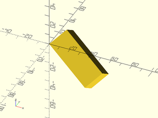

# Basic Shapes Tutorial

<!-- TOC -->

## Primitives
There are 3 built-in 3D primitive shapes that OpenSCAD provides: `cube()`, `cylinder()`,
and `sphere()`.  The BOSL2 library extends and provides alternative to these shapes so
that they support more features, and more ways to simply reorient them.


### 3D Cubes
BOSL2 overrides the built-in `cube()` module.  It still can be used as you expect from the built-in:

```openscad
include <BOSL2/std.scad>
cube(100);
```


```openscad
include <BOSL2/std.scad>
cube(100, center=true);
```


```openscad
include <BOSL2/std.scad>
cube([50,40,20], center=true);
```


It is also enhanced to allow you to anchor, spin, orient, and attach it.

You can use `anchor=` similarly to how you use it with `rect()` or `oval()`,
except you can also anchor vertically in 3D, allowing anchoring to faces, edges,
and corners:

```openscad
include <BOSL2/std.scad>
cube([50,40,20], anchor=BOTTOM);
```


```openscad
include <BOSL2/std.scad>
cube([50,40,20], anchor=TOP+BACK);
```


```openscad
include <BOSL2/std.scad>
cube([50,40,20], anchor=TOP+FRONT+LEFT);
```


You can use `spin=` to rotate around the Z axis:

```openscad
include <BOSL2/std.scad>
cube([50,40,20], anchor=FRONT, spin=30);
```


3D objects also gain the ability to use an extra trick with `spin=`;
if you pass a list of `[X,Y,Z]` rotation angles to `spin=`, it will
rotate by the three given axis angles, similar to using `rotate()`:

```openscad
include <BOSL2/std.scad>
cube([50,40,20], anchor=FRONT, spin=[15,0,30]);
```


3D objects also can be given an `orient=` argument as a vector, pointing
to where the top of the shape should be rotated towards.

```openscad
include <BOSL2/std.scad>
cube([50,40,20], orient=UP+BACK+RIGHT);
```


If you use `anchor=`, `spin=`, and `orient=` together, the anchor is performed
first, then the spin, then the orient:

```openscad
include <BOSL2/std.scad>
cube([50,40,20], anchor=FRONT);
```


```openscad
include <BOSL2/std.scad>
cube([50,40,20], anchor=FRONT, spin=45);
```


```openscad
include <BOSL2/std.scad>
cube([50,40,20], anchor=FRONT, spin=45, orient=UP+FWD+RIGHT);
```


BOSL2 provides a `cuboid()` module that expands on `cube()`, by providing
rounding and chamfering of edges.  You can use it similarly to `cube()`,
except that `cuboid()` centers by default.

You can round the edges with the `rounding=` argument:

```openscad
include <BOSL2/std.scad>
cuboid([100,80,60], rounding=20);
```


Similarly, you can chamfer the edges with the `chamfer=` argument:

```openscad
include <BOSL2/std.scad>
cuboid([100,80,60], chamfer=10);
```


You can round only some edges, by using the `edges=` arguments.  It can be
given a few types of arguments. If you gave it a vector pointed at a face,
it will only round the edges surrounding that face:

```openscad
include <BOSL2/std.scad>
cuboid([100,80,60], rounding=20, edges=TOP);
```


```openscad
include <BOSL2/std.scad>
cuboid([100,80,60], rounding=20, edges=RIGHT);
```


If you give `edges=` a vector pointing at a corner, it will round all edges
that meet at that corner:

```openscad
include <BOSL2/std.scad>
cuboid([100,80,60], rounding=20, edges=RIGHT+FRONT+TOP);
```


```openscad
include <BOSL2/std.scad>
cuboid([100,80,60], rounding=20, edges=LEFT+FRONT+TOP);
```


If you give `edges=` a vector pointing at an edge, it will round only that edge:

```openscad
include <BOSL2/std.scad>
cuboid([100,80,60], rounding=10, edges=FRONT+TOP);
```


```openscad
include <BOSL2/std.scad>
cuboid([100,80,60], rounding=10, edges=RIGHT+FRONT);
```


If you give the string "X", "Y", or "Z", then all edges aligned with the specified
axis will be rounded:

```openscad
include <BOSL2/std.scad>
cuboid([100,80,60], rounding=10, edges="X");
```


```openscad
include <BOSL2/std.scad>
cuboid([100,80,60], rounding=10, edges="Y");
```


```openscad
include <BOSL2/std.scad>
cuboid([100,80,60], rounding=10, edges="Z");
```


If you give a list of edge specs, then all edges referenced in the list will
be rounded:

```openscad
include <BOSL2/std.scad>
cuboid([100,80,60], rounding=10, edges=[TOP,"Z",BOTTOM+RIGHT]);
```


The default value for `edges=` is `EDGES_ALL`, which is all edges.  You can also
give an `except_edges=` argument that specifies edges to NOT round:

```openscad
include <BOSL2/std.scad>
cuboid([100,80,60], rounding=10, except_edges=BOTTOM+RIGHT);
```


You can give the `except_edges=` argument any type of argument that you can
give to `edges=`:

```openscad
include <BOSL2/std.scad>
cuboid([100,80,60], rounding=10, except_edges=[BOTTOM,"Z",TOP+RIGHT]);
```


You can give both `edges=` and `except_edges=`, to simplify edge specs:

```openscad
include <BOSL2/std.scad>
cuboid([100,80,60], rounding=10, edges=[TOP,FRONT], except_edges=TOP+FRONT);
```


You can specify what edges to chamfer similarly:

```openscad
include <BOSL2/std.scad>
cuboid([100,80,60], chamfer=10, edges=[TOP,FRONT], except_edges=TOP+FRONT);
```


### 3D Cylinder
BOSL2 overrides the built-in `cylinder()` module.  It still can be used as you
expect from the built-in:

```openscad
include <BOSL2/std.scad>
cylinder(r=50,h=50);
```


```openscad
include <BOSL2/std.scad>
cylinder(r=50,h=50,center=true);
```


```openscad
include <BOSL2/std.scad>
cylinder(d=100,h=50,center=true);
```


```openscad
include <BOSL2/std.scad>
cylinder(d1=100,d2=80,h=50,center=true);
```


You can also anchor, spin, orient, and attach like the `cuboid()` module:

```openscad
include <BOSL2/std.scad>
cylinder(r=50, h=50, anchor=TOP+FRONT);
```


```openscad
include <BOSL2/std.scad>
cylinder(r=50, h=50, anchor=BOTTOM+LEFT);
```


```openscad
include <BOSL2/std.scad>
cylinder(r=50, h=50, anchor=BOTTOM+LEFT, spin=30);
```


```openscad
include <BOSL2/std.scad>
cylinder(r=50, h=50, anchor=BOTTOM, orient=UP+BACK+RIGHT);
```


BOSL2 provides a `cyl()` module that expands on `cylinder()`, by providing
rounding and chamfering of edges.  You can use it similarly to `cylinder()`,
except that `cyl()` centers the cylinder by default.

```openscad
include <BOSL2/std.scad>
cyl(r=60, l=100);
```


```openscad
include <BOSL2/std.scad>
cyl(d=100, l=100);
```


```openscad
include <BOSL2/std.scad>
cyl(d=100, l=100, anchor=TOP);
```


You can round the edges with the `rounding=` argument:

```openscad
include <BOSL2/std.scad>
cyl(d=100, l=100, rounding=20);
```


Similarly, you can chamfer the edges with the `chamfer=` argument:

```openscad
include <BOSL2/std.scad>
cyl(d=100, l=100, chamfer=10);
```


You can specify rounding and chamfering for each end individually:

```openscad
include <BOSL2/std.scad>
cyl(d=100, l=100, rounding1=20);
```


```openscad
include <BOSL2/std.scad>
cyl(d=100, l=100, rounding2=20);
```


```openscad
include <BOSL2/std.scad>
cyl(d=100, l=100, chamfer1=10);
```


```openscad
include <BOSL2/std.scad>
cyl(d=100, l=100, chamfer2=10);
```


You can even mix and match rounding and chamfering:

```openscad
include <BOSL2/std.scad>
cyl(d=100, l=100, rounding1=20, chamfer2=10);
```


```openscad
include <BOSL2/std.scad>
cyl(d=100, l=100, rounding2=20, chamfer1=10);
```


### 3D Spheres
BOSL2 overrides the built-in `sphere()` module.  It still can be used as you
expect from the built-in:

```openscad
include <BOSL2/std.scad>
sphere(r=50);
```


```openscad
include <BOSL2/std.scad>
sphere(d=100);
```


You can anchor, spin, and orient `sphere()`s, much like you can with `cylinder()`
and `cube()`:

```openscad
include <BOSL2/std.scad>
sphere(d=100, anchor=FRONT);
```


```openscad
include <BOSL2/std.scad>
sphere(d=100, anchor=FRONT, spin=30);
```


```openscad
include <BOSL2/std.scad>
sphere(d=100, anchor=BOTTOM, orient=RIGHT+TOP);
```


BOSL2 also provides `spheroid()`, which enhances `sphere()` with a few features
like the `circum=` and `style=` arguments:

You can use the `circum=true` argument to force the sphere to circumscribe the
ideal sphere, as opposed to the default inscribing:

```openscad
include <BOSL2/std.scad>
spheroid(d=100, circum=true);
```


The `style=` argument can choose the way that the sphere will be constructed:
The "orig" style matches the `sphere()` built-in's construction. 

```openscad
include <BOSL2/std.scad>
spheroid(d=100, style="orig", $fn=20);
```


The "aligned" style will ensure that there is a vertex at each axis extrema,
so long as `$fn` is a multiple of 4.

```openscad
include <BOSL2/std.scad>
spheroid(d=100, style="aligned", $fn=20);
```


The "stagger" style will stagger the triangulation of the vertical rows:

```openscad
include <BOSL2/std.scad>
spheroid(d=100, style="stagger", $fn=20);
```


The "icosa" style will make for roughly equal-sized triangles for the entire
sphere surface, based on subdividing an icosahedron.  This style will round the
effective `$fn` to a multiple of 5 when constructing the spheroid:

```openscad
include <BOSL2/std.scad>
spheroid(d=100, style="icosa", $fn=20);
```


The "octa" style will also make for roughly equal-sized triangles for the entire
sphere surface, but based on subdividing an octahedron.  This is useful in that it
guarantees vertices at the axis extrema.  This style will round the effective `$fn`
to a multiple of 4 when constructing the spheroid:

```openscad
include <BOSL2/std.scad>
spheroid(d=100, style="octa", $fn=20);
```


