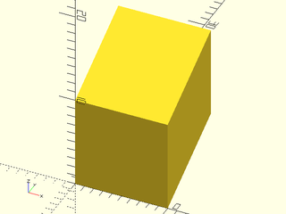

# Transforms Tutorial

<!-- TOC -->

## Translation
The `translate()` command is very simple:
```openscad
include <BOSL2/std.scad>
#sphere(d=20);
translate([0,0,30]) sphere(d=20);
```


But at a glance, or when the formula to calculate the move is complex, it can be difficult to see
just what axis is being moved along, and in which direction.  It's also a bit verbose for such a
frequently used command.  For these reasons, BOSL2 provides you with shortcuts for each direction.
These shortcuts are `up()`, `down()`, `fwd()`, `back()`, `left()`, and `right()`:
```openscad
include <BOSL2/std.scad>
#sphere(d=20);
up(30) sphere(d=20);
```


```openscad
include <BOSL2/std.scad>
#sphere(d=20);
down(30) sphere(d=20);
```


```openscad
include <BOSL2/std.scad>
#sphere(d=20);
fwd(30) sphere(d=20);
```


```openscad
include <BOSL2/std.scad>
#sphere(d=20);
back(30) sphere(d=20);
```


```openscad
include <BOSL2/std.scad>
#sphere(d=20);
left(30) sphere(d=20);
```


```openscad
include <BOSL2/std.scad>
#sphere(d=20);
right(30) sphere(d=20);
```


There is also a more generic `move()` command that can work just like `translate()`, or you can
specify the motion on each axis more clearly:
```openscad
include <BOSL2/std.scad>
#sphere(d=20);
move([30,-10]) sphere(d=20);
```


```openscad
include <BOSL2/std.scad>
#sphere(d=20);
move(x=30,y=10) sphere(d=20);
```


## Scaling
The `scale()` command is also fairly simple:
```openscad
include <BOSL2/std.scad>
scale(2) cube(10, center=true);
```


```openscad
include <BOSL2/std.scad>
scale([1,2,3]) cube(10, center=true);
```


If you want to only change the scaling on one axis, though, BOSL2 provides clearer
commands to do just that; `xscale()`, `yscale()`, and `zscale()`:
```openscad
include <BOSL2/std.scad>
xscale(2) cube(10, center=true);
```

```openscad
include <BOSL2/std.scad>
yscale(2) cube(10, center=true);
```

```openscad
include <BOSL2/std.scad>
zscale(2) cube(10, center=true);
```


## Rotation
The `rotate()` command is fairly straightforward:
```openscad
include <BOSL2/std.scad>
rotate([0,30,0]) cube(20, center=true);
```


It is also a bit verbose, and can, at a glance, be difficult to tell just how it is rotating.
BOSL2 provides shortcuts for rotating around each axis, for clarity; `xrot()`, `yrot()`, and `zrot()`:
```openscad
include <BOSL2/std.scad>
xrot(30) cube(20, center=true);
```


```openscad
include <BOSL2/std.scad>
yrot(30) cube(20, center=true);
```


```openscad
include <BOSL2/std.scad>
zrot(30) cube(20, center=true);
```


The `rot()` command is a more generic rotation command, and shorter to type than `rotate()`:
```openscad
include <BOSL2/std.scad>
rot([0,30,15]) cube(20, center=true);
```


All of the rotation shortcuts can take a `cp=` argument, that lets you specify a
centerpoint to rotate around:
```openscad
include <BOSL2/std.scad>
cp = [0,0,40];
color("blue") move(cp) sphere(d=3);
#cube(20, center=true);
xrot(45, cp=cp) cube(20, center=true);
```


```openscad
include <BOSL2/std.scad>
cp = [0,0,40];
color("blue") move(cp) sphere(d=3);
#cube(20, center=true);
yrot(45, cp=cp) cube(20, center=true);
```


```openscad
include <BOSL2/std.scad>
cp = [0,40,0];
color("blue") move(cp) sphere(d=3);
#cube(20, center=true);
zrot(45, cp=cp) cube(20, center=true);
```


You can also do a new trick with it.  You can rotate from pointing in one direction, towards another.
You give these directions using vectors:
```openscad
include <BOSL2/std.scad>
#cylinder(d=10, h=50);
rot(from=[0,0,1], to=[1,0,1]) cylinder(d=10, h=50);
```


There are several direction vectors constants and aliases you can use for clarity:

Constant                       | Value        | Direction
------------------------------ | ------------ | --------------
`CENTER`, `CTR`                | `[ 0, 0, 0]` | Centered
`LEFT`                         | `[-1, 0, 0]` | Towards X-
`RIGHT`                        | `[ 1, 0, 0]` | Towards X+
`FWD`, `FORWARD`, `FRONT`      | `[ 0,-1, 0]` | Towards Y-
`BACK`                         | `[ 0, 1, 0]` | Towards Y+
`DOWN`, `BOTTOM`, `BOT`, `BTM` | `[ 0, 0,-1]` | Towards Z-
`UP`, `TOP`                    | `[ 0, 0, 1]` | Towards Z+
`ALLNEG`                       | `[-1,-1,-1]` | Towards X-Y-Z-
`ALLPOS`                       | `[ 1, 1, 1]` | Towards X+Y+Z+

This lets you rewrite the above vector rotation more clearly as:
```openscad
include <BOSL2/std.scad>
#cylinder(d=10, h=50);
rot(from=UP, to=UP+RIGHT) cylinder(d=10, h=50);
```


## Mirroring
The standard `mirror()` command works like this:
```openscad
include <BOSL2/std.scad>
#yrot(60) cylinder(h=50, d1=20, d2=10);
mirror([1,0,0]) yrot(60) cylinder(h=50, d1=20, d2=10);
```


BOSL2 provides shortcuts for mirroring across the standard axes; `xflip()`, `yflip()`, and `zflip()`:
```openscad
include <BOSL2/std.scad>
#yrot(60) cylinder(h=50, d1=20, d2=10);
xflip() yrot(60) cylinder(h=50, d1=20, d2=10);
```


```openscad
include <BOSL2/std.scad>
#xrot(60) cylinder(h=50, d1=20, d2=10);
yflip() xrot(60) cylinder(h=50, d1=20, d2=10);
```


```openscad
include <BOSL2/std.scad>
#cylinder(h=50, d1=20, d2=10);
zflip() cylinder(h=50, d1=20, d2=10);
```


All of the flip commands can offset where the mirroring is performed:
```openscad
include <BOSL2/std.scad>
#zrot(30) cube(20, center=true);
xflip(x=-20) zrot(30) cube(20, center=true);
color("blue",0.25) left(20) cube([0.1,50,50], center=true);
```


```openscad
include <BOSL2/std.scad>
#zrot(30) cube(20, center=true);
yflip(y=20) zrot(30) cube(20, center=true);
color("blue",0.25) back(20) cube([40,0.1,40], center=true);
```


```openscad
include <BOSL2/std.scad>
#xrot(30) cube(20, center=true);
zflip(z=-20) xrot(30) cube(20, center=true);
color("blue",0.25) down(20) cube([40,40,0.1], center=true);
```


## Skewing
One transform that OpenSCAD does not perform natively is skewing.
BOSL2 provides the `skew()` command for that.  You give it multipliers
for the skews you want to perform.  The arguments used all start with `s`,
followed by the axis you want to skew along, followed by the axis that
the skewing will increase along.  For example, to skew along the X axis as
you get farther along the Y axis, use the `sxy=` argument.  If you give it
a multiplier of `0.5`, then for each unit further along the Y axis you get,
you will add `0.5` units of skew to the X axis.  Giving a negative multiplier
reverses the direction it skews:
```openscad
include <BOSL2/std.scad>
skew(sxy=0.5) cube(10,center=false);
```


```openscad
include <BOSL2/std.scad>
skew(sxz=-0.5) cube(10,center=false);
```


```openscad
include <BOSL2/std.scad>
skew(syx=-0.5) cube(10,center=false);
```


```openscad
include <BOSL2/std.scad>
skew(syz=0.5) cube(10,center=false);
```


```openscad
include <BOSL2/std.scad>
skew(szx=-0.5) cube(10,center=false);
```


```openscad
include <BOSL2/std.scad>
skew(szy=0.5) cube(10,center=false);
```



