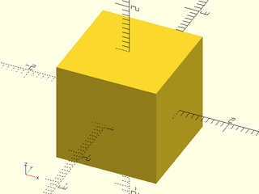
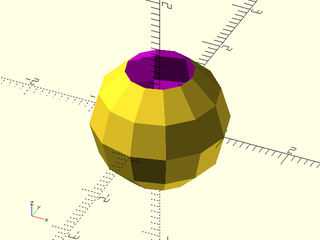
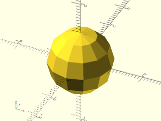
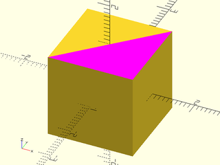
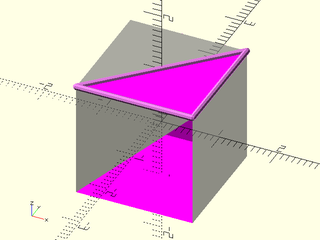

# VNF Tutorial

<!-- TOC -->

## What's a VNF?
The acronym VNF stands for Vertices 'N' Faces.  You have probably already come across the concept of vertices and faces when working with the OpenSCAD built-in module `polyhedron()`.  A `polyhedron()` in it's simplest form takes two arguments, the first being a list of vertices, and the second a list of faces, where each face is a lists of indices into the list of vertices.  For example, to make a cube, you can do:

```openscad
include <BOSL2/std.scad>
verts = [
    [-1,-1,-1], [1,-1,-1], [1,1,-1], [-1,1,-1],
    [-1,-1, 1], [1,-1, 1], [1,1, 1], [-1,1, 1]
];
faces = [
    [0,1,2], [0,2,3],  //BOTTOM
    [0,4,5], [0,5,1],  //FRONT
    [1,5,6], [1,6,2],  //RIGHT
    [2,6,7], [2,7,3],  //BACK
    [3,7,4], [3,4,0],  //LEFT
    [6,4,7], [6,5,4]   //TOP
];
polyhedron(verts, faces);
```


A VNF structure (usually just called a VNF) is just a two item list where the first item is the list of vertices, and the second item is the list of faces.  It's easier to pass a VNF to a function than it is to pass both the vertices and faces separately.

The equivalent to the `polyhedron()` module that takes a VNF instead is `vnf_polyhedron()`.  To make the same cube as a VNF, you can do it like:

```openscad
include <BOSL2/std.scad>
vnf = [
    [
        [-1,-1,-1], [1,-1,-1], [1,1,-1], [-1,1,-1],
        [-1,-1, 1], [1,-1, 1], [1,1, 1], [-1,1, 1],
    ],
    [
        [0,1,2], [0,2,3],  //BOTTOM
        [0,4,5], [0,5,1],  //FRONT
        [1,5,6], [1,6,2],  //RIGHT
        [2,6,7], [2,7,3],  //BACK
        [3,7,4], [3,4,0],  //LEFT
        [6,4,7], [6,5,4]   //TOP
    ]
];
vnf_polyhedron(vnf);
```


## Assembling a Polyhedron in Parts
A VNF does not have to contain a complete polyhedron, and the vertices contained in it do not have to be unique.  This allows the true power of VNFs: You can use the `vnf_join()` function to take multiple partial-polyhedron VNFs and merge them into a more complete VNF.  This lets you construct a complex polyhedron in parts, without having to keep track of all the vertices you created in other parts of it.

As an example, consider a roughly spherical polyhedron with vertices at the top and bottom poles.  You can break it down into three major parts:  The top cap, the bottom cap, and the side wall.  The top and bottom caps both have a ring of vertices linked to the top or bottom vertex in triangles, while the sides are multiple rings of vertices linked in squares.  Lets create the top cap first:

```openscad
include <BOSL2/std.scad>
cap_vnf = [
    [[0,0,1], for (a=[0:30:359.9]) spherical_to_xyz(1,a,30)], // Vertices
    [for (i=[1:12]) [0, i%12+1, i]] // Faces
];
vnf_polyhedron(cap_vnf);
```


The bottom cap is exactly the same, just mirrored:

```openscad
include <BOSL2/std.scad>
cap_vnf = [
    [[0,0,1], for (a=[0:30:359.9]) spherical_to_xyz(1,a,30)], // Vertices
    [for (i=[1:12]) [0, i%12+1, i]] // Faces
];
cap_vnf2 = zflip(cap_vnf);
vnf_polyhedron(cap_vnf2);
```


To create the sides, we can make use of the `vnf_vertex_array()` function to turn a row-column grid of vertices into a VNF. The `col_wrap=true` argument tells it to connect the vertices of the last column to the vertices of the first column.  The `caps=false` argument tells it that we don't want it to create caps for the ends of the first and last rows:

```openscad
include <BOSL2/std.scad>
wall_vnf = vnf_vertex_array(
    points=[
        for (phi = [30:30:179.9]) [
            for (theta = [0:30:359.9])
            spherical_to_xyz(1,theta,phi)
        ]
    ],
    col_wrap=true, caps=false
);
vnf_polyhedron(wall_vnf);
```


Putting all the parts together with `vnf_join()`, we get:

```openscad
include <BOSL2/std.scad>
cap_vnf = [
    [[0,0,1], for (a=[0:30:359.9]) spherical_to_xyz(1,a,30)], // Vertices
    [for (i=[1:12]) [0, i%12+1, i]] // Faces
];
cap_vnf2 = zflip(cap_vnf);
wall_vnf = vnf_vertex_array(
    points=[
        for (phi = [30:30:179.9]) [
            for (theta = [0:30:359.9])
            spherical_to_xyz(1,theta,phi)
        ]
    ],
    col_wrap=true, caps=false
);
vnf = vnf_join([cap_vnf,cap_vnf2,wall_vnf]);
vnf_polyhedron(vnf);
```


Which is now a complete manifold polyhedron.


## Debugging a VNF
One of the critical tasks in creating a polyhedron is making sure that all of your faces are facing the correct way.  This is also true for VNFs.  The best way to find reversed faces is simply to select the View→Thrown Together menu item in OpenSCAD while viewing your polyhedron or VNF.  Any purple faces are reversed, and you will need to fix them.  For example, one of the two top face triangles on this cube is reversed:

```openscad
include <BOSL2/std.scad>
vnf = [
    [
        [-1,-1,-1], [1,-1,-1], [1,1,-1], [-1,1,-1],
        [-1,-1, 1], [1,-1, 1], [1,1, 1], [-1,1, 1],
    ],
    [
        [0,1,2], [0,2,3],  //BOTTOM
        [0,4,5], [0,5,1],  //FRONT
        [1,5,6], [1,6,2],  //RIGHT
        [2,6,7], [2,7,3],  //BACK
        [3,7,4], [3,4,0],  //LEFT
        [6,4,7], [6,4,5]   //TOP
    ]
];
vnf_polyhedron(vnf);
```


Another way to find problems with your VNF, is to use the `vnf_validate()` module, which will ECHO problems to the console, and will attempt to display where the issue is.  This can find a lot more types of non-manifold errors, but can be slow:


```openscad
include <BOSL2/std.scad>
vnf = [
    [
        [-1,-1,-1], [1,-1,-1], [1,1,-1], [-1,1,-1],
        [-1,-1, 1], [1,-1, 1], [1,1, 1], [-1,1, 1],
    ],
    [
        [0,1,2], [0,2,3],  //BOTTOM
        [0,4,5], //FRONT
        [1,5,6], [1,6,2],  //RIGHT
        [2,6,7], [2,7,3],  //BACK
        [3,7,4], [3,4,0],  //LEFT
        [6,4,7], [6,4,5]   //TOP
    ]
];
vnf_validate(vnf, size=0.1);
```


```text
ECHO: "ERROR REVERSAL (violet): Faces Reverse Across Edge at [[-1, -1, 1], [1, -1, 1]]"
ECHO: "ERROR REVERSAL (violet): Faces Reverse Across Edge at [[1, -1, 1], [1, 1, 1]]"
ECHO: "ERROR REVERSAL (violet): Faces Reverse Across Edge at [[1, 1, 1], [-1, -1, 1]]"
```

The `vnf_validate()` module will stop after displaying the first found problem type, so once you fix those issues, you will want to run it again to display any other remaining issues.  For example, the reversed face in the above example is hiding a non-manifold hole in the front face:

```openscad
include <BOSL2/std.scad>
vnf = [
    [
        [-1,-1,-1], [1,-1,-1], [1,1,-1], [-1,1,-1],
        [-1,-1, 1], [1,-1, 1], [1,1, 1], [-1,1, 1],
    ],
    [
        [0,1,2], [0,2,3],  //BOTTOM
        [0,4,5], //FRONT
        [1,5,6], [1,6,2],  //RIGHT
        [2,6,7], [2,7,3],  //BACK
        [3,7,4], [3,4,0],  //LEFT
        [6,4,7], [6,5,4]   //TOP
    ]
];
vnf_validate(vnf, size=0.1);
```


```text
ECHO: "ERROR HOLE_EDGE (red): Edge bounds Hole at [[-1, -1, -1], [1, -1, -1]]"
ECHO: "ERROR HOLE_EDGE (red): Edge bounds Hole at [[-1, -1, -1], [1, -1, 1]]"
ECHO: "ERROR HOLE_EDGE (red): Edge bounds Hole at [[1, -1, -1], [1, -1, 1]]"
```

