# LibFile: attachments.scad

The modules in this file allows you to attach one object to another by making one object the child of another object.
You can place the child object in relation to its parent object and control the position and orientation
relative to the parent.  The modifiers allow you to treat children in different ways that simple union, such
as differencing them from the parent, or changing their color.  Attachment only works when the parent and child
are both written to support attachment.  Also included in this file  are the tools to make your own "attachable" objects.

To use, add the following lines to the beginning of your file:

    include <BOSL2/std.scad>

## Table of Contents

1. [Section: Terminology and Shortcuts](#section-terminology-and-shortcuts)
    1. [Subsection: Anchor](#subsection-anchor)
    2. [Subsection: Spin](#subsection-spin)
    3. [Subsection: Orient](#subsection-orient)
    4. [Subsection: Specifying Directions](#subsection-specifying-directions)
    5. [Subsection: Specifying Faces](#subsection-specifying-faces)
    6. [Subsection: Specifying Edges](#subsection-specifying-edges)
    7. [Subsection: Specifying Corners](#subsection-specifying-corners)
    

2. [Section: Attachment Positioning](#section-attachment-positioning)
    - [`position()`](#module-position)
    - [`orient()`](#module-orient)
    - [`attach()`](#module-attach)

3. [Section: Attachment Modifiers](#section-attachment-modifiers)
    - [`tags()`](#module-tags)
    - [`diff()`](#module-diff)
    - [`intersect()`](#module-intersect)
    - [`hulling()`](#module-hulling)
    - [`recolor()`](#module-recolor)
    - [`hide()`](#module-hide)
    - [`show()`](#module-show)

4. [Section: Attachable Masks](#section-attachable-masks)
    - [`edge_mask()`](#module-edge_mask)
    - [`corner_mask()`](#module-corner_mask)
    - [`face_profile()`](#module-face_profile)
    - [`edge_profile()`](#module-edge_profile)
    - [`corner_profile()`](#module-corner_profile)

5. [Section: Making your objects attachable](#section-making-your-objects-attachable)
    - [`attachable()`](#module-attachable)
    - [`reorient()`](#function-reorient)
    - [`named_anchor()`](#function-named_anchor)

6. [Section: Visualizing Anchors](#section-visualizing-anchors)
    - [`show_anchors()`](#module-show_anchors)
    - [`anchor_arrow()`](#module-anchor_arrow)
    - [`anchor_arrow2d()`](#module-anchor_arrow2d)
    - [`expose_anchors()`](#module-expose_anchors)
    - [`frame_ref()`](#module-frame_ref)


## Section: Terminology and Shortcuts

This library adds the concept of anchoring, spin and orientation to the `cube()`, `cylinder()`
and `sphere()` builtins, as well as to most of the shapes provided by this library itself.
- An anchor is a place on an object which you can align the object to, or attach other objects
  to using `attach()` or `position()`.  An anchor has a position, a direction, and a spin.
  The direction and spin are used to orient other objects to match when using `attach()`.
- Spin is a simple rotation around the Z axis.
- Orientation is rotating an object so that its top is pointed towards a given vector.
An object will first be translated to its anchor position, then spun, then oriented.
For a detailed step-by-step explanation of attachments, see the [[Attachments Tutorial|Tutorial-Attachments]].

For describing directions, faces, edges, and corners the library provides a set of shortcuts
all based on combinations of unit direction vectors.  You can use these for anchoring and orienting
attachable objects.  You can also them to specify edge sets for rounding or chamfering cuboids,
or for placing edge, face and corner masks.

## Subsection: Anchor

Anchoring is specified with the `anchor` argument in most shape modules.  Specifying `anchor`
when creating an object will translate the object so that the anchor point is at the origin
(0,0,0).  Anchoring always occurs before spin and orientation are applied.

An anchor can be referred to in one of two ways; as a directional vector, or as a named anchor string.

When given as a vector, it points, in a general way, towards the face, edge, or corner of the
object that you want the anchor for, relative to the center of the object.  You can simply
specify a vector like `[0,0,1]` to anchor an object at the Z+ end, but you can also use
directional constants with names like `TOP`, `BOTTOM`, `LEFT`, `RIGHT` and `BACK` that you can add together
to specify anchor points.  See [specifying directions](attachments.scad#subsection-specifying-directions)
below for the full list of pre-defined directional constants.

For example:
- `[0,0,1]` is the same as `TOP` and refers to the center of the top face.
- `[-1,0,1]` is the same as `TOP+LEFT`, and refers to the center of the top-left edge.
- `[1,1,-1]` is the same as `BOTTOM+BACK+RIGHT`, and refers to the bottom-back-right corner.

When the object is cubical or rectangular in shape the anchors must have zero or one values
for their components and they refer to the face centers, edge centers, or corners of the object.
The direction of a face anchor will be perpendicular to the face, pointing outward.  The direction of a edge anchor
will be the average of the anchor directions of the two faces the edge is between.  The direction
of a corner anchor will be the average of the anchor directions of the three faces the corner is
on.

When the object is cylindrical, conical, or spherical in nature, the anchors will be located
around the surface of the cylinder, cone, or sphere, relative to the center.
You can generally use an arbitrary vector to get an anchor positioned anywhere on the curved
surface of such an object, and the anchor direction will be the surface normal at the anchor location.
However, for anchor component pointing toward the flat face should be either -1, 1, or 0, and
anchors that point diagonally toward one of the flat faces will select a point on the edge.

For objects in two dimensions, the natural expectation is for TOP and BOTTOM to refer to the Y direction
of the shape.  To support this, if you give an anchor in 2D that has anchor.y=0 then the Z component
will be mapped to the Y direction.  This  means you can use TOP and BOTTOM for anchors of 2D objects.
But remember that TOP and BOTTOM are three dimensional vectors and this is a special interpretation
for 2d anchoring.

Some more complex objects, like screws and stepper motors, have named anchors to refer to places
on the object that are not at one of the standard faces, edges or corners.  For example, stepper
motors have anchors for `"screw1"`, `"screw2"`, etc. to refer to the various screwholes on the
stepper motor shape.  The names, positions, directions, and spins of these anchors are
specific to the object, and are documented when they exist.

## Subsection: Spin

Spin is specified with the `spin` argument in most shape modules.  Specifying a scalar `spin`
when creating an object will rotate the object counter-clockwise around the Z axis by the given
number of degrees.  If given as a 3D vector, the object will be rotated around each of the X, Y, Z
axes by the number of degrees in each component of the vector.  Spin is always applied after
anchoring, and before orientation.  Since spin is applied after anchoring it is not what
you might think of intuitively as spinning the shape.  To do that, apply `zrot()` to the shape before anchoring.

## Subsection: Orient

Orientation is specified with the `orient` argument in most shape modules.  Specifying `orient`
when creating an object will rotate the object such that the top of the object will be pointed
at the vector direction given in the `orient` argument.  Orientation is always applied after
anchoring and spin.  The constants `UP`, `DOWN`, `FRONT`, `BACK`, `LEFT`, and `RIGHT` can be
added together to form the directional vector for this.  ie: `LEFT+BACK`

## Subsection: Specifying Directions

You can use direction vectors to specify anchors for objects or to specify edges, faces, and
corners of cubes.  You can simply specify these direction vectors numerically, but another
option is to use named constants for direction vectors.  These constants define unit vectors
for the six axis directions as shown below.

**Figure 1:** Named constants for direction vectors.  Some directions have more than one name.

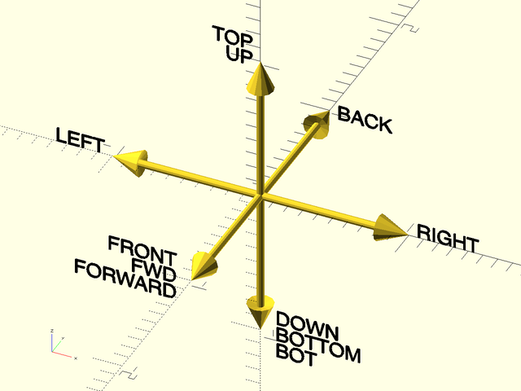

<br clear="all" />

**Figure 2:** Named constants for direction vectors in 2D.  For anchors the TOP and BOTTOM directions are collapsed into 2D as shown here, but do not try to use TOP or BOTTOM as 2D directions in other situations.

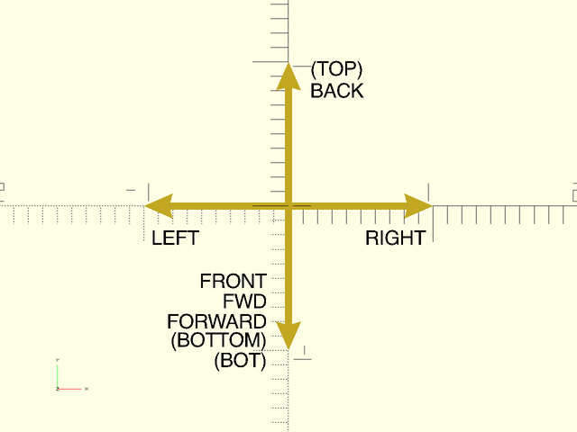

<br clear="all" />

## Subsection: Specifying Faces

Modules operating on faces accept a list of faces to describe the faces to operate on.  Each
face is given by a vector that points to that face.  Attachments of cuboid objects onto their faces also
work by choosing an attachment face with a single vector in the same manner.

**Figure 1:** The six faces of the cube.  Some have faces have more than one name.

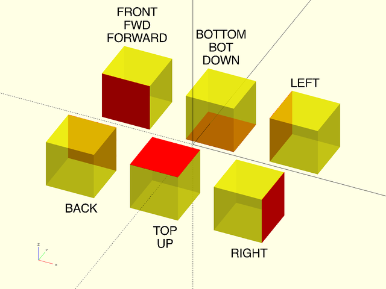

<br clear="all" />

## Subsection: Specifying Edges

Modules operating on edges use two arguments to describe the edge set they will use: The `edges` argument
is a list of edge set descriptors to include in the edge set, and the `except` argument is a list of
edge set descriptors to remove from the edge set.
The default value for `edges` is `"ALL"`, the set of all edges.
The default value for `except` is the    empty set, meaning no edges are removed.
If either argument is just a single edge set
descriptor it can be passed directly rather than in a singleton list.
Each edge set descriptor must be one of:
- A vector pointing towards an edge, indicating that single edge.
- A vector pointing towards a face, indicating all edges surrounding that face.
- A vector pointing towards a corner, indicating all edges touching that corner.
- The string `"X"`, indicating all X axis aligned edges.
- The string `"Y"`, indicating all Y axis aligned edges.
- The string `"Z"`, indicating all Z axis aligned edges.
- The string `"ALL"`, indicating all edges.
- The string `"NONE"`, indicating no edges at all.
- A 3x4 array, where each entry corresponds to one of the 12 edges and is set to 1 if that edge is included and 0 if the edge is not.  The edge ordering is:
    ```
    [
        [Y-Z-, Y+Z-, Y-Z+, Y+Z+],
        [X-Z-, X+Z-, X-Z+, X+Z+],
        [X-Y-, X+Y-, X-Y+, X+Y+]
    ]
    ```
You can specify edge descriptors directly by giving a vector, or you can use sums of the
named direction vectors described above.  Below we show all of the edge sets you can
describe with sums of the direction vectors, and then we show some examples of combining
edge set descriptors.

**Figure 1:** Vectors pointing toward an edge select that single edge

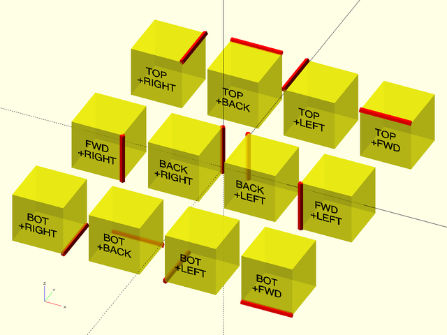

<br clear="all" />

**Figure 2:** Vectors pointing toward a face select all edges surrounding that face.

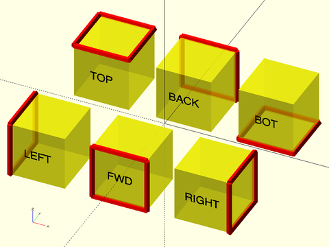

<br clear="all" /><br/>

**Figure 3:** Vectors pointing toward a corner select all edges surrounding that corner.

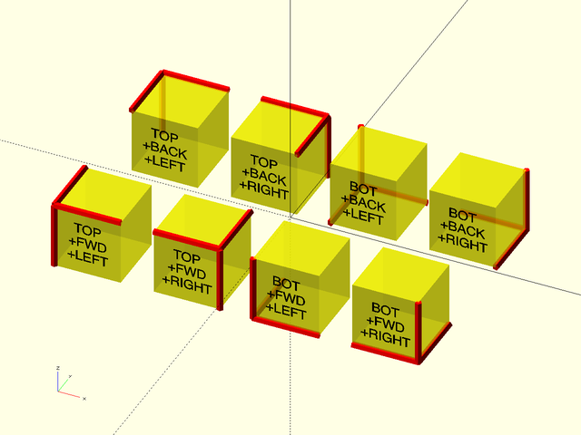

<br clear="all" />

**Figure 4:** Named Edge Sets

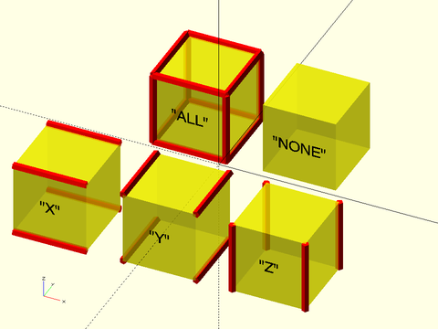

<br clear="all" /><br/>

**Figure 5:** Next are some examples showing how you can combine edge descriptors to obtain different edge sets.    You can specify the top front edge with a numerical vector or by combining the named direction vectors.  If you combine them as a list you get all the edges around the front or top faces.  Adding `except` removes an edge.

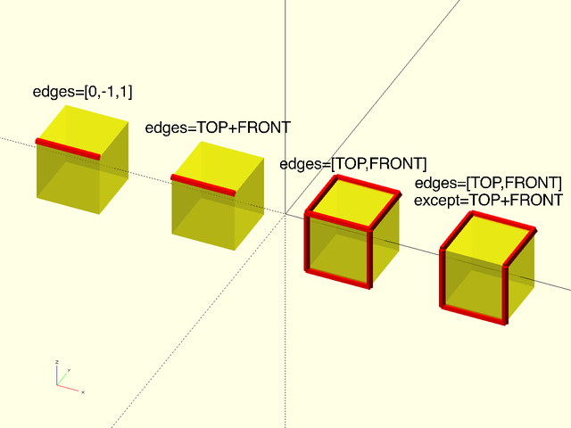

<br clear="all" />

**Figure 6:** Using `except=BACK` removes the four edges surrounding the back face if they are present in the edge set.  In the first example only one edge needs to be removed.  In the second example we remove two of the Z-aligned edges.  The third example removes all four back edges from the default edge set of all edges.  You can explicitly give `edges="ALL"` but it is not necessary, since this is the default.  In the fourth example, the edge set of Y-aligned edges contains no back edges, so the `except` parameter has no effect.

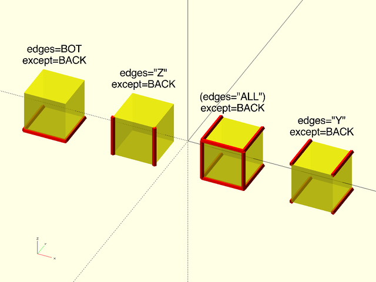

<br clear="all" />

**Figure 7:** On the left `except` is a list to remove two edges.  In the center we show a corner edge set defined by a numerical vector, and at the right we remove that same corner edge set with named direction vectors.

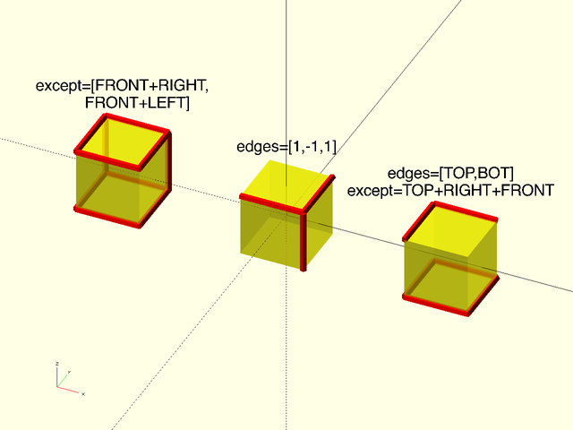

<br clear="all" />

## Subsection: Specifying Corners

Modules operating on corners use two arguments to describe the corner set they will use: The `corners` argument
is a list of corner set descriptors to include in the corner set, and the `except` argument is a list of
corner set descriptors to remove from the corner set.
The default value for `corners` is `"ALL"`, the set of all corners.
The default value for `except` is the   empty set, meaning no corners are removed.
If either argument is just a single corner set
descriptor it can be passed directly rather than in a singleton list.
Each corner set descriptor must be one of:
- A vector pointing towards a corner, indicating that corner.
- A vector pointing towards an edge indicating both corners at the ends of that edge.
- A vector pointing towards a face, indicating all the corners of that face.
- The string `"ALL"`, indicating all corners.
- The string `"NONE"`, indicating no corners at all.
- A length 8 vector where each entry corresponds to a corner and is 1 if the corner is included and 0 if it is excluded.  The corner ordering is
    ```
    [X-Y-Z-, X+Y-Z-, X-Y+Z-, X+Y+Z-, X-Y-Z+, X+Y-Z+, X-Y+Z+, X+Y+Z+]
    ```
You can specify corner descriptors directly by giving a vector, or you can use sums of the
named direction vectors described above.  Below we show all of the corner sets you can
describe with sums of the direction vectors and then we show some examples of combining
corner set descriptors.

**Figure 1:** Vectors pointing toward a corner select that corner.

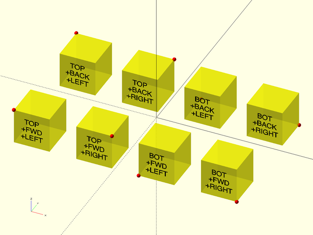

<br clear="all" />

**Figure 2:** Vectors pointing toward an edge select the corners and the ends of the edge.

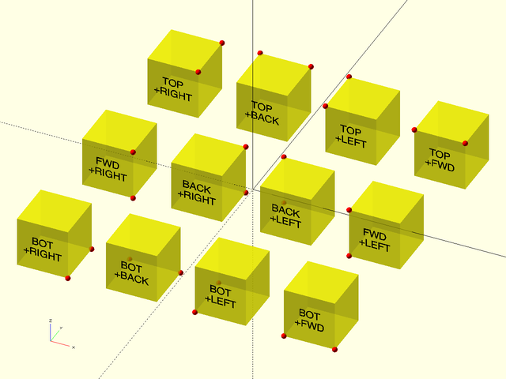

<br clear="all" />

**Figure 3:** Vectors pointing toward a face select the corners of the face.

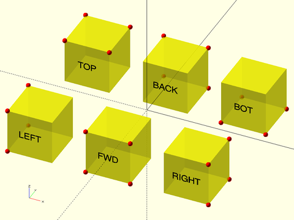

<br clear="all" /><br/>

**Figure 4:** Corners by name

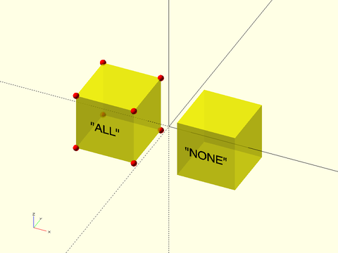

<br clear="all" /><br/>

**Figure 5:** Next are some examples showing how you can combine corner descriptors to obtain different corner sets.   You can specify corner sets numerically or by adding together named directions.  The third example shows a list of two corner specifications, giving all the corners on the front face or the right face.

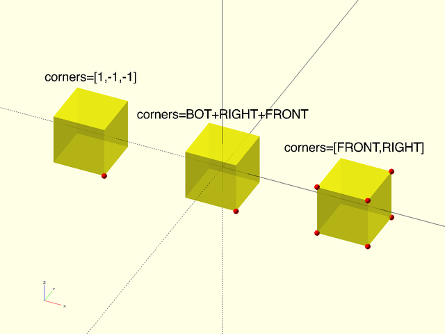

<br clear="all" />

**Figure 6:** Corners for one edge, two edges, and all the edges except the two on one edge.  Note that since the default is all edges, you only need to give the except argument in this case:

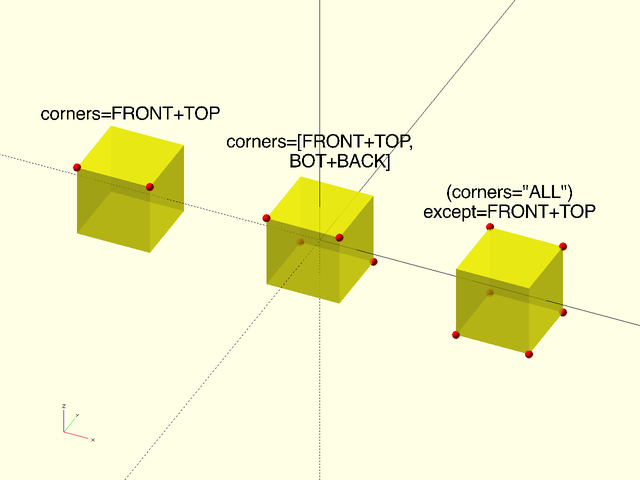

<br clear="all" />

**Figure 7:** The first example shows a single corner removed from the top corners using a numerical vector.  The second one shows removing a set of two corner descriptors from the implied set of all corners.

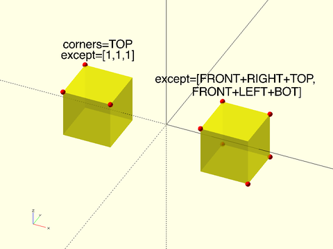

<br clear="all" />

## Section: Attachment Positioning


### Module: position()

**Usage:** 

- position(from) {...}

**Topics:** [Attachments](Topics#attachments)

**Description:** 

Attaches children to a parent object at an anchor point.  For a more step-by-step explanation
of attachments, see the [[Attachments Tutorial|Tutorial-Attachments]].

**Arguments:** 

<abbr title="These args can be used by position or by name.">By&nbsp;Position</abbr> | What it does
-------------------- | ------------
`from`               | The vector, or name of the parent anchor point to attach to.

**See Also:** [attachable()](#module-attachable), [attach()](#module-attach), [orient()](#module-orient)

**Example 1:** 

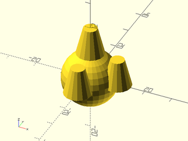

    include <BOSL2/std.scad>
    spheroid(d=20) {
        position(TOP) cyl(l=10, d1=10, d2=5, anchor=BOTTOM);
        position(RIGHT) cyl(l=10, d1=10, d2=5, anchor=BOTTOM);
        position(FRONT) cyl(l=10, d1=10, d2=5, anchor=BOTTOM);
    }

<br clear="all" /><br/>

---

### Module: orient()

**Usage:** 

- orient(dir, &lt;spin=&gt;) ...
- orient(anchor=, &lt;spin=&gt;) ...

**Topics:** [Attachments](Topics#attachments)

**Description:** 

Orients children such that their top is tilted towards the given direction, or towards the
direction of a given anchor point on the parent.  For a more step-by-step explanation of
attachments, see the [[Attachments Tutorial|Tutorial-Attachments]].

**Arguments:** 

<abbr title="These args can be used by position or by name.">By&nbsp;Position</abbr> | What it does
-------------------- | ------------
`dir`                | The direction to orient towards.

<abbr title="These args must be used by name, ie: name=value">By&nbsp;Name</abbr> | What it does
-------------------- | ------------
`anchor`             | The anchor on the parent which you want to match the orientation of.  Use instead of `dir`.
`spin`               | The spin to add to the children.  (Overrides anchor spin.)

**See Also:** [attachable()](#module-attachable), [attach()](#module-attach)

**Example 1:** Orienting by Vector

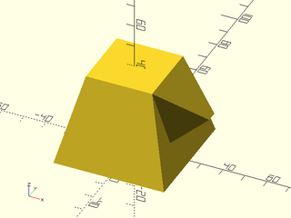

    include <BOSL2/std.scad>
    prismoid([50,50],[30,30],h=40) {
        position(TOP+RIGHT)
            orient(RIGHT)
                prismoid([30,30],[0,5],h=20,anchor=BOT+LEFT);
    }

<br clear="all" /><br/>

**Example 2:** When orienting to an anchor, the spin of the anchor may cause confusion:

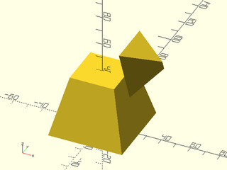

    include <BOSL2/std.scad>
    prismoid([50,50],[30,30],h=40) {
        position(TOP+RIGHT)
            orient(anchor=RIGHT)
                prismoid([30,30],[0,5],h=20,anchor=BOT+LEFT);
    }

<br clear="all" /><br/>

**Example 3:** You can override anchor spin with `spin=`.

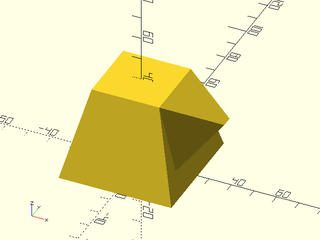

    include <BOSL2/std.scad>
    prismoid([50,50],[30,30],h=40) {
        position(TOP+RIGHT)
            orient(anchor=RIGHT,spin=0)
                prismoid([30,30],[0,5],h=20,anchor=BOT+LEFT);
    }

<br clear="all" /><br/>

**Example 4:** Or you can anchor the child from the back

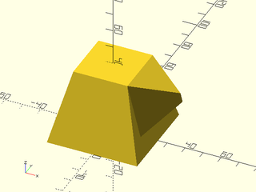

    include <BOSL2/std.scad>
    prismoid([50,50],[30,30],h=40) {
        position(TOP+RIGHT)
            orient(anchor=RIGHT)
                prismoid([30,30],[0,5],h=20,anchor=BOT+BACK);
    }

<br clear="all" /><br/>

---

### Module: attach()

**Usage:** 

- attach(from, [overlap=], [norot=]) {...}
- attach(from, to, [overlap=], [norot=]) {...}

**Topics:** [Attachments](Topics#attachments)

**Description:** 

Attaches children to a parent object at an anchor point and orientation.  Attached objects will
be overlapped into the parent object by a little bit, as specified by the `$overlap`
value (0 by default), or by the overriding `overlap=` argument.  This is to prevent OpenSCAD
from making non-manifold objects.  You can define `$overlap=` as an argument in a parent
module to set the default for all attachments to it.  For a more step-by-step explanation of
attachments, see the [[Attachments Tutorial|Tutorial-Attachments]].

**Arguments:** 

<abbr title="These args can be used by position or by name.">By&nbsp;Position</abbr> | What it does
-------------------- | ------------
`from`               | The vector, or name of the parent anchor point to attach to.
`to`                 | Optional name of the child anchor point.  If given, orients the child such that the named anchors align together rotationally.

<abbr title="These args must be used by name, ie: name=value">By&nbsp;Name</abbr> | What it does
-------------------- | ------------
`overlap`            | Amount to sink child into the parent.  Equivalent to `down(X)` after the attach.  This defaults to the value in `$overlap`, which is `0` by default.
`norot`              | If true, don't rotate children when attaching to the anchor point.  Only translate to the anchor point.

**See Also:** [attachable()](#module-attachable), [position()](#module-position), [face\_profile()](#module-face_profile), [edge\_profile()](#module-edge_profile), [corner\_profile()](#module-corner_profile)

**Example 1:** 

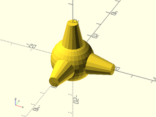

<br clear="all" />

    include <BOSL2/std.scad>
    spheroid(d=20) {
        attach(TOP) down(1.5) cyl(l=11.5, d1=10, d2=5, anchor=BOTTOM);
        attach(RIGHT, BOTTOM) down(1.5) cyl(l=11.5, d1=10, d2=5);
        attach(FRONT, BOTTOM, overlap=1.5) cyl(l=11.5, d1=10, d2=5);
    }

---

## Section: Attachment Modifiers


### Module: tags()

**Usage:** 

- tags(tags) {...}

**Topics:** [Attachments](Topics#attachments)

**Description:** 

Marks all children with the given tags, so that they will `hide()`/`show()`/`diff()`  correctly.
This is especially useful for working with children that are not attachment enhanced, such as:
- `polygon()`
- `text()`
- `projection()`
- `polyhedron()`  (or use [`vnf_polyhedron()`](vnf.scad#vnf_polyhedron))
- `linear_extrude()`  (or use [`linear_sweep()`](regions.scad#linear_sweep))
- `rotate_extrude()`
- `surface()`
- `import()`

For a more step-by-step explanation of attachments, see the [[Attachments Tutorial|Tutorial-Attachments]].

**Arguments:** 

<abbr title="These args can be used by position or by name.">By&nbsp;Position</abbr> | What it does
-------------------- | ------------
`tags`               | String containing space delimited set of tags to apply.

**See Also:** [recolor()](#module-recolor), [hide()](#module-hide), [show()](#module-show), [diff()](#module-diff), [intersect()](#module-intersect)

---

### Module: diff()

**Usage:** 

- diff(neg, [keep]) {...}
- diff(neg, pos, [keep]) {...}

**Topics:** [Attachments](Topics#attachments)

**Description:** 

If `neg` is given, takes the union of all children with tags that are in `neg`, and differences
them from the union of all children with tags in `pos`.  If `pos` is not given, then all items in
`neg` are differenced from all items not in `neg`.  If `keep` is given, all children with tags in
`keep` are then unioned with the result.  If `keep` is not given, all children without tags in
`pos` or `neg` are then unioned with the result.
Cannot be used in conjunction with `intersect()` or `hulling()` on the same parent object.

For a more step-by-step explanation of attachments, see the [[Attachments Tutorial|Tutorial-Attachments]].

**Arguments:** 

<abbr title="These args can be used by position or by name.">By&nbsp;Position</abbr> | What it does
-------------------- | ------------
`neg`                | String containing space delimited set of tag names of children to difference away.
`pos`                | String containing space delimited set of tag names of children to be differenced away from.
`keep`               | String containing space delimited set of tag names of children to keep whole.

**See Also:** [tags()](#module-tags), [recolor()](#module-recolor), [show()](#module-show), [hide()](#module-hide), [intersect()](#module-intersect)

**Example 1:** 

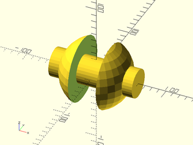

<br clear="all" />

    include <BOSL2/std.scad>
    diff("neg", "pos", keep="axle")
    sphere(d=100, $tags="pos") {
        attach(CENTER) xcyl(d=40, l=120, $tags="axle");
        attach(CENTER) cube([40,120,100], anchor=CENTER, $tags="neg");
    }

**Example 2:** Masking

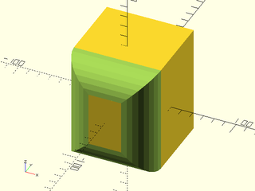

    include <BOSL2/std.scad>
    diff("mask")
    cube([80,90,100], center=true) {
        edge_mask(FWD)
            rounding_edge_mask(l=max($parent_size)*1.01, r=25);
    }

<br clear="all" /><br/>

**Example 3:** Working with Non-Attachables Like rotate\_extrude()

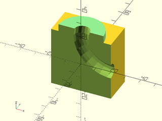

    include <BOSL2/std.scad>
    back_half()
      diff("remove")
        cuboid(40) {
          attach(TOP)
            recolor("lightgreen")
              cyl(l=10,d=30);
          position(TOP+RIGHT)
            tags("remove")
              xrot(90)
                rotate_extrude()
                  right(20)
                    circle(5);
        }

<br clear="all" /><br/>

---

### Module: intersect()

**Usage:** 

- intersect(a, [keep=]) {...}
- intersect(a, b, [keep=]) {...}

**Topics:** [Attachments](Topics#attachments)

**Description:** 

If `a` is given, takes the union of all children with tags that are in `a`, and `intersection()`s
them with the union of all children with tags in `b`.  If `b` is not given, then the union of all
items with tags in `a` are intersection()ed with the union of all items without tags in `a`.  If
`keep` is given, then the result is unioned with all the children with tags in `keep`.  If `keep`
is not given, all children without tags in `a` or `b` are unioned with the result.
Cannot be used in conjunction with `diff()` or `hulling()` on the same parent object.

For a more step-by-step explanation of attachments, see the [[Attachments Tutorial|Tutorial-Attachments]].

**Arguments:** 

<abbr title="These args can be used by position or by name.">By&nbsp;Position</abbr> | What it does
-------------------- | ------------
`a`                  | String containing space delimited set of tag names of children.
`b`                  | String containing space delimited set of tag names of children.

<abbr title="These args must be used by name, ie: name=value">By&nbsp;Name</abbr> | What it does
-------------------- | ------------
`keep`               | String containing space delimited set of tag names of children to keep whole.

**See Also:** [tags()](#module-tags), [recolor()](#module-recolor), [show()](#module-show), [hide()](#module-hide), [diff()](#module-diff)

**Example 1:** 

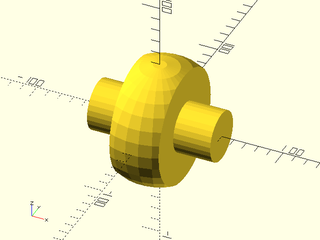

<br clear="all" />

    include <BOSL2/std.scad>
    intersect("wheel", "mask", keep="axle")
    sphere(d=100, $tags="wheel") {
        attach(CENTER) cube([40,100,100], anchor=CENTER, $tags="mask");
        attach(CENTER) xcyl(d=40, l=100, $tags="axle");
    }

**Example 2:** Working with Non-Attachables

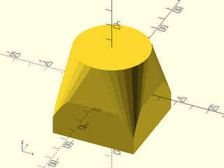

    include <BOSL2/std.scad>
    intersect("A", "B")
    cuboid(50, $tags="A") {
        tags("B")
          hull() {
            down(25)
              linear_extrude(height=0.01)
                square(55,center=true);
            up(25)
              linear_extrude(height=0.01)
                circle(d=45);
          }
    }

<br clear="all" /><br/>

---

### Module: hulling()

**Usage:** 

- hulling(a) {...}

**Topics:** [Attachments](Topics#attachments)

**Description:** 

If `a` is not given, then all children are `hull()`ed together.
If `a` is given as a string, then all children with `$tags` that are in `a` are
`hull()`ed together and the result is then unioned with all the remaining children.
Cannot be used in conjunction with `diff()` or `intersect()` on the same parent object.

For a more step-by-step explanation of attachments, see the [[Attachments Tutorial|Tutorial-Attachments]].

**Arguments:** 

<abbr title="These args can be used by position or by name.">By&nbsp;Position</abbr> | What it does
-------------------- | ------------
`a`                  | String containing space delimited set of tag names of children to hull.

**See Also:** [tags()](#module-tags), [recolor()](#module-recolor), [show()](#module-show), [hide()](#module-hide), [diff()](#module-diff), [intersect()](#module-intersect)

**Example 1:** 

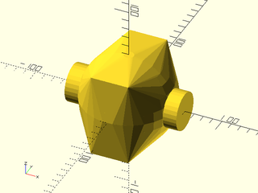

<br clear="all" />

    include <BOSL2/std.scad>
    hulling("body")
    sphere(d=100, $tags="body") {
        attach(CENTER) cube([40,90,90], anchor=CENTER, $tags="body");
        attach(CENTER) xcyl(d=40, l=120, $tags="other");
    }

---

### Module: recolor()

**Usage:** 

- recolor(c) {...}

**Topics:** [Attachments](Topics#attachments)

**Description:** 

Sets the color for children that can use the $color special variable.  For a more step-by-step
explanation of attachments, see the [[Attachments Tutorial|Tutorial-Attachments]].

**Arguments:** 

<abbr title="These args can be used by position or by name.">By&nbsp;Position</abbr> | What it does
-------------------- | ------------
`c`                  | Color name or RGBA vector.

**See Also:** [tags()](#module-tags), [hide()](#module-hide), [show()](#module-show), [diff()](#module-diff), [intersect()](#module-intersect)

**Example 1:** 

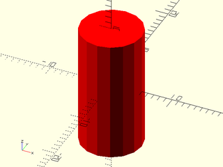

    include <BOSL2/std.scad>
    recolor("red") cyl(l=20, d=10);

<br clear="all" /><br/>

---

### Module: hide()

**Usage:** 

- hide(tags) {...}

**Topics:** [Attachments](Topics#attachments)

**Description:** 

Hides all children with the given tags.  Overrides any previous `hide()` or `show()` calls.
For a more step-by-step explanation of attachments, see the [[Attachments Tutorial|Tutorial-Attachments]].

**See Also:** [tags()](#module-tags), [recolor()](#module-recolor), [show()](#module-show), [diff()](#module-diff), [intersect()](#module-intersect)

**Example 1:** 

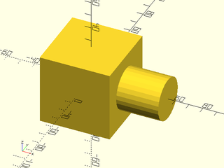

    include <BOSL2/std.scad>
    hide("A") cube(50, anchor=CENTER, $tags="Main") {
        attach(LEFT, BOTTOM) cylinder(d=30, l=30, $tags="A");
        attach(RIGHT, BOTTOM) cylinder(d=30, l=30, $tags="B");
    }

<br clear="all" /><br/>

---

### Module: show()

**Usage:** 

- show(tags) {...}

**Topics:** [Attachments](Topics#attachments)

**Description:** 

Shows only children with the given tags.  Overrides any previous `hide()` or `show()` calls.
For a more step-by-step explanation of attachments, see the [[Attachments Tutorial|Tutorial-Attachments]].

**See Also:** [tags()](#module-tags), [recolor()](#module-recolor), [hide()](#module-hide), [diff()](#module-diff), [intersect()](#module-intersect)

**Example 1:** Display the attachments but not the parent

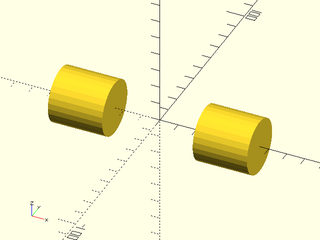

    include <BOSL2/std.scad>
    show("A B") cube(50, anchor=CENTER, $tags="Main") {
        attach(LEFT, BOTTOM) cylinder(d=30, l=30, $tags="A");
        attach(RIGHT, BOTTOM) cylinder(d=30, l=30, $tags="B");
    }

<br clear="all" /><br/>

---

## Section: Attachable Masks


### Module: edge\_mask()

**Usage:** 

- edge\_mask([edges], [except]) {...}

**Topics:** [Attachments](Topics#attachments)

**Description:** 

Takes a 3D mask shape, and attaches it to the given edges, with the appropriate orientation to be
`diff()`ed away.  The mask shape should be vertically oriented (Z-aligned) with the back-right
quadrant (X+Y+) shaped to be diffed away from the edge of parent attachable shape.
For details on specifying the edges to mask see [Specifying Edges](attachments.scad#subsection-specifying-edges).
For a step-by-step explanation of attachments, see the [[Attachments Tutorial|Tutorial-Attachments]].

**Figure 1:** A Typical Edge Rounding Mask

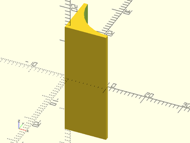

<br clear="all" />

**Arguments:** 

<abbr title="These args can be used by position or by name.">By&nbsp;Position</abbr> | What it does
-------------------- | ------------
`edges`              | Edges to mask.  See [Specifying Edges](attachments.scad#subsection-specifying-edges).  Default: All edges.
`except`             | Edges to explicitly NOT mask.  See [Specifying Edges](attachments.scad#subsection-specifying-edges).  Default: No edges.

**Side Effects:** 

- Sets `$tags = "mask"` for all children.

**See Also:** [attachable()](#module-attachable), [position()](#module-position), [attach()](#module-attach), [face\_profile()](#module-face_profile), [edge\_profile()](#module-edge_profile), [corner\_mask()](#module-corner_mask)

**Example 1:** 

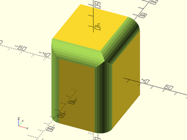

    include <BOSL2/std.scad>
    diff("mask")
    cube([50,60,70],center=true)
        edge_mask([TOP,"Z"],except=[BACK,TOP+LEFT])
            rounding_edge_mask(l=71,r=10);

<br clear="all" /><br/>

---

### Module: corner\_mask()

**Usage:** 

- corner\_mask([corners], [except]) {...}

**Topics:** [Attachments](Topics#attachments)

**Description:** 

Takes a 3D mask shape, and attaches it to the specified corners, with the appropriate orientation to
be `diff()`ed away.  The 3D corner mask shape should be designed to mask away the X+Y+Z+ octant.
See [Specifying Corners](attachments.scad#subsection-specifying-corners) for information on how to specify corner sets.
For a step-by-step explanation of attachments, see the [[Attachments Tutorial|Tutorial-Attachments]].

**Arguments:** 

<abbr title="These args can be used by position or by name.">By&nbsp;Position</abbr> | What it does
-------------------- | ------------
`corners`            | Corners to mask.  See [Specifying Corners](attachments.scad#subsection-specifying-corners).  Default: All corners.
`except`             | Corners to explicitly NOT mask.  See [Specifying Corners](attachments.scad#subsection-specifying-corners).  Default: No corners.

**Side Effects:** 

- Sets `$tags = "mask"` for all children.

**See Also:** [attachable()](#module-attachable), [position()](#module-position), [attach()](#module-attach), [face\_profile()](#module-face_profile), [edge\_profile()](#module-edge_profile), [edge\_mask()](#module-edge_mask)

**Example 1:** 

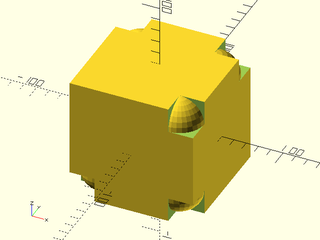

    include <BOSL2/std.scad>
    diff("mask")
    cube(100, center=true)
        corner_mask([TOP,FRONT],LEFT+FRONT+TOP)
            difference() {
                translate(-0.01*[1,1,1]) cube(20);
                translate([20,20,20]) sphere(r=20);
            }

<br clear="all" /><br/>

---

### Module: face\_profile()

**Usage:** 

- face\_profile(faces, r|d=, [convexity=]) {...}

**Topics:** [Attachments](Topics#attachments)

**Description:** 

Given a 2D edge profile, extrudes it into a mask for all edges and corners bounding each given face.
See  [Specifying Faces](attachments.scad#subsection-specifying-faces) for information on specifying faces.
For a step-by-step explanation of attachments, see the [[Attachments Tutorial|Tutorial-Attachments]].

**Arguments:** 

<abbr title="These args can be used by position or by name.">By&nbsp;Position</abbr> | What it does
-------------------- | ------------
`faces`              | Faces to mask edges and corners of.
`r`                  | Radius of corner mask.

<abbr title="These args must be used by name, ie: name=value">By&nbsp;Name</abbr> | What it does
-------------------- | ------------
`d`                  | Diameter of corner mask.
`convexity`          | Max number of times a line could intersect the perimeter of the mask shape.  Default: 10

**Side Effects:** 

- Sets `$tags = "mask"` for all children.

**See Also:** [attachable()](#module-attachable), [position()](#module-position), [attach()](#module-attach), [edge\_profile()](#module-edge_profile), [corner\_profile()](#module-corner_profile)

**Example 1:** 

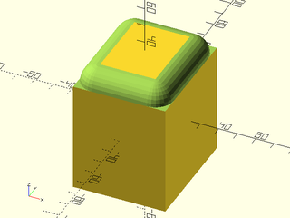

    include <BOSL2/std.scad>
    diff("mask")
    cube([50,60,70],center=true)
        face_profile(TOP,r=10)
            mask2d_roundover(r=10);

<br clear="all" /><br/>

---

### Module: edge\_profile()

**Usage:** 

- edge\_profile([edges], [except], [convexity]) {...}

**Topics:** [Attachments](Topics#attachments)

**Description:** 

Takes a 2D mask shape and attaches it to the selected edges, with the appropriate orientation and
extruded length to be `diff()`ed away, to give the edge a matching profile.
For details on specifying the edges to mask see [Specifying Edges](attachments.scad#subsection-specifying-edges).
For a step-by-step
explanation of attachments, see the [[Attachments Tutorial|Tutorial-Attachments]].

**Arguments:** 

<abbr title="These args can be used by position or by name.">By&nbsp;Position</abbr> | What it does
-------------------- | ------------
`edges`              | Edges to mask.  See [Specifying Edges](attachments.scad#subsection-specifying-edges).  Default: All edges.
`except`             | Edges to explicitly NOT mask.  See [Specifying Edges](attachments.scad#subsection-specifying-edges).  Default: No edges.
`convexity`          | Max number of times a line could intersect the perimeter of the mask shape.  Default: 10

**Side Effects:** 

- Sets `$tags = "mask"` for all children.

**See Also:** [attachable()](#module-attachable), [position()](#module-position), [attach()](#module-attach), [face\_profile()](#module-face_profile), [corner\_profile()](#module-corner_profile)

**Example 1:** 

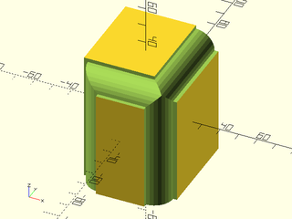

    include <BOSL2/std.scad>
    diff("mask")
    cube([50,60,70],center=true)
        edge_profile([TOP,"Z"],except=[BACK,TOP+LEFT])
            mask2d_roundover(r=10, inset=2);

<br clear="all" /><br/>

---

### Module: corner\_profile()

**Usage:** 

- corner\_profile([corners], [except], &lt;r=|d=&gt;, [convexity=]) {...}

**Topics:** [Attachments](Topics#attachments)

**Description:** 

Takes a 2D mask shape, rotationally extrudes and converts it into a corner mask, and attaches it
to the selected corners with the appropriate orientation.  Tags it as a "mask" to allow it to be
`diff()`ed away, to give the corner a matching profile.
See [Specifying Corners](attachments.scad#subsection-specifying-corners) for information on how to specify corner sets.
For a step-by-step explanation of attachments, see the [[Attachments Tutorial|Tutorial-Attachments]].

**Arguments:** 

<abbr title="These args can be used by position or by name.">By&nbsp;Position</abbr> | What it does
-------------------- | ------------
`corners`            | Corners to mask.  See [Specifying Corners](attachments.scad#subsection-specifying-corners).  Default: All corners.
`except`             | Corners to explicitly NOT mask.  See [Specifying Corners](attachments.scad#subsection-specifying-corners).  Default: No corners.

<abbr title="These args must be used by name, ie: name=value">By&nbsp;Name</abbr> | What it does
-------------------- | ------------
`r`                  | Radius of corner mask.
`d`                  | Diameter of corner mask.
`convexity`          | Max number of times a line could intersect the perimeter of the mask shape.  Default: 10

**Side Effects:** 

- Sets `$tags = "mask"` for all children.

**See Also:** [attachable()](#module-attachable), [position()](#module-position), [attach()](#module-attach), [face\_profile()](#module-face_profile), [edge\_profile()](#module-edge_profile)

**Example 1:** 

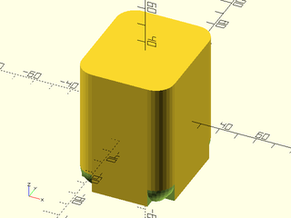

    include <BOSL2/std.scad>
    diff("mask")
    cuboid([50,60,70],rounding=10,edges="Z",anchor=CENTER) {
        corner_profile(BOT,r=10)
            mask2d_teardrop(r=10, angle=40);
    }

<br clear="all" /><br/>

---

## Section: Making your objects attachable


### Module: attachable()

**Usage:** Square/Trapezoid Geometry

- attachable(anchor, spin, two\_d=true, size=, [size2=], [shift=], ...) {...}

**Usage:** Circle/Oval Geometry

- attachable(anchor, spin, two\_d=true, r=|d=, ...) {...}

**Usage:** 2D Path/Polygon Geometry

- attachable(anchor, spin, two\_d=true, path=, [extent=], ...) {...}

**Usage:** 2D Region Geometry

- attachable(anchor, spin, two\_d=true, region=, [extent=], ...) {...}

**Usage:** Cubical/Prismoidal Geometry

- attachable(anchor, spin, [orient], size=, [size2=], [shift=], ...) {...}

**Usage:** Cylindrical Geometry

- attachable(anchor, spin, [orient], r=|d=, l=, [axis=], ...) {...}

**Usage:** Conical Geometry

- attachable(anchor, spin, [orient], r1=|d1=, r2=|d2=, l=, [axis=], ...) {...}

**Usage:** Spheroid/Ovoid Geometry

- attachable(anchor, spin, [orient], r=|d=, ...) {...}

**Usage:** Extruded Path/Polygon Geometry

- attachable(anchor, spin, path=, l=|h=, [extent=], ...) {...}

**Usage:** Extruded Region Geometry

- attachable(anchor, spin, region=, l=|h=, [extent=], ...) {...}

**Usage:** VNF Geometry

- attachable(anchor, spin, [orient], vnf=, [extent=], ...) {...}

**Topics:** [Attachments](Topics#attachments)

**Description:** 

Manages the anchoring, spin, orientation, and attachments for a 3D volume or 2D area.
A managed 3D volume is assumed to be vertically (Z-axis) oriented, and centered.
A managed 2D area is just assumed to be centered.  The shape to be managed is given
as the first child to this module, and the second child should be given as `children()`.
For example, to manage a conical shape:
```openscad
attachable(anchor, spin, orient, r1=r1, r2=r2, l=h) {
    cyl(r1=r1, r2=r2, l=h);
    children();
}
```

If this is *not* run as a child of `attach()` with the `to` argument
given, then the following transformations are performed in order:
* Translates so the `anchor` point is at the origin (0,0,0).
* Rotates around the Z axis by `spin` degrees counter-clockwise.
* Rotates so the top of the part points towards the vector `orient`.

If this is called as a child of `attach(from,to)`, then the info
for the anchor points referred to by `from` and `to` are fetched,
which will include position, direction, and spin.  With that info,
the following transformations are performed:
* Translates this part so it's anchor position matches the parent's anchor position.
* Rotates this part so it's anchor direction vector exactly opposes the parent's anchor direction vector.
* Rotates this part so it's anchor spin matches the parent's anchor spin.

For a more step-by-step explanation of attachments, see the [[Attachments Tutorial|Tutorial-Attachments]].

**Arguments:** 

<abbr title="These args can be used by position or by name.">By&nbsp;Position</abbr> | What it does
-------------------- | ------------
`anchor`             | Translate so anchor point is at origin (0,0,0).  See [anchor](attachments.scad#subsection-anchor).  Default: `CENTER`
`spin`               | Rotate this many degrees around the Z axis after anchor.  See [spin](attachments.scad#subsection-spin).  Default: `0`
`orient`             | Vector to rotate top towards, after spin.  See [orient](attachments.scad#subsection-orient).  Default: `UP`

<abbr title="These args must be used by name, ie: name=value">By&nbsp;Name</abbr> | What it does
-------------------- | ------------
`size`               | If given as a 3D vector, contains the XY size of the bottom of the cuboidal/prismoidal volume, and the Z height.  If given as a 2D vector, contains the front X width of the rectangular/trapezoidal shape, and the Y length.
`size2`              | If given as a 2D vector, contains the XY size of the top of the prismoidal volume.  If given as a number, contains the back width of the trapezoidal shape.
`shift`              | If given as a 2D vector, shifts the top of the prismoidal or conical shape by the given amount.  If given as a number, shifts the back of the trapezoidal shape right by that amount.  Default: No shift.
`r`                  | Radius of the cylindrical/conical volume.  Can be a scalar, or a list of sizes per axis.
`d`                  | Diameter of the cylindrical/conical volume.  Can be a scalar, or a list of sizes per axis.
`r1`                 | Radius of the bottom of the conical volume.  Can be a scalar, or a list of sizes per axis.
`r2`                 | Radius of the top of the conical volume.  Can be a scalar, or a list of sizes per axis.
`d1`                 | Diameter of the bottom of the conical volume.  Can be a scalar, a list of sizes per axis.
`d2`                 | Diameter of the top of the conical volume.  Can be a scalar, a list of sizes per axis.
`l`                  / `h`                  | Length of the cylindrical, conical, or extruded path volume along axis.
`vnf`                | The [VNF](vnf.scad) of the volume.
`path`               | The path to generate a polygon from.
`region`             | The region to generate a shape from.
`extent`             | If true, calculate anchors by extents, rather than intersection, for VNFs and paths.  Default: true.
`cp`                 | If given, specifies the centerpoint of the volume.  Default: `[0,0,0]`
`offset`             | If given, offsets the perimeter of the volume around the centerpoint.
`anchors`            | If given as a list of anchor points, allows named anchor points.
`two_d`              | If true, the attachable shape is 2D.  If false, 3D.  Default: false (3D)
`axis`               | The vector pointing along the axis of a cylinder geometry.  Default: UP

**Side Effects:** 

- `$parent_anchor` is set to the parent object's `anchor` value.
- `$parent_spin` is set to the parent object's `spin` value.
- `$parent_orient` is set to the parent object's `orient` value.
- `$parent_geom` is set to the parent object's `geom` value.
- `$parent_size` is set to the parent object's cubical `[X,Y,Z]` volume size.

**See Also:** [reorient()](#function-reorient)

**Example 1:** Cubical Shape

    include <BOSL2/std.scad>
    attachable(anchor, spin, orient, size=size) {
        cube(size, center=true);
        children();
    }

<br clear="all" /><br/>

**Example 2:** Prismoidal Shape

    include <BOSL2/std.scad>
    attachable(
        anchor, spin, orient,
        size=point3d(botsize,h),
        size2=topsize,
        shift=shift
    ) {
        prismoid(botsize, topsize, h=h, shift=shift);
        children();
    }

<br clear="all" /><br/>

**Example 3:** Cylindrical Shape, Z-Axis Aligned

    include <BOSL2/std.scad>
    attachable(anchor, spin, orient, r=r, l=h) {
        cyl(r=r, l=h);
        children();
    }

<br clear="all" /><br/>

**Example 4:** Cylindrical Shape, Y-Axis Aligned

    include <BOSL2/std.scad>
    attachable(anchor, spin, orient, r=r, l=h, axis=BACK) {
        cyl(r=r, l=h);
        children();
    }

<br clear="all" /><br/>

**Example 5:** Cylindrical Shape, X-Axis Aligned

    include <BOSL2/std.scad>
    attachable(anchor, spin, orient, r=r, l=h, axis=RIGHT) {
        cyl(r=r, l=h);
        children();
    }

<br clear="all" /><br/>

**Example 6:** Conical Shape, Z-Axis Aligned

    include <BOSL2/std.scad>
    attachable(anchor, spin, orient, r1=r1, r2=r2, l=h) {
        cyl(r1=r1, r2=r2, l=h);
        children();
    }

<br clear="all" /><br/>

**Example 7:** Conical Shape, Y-Axis Aligned

    include <BOSL2/std.scad>
    attachable(anchor, spin, orient, r1=r1, r2=r2, l=h, axis=BACK) {
        cyl(r1=r1, r2=r2, l=h);
        children();
    }

<br clear="all" /><br/>

**Example 8:** Conical Shape, X-Axis Aligned

    include <BOSL2/std.scad>
    attachable(anchor, spin, orient, r1=r1, r2=r2, l=h, axis=RIGHT) {
        cyl(r1=r1, r2=r2, l=h);
        children();
    }

<br clear="all" /><br/>

**Example 9:** Spherical Shape

    include <BOSL2/std.scad>
    attachable(anchor, spin, orient, r=r) {
        sphere(r=r);
        children();
    }

<br clear="all" /><br/>

**Example 10:** Extruded Polygon Shape, by Extents

    include <BOSL2/std.scad>
    attachable(anchor, spin, orient, path=path, l=length) {
        linear_extrude(height=length, center=true)
            polygon(path);
        children();
    }

<br clear="all" /><br/>

**Example 11:** Extruded Polygon Shape, by Intersection

    include <BOSL2/std.scad>
    attachable(anchor, spin, orient, path=path, l=length, extent=false) {
        linear_extrude(height=length, center=true)
            polygon(path);
        children();
    }

<br clear="all" /><br/>

**Example 12:** Arbitrary VNF Shape, by Extents

    include <BOSL2/std.scad>
    attachable(anchor, spin, orient, vnf=vnf) {
        vnf_polyhedron(vnf);
        children();
    }

<br clear="all" /><br/>

**Example 13:** Arbitrary VNF Shape, by Intersection

    include <BOSL2/std.scad>
    attachable(anchor, spin, orient, vnf=vnf, extent=false) {
        vnf_polyhedron(vnf);
        children();
    }

<br clear="all" /><br/>

**Example 14:** 2D Rectangular Shape

    include <BOSL2/std.scad>
    attachable(anchor, spin, orient, two_d=true, size=size) {
        square(size, center=true);
        children();
    }

<br clear="all" /><br/>

**Example 15:** 2D Trapezoidal Shape

    include <BOSL2/std.scad>
    attachable(
        anchor, spin, orient,
        two_d=true,
        size=[x1,y],
        size2=x2,
        shift=shift
    ) {
        trapezoid(w1=x1, w2=x2, h=y, shift=shift);
        children();
    }

<br clear="all" /><br/>

**Example 16:** 2D Circular Shape

    include <BOSL2/std.scad>
    attachable(anchor, spin, orient, two_d=true, r=r) {
        circle(r=r);
        children();
    }

<br clear="all" /><br/>

**Example 17:** Arbitrary 2D Polygon Shape, by Extents

    include <BOSL2/std.scad>
    attachable(anchor, spin, orient, two_d=true, path=path) {
        polygon(path);
        children();
    }

<br clear="all" /><br/>

**Example 18:** Arbitrary 2D Polygon Shape, by Intersection

    include <BOSL2/std.scad>
    attachable(anchor, spin, orient, two_d=true, path=path, extent=false) {
        polygon(path);
        children();
    }

<br clear="all" /><br/>

---

### Function: reorient()

**Usage:** Square/Trapezoid Geometry

- mat = reorient(anchor, spin, [orient], two\_d=true, size=, [size2=], [shift=], ...);
- pts = reorient(anchor, spin, [orient], two\_d=true, size=, [size2=], [shift=], p=, ...);

**Usage:** Circle/Oval Geometry

- mat = reorient(anchor, spin, [orient], two\_d=true, r=|d=, ...);
- pts = reorient(anchor, spin, [orient], two\_d=true, r=|d=, p=, ...);

**Usage:** 2D Path/Polygon Geometry

- mat = reorient(anchor, spin, [orient], two\_d=true, path=, [extent=], ...);
- pts = reorient(anchor, spin, [orient], two\_d=true, path=, [extent=], p=, ...);

**Usage:** 2D Region/Polygon Geometry

- mat = reorient(anchor, spin, [orient], two\_d=true, region=, [extent=], ...);
- pts = reorient(anchor, spin, [orient], two\_d=true, region=, [extent=], p=, ...);

**Usage:** Cubical/Prismoidal Geometry

- mat = reorient(anchor, spin, [orient], size=, [size2=], [shift=], ...);
- pts = reorient(anchor, spin, [orient], size=, [size2=], [shift=], p=, ...);

**Usage:** Cylindrical Geometry

- mat = reorient(anchor, spin, [orient], r=|d=, l=, [axis=], ...);
- pts = reorient(anchor, spin, [orient], r=|d=, l=, [axis=], p=, ...);

**Usage:** Conical Geometry

- mat = reorient(anchor, spin, [orient], r1=|d1=, r2=|d2=, l=, [axis=], ...);
- pts = reorient(anchor, spin, [orient], r1=|d1=, r2=|d2=, l=, [axis=], p=, ...);

**Usage:** Spheroid/Ovoid Geometry

- mat = reorient(anchor, spin, [orient], r|d=, ...);
- pts = reorient(anchor, spin, [orient], r|d=, p=, ...);

**Usage:** Extruded Path/Polygon Geometry

- mat = reorient(anchor, spin, [orient], path=, l=|h=, [extent=], ...);
- pts = reorient(anchor, spin, [orient], path=, l=|h=, [extent=], p=, ...);

**Usage:** Extruded Region Geometry

- mat = reorient(anchor, spin, [orient], region=, l=|h=, [extent=], ...);
- pts = reorient(anchor, spin, [orient], region=, l=|h=, [extent=], p=, ...);

**Usage:** VNF Geometry

- mat = reorient(anchor, spin, [orient], vnf, [extent], ...);
- pts = reorient(anchor, spin, [orient], vnf, [extent], p=, ...);

**Topics:** [Attachments](Topics#attachments)

**Description:** 

Given anchor, spin, orient, and general geometry info for a managed volume, this calculates
the transformation matrix needed to be applied to the contents of that volume.  A managed 3D
volume is assumed to be vertically (Z-axis) oriented, and centered.  A managed 2D area is just
assumed to be centered.

If `p` is not given, then the transformation matrix will be returned.
If `p` contains a VNF, a new VNF will be returned with the vertices transformed by the matrix.
If `p` contains a path, a new path will be returned with the vertices transformed by the matrix.
If `p` contains a point, a new point will be returned, transformed by the matrix.

If `$attach_to` is not defined, then the following transformations are performed in order:
* Translates so the `anchor` point is at the origin (0,0,0).
* Rotates around the Z axis by `spin` degrees counter-clockwise.
* Rotates so the top of the part points towards the vector `orient`.

If `$attach_to` is defined, as a consequence of `attach(from,to)`, then
the following transformations are performed in order:
* Translates this part so it's anchor position matches the parent's anchor position.
* Rotates this part so it's anchor direction vector exactly opposes the parent's anchor direction vector.
* Rotates this part so it's anchor spin matches the parent's anchor spin.

For a more step-by-step explanation of attachments, see the [[Attachments Tutorial|Tutorial-Attachments]].

**Arguments:** 

<abbr title="These args can be used by position or by name.">By&nbsp;Position</abbr> | What it does
-------------------- | ------------
`anchor`             | Translate so anchor point is at origin (0,0,0).  See [anchor](attachments.scad#subsection-anchor).  Default: `CENTER`
`spin`               | Rotate this many degrees around the Z axis after anchor.  See [spin](attachments.scad#subsection-spin).  Default: `0`
`orient`             | Vector to rotate top towards, after spin.  See [orient](attachments.scad#subsection-orient).  Default: `UP`

<abbr title="These args must be used by name, ie: name=value">By&nbsp;Name</abbr> | What it does
-------------------- | ------------
`size`               | If given as a 3D vector, contains the XY size of the bottom of the cuboidal/prismoidal volume, and the Z height.  If given as a 2D vector, contains the front X width of the rectangular/trapezoidal shape, and the Y length.
`size2`              | If given as a 2D vector, contains the XY size of the top of the prismoidal volume.  If given as a number, contains the back width of the trapezoidal shape.
`shift`              | If given as a 2D vector, shifts the top of the prismoidal or conical shape by the given amount.  If given as a number, shifts the back of the trapezoidal shape right by that amount.  Default: No shift.
`r`                  | Radius of the cylindrical/conical volume.  Can be a scalar, or a list of sizes per axis.
`d`                  | Diameter of the cylindrical/conical volume.  Can be a scalar, or a list of sizes per axis.
`r1`                 | Radius of the bottom of the conical volume.  Can be a scalar, or a list of sizes per axis.
`r2`                 | Radius of the top of the conical volume.  Can be a scalar, or a list of sizes per axis.
`d1`                 | Diameter of the bottom of the conical volume.  Can be a scalar, a list of sizes per axis.
`d2`                 | Diameter of the top of the conical volume.  Can be a scalar, a list of sizes per axis.
`l`                  / `h`                  | Length of the cylindrical, conical, or extruded path volume along axis.
`vnf`                | The [VNF](vnf.scad) of the volume.
`path`               | The path to generate a polygon from.
`region`             | The region to generate a shape from.
`extent`             | If true, calculate anchors by extents, rather than intersection.  Default: false.
`cp`                 | If given, specifies the centerpoint of the volume.  Default: `[0,0,0]`
`offset`             | If given, offsets the perimeter of the volume around the centerpoint.
`anchors`            | If given as a list of anchor points, allows named anchor points.
`two_d`              | If true, the attachable shape is 2D.  If false, 3D.  Default: false (3D)
`axis`               | The vector pointing along the axis of a cylinder geometry.  Default: UP
`p`                  | The VNF, path, or point to transform.

**See Also:** [attachable()](#module-attachable)

---

### Function: named\_anchor()

**Usage:** 

- a = named\_anchor(name, pos, [orient], [spin]);

**Topics:** [Attachments](Topics#attachments)

**Description:** 

Creates an anchor data structure.  For a more step-by-step explanation of attachments,
see the [[Attachments Tutorial|Tutorial-Attachments]].

**Arguments:** 

<abbr title="These args can be used by position or by name.">By&nbsp;Position</abbr> | What it does
-------------------- | ------------
`name`               | The string name of the anchor.  Lowercase.  Words separated by single dashes.  No spaces.
`pos`                | The [X,Y,Z] position of the anchor.
`orient`             | A vector pointing in the direction parts should project from the anchor position.
`spin`               | If needed, the angle to rotate the part around the direction vector.

**See Also:** [reorient()](#function-reorient), [attachable()](#module-attachable)

---

## Section: Visualizing Anchors


### Module: show\_anchors()

**Usage:** 

- ... show\_anchors([s], [std=], [custom=]);

**Description:** 

Show all standard anchors for the parent object.

**Arguments:** 

<abbr title="These args can be used by position or by name.">By&nbsp;Position</abbr> | What it does
-------------------- | ------------
`s`                  | Length of anchor arrows.

<abbr title="These args must be used by name, ie: name=value">By&nbsp;Name</abbr> | What it does
-------------------- | ------------
`std`                | If true (default), show standard anchors.
`custom`             | If true (default), show custom anchors.

**Example 1:** 

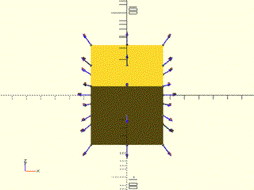

    include <BOSL2/std.scad>
    cube(50, center=true) show_anchors();

<br clear="all" /><br/>

---

### Module: anchor\_arrow()

**Usage:** 

- anchor\_arrow([s], [color], [flag]);

**Description:** 

Show an anchor orientation arrow.  By default, tagged with the name "anchor-arrow".

**Arguments:** 

<abbr title="These args can be used by position or by name.">By&nbsp;Position</abbr> | What it does
-------------------- | ------------
`s`                  | Length of the arrows.  Default: `10`
`color`              | Color of the arrow.  Default: `[0.333, 0.333, 1]`
`flag`               | If true, draw the orientation flag on the arrowhead.  Default: true

**Example 1:** 

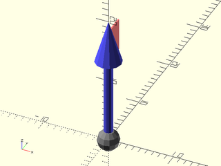

    include <BOSL2/std.scad>
    anchor_arrow(s=20);

<br clear="all" /><br/>

---

### Module: anchor\_arrow2d()

**Usage:** 

- anchor\_arrow2d([s], [color], [flag]);

**Description:** 

Show an anchor orientation arrow.

**Arguments:** 

<abbr title="These args can be used by position or by name.">By&nbsp;Position</abbr> | What it does
-------------------- | ------------
`s`                  | Length of the arrows.
`color`              | Color of the arrow.

**Example 1:** 

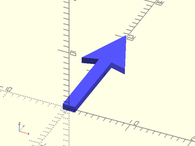

    include <BOSL2/std.scad>
    anchor_arrow2d(s=20);

<br clear="all" /><br/>

---

### Module: expose\_anchors()

**Usage:** 

- expose\_anchors(opacity) {child1() show\_anchors(); child2() show\_anchors(); ...}

**Description:** 

Used in combination with show_anchors() to display an object in transparent gray with its anchors in solid color.
Children will appear transparent and any anchor arrows drawn with will appear in solid color.

**Arguments:** 

<abbr title="These args can be used by position or by name.">By&nbsp;Position</abbr> | What it does
-------------------- | ------------
`opacity`            | The opacity of the children.  0.0 is invisible, 1.0 is opaque.  Default: 0.2

**Example 1:** 

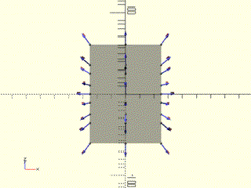

    include <BOSL2/std.scad>
    expose_anchors() cube(50, center=true) show_anchors();

<br clear="all" /><br/>

---

### Module: frame\_ref()

**Usage:** 

- frame\_ref(s, opacity);

**Description:** 

Displays X,Y,Z axis arrows in red, green, and blue respectively.

**Arguments:** 

<abbr title="These args can be used by position or by name.">By&nbsp;Position</abbr> | What it does
-------------------- | ------------
`s`                  | Length of the arrows.
`opacity`            | The opacity of the arrows.  0.0 is invisible, 1.0 is opaque.  Default: 1.0

**Example 1:** 

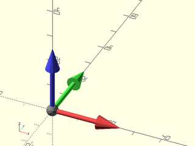

    include <BOSL2/std.scad>
    frame_ref(25);

<br clear="all" /><br/>

**Example 2:** 

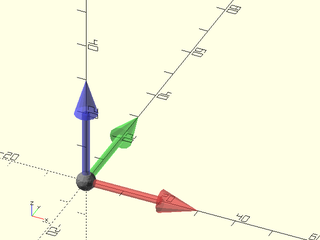

    include <BOSL2/std.scad>
    frame_ref(30, opacity=0.5);

<br clear="all" /><br/>

---

