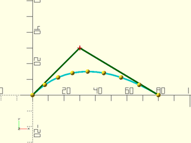
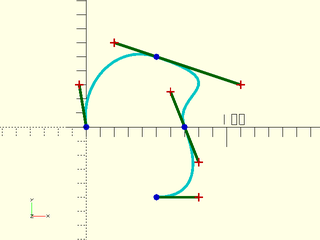
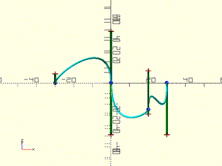

# LibFile: beziers.scad

Bezier curves and surfaces are way to represent smooth curves and smoothly curving
surfaces with a set of control points.  The curve or surface is defined by
the control points, but usually only passes through the first and last control point (the endpoints).
This file provides some
aids to constructing the control points, and highly optimized functions for
computing the Bezier curves and surfaces given by the control points,

To use, add the following lines to the beginning of your file:

    include <BOSL2/std.scad>
    include <BOSL2/beziers.scad>

**Terminology:** 

Name | Definition
---- | ----------
Path | A series of points joined by straight line segements.
Bezier Curve | A polynomial curve defined by a list of control points.  The curve starts at the first control point and ends at the last one.  The other control points define the shape of the curve and they are often *NOT* on the curve
Control Point | A point that influences the shape of the Bezier curve.
Degree | The degree of the polynomial used to make the bezier curve.  A bezier curve of degree N will have N+1 control points.  Most beziers are cubic (degree 3).  The higher the degree, the more the curve can wiggle.
Bezier Parameter | A parameter, usually `u` below, that ranges from 0 to 1 to trace out the bezier curve.  When `u=0` you get the first control point and when `u=1` you get the last control point. Intermediate points are traced out *non-uniformly*.
Bezier Path | A list of bezier control points corresponding to a series of Bezier curves that connect together, end to end.  Because they connect, the endpoints are shared between control points and are not repeated, so a degree 3 bezier path representing two bezier curves will have seven entries to represent two sets of four control points.    **NOTE:** A "bezier path" is *NOT* a standard path
Bezier Patch | A two-dimensional arrangement of Bezier control points that generate a bounded curved Bezier surface.  A Bezier patch is a (N+1) by (M+1) grid of control points, which defines surface with four edges (in the non-degenerate case).
Bezier Surface | A surface defined by a list of one or more bezier patches.
Spline Steps | The number of straight-line segments used to approximate a Bezier curve.  The more spline steps, the better the approximation to the curve, but the slower it will be to generate.  This plays a role analogous to `$fn` for circles.  Usually defaults to 16.

## Table of Contents

1. [Section: Bezier Curves](#section-bezier-curves)
    - [`bezier_points()`](#function-bezier_points)
    - [`bezier_curve()`](#function-bezier_curve)
    - [`bezier_derivative()`](#function-bezier_derivative)
    - [`bezier_tangent()`](#function-bezier_tangent)
    - [`bezier_curvature()`](#function-bezier_curvature)
    - [`bezier_closest_point()`](#function-bezier_closest_point)
    - [`bezier_length()`](#function-bezier_length)
    - [`bezier_line_intersection()`](#function-bezier_line_intersection)

2. [Section: Bezier Path Functions](#section-bezier-path-functions)
    - [`bezpath_points()`](#function-bezpath_points)
    - [`bezpath_curve()`](#function-bezpath_curve)
    - [`bezpath_closest_point()`](#function-bezpath_closest_point)
    - [`bezpath_length()`](#function-bezpath_length)
    - [`path_to_bezpath()`](#function-path_to_bezpath)
    - [`bezpath_close_to_axis()`](#function-bezpath_close_to_axis)
    - [`bezpath_offset()`](#function-bezpath_offset)

3. [Section: Cubic Bezier Path Construction](#section-cubic-bezier-path-construction)
    - [`bez_begin()`](#function-bez_begin)
    - [`bez_tang()`](#function-bez_tang)
    - [`bez_joint()`](#function-bez_joint)
    - [`bez_end()`](#function-bez_end)

4. [Section: Bezier Surfaces](#section-bezier-surfaces)
    - [`is_bezier_patch()`](#function-is_bezier_patch)
    - [`bezier_patch_flat()`](#function-bezier_patch_flat)
    - [`bezier_patch_reverse()`](#function-bezier_patch_reverse)
    - [`bezier_patch_points()`](#function-bezier_patch_points)
    - [`bezier_vnf()`](#function-bezier_vnf)
    - [`bezier_vnf_degenerate_patch()`](#function-bezier_vnf_degenerate_patch)

5. [Section: Debugging Beziers](#section-debugging-beziers)
    - [`debug_bezier()`](#module-debug_bezier)
    - [`debug_bezier_patches()`](#module-debug_bezier_patches)

## Section: Bezier Curves

### Function: bezier\_points()

**Usage:** 

- pt = bezier\_points(bezier, u);
- ptlist = bezier\_points(bezier, RANGE);
- ptlist = bezier\_points(bezier, LIST);

**Topics:** [Bezier Curves](Topics#bezier-curves)

**Description:** 

Computes points on a bezier curve with control points specified by `bezier` at parameter values
specified by `u`, which can be a scalar or a list.  The value `u=0` gives the first endpoint; `u=1` gives the final endpoint,
and intermediate values of `u` fill in the curve in a non-uniform fashion.  This function uses an optimized method which
is best when `u` is a long list and the bezier degree is 10 or less.  The degree of the bezier
curve is `len(bezier)-1`.

**Arguments:** 

<abbr title="These args can be used by position or by name.">By&nbsp;Position</abbr> | What it does
-------------------- | ------------
`bezier`             | The list of endpoints and control points for this bezier curve.
`u`                  | Parameter values for evaluating the curve, given as a single value, a list or a range.

**Example 1:** Quadratic (Degree 2) Bezier.

    include <BOSL2/std.scad>
    include <BOSL2/beziers.scad>
    bez = [[0,0], [30,30], [80,0]];
    debug_bezier(bez, N=len(bez)-1);
    translate(bezier_points(bez, 0.3)) color("red") sphere(1);

  

**Example 2:** Cubic (Degree 3) Bezier

    include <BOSL2/std.scad>
    include <BOSL2/beziers.scad>
    bez = [[0,0], [5,35], [60,-25], [80,0]];
    debug_bezier(bez, N=len(bez)-1);
    translate(bezier_points(bez, 0.4)) color("red") sphere(1);

  

**Example 3:** Degree 4 Bezier.

    include <BOSL2/std.scad>
    include <BOSL2/beziers.scad>
    bez = [[0,0], [5,15], [40,20], [60,-15], [80,0]];
    debug_bezier(bez, N=len(bez)-1);
    translate(bezier_points(bez, 0.8)) color("red") sphere(1);

  

**Example 4:** Giving a List of `u`

    include <BOSL2/std.scad>
    include <BOSL2/beziers.scad>
    bez = [[0,0], [5,35], [60,-25], [80,0]];
    debug_bezier(bez, N=len(bez)-1);
    pts = bezier_points(bez, [0, 0.2, 0.3, 0.7, 0.8, 1]);
    rainbow(pts) move($item) sphere(1.5, $fn=12);

  

**Example 5:** Giving a Range of `u`

    include <BOSL2/std.scad>
    include <BOSL2/beziers.scad>
    bez = [[0,0], [5,35], [60,-25], [80,0]];
    debug_bezier(bez, N=len(bez)-1);
    pts = bezier_points(bez, [0:0.2:1]);
    rainbow(pts) move($item) sphere(1.5, $fn=12);

  

---

### Function: bezier\_curve()

**Usage:** 

- path = bezier\_curve(bezier, [splinesteps], [endpoint]);

**Topics:** [Bezier Curves](Topics#bezier-curves)

**Description:** 

Takes a list of bezier control points and generates splinesteps segments (splinesteps+1 points)
along the bezier curve they define.
Points start at the first control point and are sampled uniformly along the bezier parameter.
The endpoints of the output will be *exactly* equal to the first and last bezier control points
when endpoint is true.  If endpoint is false the sampling stops one step before the final point
of the bezier curve, but you still get the same number of (more tightly spaced) points.
The distance between the points will *not* be equidistant.
The degree of the bezier curve is one less than the number of points in `curve`.

**Arguments:** 

<abbr title="These args can be used by position or by name.">By&nbsp;Position</abbr> | What it does
-------------------- | ------------
`bezier`             | The list of control points that define the Bezier curve.
`splinesteps`        | The number of segments to create on the bezier curve.  Default: 16
`endpoint`           | if false then exclude the endpoint.  Default: True

**See Also:** [bezier\_curvature()](#function-bezier_curvature), [bezier\_tangent()](#function-bezier_tangent), [bezier\_derivative()](#function-bezier_derivative), [bezier\_points()](#function-bezier_points)

**Example 1:** Quadratic (Degree 2) Bezier.

    include <BOSL2/std.scad>
    include <BOSL2/beziers.scad>
    bez = [[0,0], [30,30], [80,0]];
    move_copies(bezier_curve(bez, 8)) sphere(r=1.5, $fn=12);
    debug_bezier(bez, N=len(bez)-1);

  

**Example 2:** Cubic (Degree 3) Bezier

    include <BOSL2/std.scad>
    include <BOSL2/beziers.scad>
    bez = [[0,0], [5,35], [60,-25], [80,0]];
    move_copies(bezier_curve(bez, 8)) sphere(r=1.5, $fn=12);
    debug_bezier(bez, N=len(bez)-1);

  

**Example 3:** Degree 4 Bezier.

    include <BOSL2/std.scad>
    include <BOSL2/beziers.scad>
    bez = [[0,0], [5,15], [40,20], [60,-15], [80,0]];
    move_copies(bezier_curve(bez, 8)) sphere(r=1.5, $fn=12);
    debug_bezier(bez, N=len(bez)-1);

  

---

### Function: bezier\_derivative()

**Usage:** 

- deriv = bezier\_derivative(bezier, u, [order]);
- derivs = bezier\_derivative(bezier, LIST, [order]);
- derivs = bezier\_derivative(bezier, RANGE, [order]);

**Topics:** [Bezier Curves](Topics#bezier-curves)

**Description:** 

Evaluates the derivative of the bezier curve at the given parameter value or values, `u`.  The `order` gives the order of the derivative.
The degree of the bezier curve is one less than the number of points in `bezier`.

**Arguments:** 

<abbr title="These args can be used by position or by name.">By&nbsp;Position</abbr> | What it does
-------------------- | ------------
`bezier`             | The list of control points that define the Bezier curve.
`u`                  | Parameter values for evaluating the curve, given as a single value, a list or a range.
`order`              | The order of the derivative to return.  Default: 1 (for the first derivative)

**See Also:** [bezier\_curvature()](#function-bezier_curvature), [bezier\_tangent()](#function-bezier_tangent), [bezier\_points()](#function-bezier_points)

---

### Function: bezier\_tangent()

**Usage:** 

- tanvec = bezier\_tangent(bezier, u);
- tanvecs = bezier\_tangent(bezier, LIST);
- tanvecs = bezier\_tangent(bezier, RANGE);

**Topics:** [Bezier Curves](Topics#bezier-curves)

**Description:** 

Returns the unit tangent vector at the given parameter values on a bezier curve with control points `bezier`.

**Arguments:** 

<abbr title="These args can be used by position or by name.">By&nbsp;Position</abbr> | What it does
-------------------- | ------------
`bezier`             | The list of control points that define the Bezier curve.
`u`                  | Parameter values for evaluating the curve, given as a single value, a list or a range.

**See Also:** [bezier\_curvature()](#function-bezier_curvature), [bezier\_derivative()](#function-bezier_derivative), [bezier\_points()](#function-bezier_points)

---

### Function: bezier\_curvature()

**Usage:** 

- crv = bezier\_curvature(curve, u);
- crvlist = bezier\_curvature(curve, LIST);
- crvlist = bezier\_curvature(curve, RANGE);

**Topics:** [Bezier Curves](Topics#bezier-curves)

**Description:** 

Returns the curvature value for the given parameters `u` on the bezier curve with control points `bezier`.
The curvature is the inverse of the radius of the tangent circle at the given point.
Thus, the tighter the curve, the larger the curvature value.  Curvature will be 0 for
a position with no curvature, since 1/0 is not a number.

**Arguments:** 

<abbr title="These args can be used by position or by name.">By&nbsp;Position</abbr> | What it does
-------------------- | ------------
`bezier`             | The list of control points that define the Bezier curve.
`u`                  | Parameter values for evaluating the curve, given as a single value, a list or a range.

**See Also:** [bezier\_tangent()](#function-bezier_tangent), [bezier\_derivative()](#function-bezier_derivative), [bezier\_points()](#function-bezier_points)

---

### Function: bezier\_closest\_point()

**Usage:** 

- u = bezier\_closest\_point(bezier, pt, [max\_err]);

**Topics:** [Bezier Curves](Topics#bezier-curves)

**Description:** 

Finds the closest part of the given bezier curve to point `pt`.
The degree of the curve, N, is one less than the number of points in `curve`.
Returns `u` for the closest position on the bezier curve to the given point `pt`.

**Arguments:** 

<abbr title="These args can be used by position or by name.">By&nbsp;Position</abbr> | What it does
-------------------- | ------------
`bezier`             | The list of control points that define the Bezier curve.
`pt`                 | The point to find the closest curve point to.
`max_err`            | The maximum allowed error when approximating the closest approach.

**See Also:** [bezier\_points()](#function-bezier_points)

**Example 1:** 

    include <BOSL2/std.scad>
    include <BOSL2/beziers.scad>
    pt = [40,15];
    bez = [[0,0], [20,40], [60,-25], [80,0]];
    u = bezier_closest_point(bez, pt);
    debug_bezier(bez, N=len(bez)-1);
    color("red") translate(pt) sphere(r=1);
    color("blue") translate(bezier_points(bez,u)) sphere(r=1);

  

---

### Function: bezier\_length()

**Usage:** 

- pathlen = bezier\_length(bezier, [start\_u], [end\_u], [max\_deflect]);

**Topics:** [Bezier Curves](Topics#bezier-curves)

**Description:** 

Approximates the length of the portion of the bezier curve between start_u and end_u.

**Arguments:** 

<abbr title="These args can be used by position or by name.">By&nbsp;Position</abbr> | What it does
-------------------- | ------------
`bezier`             | The list of control points that define the Bezier curve.
`start_u`            | The Bezier parameter to start measuring measuring from.  Between 0 and 1.
`end_u`              | The Bezier parameter to end measuring at.  Between 0 and 1.  Greater than start_u.
`max_deflect`        | The largest amount of deflection from the true curve to allow for approximation.

**See Also:** [bezier\_points()](#function-bezier_points)

**Example 1:** 

    include <BOSL2/std.scad>
    include <BOSL2/beziers.scad>
    bez = [[0,0], [5,35], [60,-25], [80,0]];
    echo(bezier_length(bez));

  

---

### Function: bezier\_line\_intersection()

**Usage:** 

- u = bezier\_line\_intersection(curve, line);

**Topics:** [Bezier Curves](Topics#bezier-curves), [Geometry](Topics#geometry), [Intersection](Topics#intersection)

**Description:** 

Finds the intersection points of the 2D Bezier curve with control points `bezier` and the given line, specified as a pair of points.
Returns the intersection as a list of `u` values for the Bezier.

**Arguments:** 

<abbr title="These args can be used by position or by name.">By&nbsp;Position</abbr> | What it does
-------------------- | ------------
`bezier`             | The list of control points that define a 2D Bezier curve.
`line`               | a list of two distinct 2d points defining a line

**See Also:** [bezier\_points()](#function-bezier_points), [bezier\_length()](#function-bezier_length), [bezier\_closest\_point()](#function-bezier_closest_point)

---

## Section: Bezier Path Functions

To contruct more complicated curves you can connect a sequence of Bezier curves end to end.
A Bezier path is a flattened list of control points that, along with the degree, represents such a sequence of bezier curves where all of the curves have the same degree.
A Bezier path looks like a regular path, since it is just a list of points, but it is not a regular path.  Use [`bezpath_curve()`](#function-bezpath_curve) to convert a Bezier path to a regular path.
We interpret a degree N Bezier path as groups of N+1 control points that
share endpoints, so they overlap by one point.  So if you have an order 3 bezier path `[p0,p1,p2,p3,p4,p5,p6]` then the first
Bezier curve control point set is `[p0,p1,p2,p3]` and the second one is `[p3,p4,p5,p6]`.  The endpoint, `p3`, is shared between the control point sets.
The Bezier degree, which must be known to interpret the Bezier path, defaults to 3.

### Function: bezpath\_points()

**Usage:** 

- pt = bezpath\_points(bezpath, curveind, u, [N]);
- ptlist = bezpath\_points(bezpath, curveind, LIST, [N]);
- path = bezpath\_points(bezpath, curveind, RANGE, [N]);

**Topics:** [Bezier Paths](Topics#bezier-paths)

**Description:** 

Extracts from the Bezier path `bezpath` the control points for the Bezier curve whose index is `curveind` and
computes the point or points on the corresponding Bezier curve specified by `u`.  If `curveind` is zero you
get the first curve.  The number of curves is `(len(bezpath)-1)/N` so the maximum index is that number minus one.

**Arguments:** 

<abbr title="These args can be used by position or by name.">By&nbsp;Position</abbr> | What it does
-------------------- | ------------
`bezpath`            | A Bezier path path to approximate.
`curveind`           | Curve number along the path.
`u`                  | Parameter values for evaluating the curve, given as a single value, a list or a range.
`N`                  | The degree of the Bezier path curves.  Default: 3

**See Also:** [bezier\_points()](#function-bezier_points), [bezier\_curve()](#function-bezier_curve)

---

### Function: bezpath\_curve()

**Usage:** 

- path = bezpath\_curve(bezpath, [splinesteps], [N], [endpoint])

**Topics:** [Bezier Paths](Topics#bezier-paths)

**Description:** 

Takes a bezier path and converts it into a path of points.

**Arguments:** 

<abbr title="These args can be used by position or by name.">By&nbsp;Position</abbr> | What it does
-------------------- | ------------
`bezpath`            | A bezier path to approximate.
`splinesteps`        | Number of straight lines to split each bezier curve into. default=16
`N`                  | The degree of the bezier curves.  Cubic beziers have N=3.  Default: 3
`endpoint`           | If true, include the very last point of the bezier path.  Default: true

**See Also:** [bezier\_points()](#function-bezier_points), [bezier\_curve()](#function-bezier_curve)

**Example 1:** 

    include <BOSL2/std.scad>
    include <BOSL2/beziers.scad>
    bez = [
        [0,0], [-5,30],
        [20,60], [50,50], [110,30],
        [60,25], [70,0], [80,-25],
        [80,-50], [50,-50]
    ];
    debug_bezier(bez, N=3, width=2);

  

---

### Function: bezpath\_closest\_point()

**Usage:** 

- res = bezpath\_closest\_point(bezpath, pt, [N], [max\_err]);

**Topics:** [Bezier Paths](Topics#bezier-paths)

**Description:** 

Finds an approximation to the closest part of the given bezier path to point `pt`.
Returns [segnum, u] for the closest position on the bezier path to the given point `pt`.

**Arguments:** 

<abbr title="These args can be used by position or by name.">By&nbsp;Position</abbr> | What it does
-------------------- | ------------
`bezpath`            | A bezier path to approximate.
`pt`                 | The point to find the closest curve point to.
`N`                  | The degree of the bezier curves.  Cubic beziers have N=3.  Default: 3
`max_err`            | The maximum allowed error when approximating the closest approach.

**See Also:** [bezier\_points()](#function-bezier_points), [bezier\_curve()](#function-bezier_curve), [bezier\_closest\_point()](#function-bezier_closest_point)

**Example 1:** 

    include <BOSL2/std.scad>
    include <BOSL2/beziers.scad>
    pt = [100,0];
    bez = [[0,0], [20,40], [60,-25], [80,0],
           [100,25], [140,25], [160,0]];
    pos = bezpath_closest_point(bez, pt);
    xy = bezpath_points(bez,pos[0],pos[1]);
    debug_bezier(bez, N=3);
    color("red") translate(pt) sphere(r=1);
    color("blue") translate(xy) sphere(r=1);

  

---

### Function: bezpath\_length()

**Usage:** 

- plen = bezpath\_length(path, [N], [max\_deflect]);

**Topics:** [Bezier Paths](Topics#bezier-paths)

**Description:** 

Approximates the length of the bezier path.

**Arguments:** 

<abbr title="These args can be used by position or by name.">By&nbsp;Position</abbr> | What it does
-------------------- | ------------
`path`               | A bezier path to approximate.
`N`                  | The degree of the bezier curves.  Cubic beziers have N=3.  Default: 3
`max_deflect`        | The largest amount of deflection from the true curve to allow for approximation.

**See Also:** [bezier\_points()](#function-bezier_points), [bezier\_curve()](#function-bezier_curve), [bezier\_length()](#function-bezier_length)

---

### Function: path\_to\_bezpath()

**Usage:** 

- bezpath = path\_to\_bezpath(path, [closed], [tangents], [uniform], [size=]|[relsize=]);

**Topics:** [Bezier Paths](Topics#bezier-paths), [Rounding](Topics#rounding)

**Description:** 

Given a 2d or 3d input path and optional list of tangent vectors, computes a cubic (degree 3) bezier
path that passes through every point on the input path and matches the tangent vectors.  If you do
not supply the tangent it will be computed using `path_tangents()`.  If the path is closed specify this
by setting `closed=true`.  The size or relsize parameter determines how far the curve can deviate from
the input path.  In the case where the curve has a single hump, the size specifies the exact distance
between the specified path and the bezier.  If you give relsize then it is relative to the segment
length (e.g. 0.05 means 5% of the segment length).  In 2d when the bezier curve makes an S-curve
the size parameter specifies the sum of the deviations of the two peaks of the curve.  In 3-space
the bezier curve may have three extrema: two maxima and one minimum.  In this case the size specifies
the sum of the maxima minus the minimum.  If you do not supply the tangents then they are computed
using `path_tangents()` with `uniform=false` by default.  Tangents computed on non-uniform data tend
to display overshoots.  See `smooth_path()` for examples.

**Arguments:** 

<abbr title="These args can be used by position or by name.">By&nbsp;Position</abbr> | What it does
-------------------- | ------------
`path`               | 2D or 3D point list or 1-region that the curve must pass through
`closed`             | true if the curve is closed .  Default: false
`tangents`           | tangents constraining curve direction at each point
`uniform`            | set to true to compute tangents with uniform=true.  Default: false

<abbr title="These args must be used by name, ie: name=value">By&nbsp;Name</abbr> | What it does
-------------------- | ------------
`size`               | absolute size specification for the curve, a number or vector
`relsize`            | relative size specification for the curve, a number or vector.  Default: 0.1.

**See Also:** [path\_tangents()](paths.scad#function-path_tangents)

---

### Function: bezpath\_close\_to\_axis()

**Usage:** 

- bezpath = bezpath\_close\_to\_axis(bezpath, [axis], [N]);

**Topics:** [Bezier Paths](Topics#bezier-paths)

**Description:** 

Takes a 2D bezier path and closes it to the specified axis.

**Arguments:** 

<abbr title="These args can be used by position or by name.">By&nbsp;Position</abbr> | What it does
-------------------- | ------------
`bezpath`            | The 2D bezier path to close to the axis.
`axis`               | The axis to close to, "X", or "Y".  Default: "X"
`N`                  | The degree of the bezier curves.  Cubic beziers have N=3.  Default: 3

**See Also:** [bezpath\_offset()](#function-bezpath_offset)

**Example 1:** 

    include <BOSL2/std.scad>
    include <BOSL2/beziers.scad>
    bez = [[50,30], [40,10], [10,50], [0,30],
           [-10, 10], [-30,10], [-50,20]];
    closed = bezpath_close_to_axis(bez);
    debug_bezier(closed);

  

**Example 2:** 

    include <BOSL2/std.scad>
    include <BOSL2/beziers.scad>
    bez = [[30,50], [10,40], [50,10], [30,0],
           [10, -10], [10,-30], [20,-50]];
    closed = bezpath_close_to_axis(bez, axis="Y");
    debug_bezier(closed);

  

---

### Function: bezpath\_offset()

**Usage:** 

- bezpath = bezpath\_offset(offset, bezier, [N]);

**Topics:** [Bezier Paths](Topics#bezier-paths)

**Description:** 

Takes a 2D bezier path and closes it with a matching reversed path that is offset by the given `offset` [X,Y] distance.

**Arguments:** 

<abbr title="These args can be used by position or by name.">By&nbsp;Position</abbr> | What it does
-------------------- | ------------
`offset`             | Amount to offset second path by.
`bezier`             | The 2D bezier path.
`N`                  | The degree of the bezier curves.  Cubic beziers have N=3.  Default: 3

**See Also:** [bezpath\_close\_to\_axis()](#function-bezpath_close_to_axis)

**Example 1:** 

 

    include <BOSL2/std.scad>
    include <BOSL2/beziers.scad>
    bez = [[50,30], [40,10], [10,50], [0,30], [-10, 10], [-30,10], [-50,20]];
    closed = bezpath_offset([0,-5], bez);
    debug_bezier(closed);

**Example 2:** 

 

    include <BOSL2/std.scad>
    include <BOSL2/beziers.scad>
    bez = [[30,50], [10,40], [50,10], [30,0], [10, -10], [10,-30], [20,-50]];
    closed = bezpath_offset([-5,0], bez);
    debug_bezier(closed);

---

## Section: Cubic Bezier Path Construction

### Function: bez\_begin()

**Topics:** [Bezier Paths](Topics#bezier-paths)

**Usage:** 

- pts = bez\_begin(pt, a, r, [p=]);
- pts = bez\_begin(pt, VECTOR, [r], [p=]);

**Description:** 

This is used to create the first endpoint and control point of a cubic bezier path.

**Arguments:** 

<abbr title="These args can be used by position or by name.">By&nbsp;Position</abbr> | What it does
-------------------- | ------------
`pt`                 | The starting endpoint for the bezier path.
`a`                  | If given a scalar, specifies the theta (XY plane) angle in degrees from X+.  If given a vector, specifies the direction and possibly distance of the first control point.
`r`                  | Specifies the distance of the control point from the endpoint `pt`.
`p`                  | If given, specifies the number of degrees away from the Z+ axis.

**See Also:** [bez\_tang()](#function-bez_tang), [bez\_joint()](#function-bez_joint), [bez\_end()](#function-bez_end)

**Example 1:** 2D Bezier Path by Angle

    include <BOSL2/std.scad>
    include <BOSL2/beziers.scad>
    bezpath = flatten([
        bez_begin([-50,  0],  45,20),
        bez_tang ([  0,  0],-135,20),
        bez_joint([ 20,-25], 135, 90, 10, 15),
        bez_end  ([ 50,  0], -90,20),
    ]);
    debug_bezier(bezpath);

  

**Example 2:** 2D Bezier Path by Vector

    include <BOSL2/std.scad>
    include <BOSL2/beziers.scad>
    bezpath = flatten([
        bez_begin([-50,0],[0,-20]),
        bez_tang ([-10,0],[0,-20]),
        bez_joint([ 20,-25], [-10,10], [0,15]),
        bez_end  ([ 50,0],[0, 20]),
    ]);
    debug_bezier(bezpath);

  

**Example 3:** 2D Bezier Path by Vector and Distance

    include <BOSL2/std.scad>
    include <BOSL2/beziers.scad>
    bezpath = flatten([
        bez_begin([-30,0],FWD, 30),
        bez_tang ([  0,0],FWD, 30),
        bez_joint([ 20,-25], 135, 90, 10, 15),
        bez_end  ([ 30,0],BACK,30),
    ]);
    debug_bezier(bezpath);

  

**Example 4:** 3D Bezier Path by Angle

    include <BOSL2/std.scad>
    include <BOSL2/beziers.scad>
    bezpath = flatten([
        bez_begin([-30,0,0],90,20,p=135),
        bez_tang ([  0,0,0],-90,20,p=135),
        bez_joint([20,-25,0], 135, 90, 15, 10, p1=135, p2=45),
        bez_end  ([ 30,0,0],-90,20,p=45),
    ]);
    debug_bezier(bezpath);

  

**Example 5:** 3D Bezier Path by Vector

    include <BOSL2/std.scad>
    include <BOSL2/beziers.scad>
    bezpath = flatten([
        bez_begin([-30,0,0],[0,-20, 20]),
        bez_tang ([  0,0,0],[0,-20,-20]),
        bez_joint([20,-25,0],[0,10,-10],[0,15,15]),
        bez_end  ([ 30,0,0],[0,-20,-20]),
    ]);
    debug_bezier(bezpath);

  

**Example 6:** 3D Bezier Path by Vector and Distance

    include <BOSL2/std.scad>
    include <BOSL2/beziers.scad>
    bezpath = flatten([
        bez_begin([-30,0,0],FWD, 20),
        bez_tang ([  0,0,0],DOWN,20),
        bez_joint([20,-25,0],LEFT,DOWN,r1=20,r2=15),
        bez_end  ([ 30,0,0],DOWN,20),
    ]);
    debug_bezier(bezpath);

  

---

### Function: bez\_tang()

**Topics:** [Bezier Paths](Topics#bezier-paths)

**Usage:** 

- pts = bez\_tang(pt, a, r1, r2, [p=]);
- pts = bez\_tang(pt, VECTOR, [r1], [r2], [p=]);

**Description:** 

This creates a smooth joint in a cubic bezier path.  It creates three points, being the
approaching control point, the fixed bezier control point, and the departing control
point.  The two control points will be collinear with the fixed point, making for a
smooth bezier curve at the fixed point. See [`bez_begin()`](#function-bez_begin) for examples.

**Arguments:** 

<abbr title="These args can be used by position or by name.">By&nbsp;Position</abbr> | What it does
-------------------- | ------------
`pt`                 | The fixed point for the bezier path.
`a`                  | If given a scalar, specifies the theta (XY plane) angle in degrees from X+.  If given a vector, specifies the direction and possibly distance of the departing control point.
`r1`                 | Specifies the distance of the approching control point from the fixed point.  Overrides the distance component of the vector if `a` contains a vector.
`r2`                 | Specifies the distance of the departing control point from the fixed point.  Overrides the distance component of the vector if `a` contains a vector.  If `r1` is given and `r2` is not, uses the value of `r1` for `r2`.
`p`                  | If given, specifies the number of degrees away from the Z+ axis.

**See Also:** [bez\_begin()](#function-bez_begin), [bez\_joint()](#function-bez_joint), [bez\_end()](#function-bez_end)

---

### Function: bez\_joint()

**Topics:** [Bezier Paths](Topics#bezier-paths)

**Usage:** 

- pts = bez\_joint(pt, a1, a2, r1, r2, [p1=], [p2=]);
- pts = bez\_joint(pt, VEC1, VEC2, [r1=], [r2=], [p1=], [p2=]);

**Description:** 

This creates a disjoint corner joint in a cubic bezier path.  It creates three points, being
the aproaching control point, the fixed bezier control point, and the departing control point.
The two control points can be directed in different arbitrary directions from the fixed bezier
point. See [`bez_begin()`](#function-bez_begin) for examples.

**Arguments:** 

<abbr title="These args can be used by position or by name.">By&nbsp;Position</abbr> | What it does
-------------------- | ------------
`pt`                 | The fixed point for the bezier path.
`a1`                 | If given a scalar, specifies the theta (XY plane) angle in degrees from X+.  If given a vector, specifies the direction and possibly distance of the approaching control point.
`a2`                 | If given a scalar, specifies the theta (XY plane) angle in degrees from X+.  If given a vector, specifies the direction and possibly distance of the departing control point.
`r1`                 | Specifies the distance of the approching control point from the fixed point.  Overrides the distance component of the vector if `a1` contains a vector.
`r2`                 | Specifies the distance of the departing control point from the fixed point.  Overrides the distance component of the vector if `a2` contains a vector.
`p1`                 | If given, specifies the number of degrees away from the Z+ axis of the approaching control point.
`p2`                 | If given, specifies the number of degrees away from the Z+ axis of the departing control point.

**See Also:** [bez\_begin()](#function-bez_begin), [bez\_tang()](#function-bez_tang), [bez\_end()](#function-bez_end)

---

### Function: bez\_end()

**Topics:** [Bezier Paths](Topics#bezier-paths)

**Usage:** 

- pts = bez\_end(pt, a, r, [p=]);
- pts = bez\_end(pt, VECTOR, [r], [p=]);

**Description:** 

This is used to create the approaching control point, and the endpoint of a cubic bezier path.
See [`bez_begin()`](#function-bez_begin) for examples.

**Arguments:** 

<abbr title="These args can be used by position or by name.">By&nbsp;Position</abbr> | What it does
-------------------- | ------------
`pt`                 | The starting endpoint for the bezier path.
`a`                  | If given a scalar, specifies the theta (XY plane) angle in degrees from X+.  If given a vector, specifies the direction and possibly distance of the first control point.
`r`                  | Specifies the distance of the control point from the endpoint `pt`.
`p`                  | If given, specifies the number of degrees away from the Z+ axis.

**See Also:** [bez\_tang()](#function-bez_tang), [bez\_joint()](#function-bez_joint)

---

## Section: Bezier Surfaces

### Function: is\_bezier\_patch()

**Usage:** 

- bool = is\_bezier\_patch(x);

**Topics:** [Bezier Patches](Topics#bezier-patches), [Type Checking](Topics#type-checking)

**Description:** 

Returns true if the given item is a bezier patch.

**Arguments:** 

<abbr title="These args can be used by position or by name.">By&nbsp;Position</abbr> | What it does
-------------------- | ------------
`x`                  | The value to check the type of.

---

### Function: bezier\_patch\_flat()

**Usage:** 

- patch = bezier\_patch\_flat(size, [N=], [spin=], [orient=], [trans=]);

**Topics:** [Bezier Patches](Topics#bezier-patches)

**Description:** 

Returns a flat rectangular bezier patch of degree `N`, centered on the XY plane.

**Arguments:** 

<abbr title="These args can be used by position or by name.">By&nbsp;Position</abbr> | What it does
-------------------- | ------------
`size`               | 2D XY size of the patch.

<abbr title="These args must be used by name, ie: name=value">By&nbsp;Name</abbr> | What it does
-------------------- | ------------
`N`                  | Degree of the patch to generate.  Since this is flat, a degree of 1 should usually be sufficient.
`orient`             | The orientation to rotate the edge patch into.  Given as an [X,Y,Z] rotation angle list.
`trans`              | Amount to translate patch, after rotating to `orient`.

**See Also:** [bezier\_patch\_points()](#function-bezier_patch_points)

**Example 1:** 

    include <BOSL2/std.scad>
    include <BOSL2/beziers.scad>
    patch = bezier_patch_flat(size=[100,100], N=3);
    debug_bezier_patches([patch], size=1, showcps=true);

  

---

### Function: bezier\_patch\_reverse()

**Usage:** 

- rpatch = bezier\_patch\_reverse(patch);

**Topics:** [Bezier Patches](Topics#bezier-patches)

**Description:** 

Reverses the patch, so that the faces generated from it are flipped back to front.

**Arguments:** 

<abbr title="These args can be used by position or by name.">By&nbsp;Position</abbr> | What it does
-------------------- | ------------
`patch`              | The patch to reverse.

**See Also:** [bezier\_patch\_points()](#function-bezier_patch_points), [bezier\_patch\_flat()](#function-bezier_patch_flat)

---

### Function: bezier\_patch\_points()

**Usage:** 

- pt = bezier\_patch\_points(patch, u, v);
- ptgrid = bezier\_patch\_points(patch, LIST, LIST);
- ptgrid = bezier\_patch\_points(patch, RANGE, RANGE);

**Topics:** [Bezier Patches](Topics#bezier-patches)

**Description:** 

Given a square 2-dimensional array of (N+1) by (N+1) points size, that represents a Bezier Patch
of degree N, returns a point on that surface, at positions `u`, and `v`.  A cubic bezier patch
will be 4x4 points in size.  If given a non-square array, each direction will have its own
degree.

**Arguments:** 

<abbr title="These args can be used by position or by name.">By&nbsp;Position</abbr> | What it does
-------------------- | ------------
`patch`              | The 2D array of control points for a Bezier patch.
`u`                  | The proportion of the way along the horizontal inner list of the patch to find the point of.  0<=`u`<=1.  If given as a list or range of values, returns a list of point lists.
`v`                  | The proportion of the way along the vertical outer list of the patch to find the point of.  0<=`v`<=1.  If given as a list or range of values, returns a list of point lists.

**See Also:** [bezier\_points()](#function-bezier_points), [bezier\_curve()](#function-bezier_curve), [bezpath\_curve()](#function-bezpath_curve)

**Example 1:** 

 

    include <BOSL2/std.scad>
    include <BOSL2/beziers.scad>
    patch = [
        [[-50, 50,  0], [-16, 50,  20], [ 16, 50,  20], [50, 50,  0]],
        [[-50, 16, 20], [-16, 16,  40], [ 16, 16,  40], [50, 16, 20]],
        [[-50,-16, 20], [-16,-16,  40], [ 16,-16,  40], [50,-16, 20]],
        [[-50,-50,  0], [-16,-50,  20], [ 16,-50,  20], [50,-50,  0]]
    ];
    debug_bezier_patches(patches=[patch], size=1, showcps=true);
    pt = bezier_patch_points(patch, 0.6, 0.75);
    translate(pt) color("magenta") sphere(d=3, $fn=12);

**Example 2:** Getting Multiple Points at Once

 

    include <BOSL2/std.scad>
    include <BOSL2/beziers.scad>
    patch = [
        [[-50, 50,  0], [-16, 50,  20], [ 16, 50,  20], [50, 50,  0]],
        [[-50, 16, 20], [-16, 16,  40], [ 16, 16,  40], [50, 16, 20]],
        [[-50,-16, 20], [-16,-16,  40], [ 16,-16,  40], [50,-16, 20]],
        [[-50,-50,  0], [-16,-50,  20], [ 16,-50,  20], [50,-50,  0]]
    ];
    debug_bezier_patches(patches=[patch], size=1, showcps=true);
    pts = bezier_patch_points(patch, [0:0.2:1], [0:0.2:1]);
    for (row=pts) move_copies(row) color("magenta") sphere(d=3, $fn=12);

---

### Function: bezier\_vnf()

**Usage:** 

- vnf = bezier\_vnf(patches, [splinesteps], [style]);

**Topics:** [Bezier Patches](Topics#bezier-patches)

**Description:** 

Convert a patch or list of patches into the corresponding Bezier surface, representing the
result as a [VNF structure](vnf.scad).  The `splinesteps` argument specifies the sampling grid of
the surface for each patch by specifying the number of segments on the borders of the surface.
It can be a scalar, which gives a uniform grid, or
it can be [USTEPS, VSTEPS], which gives difference spacing in the U and V parameters.
Note that the surface you produce may be disconnected and is not necessarily a valid manifold in OpenSCAD.

**Arguments:** 

<abbr title="These args can be used by position or by name.">By&nbsp;Position</abbr> | What it does
-------------------- | ------------
`patches`            | The bezier patch or list of bezier patches to convert into a vnf.
`splinesteps`        | Number of segments on the border of the bezier surface.  You can specify [USTEPS,VSTEPS].  Default: 16
`style`              | The style of subdividing the quads into faces.  Valid options are "default", "alt", "min_edge", "quincunx", "convex" and "concave".  See [`vnf_vertex_array()`](vnf.scad#function-vnf_vertex_array).  Default: "default"

**See Also:** [bezier\_patch\_points()](#function-bezier_patch_points), [bezier\_patch\_flat()](#function-bezier_patch_flat)

**Example 1:** 

 

    include <BOSL2/std.scad>
    include <BOSL2/beziers.scad>
    patch = [
        // u=0,v=0                                         u=1,v=0
        [[-50,-50,  0], [-16,-50,  20], [ 16,-50, -20], [50,-50,  0]],
        [[-50,-16, 20], [-16,-16,  20], [ 16,-16, -20], [50,-16, 20]],
        [[-50, 16, 20], [-16, 16, -20], [ 16, 16,  20], [50, 16, 20]],
        [[-50, 50,  0], [-16, 50, -20], [ 16, 50,  20], [50, 50,  0]],
        // u=0,v=1                                         u=1,v=1
    ];
    vnf = bezier_vnf(patch, splinesteps=16);
    vnf_polyhedron(vnf);

**Example 2:** Combining multiple patches

    include <BOSL2/std.scad>
    include <BOSL2/beziers.scad>
    patch = [
        // u=0,v=0                                u=1,v=0
        [[0,  0,0], [33,  0,  0], [67,  0,  0], [100,  0,0]],
        [[0, 33,0], [33, 33, 33], [67, 33, 33], [100, 33,0]],
        [[0, 67,0], [33, 67, 33], [67, 67, 33], [100, 67,0]],
        [[0,100,0], [33,100,  0], [67,100,  0], [100,100,0]],
        // u=0,v=1                                u=1,v=1
    ];
    tpatch = translate([-50,-50,50], patch);
    vnf = bezier_vnf([
                      tpatch,
                      xrot(90, tpatch),
                      xrot(-90, tpatch),
                      xrot(180, tpatch),
                      yrot(90, tpatch),
                      yrot(-90, tpatch)]);
    vnf_polyhedron(vnf);

  

**Example 3:** 

    include <BOSL2/std.scad>
    include <BOSL2/beziers.scad>
    patch1 = [
        [[18,18,0], [33,  0,  0], [ 67,  0,  0], [ 82, 18,0]],
        [[ 0,40,0], [ 0,  0,100], [100,  0, 20], [100, 40,0]],
        [[ 0,60,0], [ 0,100,100], [100,100, 20], [100, 60,0]],
        [[18,82,0], [33,100,  0], [ 67,100,  0], [ 82, 82,0]],
    ];
    patch2 = [
        [[18,82,0], [33,100,  0], [ 67,100,  0], [ 82, 82,0]],
        [[ 0,60,0], [ 0,100,-50], [100,100,-50], [100, 60,0]],
        [[ 0,40,0], [ 0,  0,-50], [100,  0,-50], [100, 40,0]],
        [[18,18,0], [33,  0,  0], [ 67,  0,  0], [ 82, 18,0]],
    ];
    vnf = bezier_vnf(patches=[patch1, patch2], splinesteps=16);
    vnf_polyhedron(vnf);

  

**Example 4:** Connecting Patches with asymmetric splinesteps.  Note it is fastest to join all the VNFs at once, which happens in vnf\_polyhedron, rather than generating intermediate joined partial surfaces.

    include <BOSL2/std.scad>
    include <BOSL2/beziers.scad>
    steps = 8;
    edge_patch = [
        // u=0, v=0                    u=1,v=0
        [[-60, 0,-40], [0, 0,-40], [60, 0,-40]],
        [[-60, 0,  0], [0, 0,  0], [60, 0,  0]],
        [[-60,40,  0], [0,40,  0], [60,40,  0]],
        // u=0, v=1                    u=1,v=1
    ];
    corner_patch = [
        // u=0, v=0                    u=1,v=0
        [[ 0, 40,-40], [ 0,  0,-40], [40,  0,-40]],
        [[ 0, 40,  0], [ 0,  0,  0], [40,  0,  0]],
        [[40, 40,  0], [40, 40,  0], [40, 40,  0]],
        // u=0, v=1                    u=1,v=1
    ];
    face_patch = bezier_patch_flat([120,120],orient=LEFT);
    edges = [
        for (axrot=[[0,0,0],[0,90,0],[0,0,90]], xang=[-90:90:180])
            bezier_vnf(
                splinesteps=[steps,1],
                rot(a=axrot,
                    p=rot(a=[xang,0,0],
                        p=translate(v=[0,-100,100],p=edge_patch)
                    )
                )
            )
    ];
    corners = [
        for (xang=[0,180], zang=[-90:90:180])
            bezier_vnf(
                splinesteps=steps,
                rot(a=[xang,0,zang],
                    p=translate(v=[-100,-100,100],p=corner_patch)
                )
            )
    ];
    faces = [
        for (axrot=[[0,0,0],[0,90,0],[0,0,90]], zang=[0,180])
            bezier_vnf(
                splinesteps=1,
                rot(a=axrot,
                    p=zrot(zang,move([-100,0,0], face_patch))
                )
            )
    ];
    vnf_polyhedron(concat(edges,corners,faces));

  

---

### Function: bezier\_vnf\_degenerate\_patch()

**Usage:** 

- vnf = bezier\_vnf\_degenerate\_patch(patch, [splinesteps], [reverse]);
- vnf\_edges = bezier\_vnf\_degenerate\_patch(patch, [splinesteps], [reverse], return\_edges=true);

**Description:** 

Returns a VNF for a degenerate rectangular bezier patch where some of the corners of the patch are
equal.  If the resulting patch has no faces then returns an empty VNF.  Note that due to the degeneracy,
the shape of the surface can be triangular even though the underlying patch is a rectangle.
If you specify return_edges then the return is a list whose first element is the vnf and whose second
element lists the edges in the order [left, right, top, bottom], where each list is a list of the actual
point values, but possibly only a single point if that edge is degenerate.
The method checks for various types of degeneracy and uses a triangular or partly triangular array of sample points.
See examples below for the types of degeneracy detected and how the patch is sampled for those cases.
Note that splinesteps is the same for both directions of the patch, so it cannot be an array.

**Arguments:** 

<abbr title="These args can be used by position or by name.">By&nbsp;Position</abbr> | What it does
-------------------- | ------------
`patch`              | Patch to process
`splinesteps`        | Number of segments to produce on each side.  Default: 16
`reverse`            | reverse direction of faces.  Default: false
`return_edges`       | if true return the points on the four edges: [left, right, top, bottom].  Default: false

**Example 1:** This quartic patch is degenerate at one corner, where a row of control points are equal.  Processing this degenerate patch normally produces excess triangles near the degenerate point.

 

    include <BOSL2/std.scad>
    include <BOSL2/beziers.scad>
    splinesteps=8;
    patch=[
          repeat([-12.5, 12.5, 15],5),
           [[-6.25, 11.25, 15], [-6.25, 8.75, 15], [-6.25, 6.25, 15], [-8.75, 6.25, 15], [-11.25, 6.25, 15]],
           [[0, 10, 15], [0, 5, 15], [0, 0, 15], [-5, 0, 15], [-10, 0, 15]],
           [[0, 10, 8.75], [0, 5, 8.75], [0, 0, 8.75], [-5, 0, 8.75], [-10, 0, 8.75]],
           [[0, 10, 2.5], [0, 5, 2.5], [0, 0, 2.5], [-5, 0, 2.5], [-10, 0, 2.5]]
          ];
    vnf_wireframe((bezier_vnf(patch, splinesteps)),width=0.1);
    color("red")move_copies(flatten(patch)) sphere(r=0.3,$fn=9);

**Example 2:** With bezier\_vnf\_degenerate\_patch the degenerate point does not have excess triangles.  The top half of the patch decreases the number of sampled points by 2 for each row.

 

    include <BOSL2/std.scad>
    include <BOSL2/beziers.scad>
    splinesteps=8;
    patch=[
           repeat([-12.5, 12.5, 15],5),
           [[-6.25, 11.25, 15], [-6.25, 8.75, 15], [-6.25, 6.25, 15], [-8.75, 6.25, 15], [-11.25, 6.25, 15]],
           [[0, 10, 15], [0, 5, 15], [0, 0, 15], [-5, 0, 15], [-10, 0, 15]],
           [[0, 10, 8.75], [0, 5, 8.75], [0, 0, 8.75], [-5, 0, 8.75], [-10, 0, 8.75]],
           [[0, 10, 2.5], [0, 5, 2.5], [0, 0, 2.5], [-5, 0, 2.5], [-10, 0, 2.5]]
          ];
    vnf_wireframe(bezier_vnf_degenerate_patch(patch, splinesteps),width=0.1);
    color("red")move_copies(flatten(patch)) sphere(r=0.3,$fn=9);

**Example 3:** With splinesteps odd you get one "odd" row where the point count decreases by 1 instead of 2.  You may prefer even values for splinesteps to avoid this.

 

    include <BOSL2/std.scad>
    include <BOSL2/beziers.scad>
    splinesteps=7;
    patch=[
           repeat([-12.5, 12.5, 15],5),
           [[-6.25, 11.25, 15], [-6.25, 8.75, 15], [-6.25, 6.25, 15], [-8.75, 6.25, 15], [-11.25, 6.25, 15]],
           [[0, 10, 15], [0, 5, 15], [0, 0, 15], [-5, 0, 15], [-10, 0, 15]],
           [[0, 10, 8.75], [0, 5, 8.75], [0, 0, 8.75], [-5, 0, 8.75], [-10, 0, 8.75]],
           [[0, 10, 2.5], [0, 5, 2.5], [0, 0, 2.5], [-5, 0, 2.5], [-10, 0, 2.5]]
          ];
    vnf_wireframe(bezier_vnf_degenerate_patch(patch, splinesteps),width=0.1);
    color("red")move_copies(flatten(patch)) sphere(r=0.3,$fn=9);

**Example 4:** A more extreme degeneracy occurs when the top half of a patch is degenerate to a line.  (For odd length patches the middle row must be degenerate to trigger this style.)  In this case the number of points in each row decreases by 1 for every row.  It doesn't matter of splinesteps is odd or even.

 

    include <BOSL2/std.scad>
    include <BOSL2/beziers.scad>
    splinesteps=8;
    patch = [[[10, 0, 0], [10, -10.4, 0], [10, -20.8, 0], [1.876, -14.30, 0], [-6.24, -7.8, 0]],
             [[5, 0, 0], [5, -5.2, 0], [5, -10.4, 0], [0.938, -7.15, 0], [-3.12, -3.9, 0]],
             repeat([0,0,0],5),
             repeat([0,0,5],5),
             repeat([0,0,10],5)
            ];
    vnf_wireframe(bezier_vnf_degenerate_patch(patch, splinesteps),width=0.1);
    color("red")move_copies(flatten(patch)) sphere(r=0.3,$fn=9);

**Example 5:** Here is a degenerate cubic patch.

 

    include <BOSL2/std.scad>
    include <BOSL2/beziers.scad>
    splinesteps=8;
    patch = [ [ [-20,0,0],  [-10,0,0],[0,10,0],[0,20,0] ],
              [ [-20,0,10], [-10,0,10],[0,10,10],[0,20,10]],
              [ [-10,0,20], [-5,0,20], [0,5,20], [0,10,20]],
               repeat([0,0,30],4)
                ];
    color("red")move_copies(flatten(patch)) sphere(r=0.3,$fn=9);
    vnf_wireframe(bezier_vnf_degenerate_patch(patch, splinesteps),width=0.1);

**Example 6:** A more extreme degenerate cubic patch, where two rows are equal.

 

    include <BOSL2/std.scad>
    include <BOSL2/beziers.scad>
    splinesteps=8;
    patch = [ [ [-20,0,0], [-10,0,0],[0,10,0],[0,20,0] ],
              [ [-20,0,10], [-10,0,10],[0,10,10],[0,20,10] ],
               repeat([-10,10,20],4),
               repeat([-10,10,30],4)
            ];
    color("red")move_copies(flatten(patch)) sphere(r=0.3,$fn=9);
    vnf_wireframe(bezier_vnf_degenerate_patch(patch, splinesteps),width=0.1);

**Example 7:** Quadratic patch degenerate at the right side:

 

    include <BOSL2/std.scad>
    include <BOSL2/beziers.scad>
    splinesteps=8;
    patch = [[[0, -10, 0],[10, -5, 0],[20, 0, 0]],
             [[0, 0, 0],  [10, 0, 0], [20, 0, 0]],
             [[0, 0, 10], [10, 0, 5], [20, 0, 0]]];
    vnf_wireframe(bezier_vnf_degenerate_patch(patch, splinesteps),width=0.1);
    color("red")move_copies(flatten(patch)) sphere(r=0.3,$fn=9);

**Example 8:** Cubic patch degenerate at both ends.  In this case the point count changes by 2 at every row.

 

    include <BOSL2/std.scad>
    include <BOSL2/beziers.scad>
    splinesteps=8;
    patch = [
             repeat([10,-10,0],4),
             [ [-20,0,0], [-1,0,0],[0,10,0],[0,20,0] ],
             [ [-20,0,10], [-10,0,10],[0,10,10],[0,20,10] ],
             repeat([-10,10,20],4),
            ];
    vnf_wireframe(bezier_vnf_degenerate_patch(patch, splinesteps),width=0.1);
    color("red")move_copies(flatten(patch)) sphere(r=0.3,$fn=9);

---

## Section: Debugging Beziers

### Module: debug\_bezier()

**Usage:** 

- debug\_bezier(bez, [size], [N=]);

**Topics:** [Bezier Paths](Topics#bezier-paths), [Debugging](Topics#debugging)

**Description:** 

Renders 2D or 3D bezier paths and their associated control points.
Useful for debugging bezier paths.

**Arguments:** 

<abbr title="These args can be used by position or by name.">By&nbsp;Position</abbr> | What it does
-------------------- | ------------
`bez`                | the array of points in the bezier.
`size`               | diameter of the lines drawn.

<abbr title="These args must be used by name, ie: name=value">By&nbsp;Name</abbr> | What it does
-------------------- | ------------
`N`                  | Mark the first and every Nth vertex after in a different color and shape.

**See Also:** [bezpath\_curve()](#function-bezpath_curve)

**Example 1:** 

    include <BOSL2/std.scad>
    include <BOSL2/beziers.scad>
    bez = [
        [-10,   0],  [-15,  -5],
        [ -5, -10],  [  0, -10],  [ 5, -10],
        [ 14,  -5],  [ 15,   0],  [16,   5],
        [  5,  10],  [  0,  10]
    ];
    debug_bezier(bez, N=3, width=0.5);

  

---

### Module: debug\_bezier\_patches()

**Usage:** 

- debug\_bezier\_patches(patches, [size=], [splinesteps=], [showcps=], [showdots=], [showpatch=], [convexity=], [style=]);

**Topics:** [Bezier Patches](Topics#bezier-patches), [Debugging](Topics#debugging)

**Description:** 

Shows the surface, and optionally, control points of a list of bezier patches.

**Arguments:** 

<abbr title="These args can be used by position or by name.">By&nbsp;Position</abbr> | What it does
-------------------- | ------------
`patches`            | A list of rectangular bezier patches.

<abbr title="These args must be used by name, ie: name=value">By&nbsp;Name</abbr> | What it does
-------------------- | ------------
`splinesteps`        | Number of segments to divide each bezier curve into. Default: 16
`showcps`            | If true, show the controlpoints as well as the surface.  Default: true.
`showdots`           | If true, shows the calculated surface vertices.  Default: false.
`showpatch`          | If true, shows the surface faces.  Default: true.
`size`               | Size to show control points and lines.
`style`              | The style of subdividing the quads into faces.  Valid options are "default", "alt", and "quincunx".
`convexity`          | Max number of times a line could intersect a wall of the shape.

**See Also:** [bezier\_patch\_points()](#function-bezier_patch_points), [bezier\_patch\_flat()](#function-bezier_patch_flat), [bezier\_vnf()](#function-bezier_vnf)

**Example 1:** 

 

    include <BOSL2/std.scad>
    include <BOSL2/beziers.scad>
    patch1 = [
        [[15,15,0], [33,  0,  0], [ 67,  0,  0], [ 85, 15,0]],
        [[ 0,33,0], [33, 33, 50], [ 67, 33, 50], [100, 33,0]],
        [[ 0,67,0], [33, 67, 50], [ 67, 67, 50], [100, 67,0]],
        [[15,85,0], [33,100,  0], [ 67,100,  0], [ 85, 85,0]],
    ];
    patch2 = [
        [[15,85,0], [33,100,  0], [ 67,100,  0], [ 85, 85,0]],
        [[ 0,67,0], [33, 67,-50], [ 67, 67,-50], [100, 67,0]],
        [[ 0,33,0], [33, 33,-50], [ 67, 33,-50], [100, 33,0]],
        [[15,15,0], [33,  0,  0], [ 67,  0,  0], [ 85, 15,0]],
    ];
    debug_bezier_patches(patches=[patch1, patch2], splinesteps=8, showcps=true);

---

