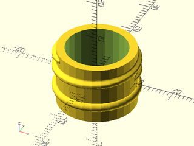

# LibFile: bottlecaps.scad

Bottle caps and necks for PCO18XX standard plastic beverage bottles.

To use, add the following lines to the beginning of your file:

    include <BOSL2/std.scad>
    include <BOSL2/bottlecaps.scad>

## Table of Contents

1. [Section: PCO-1810 Bottle Threading](#section-pco-1810-bottle-threading)
    - [`pco1810_neck()`](#module-pco1810_neck)
    - [`pco1810_cap()`](#module-pco1810_cap)

2. [Section: PCO-1881 Bottle Threading](#section-pco-1881-bottle-threading)
    - [`pco1881_neck()`](#module-pco1881_neck)
    - [`pco1881_cap()`](#module-pco1881_cap)

3. [Section: Generic Bottle Connectors](#section-generic-bottle-connectors)
    - [`generic_bottle_neck()`](#module-generic_bottle_neck)
    - [`generic_bottle_cap()`](#module-generic_bottle_cap)
    - [`bottle_adapter_neck_to_cap()`](#module-bottle_adapter_neck_to_cap)
    - [`bottle_adapter_cap_to_cap()`](#module-bottle_adapter_cap_to_cap)
    - [`bottle_adapter_neck_to_neck()`](#module-bottle_adapter_neck_to_neck)

4. [Section: SPI Bottle Threading](#section-spi-bottle-threading)
    - [`sp_neck()`](#module-sp_neck)
    - [`sp_diameter()`](#function-sp_diameter)

## Section: PCO-1810 Bottle Threading

### Module: pco1810\_neck()

**Usage:** 

- pco1810\_neck([wall])

**Description:** 

Creates an approximation of a standard PCO-1810 threaded beverage bottle neck.

**Arguments:** 

<abbr title="These args can be used by position or by name.">By&nbsp;Position</abbr> | What it does
-------------------- | ------------
`wall`               | Wall thickness in mm.

<abbr title="These args must be used by name, ie: name=value">By&nbsp;Name</abbr> | What it does
-------------------- | ------------
`anchor`             | Translate so anchor point is at origin (0,0,0).  See [anchor](attachments.scad#subsection-anchor).  Default: `CENTER`
`spin`               | Rotate this many degrees around the Z axis after anchor.  See [spin](attachments.scad#subsection-spin).  Default: `0`
`orient`             | Vector to rotate top towards, after spin.  See [orient](attachments.scad#subsection-orient).  Default: `UP`

**Extra Anchors:** 

Anchor Name | Position
----------- | --------
"tamper-ring" | Centered at the top of the anti-tamper ring channel.
"support-ring" | Centered at the bottom of the support ring.

**Example 1:** 

    include <BOSL2/std.scad>
    include <BOSL2/bottlecaps.scad>
    pco1810_neck();

  

**Example 2:** Standard Anchors

    include <BOSL2/std.scad>
    include <BOSL2/bottlecaps.scad>
    pco1810_neck() show_anchors(custom=false);

  

**Example 3:** Custom Named Anchors

    include <BOSL2/std.scad>
    include <BOSL2/bottlecaps.scad>
    expose_anchors(0.3)
        pco1810_neck()
            show_anchors(std=false);

  

---

### Module: pco1810\_cap()

**Usage:** 

- pco1810\_cap([wall], [texture]);

**Description:** 

Creates a basic cap for a PCO1810 threaded beverage bottle.

**Arguments:** 

<abbr title="These args can be used by position or by name.">By&nbsp;Position</abbr> | What it does
-------------------- | ------------
`wall`               | Wall thickness in mm.
`texture`            | The surface texture of the cap.  Valid values are "none", "knurled", or "ribbed".  Default: "none"

<abbr title="These args must be used by name, ie: name=value">By&nbsp;Name</abbr> | What it does
-------------------- | ------------
`anchor`             | Translate so anchor point is at origin (0,0,0).  See [anchor](attachments.scad#subsection-anchor).  Default: `CENTER`
`spin`               | Rotate this many degrees around the Z axis after anchor.  See [spin](attachments.scad#subsection-spin).  Default: `0`
`orient`             | Vector to rotate top towards, after spin.  See [orient](attachments.scad#subsection-orient).  Default: `UP`

**Extra Anchors:** 

Anchor Name | Position
----------- | --------
"inside-top" | Centered on the inside top of the cap.

**Example 1:** 

    include <BOSL2/std.scad>
    include <BOSL2/bottlecaps.scad>
    pco1810_cap();

  

**Example 2:** 

    include <BOSL2/std.scad>
    include <BOSL2/bottlecaps.scad>
    pco1810_cap(texture="knurled");

  

**Example 3:** 

    include <BOSL2/std.scad>
    include <BOSL2/bottlecaps.scad>
    pco1810_cap(texture="ribbed");

  

**Example 4:** Standard Anchors

    include <BOSL2/std.scad>
    include <BOSL2/bottlecaps.scad>
    pco1810_cap(texture="ribbed") show_anchors(custom=false);

  

**Example 5:** Custom Named Anchors

    include <BOSL2/std.scad>
    include <BOSL2/bottlecaps.scad>
    expose_anchors(0.3)
        pco1810_cap(texture="ribbed")
            show_anchors(std=false);

  

---

## Section: PCO-1881 Bottle Threading

### Module: pco1881\_neck()

**Usage:** 

- pco1881\_neck([wall])

**Description:** 

Creates an approximation of a standard PCO-1881 threaded beverage bottle neck.

**Arguments:** 

<abbr title="These args can be used by position or by name.">By&nbsp;Position</abbr> | What it does
-------------------- | ------------
`wall`               | Wall thickness in mm.

<abbr title="These args must be used by name, ie: name=value">By&nbsp;Name</abbr> | What it does
-------------------- | ------------
`anchor`             | Translate so anchor point is at origin (0,0,0).  See [anchor](attachments.scad#subsection-anchor).  Default: `CENTER`
`spin`               | Rotate this many degrees around the Z axis after anchor.  See [spin](attachments.scad#subsection-spin).  Default: `0`
`orient`             | Vector to rotate top towards, after spin.  See [orient](attachments.scad#subsection-orient).  Default: `UP`

**Extra Anchors:** 

Anchor Name | Position
----------- | --------
"tamper-ring" | Centered at the top of the anti-tamper ring channel.
"support-ring" | Centered at the bottom of the support ring.

**Example 1:** 

    include <BOSL2/std.scad>
    include <BOSL2/bottlecaps.scad>
    pco1881_neck();

  

**Example 2:** 

    include <BOSL2/std.scad>
    include <BOSL2/bottlecaps.scad>
    pco1881_neck() show_anchors(custom=false);

  

**Example 3:** 

    include <BOSL2/std.scad>
    include <BOSL2/bottlecaps.scad>
    expose_anchors(0.3)
        pco1881_neck()
            show_anchors(std=false);

  

---

### Module: pco1881\_cap()

**Usage:** 

- pco1881\_cap(wall, [texture]);

**Description:** 

Creates a basic cap for a PCO1881 threaded beverage bottle.

**Arguments:** 

<abbr title="These args can be used by position or by name.">By&nbsp;Position</abbr> | What it does
-------------------- | ------------
`wall`               | Wall thickness in mm.
`texture`            | The surface texture of the cap.  Valid values are "none", "knurled", or "ribbed".  Default: "none"
`anchor`             | Translate so anchor point is at origin (0,0,0).  See [anchor](attachments.scad#subsection-anchor).  Default: `CENTER`
`spin`               | Rotate this many degrees around the Z axis after anchor.  See [spin](attachments.scad#subsection-spin).  Default: `0`
`orient`             | Vector to rotate top towards, after spin.  See [orient](attachments.scad#subsection-orient).  Default: `UP`

**Extra Anchors:** 

Anchor Name | Position
----------- | --------
"inside-top" | Centered on the inside top of the cap.

**Example 1:** 

    include <BOSL2/std.scad>
    include <BOSL2/bottlecaps.scad>
    pco1881_cap();

  

**Example 2:** 

    include <BOSL2/std.scad>
    include <BOSL2/bottlecaps.scad>
    pco1881_cap(texture="knurled");

  

**Example 3:** 

    include <BOSL2/std.scad>
    include <BOSL2/bottlecaps.scad>
    pco1881_cap(texture="ribbed");

  

**Example 4:** Standard Anchors

    include <BOSL2/std.scad>
    include <BOSL2/bottlecaps.scad>
    pco1881_cap(texture="ribbed") show_anchors(custom=false);

  

**Example 5:** Custom Named Anchors

    include <BOSL2/std.scad>
    include <BOSL2/bottlecaps.scad>
    expose_anchors(0.5)
        pco1881_cap(texture="ribbed")
            show_anchors(std=false);

  

---

## Section: Generic Bottle Connectors

### Module: generic\_bottle\_neck()

**Usage:** 

- generic\_bottle\_neck([wall], ...)

**Description:** 

Creates a bottle neck given specifications.

**Arguments:** 

<abbr title="These args can be used by position or by name.">By&nbsp;Position</abbr> | What it does
-------------------- | ------------
`wall`               | distance between ID and any wall that may be below the support
`neck_d`             | Outer diameter of neck without threads
`id`                 | Inner diameter of neck
`thread_od`          | Outer diameter of thread
`height`             | Height of neck above support
`support_d`          | Outer diameter of support ring.  Set to 0 for no support.
`pitch`              | Thread pitch
`round_supp`         | True to round the lower edge of the support ring

<abbr title="These args must be used by name, ie: name=value">By&nbsp;Name</abbr> | What it does
-------------------- | ------------
`anchor`             | Translate so anchor point is at origin (0,0,0).  See [anchor](attachments.scad#subsection-anchor).  Default: `CENTER`
`spin`               | Rotate this many degrees around the Z axis after anchor.  See [spin](attachments.scad#subsection-spin).  Default: `0`
`orient`             | Vector to rotate top towards, after spin.  See [orient](attachments.scad#subsection-orient).  Default: `UP`

**Extra Anchors:** 

Anchor Name | Position
----------- | --------
"support-ring" | Centered at the bottom of the support ring.

**Example 1:** 

    include <BOSL2/std.scad>
    include <BOSL2/bottlecaps.scad>
    generic_bottle_neck();

  

---

### Module: generic\_bottle\_cap()

**Usage:** 

- generic\_bottle\_cap(wall, [texture], ...);

**Description:** 

Creates a basic threaded cap given specifications.

**Arguments:** 

<abbr title="These args can be used by position or by name.">By&nbsp;Position</abbr> | What it does
-------------------- | ------------
`wall`               | Wall thickness in mm.
`texture`            | The surface texture of the cap.  Valid values are "none", "knurled", or "ribbed".  Default: "none"

<abbr title="These args must be used by name, ie: name=value">By&nbsp;Name</abbr> | What it does
-------------------- | ------------
`height`             | Interior height of the cap in mm.
`thread_od`          | Outer diameter of the threads in mm.
`tolerance`          | Extra space to add to the outer diameter of threads and neck in mm.  Applied to radius.
`neck_od`            | Outer diameter of neck in mm.
`flank_angle`        | Angle of taper on threads.
`pitch`              | Thread pitch in mm.
`anchor`             | Translate so anchor point is at origin (0,0,0).  See [anchor](attachments.scad#subsection-anchor).  Default: `CENTER`
`spin`               | Rotate this many degrees around the Z axis after anchor.  See [spin](attachments.scad#subsection-spin).  Default: `0`
`orient`             | Vector to rotate top towards, after spin.  See [orient](attachments.scad#subsection-orient).  Default: `UP`

**Extra Anchors:** 

Anchor Name | Position
----------- | --------
"inside-top" | Centered on the inside top of the cap.

**Example 1:** 

    include <BOSL2/std.scad>
    include <BOSL2/bottlecaps.scad>
    generic_bottle_cap();

  

**Example 2:** 

    include <BOSL2/std.scad>
    include <BOSL2/bottlecaps.scad>
    generic_bottle_cap(texture="knurled");

  

**Example 3:** 

    include <BOSL2/std.scad>
    include <BOSL2/bottlecaps.scad>
    generic_bottle_cap(texture="ribbed");

  

---

### Module: bottle\_adapter\_neck\_to\_cap()

**Usage:** 

- bottle\_adapter\_neck\_to\_cap(wall, [texture]);

**Description:** 

Creates a threaded neck to cap adapter

**Arguments:** 

<abbr title="These args can be used by position or by name.">By&nbsp;Position</abbr> | What it does
-------------------- | ------------
`wall`               | Thickness of wall between neck and cap when d=0.  Leave undefined to have the outside of the tube go from the OD of the neck support ring to the OD of the cap.  Default: undef
`texture`            | The surface texture of the cap.  Valid values are "none", "knurled", or "ribbed".  Default: "none"
`cap_wall`           | Wall thickness of the cap in mm.
`cap_h`              | Interior height of the cap in mm.
`cap_thread_od`      | Outer diameter of cap threads in mm.
`tolerance`          | Extra space to add to the outer diameter of threads and neck in mm.  Applied to radius.
`cap_neck_od`        | Inner diameter of the cap threads.
`cap_neck_id`        | Inner diameter of the hole through the cap.
`cap_thread_taper`   | Angle of taper on threads.
`cap_thread_pitch`   | Thread pitch in mm
`neck_d`             | Outer diameter of neck w/o threads
`neck_id`            | Inner diameter of neck
`neck_thread_od`     | 27.2
`neck_h`             | Height of neck down to support ring
`neck_thread_pitch`  | Thread pitch in mm.
`neck_support_od`    | Outer diameter of neck support ring.  Leave undefined to set equal to OD of cap.  Set to 0 for no ring.  Default: undef
`d`                  | Distance between bottom of neck and top of cap
`taper_lead_in`      | Length to leave straight before tapering on tube between neck and cap if exists.

**Example 1:** 

    include <BOSL2/std.scad>
    include <BOSL2/bottlecaps.scad>
    bottle_adapter_neck_to_cap();

  

---

### Module: bottle\_adapter\_cap\_to\_cap()

**Usage:** 

- bottle\_adapter\_cap\_to\_cap(wall, [texture]);

**Description:** 

Creates a threaded cap to cap adapter.

**Arguments:** 

<abbr title="These args can be used by position or by name.">By&nbsp;Position</abbr> | What it does
-------------------- | ------------
`wall`               | Wall thickness in mm.
`texture`            | The surface texture of the cap.  Valid values are "none", "knurled", or "ribbed".  Default: "none"
`cap_h1`             | Interior height of top cap.
`cap_thread_od1`     | Outer diameter of threads on top cap.
`tolerance`          | Extra space to add to the outer diameter of threads and neck in mm.  Applied to radius.
`cap_neck_od1`       | Inner diameter of threads on top cap.
`cap_thread_pitch1`  | Thread pitch of top cap in mm.
`cap_h2`             | Interior height of bottom cap.  Leave undefined to duplicate cap_h1.
`cap_thread_od2`     | Outer diameter of threads on bottom cap.  Leave undefined to duplicate capThread1.
`cap_neck_od2`       | Inner diameter of threads on top cap.  Leave undefined to duplicate cap_neck_od1.
`cap_thread_pitch2`  | Thread pitch of bottom cap in mm.  Leave undefinced to duplicate cap_thread_pitch1.
`d`                  | Distance between caps.
`neck_id1`           | Inner diameter of cutout in top cap.
`neck_id2`           | Inner diameter of cutout in bottom cap.
`taper_lead_in`      | Length to leave straight before tapering on tube between caps if exists.

**Example 1:** 

    include <BOSL2/std.scad>
    include <BOSL2/bottlecaps.scad>
    bottle_adapter_cap_to_cap();

  

---

### Module: bottle\_adapter\_neck\_to\_neck()

**Usage:** 

- bottle\_adapter\_neck\_to\_neck();

**Description:** 

Creates a threaded neck to neck adapter.

**Arguments:** 

<abbr title="These args can be used by position or by name.">By&nbsp;Position</abbr> | What it does
-------------------- | ------------
`d`                  | Distance between bottoms of necks
`neck_od1`           | Outer diameter of top neck w/o threads
`neck_id1`           | Inner diameter of top neck
`thread_od1`         | Outer diameter of threads on top neck
`height1`            | Height of top neck above support ring.
`support_od1`        | Outer diameter of the support ring on the top neck.  Set to 0 for no ring.
`thread_pitch1`      | Thread pitch of top neck.
`neck_od2`           | Outer diameter of bottom neck w/o threads.  Leave undefined to duplicate neck_od1
`neck_id2`           | Inner diameter of bottom neck.  Leave undefined to duplicate neck_id1
`thread_od2`         | Outer diameter of threads on bottom neck.  Leave undefined to duplicate thread_od1
`height2`            | Height of bottom neck above support ring.  Leave undefined to duplicate height1
`support_od2`        | Outer diameter of the support ring on bottom neck.  Set to 0 for no ring.  Leave undefined to duplicate support_od1
`pitch2`             | Thread pitch of bottom neck.  Leave undefined to duplicate thread_pitch1
`taper_lead_in`      | Length to leave straight before tapering on tube between necks if exists.
`wall`               | Thickness of tube wall between necks.  Leave undefined to match outer diameters with the neckODs/supportODs.

**Example 1:** 

    include <BOSL2/std.scad>
    include <BOSL2/bottlecaps.scad>
    bottle_adapter_neck_to_neck();

  

---

## Section: SPI Bottle Threading

### Module: sp\_neck()

**Usage:** 

- sp\_neck(diam, type, wall|id, [style], [bead], [anchor], [spin], [orient])

**Description:** 

Make a SPI (Society of Plastics Industry) threaded bottle neck.  You must
supply the nominal outer diameter of the threads and the thread type, one of
400, 410 and 415.  The 400 type neck has 360 degrees of thread, the 410
neck has 540 degrees of thread, and the 415 neck has 720 degrees of thread.
You can also choose between the L style thread, which is symmetric and
the M style thread, which is an asymmetric buttress thread.  You can
specify the wall thickness (measured from the base of the threads) or
the inner diameter, and you can specify an optional bead at the base of the threads.

**Arguments:** 

<abbr title="These args can be used by position or by name.">By&nbsp;Position</abbr> | What it does
-------------------- | ------------
`diam`               | nominal outer diameter of threads
`type`               | thread type, one of 400, 410 and 415
`wall`               | wall thickness

<abbr title="These args must be used by name, ie: name=value">By&nbsp;Name</abbr> | What it does
-------------------- | ------------
`id`                 | inner diameter
`style`              | Either "L" or "M" to specify the thread style.  Default: "L"
`bead`               | if true apply a bad to the neck.  Default: false
`anchor`             | Translate so anchor point is at origin (0,0,0).  See [anchor](attachments.scad#subsection-anchor).  Default: `CENTER`
`spin`               | Rotate this many degrees around the Z axis after anchor.  See [spin](attachments.scad#subsection-spin).  Default: `0`
`orient`             | Vector to rotate top towards, after spin.  See [orient](attachments.scad#subsection-orient).  Default: `UP`

**Example 1:** 

    include <BOSL2/std.scad>
    include <BOSL2/bottlecaps.scad>
    sp_neck(48,400,2);

  

**Example 2:** 

    include <BOSL2/std.scad>
    include <BOSL2/bottlecaps.scad>
    sp_neck(48,400,2,bead=true);

  

**Example 3:** 

    include <BOSL2/std.scad>
    include <BOSL2/bottlecaps.scad>
    sp_neck(22,410,2);

  

**Example 4:** 

    include <BOSL2/std.scad>
    include <BOSL2/bottlecaps.scad>
    sp_neck(22,410,2,bead=true);

  

**Example 5:** 

    include <BOSL2/std.scad>
    include <BOSL2/bottlecaps.scad>
    sp_neck(28,415,id=20,style="M");

  

**Example 6:** 

    include <BOSL2/std.scad>
    include <BOSL2/bottlecaps.scad>
    sp_neck(13,415,wall=1,style="M",bead=true);

  

---

### Function: sp\_diameter()

**Usage:** 

- true\_diam = sp\_diameter(diam,type)

**Description:** 

Returns the actual base diameter (root of the threads) for a SPI plastic bottle neck given the nominal diameter and type number (400, 410, 415).

---

