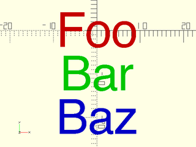
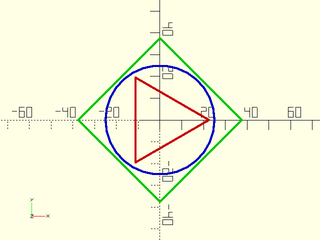
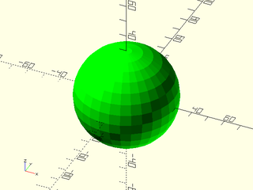
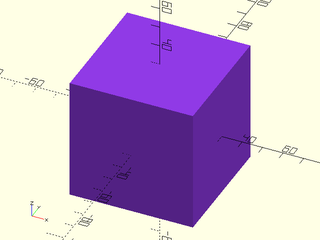

# LibFile: color.scad

HSV and HSL conversion, and raindow module for coloring multiple objects.

To use, add the following lines to the beginning of your file:

    include <BOSL2/std.scad>

## Table of Contents

1. [Section: Coloring Objects](#section-coloring-objects)
    - [`rainbow()`](#module-rainbow)

2. [Section: Colorspace Conversion](#section-colorspace-conversion)
    - [`HSL()`](#functionmodule-hsl)
    - [`HSV()`](#functionmodule-hsv)

## Section: Coloring Objects

### Module: rainbow()

**Usage:** 

- rainbow(list) ...

**Description:** 

Iterates the list, displaying children in different colors for each list item.
This is useful for debugging lists of paths and such.

**Arguments:** 

<abbr title="These args can be used by position or by name.">By&nbsp;Position</abbr> | What it does
-------------------- | ------------
`list`               | The list of items to iterate through.
`stride`             | Consecutive colors stride around the color wheel divided into this many parts.
`maxhues`            | max number of hues to use (to prevent lots of indistinguishable hues)
`shuffle`            | if true then shuffle the hues in a random order.  Default: false
`seed`               | seed to use for shuffle

**Side Effects:** 

- Sets the color to progressive values along the ROYGBIV spectrum for each item.
- Sets `$idx` to the index of the current item in `list` that we want to show.
- Sets `$item` to the current item in `list` that we want to show.

**Example 1:** 

 

    include <BOSL2/std.scad>
    rainbow(["Foo","Bar","Baz"]) fwd($idx*10) text(text=$item,size=8,halign="center",valign="center");

**Example 2:** 

    include <BOSL2/std.scad>
    rgn = [circle(d=45,$fn=3), circle(d=75,$fn=4), circle(d=50)];
    rainbow(rgn) stroke($item, closed=true);

  

---

## Section: Colorspace Conversion

### Function/Module: HSL()

**Usage:** 

- HSL(h,[s],[l],[a]) ...
- rgb = HSL(h,[s],[l]);

**Description:** 

When called as a function, returns the [R,G,B] color for the given hue `h`, saturation `s`, and lightness `l` from the HSL colorspace.
When called as a module, sets the color to the given hue `h`, saturation `s`, and lightness `l` from the HSL colorspace.

**Arguments:** 

<abbr title="These args can be used by position or by name.">By&nbsp;Position</abbr> | What it does
-------------------- | ------------
`h`                  | The hue, given as a value between 0 and 360.  0=red, 60=yellow, 120=green, 180=cyan, 240=blue, 300=magenta.
`s`                  | The saturation, given as a value between 0 and 1.  0 = grayscale, 1 = vivid colors.  Default: 1
`l`                  | The lightness, between 0 and 1.  0 = black, 0.5 = bright colors, 1 = white.  Default: 0.5
`a`                  | When called as a module, specifies the alpha channel as a value between 0 and 1.  0 = fully transparent, 1=opaque.  Default: 1

**Example 1:** 

    include <BOSL2/std.scad>
    HSL(h=120,s=1,l=0.5) sphere(d=60);

  

**Example 2:** 

    include <BOSL2/std.scad>
    rgb = HSL(h=270,s=0.75,l=0.6);
    color(rgb) cube(60, center=true);

  

---

### Function/Module: HSV()

**Usage:** 

- HSV(h,[s],[v],[a]) ...
- rgb = HSV(h,[s],[v]);

**Description:** 

When called as a function, returns the [R,G,B] color for the given hue `h`, saturation `s`, and value `v` from the HSV colorspace.
When called as a module, sets the color to the given hue `h`, saturation `s`, and value `v` from the HSV colorspace.

**Arguments:** 

<abbr title="These args can be used by position or by name.">By&nbsp;Position</abbr> | What it does
-------------------- | ------------
`h`                  | The hue, given as a value between 0 and 360.  0=red, 60=yellow, 120=green, 180=cyan, 240=blue, 300=magenta.
`s`                  | The saturation, given as a value between 0 and 1.  0 = grayscale, 1 = vivid colors.  Default: 1
`v`                  | The value, between 0 and 1.  0 = darkest black, 1 = bright.  Default: 1
`a`                  | When called as a module, specifies the alpha channel as a value between 0 and 1.  0 = fully transparent, 1=opaque.  Default: 1

**Example 1:** 

    include <BOSL2/std.scad>
    HSV(h=120,s=1,v=1) sphere(d=60);

  

**Example 2:** 

    include <BOSL2/std.scad>
    rgb = HSV(h=270,s=0.75,v=0.9);
    color(rgb) cube(60, center=true);

  

---

