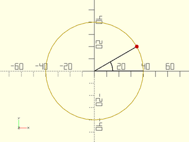
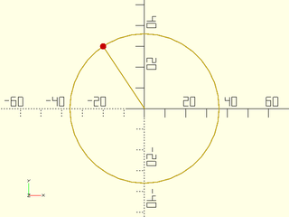
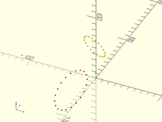

# LibFile: coords.scad

Coordinate transformations and coordinate system conversions.

To use, add the following lines to the beginning of your file:

    include <BOSL2/std.scad>

## Table of Contents

1. [Section: Coordinate Manipulation](#section-coordinate-manipulation)
    - [`point2d()`](#function-point2d)
    - [`path2d()`](#function-path2d)
    - [`point3d()`](#function-point3d)
    - [`path3d()`](#function-path3d)
    - [`point4d()`](#function-point4d)
    - [`path4d()`](#function-path4d)

2. [Section: Coordinate Systems](#section-coordinate-systems)
    - [`polar_to_xy()`](#function-polar_to_xy)
    - [`xy_to_polar()`](#function-xy_to_polar)
    - [`project_plane()`](#function-project_plane)
    - [`lift_plane()`](#function-lift_plane)
    - [`cylindrical_to_xyz()`](#function-cylindrical_to_xyz)
    - [`xyz_to_cylindrical()`](#function-xyz_to_cylindrical)
    - [`spherical_to_xyz()`](#function-spherical_to_xyz)
    - [`xyz_to_spherical()`](#function-xyz_to_spherical)
    - [`altaz_to_xyz()`](#function-altaz_to_xyz)
    - [`xyz_to_altaz()`](#function-xyz_to_altaz)

## Section: Coordinate Manipulation

### Function: point2d()

**Usage:** 

- pt = point2d(p, [fill]);

**Topics:** [Coordinates](Topics#coordinates), [Points](Topics#points)

**Description:** 

Returns a 2D vector/point from a 2D or 3D vector.  If given a 3D point, removes the Z coordinate.

**Arguments:** 

<abbr title="These args can be used by position or by name.">By&nbsp;Position</abbr> | What it does
-------------------- | ------------
`p`                  | The coordinates to force into a 2D vector/point.
`fill`               | Value to fill missing values in vector with.

**See Also:** [path2d()](#function-path2d), [point3d()](#function-point3d), [path3d()](#function-path3d)

---

### Function: path2d()

**Usage:** 

- pts = path2d(points);

**Topics:** [Coordinates](Topics#coordinates), [Points](Topics#points), [Paths](Topics#paths)

**Description:** 

Returns a list of 2D vectors/points from a list of 2D, 3D or higher dimensional vectors/points.
Removes the extra coordinates from higher dimensional points.  The input must be a path, where
every vector has the same length.

**Arguments:** 

<abbr title="These args can be used by position or by name.">By&nbsp;Position</abbr> | What it does
-------------------- | ------------
`points`             | A list of 2D or 3D points/vectors.

**See Also:** [point2d()](#function-point2d), [point3d()](#function-point3d), [path3d()](#function-path3d)

---

### Function: point3d()

**Usage:** 

- pt = point3d(p, [fill]);

**Topics:** [Coordinates](Topics#coordinates), [Points](Topics#points)

**Description:** 

Returns a 3D vector/point from a 2D or 3D vector.

**Arguments:** 

<abbr title="These args can be used by position or by name.">By&nbsp;Position</abbr> | What it does
-------------------- | ------------
`p`                  | The coordinates to force into a 3D vector/point.
`fill`               | Value to fill missing values in vector with.

**See Also:** [path2d()](#function-path2d), [point2d()](#function-point2d), [path3d()](#function-path3d)

---

### Function: path3d()

**Usage:** 

- pts = path3d(points, [fill]);

**Topics:** [Coordinates](Topics#coordinates), [Points](Topics#points), [Paths](Topics#paths)

**Description:** 

Returns a list of 3D vectors/points from a list of 2D or higher dimensional vectors/points
by removing extra coordinates or adding the z coordinate.

**Arguments:** 

<abbr title="These args can be used by position or by name.">By&nbsp;Position</abbr> | What it does
-------------------- | ------------
`points`             | A list of 2D, 3D or higher dimensional points/vectors.
`fill`               | Value to fill missing values in vectors with (in the 2D case)

**See Also:** [point2d()](#function-point2d), [path2d()](#function-path2d), [point3d()](#function-point3d)

---

### Function: point4d()

**Usage:** 

- pt = point4d(p, [fill]);

**Topics:** [Coordinates](Topics#coordinates), [Points](Topics#points)

**Description:** 

Returns a 4D vector/point from a 2D or 3D vector.

**Arguments:** 

<abbr title="These args can be used by position or by name.">By&nbsp;Position</abbr> | What it does
-------------------- | ------------
`p`                  | The coordinates to force into a 4D vector/point.
`fill`               | Value to fill missing values in vector with.

**See Also:** [point2d()](#function-point2d), [path2d()](#function-path2d), [point3d()](#function-point3d), [path3d()](#function-path3d), [path4d()](#function-path4d)

---

### Function: path4d()

**Usage:** 

- pt = path4d(points, [fill]);

**Topics:** [Coordinates](Topics#coordinates), [Points](Topics#points), [Paths](Topics#paths)

**Description:** 

Returns a list of 4D vectors/points from a list of 2D or 3D vectors/points.

**Arguments:** 

<abbr title="These args can be used by position or by name.">By&nbsp;Position</abbr> | What it does
-------------------- | ------------
`points`             | A list of 2D or 3D points/vectors.
`fill`               | Value to fill missing values in vectors with.

**See Also:** [point2d()](#function-point2d), [path2d()](#function-path2d), [point3d()](#function-point3d), [path3d()](#function-path3d), [point4d()](#function-point4d)

---

## Section: Coordinate Systems

### Function: polar\_to\_xy()

**Usage:** 

- pt = polar\_to\_xy(r, theta);
- pt = polar\_to\_xy([r, theta]);

**Topics:** [Coordinates](Topics#coordinates), [Points](Topics#points), [Paths](Topics#paths)

**Description:** 

Convert polar coordinates to 2D cartesian coordinates.
Returns [X,Y] cartesian coordinates.

**Arguments:** 

<abbr title="These args can be used by position or by name.">By&nbsp;Position</abbr> | What it does
-------------------- | ------------
`r`                  | distance from the origin.
`theta`              | angle in degrees, counter-clockwise of X+.

**See Also:** [xy\_to\_polar()](#function-xy_to_polar), [xyz\_to\_cylindrical()](#function-xyz_to_cylindrical), [cylindrical\_to\_xyz()](#function-cylindrical_to_xyz), [xyz\_to\_spherical()](#function-xyz_to_spherical), [spherical\_to\_xyz()](#function-spherical_to_xyz)

**Example 1:** 

    include <BOSL2/std.scad>
    xy = polar_to_xy(20,45);    // Returns: ~[14.1421365, 14.1421365]
    xy = polar_to_xy(40,30);    // Returns: ~[34.6410162, 15]
    xy = polar_to_xy([40,30]);  // Returns: ~[34.6410162, 15]

  

**Example 2:** 

    include <BOSL2/std.scad>
    r=40; ang=30; $fn=36;
    pt = polar_to_xy(r,ang);
    stroke(circle(r=r), closed=true, width=0.5);
    color("black") stroke([[r,0], [0,0], pt], width=0.5);
    color("black") stroke(arc(r=15, angle=ang), width=0.5);
    color("red") move(pt) circle(d=3);

  

---

### Function: xy\_to\_polar()

**Usage:** 

- r\_theta = xy\_to\_polar(x,y);
- r\_theta = xy\_to\_polar([X,Y]);

**Topics:** [Coordinates](Topics#coordinates), [Points](Topics#points), [Paths](Topics#paths)

**Description:** 

Convert 2D cartesian coordinates to polar coordinates.
Returns [radius, theta] where theta is the angle counter-clockwise of X+.

**Arguments:** 

<abbr title="These args can be used by position or by name.">By&nbsp;Position</abbr> | What it does
-------------------- | ------------
`x`                  | X coordinate.
`y`                  | Y coordinate.

**See Also:** [polar\_to\_xy()](#function-polar_to_xy), [xyz\_to\_cylindrical()](#function-xyz_to_cylindrical), [cylindrical\_to\_xyz()](#function-cylindrical_to_xyz), [xyz\_to\_spherical()](#function-xyz_to_spherical), [spherical\_to\_xyz()](#function-spherical_to_xyz)

**Example 1:** 

    include <BOSL2/std.scad>
    plr = xy_to_polar(20,30);
    plr = xy_to_polar([40,60]);

  

**Example 2:** 

    include <BOSL2/std.scad>
    pt = [-20,30]; $fn = 36;
    rt = xy_to_polar(pt);
    r = rt[0]; ang = rt[1];
    stroke(circle(r=r), closed=true, width=0.5);
    zrot(ang) stroke([[0,0],[r,0]],width=0.5);
    color("red") move(pt) circle(d=3);

  

---

### Function: project\_plane()

**Usage:** 

- xy = project\_plane(plane, p);

**Usage:** To get a transform matrix

- M = project\_plane(plane)

**Topics:** [Coordinates](Topics#coordinates), [Points](Topics#points), [Paths](Topics#paths)

**Description:** 

Maps the provided 3d point(s) from 3D coordinates to a 2d coordinate system defined by `plane`.  Points that are not
on the specified plane will be projected orthogonally onto the plane.  This coordinate system is useful if you need
to perform 2d operations on a coplanar set of data.  After those operations are done you can return the data
to 3d with `lift_plane()`.  You could also use this to force approximately coplanar data to be exactly coplanar.
The parameter p can be a point, path, region, bezier patch or VNF.
The plane can be specified as
- A list of three points.  The planar coordinate system will have [0,0] at plane[0], and plane[1] will lie on the Y+ axis.
- A list of coplanar points that define a plane (not-collinear)
- A plane definition `[A,B,C,D]` where `Ax+By+CZ=D`.  The closest point on that plane to the origin will map to the origin in the new coordinate system.

If you omit the point specification then `project_plane()` returns a rotation matrix that maps the specified plane to the XY plane.
Note that if you apply this transformation to data lying on the plane it will produce 3D points with the Z coordinate of zero.

**Arguments:** 

<abbr title="These args can be used by position or by name.">By&nbsp;Position</abbr> | What it does
-------------------- | ------------
`plane`              | plane specification or point list defining the plane
`p`                  | 3D point, path, region, VNF or bezier patch to project

**Example 1:** 

    include <BOSL2/std.scad>
    pt = [5,-5,5];
    a=[0,0,0];  b=[10,-10,0];  c=[10,0,10];
    xy = project_plane([a,b,c],pt);

  

**Example 2:** The yellow points in 3D project onto the red points in 2D

 

    include <BOSL2/std.scad>
    M = [[-1, 2, -1, -2], [-1, -3, 2, -1], [2, 3, 4, 53], [0, 0, 0, 1]];
    data = apply(M,path3d(circle(r=10, $fn=20)));
    move_copies(data) sphere(r=1);
    color("red") move_copies(project_plane(data, data)) sphere(r=1);

**Example 3:** 

    include <BOSL2/std.scad>
    xyzpath = move([10,20,30], p=yrot(25, p=path3d(circle(d=100))));
    mat = project_plane(xyzpath);
    xypath = path2d(apply(mat, xyzpath));
    #stroke(xyzpath,closed=true);
    stroke(xypath,closed=true);

  

---

### Function: lift\_plane()

**Usage:** 

- xyz = lift\_plane(plane, p);

**Usage:** to get transform matrix

- M =  lift\_plane(plane);

**Topics:** [Coordinates](Topics#coordinates), [Points](Topics#points), [Paths](Topics#paths)

**Description:** 

Converts the given 2D point on the plane to 3D coordinates of the specified plane.
The parameter p can be a point, path, region, bezier patch or VNF.
The plane can be specified as
- A list of three points.  The planar coordinate system will have [0,0] at plane[0], and plane[1] will lie on the Y+ axis.
- A list of coplanar points that define a plane (not-collinear)
- A plane definition `[A,B,C,D]` where `Ax+By+CZ=D`.  The closest point on that plane to the origin will map to the origin in the new coordinate system.

**Arguments:** 

<abbr title="These args can be used by position or by name.">By&nbsp;Position</abbr> | What it does
-------------------- | ------------
`plane`              | Plane specification or list of points to define a plane
`p`                  | points, path, region, VNF, or bezier patch to transform.

**See Also:** [project\_plane()](#function-project_plane)

---

### Function: cylindrical\_to\_xyz()

**Usage:** 

- pt = cylindrical\_to\_xyz(r, theta, z);
- pt = cylindrical\_to\_xyz([r, theta, z]);

**Topics:** [Coordinates](Topics#coordinates), [Points](Topics#points), [Paths](Topics#paths)

**Description:** 

Convert cylindrical coordinates to 3D cartesian coordinates.  Returns [X,Y,Z] cartesian coordinates.

**Arguments:** 

<abbr title="These args can be used by position or by name.">By&nbsp;Position</abbr> | What it does
-------------------- | ------------
`r`                  | distance from the Z axis.
`theta`              | angle in degrees, counter-clockwise of X+ on the XY plane.
`z`                  | Height above XY plane.

**See Also:** [xyz\_to\_cylindrical()](#function-xyz_to_cylindrical), [xyz\_to\_spherical()](#function-xyz_to_spherical), [spherical\_to\_xyz()](#function-spherical_to_xyz)

**Example 1:** 

    include <BOSL2/std.scad>
    xyz = cylindrical_to_xyz(20,30,40);
    xyz = cylindrical_to_xyz([40,60,50]);

  

---

### Function: xyz\_to\_cylindrical()

**Usage:** 

- rtz = xyz\_to\_cylindrical(x,y,z);
- rtz = xyz\_to\_cylindrical([X,Y,Z]);

**Topics:** [Coordinates](Topics#coordinates), [Points](Topics#points), [Paths](Topics#paths)

**Description:** 

Convert 3D cartesian coordinates to cylindrical coordinates.  Returns [radius,theta,Z].
Theta is the angle counter-clockwise of X+ on the XY plane.  Z is height above the XY plane.

**Arguments:** 

<abbr title="These args can be used by position or by name.">By&nbsp;Position</abbr> | What it does
-------------------- | ------------
`x`                  | X coordinate.
`y`                  | Y coordinate.
`z`                  | Z coordinate.

**See Also:** [cylindrical\_to\_xyz()](#function-cylindrical_to_xyz), [xyz\_to\_spherical()](#function-xyz_to_spherical), [spherical\_to\_xyz()](#function-spherical_to_xyz)

**Example 1:** 

    include <BOSL2/std.scad>
    cyl = xyz_to_cylindrical(20,30,40);
    cyl = xyz_to_cylindrical([40,50,70]);

  

---

### Function: spherical\_to\_xyz()

**Usage:** 

- pt = spherical\_to\_xyz(r, theta, phi);
- pt = spherical\_to\_xyz([r, theta, phi]);

**Topics:** [Coordinates](Topics#coordinates), [Points](Topics#points), [Paths](Topics#paths)

**Description:** 

Convert spherical coordinates to 3D cartesian coordinates.  Returns [X,Y,Z] cartesian coordinates.

**Arguments:** 

<abbr title="These args can be used by position or by name.">By&nbsp;Position</abbr> | What it does
-------------------- | ------------
`r`                  | distance from origin.
`theta`              | angle in degrees, counter-clockwise of X+ on the XY plane.
`phi`                | angle in degrees from the vertical Z+ axis.

**See Also:** [cylindrical\_to\_xyz()](#function-cylindrical_to_xyz), [xyz\_to\_spherical()](#function-xyz_to_spherical), [xyz\_to\_cylindrical()](#function-xyz_to_cylindrical)

**Example 1:** 

    include <BOSL2/std.scad>
    xyz = spherical_to_xyz(20,30,40);
    xyz = spherical_to_xyz([40,60,50]);

  

---

### Function: xyz\_to\_spherical()

**Usage:** 

- r\_theta\_phi = xyz\_to\_spherical(x,y,z)
- r\_theta\_phi = xyz\_to\_spherical([X,Y,Z])

**Topics:** [Coordinates](Topics#coordinates), [Points](Topics#points), [Paths](Topics#paths)

**Description:** 

Convert 3D cartesian coordinates to spherical coordinates.  Returns [r,theta,phi], where phi is
the angle from the Z+ pole, and theta is degrees counter-clockwise of X+ on the XY plane.

**Arguments:** 

<abbr title="These args can be used by position or by name.">By&nbsp;Position</abbr> | What it does
-------------------- | ------------
`x`                  | X coordinate.
`y`                  | Y coordinate.
`z`                  | Z coordinate.

**See Also:** [cylindrical\_to\_xyz()](#function-cylindrical_to_xyz), [spherical\_to\_xyz()](#function-spherical_to_xyz), [xyz\_to\_cylindrical()](#function-xyz_to_cylindrical)

**Example 1:** 

    include <BOSL2/std.scad>
    sph = xyz_to_spherical(20,30,40);
    sph = xyz_to_spherical([40,50,70]);

  

---

### Function: altaz\_to\_xyz()

**Usage:** 

- pt = altaz\_to\_xyz(alt, az, r);
- pt = altaz\_to\_xyz([alt, az, r]);

**Topics:** [Coordinates](Topics#coordinates), [Points](Topics#points), [Paths](Topics#paths)

**Description:** 

Convert altitude/azimuth/range coordinates to 3D cartesian coordinates.
Returns [X,Y,Z] cartesian coordinates.

**Arguments:** 

<abbr title="These args can be used by position or by name.">By&nbsp;Position</abbr> | What it does
-------------------- | ------------
`alt`                | altitude angle in degrees above the XY plane.
`az`                 | azimuth angle in degrees clockwise of Y+ on the XY plane.
`r`                  | distance from origin.

**See Also:** [cylindrical\_to\_xyz()](#function-cylindrical_to_xyz), [xyz\_to\_spherical()](#function-xyz_to_spherical), [spherical\_to\_xyz()](#function-spherical_to_xyz), [xyz\_to\_cylindrical()](#function-xyz_to_cylindrical), [xyz\_to\_altaz()](#function-xyz_to_altaz)

**Example 1:** 

    include <BOSL2/std.scad>
    xyz = altaz_to_xyz(20,30,40);
    xyz = altaz_to_xyz([40,60,50]);

  

---

### Function: xyz\_to\_altaz()

**Usage:** 

- alt\_az\_r = xyz\_to\_altaz(x,y,z);
- alt\_az\_r = xyz\_to\_altaz([X,Y,Z]);

**Topics:** [Coordinates](Topics#coordinates), [Points](Topics#points), [Paths](Topics#paths)

**Description:** 

Convert 3D cartesian coordinates to altitude/azimuth/range coordinates.
Returns [altitude,azimuth,range], where altitude is angle above the
XY plane, azimuth is degrees clockwise of Y+ on the XY plane, and
range is the distance from the origin.

**Arguments:** 

<abbr title="These args can be used by position or by name.">By&nbsp;Position</abbr> | What it does
-------------------- | ------------
`x`                  | X coordinate.
`y`                  | Y coordinate.
`z`                  | Z coordinate.

**See Also:** [cylindrical\_to\_xyz()](#function-cylindrical_to_xyz), [xyz\_to\_spherical()](#function-xyz_to_spherical), [spherical\_to\_xyz()](#function-spherical_to_xyz), [xyz\_to\_cylindrical()](#function-xyz_to_cylindrical), [altaz\_to\_xyz()](#function-altaz_to_xyz)

**Example 1:** 

    include <BOSL2/std.scad>
    aa = xyz_to_altaz(20,30,40);
    aa = xyz_to_altaz([40,50,70]);

  

---

