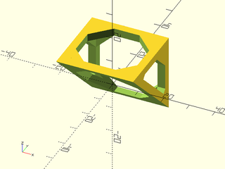
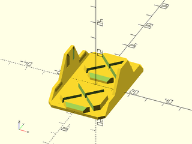
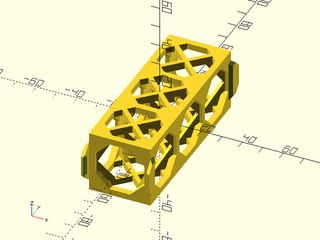

# LibFile: cubetruss.scad

Parts for making modular open-frame cross-braced trusses and connectors.

To use, add the following lines to the beginning of your file:

    include <BOSL2/std.scad>
    include <BOSL2/cubetruss.scad>

## Table of Contents

1. [Section: Cube Trusses](#section-cube-trusses)
    - [`cubetruss_dist()`](#function-cubetruss_dist)
    - [`cubetruss_segment()`](#module-cubetruss_segment)
    - [`cubetruss_support()`](#module-cubetruss_support)
    - [`cubetruss_clip()`](#module-cubetruss_clip)
    - [`cubetruss_foot()`](#module-cubetruss_foot)
    - [`cubetruss_joiner()`](#module-cubetruss_joiner)
    - [`cubetruss_uclip()`](#module-cubetruss_uclip)
    - [`cubetruss()`](#module-cubetruss)
    - [`cubetruss_corner()`](#module-cubetruss_corner)

## Section: Cube Trusses

### Function: cubetruss\_dist()

**Usage:** 

- cubetruss\_dist(cubes, gaps, [size], [strut]);

**Topics:** [Trusses](Topics#trusses)

**Description:** 

Function to calculate the length of a cubetruss truss.

**Arguments:** 

<abbr title="These args can be used by position or by name.">By&nbsp;Position</abbr> | What it does
-------------------- | ------------
`cubes`              | The number of cubes along the truss's length.
`gaps`               | The number of extra strut widths to add in, corresponding to each time a truss butts up against another.
`size`               | The length of each side of the cubetruss cubes.  Default: `$cubetruss_size` (usually 30)
`strut`              | The width of the struts on the cubetruss cubes.  Default: `$cubetruss_strut_size` (usually 3)

---

### Module: cubetruss\_segment()

**Usage:** 

- cubetruss\_segment([size], [strut], [bracing]);

**Topics:** [Attachable](Topics#attachable), [Trusses](Topics#trusses)

**Description:** 

Creates a single cubetruss cube segment.

**Arguments:** 

<abbr title="These args can be used by position or by name.">By&nbsp;Position</abbr> | What it does
-------------------- | ------------
`size`               | The length of each side of the cubetruss cubes.  Default: `$cubetruss_size` (usually 30)
`strut`              | The width of the struts on the cubetruss cubes.  Default: `$cubetruss_strut_size` (usually 3)
`bracing`            | If true, adds internal cross-braces.  Default: `$cubetruss_bracing` (usually true)

<abbr title="These args must be used by name, ie: name=value">By&nbsp;Name</abbr> | What it does
-------------------- | ------------
`anchor`             | Translate so anchor point is at origin (0,0,0).  See [anchor](attachments.scad#subsection-anchor).  Default: `CENTER`
`spin`               | Rotate this many degrees around the Z axis.  See [spin](attachments.scad#subsection-spin).  Default: `0`
`orient`             | Vector to rotate top towards.  See [orient](attachments.scad#subsection-orient).  Default: `UP`

**Example 1:** 

    include <BOSL2/std.scad>
    include <BOSL2/cubetruss.scad>
    cubetruss_segment(bracing=false);

  

**Example 2:** 

    include <BOSL2/std.scad>
    include <BOSL2/cubetruss.scad>
    cubetruss_segment(bracing=true);

  

**Example 3:** 

    include <BOSL2/std.scad>
    include <BOSL2/cubetruss.scad>
    cubetruss_segment(strut=4);

  

**Example 4:** 

    include <BOSL2/std.scad>
    include <BOSL2/cubetruss.scad>
    cubetruss_segment(size=40);

  

---

### Module: cubetruss\_support()

**Usage:** 

- cubetruss\_support([size], [strut]);

**Topics:** [Attachable](Topics#attachable), [Trusses](Topics#trusses)

**Description:** 

Creates a single cubetruss support.

**Arguments:** 

<abbr title="These args can be used by position or by name.">By&nbsp;Position</abbr> | What it does
-------------------- | ------------
`size`               | The length of each side of the cubetruss cubes.  Default: `$cubetruss_size` (usually 30)
`strut`              | The width of the struts on the cubetruss cubes.  Default: `$cubetruss_strut_size` (usually 3)
`extents`            | If given as an integer, specifies the number of vertical segments for the support.  If given as a list of 3 integers, specifies the number of segments in the X, Y, and Z directions.  Default: 1.

<abbr title="These args must be used by name, ie: name=value">By&nbsp;Name</abbr> | What it does
-------------------- | ------------
`anchor`             | Translate so anchor point is at origin (0,0,0).  See [anchor](attachments.scad#subsection-anchor).  Default: `CENTER`
`spin`               | Rotate this many degrees around the Z axis.  See [spin](attachments.scad#subsection-spin).  Default: `0`
`orient`             | Vector to rotate top towards.  See [orient](attachments.scad#subsection-orient).  Default: `UP`

**Example 1:** 

    include <BOSL2/std.scad>
    include <BOSL2/cubetruss.scad>
    cubetruss_support();

  

**Example 2:** 

    include <BOSL2/std.scad>
    include <BOSL2/cubetruss.scad>
    cubetruss_support(extents=2);

  

**Example 3:** 

    include <BOSL2/std.scad>
    include <BOSL2/cubetruss.scad>
    cubetruss_support(extents=3);

  

**Example 4:** 

    include <BOSL2/std.scad>
    include <BOSL2/cubetruss.scad>
    cubetruss_support(extents=[2,2,3]);

  

**Example 5:** 

    include <BOSL2/std.scad>
    include <BOSL2/cubetruss.scad>
    cubetruss_support(strut=4);

  

**Example 6:** 

    include <BOSL2/std.scad>
    include <BOSL2/cubetruss.scad>
    cubetruss_support(extents=2) show_anchors();

  

---

### Module: cubetruss\_clip()

**Usage:** 

- cubetruss\_clip(extents, [size], [strut], [clipthick]);

**Topics:** [Attachable](Topics#attachable), [Trusses](Topics#trusses)

**Description:** 

Creates a pair of clips to add onto the end of a truss.

**Arguments:** 

<abbr title="These args can be used by position or by name.">By&nbsp;Position</abbr> | What it does
-------------------- | ------------
`extents`            | How many cubes to separate the clips by.
`size`               | The length of each side of the cubetruss cubes.  Default: `$cubetruss_size` (usually 30)
`strut`              | The width of the struts on the cubetruss cubes.  Default: `$cubetruss_strut_size` (usually 3)
`clipthick`          | The thickness of the clip.  Default: `$cubetruss_clip_thickness` (usually 1.6)

<abbr title="These args must be used by name, ie: name=value">By&nbsp;Name</abbr> | What it does
-------------------- | ------------
`anchor`             | Translate so anchor point is at origin (0,0,0).  See [anchor](attachments.scad#subsection-anchor).  Default: `CENTER`
`spin`               | Rotate this many degrees around the Z axis.  See [spin](attachments.scad#subsection-spin).  Default: `0`
`orient`             | Vector to rotate top towards.  See [orient](attachments.scad#subsection-orient).  Default: `UP`

**Example 1:** 

    include <BOSL2/std.scad>
    include <BOSL2/cubetruss.scad>
    cubetruss_clip(extents=2);

  

**Example 2:** 

    include <BOSL2/std.scad>
    include <BOSL2/cubetruss.scad>
    cubetruss_clip(extents=1);

  

**Example 3:** 

    include <BOSL2/std.scad>
    include <BOSL2/cubetruss.scad>
    cubetruss_clip(clipthick=2.5);

  

---

### Module: cubetruss\_foot()

**Usage:** 

- cubetruss\_foot(w, [size], [strut], [clipthick]);

**Topics:** [Attachable](Topics#attachable), [Trusses](Topics#trusses)

**Description:** 

Creates a foot that can be clipped onto the bottom of a truss for support.

**Arguments:** 

<abbr title="These args can be used by position or by name.">By&nbsp;Position</abbr> | What it does
-------------------- | ------------
`w`                  | The number of cube segments to span between the clips.  Default: 1
`size`               | The length of each side of the cubetruss cubes.  Default: `$cubetruss_size` (usually 30)
`strut`              | The width of the struts on the cubetruss cubes.  Default: `$cubetruss_strut_size` (usually 3)
`clipthick`          | The thickness of the clips.  Default: `$cubetruss_clip_thickness` (usually 1.6)

<abbr title="These args must be used by name, ie: name=value">By&nbsp;Name</abbr> | What it does
-------------------- | ------------
`anchor`             | Translate so anchor point is at origin (0,0,0).  See [anchor](attachments.scad#subsection-anchor).  Default: `CENTER`
`spin`               | Rotate this many degrees around the Z axis.  See [spin](attachments.scad#subsection-spin).  Default: `0`
`orient`             | Vector to rotate top towards.  See [orient](attachments.scad#subsection-orient).  Default: `UP`

**Example 1:** 

    include <BOSL2/std.scad>
    include <BOSL2/cubetruss.scad>
    cubetruss_foot(w=1);

  

**Example 2:** 

    include <BOSL2/std.scad>
    include <BOSL2/cubetruss.scad>
    cubetruss_foot(w=3);

  

---

### Module: cubetruss\_joiner()

**Usage:** 

- cubetruss\_joiner([w], [vert], [size], [strut], [clipthick]);

**Topics:** [Attachable](Topics#attachable), [Trusses](Topics#trusses)

**Description:** 

Creates a part to join two cubetruss trusses end-to-end.

**Arguments:** 

<abbr title="These args can be used by position or by name.">By&nbsp;Position</abbr> | What it does
-------------------- | ------------
`w`                  | The number of cube segments to span between the clips.  Default: 1
`vert`               | If true, add vertical risers to clip to the ends of the cubetruss trusses.  Default: true
`size`               | The length of each side of the cubetruss cubes.  Default: `$cubetruss_size` (usually 30)
`strut`              | The width of the struts on the cubetruss cubes.  Default: `$cubetruss_strut_size` (usually 3)
`clipthick`          | The thickness of the clips.  Default: `$cubetruss_clip_thickness` (usually 1.6)

<abbr title="These args must be used by name, ie: name=value">By&nbsp;Name</abbr> | What it does
-------------------- | ------------
`anchor`             | Translate so anchor point is at origin (0,0,0).  See [anchor](attachments.scad#subsection-anchor).  Default: `CENTER`
`spin`               | Rotate this many degrees around the Z axis.  See [spin](attachments.scad#subsection-spin).  Default: `0`
`orient`             | Vector to rotate top towards.  See [orient](attachments.scad#subsection-orient).  Default: `UP`

**Example 1:** 

    include <BOSL2/std.scad>
    include <BOSL2/cubetruss.scad>
    cubetruss_joiner(w=1, vert=false);

  

**Example 2:** 

    include <BOSL2/std.scad>
    include <BOSL2/cubetruss.scad>
    cubetruss_joiner(w=1, vert=true);

  

**Example 3:** 

    include <BOSL2/std.scad>
    include <BOSL2/cubetruss.scad>
    cubetruss_joiner(w=2, vert=true, anchor=BOT);

  

---

### Module: cubetruss\_uclip()

**Usage:** 

- cubetruss\_uclip(dual, [size], [strut], [clipthick]);

**Topics:** [Attachable](Topics#attachable), [Trusses](Topics#trusses)

**Description:** 

Creates a small clip that can snap around one or two adjacent struts.

**Arguments:** 

<abbr title="These args can be used by position or by name.">By&nbsp;Position</abbr> | What it does
-------------------- | ------------
`dual`               | If true, create a clip to clip around two adjacent struts.  If false, just fit around one strut.  Default: true
`size`               | The length of each side of the cubetruss cubes.  Default: `$cubetruss_size` (usually 30)
`strut`              | The width of the struts on the cubetruss cubes.  Default: `$cubetruss_strut_size` (usually 3)
`clipthick`          | The thickness of the clips.  Default: `$cubetruss_clip_thickness` (usually 1.6)

<abbr title="These args must be used by name, ie: name=value">By&nbsp;Name</abbr> | What it does
-------------------- | ------------
`anchor`             | Translate so anchor point is at origin (0,0,0).  See [anchor](attachments.scad#subsection-anchor).  Default: `CENTER`
`spin`               | Rotate this many degrees around the Z axis.  See [spin](attachments.scad#subsection-spin).  Default: `0`
`orient`             | Vector to rotate top towards.  See [orient](attachments.scad#subsection-orient).  Default: `UP`

**Example 1:** 

    include <BOSL2/std.scad>
    include <BOSL2/cubetruss.scad>
    cubetruss_uclip(dual=false);

  

**Example 2:** 

    include <BOSL2/std.scad>
    include <BOSL2/cubetruss.scad>
    cubetruss_uclip(dual=true);

  

---

### Module: cubetruss()

**Usage:** 

- cubetruss(extents, [clips], [bracing], [size], [strut], [clipthick]);

**Topics:** [Attachable](Topics#attachable), [Trusses](Topics#trusses)

**Description:** 

Creates a cubetruss truss, assembled out of one or more cubical segments.

**Arguments:** 

<abbr title="These args can be used by position or by name.">By&nbsp;Position</abbr> | What it does
-------------------- | ------------
`extents`            | The number of cubes in length to make the truss.  If given as a [X,Y,Z] vector, specifies the number of cubes in each dimension.
`clips`              | List of vectors pointing towards the sides to add clips to.
`size`               | The length of each side of the cubetruss cubes.  Default: `$cubetruss_size` (usually 30)
`strut`              | The width of the struts on the cubetruss cubes.  Default: `$cubetruss_strut_size` (usually 3)
`bracing`            | If true, adds internal cross-braces.  Default: `$cubetruss_bracing` (usually true)
`clipthick`          | The thickness of the clips.  Default: `$cubetruss_clip_thickness` (usually 1.6)

<abbr title="These args must be used by name, ie: name=value">By&nbsp;Name</abbr> | What it does
-------------------- | ------------
`anchor`             | Translate so anchor point is at origin (0,0,0).  See [anchor](attachments.scad#subsection-anchor).  Default: `CENTER`
`spin`               | Rotate this many degrees around the Z axis.  See [spin](attachments.scad#subsection-spin).  Default: `0`
`orient`             | Vector to rotate top towards.  See [orient](attachments.scad#subsection-orient).  Default: `UP`

**Example 1:** 

    include <BOSL2/std.scad>
    include <BOSL2/cubetruss.scad>
    cubetruss(extents=3);

  

**Example 2:** 

    include <BOSL2/std.scad>
    include <BOSL2/cubetruss.scad>
    cubetruss(extents=3, clips=FRONT);

  

**Example 3:** 

    include <BOSL2/std.scad>
    include <BOSL2/cubetruss.scad>
    cubetruss(extents=3, clips=[FRONT,BACK]);

  

**Example 4:** 

    include <BOSL2/std.scad>
    include <BOSL2/cubetruss.scad>
    cubetruss(extents=[2,3]);

  

**Example 5:** 

    include <BOSL2/std.scad>
    include <BOSL2/cubetruss.scad>
    cubetruss(extents=[1,4,2]);

  

**Example 6:** 

    include <BOSL2/std.scad>
    include <BOSL2/cubetruss.scad>
    cubetruss(extents=[1,4,2], bracing=false);

  

---

### Module: cubetruss\_corner()

**Usage:** 

- cubetruss\_corner(h, extents, [bracing], [size], [strut], [clipthick]);

**Topics:** [Attachable](Topics#attachable), [Trusses](Topics#trusses)

**Description:** 

Creates a corner cubetruss with extents jutting out in one or more directions.

**Arguments:** 

<abbr title="These args can be used by position or by name.">By&nbsp;Position</abbr> | What it does
-------------------- | ------------
`h`                  | The number of cubes high to make the base and horizontal extents.
`extents`            | The number of cubes to extend beyond the corner.  If given as a vector of cube counts, gives the number of cubes to extend right, back, left, front, and up in order.  If the vector is shorter than length 5 the extra cube counts are taken to be zero.
`size`               | The length of each side of the cubetruss cubes.  Default: `$cubetruss_size` (usually 30)
`strut`              | The width of the struts on the cubetruss cubes.  Default: `$cubetruss_strut_size` (usually 3)
`bracing`            | If true, adds internal cross-braces.  Default: `$cubetruss_bracing` (usually true)
`clipthick`          | The thickness of the clips.  Default: `$cubetruss_clip_thickness` (usually 1.6)

<abbr title="These args must be used by name, ie: name=value">By&nbsp;Name</abbr> | What it does
-------------------- | ------------
`anchor`             | Translate so anchor point is at origin (0,0,0).  See [anchor](attachments.scad#subsection-anchor).  Default: `CENTER`
`spin`               | Rotate this many degrees around the Z axis.  See [spin](attachments.scad#subsection-spin).  Default: `0`
`orient`             | Vector to rotate top towards.  See [orient](attachments.scad#subsection-orient).  Default: `UP`

**Example 1:** 

    include <BOSL2/std.scad>
    include <BOSL2/cubetruss.scad>
    cubetruss_corner(extents=2);

  

**Example 2:** 

    include <BOSL2/std.scad>
    include <BOSL2/cubetruss.scad>
    cubetruss_corner(extents=2, h=2);

  

**Example 3:** 

    include <BOSL2/std.scad>
    include <BOSL2/cubetruss.scad>
    cubetruss_corner(extents=[3,3,0,0,2]);

  

**Example 4:** 

    include <BOSL2/std.scad>
    include <BOSL2/cubetruss.scad>
    cubetruss_corner(extents=[3,0,3,0,2]);

  

**Example 5:** 

    include <BOSL2/std.scad>
    include <BOSL2/cubetruss.scad>
    cubetruss_corner(extents=[3,3,3,3,2]);

  

---

