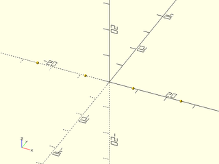
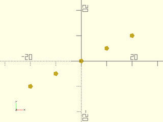
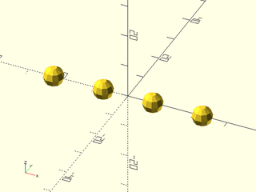
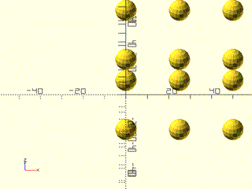
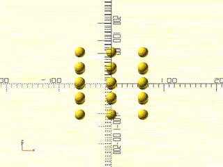
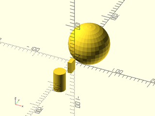

# LibFile: distributors.scad

Functions and modules to distribute children or copies of children.

To use, add the following lines to the beginning of your file:

    include <BOSL2/std.scad>

## Table of Contents

1. [Section: Translating copies of all the children](#section-translating-copies-of-all-the-children)
    - [`move_copies()`](#module-move_copies)
    - [`line_of()`](#functionmodule-line_of)
    - [`xcopies()`](#module-xcopies)
    - [`ycopies()`](#module-ycopies)
    - [`zcopies()`](#module-zcopies)
    - [`grid2d()`](#module-grid2d)
    - [`grid3d()`](#module-grid3d)

2. [Section: Rotating copies of all children](#section-rotating-copies-of-all-children)
    - [`rot_copies()`](#module-rot_copies)
    - [`xrot_copies()`](#module-xrot_copies)
    - [`yrot_copies()`](#module-yrot_copies)
    - [`zrot_copies()`](#module-zrot_copies)
    - [`arc_of()`](#module-arc_of)
    - [`ovoid_spread()`](#module-ovoid_spread)

3. [Section: Placing copies of all children on a path](#section-placing-copies-of-all-children-on-a-path)
    - [`path_spread()`](#module-path_spread)

4. [Section: Making a copy of all children with reflection](#section-making-a-copy-of-all-children-with-reflection)
    - [`mirror_copy()`](#module-mirror_copy)
    - [`xflip_copy()`](#module-xflip_copy)
    - [`yflip_copy()`](#module-yflip_copy)
    - [`zflip_copy()`](#module-zflip_copy)

5. [Section: Distributing children individually along a line](#section-distributing-children-individually-along-a-line)
    - [`distribute()`](#module-distribute)
    - [`xdistribute()`](#module-xdistribute)
    - [`ydistribute()`](#module-ydistribute)
    - [`zdistribute()`](#module-zdistribute)

## Section: Translating copies of all the children

### Module: move\_copies()

**Usage:** 

- move\_copies(a) ...

**Description:** 

Translates copies of all children to each given translation offset.

**Arguments:** 

<abbr title="These args can be used by position or by name.">By&nbsp;Position</abbr> | What it does
-------------------- | ------------
`a`                  | Array of XYZ offset vectors. Default `[[0,0,0]]`

**Side Effects:** 

- `$pos` is set to the relative centerpoint of each child copy, and can be used to modify each child individually.
- `$idx` is set to the index number of each child being copied.

**Example 1:** 

 

    include <BOSL2/std.scad>
    #sphere(r=10);
    move_copies([[-25,-25,0], [25,-25,0], [0,0,50], [0,25,0]]) sphere(r=10);

---

### Function/Module: line\_of()

**Usage:** Spread `n` copies by a given spacing

- line\_of(spacing, [n], [p1=]) ...

**Usage:** Spread copies every given spacing along the line

- line\_of(spacing, [l=], [p1=]) ...

**Usage:** Spread `n` copies along the length of the line

- line\_of([n=], [l=], [p1=]) ...

**Usage:** Spread `n` copies along the line from `p1` to `p2`

- line\_of([n=], [p1=], [p2=]) ...

**Usage:** Spread copies every given spacing, centered along the line from `p1` to `p2`

- line\_of([spacing], [p1=], [p2=]) ...

**Usage:** As a function

- pts = line\_of([spacing], [n], [p1=]);
- pts = line\_of([spacing], [l=], [p1=]);
- pts = line\_of([n=], [l=], [p1=]);
- pts = line\_of([n=], [p1=], [p2=]);
- pts = line\_of([spacing], [p1=], [p2=]);

**Description:** 

When called as a function, returns a list of points at evenly spread positions along a line.
When called as a module, copies `children()` at one or more evenly spread positions along a line.
By default, the line will be centered at the origin, unless the starting point `p1` is given.
The line will be pointed towards `RIGHT` (X+) unless otherwise given as a vector in `l`,
`spacing`, or `p1`/`p2`.  The spread is specified in one of several ways:

If You Know...                   | Then Use Something Like...
-------------------------------- | --------------------------------
Spacing distance, Count          | `line_of(spacing=10, n=5) ...` or `line_of(10, n=5) ...`
Spacing vector, Count            | `line_of(spacing=[10,5], n=5) ...` or `line_of([10,5], n=5) ...`
Spacing distance, Line length    | `line_of(spacing=10, l=50) ...` or `line_of(10, l=50) ...`
Spacing distance, Line vector    | `line_of(spacing=10, l=[50,30]) ...` or `line_of(10, l=[50,30]) ...`
Spacing vector, Line length      | `line_of(spacing=[10,5], l=50) ...` or `line_of([10,5], l=50) ...`
Line length, Count               | `line_of(l=50, n=5) ...`
Line vector, Count               | `line_of(l=[50,40], n=5) ...`
Line endpoints, Count            | `line_of(p1=[10,10], p2=[60,-10], n=5) ...`
Line endpoints, Spacing distance | `line_of(p1=[10,10], p2=[60,-10], spacing=10) ...`

**Arguments:** 

<abbr title="These args can be used by position or by name.">By&nbsp;Position</abbr> | What it does
-------------------- | ------------
`spacing`            | Either the scalar spacing distance along the X+ direction, or the vector giving both the direction and spacing distance between each set of copies.
`n`                  | Number of copies to distribute along the line. (Default: 2)

<abbr title="These args must be used by name, ie: name=value">By&nbsp;Name</abbr> | What it does
-------------------- | ------------
`l`                  | Either the scalar length of the line, or a vector giving both the direction and length of the line.
`p1`                 | If given, specifies the starting point of the line.
`p2`                 | If given with `p1`, specifies the ending point of line, and indirectly calculates the line length.

**Side Effects:** 

- `$pos` is set to the relative centerpoint of each child copy, and can be used to modify each child individually.
- `$idx` is set to the index number of each child being copied.

**Example 1:** 

    include <BOSL2/std.scad>
    line_of(10) sphere(d=1);

  

**Example 2:** 

    include <BOSL2/std.scad>
    line_of(10, n=5) sphere(d=1);

  

**Example 3:** 

    include <BOSL2/std.scad>
    line_of([10,5], n=5) sphere(d=1);

  

**Example 4:** 

    include <BOSL2/std.scad>
    line_of(spacing=10, n=6) sphere(d=1);

  

**Example 5:** 

    include <BOSL2/std.scad>
    line_of(spacing=[10,5], n=6) sphere(d=1);

  

**Example 6:** 

    include <BOSL2/std.scad>
    line_of(spacing=10, l=50) sphere(d=1);

  

**Example 7:** 

    include <BOSL2/std.scad>
    line_of(spacing=10, l=[50,30]) sphere(d=1);

  

**Example 8:** 

    include <BOSL2/std.scad>
    line_of(spacing=[10,5], l=50) sphere(d=1);

  

**Example 9:** 

    include <BOSL2/std.scad>
    line_of(l=50, n=4) sphere(d=1);

  

**Example 10:** 

    include <BOSL2/std.scad>
    line_of(l=[50,-30], n=4) sphere(d=1);

  

**Example 11:** 

 

    include <BOSL2/std.scad>
    line_of(p1=[0,0,0], p2=[5,5,20], n=6) cube(size=[3,2,1],center=true);

**Example 12:** 

 

    include <BOSL2/std.scad>
    line_of(p1=[0,0,0], p2=[5,5,20], spacing=6) cube(size=[3,2,1],center=true);

**Example 13:** All Children are Copied at Each Spread Position

    include <BOSL2/std.scad>
    line_of(l=20, n=3) {
        cube(size=[1,3,1],center=true);
        cube(size=[3,1,1],center=true);
    }

  

**Example 14:** The functional form of line\_of() returns a list of points.

    include <BOSL2/std.scad>
    pts = line_of([10,5],n=5);
    move_copies(pts) circle(d=2);

  

---

### Module: xcopies()

**Usage:** 

- xcopies(spacing, [n], [sp]) ...
- xcopies(l, [n], [sp]) ...

**Description:** 

Spreads out `n` copies of the children along a line on the X axis.

**Arguments:** 

<abbr title="These args can be used by position or by name.">By&nbsp;Position</abbr> | What it does
-------------------- | ------------
`spacing`            | spacing between copies. (Default: 1.0)
`n`                  | Number of copies to spread out. (Default: 2)
`l`                  | Length to spread copies over.
`sp`                 | If given as a point, copies will be spread on a line to the right of starting position `sp`.  If given as a scalar, copies will be spread on a line to the right of starting position `[sp,0,0]`.  If not given, copies will be spread along a line that is centered at [0,0,0].

**Side Effects:** 

- `$pos` is set to the relative centerpoint of each child copy, and can be used to modify each child individually.
- `$idx` is set to the index number of each child being copied.

**Example 1:** 

    include <BOSL2/std.scad>
    xcopies(20) sphere(3);

  

**Example 2:** 

    include <BOSL2/std.scad>
    xcopies(20, n=3) sphere(3);

  

**Example 3:** 

    include <BOSL2/std.scad>
    xcopies(spacing=15, l=50) sphere(3);

  

**Example 4:** 

    include <BOSL2/std.scad>
    xcopies(n=4, l=30, sp=[0,10,0]) sphere(3);

  

**Example 5:** 

    include <BOSL2/std.scad>
    xcopies(10, n=3) {
        cube(size=[1,3,1],center=true);
        cube(size=[3,1,1],center=true);
    }

  

---

### Module: ycopies()

**Usage:** 

- ycopies(spacing, [n], [sp]) ...
- ycopies(l, [n], [sp]) ...

**Description:** 

Spreads out `n` copies of the children along a line on the Y axis.

**Arguments:** 

<abbr title="These args can be used by position or by name.">By&nbsp;Position</abbr> | What it does
-------------------- | ------------
`spacing`            | spacing between copies. (Default: 1.0)
`n`                  | Number of copies to spread out. (Default: 2)
`l`                  | Length to spread copies over.
`sp`                 | If given as a point, copies will be spread on a line back from starting position `sp`.  If given as a scalar, copies will be spread on a line back from starting position `[0,sp,0]`.  If not given, copies will be spread along a line that is centered at [0,0,0].

**Side Effects:** 

- `$pos` is set to the relative centerpoint of each child copy, and can be used to modify each child individually.
- `$idx` is set to the index number of each child being copied.

**Example 1:** 

    include <BOSL2/std.scad>
    ycopies(20) sphere(3);

  

**Example 2:** 

    include <BOSL2/std.scad>
    ycopies(20, n=3) sphere(3);

  

**Example 3:** 

    include <BOSL2/std.scad>
    ycopies(spacing=15, l=50) sphere(3);

  

**Example 4:** 

    include <BOSL2/std.scad>
    ycopies(n=4, l=30, sp=[10,0,0]) sphere(3);

  

**Example 5:** 

    include <BOSL2/std.scad>
    ycopies(10, n=3) {
        cube(size=[1,3,1],center=true);
        cube(size=[3,1,1],center=true);
    }

  

---

### Module: zcopies()

**Usage:** 

- zcopies(spacing, [n], [sp]) ...
- zcopies(l, [n], [sp]) ...

**Description:** 

Spreads out `n` copies of the children along a line on the Z axis.

**Arguments:** 

<abbr title="These args can be used by position or by name.">By&nbsp;Position</abbr> | What it does
-------------------- | ------------
`spacing`            | spacing between copies. (Default: 1.0)
`n`                  | Number of copies to spread out. (Default: 2)
`l`                  | Length to spread copies over.
`sp`                 | If given as a point, copies will be spread on a line up from starting position `sp`.  If given as a scalar, copies will be spread on a line up from starting position `[0,0,sp]`.  If not given, copies will be spread along a line that is centered at [0,0,0].

**Side Effects:** 

- `$pos` is set to the relative centerpoint of each child copy, and can be used to modify each child individually.
- `$idx` is set to the index number of each child being copied.

**Example 1:** 

    include <BOSL2/std.scad>
    zcopies(20) sphere(3);

  

**Example 2:** 

    include <BOSL2/std.scad>
    zcopies(20, n=3) sphere(3);

  

**Example 3:** 

    include <BOSL2/std.scad>
    zcopies(spacing=15, l=50) sphere(3);

  

**Example 4:** 

    include <BOSL2/std.scad>
    zcopies(n=4, l=30, sp=[10,0,0]) sphere(3);

  

**Example 5:** 

    include <BOSL2/std.scad>
    zcopies(10, n=3) {
        cube(size=[1,3,1],center=true);
        cube(size=[3,1,1],center=true);
    }

  

---

### Module: grid2d()

**Usage:** 

- grid2d(spacing, size, [stagger], [scale], [inside]) ...
- grid2d(n, size, [stagger], [scale], [inside]) ...
- grid2d(spacing, n, [stagger], [scale], [inside]) ...
- grid2d(spacing, inside, [stagger], [scale]) ...
- grid2d(n, inside, [stagger], [scale]) ...

**Description:** 

Makes a square or hexagonal grid of copies of children, with an optional masking polygon or region.

**Arguments:** 

<abbr title="These args can be used by position or by name.">By&nbsp;Position</abbr> | What it does
-------------------- | ------------
`size`               | The [X,Y] size to spread the copies over.
`spacing`            | Distance between copies in [X,Y] or scalar distance.
`n`                  | How many columns and rows of copies to make.  Can be given as `[COLS,ROWS]`, or just as a scalar that specifies both.  If staggered, count both staggered and unstaggered columns and rows.  Default: 2 (3 if staggered)
`stagger`            | If true, make a staggered (hexagonal) grid.  If false, make square grid.  If `"alt"`, makes alternate staggered pattern.  Default: false
`inside`             | If given a list of polygon points, or a region, only creates copies whose center would be inside the polygon or region.  Polygon can be concave and/or self crossing.
`nonzero`            | If inside is set to a polygon with self-crossings then use the nonzero method for deciding if points are in the polygon.  Default: false

**Side Effects:** 

- `$pos` is set to the relative centerpoint of each child copy, and can be used to modify each child individually.
- `$col` is set to the integer column number for each child.
- `$row` is set to the integer row number for each child.

**Example 1:** 

    include <BOSL2/std.scad>
    grid2d(size=50, spacing=10) cylinder(d=10, h=1);

  

**Example 2:** 

    include <BOSL2/std.scad>
    grid2d(size=50, spacing=[10,15]) cylinder(d=10, h=1);

  

**Example 3:** 

    include <BOSL2/std.scad>
    grid2d(spacing=10, n=[13,7], stagger=true) cylinder(d=6, h=5);

  

**Example 4:** 

 

    include <BOSL2/std.scad>
    grid2d(spacing=10, n=[13,7], stagger="alt") cylinder(d=6, h=5);

**Example 5:** 

    include <BOSL2/std.scad>
    grid2d(size=50, n=11, stagger=true) cylinder(d=5, h=1);

  

**Example 6:** 

    include <BOSL2/std.scad>
    poly = [[-25,-25], [25,25], [-25,25], [25,-25]];
    grid2d(spacing=5, stagger=true, inside=poly)
       zrot(180/6) cylinder(d=5, h=1, $fn=6);
    %polygon(poly);

  

**Example 7:** Using `$row` and `$col`

    include <BOSL2/std.scad>
    grid2d(spacing=8, n=8)
        color(($row+$col)%2?"black":"red")
            cube([8,8,0.01], center=false);

  

**Example 8:** 

    include <BOSL2/std.scad>
    // Makes a grid of hexagon pillars whose tops are all
    // angled to reflect light at [0,0,50], if they were shiny.
    hexregion = circle(r=50.01,$fn=6);
    grid2d(spacing=10, stagger=true, inside=hexregion) union() {
        // Note: The union() is needed or else $pos will be
        //   inexplicably unreadable.
        ref_v = (unit([0,0,50]-point3d($pos)) + UP)/2;
        half_of(v=-ref_v, cp=[0,0,5])
            zrot(180/6)
                cylinder(h=20, d=10/cos(180/6)+0.01, $fn=6);
    }

  

---

### Module: grid3d()

**Usage:** 

- grid3d(n, spacing) ...
- grid3d(n=[Xn,Yn,Zn], spacing=[dX,dY,dZ]) ...
- grid3d([xa], [ya], [za]) ...

**Description:** 

Makes a 3D grid of duplicate children.

**Arguments:** 

<abbr title="These args can be used by position or by name.">By&nbsp;Position</abbr> | What it does
-------------------- | ------------
`xa`                 | array or range of X-axis values to offset by. (Default: [0])
`ya`                 | array or range of Y-axis values to offset by. (Default: [0])
`za`                 | array or range of Z-axis values to offset by. (Default: [0])
`n`                  | Optional number of copies to have per axis.
`spacing`            | spacing of copies per axis. Use with `n`.

**Side Effects:** 

- `$pos` is set to the relative centerpoint of each child copy, and can be used to modify each child individually.
- `$idx` is set to the [Xidx,Yidx,Zidx] index values of each child copy, when using `count` and `n`.

**Example 1:** 

    include <BOSL2/std.scad>
    grid3d(xa=[0:25:50],ya=[0,40],za=[-20:40:20]) sphere(r=5);

  

**Example 2:** 

    include <BOSL2/std.scad>
    grid3d(n=[3, 4, 2], spacing=[60, 50, 40]) sphere(r=10);

  

**Example 3:** 

    include <BOSL2/std.scad>
    grid3d(ya=[-60:40:60],za=[0,70]) sphere(r=10);

  

**Example 4:** 

    include <BOSL2/std.scad>
    grid3d(n=3, spacing=30) sphere(r=10);

  

**Example 5:** 

    include <BOSL2/std.scad>
    grid3d(n=[3, 1, 2], spacing=30) sphere(r=10);

  

**Example 6:** 

    include <BOSL2/std.scad>
    grid3d(n=[3, 4], spacing=[80, 60]) sphere(r=10);

  

**Example 7:** 

 

    include <BOSL2/std.scad>
    grid3d(n=[10, 10, 10], spacing=50) color($idx/9) cube(50, center=true);

---

## Section: Rotating copies of all children

### Module: rot\_copies()

**Usage:** 

- rot\_copies(rots, [cp], [sa], [delta], [subrot]) ...
- rot\_copies(rots, v, [cp], [sa], [delta], [subrot]) ...
- rot\_copies(n, [v], [cp], [sa], [delta], [subrot]) ...

**Description:** 

Given a list of [X,Y,Z] rotation angles in `rots`, rotates copies of the children to each of those angles, regardless of axis of rotation.
Given a list of scalar angles in `rots`, rotates copies of the children to each of those angles around the axis of rotation.
If given a vector `v`, that becomes the axis of rotation.  Default axis of rotation is UP.
If given a count `n`, makes that many copies, rotated evenly around the axis.
If given an offset `delta`, translates each child by that amount before rotating them into place.  This makes rings.
If given a centerpoint `cp`, centers the ring around that centerpoint.
If `subrot` is true, each child will be rotated in place to keep the same size towards the center.
The first (unrotated) copy will be placed at the relative starting angle `sa`.

**Arguments:** 

<abbr title="These args can be used by position or by name.">By&nbsp;Position</abbr> | What it does
-------------------- | ------------
`rots`               | A list of [X,Y,Z] rotation angles in degrees.  If `v` is given, this will be a list of scalar angles in degrees to rotate around `v`.
`v`                  | If given, this is the vector of the axis to rotate around.
`cp`                 | Centerpoint to rotate around.  Default: `[0,0,0]`
`n`                  | Optional number of evenly distributed copies, rotated around the axis.
`sa`                 | Starting angle, in degrees.  For use with `n`.  Angle is in degrees counter-clockwise.  Default: 0
`delta`              | [X,Y,Z] amount to move away from cp before rotating.  Makes rings of copies.  Default: `[0,0,0]`
`subrot`             | If false, don't sub-rotate children as they are copied around the ring.  Only makes sense when used with `delta`.  Default: `true`

**Side Effects:** 

- `$ang` is set to the rotation angle (or XYZ rotation triplet) of each child copy, and can be used to modify each child individually.
- `$idx` is set to the index value of each child copy.
- `$axis` is set to the axis to rotate around, if `rots` was given as a list of angles instead of a list of [X,Y,Z] rotation angles.

**Example 1:** 

 

    include <BOSL2/std.scad>
    #cylinder(h=20, r1=5, r2=0);
    rot_copies([[45,0,0],[0,45,90],[90,-45,270]]) cylinder(h=20, r1=5, r2=0);

**Example 2:** 

    include <BOSL2/std.scad>
    rot_copies([45, 90, 135], v=DOWN+BACK)
        yrot(90) cylinder(h=20, r1=5, r2=0);
    color("red",0.333) yrot(90) cylinder(h=20, r1=5, r2=0);

  

**Example 3:** 

    include <BOSL2/std.scad>
    rot_copies(n=6, v=DOWN+BACK)
        yrot(90) cylinder(h=20, r1=5, r2=0);
    color("red",0.333) yrot(90) cylinder(h=20, r1=5, r2=0);

  

**Example 4:** 

    include <BOSL2/std.scad>
    rot_copies(n=6, v=DOWN+BACK, delta=[10,0,0])
        yrot(90) cylinder(h=20, r1=5, r2=0);
    color("red",0.333) yrot(90) cylinder(h=20, r1=5, r2=0);

  

**Example 5:** 

    include <BOSL2/std.scad>
    rot_copies(n=6, v=UP+FWD, delta=[10,0,0], sa=45)
        yrot(90) cylinder(h=20, r1=5, r2=0);
    color("red",0.333) yrot(90) cylinder(h=20, r1=5, r2=0);

  

**Example 6:** 

    include <BOSL2/std.scad>
    rot_copies(n=6, v=DOWN+BACK, delta=[20,0,0], subrot=false)
        yrot(90) cylinder(h=20, r1=5, r2=0);
    color("red",0.333) yrot(90) cylinder(h=20, r1=5, r2=0);

  

---

### Module: xrot\_copies()

**Usage:** 

- xrot\_copies(rots, [r], [cp], [sa], [subrot]) ...
- xrot\_copies(n, [r], [cp], [sa], [subrot]) ...

**Description:** 

Given an array of angles, rotates copies of the children to each of those angles around the X axis.
If given a count `n`, makes that many copies, rotated evenly around the X axis.
If given an offset radius `r`, distributes children around a ring of that radius.
If given a centerpoint `cp`, centers the ring around that centerpoint.
If `subrot` is true, each child will be rotated in place to keep the same size towards the center.
The first (unrotated) copy will be placed at the relative starting angle `sa`.

**Arguments:** 

<abbr title="These args can be used by position or by name.">By&nbsp;Position</abbr> | What it does
-------------------- | ------------
`rots`               | Optional array of rotation angles, in degrees, to make copies at.
`cp`                 | Centerpoint to rotate around.
`n`                  | Optional number of evenly distributed copies to be rotated around the ring.
`sa`                 | Starting angle, in degrees.  For use with `n`.  Angle is in degrees counter-clockwise from Y+, when facing the origin from X+.  First unrotated copy is placed at that angle.
`r`                  | Radius to move children back (Y+), away from cp, before rotating.  Makes rings of copies.
`subrot`             | If false, don't sub-rotate children as they are copied around the ring.

**Side Effects:** 

- `$idx` is set to the index value of each child copy.
- `$ang` is set to the rotation angle of each child copy, and can be used to modify each child individually.
- `$axis` is set to the axis vector rotated around.

**Example 1:** 

    include <BOSL2/std.scad>
    xrot_copies([180, 270, 315])
        cylinder(h=20, r1=5, r2=0);
    color("red",0.333) cylinder(h=20, r1=5, r2=0);

  

**Example 2:** 

    include <BOSL2/std.scad>
    xrot_copies(n=6)
        cylinder(h=20, r1=5, r2=0);
    color("red",0.333) cylinder(h=20, r1=5, r2=0);

  

**Example 3:** 

    include <BOSL2/std.scad>
    xrot_copies(n=6, r=10)
        xrot(-90) cylinder(h=20, r1=5, r2=0);
    color("red",0.333) xrot(-90) cylinder(h=20, r1=5, r2=0);

  

**Example 4:** 

    include <BOSL2/std.scad>
    xrot_copies(n=6, r=10, sa=45)
        xrot(-90) cylinder(h=20, r1=5, r2=0);
    color("red",0.333) xrot(-90) cylinder(h=20, r1=5, r2=0);

  

**Example 5:** 

 

    include <BOSL2/std.scad>
    xrot_copies(n=6, r=20, subrot=false)
        xrot(-90) cylinder(h=20, r1=5, r2=0, center=true);
    color("red",0.333) xrot(-90) cylinder(h=20, r1=5, r2=0, center=true);

---

### Module: yrot\_copies()

**Usage:** 

- yrot\_copies(rots, [r], [cp], [sa], [subrot]) ...
- yrot\_copies(n, [r], [cp], [sa], [subrot]) ...

**Description:** 

Given an array of angles, rotates copies of the children to each of those angles around the Y axis.
If given a count `n`, makes that many copies, rotated evenly around the Y axis.
If given an offset radius `r`, distributes children around a ring of that radius.
If given a centerpoint `cp`, centers the ring around that centerpoint.
If `subrot` is true, each child will be rotated in place to keep the same size towards the center.
The first (unrotated) copy will be placed at the relative starting angle `sa`.

**Arguments:** 

<abbr title="These args can be used by position or by name.">By&nbsp;Position</abbr> | What it does
-------------------- | ------------
`rots`               | Optional array of rotation angles, in degrees, to make copies at.
`cp`                 | Centerpoint to rotate around.
`n`                  | Optional number of evenly distributed copies to be rotated around the ring.
`sa`                 | Starting angle, in degrees.  For use with `n`.  Angle is in degrees counter-clockwise from X-, when facing the origin from Y+.
`r`                  | Radius to move children left (X-), away from cp, before rotating.  Makes rings of copies.
`subrot`             | If false, don't sub-rotate children as they are copied around the ring.

**Side Effects:** 

- `$idx` is set to the index value of each child copy.
- `$ang` is set to the rotation angle of each child copy, and can be used to modify each child individually.
- `$axis` is set to the axis vector rotated around.

**Example 1:** 

    include <BOSL2/std.scad>
    yrot_copies([180, 270, 315])
        cylinder(h=20, r1=5, r2=0);
    color("red",0.333) cylinder(h=20, r1=5, r2=0);

  

**Example 2:** 

    include <BOSL2/std.scad>
    yrot_copies(n=6)
        cylinder(h=20, r1=5, r2=0);
    color("red",0.333) cylinder(h=20, r1=5, r2=0);

  

**Example 3:** 

    include <BOSL2/std.scad>
    yrot_copies(n=6, r=10)
        yrot(-90) cylinder(h=20, r1=5, r2=0);
    color("red",0.333) yrot(-90) cylinder(h=20, r1=5, r2=0);

  

**Example 4:** 

    include <BOSL2/std.scad>
    yrot_copies(n=6, r=10, sa=45)
        yrot(-90) cylinder(h=20, r1=5, r2=0);
    color("red",0.333) yrot(-90) cylinder(h=20, r1=5, r2=0);

  

**Example 5:** 

 

    include <BOSL2/std.scad>
    yrot_copies(n=6, r=20, subrot=false)
        yrot(-90) cylinder(h=20, r1=5, r2=0, center=true);
    color("red",0.333) yrot(-90) cylinder(h=20, r1=5, r2=0, center=true);

---

### Module: zrot\_copies()

**Usage:** 

- zrot\_copies(rots, [r], [cp], [sa], [subrot]) ...
- zrot\_copies(n, [r], [cp], [sa], [subrot]) ...

**Description:** 

Given an array of angles, rotates copies of the children to each of those angles around the Z axis.
If given a count `n`, makes that many copies, rotated evenly around the Z axis.
If given an offset radius `r`, distributes children around a ring of that radius.
If given a centerpoint `cp`, centers the ring around that centerpoint.
If `subrot` is true, each child will be rotated in place to keep the same size towards the center.
The first (unrotated) copy will be placed at the relative starting angle `sa`.

**Arguments:** 

<abbr title="These args can be used by position or by name.">By&nbsp;Position</abbr> | What it does
-------------------- | ------------
`rots`               | Optional array of rotation angles, in degrees, to make copies at.
`cp`                 | Centerpoint to rotate around.  Default: [0,0,0]
`n`                  | Optional number of evenly distributed copies to be rotated around the ring.
`sa`                 | Starting angle, in degrees.  For use with `n`.  Angle is in degrees counter-clockwise from X+, when facing the origin from Z+.  Default: 0
`r`                  | Radius to move children right (X+), away from cp, before rotating.  Makes rings of copies.  Default: 0
`subrot`             | If false, don't sub-rotate children as they are copied around the ring.  Default: true

**Side Effects:** 

- `$idx` is set to the index value of each child copy.
- `$ang` is set to the rotation angle of each child copy, and can be used to modify each child individually.
- `$axis` is set to the axis vector rotated around.

**Example 1:** 

    include <BOSL2/std.scad>
    zrot_copies([180, 270, 315])
        yrot(90) cylinder(h=20, r1=5, r2=0);
    color("red",0.333) yrot(90) cylinder(h=20, r1=5, r2=0);

  

**Example 2:** 

    include <BOSL2/std.scad>
    zrot_copies(n=6)
        yrot(90) cylinder(h=20, r1=5, r2=0);
    color("red",0.333) yrot(90) cylinder(h=20, r1=5, r2=0);

  

**Example 3:** 

    include <BOSL2/std.scad>
    zrot_copies(n=6, r=10)
        yrot(90) cylinder(h=20, r1=5, r2=0);
    color("red",0.333) yrot(90) cylinder(h=20, r1=5, r2=0);

  

**Example 4:** 

 

    include <BOSL2/std.scad>
    zrot_copies(n=6, r=20, sa=45)
        yrot(90) cylinder(h=20, r1=5, r2=0, center=true);
    color("red",0.333) yrot(90) cylinder(h=20, r1=5, r2=0, center=true);

**Example 5:** 

 

    include <BOSL2/std.scad>
    zrot_copies(n=6, r=20, subrot=false)
        yrot(-90) cylinder(h=20, r1=5, r2=0, center=true);
    color("red",0.333) yrot(-90) cylinder(h=20, r1=5, r2=0, center=true);

---

### Module: arc\_of()

**Usage:** 

- arc\_of(r|d, n, [sa], [ea], [rot]
- arc\_of(rx|dx, ry|dy, n, [sa], [ea], [rot]

**Description:** 

Evenly distributes n duplicate children around an ovoid arc on the XY plane.

**Arguments:** 

<abbr title="These args can be used by position or by name.">By&nbsp;Position</abbr> | What it does
-------------------- | ------------
`n`                  | number of copies to distribute around the circle. (Default: 6)
`r`                  | radius of circle (Default: 1)
`rx`                 | radius of ellipse on X axis. Used instead of r.
`ry`                 | radius of ellipse on Y axis. Used instead of r.
`d`                  | diameter of circle. (Default: 2)
`dx`                 | diameter of ellipse on X axis. Used instead of d.
`dy`                 | diameter of ellipse on Y axis. Used instead of d.
`rot`                | whether to rotate the copied children.  (Default: false)
`sa`                 | starting angle. (Default: 0.0)
`ea`                 | ending angle. Will distribute copies CCW from sa to ea. (Default: 360.0)

**Side Effects:** 

- `$ang` is set to the rotation angle of each child copy, and can be used to modify each child individually.
- `$pos` is set to the relative centerpoint of each child copy, and can be used to modify each child individually.
- `$idx` is set to the index value of each child copy.

**Example 1:** 

    include <BOSL2/std.scad>
    #cube(size=[10,3,3],center=true);
    arc_of(d=40, n=5) cube(size=[10,3,3],center=true);

  

**Example 2:** 

 

    include <BOSL2/std.scad>
    #cube(size=[10,3,3],center=true);
    arc_of(d=40, n=5, sa=45, ea=225) cube(size=[10,3,3],center=true);

**Example 3:** 

    include <BOSL2/std.scad>
    #cube(size=[10,3,3],center=true);
    arc_of(r=15, n=8, rot=false) cube(size=[10,3,3],center=true);

  

**Example 4:** 

    include <BOSL2/std.scad>
    #cube(size=[10,3,3],center=true);
    arc_of(rx=20, ry=10, n=8) cube(size=[10,3,3],center=true);

  

---

### Module: ovoid\_spread()

**Usage:** 

- ovoid\_spread(r|d, n, [cone\_ang], [scale], [perp]) ...

**Description:** 

Spreads children semi-evenly over the surface of a sphere.

**Arguments:** 

<abbr title="These args can be used by position or by name.">By&nbsp;Position</abbr> | What it does
-------------------- | ------------
`r`                  | Radius of the sphere to distribute over
`d`                  | Diameter of the sphere to distribute over
`n`                  | How many copies to evenly spread over the surface.
`cone_ang`           | Angle of the cone, in degrees, to limit how much of the sphere gets covered.  For full sphere coverage, use 180.  Measured pre-scaling.  Default: 180
`scale`              | The [X,Y,Z] scaling factors to reshape the sphere being covered.
`perp`               | If true, rotate children to be perpendicular to the sphere surface.  Default: true

**Side Effects:** 

- `$pos` is set to the relative post-scaled centerpoint of each child copy, and can be used to modify each child individually.
- `$theta` is set to the theta angle of the child from the center of the sphere.
- `$phi` is set to the pre-scaled phi angle of the child from the center of the sphere.
- `$rad` is set to the pre-scaled radial distance of the child from the center of the sphere.
- `$idx` is set to the index number of each child being copied.

**Example 1:** 

    include <BOSL2/std.scad>
    ovoid_spread(n=250, d=100, cone_ang=45, scale=[3,3,1])
        cylinder(d=10, h=10, center=false);

  

**Example 2:** 

    include <BOSL2/std.scad>
    ovoid_spread(n=500, d=100, cone_ang=180)
        color(unit(point3d(v_abs($pos))))
            cylinder(d=8, h=10, center=false);

  

---

## Section: Placing copies of all children on a path

### Module: path\_spread()

**Usage:** 

- path\_spread(path), [n], [spacing], [sp], [rotate\_children], [closed]) ...

**Description:** 

Uniformly spreads out copies of children along a path.  Copies are located based on path length.  If you specify `n` but not spacing then `n` copies will be placed
with one at path[0] of `closed` is true, or spanning the entire path from start to end if `closed` is false.
If you specify `spacing` but not `n` then copies will spread out starting from one at path[0] for `closed=true` or at the path center for open paths.
If you specify `sp` then the copies will start at `sp`.

**Arguments:** 

<abbr title="These args can be used by position or by name.">By&nbsp;Position</abbr> | What it does
-------------------- | ------------
`path`               | the path where children are placed
`n`                  | number of copies
`spacing`            | space between copies
`sp`                 | if given, copies will start distance sp from the path start and spread beyond that point

**Side Effects:** 

- `$pos` is set to the center of each copy
- `$idx` is set to the index number of each copy.  In the case of closed paths the first copy is at `path[0]` unless you give `sp`.
- `$dir` is set to the direction vector of the path at the point where the copy is placed.
- `$normal` is set to the direction of the normal vector to the path direction that is coplanar with the path at this point

**Example 1:** 

 

    include <BOSL2/std.scad>
    spiral = [for(theta=[0:360*8]) theta * [cos(theta), sin(theta)]]/100;
    stroke(spiral,width=.25);
    color("red") path_spread(spiral, n=100) circle(r=1);

**Example 2:** 

 

    include <BOSL2/std.scad>
    circle = regular_ngon(n=64, or=10);
    stroke(circle,width=1,closed=true);
    color("green") path_spread(circle, n=7, closed=true) circle(r=1+$idx/3);

**Example 3:** 

 

    include <BOSL2/std.scad>
    heptagon = regular_ngon(n=7, or=10);
    stroke(heptagon, width=1, closed=true);
    color("purple") path_spread(heptagon, n=9, closed=true) rect([0.5,3],anchor=FRONT);

**Example 4:** Direction at the corners is the average of the two adjacent edges

 

    include <BOSL2/std.scad>
    heptagon = regular_ngon(n=7, or=10);
    stroke(heptagon, width=1, closed=true);
    color("purple") path_spread(heptagon, n=7, closed=true) rect([0.5,3],anchor=FRONT);

**Example 5:** Don't rotate the children

 

    include <BOSL2/std.scad>
    heptagon = regular_ngon(n=7, or=10);
    stroke(heptagon, width=1, closed=true);
    color("red") path_spread(heptagon, n=9, closed=true, rotate_children=false) rect([0.5,3],anchor=FRONT);

**Example 6:** Open path, specify `n`

 

    include <BOSL2/std.scad>
    sinwav = [for(theta=[0:360]) 5*[theta/180, sin(theta)]];
    stroke(sinwav,width=.1);
    color("red") path_spread(sinwav, n=5) rect([.2,1.5],anchor=FRONT);

**Example 7:** Open path, specify `n` and `spacing`

 

    include <BOSL2/std.scad>
    sinwav = [for(theta=[0:360]) 5*[theta/180, sin(theta)]];
    stroke(sinwav,width=.1);
    color("red") path_spread(sinwav, n=5, spacing=1) rect([.2,1.5],anchor=FRONT);

**Example 8:** Closed path, specify `n` and `spacing`, copies centered around circle[0]

 

    include <BOSL2/std.scad>
    circle = regular_ngon(n=64,or=10);
    stroke(circle,width=.1,closed=true);
    color("red") path_spread(circle, n=10, spacing=1, closed=true) rect([.2,1.5],anchor=FRONT);

**Example 9:** Open path, specify `spacing`

 

    include <BOSL2/std.scad>
    sinwav = [for(theta=[0:360]) 5*[theta/180, sin(theta)]];
    stroke(sinwav,width=.1);
    color("red") path_spread(sinwav, spacing=5) rect([.2,1.5],anchor=FRONT);

**Example 10:** Open path, specify `sp`

 

    include <BOSL2/std.scad>
    sinwav = [for(theta=[0:360]) 5*[theta/180, sin(theta)]];
    stroke(sinwav,width=.1);
    color("red") path_spread(sinwav, n=5, sp=18) rect([.2,1.5],anchor=FRONT);

**Example 11:** 

 

    include <BOSL2/std.scad>
    wedge = arc(angle=[0,100], r=10, $fn=64);
    difference(){
      polygon(concat([[0,0]],wedge));
      path_spread(wedge,n=5,spacing=3) fwd(.1) rect([1,4],anchor=FRONT);
    }

**Example 12:** 3d example, with children rotated into the plane of the path

 

    include <BOSL2/std.scad>
    tilted_circle = lift_plane([[0,0,0], [5,0,5], [0,2,3]],regular_ngon(n=64, or=12));
    path_sweep(regular_ngon(n=16,or=.1),tilted_circle);
    path_spread(tilted_circle, n=15,closed=true) {
       color("blue") cyl(h=3,r=.2, anchor=BOTTOM);      // z-aligned cylinder
       color("red") xcyl(h=10,r=.2, anchor=FRONT+LEFT); // x-aligned cylinder
    }

**Example 13:** 3d example, with rotate\_children set to false

 

    include <BOSL2/std.scad>
    tilted_circle = lift_plane([[0,0,0], [5,0,5], [0,2,3]], regular_ngon(n=64, or=12));
    path_sweep(regular_ngon(n=16,or=.1),tilted_circle);
    path_spread(tilted_circle, n=25,rotate_children=false,closed=true) {
       color("blue") cyl(h=3,r=.2, anchor=BOTTOM);       // z-aligned cylinder
       color("red") xcyl(h=10,r=.2, anchor=FRONT+LEFT);  // x-aligned cylinder
    }

---

## Section: Making a copy of all children with reflection

### Module: mirror\_copy()

**Usage:** 

- mirror\_copy(v, [cp], [offset]) ...

**Description:** 

Makes a copy of the children, mirrored across the given plane.

**Arguments:** 

<abbr title="These args can be used by position or by name.">By&nbsp;Position</abbr> | What it does
-------------------- | ------------
`v`                  | The normal vector of the plane to mirror across.
`offset`             | distance to offset away from the plane.
`cp`                 | A point that lies on the mirroring plane.

**Side Effects:** 

- `$orig` is true for the original instance of children.  False for the copy.
- `$idx` is set to the index value of each copy.

**Example 1:** 

 

    include <BOSL2/std.scad>
    mirror_copy([1,-1,0]) zrot(-45) yrot(90) cylinder(d1=10, d2=0, h=20);
    color("blue",0.25) zrot(-45) cube([0.01,15,15], center=true);

**Example 2:** 

 

    include <BOSL2/std.scad>
    mirror_copy([1,1,0], offset=5) rot(a=90,v=[-1,1,0]) cylinder(d1=10, d2=0, h=20);
    color("blue",0.25) zrot(45) cube([0.01,15,15], center=true);

**Example 3:** 

 

    include <BOSL2/std.scad>
    mirror_copy(UP+BACK, cp=[0,-5,-5]) rot(from=UP, to=BACK+UP) cylinder(d1=10, d2=0, h=20);
    color("blue",0.25) translate([0,-5,-5]) rot(from=UP, to=BACK+UP) cube([15,15,0.01], center=true);

---

### Module: xflip\_copy()

**Usage:** 

- xflip\_copy([x], [offset]) ...

**Description:** 

Makes a copy of the children, mirrored across the X axis.

**Arguments:** 

<abbr title="These args can be used by position or by name.">By&nbsp;Position</abbr> | What it does
-------------------- | ------------
`offset`             | Distance to offset children right, before copying.
`x`                  | The X coordinate of the mirroring plane.  Default: 0

**Side Effects:** 

- `$orig` is true for the original instance of children.  False for the copy.
- `$idx` is set to the index value of each copy.

**Example 1:** 

    include <BOSL2/std.scad>
    xflip_copy() yrot(90) cylinder(h=20, r1=4, r2=0);
    color("blue",0.25) cube([0.01,15,15], center=true);

  

**Example 2:** 

    include <BOSL2/std.scad>
    xflip_copy(offset=5) yrot(90) cylinder(h=20, r1=4, r2=0);
    color("blue",0.25) cube([0.01,15,15], center=true);

  

**Example 3:** 

    include <BOSL2/std.scad>
    xflip_copy(x=-5) yrot(90) cylinder(h=20, r1=4, r2=0);
    color("blue",0.25) left(5) cube([0.01,15,15], center=true);

  

---

### Module: yflip\_copy()

**Usage:** 

- yflip\_copy([y], [offset]) ...

**Description:** 

Makes a copy of the children, mirrored across the Y axis.

**Arguments:** 

<abbr title="These args can be used by position or by name.">By&nbsp;Position</abbr> | What it does
-------------------- | ------------
`offset`             | Distance to offset children back, before copying.
`y`                  | The Y coordinate of the mirroring plane.  Default: 0

**Side Effects:** 

- `$orig` is true for the original instance of children.  False for the copy.
- `$idx` is set to the index value of each copy.

**Example 1:** 

    include <BOSL2/std.scad>
    yflip_copy() xrot(-90) cylinder(h=20, r1=4, r2=0);
    color("blue",0.25) cube([15,0.01,15], center=true);

  

**Example 2:** 

    include <BOSL2/std.scad>
    yflip_copy(offset=5) xrot(-90) cylinder(h=20, r1=4, r2=0);
    color("blue",0.25) cube([15,0.01,15], center=true);

  

**Example 3:** 

    include <BOSL2/std.scad>
    yflip_copy(y=-5) xrot(-90) cylinder(h=20, r1=4, r2=0);
    color("blue",0.25) fwd(5) cube([15,0.01,15], center=true);

  

---

### Module: zflip\_copy()

**Usage:** 

- zflip\_copy([z], [offset]) ...

**Description:** 

Makes a copy of the children, mirrored across the Z axis.

**Arguments:** 

<abbr title="These args can be used by position or by name.">By&nbsp;Position</abbr> | What it does
-------------------- | ------------
`offset`             | Distance to offset children up, before copying.
`z`                  | The Z coordinate of the mirroring plane.  Default: 0

**Side Effects:** 

- `$orig` is true for the original instance of children.  False for the copy.
- `$idx` is set to the index value of each copy.

**Example 1:** 

    include <BOSL2/std.scad>
    zflip_copy() cylinder(h=20, r1=4, r2=0);
    color("blue",0.25) cube([15,15,0.01], center=true);

  

**Example 2:** 

    include <BOSL2/std.scad>
    zflip_copy(offset=5) cylinder(h=20, r1=4, r2=0);
    color("blue",0.25) cube([15,15,0.01], center=true);

  

**Example 3:** 

    include <BOSL2/std.scad>
    zflip_copy(z=-5) cylinder(h=20, r1=4, r2=0);
    color("blue",0.25) down(5) cube([15,15,0.01], center=true);

  

---

## Section: Distributing children individually along a line

### Module: distribute()

**Usage:** 

- distribute(spacing, dir, [sizes]) ...
- distribute(l, dir, [sizes]) ...

**Description:** 

Spreads out each individual child along the direction `dir`.
Every child is placed at a different position, in order.
This is useful for laying out groups of disparate objects
where you only really care about the spacing between them.

**Arguments:** 

<abbr title="These args can be used by position or by name.">By&nbsp;Position</abbr> | What it does
-------------------- | ------------
`spacing`            | Spacing to add between each child. (Default: 10.0)
`sizes`              | Array containing how much space each child will need.
`dir`                | Vector direction to distribute copies along.
`l`                  | Length to distribute copies along.

**Side Effects:** 

- `$pos` is set to the relative centerpoint of each child copy, and can be used to modify each child individually.
- `$idx` is set to the index number of each child being copied.

**Example 1:** 

    include <BOSL2/std.scad>
    distribute(sizes=[100, 30, 50], dir=UP) {
        sphere(r=50);
        cube([10,20,30], center=true);
        cylinder(d=30, h=50, center=true);
    }

  

---

### Module: xdistribute()

**Usage:** 

- xdistribute(spacing, [sizes]) ...
- xdistribute(l, [sizes]) ...

**Description:** 

Spreads out each individual child along the X axis.
Every child is placed at a different position, in order.
This is useful for laying out groups of disparate objects
where you only really care about the spacing between them.

**Arguments:** 

<abbr title="These args can be used by position or by name.">By&nbsp;Position</abbr> | What it does
-------------------- | ------------
`spacing`            | spacing between each child. (Default: 10.0)
`sizes`              | Array containing how much space each child will need.
`l`                  | Length to distribute copies along.

**Side Effects:** 

- `$pos` is set to the relative centerpoint of each child copy, and can be used to modify each child individually.
- `$idx` is set to the index number of each child being copied.

**Example 1:** 

    include <BOSL2/std.scad>
    xdistribute(sizes=[100, 10, 30], spacing=40) {
        sphere(r=50);
        cube([10,20,30], center=true);
        cylinder(d=30, h=50, center=true);
    }

  

---

### Module: ydistribute()

**Usage:** 

- ydistribute(spacing, [sizes])
- ydistribute(l, [sizes])

**Description:** 

Spreads out each individual child along the Y axis.
Every child is placed at a different position, in order.
This is useful for laying out groups of disparate objects
where you only really care about the spacing between them.

**Arguments:** 

<abbr title="These args can be used by position or by name.">By&nbsp;Position</abbr> | What it does
-------------------- | ------------
`spacing`            | spacing between each child. (Default: 10.0)
`sizes`              | Array containing how much space each child will need.
`l`                  | Length to distribute copies along.

**Side Effects:** 

- `$pos` is set to the relative centerpoint of each child copy, and can be used to modify each child individually.
- `$idx` is set to the index number of each child being copied.

**Example 1:** 

    include <BOSL2/std.scad>
    ydistribute(sizes=[30, 20, 100], spacing=40) {
        cylinder(d=30, h=50, center=true);
        cube([10,20,30], center=true);
        sphere(r=50);
    }

  

---

### Module: zdistribute()

**Usage:** 

- zdistribute(spacing, [sizes])
- zdistribute(l, [sizes])

**Description:** 

Spreads out each individual child along the Z axis.
Every child is placed at a different position, in order.
This is useful for laying out groups of disparate objects
where you only really care about the spacing between them.

**Arguments:** 

<abbr title="These args can be used by position or by name.">By&nbsp;Position</abbr> | What it does
-------------------- | ------------
`spacing`            | spacing between each child. (Default: 10.0)
`sizes`              | Array containing how much space each child will need.
`l`                  | Length to distribute copies along.

**Side Effects:** 

- `$pos` is set to the relative centerpoint of each child copy, and can be used to modify each child individually.
- `$idx` is set to the index number of each child being copied.

**Example 1:** 

    include <BOSL2/std.scad>
    zdistribute(sizes=[30, 20, 100], spacing=40) {
        cylinder(d=30, h=50, center=true);
        cube([10,20,30], center=true);
        sphere(r=50);
    }

  

---

