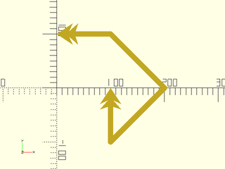

# LibFile: drawing.scad

This file includes stroke(), which converts a path into a
geometric object, like drawing with a pen.  It even works on
three-dimensional paths.  You can make a dashed line or add arrow
heads.  The turtle() function provides a turtle graphics style
approach for producing paths.  The arc() function produces arc paths,
and helix() produces helix paths.

To use, add the following lines to the beginning of your file:

    include <BOSL2/std.scad>

## Table of Contents

1. [Section: Line Drawing](#section-line-drawing)
    - [`stroke()`](#module-stroke)
    - [`dashed_stroke()`](#functionmodule-dashed_stroke)

2. [Section: Computing paths](#section-computing-paths)
    - [`arc()`](#functionmodule-arc)
    - [`helix()`](#function-helix)
    - [`turtle()`](#function-turtle)

3. [Section: Debugging polygons](#section-debugging-polygons)
    - [`debug_polygon()`](#module-debug_polygon)

## Section: Line Drawing

### Module: stroke()

**Usage:** 

- stroke(path, [width], [closed], [endcaps], [endcap\_width], [endcap\_length], [endcap\_extent], [trim]);
- stroke(path, [width], [closed], [endcap1], [endcap2], [endcap\_width1], [endcap\_width2], [endcap\_length1], [endcap\_length2], [endcap\_extent1], [endcap\_extent2], [trim1], [trim2]);

**Topics:** [Paths (2D)](Topics#paths-2d), [Paths (3D)](Topics#paths-3d), [Drawing Tools](Topics#drawing-tools)

**Description:** 

Draws a 2D or 3D path with a given line width.  Joints and each endcap can be replaced with
various marker shapes, and can be assigned different colors.  If passed a region instead of
a path, draws each path in the region as a closed polygon by default. If `closed=false` is
given with a region, each subpath is drawn as an un-closed line path.

**Figure 1:** Endcap Types

 

**Arguments:** 

<abbr title="These args can be used by position or by name.">By&nbsp;Position</abbr> | What it does
-------------------- | ------------
`path`               | The path to draw along.
`width`              | The width of the line to draw.  If given as a list of widths, (one for each path point), draws the line with varying thickness to each point.
`closed`             | If true, draw an additional line from the end of the path to the start.
`joints`             | Specifies the joint shape for each joint of the line.  If a 2D polygon is given, use that to draw custom joints.
`endcaps`            | Specifies the endcap type for both ends of the line.  If a 2D polygon is given, use that to draw custom endcaps.
`endcap1`            | Specifies the endcap type for the start of the line.  If a 2D polygon is given, use that to draw a custom endcap.
`endcap2`            | Specifies the endcap type for the end of the line.  If a 2D polygon is given, use that to draw a custom endcap.
`dots`               | Specifies both the endcap and joint types with one argument.  If given `true`, sets both to "dot".  If a 2D polygon is given, uses that to draw custom dots.
`joint_width`        | Some joint shapes are wider than the line.  This specifies the width of the shape, in multiples of the line width.
`endcap_width`       | Some endcap types are wider than the line.  This specifies the size of endcaps, in multiples of the line width.
`endcap_width1`      | This specifies the size of starting endcap, in multiples of the line width.
`endcap_width2`      | This specifies the size of ending endcap, in multiples of the line width.
`dots_width`         | This specifies the size of the joints and endcaps, in multiples of the line width.
`joint_length`       | Length of joint shape, in multiples of the line width.
`endcap_length`      | Length of endcaps, in multiples of the line width.
`endcap_length1`     | Length of starting endcap, in multiples of the line width.
`endcap_length2`     | Length of ending endcap, in multiples of the line width.
`dots_length`        | Length of both joints and endcaps, in multiples of the line width.
`joint_extent`       | Extents length of joint shape, in multiples of the line width.
`endcap_extent`      | Extents length of endcaps, in multiples of the line width.
`endcap_extent1`     | Extents length of starting endcap, in multiples of the line width.
`endcap_extent2`     | Extents length of ending endcap, in multiples of the line width.
`dots_extent`        | Extents length of both joints and endcaps, in multiples of the line width.
`joint_angle`        | Extra rotation given to joint shapes, in degrees.  If not given, the shapes are fully spun (for 3D lines).
`endcap_angle`       | Extra rotation given to endcaps, in degrees.  If not given, the endcaps are fully spun (for 3D lines).
`endcap_angle1`      | Extra rotation given to a starting endcap, in degrees.  If not given, the endcap is fully spun (for 3D lines).
`endcap_angle2`      | Extra rotation given to a ending endcap, in degrees.  If not given, the endcap is fully spun (for 3D lines).
`dots_angle`         | Extra rotation given to both joints and endcaps, in degrees.  If not given, the endcap is fully spun (for 3D lines).
`trim`               | Trim the the start and end line segments by this much, to keep them from interfering with custom endcaps.
`trim1`              | Trim the the starting line segment by this much, to keep it from interfering with a custom endcap.
`trim2`              | Trim the the ending line segment by this much, to keep it from interfering with a custom endcap.
`color`              | If given, sets the color of the line segments, joints and endcap.
`endcap_color`       | If given, sets the color of both endcaps.  Overrides `color=` and `dots_color=`.
`endcap_color1`      | If give, sets the color of the starting endcap.  Overrides `color=`, `dots_color=`,  and `endcap_color=`.
`endcap_color2`      | If given, sets the color of the ending endcap.  Overrides `color=`, `dots_color=`,  and `endcap_color=`.
`joint_color`        | If given, sets the color of the joints.  Overrides `color=` and `dots_color=`.
`dots_color`         | If given, sets the color of the endcaps and joints.  Overrides `color=`.
`convexity`          | Max number of times a line could intersect a wall of an endcap.
`hull`               | If true, use `hull()` to make higher quality joints between segments, at the cost of being much slower.  Default: true

**Example 1:** Drawing a Path

    include <BOSL2/std.scad>
    path = [[0,100], [100,100], [200,0], [100,-100], [100,0]];
    stroke(path, width=20);

  

**Example 2:** Closing a Path

    include <BOSL2/std.scad>
    path = [[0,100], [100,100], [200,0], [100,-100], [100,0]];
    stroke(path, width=20, endcaps=true, closed=true);

  

**Example 3:** Fancy Arrow Endcaps

    include <BOSL2/std.scad>
    path = [[0,100], [100,100], [200,0], [100,-100], [100,0]];
    stroke(path, width=10, endcaps="arrow2");

  

**Example 4:** Modified Fancy Arrow Endcaps

 

    include <BOSL2/std.scad>
    path = [[0,100], [100,100], [200,0], [100,-100], [100,0]];
    stroke(path, width=10, endcaps="arrow2", endcap_width=6, endcap_length=3, endcap_extent=2);

**Example 5:** Mixed Endcaps

    include <BOSL2/std.scad>
    path = [[0,100], [100,100], [200,0], [100,-100], [100,0]];
    stroke(path, width=10, endcap1="tail2", endcap2="arrow2");

  

**Example 6:** Plotting Points

 

    include <BOSL2/std.scad>
    path = [for (a=[0:30:360]) [a-180, 60*sin(a)]];
    stroke(path, width=3, joints="diamond", endcaps="arrow2", endcap_angle=0, endcap_width=5, joint_angle=0, joint_width=5);

**Example 7:** Joints and Endcaps

    include <BOSL2/std.scad>
    path = [for (a=[0:30:360]) [a-180, 60*sin(a)]];
    stroke(path, width=8, joints="dot", endcaps="arrow2");

  

**Example 8:** Custom Endcap Shapes

 

    include <BOSL2/std.scad>
    path = [[0,100], [100,100], [200,0], [100,-100], [100,0]];
    arrow = [[0,0], [2,-3], [0.5,-2.3], [2,-4], [0.5,-3.5], [-0.5,-3.5], [-2,-4], [-0.5,-2.3], [-2,-3]];
    stroke(path, width=10, trim=3.5, endcaps=arrow);

**Example 9:** Variable Line Width

    include <BOSL2/std.scad>
    path = circle(d=50,$fn=18);
    widths = [for (i=idx(path)) 10*i/len(path)+2];
    stroke(path,width=widths,$fa=1,$fs=1);

  

**Example 10:** 3D Path with Endcaps

    include <BOSL2/std.scad>
    path = rot([15,30,0], p=path3d(pentagon(d=50)));
    stroke(path, width=2, endcaps="arrow2", $fn=18);

  

**Example 11:** 3D Path with Flat Endcaps

 

    include <BOSL2/std.scad>
    path = rot([15,30,0], p=path3d(pentagon(d=50)));
    stroke(path, width=2, endcaps="arrow2", endcap_angle=0, $fn=18);

**Example 12:** 3D Path with Mixed Endcaps

 

    include <BOSL2/std.scad>
    path = rot([15,30,0], p=path3d(pentagon(d=50)));
    stroke(path, width=2, endcap1="arrow2", endcap2="tail", endcap_angle2=0, $fn=18);

**Example 13:** 3D Path with Joints and Endcaps

 

    include <BOSL2/std.scad>
    path = [for (i=[0:10:360]) [(i-180)/2,20*cos(3*i),20*sin(3*i)]];
    stroke(path, width=2, joints="dot", endcap1="round", endcap2="arrow2", joint_width=2.0, endcap_width2=3, $fn=18);

**Example 14:** Coloring Lines, Joints, and Endcaps

 

    include <BOSL2/std.scad>
    path = [for (i=[0:15:360]) [(i-180)/3,20*cos(2*i),20*sin(2*i)]];
    stroke(
        path, width=2, joints="dot", endcap1="dot", endcap2="arrow2",
        color="lightgreen", joint_color="red", endcap_color="blue",
        joint_width=2.0, endcap_width2=3, $fn=18
    );

**Example 15:** Simplified Plotting

 

    include <BOSL2/std.scad>
    path = [for (i=[0:15:360]) [(i-180)/3,20*cos(2*i)]];
    stroke(path, width=2, dots=true, color="lightgreen", dots_color="red", $fn=18);

**Example 16:** Drawing a Region

    include <BOSL2/std.scad>
    rgn = [square(100,center=true), circle(d=60,$fn=18)];
    stroke(rgn, width=2);

  

**Example 17:** Drawing a List of Lines

    include <BOSL2/std.scad>
    paths = [
        for (y=[-60:60:60]) [
            for (a=[-180:15:180])
            [a, 2*y+60*sin(a+y)]
        ]
    ];
    stroke(paths, closed=false, width=5);

  

---

### Function/Module: dashed\_stroke()

**Usage:** As a Module

- dashed\_stroke(path, dashpat, [closed=]);

**Usage:** As a Function

- dashes = dashed\_stroke(path, dashpat, width=, [closed=]);

**Topics:** [Paths](Topics#paths), [Drawing Tools](Topics#drawing-tools)

**Description:** 

Given a path (or region) and a dash pattern, creates a dashed line that follows that
path or region boundary with the given dash pattern.
- When called as a function, returns a list of dash sub-paths.
- When called as a module, draws all those subpaths using `stroke()`.
When called as a module the dash pattern is multiplied by the line width.  When called as
a function the dash pattern applies as you specify it.

**Arguments:** 

<abbr title="These args can be used by position or by name.">By&nbsp;Position</abbr> | What it does
-------------------- | ------------
`path`               | The path or region to subdivide into dashes.
`dashpat`            | A list of alternating dash lengths and space lengths for the dash pattern.  This will be scaled by the width of the line.

<abbr title="These args must be used by name, ie: name=value">By&nbsp;Name</abbr> | What it does
-------------------- | ------------
`width`              | The width of the dashed line to draw.  Module only.  Default: 1
`closed`             | If true, treat path as a closed polygon.  Default: false

**See Also:** [stroke()](#module-stroke), [path\_cut()](paths.scad#function-path_cut)

**Example 1:** Open Path

    include <BOSL2/std.scad>
    path = [for (a=[-180:10:180]) [a/3,20*sin(a)]];
    dashed_stroke(path, [3,2], width=1);

  

**Example 2:** Closed Polygon

    include <BOSL2/std.scad>
    path = circle(d=100,$fn=72);
    dashpat = [10,2,3,2,3,2];
    dashed_stroke(path, dashpat, width=1, closed=true);

  

**Example 3:** 3D Dashed Path

    include <BOSL2/std.scad>
    path = [for (a=[-180:5:180]) [a/3, 20*cos(3*a), 20*sin(3*a)]];
    dashed_stroke(path, [3,2], width=1);

  

---

## Section: Computing paths

### Function/Module: arc()

**Usage:** 2D arc from 0º to `angle` degrees.

- arc(N, r|d=, angle);

**Usage:** 2D arc from START to END degrees.

- arc(N, r|d=, angle=[START,END])

**Usage:** 2D arc from `start` to `start+angle` degrees.

- arc(N, r|d=, start=, angle=)

**Usage:** 2D circle segment by `width` and `thickness`, starting and ending on the X axis.

- arc(N, width=, thickness=)

**Usage:** Shortest 2D or 3D arc around centerpoint `cp`, starting at P0 and ending on the vector pointing from `cp` to `P1`.

- arc(N, cp=, points=[P0,P1], [long=], [cw=], [ccw=])

**Usage:** 2D or 3D arc, starting at `P0`, passing through `P1` and ending at `P2`.

- arc(N, points=[P0,P1,P2])

**Topics:** [Paths (2D)](Topics#paths-2d), [Paths (3D)](Topics#paths-3d), [Shapes (2D)](Topics#shapes-2d), [Path Generators](Topics#path-generators)

**Description:** 

If called as a function, returns a 2D or 3D path forming an arc.
If called as a module, creates a 2D arc polygon or pie slice shape.

**Arguments:** 

<abbr title="These args can be used by position or by name.">By&nbsp;Position</abbr> | What it does
-------------------- | ------------
`N`                  | Number of vertices to form the arc curve from.
`r`                  | Radius of the arc.
`angle`              | If a scalar, specifies the end angle in degrees (relative to start parameter).  If a vector of two scalars, specifies start and end angles.

<abbr title="These args must be used by name, ie: name=value">By&nbsp;Name</abbr> | What it does
-------------------- | ------------
`d`                  | Diameter of the arc.
`cp`                 | Centerpoint of arc.
`points`             | Points on the arc.
`long`               | if given with cp and points takes the long arc instead of the default short arc.  Default: false
`cw`                 | if given with cp and 2 points takes the arc in the clockwise direction.  Default: false
`ccw`                | if given with cp and 2 points takes the arc in the counter-clockwise direction.  Default: false
`width`              | If given with `thickness`, arc starts and ends on X axis, to make a circle segment.
`thickness`          | If given with `width`, arc starts and ends on X axis, to make a circle segment.
`start`              | Start angle of arc.
`wedge`              | If true, include centerpoint `cp` in output to form pie slice shape.
`endpoint`           | If false exclude the last point (function only).  Default: true
`anchor`             | Translate so anchor point is at origin (0,0,0).  See [anchor](attachments.scad#subsection-anchor).  (Module only) Default: `CENTER`
`spin`               | Rotate this many degrees around the Z axis after anchor.  See [spin](attachments.scad#subsection-spin).  (Module only) Default: `0`

**Example 1:** 

    include <BOSL2/std.scad>
    arc(N=4, r=30, angle=30, wedge=true);

  

**Example 2:** 

    include <BOSL2/std.scad>
    arc(r=30, angle=30, wedge=true);

  

**Example 3:** 

    include <BOSL2/std.scad>
    arc(d=60, angle=30, wedge=true);

  

**Example 4:** 

    include <BOSL2/std.scad>
    arc(d=60, angle=120);

  

**Example 5:** 

    include <BOSL2/std.scad>
    arc(d=60, angle=120, wedge=true);

  

**Example 6:** 

    include <BOSL2/std.scad>
    arc(r=30, angle=[75,135], wedge=true);

  

**Example 7:** 

    include <BOSL2/std.scad>
    arc(r=30, start=45, angle=75, wedge=true);

  

**Example 8:** 

    include <BOSL2/std.scad>
    arc(width=60, thickness=20);

  

**Example 9:** 

    include <BOSL2/std.scad>
    arc(cp=[-10,5], points=[[20,10],[0,35]], wedge=true);

  

**Example 10:** 

    include <BOSL2/std.scad>
    arc(points=[[30,-5],[20,10],[-10,20]], wedge=true);

  

**Example 11:** 

    include <BOSL2/std.scad>
    arc(points=[[5,30],[-10,-10],[30,5]], wedge=true);

  

**Example 12:** 

    include <BOSL2/std.scad>
    path = arc(points=[[5,30],[-10,-10],[30,5]], wedge=true);
    stroke(closed=true, path);

  

**Example 13:** 

    include <BOSL2/std.scad>
    path = arc(points=[[0,30,0],[0,0,30],[30,0,0]]);
    stroke(path, dots=true, dots_color="blue");

  

---

### Function: helix()

**Usage:** 

- helix([l|h], [turns], [angle], r|r1|r2, d|d1|d2)

**Description:** 

Returns a 3D helical path on a cone, including the degerate case of flat spirals.
You can specify start and end radii.  You can give the length, the helix angle, or the number of turns: two
of these three parameters define the helix.  For a flat helix you must give length 0 and a turn count.
Helix will be right handed if turns is positive and left handed if it is negative.
The angle is calculateld based on the radius at the base of the helix.

**Arguments:** 

<abbr title="These args can be used by position or by name.">By&nbsp;Position</abbr> | What it does
-------------------- | ------------
`h|l`                | Height/length of helix, zero for a flat spiral

<abbr title="These args must be used by name, ie: name=value">By&nbsp;Name</abbr> | What it does
-------------------- | ------------
`turns`              | Number of turns in helix, positive for right handed
`angle`              | helix angle
`r`                  | Radius of helix
`r1`                 | Radius of bottom of helix
`r2`                 | Radius of top of helix
`d`                  | Diameter of helix
`d1`                 | Diameter of bottom of helix
`d2`                 | Diameter of top of helix

**Example 1:** 

 

    include <BOSL2/std.scad>
    stroke(helix(turns=2.5, h=100, r=50), dots=true, dots_color="blue");

**Example 2:** Helix that turns the other way

 

    include <BOSL2/std.scad>
    stroke(helix(turns=-2.5, h=100, r=50), dots=true, dots_color="blue");

**Example 3:** Flat helix (note points are still 3d)

    include <BOSL2/std.scad>
    stroke(helix(h=0,r1=50,r2=25,l=0, turns=4));

  

---

### Function: turtle()

**Usage:** 

- turtle(commands, [state], [full\_state=], [repeat=])

**Topics:** [Shapes (2D)](Topics#shapes-2d), [Path Generators (2D)](Topics#path-generators-2d), [Mini-Language](Topics#mini-language)

**Description:** 

Use a sequence of turtle graphics commands to generate a path.  The parameter `commands` is a list of
turtle commands and optional parameters for each command.  The turtle state has a position, movement direction,
movement distance, and default turn angle.  If you do not give `state` as input then the turtle starts at the
origin, pointed along the positive x axis with a movement distance of 1.  By default, `turtle` returns just
the computed turtle path.  If you set `full_state` to true then it instead returns the full turtle state.
You can invoke `turtle` again with this full state to continue the turtle path where you left off.

The turtle state is a list with three entries: the path constructed so far, the current step as a 2-vector, the current default angle,
and the current arcsteps setting.

Commands     | Arguments          | What it does
------------ | ------------------ | -------------------------------
"move"       | [dist]             | Move turtle scale*dist units in the turtle direction.  Default dist=1.
"xmove"      | [dist]             | Move turtle scale*dist units in the x direction. Default dist=1.  Does not change turtle direction.
"ymove"      | [dist]             | Move turtle scale*dist units in the y direction. Default dist=1.  Does not change turtle direction.
"xymove"     | vector             | Move turtle by the specified vector.  Does not change turtle direction.
"untilx"     | xtarget            | Move turtle in turtle direction until x==xtarget.  Produces an error if xtarget is not reachable.
"untily"     | ytarget            | Move turtle in turtle direction until y==ytarget.  Produces an error if xtarget is not reachable.
"jump"       | point              | Move the turtle to the specified point
"xjump"      | x                  | Move the turtle's x position to the specified value
"yjump       | y                  | Move the turtle's y position to the specified value
"turn"       | [angle]            | Turn turtle direction by specified angle, or the turtle's default turn angle.  The default angle starts at 90.
"left"       | [angle]            | Same as "turn"
"right"      | [angle]            | Same as "turn", -angle
"angle"      | angle              | Set the default turn angle.
"setdir"     | dir                | Set turtle direction.  The parameter `dir` can be an angle or a vector.
"length"     | length             | Change the turtle move distance to `length`
"scale"      | factor             | Multiply turtle move distance by `factor`
"addlength"  | length             | Add `length` to the turtle move distance
"repeat"     | count, commands    | Repeats a list of commands `count` times.
"arcleft"    | radius, [angle]    | Draw an arc from the current position toward the left at the specified radius and angle.  The turtle turns by `angle`.  A negative angle draws the arc to the right instead of the left, and leaves the turtle facing right.  A negative radius draws the arc to the right but leaves the turtle facing left.
"arcright"   | radius, [angle]    | Draw an arc from the current position toward the right at the specified radius and angle
"arcleftto"  | radius, angle      | Draw an arc at the given radius turning toward the left until reaching the specified absolute angle.
"arcrightto" | radius, angle      | Draw an arc at the given radius turning toward the right until reaching the specified absolute angle.
"arcsteps"   | count              | Specifies the number of segments to use for drawing arcs.  If you set it to zero then the standard `$fn`, `$fa` and `$fs` variables define the number of segments.

**Arguments:** 

<abbr title="These args can be used by position or by name.">By&nbsp;Position</abbr> | What it does
-------------------- | ------------
`commands`           | List of turtle commands
`state`              | Starting turtle state (from previous call) or starting point.  Default: start at the origin, pointing right.

<abbr title="These args must be used by name, ie: name=value">By&nbsp;Name</abbr> | What it does
-------------------- | ------------
`full_state`         | If true return the full turtle state for continuing the path in subsequent turtle calls.  Default: false
`repeat`             | Number of times to repeat the command list.  Default: 1

**See Also:** [turtle3d()](turtle3d.scad#function-turtle3d)

**Example 1:** Simple rectangle

    include <BOSL2/std.scad>
    path = turtle(["xmove",3, "ymove", "xmove",-3, "ymove",-1]);
    stroke(path,width=.1);

  

**Example 2:** Pentagon

 

    include <BOSL2/std.scad>
    path=turtle(["angle",360/5,"move","turn","move","turn","move","turn","move"]);
    stroke(path,width=.1,closed=true);

**Example 3:** Pentagon using the repeat argument

    include <BOSL2/std.scad>
    path=turtle(["move","turn",360/5],repeat=5);
    stroke(path,width=.1,closed=true);

  

**Example 4:** Pentagon using the repeat turtle command, setting the turn angle

    include <BOSL2/std.scad>
    path=turtle(["angle",360/5,"repeat",5,["move","turn"]]);
    stroke(path,width=.1,closed=true);

  

**Example 5:** Pentagram

    include <BOSL2/std.scad>
    path = turtle(["move","left",144], repeat=4);
    stroke(path,width=.05,closed=true);

  

**Example 6:** Sawtooth path

    include <BOSL2/std.scad>
    path = turtle([
        "turn", 55,
        "untily", 2,
        "turn", -55-90,
        "untily", 0,
        "turn", 55+90,
        "untily", 2.5,
        "turn", -55-90,
        "untily", 0,
        "turn", 55+90,
        "untily", 3,
        "turn", -55-90,
        "untily", 0
    ]);
    stroke(path, width=.1);

  

**Example 7:** Simpler way to draw the sawtooth.  The direction of the turtle is preserved when executing "yjump".

    include <BOSL2/std.scad>
    path = turtle([
        "turn", 55,
        "untily", 2,
        "yjump", 0,
        "untily", 2.5,
        "yjump", 0,
        "untily", 3,
        "yjump", 0,
    ]);
    stroke(path, width=.1);

  

**Example 8:** square spiral

 

    include <BOSL2/std.scad>
    path = turtle(["move","left","addlength",1],repeat=50);
    stroke(path,width=.2);

**Example 9:** pentagonal spiral

 

    include <BOSL2/std.scad>
    path = turtle(["move","left",360/5,"addlength",1],repeat=50);
    stroke(path,width=.7);

**Example 10:** yet another spiral, without using `repeat`

 

    include <BOSL2/std.scad>
    path = turtle(concat(["angle",71],flatten(repeat(["move","left","addlength",1],50))));
    stroke(path,width=.7);

**Example 11:** The previous spiral grows linearly and eventually intersects itself.  This one grows geometrically and does not.

 

    include <BOSL2/std.scad>
    path = turtle(["move","left",71,"scale",1.05],repeat=50);
    stroke(path,width=.15);

**Example 12:** Koch Snowflake

 

    include <BOSL2/std.scad>
    function koch_unit(depth) =
        depth==0 ? ["move"] :
        concat(
            koch_unit(depth-1),
            ["right"],
            koch_unit(depth-1),
            ["left","left"],
            koch_unit(depth-1),
            ["right"],
            koch_unit(depth-1)
        );
    koch=concat(["angle",60,"repeat",3],[concat(koch_unit(3),["left","left"])]);
    polygon(turtle(koch));

---

## Section: Debugging polygons

### Module: debug\_polygon()

**Usage:** 

- debug\_polygon(points, paths, [vertices=], [edges=], [convexity=], [size=]);

**Description:** 

A drop-in replacement for `polygon()` that renders and labels the path points and
edges.  The start of each path is marked with a blue circle and the end with a pink diamond.
You can suppress the display of vertex or edge labeling using the `vertices` and `edges` arguments.

**Arguments:** 

<abbr title="These args can be used by position or by name.">By&nbsp;Position</abbr> | What it does
-------------------- | ------------
`points`             | The array of 2D polygon vertices.
`paths`              | The path connections between the vertices.

<abbr title="These args must be used by name, ie: name=value">By&nbsp;Name</abbr> | What it does
-------------------- | ------------
`vertices`           | if true display vertex labels and start/end markers.  Default: true
`edges`              | if true display edge labels.  Default: true
`convexity`          | The max number of walls a ray can pass through the given polygon paths.
`size`               | The base size of the line and labels.

**Example 1:** 

 

    include <BOSL2/std.scad>
    debug_polygon(
        points=concat(
            regular_ngon(or=10, n=8),
            regular_ngon(or=8, n=8)
        ),
        paths=[
            [for (i=[0:7]) i],
            [for (i=[15:-1:8]) i]
        ]
    );

---

