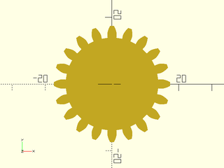
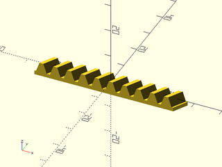

# LibFile: gears.scad

Spur Gears, Bevel Gears, Racks, Worms and Worm Gears.
Originally based on code by Leemon Baird, 2011, Leemon@Leemon.com
Almost completely rewritten for BOSL2 by Revar Desmera, 2017-2021, revarbat@gmail.com

To use, add the following lines to the beginning of your file:

    include <BOSL2/std.scad>
    include <BOSL2/gears.scad>

## Table of Contents

1. [Section: Terminology](#section-terminology)

2. [Section: Functions](#section-functions)
    - [`circular_pitch()`](#function-circular_pitch)
    - [`diametral_pitch()`](#function-diametral_pitch)
    - [`pitch_value()`](#function-pitch_value)
    - [`module_value()`](#function-module_value)
    - [`adendum()`](#function-adendum)
    - [`dedendum()`](#function-dedendum)
    - [`pitch_radius()`](#function-pitch_radius)
    - [`outer_radius()`](#function-outer_radius)
    - [`root_radius()`](#function-root_radius)
    - [`base_radius()`](#function-base_radius)
    - [`bevel_pitch_angle()`](#function-bevel_pitch_angle)
    - [`worm_gear_thickness()`](#function-worm_gear_thickness)

3. [Section: 2D Profiles](#section-2d-profiles)
    - [`gear_tooth_profile()`](#functionmodule-gear_tooth_profile)
    - [`spur_gear2d()`](#functionmodule-spur_gear2d)
    - [`rack2d()`](#functionmodule-rack2d)

4. [Section: 3D Gears and Racks](#section-3d-gears-and-racks)
    - [`spur_gear()`](#functionmodule-spur_gear)
    - [`bevel_gear()`](#functionmodule-bevel_gear)
    - [`rack()`](#functionmodule-rack)
    - [`worm()`](#functionmodule-worm)
    - [`worm_gear()`](#functionmodule-worm_gear)

## Section: Terminology

The outline of a gear is a smooth circle (the "pitch circle") which has
mountains and valleys added so it is toothed.  There is an inner
circle (the "root circle") that touches the base of all the teeth, an
outer circle that touches the tips of all the teeth, and the invisible
pitch circle in between them.  There is also a "base circle", which can
be smaller than all three of the others, which controls the shape of
the teeth.  The side of each tooth lies on the path that the end of a
string would follow if it were wrapped tightly around the base circle,
then slowly unwound.  That shape is an "involute", which gives this
type of gear its name.

## Section: Functions

These functions let the user find the derived dimensions of the gear.
A gear fits within a circle of radius outer_radius, and two gears should have
their centers separated by the sum of their pitch_radius.

### Function: circular\_pitch()

**Usage:** 

- circp = circular\_pitch(pitch|mod);

**Topics:** [Gears](Topics#gears)

**Description:** 

Get tooth density expressed as "circular pitch".

**Arguments:** 

<abbr title="These args can be used by position or by name.">By&nbsp;Position</abbr> | What it does
-------------------- | ------------
`pitch`              | The circular pitch, or distance between teeth around the pitch circle, in mm.
`mod`                | The metric module/modulus of the gear.

**Example 1:** 

    include <BOSL2/std.scad>
    include <BOSL2/gears.scad>
    circp = circular_pitch(pitch=5);
    circp = circular_pitch(mod=2);

  

---

### Function: diametral\_pitch()

**Usage:** 

- dp = diametral\_pitch(pitch|mod);

**Topics:** [Gears](Topics#gears)

**Description:** 

Get tooth density expressed as "diametral pitch".

**Arguments:** 

<abbr title="These args can be used by position or by name.">By&nbsp;Position</abbr> | What it does
-------------------- | ------------
`pitch`              | The circular pitch, or distance between teeth around the pitch circle, in mm.
`mod`                | The metric module/modulus of the gear.

**Example 1:** 

    include <BOSL2/std.scad>
    include <BOSL2/gears.scad>
    dp = diametral_pitch(pitch=5);
    dp = diametral_pitch(mod=2);

  

---

### Function: pitch\_value()

**Usage:** 

- pitch = pitch\_value(mod);

**Topics:** [Gears](Topics#gears)

**Description:** 

Get circular pitch in mm from module/modulus.  The circular pitch of a gear is the number of
millimeters per tooth around the pitch radius circle.

**Arguments:** 

<abbr title="These args can be used by position or by name.">By&nbsp;Position</abbr> | What it does
-------------------- | ------------
`mod`                | The module/modulus of the gear.

---

### Function: module\_value()

**Usage:** 

- mod = module\_value(pitch);

**Topics:** [Gears](Topics#gears)

**Description:** 

Get tooth density expressed as "module" or "modulus" in millimeters.  The module is the pitch
diameter of the gear divided by the number of teeth on it.  For example, a gear with a pitch
diameter of 40mm, with 20 teeth on it will have a modulus of 2.

**Arguments:** 

<abbr title="These args can be used by position or by name.">By&nbsp;Position</abbr> | What it does
-------------------- | ------------
`pitch`              | The circular pitch, or distance between teeth around the pitch circle, in mm.

---

### Function: adendum()

**Usage:** 

- ad = adendum(pitch|mod);

**Topics:** [Gears](Topics#gears)

**Description:** 

The height of the top of a gear tooth above the pitch radius circle.

**Arguments:** 

<abbr title="These args can be used by position or by name.">By&nbsp;Position</abbr> | What it does
-------------------- | ------------
`pitch`              | The circular pitch, or distance between teeth around the pitch circle, in mm.
`mod`                | The metric module/modulus of the gear.

**Example 1:** 

    include <BOSL2/std.scad>
    include <BOSL2/gears.scad>
    ad = adendum(pitch=5);
    ad = adendum(mod=2);

  

**Example 2:** 

    include <BOSL2/std.scad>
    include <BOSL2/gears.scad>
    pitch = 5; teeth = 17;
    pr = pitch_radius(pitch=pitch, teeth=teeth);
    adn = adendum(pitch=5);
    #spur_gear2d(pitch=pitch, teeth=teeth);
    color("black") {
        stroke(circle(r=pr),width=0.1,closed=true);
        stroke(circle(r=pr+adn),width=0.1,closed=true);
    }

  

---

### Function: dedendum()

**Usage:** 

- ddn = dedendum(pitch|mod, [clearance]);

**Topics:** [Gears](Topics#gears)

**Description:** 

The depth of the gear tooth valley, below the pitch radius.

**Arguments:** 

<abbr title="These args can be used by position or by name.">By&nbsp;Position</abbr> | What it does
-------------------- | ------------
`pitch`              | The circular pitch, or distance between teeth around the pitch circle, in mm.
`clearance`          | If given, sets the clearance between meshing teeth.
`mod`                | The metric module/modulus of the gear.

**Example 1:** 

    include <BOSL2/std.scad>
    include <BOSL2/gears.scad>
    ddn = dedendum(pitch=5);
    ddn = dedendum(mod=2);

  

**Example 2:** 

    include <BOSL2/std.scad>
    include <BOSL2/gears.scad>
    pitch = 5; teeth = 17;
    pr = pitch_radius(pitch=pitch, teeth=teeth);
    ddn = dedendum(pitch=5);
    #spur_gear2d(pitch=pitch, teeth=teeth);
    color("black") {
        stroke(circle(r=pr),width=0.1,closed=true);
        stroke(circle(r=pr-ddn),width=0.1,closed=true);
    }

  

---

### Function: pitch\_radius()

**Usage:** 

- pr = pitch\_radius(pitch|mod, teeth);

**Topics:** [Gears](Topics#gears)

**Description:** 

Calculates the pitch radius for the gear.  Two mated gears will have their centers spaced apart
by the sum of the two gear's pitch radii.

**Arguments:** 

<abbr title="These args can be used by position or by name.">By&nbsp;Position</abbr> | What it does
-------------------- | ------------
`pitch`              | The circular pitch, or distance between teeth around the pitch circle, in mm.
`teeth`              | The number of teeth on the gear.
`mod`                | The metric module/modulus of the gear.

**Example 1:** 

    include <BOSL2/std.scad>
    include <BOSL2/gears.scad>
    pr = pitch_radius(pitch=5, teeth=11);
    pr = pitch_radius(mod=2, teeth=20);

  

**Example 2:** 

    include <BOSL2/std.scad>
    include <BOSL2/gears.scad>
    pr = pitch_radius(pitch=5, teeth=11);
    #spur_gear2d(pitch=5, teeth=11);
    color("black")
        stroke(circle(r=pr),width=0.1,closed=true);

  

---

### Function: outer\_radius()

**Usage:** 

- or = outer\_radius(pitch|mod, teeth, [clearance], [interior]);

**Topics:** [Gears](Topics#gears)

**Description:** 

Calculates the outer radius for the gear. The gear fits entirely within a cylinder of this radius.

**Arguments:** 

<abbr title="These args can be used by position or by name.">By&nbsp;Position</abbr> | What it does
-------------------- | ------------
`pitch`              | The circular pitch, or distance between teeth around the pitch circle, in mm.
`teeth`              | The number of teeth on the gear.
`clearance`          | If given, sets the clearance between meshing teeth.
`interior`           | If true, calculate for an interior gear.
`mod`                | The metric module/modulus of the gear.

**Example 1:** 

    include <BOSL2/std.scad>
    include <BOSL2/gears.scad>
    or = outer_radius(pitch=5, teeth=20);
    or = outer_radius(mod=2, teeth=16);

  

**Example 2:** 

    include <BOSL2/std.scad>
    include <BOSL2/gears.scad>
    pr = outer_radius(pitch=5, teeth=11);
    #spur_gear2d(pitch=5, teeth=11);
    color("black")
        stroke(circle(r=pr),width=0.1,closed=true);

  

---

### Function: root\_radius()

**Usage:** 

- rr = root\_radius(pitch|mod, teeth, [clearance], [interior]);

**Topics:** [Gears](Topics#gears)

**Description:** 

Calculates the root radius for the gear, at the base of the dedendum.

**Arguments:** 

<abbr title="These args can be used by position or by name.">By&nbsp;Position</abbr> | What it does
-------------------- | ------------
`pitch`              | The circular pitch, or distance between teeth around the pitch circle, in mm.
`teeth`              | The number of teeth on the gear.
`clearance`          | If given, sets the clearance between meshing teeth.
`interior`           | If true, calculate for an interior gear.
`mod`                | The metric module/modulus of the gear.

**Example 1:** 

    include <BOSL2/std.scad>
    include <BOSL2/gears.scad>
    rr = root_radius(pitch=5, teeth=11);
    rr = root_radius(mod=2, teeth=16);

  

**Example 2:** 

    include <BOSL2/std.scad>
    include <BOSL2/gears.scad>
    pr = root_radius(pitch=5, teeth=11);
    #spur_gear2d(pitch=5, teeth=11);
    color("black")
        stroke(circle(r=pr),width=0.1,closed=true);

  

---

### Function: base\_radius()

**Usage:** 

- br = base\_radius(pitch|mod, teeth, [pressure\_angle]);

**Topics:** [Gears](Topics#gears)

**Description:** 

Get the base circle for involute teeth, at the base of the teeth.

**Arguments:** 

<abbr title="These args can be used by position or by name.">By&nbsp;Position</abbr> | What it does
-------------------- | ------------
`pitch`              | The circular pitch, or distance between teeth around the pitch circle, in mm.
`teeth`              | The number of teeth on the gear.
`pressure_angle`     | Pressure angle in degrees.  Controls how straight or bulged the tooth sides are.
`mod`                | The metric module/modulus of the gear.

**Example 1:** 

    include <BOSL2/std.scad>
    include <BOSL2/gears.scad>
    br = base_radius(pitch=5, teeth=20, pressure_angle=20);
    br = base_radius(mod=2, teeth=18, pressure_angle=20);

  

**Example 2:** 

    include <BOSL2/std.scad>
    include <BOSL2/gears.scad>
    pr = base_radius(pitch=5, teeth=11);
    #spur_gear2d(pitch=5, teeth=11);
    color("black")
        stroke(circle(r=pr),width=0.1,closed=true);

  

---

### Function: bevel\_pitch\_angle()

**Usage:** 

- ang = bevel\_pitch\_angle(teeth, mate\_teeth, [drive\_angle]);

**Topics:** [Gears](Topics#gears)

**Description:** 

Returns the correct pitch angle for a bevel gear with a given number of tooth, that is
matched to another bevel gear with a (possibly different) number of teeth.

**Arguments:** 

<abbr title="These args can be used by position or by name.">By&nbsp;Position</abbr> | What it does
-------------------- | ------------
`teeth`              | Number of teeth that this gear has.
`mate_teeth`         | Number of teeth that the matching gear has.
`drive_angle`        | Angle between the drive shafts of each gear.  Default: 90º.

**See Also:** [bevel\_gear()](#functionmodule-bevel_gear)

**Example 1:** 

    include <BOSL2/std.scad>
    include <BOSL2/gears.scad>
    ang = bevel_pitch_angle(teeth=18, mate_teeth=30);

  

**Example 2:** 

 

    include <BOSL2/std.scad>
    include <BOSL2/gears.scad>
    t1 = 13; t2 = 19; pitch=5;
    pang = bevel_pitch_angle(teeth=t1, mate_teeth=t2, drive_angle=90);
    color("black") {
        zrot_copies([0,pang])
            stroke([[0,0,0], [0,-20,0]],width=0.2);
        stroke(arc(r=3, angle=[270,270+pang]),width=0.2);
    }
    #bevel_gear(
        pitch=5, teeth=t1, mate_teeth=t2,
        spiral_angle=0, cutter_radius=1000,
        slices=12, anchor="apex", orient=BACK
    );

---

### Function: worm\_gear\_thickness()

**Usage:** 

- thick = worm\_gear\_thickness(pitch|mod, teeth, worm\_diam, [worm\_arc], [crowning], [clearance]);

**Topics:** [Gears](Topics#gears)

**Description:** 

Calculate the thickness of the worm gear.

**Arguments:** 

<abbr title="These args can be used by position or by name.">By&nbsp;Position</abbr> | What it does
-------------------- | ------------
`pitch`              | The circular pitch, or distance between teeth around the pitch circle, in mm.  Default: 5
`teeth`              | Total number of teeth along the rack.  Default: 30
`worm_diam`          | The pitch diameter of the worm gear to match to.  Default: 30
`worm_arc`           | The arc of the worm to mate with, in degrees. Default: 60 degrees
`crowning`           | The amount to oversize the virtual hobbing cutter used to make the teeth, to add a slight crowning to the teeth to make them fir the work easier.  Default: 1
`clearance`          | Clearance gap at the bottom of the inter-tooth valleys.
`mod`                | The metric module/modulus of the gear.

**See Also:** [worm()](#functionmodule-worm), [worm\_gear()](#functionmodule-worm_gear)

**Example 1:** 

    include <BOSL2/std.scad>
    include <BOSL2/gears.scad>
    thick = worm_gear_thickness(pitch=5, teeth=36, worm_diam=30);
    thick = worm_gear_thickness(mod=2, teeth=28, worm_diam=25);

  

**Example 2:** 

 

    include <BOSL2/std.scad>
    include <BOSL2/gears.scad>
    pitch = 5;  teeth=17;
    worm_diam = 30; starts=2;
    y = worm_gear_thickness(pitch=pitch, teeth=teeth, worm_diam=worm_diam);
    #worm_gear(
        pitch=pitch, teeth=teeth,
        worm_diam=worm_diam,
        worm_starts=starts,
        orient=BACK
    );
    color("black") {
        ycopies(y) stroke([[-25,0],[25,0]], width=0.5);
        stroke([[-20,-y/2],[-20,y/2]],width=0.5,endcaps="arrow");
    }

---

## Section: 2D Profiles

### Function/Module: gear\_tooth\_profile()

**Usage:** As Module

- gear\_tooth\_profile(pitch|mod, teeth, [pressure\_angle], [clearance], [backlash], [interior], [valleys]);

**Usage:** As Function

- path = gear\_tooth\_profile(pitch|mod, teeth, [pressure\_angle], [clearance], [backlash], [interior], [valleys]);

**Topics:** [Gears](Topics#gears)

**Description:** 

When called as a function, returns the 2D profile path for an individual gear tooth.
When called as a module, creates the 2D profile shape for an individual gear tooth.

**Arguments:** 

<abbr title="These args can be used by position or by name.">By&nbsp;Position</abbr> | What it does
-------------------- | ------------
`pitch`              | The circular pitch, or distance between teeth around the pitch circle, in mm.
`teeth`              | Total number of teeth on the spur gear that this is a tooth for.
`pressure_angle`     | Pressure Angle.  Controls how straight or bulged the tooth sides are. In degrees.
`clearance`          | Gap between top of a tooth on one gear and bottom of valley on a meshing gear (in millimeters)
`backlash`           | Gap between two meshing teeth, in the direction along the circumference of the pitch circle
`interior`           | If true, create a mask for difference()ing from something else.
`valleys`            | If true, add the valley bottoms on either side of the tooth.  Default: true
`center`             | If true, centers the pitch circle of the tooth profile at the origin.  Default: false.
`mod`                | The metric module/modulus of the gear.

**See Also:** [spur\_gear2d()](#functionmodule-spur_gear2d)

**Example 1:** 

    include <BOSL2/std.scad>
    include <BOSL2/gears.scad>
    gear_tooth_profile(pitch=5, teeth=20, pressure_angle=20);

  

**Example 2:** Metric Gear Tooth

    include <BOSL2/std.scad>
    include <BOSL2/gears.scad>
    gear_tooth_profile(mod=2, teeth=20, pressure_angle=20);

  

**Example 3:** 

    include <BOSL2/std.scad>
    include <BOSL2/gears.scad>
    gear_tooth_profile(
        pitch=5, teeth=20, pressure_angle=20, valleys=false
    );

  

**Example 4:** As a function

    include <BOSL2/std.scad>
    include <BOSL2/gears.scad>
    path = gear_tooth_profile(
        pitch=5, teeth=20, pressure_angle=20, valleys=false
    );
    stroke(path, width=0.1);

  

---

### Function/Module: spur\_gear2d()

**Usage:** As Module

- spur\_gear2d(pitch|mod, teeth, [hide], [pressure\_angle], [clearance], [backlash], [interior]);

**Usage:** As Function

- poly = spur\_gear2d(pitch|mod, teeth, [hide], [pressure\_angle], [clearance], [backlash], [interior]);

**Topics:** [Gears](Topics#gears)

**Description:** 

When called as a module, creates a 2D involute spur gear.  When called as a function, returns a
2D path for the perimeter of a 2D involute spur gear.  Normally, you should just specify the
first 2 parameters `pitch` and `teeth`, and let the rest be default values.
Meshing gears must match in `pitch`, `pressure_angle`, and `helical`, and be separated by
the sum of their pitch radii, which can be found with `pitch_radius()`.

**Arguments:** 

<abbr title="These args can be used by position or by name.">By&nbsp;Position</abbr> | What it does
-------------------- | ------------
`pitch`              | The circular pitch, or distance between teeth around the pitch circle, in mm.
`teeth`              | Total number of teeth around the spur gear.
`hide`               | Number of teeth to delete to make this only a fraction of a circle
`pressure_angle`     | Controls how straight or bulged the tooth sides are. In degrees.
`clearance`          | Gap between top of a tooth on one gear and bottom of valley on a meshing gear (in millimeters)
`backlash`           | Gap between two meshing teeth, in the direction along the circumference of the pitch circle
`interior`           | If true, create a mask for difference()ing from something else.
`mod`                | The metric module/modulus of the gear.
`anchor`             | Translate so anchor point is at origin (0,0,0).  See [anchor](attachments.scad#subsection-anchor).  Default: `CENTER`
`spin`               | Rotate this many degrees around the Z axis after anchor.  See [spin](attachments.scad#subsection-spin).  Default: `0`

**See Also:** [spur\_gear()](#functionmodule-spur_gear)

**Example 1:** Typical Gear Shape

    include <BOSL2/std.scad>
    include <BOSL2/gears.scad>
    spur_gear2d(pitch=5, teeth=20);

  

**Example 2:** Metric Gear

    include <BOSL2/std.scad>
    include <BOSL2/gears.scad>
    spur_gear2d(mod=2, teeth=20);

  

**Example 3:** Lower Pressure Angle

    include <BOSL2/std.scad>
    include <BOSL2/gears.scad>
    spur_gear2d(pitch=5, teeth=20, pressure_angle=20);

  

**Example 4:** Partial Gear

    include <BOSL2/std.scad>
    include <BOSL2/gears.scad>
    spur_gear2d(pitch=5, teeth=20, hide=15, pressure_angle=20);

  

**Example 5:** Called as a Function

    include <BOSL2/std.scad>
    include <BOSL2/gears.scad>
    path = spur_gear2d(pitch=8, teeth=16);
    polygon(path);

  

---

### Function/Module: rack2d()

**Usage:** As a Function

- path = rack2d(pitch|mod, teeth, height, [pressure\_angle], [backlash]);

**Usage:** As a Module

- rack2d(pitch|mod, teeth, height, [pressure\_angle], [backlash]);

**Topics:** [Gears](Topics#gears)

**Description:** 

This is used to create a 2D rack, which is a linear bar with teeth that a gear can roll along.
A rack can mesh with any gear that has the same `pitch` and `pressure_angle`.
When called as a function, returns a 2D path for the outline of the rack.
When called as a module, creates a 2D rack shape.

**Arguments:** 

<abbr title="These args can be used by position or by name.">By&nbsp;Position</abbr> | What it does
-------------------- | ------------
`pitch`              | The circular pitch, or distance between teeth around the pitch circle, in mm.
`teeth`              | Total number of teeth along the rack
`height`             | Height of rack in mm, from tooth top to back of rack.
`pressure_angle`     | Controls how straight or bulged the tooth sides are. In degrees.
`backlash`           | Gap between two meshing teeth, in the direction along the circumference of the pitch circle
`mod`                | The metric module/modulus of the gear.
`anchor`             | Translate so anchor point is at origin (0,0,0).  See [anchor](attachments.scad#subsection-anchor).  Default: `CENTER`
`spin`               | Rotate this many degrees around the Z axis after anchor.  See [spin](attachments.scad#subsection-spin).  Default: `0`

**Extra Anchors:** 

Anchor Name | Position
----------- | --------
"adendum" | At the tips of the teeth, at the center of rack.
"adendum-left" | At the tips of the teeth, at the left end of the rack.
"adendum-right" | At the tips of the teeth, at the right end of the rack.
"dedendum" | At the height of the teeth, at the center of rack.
"dedendum-left" | At the height of the teeth, at the left end of the rack.
"dedendum-right" | At the height of the teeth, at the right end of the rack.

**See Also:** [spur\_gear2d()](#functionmodule-spur_gear2d)

**Example 1:** 

    include <BOSL2/std.scad>
    include <BOSL2/gears.scad>
    rack2d(pitch=5, teeth=10, height=10, pressure_angle=20);

  

**Example 2:** Called as a Function

    include <BOSL2/std.scad>
    include <BOSL2/gears.scad>
    path = rack2d(pitch=8, teeth=8, height=10, pressure_angle=28);
    polygon(path);

  

---

## Section: 3D Gears and Racks

### Function/Module: spur\_gear()

**Usage:** As a Module

- spur\_gear(pitch, teeth, thickness, [shaft\_diam=], [hide], [pressure\_angle], [clearance], [backlash], [helical], [slices], [interior]);
- spur\_gear(mod=, teeth=, thickness=, [shaft\_diam=], ...);

**Usage:** As a Function

- vnf = spur\_gear(pitch, teeth, thickness, [shaft\_diam], ...);
- vnf = spur\_gear(mod=, teeth=, thickness=, [shaft\_diam], ...);

**Topics:** [Gears](Topics#gears)

**Description:** 

Creates a (potentially helical) involute spur gear.  The module `spur_gear()` gives an involute
spur gear, with reasonable defaults for all the parameters.  Normally, you should just choose the
first 4 parameters, and let the rest be default values.  The module `spur_gear()` gives a gear in
the XY plane, centered on the origin, with one tooth centered on the positive Y axis.  The most
important is `pitch_radius()`, which tells how far apart to space gears that are meshing, and
`outer_radius()`, which gives the size of the region filled by the gear.  A gear has a "pitch
circle", which is an invisible circle that cuts through the middle of each tooth (though not the
exact center). In order for two gears to mesh, their pitch circles should just touch.  So the
distance between their centers should be `pitch_radius()` for one, plus `pitch_radius()` for the
other, which gives the radii of their pitch circles.  In order for two gears to mesh, they must
have the same `pitch` and `pressure_angle` parameters.  `pitch` gives the number of millimeters
of arc around the pitch circle covered by one tooth and one space between teeth.  The
`pressure_angle` controls how flat or bulged the sides of the teeth are.  Common values include
14.5 degrees and 20 degrees, and occasionally 25.  Though I've seen 28 recommended for plastic
gears. Larger numbers bulge out more, giving stronger teeth, so 28 degrees is the default here.
The ratio of `teeth` for two meshing gears gives how many times one will make a full revolution
when the the other makes one full revolution.  If the two numbers are coprime (i.e.  are not both
divisible by the same number greater than 1), then every tooth on one gear will meet every tooth
on the other, for more even wear.  So coprime numbers of teeth are good.

**Arguments:** 

<abbr title="These args can be used by position or by name.">By&nbsp;Position</abbr> | What it does
-------------------- | ------------
`pitch`              | The circular pitch, or distance between teeth around the pitch circle, in mm.
`teeth`              | Total number of teeth around the entire perimeter
`thickness`          | Thickness of gear in mm
`shaft_diam`         | Diameter of the hole in the center, in mm.  Default: 0 (no shaft hole)

<abbr title="These args must be used by name, ie: name=value">By&nbsp;Name</abbr> | What it does
-------------------- | ------------
`hide`               | Number of teeth to delete to make this only a fraction of a circle
`pressure_angle`     | Controls how straight or bulged the tooth sides are. In degrees.
`clearance`          | Clearance gap at the bottom of the inter-tooth valleys.
`backlash`           | Gap between two meshing teeth, in the direction along the circumference of the pitch circle
`helical`            | Teeth are slanted around the spur gear at this angle away from the gear axis of rotation.
`slices`             | Number of vertical layers to divide gear into.  Useful for refining gears with `helical`.
`scale`              | Scale of top of gear compared to bottom.  Useful for making crown gears.
`interior`           | If true, create a mask for difference()ing from something else.
`mod`                | The metric module/modulus of the gear.
`anchor`             | Translate so anchor point is at origin (0,0,0).  See [anchor](attachments.scad#subsection-anchor).  Default: `CENTER`
`spin`               | Rotate this many degrees around the Z axis after anchor.  See [spin](attachments.scad#subsection-spin).  Default: `0`
`orient`             | Vector to rotate top towards, after spin.  See [orient](attachments.scad#subsection-orient).  Default: `UP`

**See Also:** [rack()](#functionmodule-rack)

**Example 1:** Spur Gear

    include <BOSL2/std.scad>
    include <BOSL2/gears.scad>
    spur_gear(pitch=5, teeth=20, thickness=8, shaft_diam=5);

  

**Example 2:** Metric Gear

    include <BOSL2/std.scad>
    include <BOSL2/gears.scad>
    spur_gear(mod=2, teeth=20, thickness=8, shaft_diam=5);

  

**Example 3:** Helical Gear

    include <BOSL2/std.scad>
    include <BOSL2/gears.scad>
    spur_gear(
        pitch=5, teeth=20, thickness=10,
        shaft_diam=5, helical=-30, slices=12,
        $fa=1, $fs=1
    );

  

**Example 4:** Assembly of Gears

 

    include <BOSL2/std.scad>
    include <BOSL2/gears.scad>
    n1 = 11; //red gear number of teeth
    n2 = 20; //green gear
    n3 = 5;  //blue gear
    n4 = 16; //orange gear
    n5 = 9;  //gray rack
    pitch = 9; //all meshing gears need the same `pitch` (and the same `pressure_angle`)
    thickness    = 6;
    hole         = 3;
    rack_base    = 12;
    r1 = pitch_radius(pitch,n1);
    r2 = pitch_radius(pitch,n2);
    r3 = pitch_radius(pitch,n3);
    r4 = pitch_radius(pitch,n4);
    r5 = pitch_radius(pitch,n5);
    a1 =  $t * 360 / n1;
    a2 = -$t * 360 / n2 + 180/n2;
    a3 = -$t * 360 / n3;
    a4 = -$t * 360 / n4 - 7.5*180/n4;
    color("#f77")              zrot(a1) spur_gear(pitch,n1,thickness,hole);
    color("#7f7") back(r1+r2)  zrot(a2) spur_gear(pitch,n2,thickness,hole);
    color("#77f") right(r1+r3) zrot(a3) spur_gear(pitch,n3,thickness,hole);
    color("#fc7") left(r1+r4)  zrot(a4) spur_gear(pitch,n4,thickness,hole,hide=n4-3);
    color("#ccc") fwd(r1) right(pitch*$t)
        rack(pitch=pitch,teeth=n5,thickness=thickness,height=rack_base,anchor=CENTER,orient=BACK);

---

### Function/Module: bevel\_gear()

**Usage:** As a Module

- bevel\_gear(pitch|mod, teeth, face\_width, pitch\_angle, [shaft\_diam], [hide], [pressure\_angle], [clearance], [backlash], [cutter\_radius], [spiral\_angle], [slices], [interior]);

**Usage:** As a Function

- vnf = bevel\_gear(pitch|mod, teeth, face\_width, pitch\_angle, [hide], [pressure\_angle], [clearance], [backlash], [cutter\_radius], [spiral\_angle], [slices], [interior]);

**Topics:** [Gears](Topics#gears)

**Description:** 

Creates a (potentially spiral) bevel gear.  The module `bevel_gear()` gives a bevel gear, with
reasonable defaults for all the parameters.  Normally, you should just choose the first 4
parameters, and let the rest be default values.  The module `bevel_gear()` gives a gear in the XY
plane, centered on the origin, with one tooth centered on the positive Y axis.  The various
functions below it take the same parameters, and return various measurements for the gear.  The
most important is `pitch_radius()`, which tells how far apart to space gears that are meshing,
and `outer_radius()`, which gives the size of the region filled by the gear.  A gear has a "pitch
circle", which is an invisible circle that cuts through the middle of each tooth (though not the
exact center). In order for two gears to mesh, their pitch circles should just touch.  So the
distance between their centers should be `pitch_radius()` for one, plus `pitch_radius()` for the
other, which gives the radii of their pitch circles.  In order for two gears to mesh, they must
have the same `pitch` and `pressure_angle` parameters.  `pitch` gives the number of millimeters of arc around
the pitch circle covered by one tooth and one space between teeth.  The `pressure_angle` controls how flat or
bulged the sides of the teeth are.  Common values include 14.5 degrees and 20 degrees, and
occasionally 25.  Though I've seen 28 recommended for plastic gears. Larger numbers bulge out
more, giving stronger teeth, so 28 degrees is the default here.  The ratio of `teeth` for two
meshing gears gives how many times one will make a full revolution when the the other makes one
full revolution.  If the two numbers are coprime (i.e.  are not both divisible by the same number
greater than 1), then every tooth on one gear will meet every tooth on the other, for more even
wear.  So coprime numbers of teeth are good.

**Arguments:** 

<abbr title="These args can be used by position or by name.">By&nbsp;Position</abbr> | What it does
-------------------- | ------------
`pitch`              | The circular pitch, or distance between teeth around the pitch circle, in mm.  Default: 5
`teeth`              | Total number of teeth around the entire perimeter.  Default: 20
`face_width`         | Width of the toothed surface in mm, from inside to outside.  Default: 10
`pitch_angle`        | Angle of beveled gear face.  Default: 45
`mate_teeth`         | The number of teeth in the gear that this gear will mate with.  Overrides `pitch_angle` if given.
`shaft_diam`         | Diameter of the hole in the center, in mm.  Module use only.  Default: 0 (no shaft hole)
`hide`               | Number of teeth to delete to make this only a fraction of a circle.  Default: 0
`pressure_angle`     | Controls how straight or bulged the tooth sides are. In degrees. Default: 28
`clearance`          | Clearance gap at the bottom of the inter-tooth valleys.
`backlash`           | Gap between two meshing teeth, in the direction along the circumference of the pitch circle.  Default: 0
`cutter_radius`      | Radius of spiral arc for teeth.  If 0, then gear will not be spiral.  Default: 0
`spiral_angle`       | The base angle for spiral teeth.  Default: 0
`left_handed`        | If true, the gear returned will have a left-handed spiral.  Default: false
`slices`             | Number of vertical layers to divide gear into.  Useful for refining gears with `spiral`.  Default: 1
`interior`           | If true, create a mask for difference()ing from something else.
`mod`                | The metric module/modulus of the gear.
`anchor`             | Translate so anchor point is at origin (0,0,0).  See [anchor](attachments.scad#subsection-anchor).  Default: `CENTER`
`spin`               | Rotate this many degrees around the Z axis after anchor.  See [spin](attachments.scad#subsection-spin).  Default: `0`
`orient`             | Vector to rotate top towards, after spin.  See [orient](attachments.scad#subsection-orient).  Default: `UP`

**Extra Anchors:** 

Anchor Name | Position
----------- | --------
"apex" | At the pitch cone apex for the bevel gear.
"pitchbase" | At the natural height of the pitch radius of the beveled gear.
"flattop" | At the top of the flat top of the bevel gear.

**See Also:** [bevel\_pitch\_angle()](#function-bevel_pitch_angle)

**Example 1:** Beveled Gear

    include <BOSL2/std.scad>
    include <BOSL2/gears.scad>
    bevel_gear(
        pitch=5, teeth=36, face_width=10, shaft_diam=5,
        pitch_angle=45, spiral_angle=0
    );

  

**Example 2:** Spiral Beveled Gear and Pinion

    include <BOSL2/std.scad>
    include <BOSL2/gears.scad>
    t1 = 16; t2 = 28;
    bevel_gear(
        pitch=5, teeth=t1, mate_teeth=t2,
        slices=12, anchor="apex", orient=FWD
    );
    bevel_gear(
        pitch=5, teeth=t2, mate_teeth=t1, left_handed=true,
        slices=12, anchor="apex", spin=180/t2
    );

  

**Example 3:** Manual Spacing of Pinion and Gear

    include <BOSL2/std.scad>
    include <BOSL2/gears.scad>
    t1 = 14; t2 = 28; pitch=5;
    back(pitch_radius(pitch=pitch, teeth=t2)) {
      yrot($t*360/t1)
      bevel_gear(
        pitch=pitch, teeth=t1, mate_teeth=t2, shaft_diam=5,
        slices=12, orient=FWD
      );
    }
    down(pitch_radius(pitch=pitch, teeth=t1)) {
      zrot($t*360/t2)
      bevel_gear(
        pitch=pitch, teeth=t2, mate_teeth=t1, left_handed=true,
        shaft_diam=5, slices=12, spin=180/t2
      );
    }

  

---

### Function/Module: rack()

**Usage:** As a Module

- rack(pitch, teeth, thickness, height, [pressure\_angle=], [backlash=]);
- rack(mod=, teeth=, thickness=, height=, [pressure\_angle=], [backlash]=);

**Usage:** As a Function

- vnf = rack(pitch, teeth, thickness, height, [pressure\_angle=], [backlash=]);
- vnf = rack(mod=, teeth=, thickness=, height=, [pressure\_angle=], [backlash=]);

**Topics:** [Gears](Topics#gears)

**Description:** 

This is used to create a 3D rack, which is a linear bar with teeth that a gear can roll along.
A rack can mesh with any gear that has the same `pitch` and `pressure_angle`.
When called as a function, returns a 3D [VNF](vnf.scad) for the rack.
When called as a module, creates a 3D rack shape.

**Arguments:** 

<abbr title="These args can be used by position or by name.">By&nbsp;Position</abbr> | What it does
-------------------- | ------------
`pitch`              | The circular pitch, or distance between teeth around the pitch circle, in mm. Default: 5
`teeth`              | Total number of teeth along the rack.  Default: 20
`thickness`          | Thickness of rack in mm (affects each tooth).  Default: 5
`height`             | Height of rack in mm, from tooth top to back of rack.  Default: 10

<abbr title="These args must be used by name, ie: name=value">By&nbsp;Name</abbr> | What it does
-------------------- | ------------
`pressure_angle`     | Controls how straight or bulged the tooth sides are. In degrees.  Default: 28
`backlash`           | Gap between two meshing teeth, in the direction along the circumference of the pitch circle.  Default: 0
`clearance`          | Clearance gap at the bottom of the inter-tooth valleys.
`helical`            | The angle of the rack teeth away from perpendicular to the rack length.  Used to match helical spur gear pinions.  Default: 0
`mod`                | The metric module/modulus of the gear.
`anchor`             | Translate so anchor point is at origin (0,0,0).  See [anchor](attachments.scad#subsection-anchor).  Default: `CENTER`
`spin`               | Rotate this many degrees around the Z axis after anchor.  See [spin](attachments.scad#subsection-spin).  Default: `0`
`orient`             | Vector to rotate top towards, after spin.  See [orient](attachments.scad#subsection-orient).  Default: `UP`

**Extra Anchors:** 

Anchor Name | Position
----------- | --------
"adendum" | At the tips of the teeth, at the center of rack.
"adendum-left" | At the tips of the teeth, at the left end of the rack.
"adendum-right" | At the tips of the teeth, at the right end of the rack.
"adendum-back" | At the tips of the teeth, at the back of the rack.
"adendum-front" | At the tips of the teeth, at the front of the rack.
"dedendum" | At the base of the teeth, at the center of rack.
"dedendum-left" | At the base of the teeth, at the left end of the rack.
"dedendum-right" | At the base of the teeth, at the right end of the rack.
"dedendum-back" | At the base of the teeth, at the back of the rack.
"dedendum-front" | At the base of the teeth, at the front of the rack.

**See Also:** [spur\_gear()](#functionmodule-spur_gear)

**Example 1:** 

 

    include <BOSL2/std.scad>
    include <BOSL2/gears.scad>
    rack(pitch=5, teeth=10, thickness=5, height=5, pressure_angle=20);

**Example 2:** Rack for Helical Gear

 

    include <BOSL2/std.scad>
    include <BOSL2/gears.scad>
    rack(pitch=5, teeth=10, thickness=5, height=5, pressure_angle=20, helical=30);

**Example 3:** Alternate Helical Gear

 

    include <BOSL2/std.scad>
    include <BOSL2/gears.scad>
    rack(pitch=5, teeth=10, thickness=5, height=5, pressure_angle=20, helical=-30);

**Example 4:** Metric Rack

 

    include <BOSL2/std.scad>
    include <BOSL2/gears.scad>
    rack(mod=2, teeth=10, thickness=5, height=5, pressure_angle=20);

**Example 5:** Rack and Pinion

 

    include <BOSL2/std.scad>
    include <BOSL2/gears.scad>
    teeth1 = 16; teeth2 = 16;
    pitch = 5; thick = 5; helical = 30;
    pr = pitch_radius(pitch=pitch, teeth=teeth2);
    right(pr*2*PI/teeth2*$t) rack(pitch=pitch, teeth=teeth1, thickness=thick, height=5, helical=helical);
    up(pr) yrot(186.5-$t*360/teeth2)
        spur_gear(pitch=pitch, teeth=teeth2, thickness=thick, helical=helical, shaft_diam=5, orient=BACK);

---

### Function/Module: worm()

**Usage:** As a Module

- worm(pitch|mod, d, l, [starts], [left\_handed], [pressure\_angle], [backlash], [clearance]);

**Usage:** As a Function

- vnf = worm(pitch|mod, d, l, [starts], [left\_handed], [pressure\_angle], [backlash], [clearance]);

**Topics:** [Gears](Topics#gears)

**Description:** 

Creates a worm shape that can be matched to a worm gear.

**Arguments:** 

<abbr title="These args can be used by position or by name.">By&nbsp;Position</abbr> | What it does
-------------------- | ------------
`pitch`              | The circular pitch, or distance between teeth around the pitch circle, in mm.  Default: 5
`d`                  | The diameter of the worm.  Default: 30
`l`                  | The length of the worm.  Default: 100
`starts`             | The number of lead starts.  Default: 1
`left_handed`        | If true, the gear returned will have a left-handed spiral.  Default: false
`pressure_angle`     | Controls how straight or bulged the tooth sides are. In degrees. Default: 20
`backlash`           | Gap between two meshing teeth, in the direction along the circumference of the pitch circle.  Default: 0
`clearance`          | Clearance gap at the bottom of the inter-tooth valleys.
`mod`                | The metric module/modulus of the gear.
`anchor`             | Translate so anchor point is at origin (0,0,0).  See [anchor](attachments.scad#subsection-anchor).  Default: `CENTER`
`spin`               | Rotate this many degrees around the Z axis after anchor.  See [spin](attachments.scad#subsection-spin).  Default: `0`
`orient`             | Vector to rotate top towards, after spin.  See [orient](attachments.scad#subsection-orient).  Default: `UP`

**See Also:** [worm\_gear()](#functionmodule-worm_gear)

**Example 1:** 

    include <BOSL2/std.scad>
    include <BOSL2/gears.scad>
    worm(pitch=8, d=30, l=50, $fn=72);

  

**Example 2:** Multiple Starts.

    include <BOSL2/std.scad>
    include <BOSL2/gears.scad>
    worm(pitch=8, d=30, l=50, starts=3, $fn=72);

  

**Example 3:** Left Handed

    include <BOSL2/std.scad>
    include <BOSL2/gears.scad>
    worm(pitch=8, d=30, l=50, starts=3, left_handed=true, $fn=72);

  

**Example 4:** Called as Function

 

    include <BOSL2/std.scad>
    include <BOSL2/gears.scad>
    vnf = worm(pitch=8, d=35, l=50, starts=2, left_handed=true, pressure_angle=20, $fn=72);
    vnf_polyhedron(vnf);

---

### Function/Module: worm\_gear()

**Usage:** As a Module

- worm\_gear(pitch|mod, teeth, worm\_diam, [worm\_starts], [crowning], [left\_handed], [pressure\_angle], [backlash], [slices], [clearance], [shaft\_diam]);

**Usage:** As a Function

- vnf = worm\_gear(pitch|mod, teeth, worm\_diam, [worm\_starts], [crowning], [left\_handed], [pressure\_angle], [backlash], [slices], [clearance]);

**Topics:** [Gears](Topics#gears)

**Description:** 

Creates a worm gear to match with a worm.

**Arguments:** 

<abbr title="These args can be used by position or by name.">By&nbsp;Position</abbr> | What it does
-------------------- | ------------
`pitch`              | The circular pitch, or distance between teeth around the pitch circle, in mm.  Default: 5
`teeth`              | Total number of teeth along the rack.  Default: 30
`worm_diam`          | The pitch diameter of the worm gear to match to.  Default: 30
`worm_starts`        | The number of lead starts on the worm gear to match to.  Default: 1
`worm_arc`           | The arc of the worm to mate with, in degrees. Default: 60 degrees
`crowning`           | The amount to oversize the virtual hobbing cutter used to make the teeth, to add a slight crowning to the teeth to make them fir the work easier.  Default: 1
`left_handed`        | If true, the gear returned will have a left-handed spiral.  Default: false
`pressure_angle`     | Controls how straight or bulged the tooth sides are. In degrees. Default: 20
`backlash`           | Gap between two meshing teeth, in the direction along the circumference of the pitch circle.  Default: 0
`clearance`          | Clearance gap at the bottom of the inter-tooth valleys.
`slices`             | The number of vertical slices to refine the curve of the worm throat.  Default: 10
`mod`                | The metric module/modulus of the gear.
`anchor`             | Translate so anchor point is at origin (0,0,0).  See [anchor](attachments.scad#subsection-anchor).  Default: `CENTER`
`spin`               | Rotate this many degrees around the Z axis after anchor.  See [spin](attachments.scad#subsection-spin).  Default: `0`
`orient`             | Vector to rotate top towards, after spin.  See [orient](attachments.scad#subsection-orient).  Default: `UP`

**See Also:** [worm()](#functionmodule-worm)

**Example 1:** Right-Handed

    include <BOSL2/std.scad>
    include <BOSL2/gears.scad>
    worm_gear(pitch=5, teeth=36, worm_diam=30, worm_starts=1);

  

**Example 2:** Left-Handed

 

    include <BOSL2/std.scad>
    include <BOSL2/gears.scad>
    worm_gear(pitch=5, teeth=36, worm_diam=30, worm_starts=1, left_handed=true);

**Example 3:** Multiple Starts

    include <BOSL2/std.scad>
    include <BOSL2/gears.scad>
    worm_gear(pitch=5, teeth=36, worm_diam=30, worm_starts=4);

  

**Example 4:** Metric Worm Gear

    include <BOSL2/std.scad>
    include <BOSL2/gears.scad>
    worm_gear(mod=2, teeth=32, worm_diam=30, worm_starts=1);

  

**Example 5:** Meshing Worm and Gear

 

    include <BOSL2/std.scad>
    include <BOSL2/gears.scad>
    $fn=36;
    pitch = 5; starts = 4;
    worm_diam = 30; worm_length = 50;
    gear_teeth=36;
    right(worm_diam/2)
      yrot($t*360/starts)
        worm(d=worm_diam, l=worm_length, pitch=pitch, starts=starts, orient=BACK);
    left(pitch_radius(pitch=pitch, teeth=gear_teeth))
      zrot(-$t*360/gear_teeth)
        worm_gear(pitch=pitch, teeth=gear_teeth, worm_diam=worm_diam, worm_starts=starts);

**Example 6:** Meshing Worm and Gear Metricly

 

    include <BOSL2/std.scad>
    include <BOSL2/gears.scad>
    $fn = 72;
    modulus = 2; starts = 3;
    worm_diam = 30; worm_length = 50;
    gear_teeth=36;
    right(worm_diam/2)
        worm(d=worm_diam, l=worm_length, mod=modulus, starts=starts, orient=BACK);
    left(pitch_radius(mod=modulus, teeth=gear_teeth))
        worm_gear(mod=modulus, teeth=gear_teeth, worm_diam=worm_diam, worm_starts=starts);

**Example 7:** Called as Function

 

    include <BOSL2/std.scad>
    include <BOSL2/gears.scad>
    vnf = worm_gear(pitch=8, teeth=30, worm_diam=30, worm_starts=1);
    vnf_polyhedron(vnf);

---

