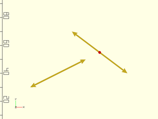
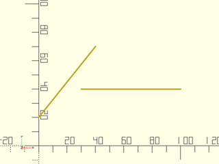

# LibFile: geometry.scad

Perform calculations on lines, polygons, planes and circles, including
normals, intersections of objects, distance between objects, and tangent lines.
Throughout this library, lines can be treated as either unbounded lines, as rays with
a single endpoint or as segments, bounded by endpoints at both ends.

To use, add the following lines to the beginning of your file:

    include <BOSL2/std.scad>

## Table of Contents

1. [Section: Lines, Rays, and Segments](#section-lines-rays-and-segments)
    - [`is_point_on_line()`](#function-is_point_on_line)
    - [`is_collinear()`](#function-is_collinear)
    - [`point_line_distance()`](#function-point_line_distance)
    - [`segment_distance()`](#function-segment_distance)
    - [`line_normal()`](#function-line_normal)
    - [`line_intersection()`](#function-line_intersection)
    - [`line_closest_point()`](#function-line_closest_point)
    - [`line_from_points()`](#function-line_from_points)

2. [Section: Planes](#section-planes)
    - [`is_coplanar()`](#function-is_coplanar)
    - [`plane3pt()`](#function-plane3pt)
    - [`plane3pt_indexed()`](#function-plane3pt_indexed)
    - [`plane_from_normal()`](#function-plane_from_normal)
    - [`plane_from_points()`](#function-plane_from_points)
    - [`plane_from_polygon()`](#function-plane_from_polygon)
    - [`plane_normal()`](#function-plane_normal)
    - [`plane_offset()`](#function-plane_offset)
    - [`plane_line_intersection()`](#function-plane_line_intersection)
    - [`plane_intersection()`](#function-plane_intersection)
    - [`plane_line_angle()`](#function-plane_line_angle)
    - [`plane_closest_point()`](#function-plane_closest_point)
    - [`point_plane_distance()`](#function-point_plane_distance)
    - [`are_points_on_plane()`](#function-are_points_on_plane)

3. [Section: Circle Calculations](#section-circle-calculations)
    - [`circle_line_intersection()`](#function-circle_line_intersection)
    - [`circle_circle_intersection()`](#function-circle_circle_intersection)
    - [`circle_2tangents()`](#functionmodule-circle_2tangents)
    - [`circle_3points()`](#functionmodule-circle_3points)
    - [`circle_point_tangents()`](#function-circle_point_tangents)
    - [`circle_circle_tangents()`](#function-circle_circle_tangents)

4. [Section: Sphere Calculations](#section-sphere-calculations)
    - [`sphere_line_intersection()`](#function-sphere_line_intersection)

5. [Section: Polygons](#section-polygons)
    - [`polygon_area()`](#function-polygon_area)
    - [`centroid()`](#function-centroid)
    - [`polygon_normal()`](#function-polygon_normal)
    - [`point_in_polygon()`](#function-point_in_polygon)
    - [`polygon_line_intersection()`](#function-polygon_line_intersection)
    - [`polygon_triangulate()`](#function-polygon_triangulate)
    - [`is_polygon_clockwise()`](#function-is_polygon_clockwise)
    - [`clockwise_polygon()`](#function-clockwise_polygon)
    - [`ccw_polygon()`](#function-ccw_polygon)
    - [`reverse_polygon()`](#function-reverse_polygon)
    - [`reindex_polygon()`](#function-reindex_polygon)
    - [`align_polygon()`](#function-align_polygon)
    - [`are_polygons_equal()`](#function-are_polygons_equal)

6. [Section: Convex Hull](#section-convex-hull)
    - [`hull()`](#function-hull)
    - [`hull_points()`](#module-hull_points)
    - [`hull2d_path()`](#function-hull2d_path)
    - [`hull3d_faces()`](#function-hull3d_faces)

7. [Section: Convex Sets](#section-convex-sets)
    - [`is_polygon_convex()`](#function-is_polygon_convex)
    - [`convex_distance()`](#function-convex_distance)
    - [`convex_collision()`](#function-convex_collision)

8. [Section: Rotation Decoding](#section-rotation-decoding)
    - [`rot_decode()`](#function-rot_decode)

## Section: Lines, Rays, and Segments

### Function: is\_point\_on\_line()

**Usage:** 

- pt = is\_point\_on\_line(point, line, [bounded], [eps]);

**Topics:** [Geometry](Topics#geometry), [Points](Topics#points), [Segments](Topics#segments)

**Description:** 

Determine if the point is on the line segment, ray or segment defined by the two between two points.
Returns true if yes, and false if not.  If bounded is set to true it specifies a segment, with
both lines bounded at the ends.  Set bounded to `[true,false]` to get a ray.  You can use
the shorthands RAY and SEGMENT to set bounded.

**Arguments:** 

<abbr title="These args can be used by position or by name.">By&nbsp;Position</abbr> | What it does
-------------------- | ------------
`point`              | The point to test.
`line`               | Array of two points defining the line, ray, or segment to test against.
`bounded`            | boolean or list of two booleans defining endpoint conditions for the line. If false treat the line as an unbounded line.  If true treat it as a segment.  If [true,false] treat as a ray, based at the first endpoint.  Default: false
`eps`                | Tolerance in geometric comparisons.  Default: `EPSILON` (1e-9)

---

### Function: is\_collinear()

**Usage:** 

- test = is\_collinear(a, [b, c], [eps]);

**Topics:** [Geometry](Topics#geometry), [Points](Topics#points), [Collinearity](Topics#collinearity)

**Description:** 

Returns true if the points `a`, `b` and `c` are co-linear or if the list of points `a` is collinear.

**Arguments:** 

<abbr title="These args can be used by position or by name.">By&nbsp;Position</abbr> | What it does
-------------------- | ------------
`a`                  | First point or list of points.
`b`                  | Second point or undef; it should be undef if `c` is undef
`c`                  | Third point or undef.
`eps`                | Tolerance in geometric comparisons.  Default: `EPSILON` (1e-9)

---

### Function: point\_line\_distance()

**Usage:** 

- pt = point\_line\_distance(line, pt, bounded);

**Topics:** [Geometry](Topics#geometry), [Points](Topics#points), [Lines](Topics#lines), [Distance](Topics#distance)

**Description:** 

Finds the shortest distance from the point `pt` to the specified line, segment or ray.
The bounded parameter specifies the whether the endpoints give a ray or segment.
By default assumes an unbounded line.

**Arguments:** 

<abbr title="These args can be used by position or by name.">By&nbsp;Position</abbr> | What it does
-------------------- | ------------
`line`               | A list of two points defining a line.
`pt`                 | A point to find the distance of from the line.
`bounded`            | a boolean or list of two booleans specifiying whether each end is bounded.  Default: false

**Example 1:** 

    include <BOSL2/std.scad>
    dist1 = point_line_distance([3,8], [[-10,0], [10,0]]);  // Returns: 8
    dist2 = point_line_distance([3,8], [[-10,0], [10,0]],SEGMENT);  // Returns: 8
    dist3 = point_line_distance([14,3], [[-10,0], [10,0]],SEGMENT);  // Returns: 5

  

---

### Function: segment\_distance()

**Usage:** 

- dist = segment\_distance(seg1, seg2, [eps]);

**Topics:** [Geometry](Topics#geometry), [Segments](Topics#segments), [Distance](Topics#distance)

**Description:** 

Returns the closest distance of the two given line segments.

**Arguments:** 

<abbr title="These args can be used by position or by name.">By&nbsp;Position</abbr> | What it does
-------------------- | ------------
`seg1`               | The list of two points representing the first line segment to check the distance of.
`seg2`               | The list of two points representing the second line segment to check the distance of.
`eps`                | tolerance for point comparisons

**See Also:** [convex\_collision()](#function-convex_collision), [convex\_distance()](#function-convex_distance)

**Example 1:** 

    include <BOSL2/std.scad>
    dist = segment_distance([[-14,3], [-15,9]], [[-10,0], [10,0]]);  // Returns: 5
    dist2 = segment_distance([[-5,5], [5,-5]], [[-10,3], [10,-3]]);  // Returns: 0

  

---

### Function: line\_normal()

**Usage:** 

- vec = line\_normal([P1,P2])
- vec = line\_normal(p1,p2)

**Topics:** [Geometry](Topics#geometry), [Lines](Topics#lines)

**Description:** 

Returns the 2D normal vector to the given 2D line. This is otherwise known as the perpendicular vector counter-clockwise to the given ray.

**Arguments:** 

<abbr title="These args can be used by position or by name.">By&nbsp;Position</abbr> | What it does
-------------------- | ------------
`p1`                 | First point on 2D line.
`p2`                 | Second point on 2D line.

**Example 1:** 

    include <BOSL2/std.scad>
    p1 = [10,10];
    p2 = [50,30];
    n = line_normal(p1,p2);
    stroke([p1,p2], endcap2="arrow2");
    color("green") stroke([p1,p1+10*n], endcap2="arrow2");
    color("blue") move_copies([p1,p2]) circle(d=2, $fn=12);

  

---

### Function: line\_intersection()

**Usage:** 

- pt = line\_intersection(line1, line2, [bounded1], [bounded2], [bounded=], [eps=]);

**Description:** 

Returns the intersection point of any two 2D lines, segments or rays.  Returns undef
if they do not intersect.  You specify a line by giving two distinct points on the
line.  You specify rays or segments by giving a pair of points and indicating
bounded[0]=true to bound the line at the first point, creating rays based at l1[0] and l2[0],
or bounded[1]=true to bound the line at the second point, creating the reverse rays bounded
at l1[1] and l2[1].  If bounded=[true, true] then you have segments defined by their two
endpoints.  By using bounded1 and bounded2 you can mix segments, rays, and lines as needed.
You can set the bounds parameters to true as a shorthand for [true,true] to sepcify segments.

**Arguments:** 

<abbr title="These args can be used by position or by name.">By&nbsp;Position</abbr> | What it does
-------------------- | ------------
`line1`              | List of two points in 2D defining the first line, segment or ray
`line2`              | List of two points in 2D defining the second line, segment or ray
`bounded1`           | boolean or list of two booleans defining which ends are bounded for line1.  Default: [false,false]
`bounded2`           | boolean or list of two booleans defining which ends are bounded for line2.  Default: [false,false]

<abbr title="These args must be used by name, ie: name=value">By&nbsp;Name</abbr> | What it does
-------------------- | ------------
`bounded`            | boolean or list of two booleans defining which ends are bounded for both lines.  The bounded1 and bounded2 parameters override this if both are given.
`eps`                | tolerance for geometric comparisons.  Default: `EPSILON` (1e-9)

**Example 1:** The segments do not intersect but the lines do in this example.

    include <BOSL2/std.scad>
    line1 = 10*[[9, 4], [5, 7]];
    line2 = 10*[[2, 3], [6, 5]];
    stroke(line1, endcaps="arrow2");
    stroke(line2, endcaps="arrow2");
    isect = line_intersection(line1, line2);
    color("red") translate(isect) circle(r=1,$fn=12);

  

**Example 2:** Specifying a ray and segment using the shorthand variables.

    include <BOSL2/std.scad>
    line1 = 10*[[0, 2], [4, 7]];
    line2 = 10*[[10, 4], [3, 4]];
    stroke(line1);
    stroke(line2, endcap2="arrow2");
    isect = line_intersection(line1, line2, SEGMENT, RAY);
    color("red") translate(isect) circle(r=1,$fn=12);

  

**Example 3:** Here we use the same example as above, but specify two segments using the bounded argument.

 

    include <BOSL2/std.scad>
    line1 = 10*[[0, 2], [4, 7]];
    line2 = 10*[[10, 4], [3, 4]];
    stroke(line1);
    stroke(line2);
    isect = line_intersection(line1, line2, bounded=true);  // Returns undef

---

### Function: line\_closest\_point()

**Usage:** 

- pt = line\_closest\_point(line, pt, [bounded]);

**Topics:** [Geometry](Topics#geometry), [Lines](Topics#lines), [Distance](Topics#distance)

**Description:** 

Returns the point on the given line, segment or ray that is closest to the given point `pt`.
The inputs `line` and `pt` args should be of the same dimension.  The parameter bounded indicates
whether the points of `line` should be treated as endpoints.

**Arguments:** 

<abbr title="These args can be used by position or by name.">By&nbsp;Position</abbr> | What it does
-------------------- | ------------
`line`               | A list of two points that are on the unbounded line.
`pt`                 | The point to find the closest point on the line to.
`bounded`            | boolean or list of two booleans indicating that the line is bounded at that end.  Default: [false,false]

**Example 1:** 

    include <BOSL2/std.scad>
    line = [[-30,0],[30,30]];
    pt = [-32,-10];
    p2 = line_closest_point(line,pt);
    stroke(line, endcaps="arrow2");
    color("blue") translate(pt) circle(r=1,$fn=12);
    color("red") translate(p2) circle(r=1,$fn=12);

  

**Example 2:** If the line is bounded on the left you get the endpoint instead

    include <BOSL2/std.scad>
    line = [[-30,0],[30,30]];
    pt = [-32,-10];
    p2 = line_closest_point(line,pt,bounded=[true,false]);
    stroke(line, endcap2="arrow2");
    color("blue") translate(pt) circle(r=1,$fn=12);
    color("red") translate(p2) circle(r=1,$fn=12);

  

**Example 3:** In this case it doesn't matter how bounded is set.  Using SEGMENT is the most restrictive option.

    include <BOSL2/std.scad>
    line = [[-30,0],[30,30]];
    pt = [-5,0];
    p2 = line_closest_point(line,pt,SEGMENT);
    stroke(line);
    color("blue") translate(pt) circle(r=1,$fn=12);
    color("red") translate(p2) circle(r=1,$fn=12);

  

**Example 4:** The result here is the same for a line or a ray.

    include <BOSL2/std.scad>
    line = [[-30,0],[30,30]];
    pt = [40,25];
    p2 = line_closest_point(line,pt,RAY);
    stroke(line, endcap2="arrow2");
    color("blue") translate(pt) circle(r=1,$fn=12);
    color("red") translate(p2) circle(r=1,$fn=12);

  

**Example 5:** But with a segment we get a different result

    include <BOSL2/std.scad>
    line = [[-30,0],[30,30]];
    pt = [40,25];
    p2 = line_closest_point(line,pt,SEGMENT);
    stroke(line);
    color("blue") translate(pt) circle(r=1,$fn=12);
    color("red") translate(p2) circle(r=1,$fn=12);

  

**Example 6:** The shorthand RAY uses the first point as the base of the ray.  But you can specify a reversed ray directly, and in this case the result is the same as the result above for the segment.

    include <BOSL2/std.scad>
    line = [[-30,0],[30,30]];
    pt = [40,25];
    p2 = line_closest_point(line,pt,[false,true]);
    stroke(line,endcap1="arrow2");
    color("blue") translate(pt) circle(r=1,$fn=12);
    color("red") translate(p2) circle(r=1,$fn=12);

  

**Example 7:** A 3D example

    include <BOSL2/std.scad>
    line = [[-30,-15,0],[30,15,30]];
    pt = [5,5,5];
    p2 = line_closest_point(line,pt);
    stroke(line, endcaps="arrow2");
    color("blue") translate(pt) sphere(r=1,$fn=12);
    color("red") translate(p2) sphere(r=1,$fn=12);

  

---

### Function: line\_from\_points()

**Usage:** 

- line = line\_from\_points(points, [fast], [eps]);

**Topics:** [Geometry](Topics#geometry), [Lines](Topics#lines), [Points](Topics#points)

**Description:** 

Given a list of 2 or more collinear points, returns a line containing them.
If `fast` is false and the points are coincident or non-collinear, then `undef` is returned.
if `fast` is true, then the collinearity test is skipped and a line passing through 2 distinct arbitrary points is returned.

**Arguments:** 

<abbr title="These args can be used by position or by name.">By&nbsp;Position</abbr> | What it does
-------------------- | ------------
`points`             | The list of points to find the line through.
`fast`               | If true, don't verify that all points are collinear.  Default: false
`eps`                | How much variance is allowed in testing each point against the line.  Default: `EPSILON` (1e-9)

---

## Section: Planes

### Function: is\_coplanar()

**Usage:** 

- test = is\_coplanar(points,[eps]);

**Topics:** [Geometry](Topics#geometry), [Coplanarity](Topics#coplanarity)

**Description:** 

Returns true if the given 3D points are non-collinear and are on a plane.

**Arguments:** 

<abbr title="These args can be used by position or by name.">By&nbsp;Position</abbr> | What it does
-------------------- | ------------
`points`             | The points to test.
`eps`                | Tolerance in geometric comparisons.  Default: `EPSILON` (1e-9)

---

### Function: plane3pt()

**Usage:** 

- plane = plane3pt(p1, p2, p3);

**Topics:** [Geometry](Topics#geometry), [Planes](Topics#planes)

**Description:** 

Generates the normalized cartesian equation of a plane from three 3d points.
Returns [A,B,C,D] where Ax + By + Cz = D is the equation of a plane.
Returns undef, if the points are collinear.

**Arguments:** 

<abbr title="These args can be used by position or by name.">By&nbsp;Position</abbr> | What it does
-------------------- | ------------
`p1`                 | The first point on the plane.
`p2`                 | The second point on the plane.
`p3`                 | The third point on the plane.

---

### Function: plane3pt\_indexed()

**Usage:** 

- plane = plane3pt\_indexed(points, i1, i2, i3);

**Topics:** [Geometry](Topics#geometry), [Planes](Topics#planes)

**Description:** 

Given a list of 3d points, and the indices of three of those points,
generates the normalized cartesian equation of a plane that those points all
lie on. If the points are not collinear, returns [A,B,C,D] where Ax+By+Cz=D is the equation of a plane.
If they are collinear, returns [].

**Arguments:** 

<abbr title="These args can be used by position or by name.">By&nbsp;Position</abbr> | What it does
-------------------- | ------------
`points`             | A list of points.
`i1`                 | The index into `points` of the first point on the plane.
`i2`                 | The index into `points` of the second point on the plane.
`i3`                 | The index into `points` of the third point on the plane.

---

### Function: plane\_from\_normal()

**Usage:** 

- plane = plane\_from\_normal(normal, [pt])

**Topics:** [Geometry](Topics#geometry), [Planes](Topics#planes)

**Description:** 

Returns a plane defined by a normal vector and a point.  If you omit `pt` you will get a plane
passing through the origin.

**Arguments:** 

<abbr title="These args can be used by position or by name.">By&nbsp;Position</abbr> | What it does
-------------------- | ------------
`normal`             | Normal vector to the plane to find.
`pt`                 | Point 3D on the plane to find.

**Example 1:** 

    include <BOSL2/std.scad>
    plane_from_normal([0,0,1], [2,2,2]);  // Returns the xy plane passing through the point (2,2,2)

  

---

### Function: plane\_from\_points()

**Usage:** 

- plane = plane\_from\_points(points, [fast], [eps]);

**Topics:** [Geometry](Topics#geometry), [Planes](Topics#planes), [Points](Topics#points)

**Description:** 

Given a list of 3 or more coplanar 3D points, returns the coefficients of the normalized cartesian equation of a plane,
that is [A,B,C,D] where Ax+By+Cz=D is the equation of the plane and norm([A,B,C])=1.
If `fast` is false and the points in the list are collinear or not coplanar, then `undef` is returned.
If `fast` is true, the polygon coplanarity check is skipped and a best fitting plane is returned.
It differs from `plane_from_polygon` as the plane normal is independent of the point order. It is faster, though.

**Arguments:** 

<abbr title="These args can be used by position or by name.">By&nbsp;Position</abbr> | What it does
-------------------- | ------------
`points`             | The list of points to find the plane of.
`fast`               | If true, don't verify the point coplanarity.  Default: false
`eps`                | Tolerance in geometric comparisons.  Default: `EPSILON` (1e-9)

**See Also:** [plane\_from\_polygon()](#function-plane_from_polygon)

**Example 1:** 

 

    include <BOSL2/std.scad>
    points = rot(45, v=[-0.3,1,0], p=path3d(random_points(25,2,scale=55,seed=47), 70));
    plane = plane_from_points(points);
    #move_copies(points)sphere(d=3);
    cp = mean(points);
    move(cp) rot(from=UP,to=plane_normal(plane)) anchor_arrow(50);

---

### Function: plane\_from\_polygon()

**Usage:** 

- plane = plane\_from\_polygon(points, [fast], [eps]);

**Topics:** [Geometry](Topics#geometry), [Planes](Topics#planes), [Polygons](Topics#polygons)

**Description:** 

Given a 3D planar polygon, returns the normalized cartesian equation of its plane.
Returns [A,B,C,D] where Ax+By+Cz=D is the equation of the plane where norm([A,B,C])=1.
If not all the points in the polygon are coplanar, then [] is returned.
If `fast` is false and the points in the list are collinear or not coplanar, then `undef` is returned.
if `fast` is true, then the coplanarity test is skipped and a plane passing through 3 non-collinear arbitrary points is returned.

**Arguments:** 

<abbr title="These args can be used by position or by name.">By&nbsp;Position</abbr> | What it does
-------------------- | ------------
`poly`               | The planar 3D polygon to find the plane of.
`fast`               | If true, doesn't verify that all points in the polygon are coplanar.  Default: false
`eps`                | Tolerance in geometric comparisons.  Default: `EPSILON` (1e-9)

**See Also:** [plane\_from\_points()](#function-plane_from_points)

**Example 1:** 

 

    include <BOSL2/std.scad>
    xyzpath = rot(45, v=[0,1,0], p=path3d(star(n=5,step=2,d=100), 70));
    plane = plane_from_polygon(xyzpath);
    #stroke(xyzpath,closed=true,width=3);
    cp = centroid(xyzpath);
    move(cp) rot(from=UP,to=plane_normal(plane)) anchor_arrow(45);

---

### Function: plane\_normal()

**Usage:** 

- vec = plane\_normal(plane);

**Topics:** [Geometry](Topics#geometry), [Planes](Topics#planes)

**Description:** 

Returns the unit length normal vector for the given plane.

**Arguments:** 

<abbr title="These args can be used by position or by name.">By&nbsp;Position</abbr> | What it does
-------------------- | ------------
`plane`              | The `[A,B,C,D]` plane definition where `Ax+By+Cz=D` is the formula of the plane.

---

### Function: plane\_offset()

**Usage:** 

- d = plane\_offset(plane);

**Topics:** [Geometry](Topics#geometry), [Planes](Topics#planes)

**Description:** 

Returns coeficient D of the normalized plane equation `Ax+By+Cz=D`, or the scalar offset of the plane from the origin.
This value may be negative.
The absolute value of this coefficient is the distance of the plane from the origin.

**Arguments:** 

<abbr title="These args can be used by position or by name.">By&nbsp;Position</abbr> | What it does
-------------------- | ------------
`plane`              | The `[A,B,C,D]` plane definition where `Ax+By+Cz=D` is the formula of the plane.

---

### Function: plane\_line\_intersection()

**Usage:** 

- pt = plane\_line\_intersection(plane, line, [bounded], [eps]);

**Topics:** [Geometry](Topics#geometry), [Planes](Topics#planes), [Lines](Topics#lines), [Intersection](Topics#intersection)

**Description:** 

Takes a line, and a plane [A,B,C,D] where the equation of that plane is `Ax+By+Cz=D`.
If `line` intersects `plane` at one point, then that intersection point is returned.
If `line` lies on `plane`, then the original given `line` is returned.
If `line` is parallel to, but not on `plane`, then undef is returned.

**Arguments:** 

<abbr title="These args can be used by position or by name.">By&nbsp;Position</abbr> | What it does
-------------------- | ------------
`plane`              | The [A,B,C,D] values for the equation of the plane.
`line`               | A list of two distinct 3D points that are on the line.
`bounded`            | If false, the line is considered unbounded.  If true, it is treated as a bounded line segment.  If given as `[true, false]` or `[false, true]`, the boundedness of the points are specified individually, allowing the line to be treated as a half-bounded ray.  Default: false (unbounded)
`eps`                | Tolerance in geometric comparisons.  Default: `EPSILON` (1e-9)

---

### Function: plane\_intersection()

**Usage:** 

- line = plane\_intersection(plane1, plane2)
- pt = plane\_intersection(plane1, plane2, plane3)

**Topics:** [Geometry](Topics#geometry), [Planes](Topics#planes), [Intersection](Topics#intersection)

**Description:** 

Compute the point which is the intersection of the three planes, or the line intersection of two planes.
If you give three planes the intersection is returned as a point.  If you give two planes the intersection
is returned as a list of two points on the line of intersection.  If any two input planes are parallel
or coincident then returns undef.

**Arguments:** 

<abbr title="These args can be used by position or by name.">By&nbsp;Position</abbr> | What it does
-------------------- | ------------
`plane1`             | The [A,B,C,D] coefficients for the first plane equation `Ax+By+Cz=D`.
`plane2`             | The [A,B,C,D] coefficients for the second plane equation `Ax+By+Cz=D`.
`plane3`             | The [A,B,C,D] coefficients for the third plane equation `Ax+By+Cz=D`.

---

### Function: plane\_line\_angle()

**Usage:** 

- angle = plane\_line\_angle(plane,line);

**Topics:** [Geometry](Topics#geometry), [Planes](Topics#planes), [Lines](Topics#lines), [Angle](Topics#angle)

**Description:** 

Compute the angle between a plane [A, B, C, D] and a 3d line, specified as a pair of 3d points [p1,p2].
The resulting angle is signed, with the sign positive if the vector p2-p1 lies above the plane, on
the same side of the plane as the plane's normal vector.

---

### Function: plane\_closest\_point()

**Usage:** 

- pts = plane\_closest\_point(plane, points);

**Topics:** [Geometry](Topics#geometry), [Planes](Topics#planes), [Projection](Topics#projection)

**Description:** 

Given a plane definition `[A,B,C,D]`, where `Ax+By+Cz=D`, and a list of 2d or
3d points, return the closest 3D orthogonal projection of the points on the plane.
In other words, for every point given, returns the closest point to it on the plane.

**Arguments:** 

<abbr title="These args can be used by position or by name.">By&nbsp;Position</abbr> | What it does
-------------------- | ------------
`plane`              | The `[A,B,C,D]` plane definition where `Ax+By+Cz=D` is the formula of the plane.
`points`             | List of points to project

**Example 1:** 

 

    include <BOSL2/std.scad>
    points = move([10,20,30], p=yrot(25, p=path3d(circle(d=100, $fn=36))));
    plane = plane_from_normal([1,0,1]);
    proj = plane_closest_point(plane,points);
    color("red") move_copies(points) sphere(d=4,$fn=12);
    color("blue") move_copies(proj) sphere(d=4,$fn=12);
    move(centroid(proj)) {
        rot(from=UP,to=plane_normal(plane)) {
            anchor_arrow(50);
            %cube([120,150,0.1],center=true);
        }
    }

---

### Function: point\_plane\_distance()

**Usage:** 

- dist = point\_plane\_distance(plane, point)

**Topics:** [Geometry](Topics#geometry), [Planes](Topics#planes), [Distance](Topics#distance)

**Description:** 

Given a plane as [A,B,C,D] where the cartesian equation for that plane
is Ax+By+Cz=D, determines how far from that plane the given point is.
The returned distance will be positive if the point is above the
plane, meaning on the side where the plane normal points.
If the point is below the plane, then the distance returned
will be negative.  The normal of the plane is [A,B,C].

**Arguments:** 

<abbr title="These args can be used by position or by name.">By&nbsp;Position</abbr> | What it does
-------------------- | ------------
`plane`              | The `[A,B,C,D]` plane definition where `Ax+By+Cz=D` is the formula of the plane.
`point`              | The distance evaluation point.

---

### Function: are\_points\_on\_plane()

**Usage:** 

- test = are\_points\_on\_plane(points, plane, [eps]);

**Topics:** [Geometry](Topics#geometry), [Planes](Topics#planes), [Points](Topics#points)

**Description:** 

Returns true if the given 3D points are on the given plane.

**Arguments:** 

<abbr title="These args can be used by position or by name.">By&nbsp;Position</abbr> | What it does
-------------------- | ------------
`plane`              | The plane to test the points on.
`points`             | The list of 3D points to test.
`eps`                | Tolerance in geometric comparisons.  Default: `EPSILON` (1e-9)

---

## Section: Circle Calculations

### Function: circle\_line\_intersection()

**Usage:** 

- isect = circle\_line\_intersection(c,&lt;r|d&gt;,[line],[bounded],[eps]);

**Topics:** [Geometry](Topics#geometry), [Circles](Topics#circles), [Lines](Topics#lines), [Intersection](Topics#intersection)

**Description:** 

Find intersection points between a 2d circle and a line, ray or segment specified by two points.
By default the line is unbounded.

**Arguments:** 

<abbr title="These args can be used by position or by name.">By&nbsp;Position</abbr> | What it does
-------------------- | ------------
`c`                  | center of circle
`r`                  | radius of circle
`line`               | two points defining the line
`bounded`            | false for unbounded line, true for a segment, or a vector [false,true] or [true,false] to specify a ray with the first or second end unbounded.  Default: false

<abbr title="These args must be used by name, ie: name=value">By&nbsp;Name</abbr> | What it does
-------------------- | ------------
`d`                  | diameter of circle
`eps`                | epsilon used for identifying the case with one solution.  Default: 1e-9

---

### Function: circle\_circle\_intersection()

**Usage:** 

- pts = circle\_circle\_tangents(c1, r1|d1, c2, r2|d2, [eps]);

**Topics:** [Geometry](Topics#geometry), [Circles](Topics#circles)

**Description:** 

Compute the intersection points of two circles.  Returns a list of the intersection points, which
will contain two points in the general case, one point for tangent circles, or will be empty
if the circles do not intersect.

**Arguments:** 

<abbr title="These args can be used by position or by name.">By&nbsp;Position</abbr> | What it does
-------------------- | ------------
`c1`                 | Center of the first circle.
`r1`                 | Radius of the first circle.
`c2`                 | Center of the second circle.
`r2`                 | Radius of the second circle.
`eps`                | Tolerance for detecting tangent circles.  Default: EPSILON

<abbr title="These args must be used by name, ie: name=value">By&nbsp;Name</abbr> | What it does
-------------------- | ------------
`d1`                 | Diameter of the first circle.
`d2`                 | Diameter of the second circle.

**Example 1:** Circles intersect in two points.

    include <BOSL2/std.scad>
    $fn=32;
    c1 = [4,4];  r1 = 3;
    c2 = [7,7]; r2 = 2;
    pts = circle_circle_intersection(c1,r1,c2,r2);
    move(c1) stroke(circle(r=r1), width=0.2, closed=true);
    move(c2) stroke(circle(r=r2), width=0.2, closed=true);
    color("red")move_copies(pts) circle(r=.3);

  

**Example 2:** Circles are tangent, so one intersection point:

    include <BOSL2/std.scad>
    $fn=32;
    c1 = [4,4];  r1 = 4;
    c2 = [4,10]; r2 = 2;
    pts = circle_circle_intersection(c1,r1,c2,r2);
    move(c1) stroke(circle(r=r1), width=0.2, closed=true);
    move(c2) stroke(circle(r=r2), width=0.2, closed=true);
    color("red")move_copies(pts) circle(r=.3);

  

**Example 3:** Another tangent example:

    include <BOSL2/std.scad>
    $fn=32;
    c1 = [4,4];  r1 = 4;
    c2 = [5,5];  r2 = 4-sqrt(2);
    pts = circle_circle_intersection(c1,r1,c2,r2);
    move(c1) stroke(circle(r=r1), width=0.2, closed=true);
    move(c2) stroke(circle(r=r2), width=0.2, closed=true);
    color("red")move_copies(pts) circle(r=.3);

  

**Example 4:** Circles do not intersect.  Returns empty list.

    include <BOSL2/std.scad>
    $fn=32;
    c1 = [3,4];  r1 = 2;
    c2 = [7,10]; r2 = 3;
    pts = circle_circle_intersection(c1,r1,c2,r2);
    move(c1) stroke(circle(r=r1), width=0.2, closed=true);
    move(c2) stroke(circle(r=r2), width=0.2, closed=true);
    color("red")move_copies(pts) circle(r=.2);     // pts is []

  

---

### Function/Module: circle\_2tangents()

**Usage:** As Function

- circ = circle\_2tangents(pt1, pt2, pt3, r|d, [tangents]);

**Topics:** [Geometry](Topics#geometry), [Circles](Topics#circles), [Tangents](Topics#tangents)

**Usage:** As Module

- circle\_2tangents(pt1, pt2, pt3, r|d, [h], [center]);

**Description:** 

Given a pair of rays with a common origin, and a known circle radius/diameter, finds
the centerpoint for the circle of that size that touches both rays tangentally.
Both rays start at `pt2`, one passing through `pt1`, and the other through `pt3`.

When called as a module with an `h` height argument, creates a 3D cylinder of `h`
length at the found centerpoint, aligned with the found normal.

When called as a module with 2D data and no `h` argument, creates a 2D circle of
the given radius/diameter, tangentially touching both rays.

When called as a function with collinear rays, returns `undef`.
Otherwise, when called as a function with `tangents=false`, returns `[CP,NORMAL]`.
Otherwise, when called as a function with `tangents=true`, returns `[CP,NORMAL,TANPT1,TANPT2,ANG1,ANG2]`.
- CP is the centerpoint of the circle.
- NORMAL is the normal vector of the plane that the circle is on (UP or DOWN if the points are 2D).
- TANPT1 is the point where the circle is tangent to the ray `[pt2,pt1]`.
- TANPT2 is the point where the circle is tangent to the ray `[pt2,pt3]`.
- ANG1 is the angle from the ray `[CP,pt2]` to the ray `[CP,TANPT1]`
- ANG2 is the angle from the ray `[CP,pt2]` to the ray `[CP,TANPT2]`

**Arguments:** 

<abbr title="These args can be used by position or by name.">By&nbsp;Position</abbr> | What it does
-------------------- | ------------
`pt1`                | A point that the first ray passes though.
`pt2`                | The starting point of both rays.
`pt3`                | A point that the second ray passes though.
`r`                  | The radius of the circle to find.
`d`                  | The diameter of the circle to find.
`h`                  | Height of the cylinder to create, when called as a module.
`center`             | When called as a module, center the cylinder if true,  Default: false
`tangents`           | If true, extended information about the tangent points is calculated and returned.  Default: false

**Example 1:** 

 

    include <BOSL2/std.scad>
    pts = [[60,40], [10,10], [65,5]];
    rad = 10;
    stroke([pts[1],pts[0]], endcap2="arrow2");
    stroke([pts[1],pts[2]], endcap2="arrow2");
    circ = circle_2tangents(pt1=pts[0], pt2=pts[1], pt3=pts[2], r=rad);
    translate(circ[0]) {
        color("green") {
            stroke(circle(r=rad),closed=true);
            stroke([[0,0],rad*[cos(315),sin(315)]]);
        }
    }
    move_copies(pts) color("blue") circle(d=2, $fn=12);
    translate(circ[0]) color("red") circle(d=2, $fn=12);
    labels = [[pts[0], "pt1"], [pts[1],"pt2"], [pts[2],"pt3"], [circ[0], "CP"], [circ[0]+[cos(315),sin(315)]*rad*0.7, "r"]];
    for(l=labels) translate(l[0]+[0,2]) color("black") text(text=l[1], size=2.5, halign="center");

**Example 2:** 

    include <BOSL2/std.scad>
    pts = [[-5,25], [5,-25], [45,15]];
    rad = 12;
    color("blue") stroke(pts, width=0.75, endcaps="arrow2");
    circle_2tangents(pt1=pts[0], pt2=pts[1], pt3=pts[2], r=rad);

  

**Example 3:** Non-centered Cylinder

 

    include <BOSL2/std.scad>
    pts = [[45,15,10], [5,-25,5], [-5,25,20]];
    rad = 12;
    color("blue") stroke(pts, width=0.75, endcaps="arrow2");
    circle_2tangents(pt1=pts[0], pt2=pts[1], pt3=pts[2], r=rad, h=10, center=false);

**Example 4:** Non-centered Cylinder

 

    include <BOSL2/std.scad>
    pts = [[45,15,10], [5,-25,5], [-5,25,20]];
    rad = 12;
    color("blue") stroke(pts, width=0.75, endcaps="arrow2");
    circle_2tangents(pt1=pts[0], pt2=pts[1], pt3=pts[2], r=rad, h=10, center=true);

---

### Function/Module: circle\_3points()

**Usage:** As Function

- circ = circle\_3points(pt1, pt2, pt3);
- circ = circle\_3points([pt1, pt2, pt3]);

**Topics:** [Geometry](Topics#geometry), [Circles](Topics#circles)

**Usage:** As Module

- circle\_3points(pt1, pt2, pt3, [h], [center]);
- circle\_3points([pt1, pt2, pt3], [h], [center]);

**Description:** 

Returns the [CENTERPOINT, RADIUS, NORMAL] of the circle that passes through three non-collinear
points where NORMAL is the normal vector of the plane that the circle is on (UP or DOWN if the points are 2D).
The centerpoint will be a 2D or 3D vector, depending on the points input.  If all three
points are 2D, then the resulting centerpoint will be 2D, and the normal will be UP ([0,0,1]).
If any of the points are 3D, then the resulting centerpoint will be 3D.  If the three points are
collinear, then `[undef,undef,undef]` will be returned.  The normal will be a normalized 3D
vector with a non-negative Z axis.
Instead of 3 arguments, it is acceptable to input the 3 points in a list `pt1`, leaving `pt2`and `pt3` as undef.

**Arguments:** 

<abbr title="These args can be used by position or by name.">By&nbsp;Position</abbr> | What it does
-------------------- | ------------
`pt1`                | The first point.
`pt2`                | The second point.
`pt3`                | The third point.
`h`                  | Height of the cylinder to create, when called as a module.
`center`             | When called as a module, center the cylinder if true,  Default: false

**Example 1:** 

 

    include <BOSL2/std.scad>
    pts = [[60,40], [10,10], [65,5]];
    circ = circle_3points(pts[0], pts[1], pts[2]);
    translate(circ[0]) color("green") stroke(circle(r=circ[1]),closed=true,$fn=72);
    translate(circ[0]) color("red") circle(d=3, $fn=12);
    move_copies(pts) color("blue") circle(d=3, $fn=12);

**Example 2:** 

    include <BOSL2/std.scad>
    pts = [[30,40], [10,20], [55,30]];
    circle_3points(pts[0], pts[1], pts[2]);
    move_copies(pts) color("blue") circle(d=3, $fn=12);

  

**Example 3:** Non-Centered Cylinder

    include <BOSL2/std.scad>
    pts = [[30,15,30], [10,20,15], [55,25,25]];
    circle_3points(pts[0], pts[1], pts[2], h=10, center=false);
    move_copies(pts) color("cyan") sphere(d=3, $fn=12);

  

**Example 4:** Centered Cylinder

    include <BOSL2/std.scad>
    pts = [[30,15,30], [10,20,15], [55,25,25]];
    circle_3points(pts[0], pts[1], pts[2], h=10, center=true);
    move_copies(pts) color("cyan") sphere(d=3, $fn=12);

  

---

### Function: circle\_point\_tangents()

**Usage:** 

- tangents = circle\_point\_tangents(r|d, cp, pt);

**Topics:** [Geometry](Topics#geometry), [Circles](Topics#circles), [Tangents](Topics#tangents)

**Description:** 

Given a 2d circle and a 2d point outside that circle, finds the 2d tangent point(s) on the circle for a
line passing through the point.  Returns a list of zero or more 2D tangent points.

**Arguments:** 

<abbr title="These args can be used by position or by name.">By&nbsp;Position</abbr> | What it does
-------------------- | ------------
`r`                  | Radius of the circle.
`d`                  | Diameter of the circle.
`cp`                 | The coordinates of the 2d circle centerpoint.
`pt`                 | The coordinates of the 2d external point.

**Example 1:** 

 

    include <BOSL2/std.scad>
    cp = [-10,-10];  r = 30;  pt = [30,10];
    tanpts = circle_point_tangents(r=r, cp=cp, pt=pt);
    color("yellow") translate(cp) circle(r=r);
    color("cyan") for(tp=tanpts) {stroke([tp,pt]); stroke([tp,cp]);}
    color("red") move_copies(tanpts) circle(d=3,$fn=12);
    color("blue") move_copies([cp,pt]) circle(d=3,$fn=12);

---

### Function: circle\_circle\_tangents()

**Usage:** 

- segs = circle\_circle\_tangents(c1, r1|d1, c2, r2|d2);

**Topics:** [Geometry](Topics#geometry), [Circles](Topics#circles), [Tangents](Topics#tangents)

**Description:** 

Computes 2d lines tangents to a pair of circles in 2d.  Returns a list of line endpoints [p1,p2] where
p2 is the tangent point on circle 1 and p2 is the tangent point on circle 2.
If four tangents exist then the first one the left hand exterior tangent as regarded looking from
circle 1 toward circle 2.  The second value is the right hand exterior tangent.  The third entry
gives the interior tangent that starts on the left of circle 1 and crosses to the right side of
circle 2.  And the fourth entry is the last interior tangent that starts on the right side of
circle 1.  If the circles intersect then the interior tangents don't exist and the function
returns only two entries.  If one circle is inside the other one then no tangents exist
so the function returns the empty set.  When the circles are tangent a degenerate tangent line
passes through the point of tangency of the two circles:  this degenerate line is NOT returned.

**Arguments:** 

<abbr title="These args can be used by position or by name.">By&nbsp;Position</abbr> | What it does
-------------------- | ------------
`c1`                 | Center of the first circle.
`r1`                 | Radius of the first circle.
`c2`                 | Center of the second circle.
`r2`                 | Radius of the second circle.

<abbr title="These args must be used by name, ie: name=value">By&nbsp;Name</abbr> | What it does
-------------------- | ------------
`d1`                 | Diameter of the first circle.
`d2`                 | Diameter of the second circle.

**Example 1:** Four tangents, first in green, second in black, third in blue, last in red.

 

    include <BOSL2/std.scad>
    $fn=32;
    c1 = [3,4];  r1 = 2;
    c2 = [7,10]; r2 = 3;
    pts = circle_circle_tangents(c1,r1,c2,r2);
    move(c1) stroke(circle(r=r1), width=0.2, closed=true);
    move(c2) stroke(circle(r=r2), width=0.2, closed=true);
    colors = ["green","black","blue","red"];
    for(i=[0:len(pts)-1]) color(colors[i]) stroke(pts[i],width=0.2);

**Example 2:** Circles overlap so only exterior tangents exist.

 

    include <BOSL2/std.scad>
    $fn=32;
    c1 = [4,4];  r1 = 3;
    c2 = [7,7]; r2 = 2;
    pts = circle_circle_tangents(c1,r1,c2,r2);
    move(c1) stroke(circle(r=r1), width=0.2, closed=true);
    move(c2) stroke(circle(r=r2), width=0.2, closed=true);
    colors = ["green","black","blue","red"];
    for(i=[0:len(pts)-1]) color(colors[i]) stroke(pts[i],width=0.2);

**Example 3:** Circles are tangent.  Only exterior tangents are returned.  The degenerate internal tangent is not returned.

 

    include <BOSL2/std.scad>
    $fn=32;
    c1 = [4,4];  r1 = 4;
    c2 = [4,10]; r2 = 2;
    pts = circle_circle_tangents(c1,r1,c2,r2);
    move(c1) stroke(circle(r=r1), width=0.2, closed=true);
    move(c2) stroke(circle(r=r2), width=0.2, closed=true);
    colors = ["green","black","blue","red"];
    for(i=[0:1:len(pts)-1]) color(colors[i]) stroke(pts[i],width=0.2);

**Example 4:** One circle is inside the other: no tangents exist.  If the interior circle is tangent the single degenerate tangent will not be returned.

    include <BOSL2/std.scad>
    $fn=32;
    c1 = [4,4];  r1 = 4;
    c2 = [5,5];  r2 = 2;
    pts = circle_circle_tangents(c1,r1,c2,r2);
    move(c1) stroke(circle(r=r1), width=0.2, closed=true);
    move(c2) stroke(circle(r=r2), width=0.2, closed=true);
    echo(pts);   // Returns []

  

---

## Section: Sphere Calculations

### Function: sphere\_line\_intersection()

**Usage:** 

- isect = sphere\_line\_intersection(c,&lt;r|d&gt;,[line],[bounded],[eps]);

**Topics:** [Geometry](Topics#geometry), [Spheres](Topics#spheres), [Lines](Topics#lines), [Intersection](Topics#intersection)

**Description:** 

Find intersection points between a sphere and a line, ray or segment specified by two points.
By default the line is unbounded.

**Arguments:** 

<abbr title="These args can be used by position or by name.">By&nbsp;Position</abbr> | What it does
-------------------- | ------------
`c`                  | center of sphere
`r`                  | radius of sphere
`line`               | two points defining the line
`bounded`            | false for unbounded line, true for a segment, or a vector [false,true] or [true,false] to specify a ray with the first or second end unbounded.  Default: false

<abbr title="These args must be used by name, ie: name=value">By&nbsp;Name</abbr> | What it does
-------------------- | ------------
`d`                  | diameter of sphere
`eps`                | epsilon used for identifying the case with one solution.  Default: 1e-9

---

## Section: Polygons

### Function: polygon\_area()

**Usage:** 

- area = polygon\_area(poly);

**Topics:** [Geometry](Topics#geometry), [Polygons](Topics#polygons), [Area](Topics#area)

**Description:** 

Given a 2D or 3D simple planar polygon, returns the area of that polygon.
If the polygon is non-planar the result is `undef.`  If the polygon is self-intersecting
then the return will be a meaningless number.
When `signed` is true and the polygon is 2d, a signed area is returned: a positive area indicates a counter-clockwise polygon.
The area of 3d polygons is always nonnegative.

**Arguments:** 

<abbr title="These args can be used by position or by name.">By&nbsp;Position</abbr> | What it does
-------------------- | ------------
`poly`               | Polygon to compute the area of.
`signed`             | If true, a signed area is returned. Default: false.

---

### Function: centroid()

**Usage:** 

- c = centroid(object, [eps]);

**Topics:** [Geometry](Topics#geometry), [Polygons](Topics#polygons), [Centroid](Topics#centroid)

**Description:** 

Given a simple 2D polygon, returns the 2D coordinates of the polygon's centroid.
Given a simple 3D planar polygon, returns the 3D coordinates of the polygon's centroid.
If you provide a non-planar or collinear polygon you will get an error.  For self-intersecting
polygons you may get an error or you may get meaningless results.

If object is a manifold VNF then returns the 3d centroid of the polyhedron.  The VNF must
describe a valid polyhedron with consistent face direction and no holes in the mesh; otherwise
the results are undefined.

**Arguments:** 

<abbr title="These args can be used by position or by name.">By&nbsp;Position</abbr> | What it does
-------------------- | ------------
`object`             | object to compute the centroid of
`eps`                | epsilon value for identifying degenerate cases

---

### Function: polygon\_normal()

**Usage:** 

- vec = polygon\_normal(poly);

**Topics:** [Geometry](Topics#geometry), [Polygons](Topics#polygons)

**Description:** 

Given a 3D simple planar polygon, returns a unit normal vector for the polygon.  The vector
is oriented so that if the normal points towards the viewer, the polygon winds in the clockwise
direction.  If the polygon has zero area, returns `undef`.  If the polygon is self-intersecting
the the result is undefined.  It doesn't check for coplanarity.

**Arguments:** 

<abbr title="These args can be used by position or by name.">By&nbsp;Position</abbr> | What it does
-------------------- | ------------
`poly`               | The list of 3D path points for the perimeter of the polygon.

---

### Function: point\_in\_polygon()

**Usage:** 

- test = point\_in\_polygon(point, poly, [nonzero], [eps])

**Topics:** [Geometry](Topics#geometry), [Polygons](Topics#polygons)

**Description:** 

This function tests whether the given 2D point is inside, outside or on the boundary of
the specified 2D polygon.
The polygon is given as a list of 2D points, not including the repeated end point.
Returns -1 if the point is outside the polygon.
Returns 0 if the point is on the boundary.
Returns 1 if the point lies in the interior.
The polygon does not need to be simple: it may have self-intersections.
But the polygon cannot have holes (it must be simply connected).
Rounding errors may give mixed results for points on or near the boundary.

When polygons intersect themselves different definitions exist for determining which points
are inside the polygon.  The figure below shows the difference.
OpenSCAD uses the Even-Odd rule when creating polygons, where membership in overlapping regions
depends on how many times they overlap.  The Nonzero rule considers point inside the polygon if
the polygon overlaps them any number of times.  For more information see
https://en.wikipedia.org/wiki/Nonzero-rule and https://en.wikipedia.org/wiki/Evenodd_rule.

**Figure 1:** 

 

**Arguments:** 

<abbr title="These args can be used by position or by name.">By&nbsp;Position</abbr> | What it does
-------------------- | ------------
`point`              | The 2D point to check
`poly`               | The list of 2D points forming the perimeter of the polygon.
`nonzero`            | The rule to use: true for "Nonzero" rule and false for "Even-Odd". Default: false (Even-Odd)
`eps`                | Tolerance in geometric comparisons.  Default: `EPSILON` (1e-9)

**Example 1:** With nonzero set to false (the default), we get this result. Green dots are inside the polygon and red are outside:

 

    include <BOSL2/std.scad>
    a=20*2/3;
    b=30*2/3;
    ofs = 17*2/3;
    curve = [for(theta=[0:10:140])  [a * theta/360*2*PI - b*sin(theta), a-b*cos(theta)]];
    path = deduplicate(concat( reverse(offset(curve,r=ofs)),
                   xflip(offset(curve,r=ofs)),
                   xflip(reverse(curve)),
                   curve
                 ));
    stroke(path,closed=true);
    pts = [[0,0],[10,0],[0,20]];
    for(p=pts){
      color(point_in_polygon(p,path)==1 ? "green" : "red")
      move(p)circle(r=1.5, $fn=12);
    }

**Example 2:** With nonzero set to true, one dot changes color:

 

    include <BOSL2/std.scad>
    a=20*2/3;
    b=30*2/3;
    ofs = 17*2/3;
    curve = [for(theta=[0:10:140])  [a * theta/360*2*PI - b*sin(theta), a-b*cos(theta)]];
    path = deduplicate(concat( reverse(offset(curve,r=ofs)),
                   xflip(offset(curve,r=ofs)),
                   xflip(reverse(curve)),
                   curve
                 ));
    stroke(path,closed=true);
    pts = [[0,0],[10,0],[0,20]];
    for(p=pts){
      color(point_in_polygon(p,path,nonzero=true)==1 ? "green" : "red")
      move(p)circle(r=1.5, $fn=12);
    }

---

### Function: polygon\_line\_intersection()

**Usage:** 

- pt = polygon\_line\_intersection(poly, line, [bounded], [nonzero], [eps]);

**Topics:** [Geometry](Topics#geometry), [Polygons](Topics#polygons), [Lines](Topics#lines), [Intersection](Topics#intersection)

**Description:** 

Takes a possibly bounded line, and a 2D or 3D planar polygon, and finds their intersection.  Note the polygon is
treated as its boundary and interior, so the intersection may include both points and line segments.
If the line does not intersect the polygon returns `undef`.
In 3D if the line is not on the plane of the polygon but intersects it then you get a single intersection point.
Otherwise the polygon and line are in the same plane, or when your input is 2D, you will get a list of segments and
single point lists.  Use `is_vector` to distinguish these two cases.

In the 2D case, a common result is a list containing a single segment, which lists the two intersection points
with the boundary of the polygon.
When single points are in the intersection (the line just touches a polygon corner) they appear on the segment
list as lists of a single point
(like single point segments) so a single point intersection in 2D has the form `[[[x,y,z]]]` as compared
to a single point intersection in 3D which has the form `[x,y,z]`.  You can identify whether an entry in the
segment list is a true segment by checking its length, which will be 2 for a segment and 1 for a point.

**Arguments:** 

<abbr title="These args can be used by position or by name.">By&nbsp;Position</abbr> | What it does
-------------------- | ------------
`poly`               | The 3D planar polygon to find the intersection with.
`line`               | A list of two distinct 3D points on the line.
`bounded`            | If false, the line is considered unbounded.  If true, it is treated as a bounded line segment.  If given as `[true, false]` or `[false, true]`, the boundedness of the points are specified individually, allowing the line to be treated as a half-bounded ray.  Default: false (unbounded)
`nonzero`            | set to true to use the nonzero rule for determining it points are in a polygon.  See point_in_polygon.  Default: false.
`eps`                | Tolerance in geometric comparisons.  Default: `EPSILON` (1e-9)

**Example 1:** The line intersects the 3d hexagon in a single point.

    include <BOSL2/std.scad>
    hex = zrot(140,p=rot([-45,40,20],p=path3d(hexagon(r=15))));
    line = [[5,0,-13],[-3,-5,13]];
    isect = polygon_line_intersection(hex,line);
    stroke(hex,closed=true);
    stroke(line);
    color("red")move(isect)sphere(r=1,$fn=12);

  

**Example 2:** In 2D things are more complicated.  The output is a list of intersection parts, in the simplest case a single segment.

    include <BOSL2/std.scad>
    hex = hexagon(r=15);
    line = [[-20,10],[25,-7]];
    isect = polygon_line_intersection(hex,line);
    stroke(hex,closed=true);
    stroke(line,endcaps="arrow2");
    color("red")
      for(part=isect)
         if(len(part)==1)
           move(part[0]) sphere(r=1);
         else
           stroke(part);

  

**Example 3:** Here the line is treated as a ray.

    include <BOSL2/std.scad>
    hex = hexagon(r=15);
    line = [[0,0],[25,-7]];
    isect = polygon_line_intersection(hex,line,RAY);
    stroke(hex,closed=true);
    stroke(line,endcap2="arrow2");
    color("red")
      for(part=isect)
         if(len(part)==1)
           move(part[0]) circle(r=1,$fn=12);
         else
           stroke(part);

  

**Example 4:** Here the intersection is a single point, which is returned as a single point "path" on the path list.

    include <BOSL2/std.scad>
    hex = hexagon(r=15);
    line = [[15,-10],[15,13]];
    isect = polygon_line_intersection(hex,line,RAY);
    stroke(hex,closed=true);
    stroke(line,endcap2="arrow2");
    color("red")
      for(part=isect)
         if(len(part)==1)
           move(part[0]) circle(r=1,$fn=12);
         else
           stroke(part);

  

**Example 5:** Another way to get a single segment

    include <BOSL2/std.scad>
    hex = hexagon(r=15);
    line = rot(30,p=[[15,-10],[15,25]],cp=[15,0]);
    isect = polygon_line_intersection(hex,line,RAY);
    stroke(hex,closed=true);
    stroke(line,endcap2="arrow2");
    color("red")
      for(part=isect)
         if(len(part)==1)
           move(part[0]) circle(r=1,$fn=12);
         else
           stroke(part);

  

**Example 6:** Single segment again

    include <BOSL2/std.scad>
    star = star(r=15,n=8,step=2);
    line = [[20,-5],[-5,20]];
    isect = polygon_line_intersection(star,line,RAY);
    stroke(star,closed=true);
    stroke(line,endcap2="arrow2");
    color("red")
      for(part=isect)
         if(len(part)==1)
           move(part[0]) circle(r=1,$fn=12);
         else
           stroke(part);

  

**Example 7:** Solution is two points

    include <BOSL2/std.scad>
    star = star(r=15,n=8,step=3);
    line = rot(22.5,p=[[15,-10],[15,20]],cp=[15,0]);
    isect = polygon_line_intersection(star,line,SEGMENT);
    stroke(star,closed=true);
    stroke(line);
    color("red")
      for(part=isect)
         if(len(part)==1)
           move(part[0]) circle(r=1,$fn=12);
         else
           stroke(part);

  

**Example 8:** Solution is list of three segments

    include <BOSL2/std.scad>
    star = star(r=25,ir=9,n=8);
    line = [[-25,12],[25,12]];
    isect = polygon_line_intersection(star,line);
    stroke(star,closed=true);
    stroke(line,endcaps="arrow2");
    color("red")
      for(part=isect)
         if(len(part)==1)
           move(part[0]) circle(r=1,$fn=12);
         else
           stroke(part);

  

**Example 9:** Solution is a mixture of segments and points

    include <BOSL2/std.scad>
    star = star(r=25,ir=9,n=7);
    line = [left(10,p=star[8]), right(50,p=star[8])];
    isect = polygon_line_intersection(star,line);
    stroke(star,closed=true);
    stroke(line,endcaps="arrow2");
    color("red")
      for(part=isect)
         if(len(part)==1)
           move(part[0]) circle(r=1,$fn=12);
         else
           stroke(part);

  

---

### Function: polygon\_triangulate()

**Usage:** 

- triangles = polygon\_triangulate(poly, [ind], [error], [eps])

**Description:** 

Given a simple polygon in 2D or 3D, triangulates it and returns a list
of triples indexing into the polygon vertices. When the optional argument `ind` is
given, it is used as an index list into `poly` to define the polygon vertices. In that case,
`poly` may have a length greater than `ind`. When `ind` is undefined, all points in `poly`
are considered as vertices of the polygon.

For 2d polygons, the output triangles will have the same winding (CW or CCW) of
the input polygon. For 3d polygons, the triangle windings will induce a normal
vector with the same direction of the polygon normal.

The function produce correct triangulations for some non-twisted non-simple polygons.
A polygon is non-twisted iff it is simple or it has a partition in
simple polygons with the same winding such that the intersection of any two partitions is
made of full edges and/or vertices of both partitions. These polygons may have "touching" vertices
(two vertices having the same coordinates, but distinct adjacencies) and "contact" edges
(edges whose vertex pairs have the same pairwise coordinates but are in reversed order) but has
no self-crossing. See examples bellow. If all polygon edges are contact edges (polygons with
zero area), it returns an empty list for 2d polygons and reports an error for 3d polygons.
Triangulation errors are reported either by an assert error (when `error=true`) or by returning
`undef` (when `error=false`). Invalid arguments always produce an assert error.

Twisted polygons have no consistent winding and when input to this function usually reports
an error but when an error is not reported the outputs are not correct triangulations. The function
can work for 3d non-planar polygons if they are close enough to planar but may otherwise
report an error for this case.

**Arguments:** 

<abbr title="These args can be used by position or by name.">By&nbsp;Position</abbr> | What it does
-------------------- | ------------
`poly`               | Array of the polygon vertices.
`ind`                | A list indexing the vertices of the polygon in `poly`.
`error`              | If false, returns `undef` when the polygon cannot be triangulated; otherwise, issues an assert error. Default: true.
`eps`                | A maximum tolerance in geometrical tests. Default: EPSILON

**Example 1:** a simple polygon; see from above

 

    include <BOSL2/std.scad>
    poly = star(id=10, od=15,n=11);
    tris =  polygon_triangulate(poly);
    color("lightblue") for(tri=tris) polygon(select(poly,tri));
    color("blue")    up(1) for(tri=tris) { stroke(select(poly,tri),.15,closed=true); }
    color("magenta") up(2) stroke(poly,.25,closed=true);
    color("black")   up(3) debug_vnf([path3d(poly),[]],faces=false,size=1);

**Example 2:** a polygon with a hole and one "contact" edge; see from above

 

    include <BOSL2/std.scad>
    poly = [ [-10,0], [10,0], [0,10], [-10,0], [-4,4], [4,4], [0,2], [-4,4] ];
    tris =  polygon_triangulate(poly);
    color("lightblue") for(tri=tris) polygon(select(poly,tri));
    color("blue")    up(1) for(tri=tris) { stroke(select(poly,tri),.15,closed=true); }
    color("magenta") up(2) stroke(poly,.25,closed=true);
    color("black")   up(3) debug_vnf([path3d(poly),[]],faces=false,size=1);

**Example 3:** a polygon with "touching" vertices and no holes; see from above

 

    include <BOSL2/std.scad>
    poly = [ [0,0], [5,5], [-5,5], [0,0], [-5,-5], [5,-5] ];
    tris =  polygon_triangulate(poly);
    color("lightblue") for(tri=tris) polygon(select(poly,tri));
    color("blue")    up(1) for(tri=tris) { stroke(select(poly,tri),.15,closed=true); }
    color("magenta") up(2) stroke(poly,.25,closed=true);
    color("black")   up(3) debug_vnf([path3d(poly),[]],faces=false,size=1);

**Example 4:** a polygon with "contact" edges and no holes; see from above

 

    include <BOSL2/std.scad>
    poly = [ [0,0], [10,0], [10,10], [0,10], [0,0], [3,3], [7,3],
             [7,7], [7,3], [3,3] ];
    tris =  polygon_triangulate(poly);
    color("lightblue") for(tri=tris) polygon(select(poly,tri));
    color("blue")    up(1) for(tri=tris) { stroke(select(poly,tri),.15,closed=true); }
    color("magenta") up(2) stroke(poly,.25,closed=true);
    color("black")   up(3) debug_vnf([path3d(poly),[]],faces=false,size=1);

**Example 5:** 

 

    include <BOSL2/std.scad>
    include <BOSL2/polyhedra.scad>
    vnf = regular_polyhedron_info(name="dodecahedron",side=5,info="vnf");
    vnf_polyhedron(vnf);
    vnf_tri = [vnf[0], [for(face=vnf[1]) each polygon_triangulate(vnf[0], face) ] ];
    color("blue")
    vnf_wireframe(vnf_tri, width=.15);

---

### Function: is\_polygon\_clockwise()

**Usage:** 

- test = is\_polygon\_clockwise(poly);

**Topics:** [Geometry](Topics#geometry), [Polygons](Topics#polygons), [Clockwise](Topics#clockwise)

**Description:** 

Return true if the given 2D simple polygon is in clockwise order, false otherwise.
Results for complex (self-intersecting) polygon are indeterminate.

**Arguments:** 

<abbr title="These args can be used by position or by name.">By&nbsp;Position</abbr> | What it does
-------------------- | ------------
`poly`               | The list of 2D path points for the perimeter of the polygon.

**See Also:** [clockwise\_polygon()](#function-clockwise_polygon), [ccw\_polygon()](#function-ccw_polygon), [reverse\_polygon()](#function-reverse_polygon)

---

### Function: clockwise\_polygon()

**Usage:** 

- newpoly = clockwise\_polygon(poly);

**Topics:** [Geometry](Topics#geometry), [Polygons](Topics#polygons), [Clockwise](Topics#clockwise)

**Description:** 

Given a 2D polygon path, returns the clockwise winding version of that path.

**Arguments:** 

<abbr title="These args can be used by position or by name.">By&nbsp;Position</abbr> | What it does
-------------------- | ------------
`poly`               | The list of 2D path points for the perimeter of the polygon.

**See Also:** [is\_polygon\_clockwise()](#function-is_polygon_clockwise), [ccw\_polygon()](#function-ccw_polygon), [reverse\_polygon()](#function-reverse_polygon)

---

### Function: ccw\_polygon()

**Usage:** 

- newpoly = ccw\_polygon(poly);

**Topics:** [Geometry](Topics#geometry), [Polygons](Topics#polygons), [Clockwise](Topics#clockwise)

**Description:** 

Given a 2D polygon poly, returns the counter-clockwise winding version of that poly.

**Arguments:** 

<abbr title="These args can be used by position or by name.">By&nbsp;Position</abbr> | What it does
-------------------- | ------------
`poly`               | The list of 2D path points for the perimeter of the polygon.

**See Also:** [is\_polygon\_clockwise()](#function-is_polygon_clockwise), [clockwise\_polygon()](#function-clockwise_polygon), [reverse\_polygon()](#function-reverse_polygon)

---

### Function: reverse\_polygon()

**Usage:** 

- newpoly = reverse\_polygon(poly)

**Topics:** [Geometry](Topics#geometry), [Polygons](Topics#polygons), [Clockwise](Topics#clockwise)

**Description:** 

Reverses a polygon's winding direction, while still using the same start point.

**Arguments:** 

<abbr title="These args can be used by position or by name.">By&nbsp;Position</abbr> | What it does
-------------------- | ------------
`poly`               | The list of the path points for the perimeter of the polygon.

**See Also:** [is\_polygon\_clockwise()](#function-is_polygon_clockwise), [ccw\_polygon()](#function-ccw_polygon), [clockwise\_polygon()](#function-clockwise_polygon)

---

### Function: reindex\_polygon()

**Usage:** 

- newpoly = reindex\_polygon(reference, poly);

**Topics:** [Geometry](Topics#geometry), [Polygons](Topics#polygons)

**Description:** 

Rotates and possibly reverses the point order of a 2d or 3d polygon path to optimize its pairwise point
association with a reference polygon.  The two polygons must have the same number of vertices and be the same dimension.
The optimization is done by computing the distance, norm(reference[i]-poly[i]), between
corresponding pairs of vertices of the two polygons and choosing the polygon point index rotation that
makes the total sum over all pairs as small as possible.  Returns the reindexed polygon.  Note
that the geometry of the polygon is not changed by this operation, just the labeling of its
vertices.  If the input polygon is 2d and is oriented opposite the reference then its point order is
reversed.

**Arguments:** 

<abbr title="These args can be used by position or by name.">By&nbsp;Position</abbr> | What it does
-------------------- | ------------
`reference`          | reference polygon path
`poly`               | input polygon to reindex

**Example 1:** The red dots show the 0th entry in the two input path lists.  Note that the red dots are not near each other.  The blue dot shows the 0th entry in the output polygon

 

    include <BOSL2/std.scad>
    pent = subdivide_path([for(i=[0:4])[sin(72*i),cos(72*i)]],30);
    circ = circle($fn=30,r=2.2);
    reindexed = reindex_polygon(circ,pent);
    move_copies(concat(circ,pent)) circle(r=.1,$fn=32);
    color("red") move_copies([pent[0],circ[0]]) circle(r=.1,$fn=32);
    color("blue") translate(reindexed[0])circle(r=.1,$fn=32);

**Example 2:** The indexing that minimizes the total distance will not necessarily associate the nearest point of `poly` with the reference, as in this example where again the blue dot indicates the 0th entry in the reindexed result.

 

    include <BOSL2/std.scad>
    pent = move([3.5,-1],p=subdivide_path([for(i=[0:4])[sin(72*i),cos(72*i)]],30));
    circ = circle($fn=30,r=2.2);
    reindexed = reindex_polygon(circ,pent);
    move_copies(concat(circ,pent)) circle(r=.1,$fn=32);
    color("red") move_copies([pent[0],circ[0]]) circle(r=.1,$fn=32);
    color("blue") translate(reindexed[0])circle(r=.1,$fn=32);

---

### Function: align\_polygon()

**Usage:** 

- newpoly = align\_polygon(reference, poly, [angles], [cp], [tran], [return\_ind]);

**Topics:** [Geometry](Topics#geometry), [Polygons](Topics#polygons)

**Description:** 

Find the best alignment of a specified 2D polygon with a reference 2D polygon over a set of
transformations.  You can specify a list or range of angles and a centerpoint or you can
give a list of arbitrary 2d transformation matrices.  For each transformation or angle, the polygon is
reindexed, which is a costly operation so if run time is a problem, use a smaller sampling of angles or
transformations.  By default returns the rotated and reindexed polygon.  You can also request that
the best angle or the index into the transformation list be returned.  When you specify an angle

**Arguments:** 

<abbr title="These args can be used by position or by name.">By&nbsp;Position</abbr> | What it does
-------------------- | ------------
`reference`          | reference polygon
`poly`               | polygon to rotate into alignment with the reference
`angles`             | list or range of angles to test
`cp`                 | centerpoint for rotations

<abbr title="These args must be used by name, ie: name=value">By&nbsp;Name</abbr> | What it does
-------------------- | ------------
`tran`               | list of 2D transformation matrices to optimize over
`return_ind`         | if true, return the best angle (if you specified angles) or the index into tran otherwise of best alignment

**Example 1:** Rotating the poorly aligned light gray triangle by 105 degrees produces the best alignment, shown in blue:

    include <BOSL2/std.scad>
    ellipse = yscale(3,circle(r=10, $fn=32));
    tri = move([-50/3,-9],
               subdivide_path([[0,0], [50,0], [0,27]], 32));
    aligned = align_polygon(ellipse,tri, [0:5:180]);
    color("white")stroke(tri,width=.5,closed=true);
    stroke(ellipse, width=.5, closed=true);
    color("blue")stroke(aligned,width=.5,closed=true);

  

**Example 2:** Translating a triangle (light gray) to the best alignment (blue)

    include <BOSL2/std.scad>
    ellipse = yscale(2,circle(r=10, $fn=32));
    tri = subdivide_path([[0,0], [27,0], [-7,50]], 32);
    T = [for(x=[-10:0], y=[-30:-15]) move([x,y])];
    aligned = align_polygon(ellipse,tri, trans=T);
    color("white")stroke(tri,width=.5,closed=true);
    stroke(ellipse, width=.5, closed=true);
    color("blue")stroke(aligned,width=.5,closed=true);

  

---

### Function: are\_polygons\_equal()

**Usage:** 

- b = are\_polygons\_equal(poly1, poly2, [eps])

**Description:** 

Returns true if poly1 and poly2 are the same polongs
within given epsilon tolerance.

**Arguments:** 

<abbr title="These args can be used by position or by name.">By&nbsp;Position</abbr> | What it does
-------------------- | ------------
`poly1`              | first polygon
`poly2`              | second polygon
`eps`                | tolerance for comparison

**Example 1:** 

    include <BOSL2/std.scad>
    are_polygons_equal(pentagon(r=4),
                   rot(360/5, p=pentagon(r=4))); // returns true
    are_polygons_equal(pentagon(r=4),
                   rot(90, p=pentagon(r=4)));    // returns false

  

---

## Section: Convex Hull

### Function: hull()

**Usage:** 

- hull(points);

**Description:** 

Takes a list of 2D or 3D points (but not both in the same list) and returns either the list of
indexes into `points` that forms the 2D convex hull perimeter path, or the list of faces that
form the 3d convex hull surface.  Each face is a list of indexes into `points`.  If the input
points are co-linear, the result will be the indexes of the two extrema points.  If the input
points are co-planar, the results will be a simple list of vertex indices that will form a planar
perimeter.  Otherwise a list of faces will be returned, where each face is a simple list of
vertex indices for the perimeter of the face.

**Arguments:** 

<abbr title="These args can be used by position or by name.">By&nbsp;Position</abbr> | What it does
-------------------- | ------------
`points`             | The set of 2D or 3D points to find the hull of.

---

### Module: hull\_points()

**Usage:** 

- hull\_points(points, [fast]);

**Description:** 

If given a list of 2D points, creates a 2D convex hull polygon that encloses all those points.
If given a list of 3D points, creates a 3D polyhedron that encloses all the points.  This should
handle about 4000 points in slow mode.  If `fast` is set to true, this should be able to handle
far more.  When fast mode is off, 3d hulls that lie in a plane will produce a single face of a polyhedron, which can be viewed in preview but will not render.

**Arguments:** 

<abbr title="These args can be used by position or by name.">By&nbsp;Position</abbr> | What it does
-------------------- | ------------
`points`             | The list of points to form a hull around.
`fast`               | If true for 3d case, uses a faster cheat that may handle more points, but also may emit warnings that can stop your script if you have "Halt on first warning" enabled.  Ignored for the 2d case.  Default: false

**Example 1:** 

    include <BOSL2/std.scad>
    pts = [[-10,-10], [0,10], [10,10], [12,-10]];
    hull_points(pts);

  

**Example 2:** 

 

    include <BOSL2/std.scad>
    pts = [for (phi = [30:60:150], theta = [0:60:359]) spherical_to_xyz(10, theta, phi)];
    hull_points(pts);

---

### Function: hull2d\_path()

**Usage:** 

- hull2d\_path(points,all)

**Description:** 

Takes a list of arbitrary 2D points, and finds the convex hull polygon to enclose them.
Returns a path as a list of indices into `points`.
When all==true, returns extra points that are on edges of the hull.

**Arguments:** 

<abbr title="These args can be used by position or by name.">By&nbsp;Position</abbr> | What it does
-------------------- | ------------
`points`             | list of 2d points to get the hull of.
`all`                | when true, includes all points on the edges of the convex hull. Default: false.

**Example 1:** 

    include <BOSL2/std.scad>
    pts = [[-10,-10], [0,10], [10,10], [12,-10]];
    path = hull2d_path(pts);
    move_copies(pts) color("red") circle(1,$fn=12);
    polygon(points=pts, paths=[path]);

  

---

### Function: hull3d\_faces()

**Usage:** 

- hull3d\_faces(points)

**Description:** 

Takes a list of arbitrary 3D points, and finds the convex hull polyhedron to enclose
them.  Returns a list of triangular faces, where each face is a list of indexes into the given `points`
list.  The output will be valid for use with the polyhedron command, but may include vertices that are in the interior of a face of the hull, so it is not
necessarily the minimal representation of the hull.
If all points passed to it are coplanar, then the return is the list of indices of points
forming the convex hull polygon.

**Example 1:** 

    include <BOSL2/std.scad>
    pts = [[-20,-20,0], [20,-20,0], [0,20,5], [0,0,20]];
    faces = hull3d_faces(pts);
    move_copies(pts) color("red") sphere(1);
    %polyhedron(points=pts, faces=faces);

  

---

## Section: Convex Sets

### Function: is\_polygon\_convex()

**Usage:** 

- test = is\_polygon\_convex(poly);

**Topics:** [Geometry](Topics#geometry), [Convexity](Topics#convexity), [Test](Topics#test)

**Description:** 

Returns true if the given 2D or 3D polygon is convex.
The result is meaningless if the polygon is not simple (self-crossing) or non coplanar.
If the points are collinear or not coplanar an error may be generated.

**Arguments:** 

<abbr title="These args can be used by position or by name.">By&nbsp;Position</abbr> | What it does
-------------------- | ------------
`poly`               | Polygon to check.
`eps`                | Tolerance for the collinearity and coplanarity tests. Default: EPSILON.

**Example 1:** 

    include <BOSL2/std.scad>
    test1 = is_polygon_convex(circle(d=50));                                 // Returns: true
    test2 = is_polygon_convex(rot([50,120,30], p=path3d(circle(1,$fn=50)))); // Returns: true
    spiral = [for (i=[0:36]) let(a=-i*10) (10+i)*[cos(a),sin(a)]];
    test = is_polygon_convex(spiral);                                        // Returns: false

  

---

### Function: convex\_distance()

**Usage:** 

- dist = convex\_distance(pts1, pts2,[eps=]);

**Topics:** [Geometry](Topics#geometry), [Convexity](Topics#convexity), [Distance](Topics#distance)

**Description:** 

Returns the smallest distance between a point in convex hull of `points1`
and a point in the convex hull of `points2`. All the points in the lists
should have the same dimension, either 2D or 3D.
A zero result means the hulls intercept whithin a tolerance `eps`.

**Arguments:** 

<abbr title="These args can be used by position or by name.">By&nbsp;Position</abbr> | What it does
-------------------- | ------------
`points1`            | first list of 2d or 3d points.
`points2`            | second list of 2d or 3d points.
`eps`                | tolerance in distance evaluations. Default: EPSILON.

**Example 1:** 

    include <BOSL2/std.scad>
    pts1 = move([-3,0], p=square(3,center=true));
    pts2 = rot(a=45, p=square(2,center=true));
    pts3 = [ [2,0], [1,2],[3,2], [3,-2], [1,-2] ];
    polygon(pts1);
    polygon(pts2);
    polygon(pts3);
    echo(convex_distance(pts1,pts2)); // Returns: 0.0857864
    echo(convex_distance(pts2,pts3)); // Returns: 0

  

**Example 2:** 

    include <BOSL2/std.scad>
    sphr1 = sphere(2,$fn=10);
    sphr2 = move([4,0,0], p=sphr1);
    sphr3 = move([4.5,0,0], p=sphr1);
    vnf_polyhedron(sphr1);
    vnf_polyhedron(sphr2);
    echo(convex_distance(sphr1[0], sphr2[0])); // Returns: 0
    echo(convex_distance(sphr1[0], sphr3[0])); // Returns: 0.5

  

---

### Function: convex\_collision()

**Usage:** 

- test = convex\_collision(pts1, pts2, [eps=]);

**Topics:** [Geometry](Topics#geometry), [Convexity](Topics#convexity), [Collision](Topics#collision), [Intersection](Topics#intersection)

**Description:** 

Returns `true` if the convex hull of `points1` intercepts the convex hull of `points2`
otherwise, `false`.
All the points in the lists should have the same dimension, either 2D or 3D.
This function is tipically faster than `convex_distance` to find a non-collision.

**Arguments:** 

<abbr title="These args can be used by position or by name.">By&nbsp;Position</abbr> | What it does
-------------------- | ------------
`points1`            | first list of 2d or 3d points.
`points2`            | second list of 2d or 3d points.
`eps - tolerance for the intersection tests. Default: EPSILON.`

**Example 1:** 

    include <BOSL2/std.scad>
    pts1 = move([-3,0], p=square(3,center=true));
    pts2 = rot(a=45, p=square(2,center=true));
    pts3 = [ [2,0], [1,2],[3,2], [3,-2], [1,-2] ];
    polygon(pts1);
    polygon(pts2);
    polygon(pts3);
    echo(convex_collision(pts1,pts2)); // Returns: false
    echo(convex_collision(pts2,pts3)); // Returns: true

  

**Example 2:** 

    include <BOSL2/std.scad>
    sphr1 = sphere(2,$fn=10);
    sphr2 = move([4,0,0], p=sphr1);
    sphr3 = move([4.5,0,0], p=sphr1);
    vnf_polyhedron(sphr1);
    vnf_polyhedron(sphr2);
    echo(convex_collision(sphr1[0], sphr2[0])); // Returns: true
    echo(convex_collision(sphr1[0], sphr3[0])); // Returns: false

  

---

## Section: Rotation Decoding

### Function: rot\_decode()

**Usage:** 

- info = rot\_decode(rotation,[long]); // Returns: [angle,axis,cp,translation]

**Topics:** [Affine](Topics#affine), [Matrices](Topics#matrices), [Transforms](Topics#transforms)

**Description:** 

Given an input 3D rigid transformation operator (one composed of just rotations and translations) represented
as a 4x4 matrix, compute the rotation and translation parameters of the operator.  Returns a list of the
four parameters, the angle, in the interval [0,180], the rotation axis as a unit vector, a centerpoint for
the rotation, and a translation.  If you set `parms = rot_decode(rotation)` then the transformation can be
reconstructed from parms as `move(parms[3]) * rot(a=parms[0],v=parms[1],cp=parms[2])`.  This decomposition
makes it possible to perform interpolation.  If you construct a transformation using `rot` the decoding
may flip the axis (if you gave an angle outside of [0,180]).  The returned axis will be a unit vector, and
the centerpoint lies on the plane through the origin that is perpendicular to the axis.  It may be different
than the centerpoint you used to construct the transformation.

If you set `long` to true then return the reversed rotation, with the angle in [180,360].

**Arguments:** 

<abbr title="These args can be used by position or by name.">By&nbsp;Position</abbr> | What it does
-------------------- | ------------
`rotation`           | rigid transformation to decode
`long`               | if true return the "long way" around, with the angle in [180,360].  Default: false

**Example 1:** 

    include <BOSL2/std.scad>
    info = rot_decode(rot(45));
           // Returns: [45, [0,0,1], [0,0,0], [0,0,0]]
    info = rot_decode(rot(a=37, v=[1,2,3], cp=[4,3,-7])));
           // Returns: [37, [0.26, 0.53, 0.80], [4.8, 4.6, -4.6], [0,0,0]]
    info = rot_decode(left(12)*xrot(-33));
           // Returns: [33, [-1,0,0], [0,0,0], [-12,0,0]]
    info = rot_decode(translate([3,4,5]));
           // Returns: [0, [0,0,1], [0,0,0], [3,4,5]]

  

---

