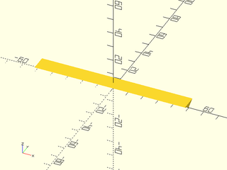
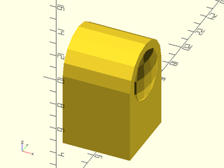
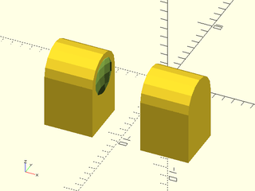
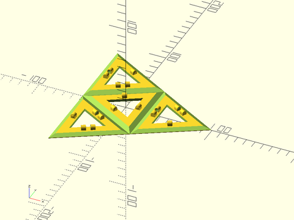

# LibFile: hingesnaps.scad

Useful hinge mask and snaps shapes.

To use, add the following lines to the beginning of your file:

    include <BOSL2/std.scad>
    include <BOSL2/hingesnaps.scad>

## Table of Contents

1. [Section: Hinges and Snaps](#section-hinges-and-snaps)
    - [`folding_hinge_mask()`](#module-folding_hinge_mask)
    - [`snap_lock()`](#module-snap_lock)
    - [`snap_socket()`](#module-snap_socket)
    - [`apply_folding_hinges_and_snaps()`](#module-apply_folding_hinges_and_snaps)

## Section: Hinges and Snaps

### Module: folding\_hinge\_mask()

**Usage:** 

- folding\_hinge\_mask(l, thick, [layerheight], [foldangle], [hingegap], [anchor], [spin], [orient]);

**Description:** 

Creates a mask to be differenced away from a plate to create a foldable hinge.
Center the mask at the bottom of the plate you want to make a hinge in.
The mask will leave  hinge material two `layerheight`s thick on the bottom of the hinge.

**Arguments:** 

<abbr title="These args can be used by position or by name.">By&nbsp;Position</abbr> | What it does
-------------------- | ------------
`l`                  | Length of the hinge in mm.
`thick`              | Thickness in mm of the material to make the hinge in.
`layerheight`        | The expected printing layer height in mm.
`foldangle`          | The interior angle in degrees of the joint to be created with the hinge.  Default: 90
`hingegap`           | Size in mm of the gap at the bottom of the hinge, to make room for folding.
`anchor`             | Translate so anchor point is at origin (0,0,0).  See [anchor](attachments.scad#subsection-anchor).  Default: `CENTER`
`spin`               | Rotate this many degrees around the Z axis.  See [spin](attachments.scad#subsection-spin).  Default: `0`
`orient`             | Vector to rotate top towards.  See [orient](attachments.scad#subsection-orient).  Default: `UP`

**Example 1:** 

    include <BOSL2/std.scad>
    include <BOSL2/hingesnaps.scad>
    folding_hinge_mask(l=100, thick=3, foldangle=60);

  

---

### Module: snap\_lock()

**Usage:** 

- snap\_lock(thick, [snaplen], [snapdiam], [layerheight], [foldangle], [hingegap], [anchor], [spin], [orient]);

**Description:** 

Creates the central snaplock part.

**Arguments:** 

<abbr title="These args can be used by position or by name.">By&nbsp;Position</abbr> | What it does
-------------------- | ------------
`thick`              | Thickness in mm of the material to make the hinge in.
`snaplen`            | Length of locking snaps.
`snapdiam`           | Diameter/width of locking snaps.
`layerheight`        | The expected printing layer height in mm.
`foldangle`          | The interior angle in degrees of the joint to be created with the hinge.  Default: 90
`hingegap`           | Size in mm of the gap at the bottom of the hinge, to make room for folding.
`anchor`             | Translate so anchor point is at origin (0,0,0).  See [anchor](attachments.scad#subsection-anchor).  Default: `CENTER`
`spin`               | Rotate this many degrees around the Z axis.  See [spin](attachments.scad#subsection-spin).  Default: `0`
`orient`             | Vector to rotate top towards.  See [orient](attachments.scad#subsection-orient).  Default: `UP`

**Example 1:** 

    include <BOSL2/std.scad>
    include <BOSL2/hingesnaps.scad>
    snap_lock(thick=3, foldangle=60);

  

---

### Module: snap\_socket()

**Usage:** 

- snap\_socket(thick, [snaplen], [snapdiam], [layerheight], [foldangle], [hingegap], [anchor], [spin], [orient]);

**Description:** 

Creates the outside snaplock socketed part.

**Arguments:** 

<abbr title="These args can be used by position or by name.">By&nbsp;Position</abbr> | What it does
-------------------- | ------------
`thick`              | Thickness in mm of the material to make the hinge in.
`snaplen`            | Length of locking snaps.
`snapdiam`           | Diameter/width of locking snaps.
`layerheight`        | The expected printing layer height in mm.
`foldangle`          | The interior angle in degrees of the joint to be created with the hinge.  Default: 90
`hingegap`           | Size in mm of the gap at the bottom of the hinge, to make room for folding.
`anchor`             | Translate so anchor point is at origin (0,0,0).  See [anchor](attachments.scad#subsection-anchor).  Default: `CENTER`
`spin`               | Rotate this many degrees around the Z axis.  See [spin](attachments.scad#subsection-spin).  Default: `0`
`orient`             | Vector to rotate top towards.  See [orient](attachments.scad#subsection-orient).  Default: `UP`

**Example 1:** 

    include <BOSL2/std.scad>
    include <BOSL2/hingesnaps.scad>
    snap_socket(thick=3, foldangle=60);

  

---

### Module: apply\_folding\_hinges\_and\_snaps()

**Usage:** 

- apply\_folding\_hinges\_and\_snaps(thick, [foldangle], [hinges], [snaps], [sockets], [snaplen], [snapdiam], [hingegap], [layerheight]) ...

**Description:** 

Adds snaplocks and removes hinges from children objects at the given positions.

**Arguments:** 

<abbr title="These args can be used by position or by name.">By&nbsp;Position</abbr> | What it does
-------------------- | ------------
`thick`              | Thickness in mm of the material to make the hinge in.
`foldangle`          | The interior angle in degrees of the joint to be created with the hinge.  Default: 90
`hinges`             | List of [LENGTH, POSITION, SPIN] for each hinge to difference from the children.
`snaps`              | List of [POSITION, SPIN] for each central snaplock to add to the children.
`sockets`            | List of [POSITION, SPIN] for each outer snaplock sockets to add to the children.
`snaplen`            | Length of locking snaps.
`snapdiam`           | Diameter/width of locking snaps.
`hingegap`           | Size in mm of the gap at the bottom of the hinge, to make room for folding.
`layerheight`        | The expected printing layer height in mm.

**Example 1:** 

 

    include <BOSL2/std.scad>
    include <BOSL2/hingesnaps.scad>
    size=100;
    apply_folding_hinges_and_snaps(
        thick=3, foldangle=54.74,
        hinges=[
            for (a=[0,120,240], b=[-size/2,size/4]) each [
                [200, polar_to_xy(b,a), a+90]
            ]
        ],
        snaps=[
            for (a=[0,120,240]) each [
                [rot(a,p=[ size/4, 0        ]), a+90],
                [rot(a,p=[-size/2,-size/2.33]), a-90]
            ]
        ],
        sockets=[
            for (a=[0,120,240]) each [
                [rot(a,p=[ size/4, 0        ]), a+90],
                [rot(a,p=[-size/2, size/2.33]), a+90]
            ]
        ]
    ) {
        $fn=3;
        difference() {
            cylinder(r=size-1, h=3);
            down(0.01) cylinder(r=size/4.5, h=3.1, spin=180);
            down(0.01) for (a=[0:120:359.9]) zrot(a) right(size/2) cylinder(r=size/4.5, h=3.1);
        }
    }

---

