# LibFile: joiners.scad

Snap-together joiners.

To use, add the following lines to the beginning of your file:

    include <BOSL2/std.scad>
    include <BOSL2/joiners.scad>

## Table of Contents

1. [Section: Half Joiners](#section-half-joiners)
    - [`half_joiner_clear()`](#module-half_joiner_clear)
    - [`half_joiner()`](#module-half_joiner)
    - [`half_joiner2()`](#module-half_joiner2)

2. [Section: Full Joiners](#section-full-joiners)
    - [`joiner_clear()`](#module-joiner_clear)
    - [`joiner()`](#module-joiner)

3. [Section: Full Joiners Pairs/Sets](#section-full-joiners-pairssets)
    - [`joiner_pair_clear()`](#module-joiner_pair_clear)
    - [`joiner_pair()`](#module-joiner_pair)

4. [Section: Full Joiners Quads/Sets](#section-full-joiners-quadssets)
    - [`joiner_quad_clear()`](#module-joiner_quad_clear)
    - [`joiner_quad()`](#module-joiner_quad)

5. [Section: Dovetails](#section-dovetails)
    - [`dovetail()`](#module-dovetail)

6. [Section: Tension Clips](#section-tension-clips)
    - [`snap_pin()`](#module-snap_pin)
    - [`snap_pin_socket()`](#module-snap_pin_socket)
    - [`rabbit_clip()`](#module-rabbit_clip)

## Section: Half Joiners

### Module: half\_joiner\_clear()

**Usage:** 

- half\_joiner\_clear(h, w, [a], [clearance], [overlap])

**Description:** 

Creates a mask to clear an area so that a half_joiner can be placed there.

**Arguments:** 

<abbr title="These args can be used by position or by name.">By&nbsp;Position</abbr> | What it does
-------------------- | ------------
`h`                  | Height of the joiner to clear space for.
`w`                  | Width of the joiner to clear space for.
`a`                  | Overhang angle of the joiner.
`clearance`          | Extra width to clear.
`overlap`            | Extra depth to clear.
`anchor`             | Translate so anchor point is at origin (0,0,0).  See [anchor](attachments.scad#subsection-anchor).  Default: `CENTER`
`spin`               | Rotate this many degrees around the Z axis after anchor.  See [spin](attachments.scad#subsection-spin).  Default: `0`
`orient`             | Vector to rotate top towards, after spin.  See [orient](attachments.scad#subsection-orient).  Default: `UP`

**Example 1:** 

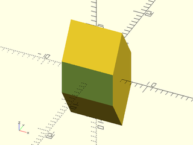

    include <BOSL2/std.scad>
    include <BOSL2/joiners.scad>
    half_joiner_clear();

  

---

### Module: half\_joiner()

**Usage:** 

- half\_joiner(h, w, l, [a], [screwsize], [guides], [$slop])

**Description:** 

Creates a half_joiner object that can be attached to half_joiner2 object.

**Arguments:** 

<abbr title="These args can be used by position or by name.">By&nbsp;Position</abbr> | What it does
-------------------- | ------------
`h`                  | Height of the half_joiner.
`w`                  | Width of the half_joiner.
`l`                  | Length of the backing to the half_joiner.
`a`                  | Overhang angle of the half_joiner.
`screwsize`          | Diameter of screwhole.
`guides`             | If true, create sliding alignment guides.
`anchor`             | Translate so anchor point is at origin (0,0,0).  See [anchor](attachments.scad#subsection-anchor).  Default: `CENTER`
`spin`               | Rotate this many degrees around the Z axis after anchor.  See [spin](attachments.scad#subsection-spin).  Default: `0`
`orient`             | Vector to rotate top towards, after spin.  See [orient](attachments.scad#subsection-orient).  Default: `UP`
`$slop`              | Printer specific slop value to make parts fit more closely.

**Example 1:** 

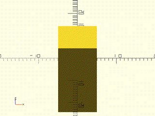

    include <BOSL2/std.scad>
    include <BOSL2/joiners.scad>
    half_joiner(screwsize=3);

  

**Example 2:** 

    include <BOSL2/std.scad>
    include <BOSL2/joiners.scad>
    half_joiner(h=20,w=10,l=10);

  

---

### Module: half\_joiner2()

**Usage:** 

- half\_joiner2(h, w, l, [a], [screwsize], [guides])

**Description:** 

Creates a half_joiner2 object that can be attached to half_joiner object.

**Arguments:** 

<abbr title="These args can be used by position or by name.">By&nbsp;Position</abbr> | What it does
-------------------- | ------------
`h`                  | Height of the half_joiner.
`w`                  | Width of the half_joiner.
`l`                  | Length of the backing to the half_joiner.
`a`                  | Overhang angle of the half_joiner.
`screwsize`          | Diameter of screwhole.
`guides`             | If true, create sliding alignment guides.
`anchor`             | Translate so anchor point is at origin (0,0,0).  See [anchor](attachments.scad#subsection-anchor).  Default: `CENTER`
`spin`               | Rotate this many degrees around the Z axis after anchor.  See [spin](attachments.scad#subsection-spin).  Default: `0`
`orient`             | Vector to rotate top towards, after spin.  See [orient](attachments.scad#subsection-orient).  Default: `UP`

**Example 1:** 

    include <BOSL2/std.scad>
    include <BOSL2/joiners.scad>
    half_joiner2(screwsize=3);

  

**Example 2:** 

    include <BOSL2/std.scad>
    include <BOSL2/joiners.scad>
    half_joiner2(h=20,w=10,l=10);

  

---

## Section: Full Joiners

### Module: joiner\_clear()

**Usage:** 

- joiner\_clear(h, w, [a], [clearance], [overlap])

**Description:** 

Creates a mask to clear an area so that a joiner can be placed there.

**Arguments:** 

<abbr title="These args can be used by position or by name.">By&nbsp;Position</abbr> | What it does
-------------------- | ------------
`h`                  | Height of the joiner to clear space for.
`w`                  | Width of the joiner to clear space for.
`a`                  | Overhang angle of the joiner.
`clearance`          | Extra width to clear.
`overlap`            | Extra depth to clear.
`anchor`             | Translate so anchor point is at origin (0,0,0).  See [anchor](attachments.scad#subsection-anchor).  Default: `CENTER`
`spin`               | Rotate this many degrees around the Z axis after anchor.  See [spin](attachments.scad#subsection-spin).  Default: `0`
`orient`             | Vector to rotate top towards, after spin.  See [orient](attachments.scad#subsection-orient).  Default: `UP`

**Example 1:** 

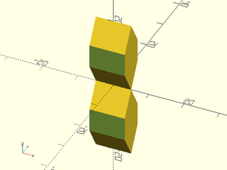

    include <BOSL2/std.scad>
    include <BOSL2/joiners.scad>
    joiner_clear();

  

---

### Module: joiner()

**Usage:** 

- joiner(h, w, l, [a], [screwsize], [guides], [$slop])

**Description:** 

Creates a joiner object that can be attached to another joiner object.

**Arguments:** 

<abbr title="These args can be used by position or by name.">By&nbsp;Position</abbr> | What it does
-------------------- | ------------
`h`                  | Height of the joiner.
`w`                  | Width of the joiner.
`l`                  | Length of the backing to the joiner.
`a`                  | Overhang angle of the joiner.
`screwsize`          | Diameter of screwhole.
`guides`             | If true, create sliding alignment guides.
`anchor`             | Translate so anchor point is at origin (0,0,0).  See [anchor](attachments.scad#subsection-anchor).  Default: `CENTER`
`spin`               | Rotate this many degrees around the Z axis after anchor.  See [spin](attachments.scad#subsection-spin).  Default: `0`
`orient`             | Vector to rotate top towards, after spin.  See [orient](attachments.scad#subsection-orient).  Default: `UP`
`$slop`              | Printer specific slop value to make parts fit more closely.

**Example 1:** 

    include <BOSL2/std.scad>
    include <BOSL2/joiners.scad>
    joiner(screwsize=3);

  

**Example 2:** 

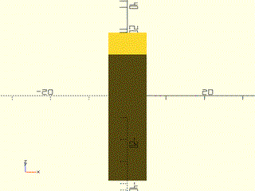

    include <BOSL2/std.scad>
    include <BOSL2/joiners.scad>
    joiner(w=10, l=10, h=40);

  

---

## Section: Full Joiners Pairs/Sets

### Module: joiner\_pair\_clear()

**Usage:** 

- joiner\_pair\_clear(spacing, [n], [h], [w], [a], [clearance], [overlap])

**Description:** 

Creates a mask to clear an area so that a pair of joiners can be placed there.

**Arguments:** 

<abbr title="These args can be used by position or by name.">By&nbsp;Position</abbr> | What it does
-------------------- | ------------
`spacing`            | Spacing between joiner centers.
`h`                  | Height of the joiner to clear space for.
`w`                  | Width of the joiner to clear space for.
`a`                  | Overhang angle of the joiner.
`n`                  | Number of joiners (2 by default) to clear for.
`clearance`          | Extra width to clear.
`overlap`            | Extra depth to clear.
`anchor`             | Translate so anchor point is at origin (0,0,0).  See [anchor](attachments.scad#subsection-anchor).  Default: `CENTER`
`spin`               | Rotate this many degrees around the Z axis after anchor.  See [spin](attachments.scad#subsection-spin).  Default: `0`
`orient`             | Vector to rotate top towards, after spin.  See [orient](attachments.scad#subsection-orient).  Default: `UP`

**Example 1:** 

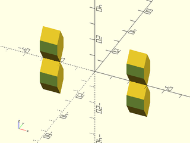

    include <BOSL2/std.scad>
    include <BOSL2/joiners.scad>
    joiner_pair_clear(spacing=50, n=2);

  

**Example 2:** 

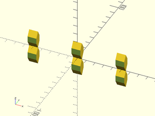

    include <BOSL2/std.scad>
    include <BOSL2/joiners.scad>
    joiner_pair_clear(spacing=50, n=3);

  

---

### Module: joiner\_pair()

**Usage:** 

- joiner\_pair(h, w, l, [a], [screwsize], [guides], [$slop])

**Description:** 

Creates a joiner_pair object that can be attached to other joiner_pairs .

**Arguments:** 

<abbr title="These args can be used by position or by name.">By&nbsp;Position</abbr> | What it does
-------------------- | ------------
`spacing`            | Spacing between joiner centers.
`h`                  | Height of the joiners.
`w`                  | Width of the joiners.
`l`                  | Length of the backing to the joiners.
`a`                  | Overhang angle of the joiners.
`n`                  | Number of joiners in a row.  Default: 2
`alternate`          | If true (default), each joiner alternates it's orientation.  If alternate is "alt", do opposite alternating orientations.
`screwsize`          | Diameter of screwhole.
`guides`             | If true, create sliding alignment guides.
`anchor`             | Translate so anchor point is at origin (0,0,0).  See [anchor](attachments.scad#subsection-anchor).  Default: `CENTER`
`spin`               | Rotate this many degrees around the Z axis after anchor.  See [spin](attachments.scad#subsection-spin).  Default: `0`
`orient`             | Vector to rotate top towards, after spin.  See [orient](attachments.scad#subsection-orient).  Default: `UP`
`$slop`              | Printer specific slop value to make parts fit more closely.

**Example 1:** 

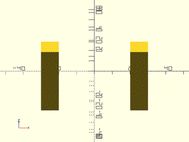

    include <BOSL2/std.scad>
    include <BOSL2/joiners.scad>
    joiner_pair(spacing=50, l=10);

  

**Example 2:** 

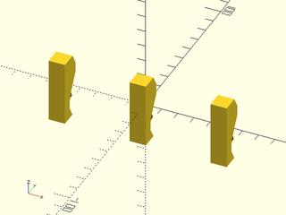

    include <BOSL2/std.scad>
    include <BOSL2/joiners.scad>
    joiner_pair(spacing=50, l=10, n=3, alternate=false);

  

**Example 3:** 

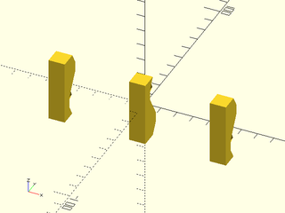

    include <BOSL2/std.scad>
    include <BOSL2/joiners.scad>
    joiner_pair(spacing=50, l=10, n=3, alternate=true);

  

**Example 4:** 

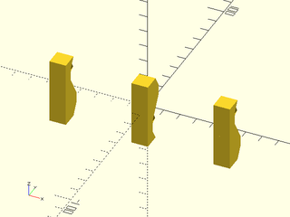

    include <BOSL2/std.scad>
    include <BOSL2/joiners.scad>
    joiner_pair(spacing=50, l=10, n=3, alternate="alt");

  

---

## Section: Full Joiners Quads/Sets

### Module: joiner\_quad\_clear()

**Usage:** 

- joiner\_quad\_clear(spacing, [n], [h], [w], [a], [clearance], [overlap])

**Description:** 

Creates a mask to clear an area so that a pair of joiners can be placed there.

**Arguments:** 

<abbr title="These args can be used by position or by name.">By&nbsp;Position</abbr> | What it does
-------------------- | ------------
`spacing1`           | Spacing between joiner centers.
`spacing2`           | Spacing between back-to-back pairs/sets of joiners.
`h`                  | Height of the joiner to clear space for.
`w`                  | Width of the joiner to clear space for.
`a`                  | Overhang angle of the joiner.
`n`                  | Number of joiners in a row.  Default: 2
`clearance`          | Extra width to clear.
`overlap`            | Extra depth to clear.
`anchor`             | Translate so anchor point is at origin (0,0,0).  See [anchor](attachments.scad#subsection-anchor).  Default: `CENTER`
`spin`               | Rotate this many degrees around the Z axis after anchor.  See [spin](attachments.scad#subsection-spin).  Default: `0`
`orient`             | Vector to rotate top towards, after spin.  See [orient](attachments.scad#subsection-orient).  Default: `UP`

**Example 1:** 

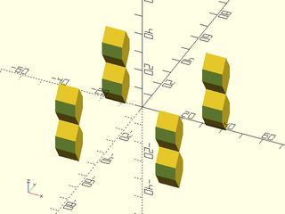

    include <BOSL2/std.scad>
    include <BOSL2/joiners.scad>
    joiner_quad_clear(spacing1=50, spacing2=50, n=2);

  

**Example 2:** 

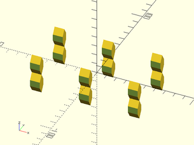

    include <BOSL2/std.scad>
    include <BOSL2/joiners.scad>
    joiner_quad_clear(spacing1=50, spacing2=50, n=3);

  

---

### Module: joiner\_quad()

**Usage:** 

- joiner\_quad(h, w, l, [a], [screwsize], [guides], [$slop])

**Description:** 

Creates a joiner_quad object that can be attached to other joiner_pairs .

**Arguments:** 

<abbr title="These args can be used by position or by name.">By&nbsp;Position</abbr> | What it does
-------------------- | ------------
`spacing`            | Spacing between joiner centers.
`h`                  | Height of the joiners.
`w`                  | Width of the joiners.
`l`                  | Length of the backing to the joiners.
`a`                  | Overhang angle of the joiners.
`n`                  | Number of joiners in a row.  Default: 2
`alternate`          | If true (default), joiners on each side alternate orientations.  If alternate is "alt", do opposite alternating orientations.
`screwsize`          | Diameter of screwhole.
`guides`             | If true, create sliding alignment guides.
`$slop`              | Printer specific slop value to make parts fit more closely.
`anchor`             | Translate so anchor point is at origin (0,0,0).  See [anchor](attachments.scad#subsection-anchor).  Default: `CENTER`
`spin`               | Rotate this many degrees around the Z axis after anchor.  See [spin](attachments.scad#subsection-spin).  Default: `0`
`orient`             | Vector to rotate top towards, after spin.  See [orient](attachments.scad#subsection-orient).  Default: `UP`

**Example 1:** 

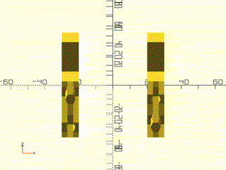

    include <BOSL2/std.scad>
    include <BOSL2/joiners.scad>
    joiner_quad(spacing1=50, spacing2=50, l=10);

  

**Example 2:** 

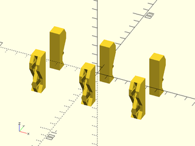

 

    include <BOSL2/std.scad>
    include <BOSL2/joiners.scad>
    joiner_quad(spacing1=50, spacing2=50, l=10, n=3, alternate=false);

**Example 3:** 

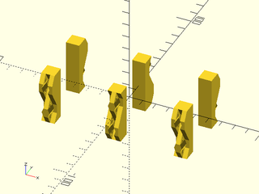

 

    include <BOSL2/std.scad>
    include <BOSL2/joiners.scad>
    joiner_quad(spacing1=50, spacing2=50, l=10, n=3, alternate=true);

**Example 4:** 

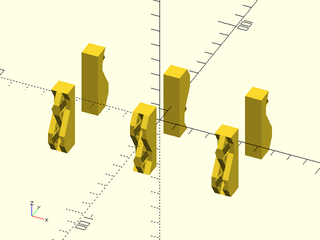

 

    include <BOSL2/std.scad>
    include <BOSL2/joiners.scad>
    joiner_quad(spacing1=50, spacing2=50, l=10, n=3, alternate="alt");

---

## Section: Dovetails

### Module: dovetail()

**Usage:** 

- dovetail(gender, w|width, h|height, slide, [slope|angle], [taper|back\_width], [chamfer], [r|radius], [round], [extra], [$slop])

**Description:** 

Produces a possibly tapered dovetail joint shape to attach to or subtract from two parts you wish to join together.
The tapered dovetail is particularly advantageous for long joints because the joint assembles without binding until
it is fully closed, and then wedges tightly.  You can chamfer or round the corners of the dovetail shape for better
printing and assembly, or choose a fully rounded joint that looks more like a puzzle piece.  The dovetail appears
parallel to the Y axis and projecting upwards, so in its default orientation it will slide together with a translation
in the positive Y direction.  The gender determines whether the shape is meant to be added to your model or
differenced, and it also changes the anchor and orientation.  The default anchor for dovetails is BOTTOM;
the default orientation depends on the gender, with male dovetails oriented UP and female ones DOWN.  The dovetails by default
have extra extension of 0.01 for unions and differences.  You should ensure that attachment is done with overlap=0 to ensure that
the sizing and positioning is correct.

**Arguments:** 

<abbr title="These args can be used by position or by name.">By&nbsp;Position</abbr> | What it does
-------------------- | ------------
`gender`             | A string, "male" or "female", to specify the gender of the dovetail.
`w`                  / `width`              | Width (at the wider, top end) of the dovetail before tapering
`h`                  / `height`             | Height of the dovetail (the amount it projects from its base)
`slide`              | Distance the dovetail slides when you assemble it (length of sliding dovetails, thickness of regular dovetails)

<abbr title="These args must be used by name, ie: name=value">By&nbsp;Name</abbr> | What it does
-------------------- | ------------
`slope`              | slope of the dovetail.  Standard woodworking slopes are 4, 6, or 8.  Default: 6.
`angle`              | angle (in degrees) of the dovetail.  Specify only one of slope and angle.
`taper`              | taper angle (in degrees). Dovetail gets narrower by this angle.  Default: no taper
`back_width`         | width of right hand end of the dovetail.  This alternate method of specifying the taper may be easier to manage.  Specify only one of `taper` and `back_width`.  Note that `back_width` should be smaller than `width` to taper in the customary direction, with the smaller end at the back.
`chamfer`            | amount to chamfer the corners of the joint (Default: no chamfer)
`r`                  / `radius`             | amount to round over the corners of the joint (Default: no rounding)
`round`              | true to round both corners of the dovetail and give it a puzzle piece look.  Default: false.
`extra`              | amount of extra length and base extension added to dovetails for unions and differences.  Default: 0.01

**Example 1:** Ordinary straight dovetail, male version (sticking up) and female version (below the xy plane)

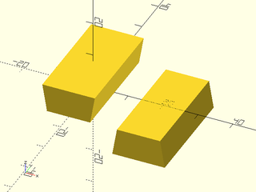

    include <BOSL2/std.scad>
    include <BOSL2/joiners.scad>
    dovetail("male", width=15, height=8, slide=30);
    right(20) dovetail("female", width=15, height=8, slide=30);

  

**Example 2:** Adding a 6 degree taper (Such a big taper is usually not necessary, but easier to see for the example.)

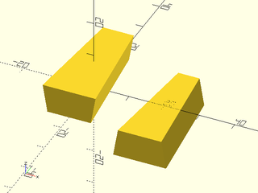

 

    include <BOSL2/std.scad>
    include <BOSL2/joiners.scad>
    dovetail("male", w=15, h=8, slide=30, taper=6);
    right(20) dovetail("female", 15, 8, 30, taper=6);  // Same as above

**Example 3:** A block that can link to itself

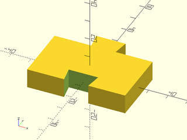

 

    include <BOSL2/std.scad>
    include <BOSL2/joiners.scad>
    diff("remove")
      cuboid([50,30,10]){
        attach(BACK) dovetail("male", slide=10, width=15, height=8);
        attach(FRONT) dovetail("female", slide=10, width=15, height=8,$tags="remove");
      }

**Example 4:** Setting the dovetail angle.  This is too extreme to be useful.

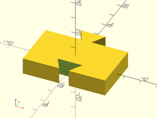

 

    include <BOSL2/std.scad>
    include <BOSL2/joiners.scad>
    diff("remove")
      cuboid([50,30,10]){
        attach(BACK) dovetail("male", slide=10, width=15, height=8, angle=30);
        attach(FRONT) dovetail("female", slide=10, width=15, height=8, angle=30,$tags="remove");
      }

**Example 5:** Adding a chamfer helps printed parts fit together without problems at the corners

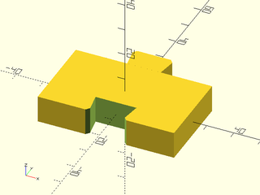

 

    include <BOSL2/std.scad>
    include <BOSL2/joiners.scad>
    diff("remove")
      cuboid([50,30,10]){
        attach(BACK) dovetail("male", slide=10, width=15, height=8, chamfer=1);
        attach(FRONT) dovetail("female", slide=10, width=15, height=8,chamfer=1,$tags="remove");
      }

**Example 6:** Rounding the outside corners is another option

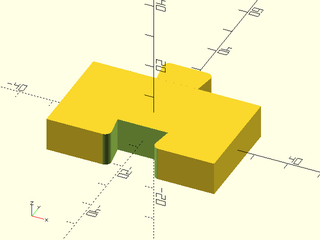

 

    include <BOSL2/std.scad>
    include <BOSL2/joiners.scad>
    diff("remove")
    cuboid([50,30,10]) {
        attach(BACK)  dovetail("male", slide=10, width=15, height=8, radius=1, $fn=32);
        attach(FRONT) dovetail("female", slide=10, width=15, height=8, radius=1, $tags="remove", $fn=32);
    }

**Example 7:** Or you can make a fully rounded joint

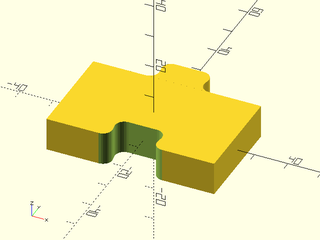

 

    include <BOSL2/std.scad>
    include <BOSL2/joiners.scad>
    $fn=32;
    diff("remove")
    cuboid([50,30,10]){
        attach(BACK) dovetail("male", slide=10, width=15, height=8, radius=1.5, round=true);
        attach(FRONT) dovetail("female", slide=10, width=15, height=8, radius=1.5, round=true, $tags="remove");
    }

**Example 8:** With a long joint like this, a taper makes the joint easy to assemble.  It will go together easily and wedge tightly if you get the tolerances right.  Specifying the taper with `back_width` may be easier than using a taper angle.

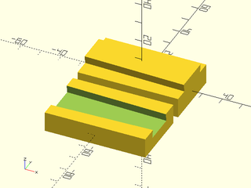

 

    include <BOSL2/std.scad>
    include <BOSL2/joiners.scad>
    cuboid([50,30,10])
      attach(TOP) dovetail("male", slide=50, width=18, height=4, back_width=15, spin=90);
    fwd(35)
      diff("remove")
        cuboid([50,30,10])
          attach(TOP) dovetail("female", slide=50, width=18, height=4, back_width=15, spin=90, $tags="remove");

**Example 9:** A series of dovetails forming a tail board, with the inside of the joint up.  A standard wood joint would have a zero taper.

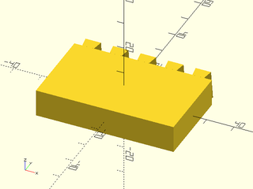

 

    include <BOSL2/std.scad>
    include <BOSL2/joiners.scad>
    cuboid([50,30,10])
      attach(BACK) xcopies(10,5) dovetail("male", slide=10, width=7, taper=4, height=4);

**Example 10:** Mating pin board for a half-blind right angle joint, where the joint only shows on the side but not the front.  Note that the anchor method and use of `spin` ensures that the joint works even with a taper.

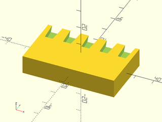

 

    include <BOSL2/std.scad>
    include <BOSL2/joiners.scad>
    diff("remove")
      cuboid([50,30,10])
        position(TOP+BACK) xcopies(10,5) dovetail("female", slide=10, width=7, taper=4, height=4, $tags="remove",anchor=BOTTOM+FRONT,spin=180);

---

## Section: Tension Clips

### Module: snap\_pin()

**Usage:** 

- snap\_pin(size, [pointed], [anchor], [spin], [orient])
- snap\_pin(r|radius|d|diameter, l|length, nub\_depth, snap, thickness, [clearance], [preload], [pointed], [anchor], [spin], [orient])

**Description:** 

Creates a snap pin that can be inserted into an appropriate socket to connect two objects together.  You can choose from some standard
pin dimensions by giving a size, or you can specify all the pin geometry parameters yourself.  If you use a standard size you can
override the standard parameters by specifying other ones.  The pins have flat sides so they can
be printed.  When oriented UP the shaft of the pin runs in the Z direction and the flat sides are the front and back.  The default
orientation (FRONT) and anchor (FRONT) places the pin in a printable configuration, flat side down on the xy plane.
The tightness of fit is determined by `preload` and `clearance`.  To make pins tighter increase `preload` and/or decrease `clearance`.

The "large" or "standard" size pin has a length of 10.8 and diameter of 7.  The "medium" pin has a length of 8 and diameter of 4.6.  The "small" pin
has a length of 6 and diameter of 3.2.  The "tiny" pin has a length of 4 and a diameter of 2.5.

This pin is based on https://www.thingiverse.com/thing:213310 by Emmett Lalishe
and a modified version at https://www.thingiverse.com/thing:3218332 by acwest
and distributed under the Creative Commons - Attribution - Share Alike License

**Arguments:** 

<abbr title="These args can be used by position or by name.">By&nbsp;Position</abbr> | What it does
-------------------- | ------------
`size`               | text string to select from a list of predefined sizes, one of "standard", "small", or "tiny".
`pointed`            | set to true to get a pointed pin, false to get one with a rounded end.  Default: true
`r|radius`           | radius of the pin
`d|diameter`         | diameter of the pin
`l|length`           | length of the pin
`nub_depth`          | the distance of the nub from the base of the pin
`snap`               | how much snap the pin provides (the nub projection)
`thickness`          | thickness of the pin walls
`pointed`            | if true the pin is pointed, otherwise it has a rounded tip.  Default: true
`clearance`          | how far to shrink the pin away from the socket walls.  Default: 0.2
`preload`            | amount to move the nub towards the pin base, which can create tension from the misalignment with the socket.  Default: 0.2

**Example 1:** Pin in native orientation

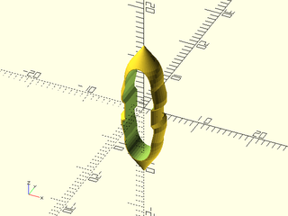

 

    include <BOSL2/std.scad>
    include <BOSL2/joiners.scad>
    snap_pin("standard", anchor=CENTER, orient=UP, thickness = 1, $fn=40);

**Example 2:** Pins oriented for printing

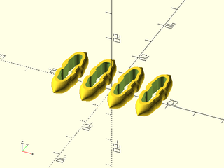

    include <BOSL2/std.scad>
    include <BOSL2/joiners.scad>
    xcopies(spacing=10, n=4) snap_pin("standard", $fn=40);

  

---

### Module: snap\_pin\_socket()

**Usage:** 

- snap\_pin\_socket(size, [fixed], [fins], [pointed], [anchor], [spin], [orient]);
- snap\_pin\_socket(r|radius|d|diameter, l|length, nub\_depth, snap, [fixed], [pointed], [fins], [anchor], [spin], [orient])

**Description:** 

Constructs a socket suitable for a snap_pin with the same parameters.   If `fixed` is true then the socket has flat walls and the
pin will not rotate in the socket.  If `fixed` is false then the socket is round and the pin will rotate, particularly well
if you add a lubricant.  If `pointed` is true the socket is pointed to receive a pointed pin, otherwise it has a rounded and and
will be shorter.  If `fins` is set to true then two fins are included inside the socket to act as supports (which may help when printing tip up,
especially when `pointed=false`).  The default orientation is DOWN with anchor BOTTOM so that you can difference() the socket away from an object.
The socket extends 0.02 extra below its bottom anchor point so that differences will work correctly.  (You must have $overlap smaller than 0.02 in
attach or the socket will be beneath the surface of the parent object.)

The "large" or "standard" size pin has a length of 10.8 and diameter of 7.  The "medium" pin has a length of 8 and diameter of 4.6.  The "small" pin
has a length of 6 and diameter of 3.2.  The "tiny" pin has a length of 4 and a diameter of 2.5.

**Arguments:** 

<abbr title="These args can be used by position or by name.">By&nbsp;Position</abbr> | What it does
-------------------- | ------------
`size`               | text string to select from a list of predefined sizes, one of "standard", "small", or "tiny".
`pointed`            | set to true to get a pointed pin, false to get one with a rounded end.  Default: true
`r|radius`           | radius of the pin
`d|diameter`         | diameter of the pin
`l|length`           | length of the pin
`nub_depth`          | the distance of the nub from the base of the pin
`snap`               | how much snap the pin provides (the nub projection)
`fixed`              | if true the pin cannot rotate, if false it can.  Default: true
`pointed`            | if true the socket has a pointed tip.  Default: true
`fins`               | if true supporting fins are included.  Default: false

**Example 1:** The socket shape itself in native orientation.

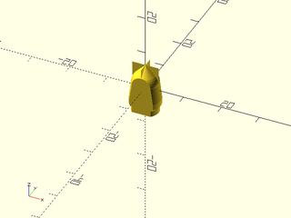

 

    include <BOSL2/std.scad>
    include <BOSL2/joiners.scad>
    snap_pin_socket("standard", anchor=CENTER, orient=UP, fins=true, $fn=40);

**Example 2:** A spinning socket with fins:

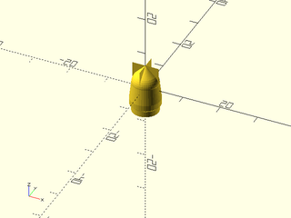

 

    include <BOSL2/std.scad>
    include <BOSL2/joiners.scad>
    snap_pin_socket("standard", anchor=CENTER, orient=UP, fins=true, fixed=false, $fn=40);

**Example 3:** A cube with a socket in the middle and one half-way off the front edge so you can see inside:

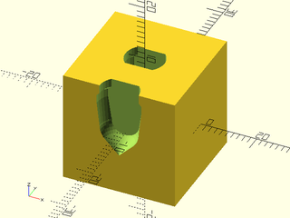

 

    include <BOSL2/std.scad>
    include <BOSL2/joiners.scad>
    $fn=40;
    diff("socket") cuboid([20,20,20]) {
      attach(TOP) snap_pin_socket("standard", $tags="socket");
      position(TOP+FRONT)snap_pin_socket("standard", $tags="socket");
    }

---

### Module: rabbit\_clip()

**Usage:** 

- rabbit\_clip(type, length, width, snap, thickness, depth, [compression], [clearance], [lock], [lock\_clearance], [splineteps], [anchor], [orient], [spin])

**Description:** 

Creates a clip with two flexible ears to lock into a mating socket, or create a mask to produce the appropriate
mating socket.  The clip can be made to insert and release easily, or to hold much better, or it can be
created with locking flanges that will make it very hard or impossible to remove.  Unlike the snap pin, this clip
is rectangular and can be made at any height, so a suitable clip could be very thin.  It's also possible to get a
solid connection with a short pin.

The type parameters specifies whether to make a clip, a socket mask, or a double clip.  The length is the
total nominal length of the clip.  (The actual length will be very close, but not equal to this.)  The width
gives the nominal width of the clip, which is the actual width of the clip at its base.  The snap parameter
gives the depth of the clip sides, which controls how easy the clip is to insert and remove.  The clip "ears" are
made over-wide by the compression value.  A nonzero compression helps make the clip secure in its socket.
The socket's width and length are increased by the clearance value which creates some space and can compensate
for printing inaccuracy.  The socket will be slightly longer than the nominal width.  The thickness is the thickness
curved line that forms the clip.  The clip depth is the amount the basic clip shape is extruded.  Be sure that you
make the socket with a larger depth than the clip (try 0.4 mm) to allow ease of insertion of the clip.  The clearance
value does not apply to the depth.  The splinesteps parameter increases the sampling of the clip curves.

By default clips appear with orient=UP and sockets with orient=DOWN.  The clips and sockets extend 0.02 units below
their base so that unions and differences will work without trouble, but be sure that the attach overlap is smaller
than 0.02.

The first figure shows the dimensions of the rabbit clip.  The second figure shows the clip in red overlayed on
its socket in yellow.  The left clip has a nonzero clearance, so its socket is bigger than the clip all around.
The right hand locking clip has no clearance, but it has a lock clearance, which provides some space behind
the lock to allow the clip to fit.  (Note that depending on your printer, this can be set to zero.)

**Figure 1:** 

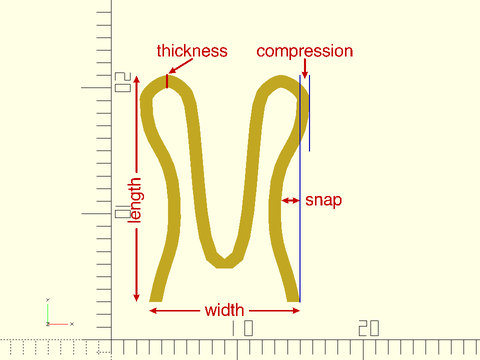

 

**Figure 2:** 

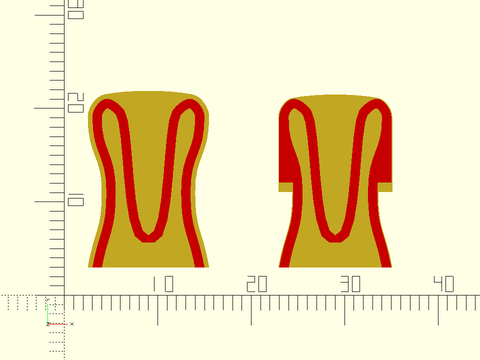

 

**Arguments:** 

<abbr title="These args can be used by position or by name.">By&nbsp;Position</abbr> | What it does
-------------------- | ------------
`type`               | One of "pin",  "socket", "male", "female" or "double" to specify what to make.
`length`             | nominal clip length
`width`              | nominal clip width
`snap`               | depth of hollow on the side of the clip
`thickness`          | thickness of the clip "line"
`depth`              | amount to extrude clip (give extra room for the socket, about 0.4mm)
`compression`        | excess width at the "ears" to lock more tightly.  Default: 0.1
`clearance`          | extra space in the socket for easier insertion.  Default: 0.1
`lock`               | set to true to make a locking clip that may be irreversible.  Default: false
`lock_clearance`     | give clearance for the lock.  Default: 0
`splinesteps`        | number of samples in the curves of the clip.  Default: 8
`anchor`             | anchor point for clip
`orient`             | clip orientation.  Default: UP for pins, DOWN for sockets
`spin`               | spin the clip.  Default: 0

**Example 1:** Here are several sizes that work printed in PLA on a Prusa MK3, with default clearance of 0.1 and a depth of 5

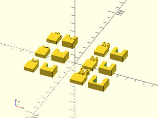

 

    include <BOSL2/std.scad>
    include <BOSL2/joiners.scad>
    module test_pair(length, width, snap, thickness, compression, lock=false)
    {
      depth = 5;
      extra_depth = 10;// Change this to 0.4 for closed sockets
      cuboid([max(width+5,12),12, depth], chamfer=.5, edges=[FRONT,"Y"], anchor=BOTTOM)
          attach(BACK)
            rabbit_clip(type="pin",length=length, width=width,snap=snap,thickness=thickness,depth=depth,
                        compression=compression,lock=lock);
      right(width+13)
      diff("remove")
          cuboid([width+8,max(12,length+2),depth+3], chamfer=.5, edges=[FRONT,"Y"], anchor=BOTTOM)
              attach(BACK)
                rabbit_clip(type="socket",length=length, width=width,snap=snap,thickness=thickness,depth=depth+extra_depth,
                            lock=lock,compression=0,$tags="remove");
    }
    left(37)ydistribute(spacing=28){
      test_pair(length=6, width=7, snap=0.25, thickness=0.8, compression=0.1);
      test_pair(length=3.5, width=7, snap=0.1, thickness=0.8, compression=0.1);  // snap = 0.2 gives a firmer connection
      test_pair(length=3.5, width=5, snap=0.1, thickness=0.8, compression=0.1);  // hard to take apart
    }
    right(17)ydistribute(spacing=28){
      test_pair(length=12, width=10, snap=1, thickness=1.2, compression=0.2);
      test_pair(length=8, width=7, snap=0.75, thickness=0.8, compression=0.2, lock=true); // With lock, very firm and irreversible
      test_pair(length=8, width=7, snap=0.75, thickness=0.8, compression=0.2, lock=true); // With lock, very firm and irreversible
    }

**Example 2:** Double clip to connect two sockets

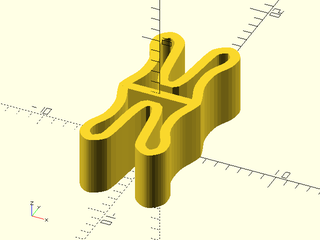

 

    include <BOSL2/std.scad>
    include <BOSL2/joiners.scad>
    rabbit_clip("double",length=8, width=7, snap=0.75, thickness=0.8, compression=0.2,depth=5);

**Example 3:** A modified version of the clip that acts like a backpack strap clip, where it locks tightly but you can squeeze to release.

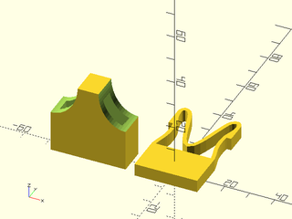

 

    include <BOSL2/std.scad>
    include <BOSL2/joiners.scad>
    cuboid([25,15,5],anchor=BOTTOM)
        attach(BACK)rabbit_clip("pin", length=25, width=25, thickness=1.5, snap=2, compression=0, lock=true, depth=5, lock_clearance=3);
    left(32)
    diff("remove")
    cuboid([30,30,11],orient=BACK,anchor=BACK){
        attach(BACK)rabbit_clip("socket", length=25, width=25, thickness=1.5, snap=2, compression=0, lock=true, depth=5.5, lock_clearance=3,$tags="remove");
        xflip_copy()
          position(FRONT+LEFT)
          xscale(0.8)
          zcyl(l=20,r=13.5, $tags="remove",$fn=64);
    }

---

