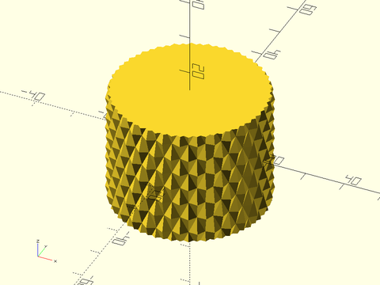
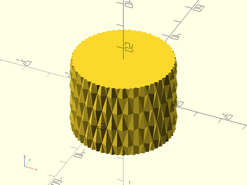
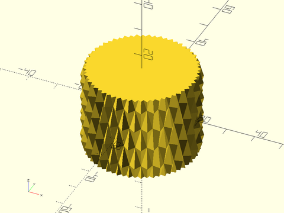
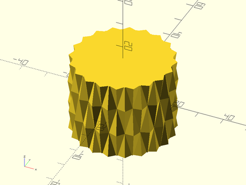
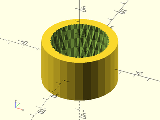
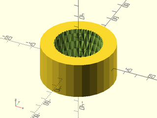

# LibFile: knurling.scad

Shapes and masks for knurling cylinders.

To use, add the following lines to the beginning of your file:

    include <BOSL2/std.scad>
    include <BOSL2/knurling.scad>

## Table of Contents

1. [Section: Knurling](#section-knurling)
    - [`knurled_cylinder()`](#module-knurled_cylinder)
    - [`knurled_cylinder_mask()`](#module-knurled_cylinder_mask)

## Section: Knurling

### Module: knurled\_cylinder()

**Usage:** 

- knurled\_cylinder(l, r|d, [overage], [count], [profile], [helix]);
- knurled\_cylinder(l, r1|d1, r2|d2, [overage], [count], [profile], [helix]);

**Description:** 

Creates a mask to difference from a cylinder to give it a knurled surface.

**Arguments:** 

<abbr title="These args can be used by position or by name.">By&nbsp;Position</abbr> | What it does
-------------------- | ------------
`l`                  | The length of the axis of the mask.  Default: 10
`overage`            | Extra backing to the mask.  Default: 5
`r`                  | The radius of the cylinder to knurl.  Default: 10
`r1`                 | The radius of the bottom of the conical cylinder to knurl.
`r2`                 | The radius of the top of the conical cylinder to knurl.
`d`                  | The diameter of the cylinder to knurl.
`d1`                 | The diameter of the bottom of the conical cylinder to knurl.
`d2`                 | The diameter of the top of the conical cylinder to knurl.
`count`              | The number of grooves to have around the surface of the cylinder.  Default: 30
`profile`            | The angle of the bottom of the groove, in degrees.  Default 120
`helix`              | The helical angle of the grooves, in degrees.  Default: 30
`chamfer`            | The size of the chamfers on the ends of the cylinder.  Default: none.
`chamfer1`           | The size of the chamfer on the bottom end of the cylinder.  Default: none.
`chamfer2`           | The size of the chamfer on the top end of the cylinder.  Default: none.
`chamfang`           | The angle in degrees of the chamfers on the ends of the cylinder.
`chamfang1`          | The angle in degrees of the chamfer on the bottom end of the cylinder.
`chamfang2`          | The angle in degrees of the chamfer on the top end of the cylinder.
`from_end`           | If true, chamfer is measured from the end of the cylinder, instead of inset from the edge.  Default: `false`.
`rounding`           | The radius of the rounding on the ends of the cylinder.  Default: none.
`rounding1`          | The radius of the rounding on the bottom end of the cylinder.
`rounding2`          | The radius of the rounding on the top end of the cylinder.
`anchor`             | Translate so anchor point is at origin (0,0,0).  See [anchor](attachments.scad#subsection-anchor).  Default: `CENTER`
`spin`               | Rotate this many degrees around the Z axis.  See [spin](attachments.scad#subsection-spin).  Default: `0`
`orient`             | Vector to rotate top towards.  See [orient](attachments.scad#subsection-orient).  Default: `UP`

**Example 1:** 

 

    include <BOSL2/std.scad>
    include <BOSL2/knurling.scad>
    knurled_cylinder(l=30, r=20, count=30, profile=120, helix=45);

**Example 2:** 

 

    include <BOSL2/std.scad>
    include <BOSL2/knurling.scad>
    knurled_cylinder(l=30, r=20, count=30, profile=120, helix=30);

**Example 3:** 

 

    include <BOSL2/std.scad>
    include <BOSL2/knurling.scad>
    knurled_cylinder(l=30, r=20, count=30, profile=90, helix=30);

**Example 4:** 

 

    include <BOSL2/std.scad>
    include <BOSL2/knurling.scad>
    knurled_cylinder(l=30, r=20, count=20, profile=120, helix=30);

---

### Module: knurled\_cylinder\_mask()

**Usage:** 

- knurled\_cylinder\_mask(l, r|d, [overage], [count], [profile], [helix]);
- knurled\_cylinder\_mask(l, r1|d1, r2|d2, [overage], [count], [profile], [helix]);

**Description:** 

Creates a mask to difference from a cylinder to give it a knurled surface.

**Arguments:** 

<abbr title="These args can be used by position or by name.">By&nbsp;Position</abbr> | What it does
-------------------- | ------------
`l`                  | The length of the axis of the mask.  Default: 10
`overage`            | Extra backing to the mask.  Default: 5
`r`                  | The radius of the cylinder to knurl.  Default: 10
`r1`                 | The radius of the bottom of the conical cylinder to knurl.
`r2`                 | The radius of the top of the conical cylinder to knurl.
`d`                  | The diameter of the cylinder to knurl.
`d1`                 | The diameter of the bottom of the conical cylinder to knurl.
`d2`                 | The diameter of the top of the conical cylinder to knurl.
`count`              | The number of grooves to have around the surface of the cylinder.  Default: 30
`profile`            | The angle of the bottom of the groove, in degrees.  Default 120
`helix`              | The helical angle of the grooves, in degrees.  Default: 30
`anchor`             | Translate so anchor point is at origin (0,0,0).  See [anchor](attachments.scad#subsection-anchor).  Default: `CENTER`
`spin`               | Rotate this many degrees around the Z axis.  See [spin](attachments.scad#subsection-spin).  Default: `0`
`orient`             | Vector to rotate top towards.  See [orient](attachments.scad#subsection-orient).  Default: `UP`

**Example 1:** 

 

    include <BOSL2/std.scad>
    include <BOSL2/knurling.scad>
    knurled_cylinder_mask(l=30, r=20, overage=5, profile=120, helix=30);

**Example 2:** 

 

    include <BOSL2/std.scad>
    include <BOSL2/knurling.scad>
    knurled_cylinder_mask(l=30, r=20, overage=10, profile=120, helix=30);

---

