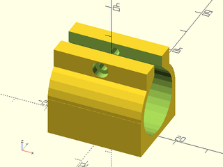

# LibFile: linear\_bearings.scad

Linear Bearing clips/holders.

To use, add the following lines to the beginning of your file:

    include <BOSL2/std.scad>
    include <BOSL2/linear_bearings.scad>

## Table of Contents

1. [Section: Functions](#section-functions)
    - [`get_lmXuu_bearing_diam()`](#function-get_lmxuu_bearing_diam)
    - [`get_lmXuu_bearing_length()`](#function-get_lmxuu_bearing_length)
    - [`linear_bearing_housing()`](#module-linear_bearing_housing)
    - [`lmXuu_housing()`](#module-lmxuu_housing)

## Section: Functions

### Function: get\_lmXuu\_bearing\_diam()

**Description:** 

Get outside diameter, in mm, of a standard lmXuu bearing.

**Arguments:** 

<abbr title="These args can be used by position or by name.">By&nbsp;Position</abbr> | What it does
-------------------- | ------------
`size`               | Inner size of lmXuu bearing, in mm.

---

### Function: get\_lmXuu\_bearing\_length()

**Description:** 

Get length, in mm, of a standard lmXuu bearing.

**Arguments:** 

<abbr title="These args can be used by position or by name.">By&nbsp;Position</abbr> | What it does
-------------------- | ------------
`size`               | Inner size of lmXuu bearing, in mm.

---

### Module: linear\_bearing\_housing()

**Description:** 

Creates a model of a clamp to hold a generic linear bearing cartridge.

**Arguments:** 

<abbr title="These args can be used by position or by name.">By&nbsp;Position</abbr> | What it does
-------------------- | ------------
`d`                  | Diameter of linear bearing. (Default: 15)
`l`                  | Length of linear bearing. (Default: 24)
`tab`                | Clamp tab height. (Default: 7)
`tabwall`            | Clamp Tab thickness. (Default: 5)
`wall`               | Wall thickness of clamp housing. (Default: 3)
`gap`                | Gap in clamp. (Default: 5)
`screwsize`          | Size of screw to use to tighten clamp. (Default: 3)
`anchor`             | Translate so anchor point is at origin (0,0,0).  See [anchor](attachments.scad#subsection-anchor).  Default: `CENTER`
`spin`               | Rotate this many degrees around the Z axis after anchor.  See [spin](attachments.scad#subsection-spin).  Default: `0`
`orient`             | Vector to rotate top towards, after spin.  See [orient](attachments.scad#subsection-orient).  Default: `UP`

**Example 1:** 

 

    include <BOSL2/std.scad>
    include <BOSL2/linear_bearings.scad>
    linear_bearing_housing(d=19, l=29, wall=2, tab=6, screwsize=2.5);

---

### Module: lmXuu\_housing()

**Description:** 

Creates a model of a clamp to hold a standard sized lmXuu linear bearing cartridge.

**Arguments:** 

<abbr title="These args can be used by position or by name.">By&nbsp;Position</abbr> | What it does
-------------------- | ------------
`size`               | Standard lmXuu inner size.
`tab`                | Clamp tab height.  Default: 7
`tabwall`            | Clamp Tab thickness.  Default: 5
`wall`               | Wall thickness of clamp housing.  Default: 3
`gap`                | Gap in clamp.  Default: 5
`screwsize`          | Size of screw to use to tighten clamp.  Default: 3
`anchor`             | Translate so anchor point is at origin (0,0,0).  See [anchor](attachments.scad#subsection-anchor).  Default: `CENTER`
`spin`               | Rotate this many degrees around the Z axis after anchor.  See [spin](attachments.scad#subsection-spin).  Default: `0`
`orient`             | Vector to rotate top towards, after spin.  See [orient](attachments.scad#subsection-orient).  Default: `UP`

**Example 1:** 

    include <BOSL2/std.scad>
    include <BOSL2/linear_bearings.scad>
    lmXuu_housing(size=10, wall=2, tab=6, screwsize=2.5);

  

---

