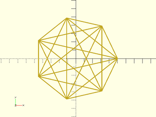

# LibFile: lists.scad

Functions for operating on generic lists.  Provides functiosn for indexing lists, changing list
structure, and constructing lists by rearranging or modifying another list.

To use, add the following lines to the beginning of your file:

    include <BOSL2/std.scad>

**Terminology:** 

Name | Definition
---- | ----------
**List** | An ordered collection of zero or more arbitrary items.  ie: `["a", "b", "c"]`, or `[3, "a", [4,5]]`
**Vector** | A list of numbers. ie: `[4, 5, 6]`
**Set** | A list of unique items.

## Table of Contents

1. [Section: List Query Operations](#section-list-query-operations)
    - [`is_homogeneous()`](#function-is_homogeneous)
    - [`min_length()`](#function-min_length)
    - [`max_length()`](#function-max_length)
    - [`list_shape()`](#function-list_shape)
    - [`in_list()`](#function-in_list)

2. [Section: List Indexing](#section-list-indexing)
    - [`select()`](#function-select)
    - [`slice()`](#function-slice)
    - [`last()`](#function-last)
    - [`list_head()`](#function-list_head)
    - [`list_tail()`](#function-list_tail)
    - [`bselect()`](#function-bselect)

3. [Section: List Construction](#section-list-construction)
    - [`repeat()`](#function-repeat)
    - [`count()`](#function-count)
    - [`list_bset()`](#function-list_bset)
    - [`list()`](#function-list)
    - [`force_list()`](#function-force_list)

4. [Section: List Modification](#section-list-modification)
    - [`reverse()`](#function-reverse)
    - [`list_rotate()`](#function-list_rotate)
    - [`shuffle()`](#function-shuffle)
    - [`repeat_entries()`](#function-repeat_entries)
    - [`list_pad()`](#function-list_pad)
    - [`list_set()`](#function-list_set)
    - [`list_insert()`](#function-list_insert)
    - [`list_remove()`](#function-list_remove)
    - [`list_remove_values()`](#function-list_remove_values)

5. [Section: Lists of Subsets](#section-lists-of-subsets)
    - [`idx()`](#function-idx)
    - [`pair()`](#function-pair)
    - [`triplet()`](#function-triplet)
    - [`combinations()`](#function-combinations)
    - [`permutations()`](#function-permutations)

6. [Section: Changing list structure](#section-changing-list-structure)
    - [`list_to_matrix()`](#function-list_to_matrix)
    - [`flatten()`](#function-flatten)
    - [`full_flatten()`](#function-full_flatten)

7. [Section: Set Manipulation](#section-set-manipulation)
    - [`set_union()`](#function-set_union)
    - [`set_difference()`](#function-set_difference)
    - [`set_intersection()`](#function-set_intersection)

## Section: List Query Operations

### Function: is\_homogeneous()

**Alias:** is\_homogenous()

**Usage:** 

- bool = is\_homogeneous(list, depth);

**Topics:** [List Handling](Topics#list-handling), [Type Checking](Topics#type-checking)

**Description:** 

Returns true when the list has elements of same type up to the depth `depth`.
Booleans and numbers are not distinguinshed as of distinct types.

**Arguments:** 

<abbr title="These args can be used by position or by name.">By&nbsp;Position</abbr> | What it does
-------------------- | ------------
`l`                  | the list to check
`depth`              | the lowest level the check is done

**See Also:** [is\_vector()](vectors.scad#function-is_vector), [is\_matrix()](linalg.scad#function-is_matrix)

**Example 1:** 

    include <BOSL2/std.scad>
    a = is_homogeneous([[1,["a"]], [2,["b"]]]);     // Returns true
    b = is_homogeneous([[1,["a"]], [2,[true]]]);    // Returns false
    c = is_homogeneous([[1,["a"]], [2,[true]]], 1); // Returns true
    d = is_homogeneous([[1,["a"]], [2,[true]]], 2); // Returns false
    e = is_homogeneous([[1,["a"]], [true,["b"]]]);  // Returns true

  

---

### Function: min\_length()

**Usage:** 

- llen = min\_length(list);

**Topics:** [List Handling](Topics#list-handling)

**Description:** 

Returns the length of the shortest sublist in a list of lists.

**Arguments:** 

<abbr title="These args can be used by position or by name.">By&nbsp;Position</abbr> | What it does
-------------------- | ------------
`list`               | A list of lists.

**See Also:** [max\_length()](#function-max_length)

**Example 1:** 

    include <BOSL2/std.scad>
    slen = min_length([[3,4,5],[6,7,8,9]]);  // Returns: 3

  

---

### Function: max\_length()

**Usage:** 

- llen = max\_length(list);

**Topics:** [List Handling](Topics#list-handling)

**Description:** 

Returns the length of the longest sublist in a list of lists.

**Arguments:** 

<abbr title="These args can be used by position or by name.">By&nbsp;Position</abbr> | What it does
-------------------- | ------------
`list`               | A list of lists.

**See Also:** [min\_length()](#function-min_length)

**Example 1:** 

    include <BOSL2/std.scad>
    llen = max_length([[3,4,5],[6,7,8,9]]);  // Returns: 4

  

---

### Function: list\_shape()

**Usage:** 

- dims = list\_shape(v, [depth]);

**Topics:** [Matrices](Topics#matrices), [List Handling](Topics#list-handling)

**Description:** 

Returns the size of a multi-dimensional array, a list of the lengths at each depth.
If the returned value has `dims[i] = j` then it means the ith index ranges of j items.
The return `dims[0]` is equal to the length of v.  Then `dims[1]` is equal to the
length of the lists in v, and in general, `dims[i]` is equal to the length of the items
nested to depth i in the list v.  If the length of items at that depth is inconsistent, then
`undef` is returned.  If no items exist at that depth then `0` is returned.  Note that
for simple vectors or matrices it is faster to compute `len(v)` and `len(v[0])`.

**Arguments:** 

<abbr title="These args can be used by position or by name.">By&nbsp;Position</abbr> | What it does
-------------------- | ------------
`v`                  | list to get shape of
`depth`              | depth to compute the size of.  If not given, returns a list of sizes at all depths.

**Example 1:** 

    include <BOSL2/std.scad>
    a = list_shape([[[1,2,3],[4,5,6]],[[7,8,9],[10,11,12]]]);     // Returns [2,2,3]
    b = list_shape([[[1,2,3],[4,5,6]],[[7,8,9],[10,11,12]]], 0);  // Returns 2
    c = list_shape([[[1,2,3],[4,5,6]],[[7,8,9],[10,11,12]]], 2);  // Returns 3
    d = list_shape([[[1,2,3],[4,5,6]],[[7,8,9]]]);                // Returns [2,undef,3]

  

---

### Function: in\_list()

**Usage:** 

- bool = in\_list(val, list, [idx]);

**Topics:** [List Handling](Topics#list-handling)

**Description:** 

Returns true if value `val` is in list `list`. When `val==NAN` the answer will be false for any list.

**Arguments:** 

<abbr title="These args can be used by position or by name.">By&nbsp;Position</abbr> | What it does
-------------------- | ------------
`val`                | The simple value to search for.
`list`               | The list to search.
`idx`                | If given, searches the given columns for matches for `val`.

**Example 1:** 

    include <BOSL2/std.scad>
    a = in_list("bar", ["foo", "bar", "baz"]);  // Returns true.
    b = in_list("bee", ["foo", "bar", "baz"]);  // Returns false.
    c = in_list("bar", [[2,"foo"], [4,"bar"], [3,"baz"]], idx=1);  // Returns true.

  

---

## Section: List Indexing

### Function: select()

**Topics:** [List Handling](Topics#list-handling)

**Usage:** 

- item = select(list, start);
- item = select(list, [s:d:e]);
- item = select(list, [i0,i1...,ik]);
- list = select(list, start, end);

**Description:** 

Returns a portion of a list, wrapping around past the beginning, if end<start.
The first item is index 0. Negative indexes are counted back from the end.
The last item is -1.  If only the `start` index is given, returns just the value
at that position when `start` is a number or the selected list of entries when `start` is
a list of indices or a range.

**Arguments:** 

<abbr title="These args can be used by position or by name.">By&nbsp;Position</abbr> | What it does
-------------------- | ------------
`list`               | The list to get the portion of.
`start`              | Either the index of the first item or an index range or a list of indices.
`end`                | The index of the last item when `start` is a number. When `start` is a list or a range, `end` should not be given.

**See Also:** [slice()](#function-slice), [column()](linalg.scad#function-column), [last()](#function-last)

**Example 1:** 

    include <BOSL2/std.scad>
    l = [3,4,5,6,7,8,9];
    a = select(l, 5, 6);   // Returns [8,9]
    b = select(l, 5, 8);   // Returns [8,9,3,4]
    c = select(l, 5, 2);   // Returns [8,9,3,4,5]
    d = select(l, -3, -1); // Returns [7,8,9]
    e = select(l, 3, 3);   // Returns [6]
    f = select(l, 4);      // Returns 7
    g = select(l, -2);     // Returns 8
    h = select(l, [1:3]);  // Returns [4,5,6]
    i = select(l, [3,1]);  // Returns [6,4]

  

---

### Function: slice()

**Usage:** 

- list = slice(list, s, e);

**Description:** 

Returns a slice of a list, from the first position `s` up to and including the last position `e`.
The first item in the list is at index 0.  Negative indexes are counted back from the end.
An index of -1 refers to the last list item.

**Arguments:** 

<abbr title="These args can be used by position or by name.">By&nbsp;Position</abbr> | What it does
-------------------- | ------------
`list`               | The list to get the slice of.
`s`                  | The index of the first item to return.
`e`                  | The index of the last item to return.

**See Also:** [select()](#function-select), [column()](linalg.scad#function-column), [last()](#function-last)

**Example 1:** 

    include <BOSL2/std.scad>
    a = slice([3,4,5,6,7,8,9], 3, 5);   // Returns [6,7,8]
    b = slice([3,4,5,6,7,8,9], 2, -1);  // Returns [5,6,7,8,9]
    c = slice([3,4,5,6,7,8,9], 1, 1);   // Returns [4]
    d = slice([3,4,5,6,7,8,9], 5);      // Returns [8,9]
    e = slice([3,4,5,6,7,8,9], 2, -2);  // Returns [5,6,7,8]
    f = slice([3,4,5,6,7,8,9], 4, 3;    // Returns []

  

---

### Function: last()

**Usage:** 

- item = last(list);

**Topics:** [List Handling](Topics#list-handling)

**Description:** 

Returns the last element of a list, or undef if empty.

**Arguments:** 

<abbr title="These args can be used by position or by name.">By&nbsp;Position</abbr> | What it does
-------------------- | ------------
`list`               | The list to get the last element of.

**See Also:** [select()](#function-select), [slice()](#function-slice), [column()](linalg.scad#function-column)

**Example 1:** 

    include <BOSL2/std.scad>
    l = [3,4,5,6,7,8,9];
    x = last(l);  // Returns 9.

  

---

### Function: list\_head()

**Usage:** 

- list = list\_head(list, [to]);

**Topics:** [List Handling](Topics#list-handling)

**Description:** 

Returns the head of the given list, from the first item up until the `to` index, inclusive.
If the `to` index is negative, then the length of the list is added to it, such that
`-1` is the last list item.  `-2` is the second from last.  `-3` is third from last, etc.
If the list is shorter than the given index, then the full list is returned.

**Arguments:** 

<abbr title="These args can be used by position or by name.">By&nbsp;Position</abbr> | What it does
-------------------- | ------------
`list`               | The list to get the head of.
`to`                 | The last index to include.  If negative, adds the list length to it.  ie: -1 is the last list item.

**See Also:** [select()](#function-select), [slice()](#function-slice), [list\_tail()](#function-list_tail), [last()](#function-last)

**Example 1:** 

    include <BOSL2/std.scad>
    hlist1 = list_head(["foo", "bar", "baz"]);  // Returns: ["foo", "bar"]
    hlist2 = list_head(["foo", "bar", "baz"], -3); // Returns: ["foo"]
    hlist3 = list_head(["foo", "bar", "baz"], 2);  // Returns: ["foo","bar"]
    hlist4 = list_head(["foo", "bar", "baz"], -5); // Returns: []
    hlist5 = list_head(["foo", "bar", "baz"], 5);  // Returns: ["foo","bar","baz"]

  

---

### Function: list\_tail()

**Usage:** 

- list = list\_tail(list, [from]);

**Topics:** [List Handling](Topics#list-handling)

**Description:** 

Returns the tail of the given list, from the `from` index up until the end of the list, inclusive.
If the `from` index is negative, then the length of the list is added to it, such that
`-1` is the last list item.  `-2` is the second from last.  `-3` is third from last, etc.
If you want it to return the last three items of the list, use `from=-3`.

**Arguments:** 

<abbr title="These args can be used by position or by name.">By&nbsp;Position</abbr> | What it does
-------------------- | ------------
`list`               | The list to get the tail of.
`from`               | The first index to include.  If negative, adds the list length to it.  ie: -1 is the last list item.

**See Also:** [select()](#function-select), [slice()](#function-slice), [last()](#function-last)

**Example 1:** 

    include <BOSL2/std.scad>
    tlist1 = list_tail(["foo", "bar", "baz"]);  // Returns: ["bar", "baz"]
    tlist2 = list_tail(["foo", "bar", "baz"], -1); // Returns: ["baz"]
    tlist3 = list_tail(["foo", "bar", "baz"], 2);  // Returns: ["baz"]
    tlist4 = list_tail(["foo", "bar", "baz"], -5); // Returns: ["foo","bar","baz"]
    tlist5 = list_tail(["foo", "bar", "baz"], 5);  // Returns: []

  

---

### Function: bselect()

**Usage:** 

- sublist = bselect(list, index);

**Topics:** [List Handling](Topics#list-handling)

**Description:** 

Returns the items in `list` whose matching element in `index` is true.

**Arguments:** 

<abbr title="These args can be used by position or by name.">By&nbsp;Position</abbr> | What it does
-------------------- | ------------
`list`               | Initial list to extract items from.
`index`              | List of booleans.

**See Also:** [list\_bset()](#function-list_bset)

**Example 1:** 

    include <BOSL2/std.scad>
    a = bselect([3,4,5,6,7], [false,true,true,false,true]);  // Returns: [4,5,7]

  

---

## Section: List Construction

### Function: repeat()

**Usage:** 

- list = repeat(val, n);

**Topics:** [List Handling](Topics#list-handling)

**Description:** 

Generates a list of `n` copies of the given value `val`.
If the count `n` is given as a list of counts, then this creates a
multi-dimensional array, filled with `val`.

**Arguments:** 

<abbr title="These args can be used by position or by name.">By&nbsp;Position</abbr> | What it does
-------------------- | ------------
`val`                | The value to repeat to make the list or array.
`n`                  | The number of copies to make of `val`.

**See Also:** [count()](#function-count), [lerpn()](math.scad#function-lerpn)

**Example 1:** 

    include <BOSL2/std.scad>
    a = repeat(1, 4);        // Returns [1,1,1,1]
    b = repeat(8, [2,3]);    // Returns [[8,8,8], [8,8,8]]
    c = repeat(0, [2,2,3]);  // Returns [[[0,0,0],[0,0,0]], [[0,0,0],[0,0,0]]]
    d = repeat([1,2,3],3);   // Returns [[1,2,3], [1,2,3], [1,2,3]]

  

---

### Function: count()

**Usage:** 

- list = count(n, [s], [step], [reverse]);

**Description:** 

Creates a list of `n` numbers, starting at `s`, incrementing by `step` each time.
You can also pass a list for n and then the length of the input list is used.

**Arguments:** 

<abbr title="These args can be used by position or by name.">By&nbsp;Position</abbr> | What it does
-------------------- | ------------
`n`                  | The length of the list of numbers to create, or a list to match the length of
`s`                  | The starting value of the list of numbers.
`step`               | The amount to increment successive numbers in the list.
`reverse`            | Reverse the list.  Default: false.

**See Also:** [idx()](#function-idx)

**Example 1:** 

    include <BOSL2/std.scad>
    nl1 = count(5);  // Returns: [0,1,2,3,4]
    nl2 = count(5,3);  // Returns: [3,4,5,6,7]
    nl3 = count(4,3,2);  // Returns: [3,5,7,9]
    nl4 = count(5,reverse=true);    // Returns: [4,3,2,1,0]
    nl5 = count(5,3,reverse=true);  // Returns: [7,6,5,4,3]

  

---

### Function: list\_bset()

**Usage:** 

- arr = list\_bset(indexset, valuelist, [dflt]);

**Topics:** [List Handling](Topics#list-handling)

**Description:** 

Opposite of `bselect()`.  Returns a list the same length as `indexlist`, where each item will
either be 0 if the corresponding item in `indexset` is false, or the next sequential value
from `valuelist` if the item is true.  The number of `true` values in `indexset` must be equal
to the length of `valuelist`.

**Arguments:** 

<abbr title="These args can be used by position or by name.">By&nbsp;Position</abbr> | What it does
-------------------- | ------------
`indexset`           | A list of boolean values.
`valuelist`          | The list of values to set into the returned list.
`dflt`               | Default value to store when the indexset item is false.

**See Also:** [bselect()](#function-bselect)

**Example 1:** 

    include <BOSL2/std.scad>
    a = list_bset([false,true,false,true,false], [3,4]);  // Returns: [0,3,0,4,0]
    b = list_bset([false,true,false,true,false], [3,4], dflt=1);  // Returns: [1,3,1,4,1]

  

---

### Function: list()

**Topics:** [List Handling](Topics#list-handling), [Type Conversion](Topics#type-conversion)

**Usage:** 

- list = list(l)

**Description:** 

Expands a range into a full list.  If given a list, returns it verbatim.
If given a string, explodes it into a list of single letters.

**Arguments:** 

<abbr title="These args can be used by position or by name.">By&nbsp;Position</abbr> | What it does
-------------------- | ------------
`l`                  | The value to expand.

**See Also:** [scalar\_vec3()](utility.scad#function-scalar_vec3), [force\_list()](#function-force_list)

**Example 1:** 

    include <BOSL2/std.scad>
    l1 = list([3:2:9]);  // Returns: [3,5,7,9]
    l2 = list([3,4,5]);  // Returns: [3,4,5]
    l3 = list("Foo");    // Returns: ["F","o","o"]
    l4 = list(23);       // Returns: [23]

  

---

### Function: force\_list()

**Usage:** 

- list = force\_list(value, [n], [fill]);

**Topics:** [List Handling](Topics#list-handling)

**Description:** 

Coerces non-list values into a list.  Makes it easy to treat a scalar input
consistently as a singleton list, as well as list inputs.
- If `value` is a list, then that list is returned verbatim.
- If `value` is not a list, and `fill` is not given, then a list of `n` copies of `value` will be returned.
- If `value` is not a list, and `fill` is given, then a list `n` items long will be returned where `value` will be the first item, and the rest will contain the value of `fill`.

**Arguments:** 

<abbr title="These args can be used by position or by name.">By&nbsp;Position</abbr> | What it does
-------------------- | ------------
`value`              | The value or list to coerce into a list.
`n`                  | The number of items in the coerced list.  Default: 1
`fill`               | The value to pad the coerced list with, after the firt value.  Default: undef (pad with copies of `value`)

**See Also:** [scalar\_vec3()](utility.scad#function-scalar_vec3)

**Example 1:** 

    include <BOSL2/std.scad>
    x = force_list([3,4,5]);  // Returns: [3,4,5]
    y = force_list(5);  // Returns: [5]
    z = force_list(7, n=3);  // Returns: [7,7,7]
    w = force_list(4, n=3, fill=1);  // Returns: [4,1,1]

  

---

## Section: List Modification

### Function: reverse()

**Usage:** 

- rlist = reverse(list);

**Topics:** [List Handling](Topics#list-handling)

**Description:** 

Reverses a list or string.

**Arguments:** 

<abbr title="These args can be used by position or by name.">By&nbsp;Position</abbr> | What it does
-------------------- | ------------
`x`                  | The list or string to reverse.

**See Also:** [select()](#function-select), [list\_rotate()](#function-list_rotate)

**Example 1:** 

    include <BOSL2/std.scad>
    reverse([3,4,5,6]);  // Returns [6,5,4,3]

  

---

### Function: list\_rotate()

**Usage:** 

- rlist = list\_rotate(list, [n]);

**Topics:** [List Handling](Topics#list-handling)

**Description:** 

Rotates the contents of a list by `n` positions left, so that list[n] becomes the first entry of the list.
If `n` is negative, then the rotation is `abs(n)` positions to the right.
If `list` is a string, then a string is returned with the characters rotates within the string.

**Arguments:** 

<abbr title="These args can be used by position or by name.">By&nbsp;Position</abbr> | What it does
-------------------- | ------------
`list`               | The list to rotate.
`n`                  | The number of positions to rotate by.  If negative, rotated to the right.  Positive rotates to the left.  Default: 1

**See Also:** [select()](#function-select), [reverse()](#function-reverse)

**Example 1:** 

    include <BOSL2/std.scad>
    l1 = list_rotate([1,2,3,4,5],-2); // Returns: [4,5,1,2,3]
    l2 = list_rotate([1,2,3,4,5],-1); // Returns: [5,1,2,3,4]
    l3 = list_rotate([1,2,3,4,5],0);  // Returns: [1,2,3,4,5]
    l4 = list_rotate([1,2,3,4,5],1);  // Returns: [2,3,4,5,1]
    l5 = list_rotate([1,2,3,4,5],2);  // Returns: [3,4,5,1,2]
    l6 = list_rotate([1,2,3,4,5],3);  // Returns: [4,5,1,2,3]
    l7 = list_rotate([1,2,3,4,5],4);  // Returns: [5,1,2,3,4]
    l8 = list_rotate([1,2,3,4,5],5);  // Returns: [1,2,3,4,5]
    l9 = list_rotate([1,2,3,4,5],6);  // Returns: [2,3,4,5,1]

  

---

### Function: shuffle()

**Usage:** 

- shuffled = shuffle(list, [seed]);

**Topics:** [List Handling](Topics#list-handling)

**Description:** 

Shuffles the input list into random order.
If given a string, shuffles the characters within the string.
If you give a numeric seed value then the permutation
will be repeatable.

**Arguments:** 

<abbr title="These args can be used by position or by name.">By&nbsp;Position</abbr> | What it does
-------------------- | ------------
`list`               | The list to shuffle.
`seed`               | Optional random number seed for the shuffling.

**See Also:** [sort()](comparisons.scad#function-sort), [sortidx()](comparisons.scad#function-sortidx), [unique()](comparisons.scad#function-unique), [unique\_count()](comparisons.scad#function-unique_count)

**Example 1:** 

    include <BOSL2/std.scad>
    //        Spades   Hearts    Diamonds  Clubs
    suits = ["\u2660", "\u2661", "\u2662", "\u2663"];
    ranks = [2,3,4,5,6,7,8,9,10,"J","Q","K","A"];
    cards = [for (suit=suits, rank=ranks) str(rank,suit)];
    deck = shuffle(cards);

  

---

### Function: repeat\_entries()

**Usage:** 

- newlist = repeat\_entries(list, N, [exact]);

**Topics:** [List Handling](Topics#list-handling)

**Description:** 

Takes a list as input and duplicates some of its entries to produce a list
with length `N`.  If the requested `N` is not a multiple of the list length then
the entries will be duplicated as uniformly as possible.  You can also set `N` to a vector,
in which case len(N) must equal len(list) and the output repeats the ith entry N[i] times.
In either case, the result will be a list of length `N`.  The `exact` option requires
that the final length is exactly as requested.  If you set it to `false` then the
algorithm will favor uniformity and the output list may have a different number of
entries due to rounding.

When applied to a path the output path is the same geometrical shape but has some vertices
repeated.  This can be useful when you need to align paths with a different number of points.
(See also subdivide_path for a different way to do that.)

**Arguments:** 

<abbr title="These args can be used by position or by name.">By&nbsp;Position</abbr> | What it does
-------------------- | ------------
`list`               | list whose entries will be repeated
`N`                  | scalar total number of points desired or vector requesting N[i] copies of vertex i.
`exact`              | if true return exactly the requested number of points, possibly sacrificing uniformity.  If false, return uniform points that may not match the number of points requested.  Default: True

**See Also:** [repeat()](#function-repeat)

**Example 1:** 

    include <BOSL2/std.scad>
    list = [0,1,2,3];
    a = repeat_entries(list, 6);  // Returns: [0,0,1,2,2,3]
    b = repeat_entries(list, 6, exact=false);  // Returns: [0,0,1,1,2,2,3,3]
    c = repeat_entries(list, [1,1,2,1], exact=false);  // Returns: [0,1,2,2,3]

  

---

### Function: list\_pad()

**Usage:** 

- newlist = list\_pad(list, minlen, [fill]);

**Topics:** [List Handling](Topics#list-handling)

**Description:** 

If the list `list` is shorter than `minlen` length, pad it to length with the value given in `fill`.

**Arguments:** 

<abbr title="These args can be used by position or by name.">By&nbsp;Position</abbr> | What it does
-------------------- | ------------
`list`               | A list.
`minlen`             | The minimum length to pad the list to.
`fill`               | The value to pad the list with.  Default: `undef`

**See Also:** [force\_list()](#function-force_list), [scalar\_vec3()](utility.scad#function-scalar_vec3)

**Example 1:** 

    include <BOSL2/std.scad>
    list = [3,4,5];
    nlist = list_pad(list,5,23);  // Returns: [3,4,5,23,23]

  

---

### Function: list\_set()

**Usage:** 

- list = list\_set(list, indices, values, [dflt], [minlen]);

**Topics:** [List Handling](Topics#list-handling)

**Description:** 

Takes the input list and returns a new list such that `list[indices[i]] = values[i]` for all of
the (index,value) pairs supplied and unchanged for other indices.  If you supply `indices` that are
beyond the length of the list then the list is extended and filled in with the `dflt` value.
If you set `minlen` then the list is lengthed, if necessary, by padding with `dflt` to that length.
Repetitions in `indices` are not allowed. The lists `indices` and `values` must have the same length.
If `indices` is given as a scalar, then that index of the given `list` will be set to the scalar value of `values`.

**Arguments:** 

<abbr title="These args can be used by position or by name.">By&nbsp;Position</abbr> | What it does
-------------------- | ------------
`list`               | List to set items in.  Default: []
`indices`            | List of indices into `list` to set.
`values`             | List of values to set.
`dflt`               | Default value to store in sparse skipped indices.
`minlen`             | Minimum length to expand list to.

**See Also:** [list\_insert()](#function-list_insert), [list\_remove()](#function-list_remove), [list\_remove\_values()](#function-list_remove_values)

**Example 1:** 

    include <BOSL2/std.scad>
    a = list_set([2,3,4,5], 2, 21);  // Returns: [2,3,21,5]
    b = list_set([2,3,4,5], [1,3], [81,47]);  // Returns: [2,81,4,47]

  

---

### Function: list\_insert()

**Usage:** 

- list = list\_insert(list, indices, values);

**Topics:** [List Handling](Topics#list-handling)

**Description:** 

Insert `values` into `list` before position `indices`.

**See Also:** [list\_set()](#function-list_set), [list\_remove()](#function-list_remove), [list\_remove\_values()](#function-list_remove_values)

**Example 1:** 

    include <BOSL2/std.scad>
    a = list_insert([3,6,9,12],1,5);  // Returns [3,5,6,9,12]
    b = list_insert([3,6,9,12],[1,3],[5,11]);  // Returns [3,5,6,9,11,12]

  

---

### Function: list\_remove()

**Usage:** 

- list = list\_remove(list, ind);

**Topics:** [List Handling](Topics#list-handling)

**Description:** 

If `ind` is a number remove `list[ind]` from the list.  If `ind` is a list of indices
remove from the list the item all items whose indices appear in `ind`.  If you give
indices that are not in the list they are ignored.

**Arguments:** 

<abbr title="These args can be used by position or by name.">By&nbsp;Position</abbr> | What it does
-------------------- | ------------
`list`               | The list to remove items from.
`ind`                | index or list of indices of items to remove.

**See Also:** [list\_set()](#function-list_set), [list\_insert()](#function-list_insert), [list\_remove\_values()](#function-list_remove_values)

**Example 1:** 

    include <BOSL2/std.scad>
    a = list_remove([3,6,9,12],1);      // Returns: [3,9,12]
    b = list_remove([3,6,9,12],[1,3]);  // Returns: [3,9]
    c = list_remove([3,6],3);           // Returns: [3,6]

  

---

### Function: list\_remove\_values()

**Usage:** 

- list = list\_remove\_values(list, values);
- list = list\_remove\_values(list, values, all=true);

**Topics:** [List Handling](Topics#list-handling)

**Description:** 

Removes the first, or all instances of the given value or list of values from the list.
If you specify `all=false` and list a value twice then the first two instances will be removed.
Note that if you want to remove a list value such as `[3,4]` then you must give it as
a singleton list, or it will be interpreted as a list of two scalars to remove.

**Arguments:** 

<abbr title="These args can be used by position or by name.">By&nbsp;Position</abbr> | What it does
-------------------- | ------------
`list`               | The list to modify.
`values`             | The value or list of values to remove from the list.
`all`                | If true, remove all instances of the value `value` from the list `list`.  If false, remove only the first.  Default: false

**See Also:** [list\_set()](#function-list_set), [list\_insert()](#function-list_insert), [list\_remove()](#function-list_remove)

**Example 1:** 

    include <BOSL2/std.scad>
    test = [3,4,[5,6],7,5,[5,6],4,[6,5],7,[4,4]];
    a=list_remove_values(test,4); // Returns: [3, [5, 6], 7, 5, [5, 6], 4, [6, 5], 7, [4, 4]]
    b=list_remove_values(test,[4,4]); // Returns: [3, [5, 6], 7, 5, [5, 6], [6, 5], 7, [4, 4]]
    c=list_remove_values(test,[4,7]); // Returns: [3, [5, 6], 5, [5, 6], 4, [6, 5], 7, [4, 4]]
    d=list_remove_values(test,[5,6]); // Returns: [3, 4, [5, 6], 7, [5, 6], 4, [6, 5], 7, [4, 4]]
    e=list_remove_values(test,[[5,6]]); // Returns: [3,4,7,5,[5,6],4,[6,5],7,[4,4]]
    f=list_remove_values(test,[[5,6]],all=true); // Returns: [3,4,7,5,4,[6,5],7,[4,4]]
    animals = ["bat", "cat", "rat", "dog", "bat", "rat"];
    animals2 = list_remove_values(animals, "rat");   // Returns: ["bat","cat","dog","bat","rat"]
    nonflying = list_remove_values(animals, "bat", all=true);  // Returns: ["cat","rat","dog","rat"]
    animals3 = list_remove_values(animals, ["bat","rat"]);  // Returns: ["cat","dog","bat","rat"]
    domestic = list_remove_values(animals, ["bat","rat"], all=true);  // Returns: ["cat","dog"]
    animals4 = list_remove_values(animals, ["tucan","rat"], all=true);  // Returns: ["bat","cat","dog","bat"]

  

---

## Section: Lists of Subsets

### Function: idx()

**Usage:** 

- rng = idx(list, [s=], [e=], [step=]);
- for(i=idx(list, [s=], [e=], [step=])) ...

**Topics:** [List Handling](Topics#list-handling), [Iteration](Topics#iteration)

**Description:** 

Returns the range of indexes for the given list.

**Arguments:** 

<abbr title="These args can be used by position or by name.">By&nbsp;Position</abbr> | What it does
-------------------- | ------------
`list`               | The list to returns the index range of.
`s`                  | The starting index.  Default: 0
`e`                  | The delta from the end of the list.  Default: -1 (end of list)
`step`               | The step size to stride through the list.  Default: 1

**See Also:** [pair()](#function-pair), [triplet()](#function-triplet), [combinations()](#function-combinations), [permutations()](#function-permutations)

**Example 1:** 

    include <BOSL2/std.scad>
    colors = ["red", "green", "blue"];
    for (i=idx(colors)) right(20*i) color(colors[i]) circle(d=10);

  

---

### Function: pair()

**Usage:** 

- p = pair(list, [wrap]);
- for (p = pair(list, [wrap])) ...  // On each iteration, p contains a list of two adjacent items.

**Topics:** [List Handling](Topics#list-handling), [Iteration](Topics#iteration)

**Description:** 

Returns a list of all of the pairs of adjacent items from a list, optionally wrapping back to the front.  The pairs overlap, and
are returned in order starting with the first two entries in the list.  If the list has less than two elements, the empty list is returned.

**Arguments:** 

<abbr title="These args can be used by position or by name.">By&nbsp;Position</abbr> | What it does
-------------------- | ------------
`list`               | The list to use for making pairs
`wrap`               | If true, wrap back to the start from the end.  ie: return the last and first items as the last pair.  Default: false

**See Also:** [idx()](#function-idx), [triplet()](#function-triplet), [combinations()](#function-combinations), [permutations()](#function-permutations)

**Example 1:** Does NOT wrap from end to start,

    include <BOSL2/std.scad>
    for (p = pair(circle(d=40, $fn=12)))
        stroke(p, endcap2="arrow2");

  

**Example 2:** Wraps around from end to start.

    include <BOSL2/std.scad>
    for (p = pair(circle(d=40, $fn=12), wrap=true))
        stroke(p, endcap2="arrow2");

  

**Example 3:** 

    include <BOSL2/std.scad>
    l = ["A","B","C","D"];
    echo([for (p=pair(l)) str(p.y,p.x)]);  // Outputs: ["BA", "CB", "DC"]

  

---

### Function: triplet()

**Usage:** 

- list = triplet(list, [wrap]);
- for (t = triplet(list, [wrap])) ...

**Topics:** [List Handling](Topics#list-handling), [Iteration](Topics#iteration)

**Description:** 

Returns a list of all adjacent triplets from a list, optionally wrapping back to the front.
If you set `wrap` to true then the first triplet is the one centered on the first list element, so it includes
the last element and the first two elements.  If the list has fewer than three elements then the empty list is returned.

**Arguments:** 

<abbr title="These args can be used by position or by name.">By&nbsp;Position</abbr> | What it does
-------------------- | ------------
`list`               | list to produce triplets from
`wrap`               | if true, wrap triplets around the list.  Default: false

**See Also:** [idx()](#function-idx), [pair()](#function-pair), [combinations()](#function-combinations), [permutations()](#function-permutations)

**Example 1:** 

    include <BOSL2/std.scad>
    list = [0,1,2,3,4];
    a = triplet(list);               // Returns [[0,1,2],[1,2,3],[2,3,4]]
    b = triplet(list,wrap=true);     // Returns [[4,0,1],[0,1,2],[1,2,3],[2,3,4],[3,4,0]]
    letters = ["A","B","C","D","E"];
    [for (p=triplet(letters)) str(p.z,p.y,p.x)];     // Returns: ["CBA", "DCB", "EDC"]

  

**Example 2:** 

    include <BOSL2/std.scad>
    path = [for (i=[0:24]) polar_to_xy(i*2, i*360/12)];
    for (t = triplet(path)) {
        a = t[0]; b = t[1]; c = t[2];
        v = unit(unit(a-b) + unit(c-b));
        translate(b) rot(from=FWD,to=v) anchor_arrow2d();
    }
    stroke(path);

  

---

### Function: combinations()

**Usage:** 

- list = combinations(l, [n]);

**Topics:** [List Handling](Topics#list-handling), [Iteration](Topics#iteration)

**Description:** 

Returns a list of all of the (unordered) combinations of `n` items out of the given list `l`.
For the list `[1,2,3,4]`, with `n=2`, this will return `[[1,2], [1,3], [1,4], [2,3], [2,4], [3,4]]`.
For the list `[1,2,3,4]`, with `n=3`, this will return `[[1,2,3], [1,2,4], [1,3,4], [2,3,4]]`.

**Arguments:** 

<abbr title="These args can be used by position or by name.">By&nbsp;Position</abbr> | What it does
-------------------- | ------------
`l`                  | The list to provide permutations for.
`n`                  | The number of items in each permutation. Default: 2

**See Also:** [idx()](#function-idx), [pair()](#function-pair), [triplet()](#function-triplet), [permutations()](#function-permutations)

**Example 1:** 

    include <BOSL2/std.scad>
    pairs = combinations([3,4,5,6]);  // Returns: [[3,4],[3,5],[3,6],[4,5],[4,6],[5,6]]
    triplets = combinations([3,4,5,6],n=3);  // Returns: [[3,4,5],[3,4,6],[3,5,6],[4,5,6]]

  

**Example 2:** 

    include <BOSL2/std.scad>
    for (p=combinations(regular_ngon(n=7,d=100))) stroke(p);

  

---

### Function: permutations()

**Usage:** 

- list = permutations(l, [n]);

**Topics:** [List Handling](Topics#list-handling), [Iteration](Topics#iteration)

**Description:** 

Returns a list of all of the (ordered) permutation `n` items out of the given list `l`.
For the list `[1,2,3]`, with `n=2`, this will return `[[1,2],[1,3],[2,1],[2,3],[3,1],[3,2]]`
For the list `[1,2,3]`, with `n=3`, this will return `[[1,2,3],[1,3,2],[2,1,3],[2,3,1],[3,1,2],[3,2,1]]`

**Arguments:** 

<abbr title="These args can be used by position or by name.">By&nbsp;Position</abbr> | What it does
-------------------- | ------------
`l`                  | The list to provide permutations for.
`n`                  | The number of items in each permutation. Default: 2

**See Also:** [idx()](#function-idx), [pair()](#function-pair), [triplet()](#function-triplet), [combinations()](#function-combinations)

**Example 1:** 

    include <BOSL2/std.scad>
    pairs = permutations([3,4,5,6]);  // // Returns: [[3,4],[3,5],[3,6],[4,3],[4,5],[4,6],[5,3],[5,4],[5,6],[6,3],[6,4],[6,5]]

  

---

## Section: Changing list structure

### Function: list\_to\_matrix()

**Usage:** 

- groups = list\_to\_matrix(v, cnt, [dflt]);

**Topics:** [Matrices](Topics#matrices), [List Handling](Topics#list-handling)

**Description:** 

Takes a flat list of values, and groups items in sets of `cnt` length.
The opposite of this is `flatten()`.

**Arguments:** 

<abbr title="These args can be used by position or by name.">By&nbsp;Position</abbr> | What it does
-------------------- | ------------
`v`                  | The list of items to group.
`cnt`                | The number of items to put in each grouping.
`dflt`               | The default value to fill in with if the list is not a multiple of `cnt` items long.  Default: undef

**See Also:** [column()](linalg.scad#function-column), [submatrix()](linalg.scad#function-submatrix), [hstack()](linalg.scad#function-hstack), [flatten()](#function-flatten), [full\_flatten()](#function-full_flatten)

**Example 1:** 

    include <BOSL2/std.scad>
    v = [1,2,3,4,5,6];
    a = list_to_matrix(v,2) returns [[1,2], [3,4], [5,6]]
    b = list_to_matrix(v,3) returns [[1,2,3], [4,5,6]]
    c = list_to_matrix(v,4,0) returns [[1,2,3,4], [5,6,0,0]]

  

---

### Function: flatten()

**Usage:** 

- list = flatten(l);

**Topics:** [Matrices](Topics#matrices), [List Handling](Topics#list-handling)

**Description:** 

Takes a list of lists and flattens it by one level.

**Arguments:** 

<abbr title="These args can be used by position or by name.">By&nbsp;Position</abbr> | What it does
-------------------- | ------------
`l`                  | List to flatten.

**See Also:** [column()](linalg.scad#function-column), [submatrix()](linalg.scad#function-submatrix), [hstack()](linalg.scad#function-hstack), [full\_flatten()](#function-full_flatten)

**Example 1:** 

    include <BOSL2/std.scad>
    l = flatten([[1,2,3], [4,5,[6,7,8]]]);  // returns [1,2,3,4,5,[6,7,8]]

  

---

### Function: full\_flatten()

**Usage:** 

- list = full\_flatten(l);

**Topics:** [Matrices](Topics#matrices), [List Handling](Topics#list-handling)

**Description:** 

Collects in a list all elements recursively found in any level of the given list.
The output list is ordered in depth first order.

**Arguments:** 

<abbr title="These args can be used by position or by name.">By&nbsp;Position</abbr> | What it does
-------------------- | ------------
`l`                  | List to flatten.

**See Also:** [column()](linalg.scad#function-column), [submatrix()](linalg.scad#function-submatrix), [hstack()](linalg.scad#function-hstack), [flatten()](#function-flatten)

**Example 1:** 

    include <BOSL2/std.scad>
    l = full_flatten([[1,2,3], [4,5,[6,7,8]]]);  // returns [1,2,3,4,5,6,7,8]

  

---

## Section: Set Manipulation

### Function: set\_union()

**Usage:** 

- s = set\_union(a, b, [get\_indices]);

**Topics:** [Set Handling](Topics#set-handling), [List Handling](Topics#list-handling)

**Description:** 

Given two sets (lists with unique items), returns the set of unique items that are in either `a` or `b`.
If `get_indices` is true, a list of indices into the new union set are returned for each item in `b`,
in addition to returning the new union set.  In this case, a 2-item list is returned, `[INDICES, NEWSET]`,
where INDICES is the list of indices for items in `b`, and NEWSET is the new union set.

**Arguments:** 

<abbr title="These args can be used by position or by name.">By&nbsp;Position</abbr> | What it does
-------------------- | ------------
`a`                  | One of the two sets to merge.
`b`                  | The other of the two sets to merge.
`get_indices`        | If true, indices into the new union set are also returned for each item in `b`.  Returns `[INDICES, NEWSET]`.  Default: false

**See Also:** [set\_difference()](#function-set_difference), [set\_intersection()](#function-set_intersection)

**Example 1:** 

    include <BOSL2/std.scad>
    set_a = [2,3,5,7,11];
    set_b = [1,2,3,5,8];
    set_u = set_union(set_a, set_b);
    // set_u now equals [2,3,5,7,11,1,8]
    set_v = set_union(set_a, set_b, get_indices=true);
    // set_v now equals [[5,0,1,2,6], [2,3,5,7,11,1,8]]

  

---

### Function: set\_difference()

**Usage:** 

- s = set\_difference(a, b);

**Topics:** [Set Handling](Topics#set-handling), [List Handling](Topics#list-handling)

**Description:** 

Given two sets (lists with unique items), returns the set of items that are in `a`, but not `b`.

**Arguments:** 

<abbr title="These args can be used by position or by name.">By&nbsp;Position</abbr> | What it does
-------------------- | ------------
`a`                  | The starting set.
`b`                  | The set of items to remove from set `a`.

**See Also:** [set\_union()](#function-set_union), [set\_intersection()](#function-set_intersection)

**Example 1:** 

    include <BOSL2/std.scad>
    set_a = [2,3,5,7,11];
    set_b = [1,2,3,5,8];
    set_d = set_difference(set_a, set_b);
    // set_d now equals [7,11]

  

---

### Function: set\_intersection()

**Usage:** 

- s = set\_intersection(a, b);

**Topics:** [Set Handling](Topics#set-handling), [List Handling](Topics#list-handling)

**Description:** 

Given two sets (lists with unique items), returns the set of items that are in both sets.

**Arguments:** 

<abbr title="These args can be used by position or by name.">By&nbsp;Position</abbr> | What it does
-------------------- | ------------
`a`                  | The starting set.
`b`                  | The set of items to intersect with set `a`.

**See Also:** [set\_union()](#function-set_union), [set\_difference()](#function-set_difference)

**Example 1:** 

    include <BOSL2/std.scad>
    set_a = [2,3,5,7,11];
    set_b = [1,2,3,5,8];
    set_i = set_intersection(set_a, set_b);
    // set_i now equals [2,3,5]

  

---

