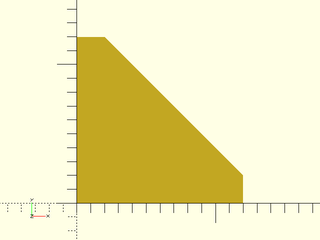

# LibFile: masks2d.scad

This file provides 2D masking shapes that you can use with [`edge_profile()`](attachments.scad#module-edge_profile) to mask edges.
The shapes include the simple roundover and chamfer as well as more elaborate shapes
like the cove and ogee found in furniture and architecture.  You can make the masks
as geometry or as 2D paths.

To use, add the following lines to the beginning of your file:

    include <BOSL2/std.scad>

## Table of Contents

1. [Section: 2D Masking Shapes](#section-2d-masking-shapes)
    - [`mask2d_roundover()`](#functionmodule-mask2d_roundover)
    - [`mask2d_cove()`](#functionmodule-mask2d_cove)
    - [`mask2d_chamfer()`](#functionmodule-mask2d_chamfer)
    - [`mask2d_rabbet()`](#functionmodule-mask2d_rabbet)
    - [`mask2d_dovetail()`](#functionmodule-mask2d_dovetail)
    - [`mask2d_teardrop()`](#functionmodule-mask2d_teardrop)
    - [`mask2d_ogee()`](#functionmodule-mask2d_ogee)

## Section: 2D Masking Shapes

### Function/Module: mask2d\_roundover()

**Usage:** As Module

- mask2d\_roundover(r|d, [inset], [excess]);

**Usage:** With Attachments

- mask2d\_roundover(r|d, [inset], [excess]) { attachments }

**Usage:** As Module

- path = mask2d\_roundover(r|d, [inset], [excess]);

**Topics:** [Shapes (2D)](Topics#shapes-2d), [Paths (2D)](Topics#paths-2d), [Path Generators](Topics#path-generators), [Attachable](Topics#attachable), [Masks (2D)](Topics#masks-2d)

**Description:** 

Creates a 2D roundover/bead mask shape that is useful for extruding into a 3D mask for a 90° edge.
This 2D mask is designed to be differenced away from the edge of a shape that is in the first (X+Y+) quadrant.
If called as a function, this just returns a 2D path of the outline of the mask shape.

**Arguments:** 

<abbr title="These args can be used by position or by name.">By&nbsp;Position</abbr> | What it does
-------------------- | ------------
`r`                  | Radius of the roundover.
`inset`              | Optional bead inset size.  Default: 0
`excess`             | Extra amount of mask shape to creates on the X- and Y- sides of the shape.  Default: 0.01

<abbr title="These args must be used by name, ie: name=value">By&nbsp;Name</abbr> | What it does
-------------------- | ------------
`d`                  | Diameter of the roundover.
`anchor`             | Translate so anchor point is at origin (0,0,0).  See [anchor](attachments.scad#subsection-anchor).  Default: `CENTER`
`spin`               | Rotate this many degrees around the Z axis after anchor.  See [spin](attachments.scad#subsection-spin).  Default: `0`

**See Also:** [corner\_profile()](attachments.scad#module-corner_profile), [edge\_profile()](attachments.scad#module-edge_profile), [face\_profile()](attachments.scad#module-face_profile)

**Example 1:** 2D Roundover Mask

    include <BOSL2/std.scad>
    mask2d_roundover(r=10);

  

**Example 2:** 2D Bead Mask

    include <BOSL2/std.scad>
    mask2d_roundover(r=10,inset=2);

  

**Example 3:** Masking by Edge Attachment

    include <BOSL2/std.scad>
    diff("mask")
    cube([50,60,70],center=true)
        edge_profile([TOP,"Z"],except=[BACK,TOP+LEFT])
            mask2d_roundover(r=10, inset=2);

  

---

### Function/Module: mask2d\_cove()

**Usage:** As Module

- mask2d\_cove(r|d, [inset], [excess]);

**Usage:** With Attachments

- mask2d\_cove(r|d, [inset], [excess]) { attachments }

**Usage:** As Function

- path = mask2d\_cove(r|d, [inset], [excess]);

**Topics:** [Shapes (2D)](Topics#shapes-2d), [Paths (2D)](Topics#paths-2d), [Path Generators](Topics#path-generators), [Attachable](Topics#attachable), [Masks (2D)](Topics#masks-2d)

**Description:** 

Creates a 2D cove mask shape that is useful for extruding into a 3D mask for a 90° edge.
This 2D mask is designed to be differenced away from the edge of a shape that is in the first (X+Y+) quadrant.
If called as a function, this just returns a 2D path of the outline of the mask shape.

**Arguments:** 

<abbr title="These args can be used by position or by name.">By&nbsp;Position</abbr> | What it does
-------------------- | ------------
`r`                  | Radius of the cove.
`inset`              | Optional amount to inset code from corner.  Default: 0
`excess`             | Extra amount of mask shape to creates on the X- and Y- sides of the shape.  Default: 0.01

<abbr title="These args must be used by name, ie: name=value">By&nbsp;Name</abbr> | What it does
-------------------- | ------------
`d`                  | Diameter of the cove.
`anchor`             | Translate so anchor point is at origin (0,0,0).  See [anchor](attachments.scad#subsection-anchor).  Default: `CENTER`
`spin`               | Rotate this many degrees around the Z axis after anchor.  See [spin](attachments.scad#subsection-spin).  Default: `0`

**See Also:** [corner\_profile()](attachments.scad#module-corner_profile), [edge\_profile()](attachments.scad#module-edge_profile), [face\_profile()](attachments.scad#module-face_profile)

**Example 1:** 2D Cove Mask

    include <BOSL2/std.scad>
    mask2d_cove(r=10);

  

**Example 2:** 2D Inset Cove Mask

    include <BOSL2/std.scad>
    mask2d_cove(r=10,inset=3);

  

**Example 3:** Masking by Edge Attachment

    include <BOSL2/std.scad>
    diff("mask")
    cube([50,60,70],center=true)
        edge_profile([TOP,"Z"],except=[BACK,TOP+LEFT])
            mask2d_cove(r=10, inset=2);

  

---

### Function/Module: mask2d\_chamfer()

**Usage:** As Module

- mask2d\_chamfer(edge, [angle], [inset], [excess]);
- mask2d\_chamfer(y, [angle], [inset], [excess]);
- mask2d\_chamfer(x, [angle], [inset], [excess]);

**Usage:** With Attachments

- mask2d\_chamfer(edge, [angle], [inset], [excess]) { attachments }

**Usage:** As Function

- path = mask2d\_chamfer(edge, [angle], [inset], [excess]);
- path = mask2d\_chamfer(y, [angle], [inset], [excess]);
- path = mask2d\_chamfer(x, [angle], [inset], [excess]);

**Topics:** [Shapes (2D)](Topics#shapes-2d), [Paths (2D)](Topics#paths-2d), [Path Generators](Topics#path-generators), [Attachable](Topics#attachable), [Masks (2D)](Topics#masks-2d)

**Description:** 

Creates a 2D chamfer mask shape that is useful for extruding into a 3D mask for a 90° edge.
This 2D mask is designed to be differenced away from the edge of a shape that is in the first (X+Y+) quadrant.
If called as a function, this just returns a 2D path of the outline of the mask shape.

**Arguments:** 

<abbr title="These args can be used by position or by name.">By&nbsp;Position</abbr> | What it does
-------------------- | ------------
`edge`               | The length of the edge of the chamfer.
`angle`              | The angle of the chamfer edge, away from vertical.  Default: 45.
`inset`              | Optional amount to inset code from corner.  Default: 0
`excess`             | Extra amount of mask shape to creates on the X- and Y- sides of the shape.  Default: 0.01

<abbr title="These args must be used by name, ie: name=value">By&nbsp;Name</abbr> | What it does
-------------------- | ------------
`x`                  | The width of the chamfer.
`y`                  | The height of the chamfer.
`anchor`             | Translate so anchor point is at origin (0,0,0).  See [anchor](attachments.scad#subsection-anchor).  Default: `CENTER`
`spin`               | Rotate this many degrees around the Z axis after anchor.  See [spin](attachments.scad#subsection-spin).  Default: `0`

**See Also:** [corner\_profile()](attachments.scad#module-corner_profile), [edge\_profile()](attachments.scad#module-edge_profile), [face\_profile()](attachments.scad#module-face_profile)

**Example 1:** 2D Chamfer Mask

    include <BOSL2/std.scad>
    mask2d_chamfer(x=10);

  

**Example 2:** 2D Chamfer Mask by Width.

    include <BOSL2/std.scad>
    mask2d_chamfer(x=10, angle=30);

  

**Example 3:** 2D Chamfer Mask by Height.

    include <BOSL2/std.scad>
    mask2d_chamfer(y=10, angle=30);

  

**Example 4:** 2D Inset Chamfer Mask

    include <BOSL2/std.scad>
    mask2d_chamfer(x=10, inset=2);

  

**Example 5:** Masking by Edge Attachment

    include <BOSL2/std.scad>
    diff("mask")
    cube([50,60,70],center=true)
        edge_profile([TOP,"Z"],except=[BACK,TOP+LEFT])
            mask2d_chamfer(x=10, inset=2);

  

---

### Function/Module: mask2d\_rabbet()

**Usage:** As Module

- mask2d\_rabbet(size, [excess]);

**Usage:** With Attachments

- mask2d\_rabbet(size, [excess]) { attachments }

**Usage:** As Function

- path = mask2d\_rabbet(size, [excess]);

**Topics:** [Shapes (2D)](Topics#shapes-2d), [Paths (2D)](Topics#paths-2d), [Path Generators](Topics#path-generators), [Attachable](Topics#attachable), [Masks (2D)](Topics#masks-2d)

**Description:** 

Creates a 2D rabbet mask shape that is useful for extruding into a 3D mask for a 90° edge.
This 2D mask is designed to be differenced away from the edge of a shape that is in the first (X+Y+) quadrant.
If called as a function, this just returns a 2D path of the outline of the mask shape.

**Arguments:** 

<abbr title="These args can be used by position or by name.">By&nbsp;Position</abbr> | What it does
-------------------- | ------------
`size`               | The size of the rabbet, either as a scalar or an [X,Y] list.
`excess`             | Extra amount of mask shape to creates on the X- and Y- sides of the shape. Default: 0.01

<abbr title="These args must be used by name, ie: name=value">By&nbsp;Name</abbr> | What it does
-------------------- | ------------
`anchor`             | Translate so anchor point is at origin (0,0,0).  See [anchor](attachments.scad#subsection-anchor).  Default: `CENTER`
`spin`               | Rotate this many degrees around the Z axis after anchor.  See [spin](attachments.scad#subsection-spin).  Default: `0`

**See Also:** [corner\_profile()](attachments.scad#module-corner_profile), [edge\_profile()](attachments.scad#module-edge_profile), [face\_profile()](attachments.scad#module-face_profile)

**Example 1:** 2D Rabbet Mask

    include <BOSL2/std.scad>
    mask2d_rabbet(size=10);

  

**Example 2:** 2D Asymmetrical Rabbet Mask

    include <BOSL2/std.scad>
    mask2d_rabbet(size=[5,10]);

  

**Example 3:** Masking by Edge Attachment

    include <BOSL2/std.scad>
    diff("mask")
    cube([50,60,70],center=true)
        edge_profile([TOP,"Z"],except=[BACK,TOP+LEFT])
            mask2d_rabbet(size=10);

  

---

### Function/Module: mask2d\_dovetail()

**Usage:** As Module

- mask2d\_dovetail(edge, [angle], [inset], [shelf], [excess], ...);
- mask2d\_dovetail(x=, [angle=], [inset=], [shelf=], [excess=], ...);
- mask2d\_dovetail(y=, [angle=], [inset=], [shelf=], [excess=], ...);

**Usage:** With Attachments

- mask2d\_dovetail(edge, [angle], [inset], [shelf], ...) { attachments }

**Usage:** As Function

- path = mask2d\_dovetail(edge, [angle], [inset], [shelf], [excess]);

**Topics:** [Shapes (2D)](Topics#shapes-2d), [Paths (2D)](Topics#paths-2d), [Path Generators](Topics#path-generators), [Attachable](Topics#attachable), [Masks (2D)](Topics#masks-2d)

**Description:** 

Creates a 2D dovetail mask shape that is useful for extruding into a 3D mask for a 90° edge.
This 2D mask is designed to be differenced away from the edge of a shape that is in the first (X+Y+) quadrant.
If called as a function, this just returns a 2D path of the outline of the mask shape.

**Arguments:** 

<abbr title="These args can be used by position or by name.">By&nbsp;Position</abbr> | What it does
-------------------- | ------------
`edge`               | The length of the edge of the dovetail.
`angle`              | The angle of the chamfer edge, away from vertical.  Default: 30.
`inset`              | Optional amount to inset code from corner.  Default: 0
`shelf`              | The extra height to add to the inside corner of the dovetail.  Default: 0
`excess`             | Extra amount of mask shape to creates on the X- and Y- sides of the shape.  Default: 0.01

<abbr title="These args must be used by name, ie: name=value">By&nbsp;Name</abbr> | What it does
-------------------- | ------------
`x`                  | The width of the dovetail.
`y`                  | The height of the dovetail.
`anchor`             | Translate so anchor point is at origin (0,0,0).  See [anchor](attachments.scad#subsection-anchor).  Default: `CENTER`
`spin`               | Rotate this many degrees around the Z axis after anchor.  See [spin](attachments.scad#subsection-spin).  Default: `0`

**See Also:** [corner\_profile()](attachments.scad#module-corner_profile), [edge\_profile()](attachments.scad#module-edge_profile), [face\_profile()](attachments.scad#module-face_profile)

**Example 1:** 2D Dovetail Mask

    include <BOSL2/std.scad>
    mask2d_dovetail(x=10);

  

**Example 2:** 2D Dovetail Mask by Width.

    include <BOSL2/std.scad>
    mask2d_dovetail(x=10, angle=30);

  

**Example 3:** 2D Dovetail Mask by Height.

    include <BOSL2/std.scad>
    mask2d_dovetail(y=10, angle=30);

  

**Example 4:** 2D Inset Dovetail Mask

    include <BOSL2/std.scad>
    mask2d_dovetail(x=10, inset=2);

  

**Example 5:** Masking by Edge Attachment

    include <BOSL2/std.scad>
    diff("mask")
    cube([50,60,70],center=true)
        edge_profile([TOP,"Z"],except=[BACK,TOP+LEFT])
            mask2d_dovetail(x=10, inset=2);

  

---

### Function/Module: mask2d\_teardrop()

**Usage:** As Module

- mask2d\_teardrop(r|d, [angle], [excess]);

**Usage:** With Attachments

- mask2d\_teardrop(r|d, [angle], [excess]) { attachments }

**Usage:** As Function

- path = mask2d\_teardrop(r|d, [angle], [excess]);

**Topics:** [Shapes (2D)](Topics#shapes-2d), [Paths (2D)](Topics#paths-2d), [Path Generators](Topics#path-generators), [Attachable](Topics#attachable), [Masks (2D)](Topics#masks-2d)

**Description:** 

Creates a 2D teardrop mask shape that is useful for extruding into a 3D mask for a 90° edge.
This 2D mask is designed to be differenced away from the edge of a shape that is in the first (X+Y+) quadrant.
If called as a function, this just returns a 2D path of the outline of the mask shape.
This is particularly useful to make partially rounded bottoms, that don't need support to print.

**Arguments:** 

<abbr title="These args can be used by position or by name.">By&nbsp;Position</abbr> | What it does
-------------------- | ------------
`r`                  | Radius of the rounding.
`angle`              | The maximum angle from vertical.
`excess`             | Extra amount of mask shape to creates on the X- and Y- sides of the shape. Default: 0.01

<abbr title="These args must be used by name, ie: name=value">By&nbsp;Name</abbr> | What it does
-------------------- | ------------
`d`                  | Diameter of the rounding.
`anchor`             | Translate so anchor point is at origin (0,0,0).  See [anchor](attachments.scad#subsection-anchor).  Default: `CENTER`
`spin`               | Rotate this many degrees around the Z axis after anchor.  See [spin](attachments.scad#subsection-spin).  Default: `0`

**See Also:** [corner\_profile()](attachments.scad#module-corner_profile), [edge\_profile()](attachments.scad#module-edge_profile), [face\_profile()](attachments.scad#module-face_profile)

**Example 1:** 2D Teardrop Mask

    include <BOSL2/std.scad>
    mask2d_teardrop(r=10);

  

**Example 2:** Using a Custom Angle

    include <BOSL2/std.scad>
    mask2d_teardrop(r=10,angle=30);

  

**Example 3:** Masking by Edge Attachment

    include <BOSL2/std.scad>
    diff("mask")
    cube([50,60,70],center=true)
        edge_profile(BOT)
            mask2d_teardrop(r=10, angle=40);

  

---

### Function/Module: mask2d\_ogee()

**Usage:** As Module

- mask2d\_ogee(pattern, [excess], ...);

**Usage:** With Attachments

- mask2d\_ogee(pattern, [excess], ...) { attachments }

**Usage:** As Function

- path = mask2d\_ogee(pattern, [excess], ...);

**Topics:** [Shapes (2D)](Topics#shapes-2d), [Paths (2D)](Topics#paths-2d), [Path Generators](Topics#path-generators), [Attachable](Topics#attachable), [Masks (2D)](Topics#masks-2d)

**Description:** 

Creates a 2D Ogee mask shape that is useful for extruding into a 3D mask for a 90° edge.
This 2D mask is designed to be `difference()`d  away from the edge of a shape that is in the first (X+Y+) quadrant.
Since there are a number of shapes that fall under the name ogee, the shape of this mask is given as a pattern.
Patterns are given as TYPE, VALUE pairs.  ie: `["fillet",10, "xstep",2, "step",[5,5], ...]`.  See Patterns below.
If called as a function, this just returns a 2D path of the outline of the mask shape.

### Patterns

Type     | Argument  | Description
-------- | --------- | ----------------
"step"   | [x,y]     | Makes a line to a point `x` right and `y` down.
"xstep"  | dist      | Makes a `dist` length line towards X+.
"ystep"  | dist      | Makes a `dist` length line towards Y-.
"round"  | radius    | Makes an arc that will mask a roundover.
"fillet" | radius    | Makes an arc that will mask a fillet.

**Arguments:** 

<abbr title="These args can be used by position or by name.">By&nbsp;Position</abbr> | What it does
-------------------- | ------------
`pattern`            | A list of pattern pieces to describe the Ogee.
`excess`             | Extra amount of mask shape to creates on the X- and Y- sides of the shape. Default: 0.01

<abbr title="These args must be used by name, ie: name=value">By&nbsp;Name</abbr> | What it does
-------------------- | ------------
`anchor`             | Translate so anchor point is at origin (0,0,0).  See [anchor](attachments.scad#subsection-anchor).  Default: `CENTER`
`spin`               | Rotate this many degrees around the Z axis after anchor.  See [spin](attachments.scad#subsection-spin).  Default: `0`

**See Also:** [corner\_profile()](attachments.scad#module-corner_profile), [edge\_profile()](attachments.scad#module-edge_profile), [face\_profile()](attachments.scad#module-face_profile)

**Example 1:** 2D Ogee Mask

    include <BOSL2/std.scad>
    mask2d_ogee([
        "xstep",1,  "ystep",1,  // Starting shoulder.
        "fillet",5, "round",5,  // S-curve.
        "ystep",1,  "xstep",1   // Ending shoulder.
    ]);

  

**Example 2:** Masking by Edge Attachment

    include <BOSL2/std.scad>
    diff("mask")
    cube([50,60,70],center=true)
        edge_profile(TOP)
            mask2d_ogee([
                "xstep",1,  "ystep",1,  // Starting shoulder.
                "fillet",5, "round",5,  // S-curve.
                "ystep",1,  "xstep",1   // Ending shoulder.
            ]);

  

---

