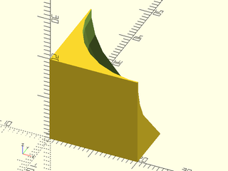

# LibFile: masks3d.scad

This file defines 3D masks for applying chamfers, roundovers, and teardrop roundovers to straight edges and circular
edges in three dimensions.

To use, add the following lines to the beginning of your file:

    include <BOSL2/std.scad>

## Table of Contents

1. [Section: Chamfer Masks](#section-chamfer-masks)
    - [`chamfer_edge_mask()`](#module-chamfer_edge_mask)
    - [`chamfer_corner_mask()`](#module-chamfer_corner_mask)
    - [`chamfer_cylinder_mask()`](#module-chamfer_cylinder_mask)

2. [Section: Rounding Masks](#section-rounding-masks)
    - [`rounding_edge_mask()`](#module-rounding_edge_mask)
    - [`rounding_corner_mask()`](#module-rounding_corner_mask)
    - [`rounding_angled_edge_mask()`](#module-rounding_angled_edge_mask)
    - [`rounding_angled_corner_mask()`](#module-rounding_angled_corner_mask)
    - [`rounding_cylinder_mask()`](#module-rounding_cylinder_mask)
    - [`rounding_hole_mask()`](#module-rounding_hole_mask)

3. [Section: Teardrop Masking](#section-teardrop-masking)
    - [`teardrop_edge_mask()`](#module-teardrop_edge_mask)
    - [`teardrop_corner_mask()`](#module-teardrop_corner_mask)

## Section: Chamfer Masks

### Module: chamfer\_edge\_mask()

**Usage:** 

- chamfer\_edge\_mask(l, chamfer, [excess]);

**Description:** 

Creates a shape that can be used to chamfer a 90 degree edge.
Difference it from the object to be chamfered.  The center of
the mask object should align exactly with the edge to be chamfered.

**Arguments:** 

<abbr title="These args can be used by position or by name.">By&nbsp;Position</abbr> | What it does
-------------------- | ------------
`l`                  | Length of mask.
`chamfer`            | Size of chamfer.
`excess`             | The extra amount to add to the length of the mask so that it differences away from other shapes cleanly.  Default: `0.1`
`anchor`             | Translate so anchor point is at origin (0,0,0).  See [anchor](attachments.scad#subsection-anchor).  Default: `CENTER`
`spin`               | Rotate this many degrees around the Z axis after anchor.  See [spin](attachments.scad#subsection-spin).  Default: `0`
`orient`             | Vector to rotate top towards, after spin.  See [orient](attachments.scad#subsection-orient).  Default: `UP`

**Example 1:** 

    include <BOSL2/std.scad>
    chamfer_edge_mask(l=50, chamfer=10);

  

**Example 2:** 

    include <BOSL2/std.scad>
    difference() {
        cube(50, anchor=BOTTOM+FRONT);
        #chamfer_edge_mask(l=50, chamfer=10, orient=RIGHT);
    }

  

**Example 3:** Masking by Attachment

    include <BOSL2/std.scad>
    diff("mask")
    cube(50, center=true) {
        edge_mask(TOP+RIGHT)
            #chamfer_edge_mask(l=50, chamfer=10);
    }

  

---

### Module: chamfer\_corner\_mask()

**Usage:** 

- chamfer\_corner\_mask(chamfer);

**Description:** 

Creates a shape that can be used to chamfer a 90 degree corner.
Difference it from the object to be chamfered.  The center of
the mask object should align exactly with the corner to be chamfered.

**Arguments:** 

<abbr title="These args can be used by position or by name.">By&nbsp;Position</abbr> | What it does
-------------------- | ------------
`chamfer`            | Size of chamfer.

<abbr title="These args must be used by name, ie: name=value">By&nbsp;Name</abbr> | What it does
-------------------- | ------------
`anchor`             | Translate so anchor point is at origin (0,0,0).  See [anchor](attachments.scad#subsection-anchor).  Default: `CENTER`
`spin`               | Rotate this many degrees around the Z axis after anchor.  See [spin](attachments.scad#subsection-spin).  Default: `0`
`orient`             | Vector to rotate top towards, after spin.  See [orient](attachments.scad#subsection-orient).  Default: `UP`

**Example 1:** 

    include <BOSL2/std.scad>
    chamfer_corner_mask(chamfer=10);

  

**Example 2:** 

    include <BOSL2/std.scad>
    difference() {
        cuboid(50, chamfer=10, trimcorners=false);
        move(25*[1,-1,1]) #chamfer_corner_mask(chamfer=10);
    }

  

**Example 3:** Masking by Attachment

    include <BOSL2/std.scad>
    diff("mask")
    cuboid(100, chamfer=20, trimcorners=false) {
        corner_mask(TOP+FWD+RIGHT)
            chamfer_corner_mask(chamfer=20);
    }

  

**Example 4:** Anchors

    include <BOSL2/std.scad>
    chamfer_corner_mask(chamfer=20)
        show_anchors();

  

---

### Module: chamfer\_cylinder\_mask()

**Usage:** 

- chamfer\_cylinder\_mask(r|d, chamfer, [ang], [from\_end])

**Description:** 

Create a mask that can be used to bevel/chamfer the end of a cylindrical region.
Difference it from the end of the region to be chamfered.  The center of the mask
object should align exactly with the center of the end of the cylindrical region
to be chamfered.

**Arguments:** 

<abbr title="These args can be used by position or by name.">By&nbsp;Position</abbr> | What it does
-------------------- | ------------
`r`                  | Radius of cylinder to chamfer.
`d`                  | Diameter of cylinder to chamfer. Use instead of r.
`chamfer`            | Size of the edge chamfered, inset from edge. (Default: 0.25)
`ang`                | Angle of chamfer in degrees from vertical.  (Default: 45)
`from_end`           | If true, chamfer size is measured from end of cylinder.  If false, chamfer is measured outset from the radius of the cylinder.  (Default: false)
`anchor`             | Translate so anchor point is at origin (0,0,0).  See [anchor](attachments.scad#subsection-anchor).  Default: `CENTER`
`spin`               | Rotate this many degrees around the Z axis after anchor.  See [spin](attachments.scad#subsection-spin).  Default: `0`
`orient`             | Vector to rotate top towards, after spin.  See [orient](attachments.scad#subsection-orient).  Default: `UP`

**Example 1:** 

    include <BOSL2/std.scad>
    difference() {
        cylinder(r=50, h=100, center=true);
        up(50) #chamfer_cylinder_mask(r=50, chamfer=10);
    }

  

**Example 2:** 

    include <BOSL2/std.scad>
    difference() {
        cylinder(r=50, h=100, center=true);
        up(50) chamfer_cylinder_mask(r=50, chamfer=10);
    }

  

**Example 3:** Masking by Attachment

    include <BOSL2/std.scad>

  

---

## Section: Rounding Masks

### Module: rounding\_edge\_mask()

**Usage:** 

- rounding\_edge\_mask(l|h, r|d)
- rounding\_edge\_mask(l|h, r1|d1, r2|d2)

**Description:** 

Creates a shape that can be used to round a vertical 90 degree edge.
Difference it from the object to be rounded.  The center of the mask
object should align exactly with the edge to be rounded.

**Arguments:** 

<abbr title="These args can be used by position or by name.">By&nbsp;Position</abbr> | What it does
-------------------- | ------------
`l`                  | Length of mask.
`r`                  | Radius of the rounding.
`r1`                 | Bottom radius of rounding.
`r2`                 | Top radius of rounding.
`d`                  | Diameter of the rounding.
`d1`                 | Bottom diameter of rounding.
`d2`                 | Top diameter of rounding.
`excess`             | Extra size for the mask.  Defaults: 0.1
`anchor`             | Translate so anchor point is at origin (0,0,0).  See [anchor](attachments.scad#subsection-anchor).  Default: `CENTER`
`spin`               | Rotate this many degrees around the Z axis after anchor.  See [spin](attachments.scad#subsection-spin).  Default: `0`
`orient`             | Vector to rotate top towards, after spin.  See [orient](attachments.scad#subsection-orient).  Default: `UP`

**Example 1:** 

    include <BOSL2/std.scad>
    rounding_edge_mask(l=50, r1=10, r2=25);

  

**Example 2:** 

 

    include <BOSL2/std.scad>
    difference() {
        cube(size=100, center=false);
        #rounding_edge_mask(l=100, r=25, orient=UP, anchor=BOTTOM);
    }

**Example 3:** Varying Rounding Radius

 

    include <BOSL2/std.scad>
    difference() {
        cube(size=50, center=false);
        #rounding_edge_mask(l=50, r1=25, r2=10, orient=UP, anchor=BOTTOM);
    }

**Example 4:** Masking by Attachment

    include <BOSL2/std.scad>
    diff("mask")
    cube(100, center=true)
        edge_mask(FRONT+RIGHT)
            #rounding_edge_mask(l=$parent_size.z+0.01, r=25);

  

**Example 5:** Multiple Masking by Attachment

    include <BOSL2/std.scad>
    diff("mask")
    cube([80,90,100], center=true) {
        let(p = $parent_size*1.01) {
            edge_mask(TOP)
                rounding_edge_mask(l=p.z, r=25);
        }
    }

  

---

### Module: rounding\_corner\_mask()

**Usage:** 

- rounding\_corner\_mask(r|d, [excess=], [style=]);

**Description:** 

Creates a shape that you can use to round 90 degree corners.
Difference it from the object to be rounded.  The center of the mask
object should align exactly with the corner to be rounded.

**Arguments:** 

<abbr title="These args can be used by position or by name.">By&nbsp;Position</abbr> | What it does
-------------------- | ------------
`r`                  | Radius of corner rounding.
`d`                  | Diameter of corner rounding.

<abbr title="These args must be used by name, ie: name=value">By&nbsp;Name</abbr> | What it does
-------------------- | ------------
`excess`             | Extra size for the mask.  Defaults: 0.1
`style`              | The style of the sphere cutout's construction. One of "orig", "aligned", "stagger", "octa", or "icosa".  Default: "octa"
`anchor`             | Translate so anchor point is at origin (0,0,0).  See [anchor](attachments.scad#subsection-anchor).  Default: `CENTER`
`spin`               | Rotate this many degrees around the Z axis after anchor.  See [spin](attachments.scad#subsection-spin).  Default: `0`
`orient`             | Vector to rotate top towards, after spin.  See [orient](attachments.scad#subsection-orient).  Default: `UP`

**Example 1:** 

    include <BOSL2/std.scad>
    rounding_corner_mask(r=20.0);

  

**Example 2:** 

    include <BOSL2/std.scad>
    difference() {
        cube(size=[50, 60, 70], center=true);
        translate([-25, -30, 35])
            #rounding_corner_mask(r=20, spin=90, orient=DOWN);
        translate([25, -30, 35])
            #rounding_corner_mask(r=20, orient=DOWN);
        translate([25, -30, -35])
            #rounding_corner_mask(r=20, spin=90);
    }

  

**Example 3:** Masking by Attachment

    include <BOSL2/std.scad>
    diff("mask")
    cube(size=[50, 60, 70]) {
        corner_mask(TOP)
            #rounding_corner_mask(r=20);
    }

  

---

### Module: rounding\_angled\_edge\_mask()

**Usage:** 

- rounding\_angled\_edge\_mask(h, r|d, [ang]);
- rounding\_angled\_edge\_mask(h, r1|d1, r2|d2, [ang]);

**Description:** 

Creates a vertical mask that can be used to round the edge where two face meet, at any arbitrary
angle.  Difference it from the object to be rounded.  The center of the mask should align exactly
with the edge to be rounded.

**Arguments:** 

<abbr title="These args can be used by position or by name.">By&nbsp;Position</abbr> | What it does
-------------------- | ------------
`h`                  | Height of vertical mask.
`r`                  | Radius of the rounding.
`r1`                 | Bottom radius of rounding.
`r2`                 | Top radius of rounding.
`d`                  | Diameter of the rounding.
`d1`                 | Bottom diameter of rounding.
`d2`                 | Top diameter of rounding.
`ang`                | Angle that the planes meet at.
`anchor`             | Translate so anchor point is at origin (0,0,0).  See [anchor](attachments.scad#subsection-anchor).  Default: `CENTER`
`spin`               | Rotate this many degrees around the Z axis after anchor.  See [spin](attachments.scad#subsection-spin).  Default: `0`
`orient`             | Vector to rotate top towards, after spin.  See [orient](attachments.scad#subsection-orient).  Default: `UP`

**Example 1:** 

    include <BOSL2/std.scad>
    difference() {
        pie_slice(ang=70, h=50, d=100, center=true);
        #rounding_angled_edge_mask(h=51, r=20.0, ang=70, $fn=32);
    }

  

**Example 2:** Varying Rounding Radius

 

    include <BOSL2/std.scad>
    difference() {
        pie_slice(ang=70, h=50, d=100, center=true);
        #rounding_angled_edge_mask(h=51, r1=10, r2=25, ang=70, $fn=32);
    }

---

### Module: rounding\_angled\_corner\_mask()

**Usage:** 

- rounding\_angled\_corner\_mask(r|d, ang);

**Description:** 

Creates a shape that can be used to round the corner of an angle.
Difference it from the object to be rounded.  The center of the mask
object should align exactly with the point of the corner to be rounded.

**Arguments:** 

<abbr title="These args can be used by position or by name.">By&nbsp;Position</abbr> | What it does
-------------------- | ------------
`r`                  | Radius of the rounding.
`d`                  | Diameter of the rounding.
`ang`                | Angle between planes that you need to round the corner of.
`anchor`             | Translate so anchor point is at origin (0,0,0).  See [anchor](attachments.scad#subsection-anchor).  Default: `CENTER`
`spin`               | Rotate this many degrees around the Z axis after anchor.  See [spin](attachments.scad#subsection-spin).  Default: `0`
`orient`             | Vector to rotate top towards, after spin.  See [orient](attachments.scad#subsection-orient).  Default: `UP`

**Example 1:** 

 

    include <BOSL2/std.scad>
    ang=60;
    difference() {
        pie_slice(ang=ang, h=50, r=200, center=true);
        up(50/2) #rounding_angled_corner_mask(r=20, ang=ang);
    }

---

### Module: rounding\_cylinder\_mask()

**Usage:** 

- rounding\_cylinder\_mask(r|d, rounding);

**Description:** 

Create a mask that can be used to round the end of a cylinder.
Difference it from the cylinder to be rounded.  The center of the
mask object should align exactly with the center of the end of the
cylinder to be rounded.

**Arguments:** 

<abbr title="These args can be used by position or by name.">By&nbsp;Position</abbr> | What it does
-------------------- | ------------
`r`                  | Radius of cylinder. (Default: 1.0)
`d`                  | Diameter of cylinder. (Default: 1.0)
`rounding`           | Radius of the edge rounding. (Default: 0.25)

**Example 1:** 

    include <BOSL2/std.scad>
    difference() {
      cylinder(r=50, h=50, center=false);
      up(50) #rounding_cylinder_mask(r=50, rounding=10);
    }

  

**Example 2:** 

    include <BOSL2/std.scad>
    difference() {
      cylinder(r=50, h=50, center=false);
      up(50) rounding_cylinder_mask(r=50, rounding=10);
    }

  

**Example 3:** Masking by Attachment

 

    include <BOSL2/std.scad>
    diff("mask")
    cyl(h=30, d=30) {
        attach(TOP)
            #rounding_cylinder_mask(d=30, rounding=5, $tags="mask");
    }

---

### Module: rounding\_hole\_mask()

**Usage:** 

- rounding\_hole\_mask(r|d, rounding, [excess]);

**Description:** 

Create a mask that can be used to round the edge of a circular hole.
Difference it from the hole to be rounded.  The center of the
mask object should align exactly with the center of the end of the
hole to be rounded.

**Arguments:** 

<abbr title="These args can be used by position or by name.">By&nbsp;Position</abbr> | What it does
-------------------- | ------------
`r`                  | Radius of hole.
`d`                  | Diameter of hole to rounding.
`rounding`           | Radius of the rounding. (Default: 0.25)
`excess`             | The extra thickness of the mask.  Default: `0.1`.
`anchor`             | Translate so anchor point is at origin (0,0,0).  See [anchor](attachments.scad#subsection-anchor).  Default: `CENTER`
`spin`               | Rotate this many degrees around the Z axis after anchor.  See [spin](attachments.scad#subsection-spin).  Default: `0`
`orient`             | Vector to rotate top towards, after spin.  See [orient](attachments.scad#subsection-orient).  Default: `UP`

**Example 1:** 

    include <BOSL2/std.scad>
    rounding_hole_mask(r=40, rounding=20, $fa=2, $fs=2);

  

**Example 2:** 

 

    include <BOSL2/std.scad>
    difference() {
      cube([150,150,100], center=true);
      cylinder(r=50, h=100.1, center=true);
      up(50) #rounding_hole_mask(r=50, rounding=10);
    }

**Example 3:** 

 

    include <BOSL2/std.scad>
    difference() {
      cube([150,150,100], center=true);
      cylinder(r=50, h=100.1, center=true);
      up(50) rounding_hole_mask(r=50, rounding=10);
    }

---

## Section: Teardrop Masking

### Module: teardrop\_edge\_mask()

**Usage:** 

- teardrop\_edge\_mask(r|d, [angle], [excess]);

**Description:** 

Makes an apropriate 3D corner rounding mask that keeps within `angle` degrees of vertical.

**Arguments:** 

<abbr title="These args can be used by position or by name.">By&nbsp;Position</abbr> | What it does
-------------------- | ------------
`r`                  | Radius of the mask rounding.
`d`                  | Diameter of the mask rounding.
`angle`              | Maximum angle from vertical. Default: 45
`excess`             | Excess mask size.  Default: 0.1
`anchor`             | Translate so anchor point is at origin (0,0,0).  See [anchor](attachments.scad#subsection-anchor).  Default: `CENTER`
`spin`               | Rotate this many degrees around the Z axis after anchor.  See [spin](attachments.scad#subsection-spin).  Default: `0`
`orient`             | Vector to rotate top towards, after spin.  See [orient](attachments.scad#subsection-orient).  Default: `UP`

**Example 1:** 

    include <BOSL2/std.scad>
    teardrop_edge_mask(l=20, r=10, angle=40);

  

**Example 2:** 

 

    include <BOSL2/std.scad>
    diff("mask")
    cuboid([50,60,70],rounding=10,edges="Z",anchor=CENTER) {
        edge_mask(BOT)
            teardrop_edge_mask(l=max($parent_size)+1, r=10, angle=40);
        corner_mask(BOT)
            teardrop_corner_mask(r=10, angle=40);
    }

---

### Module: teardrop\_corner\_mask()

**Usage:** 

- teardrop\_corner\_mask(r|d, [angle], [excess]);

**Description:** 

Makes an apropriate 3D corner rounding mask that keeps within `angle` degrees of vertical.

**Arguments:** 

<abbr title="These args can be used by position or by name.">By&nbsp;Position</abbr> | What it does
-------------------- | ------------
`r`                  | Radius of the mask rounding.
`d`                  | Diameter of the mask rounding.
`angle`              | Maximum angle from vertical. Default: 45
`excess`             | Excess mask size.  Default: 0.1
`anchor`             | Translate so anchor point is at origin (0,0,0).  See [anchor](attachments.scad#subsection-anchor).  Default: `CENTER`
`spin`               | Rotate this many degrees around the Z axis after anchor.  See [spin](attachments.scad#subsection-spin).  Default: `0`
`orient`             | Vector to rotate top towards, after spin.  See [orient](attachments.scad#subsection-orient).  Default: `UP`

**Example 1:** 

    include <BOSL2/std.scad>
    teardrop_corner_mask(r=20, angle=40);

  

**Example 2:** 

    include <BOSL2/std.scad>
    diff("mask")
    cuboid([50,60,70],rounding=10,edges="Z",anchor=CENTER) {
        edge_profile(BOT)
            mask2d_teardrop(r=10, angle=40);
        corner_mask(BOT)
            teardrop_corner_mask(r=10, angle=40);
    }

  

---

