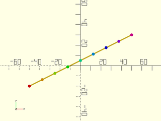

# LibFile: math.scad

Math helper functions.

To use, add the following lines to the beginning of your file:

    include <BOSL2/std.scad>

## Table of Contents

1. [Section: Math Constants](#section-math-constants)
    - [`PHI`](#constant-phi)
    - [`EPSILON`](#constant-epsilon)
    - [`INF`](#constant-inf)
    - [`NAN`](#constant-nan)

2. [Section: Simple math](#section-simple-math)
    - [`sqr()`](#function-sqr)
    - [`log2()`](#function-log2)
    - [`hypot()`](#function-hypot)
    - [`factorial()`](#function-factorial)
    - [`binomial()`](#function-binomial)
    - [`binomial_coefficient()`](#function-binomial_coefficient)
    - [`lerp()`](#function-lerp)
    - [`lerpn()`](#function-lerpn)

3. [Section: Undef Safe Math](#section-undef-safe-math)
    - [`u_add()`](#function-u_add)
    - [`u_sub()`](#function-u_sub)
    - [`u_mul()`](#function-u_mul)
    - [`u_div()`](#function-u_div)

4. [Section: Hyperbolic Trigonometry](#section-hyperbolic-trigonometry)
    - [`sinh()`](#function-sinh)
    - [`cosh()`](#function-cosh)
    - [`tanh()`](#function-tanh)
    - [`asinh()`](#function-asinh)
    - [`acosh()`](#function-acosh)
    - [`atanh()`](#function-atanh)

5. [Section: Quantization](#section-quantization)
    - [`quant()`](#function-quant)
    - [`quantdn()`](#function-quantdn)
    - [`quantup()`](#function-quantup)

6. [Section: Constraints and Modulos](#section-constraints-and-modulos)
    - [`constrain()`](#function-constrain)
    - [`posmod()`](#function-posmod)
    - [`modang()`](#function-modang)

7. [Section: Random Number Generation](#section-random-number-generation)
    - [`rand_int()`](#function-rand_int)
    - [`random_points()`](#function-random_points)
    - [`gaussian_rands()`](#function-gaussian_rands)
    - [`spherical_random_points()`](#function-spherical_random_points)
    - [`random_polygon()`](#function-random_polygon)

8. [Section: GCD/GCF, LCM](#section-gcdgcf-lcm)
    - [`gcd()`](#function-gcd)
    - [`lcm()`](#function-lcm)

9. [Section: Sums, Products, Aggregate Functions.](#section-sums-products-aggregate-functions)
    - [`sum()`](#function-sum)
    - [`cumsum()`](#function-cumsum)
    - [`sum_of_sines()`](#function-sum_of_sines)
    - [`deltas()`](#function-deltas)
    - [`product()`](#function-product)
    - [`cumprod()`](#function-cumprod)
    - [`mean()`](#function-mean)
    - [`median()`](#function-median)
    - [`convolve()`](#function-convolve)
    - [`all_integer()`](#function-all_integer)
    - [`any()`](#function-any)
    - [`all()`](#function-all)
    - [`count_true()`](#function-count_true)

10. [Section: Calculus](#section-calculus)
    - [`deriv()`](#function-deriv)
    - [`deriv2()`](#function-deriv2)
    - [`deriv3()`](#function-deriv3)

11. [Section: Complex Numbers](#section-complex-numbers)
    - [`complex()`](#function-complex)
    - [`c_mul()`](#function-c_mul)
    - [`c_div()`](#function-c_div)
    - [`c_conj()`](#function-c_conj)
    - [`c_real()`](#function-c_real)
    - [`c_imag()`](#function-c_imag)
    - [`c_ident()`](#function-c_ident)
    - [`c_norm()`](#function-c_norm)

12. [Section: Polynomials](#section-polynomials)
    - [`quadratic_roots()`](#function-quadratic_roots)
    - [`polynomial()`](#function-polynomial)
    - [`poly_mult()`](#function-poly_mult)
    - [`poly_div()`](#function-poly_div)
    - [`poly_add()`](#function-poly_add)
    - [`poly_roots()`](#function-poly_roots)
    - [`real_roots()`](#function-real_roots)

13. [Section: Operations on Functions](#section-operations-on-functions)
    - [`root_find()`](#function-root_find)

## Section: Math Constants

### Constant: PHI

**Description:** 

The golden ratio phi.

---

### Constant: EPSILON

**Description:** 

A really small value useful in comparing floating point numbers.  ie: abs(a-b)<EPSILON

---

### Constant: INF

**Description:** 

The value `inf`, useful for comparisons.

---

### Constant: NAN

**Description:** 

The value `nan`, useful for comparisons.

---

## Section: Simple math

### Function: sqr()

**Usage:** 

- x2 = sqr(x);

**Description:** 

If given a number, returns the square of that number,
If given a vector, returns the sum-of-squares/dot product of the vector elements.
If given a matrix, returns the matrix multiplication of the matrix with itself.

**Example 1:** 

    include <BOSL2/std.scad>
    sqr(3);     // Returns: 9
    sqr(-4);    // Returns: 16
    sqr([2,3,4]); // Returns: 29
    sqr([[1,2],[3,4]]);  // Returns [[7,10],[15,22]]

  

---

### Function: log2()

**Usage:** 

- foo = log2(x);

**Description:** 

Returns the logarithm base 2 of the value given.

**Example 1:** 

    include <BOSL2/std.scad>
    log2(0.125);  // Returns: -3
    log2(16);     // Returns: 4
    log2(256);    // Returns: 8

  

---

### Function: hypot()

**Usage:** 

- l = hypot(x, y, [z]);

**Description:** 

Calculate hypotenuse length of a 2D or 3D triangle.

**Arguments:** 

<abbr title="These args can be used by position or by name.">By&nbsp;Position</abbr> | What it does
-------------------- | ------------
`x`                  | Length on the X axis.
`y`                  | Length on the Y axis.
`z`                  | Length on the Z axis.  Optional.

**Example 1:** 

    include <BOSL2/std.scad>
    l = hypot(3,4);  // Returns: 5
    l = hypot(3,4,5);  // Returns: ~7.0710678119

  

---

### Function: factorial()

**Usage:** 

- x = factorial(n, [d]);

**Description:** 

Returns the factorial of the given integer value, or n!/d! if d is given.

**Arguments:** 

<abbr title="These args can be used by position or by name.">By&nbsp;Position</abbr> | What it does
-------------------- | ------------
`n`                  | The integer number to get the factorial of.  (n!)
`d`                  | If given, the returned value will be (n! / d!)

**Example 1:** 

    include <BOSL2/std.scad>
    x = factorial(4);  // Returns: 24
    y = factorial(6);  // Returns: 720
    z = factorial(9);  // Returns: 362880

  

---

### Function: binomial()

**Usage:** 

- x = binomial(n);

**Description:** 

Returns the binomial coefficients of the integer `n`.

**Arguments:** 

<abbr title="These args can be used by position or by name.">By&nbsp;Position</abbr> | What it does
-------------------- | ------------
`n`                  | The integer to get the binomial coefficients of

**Example 1:** 

    include <BOSL2/std.scad>
    x = binomial(3);  // Returns: [1,3,3,1]
    y = binomial(4);  // Returns: [1,4,6,4,1]
    z = binomial(6);  // Returns: [1,6,15,20,15,6,1]

  

---

### Function: binomial\_coefficient()

**Usage:** 

- x = binomial\_coefficient(n, k);

**Description:** 

Returns the k-th binomial coefficient of the integer `n`.

**Arguments:** 

<abbr title="These args can be used by position or by name.">By&nbsp;Position</abbr> | What it does
-------------------- | ------------
`n`                  | The integer to get the binomial coefficient of
`k`                  | The binomial coefficient index

**Example 1:** 

    include <BOSL2/std.scad>
    x = binomial_coefficient(3,2);  // Returns: 3
    y = binomial_coefficient(10,6); // Returns: 210

  

---

### Function: lerp()

**Usage:** 

- x = lerp(a, b, u);
- l = lerp(a, b, LIST);

**Description:** 

Interpolate between two values or vectors.
If `u` is given as a number, returns the single interpolated value.
If `u` is 0.0, then the value of `a` is returned.
If `u` is 1.0, then the value of `b` is returned.
If `u` is a range, or list of numbers, returns a list of interpolated values.
It is valid to use a `u` value outside the range 0 to 1.  The result will be an extrapolation
along the slope formed by `a` and `b`.

**Arguments:** 

<abbr title="These args can be used by position or by name.">By&nbsp;Position</abbr> | What it does
-------------------- | ------------
`a`                  | First value or vector.
`b`                  | Second value or vector.
`u`                  | The proportion from `a` to `b` to calculate.  Standard range is 0.0 to 1.0, inclusive.  If given as a list or range of values, returns a list of results.

**Example 1:** 

    include <BOSL2/std.scad>
    x = lerp(0,20,0.3);  // Returns: 6
    x = lerp(0,20,0.8);  // Returns: 16
    x = lerp(0,20,-0.1); // Returns: -2
    x = lerp(0,20,1.1);  // Returns: 22
    p = lerp([0,0],[20,10],0.25);  // Returns [5,2.5]
    l = lerp(0,20,[0.4,0.6]);  // Returns: [8,12]
    l = lerp(0,20,[0.25:0.25:0.75]);  // Returns: [5,10,15]

  

**Example 2:** 

    include <BOSL2/std.scad>
    p1 = [-50,-20];  p2 = [50,30];
    stroke([p1,p2]);
    pts = lerp(p1, p2, [0:1/8:1]);
    // Points colored in ROYGBIV order.
    rainbow(pts) translate($item) circle(d=3,$fn=8);

  

---

### Function: lerpn()

**Usage:** 

- x = lerpn(a, b, n);
- x = lerpn(a, b, n, [endpoint]);

**Description:** 

Returns exactly `n` values, linearly interpolated between `a` and `b`.
If `endpoint` is true, then the last value will exactly equal `b`.
If `endpoint` is false, then the last value will about `a+(b-a)*(1-1/n)`.

**Arguments:** 

<abbr title="These args can be used by position or by name.">By&nbsp;Position</abbr> | What it does
-------------------- | ------------
`a`                  | First value or vector.
`b`                  | Second value or vector.
`n`                  | The number of values to return.
`endpoint`           | If true, the last value will be exactly `b`.  If false, the last value will be one step less.

**Example 1:** 

    include <BOSL2/std.scad>
    l = lerpn(-4,4,9);        // Returns: [-4,-3,-2,-1,0,1,2,3,4]
    l = lerpn(-4,4,8,false);  // Returns: [-4,-3,-2,-1,0,1,2,3]
    l = lerpn(0,1,6);         // Returns: [0, 0.2, 0.4, 0.6, 0.8, 1]
    l = lerpn(0,1,5,false);   // Returns: [0, 0.2, 0.4, 0.6, 0.8]

  

---

## Section: Undef Safe Math

### Function: u\_add()

**Usage:** 

- x = u\_add(a, b);

**Description:** 

Adds `a` to `b`, returning the result, or undef if either value is `undef`.
This emulates the way undefs used to be handled in versions of OpenSCAD before 2020.

**Arguments:** 

<abbr title="These args can be used by position or by name.">By&nbsp;Position</abbr> | What it does
-------------------- | ------------
`a`                  | First value.
`b`                  | Second value.

---

### Function: u\_sub()

**Usage:** 

- x = u\_sub(a, b);

**Description:** 

Subtracts `b` from `a`, returning the result, or undef if either value is `undef`.
This emulates the way undefs used to be handled in versions of OpenSCAD before 2020.

**Arguments:** 

<abbr title="These args can be used by position or by name.">By&nbsp;Position</abbr> | What it does
-------------------- | ------------
`a`                  | First value.
`b`                  | Second value.

---

### Function: u\_mul()

**Usage:** 

- x = u\_mul(a, b);

**Description:** 

Multiplies `a` by `b`, returning the result, or undef if either value is `undef`.
This emulates the way undefs used to be handled in versions of OpenSCAD before 2020.

**Arguments:** 

<abbr title="These args can be used by position or by name.">By&nbsp;Position</abbr> | What it does
-------------------- | ------------
`a`                  | First value.
`b`                  | Second value.

---

### Function: u\_div()

**Usage:** 

- x = u\_div(a, b);

**Description:** 

Divides `a` by `b`, returning the result, or undef if either value is `undef`.
This emulates the way undefs used to be handled in versions of OpenSCAD before 2020.

**Arguments:** 

<abbr title="These args can be used by position or by name.">By&nbsp;Position</abbr> | What it does
-------------------- | ------------
`a`                  | First value.
`b`                  | Second value.

---

## Section: Hyperbolic Trigonometry

### Function: sinh()

**Usage:** 

- a = sinh(x);

**Description:** 

Takes a value `x`, and returns the hyperbolic sine of it.

---

### Function: cosh()

**Usage:** 

- a = cosh(x);

**Description:** 

Takes a value `x`, and returns the hyperbolic cosine of it.

---

### Function: tanh()

**Usage:** 

- a = tanh(x);

**Description:** 

Takes a value `x`, and returns the hyperbolic tangent of it.

---

### Function: asinh()

**Usage:** 

- a = asinh(x);

**Description:** 

Takes a value `x`, and returns the inverse hyperbolic sine of it.

---

### Function: acosh()

**Usage:** 

- a = acosh(x);

**Description:** 

Takes a value `x`, and returns the inverse hyperbolic cosine of it.

---

### Function: atanh()

**Usage:** 

- a = atanh(x);

**Description:** 

Takes a value `x`, and returns the inverse hyperbolic tangent of it.

---

## Section: Quantization

### Function: quant()

**Usage:** 

- num = quant(x, y);

**Description:** 

Quantize a value `x` to an integer multiple of `y`, rounding to the nearest multiple.
The value of `y` does NOT have to be an integer.  If `x` is a list, then every item
in that list will be recursively quantized.

**Arguments:** 

<abbr title="These args can be used by position or by name.">By&nbsp;Position</abbr> | What it does
-------------------- | ------------
`x`                  | The value to quantize.
`y`                  | The non-zero integer quantum of the quantization.

**Example 1:** 

    include <BOSL2/std.scad>
    a = quant(12,4);    // Returns: 12
    b = quant(13,4);    // Returns: 12
    c = quant(13.1,4);  // Returns: 12
    d = quant(14,4);    // Returns: 16
    e = quant(14.1,4);  // Returns: 16
    f = quant(15,4);    // Returns: 16
    g = quant(16,4);    // Returns: 16
    h = quant(9,3);     // Returns: 9
    i = quant(10,3);    // Returns: 9
    j = quant(10.4,3);  // Returns: 9
    k = quant(10.5,3);  // Returns: 12
    l = quant(11,3);    // Returns: 12
    m = quant(12,3);    // Returns: 12
    n = quant(11,2.5);  // Returns: 10
    o = quant(12,2.5);  // Returns: 12.5
    p = quant([12,13,13.1,14,14.1,15,16],4);  // Returns: [12,12,12,16,16,16,16]
    q = quant([9,10,10.4,10.5,11,12],3);      // Returns: [9,9,9,12,12,12]
    r = quant([[9,10,10.4],[10.5,11,12]],3);  // Returns: [[9,9,9],[12,12,12]]

  

---

### Function: quantdn()

**Usage:** 

- num = quantdn(x, y);

**Description:** 

Quantize a value `x` to an integer multiple of `y`, rounding down to the previous multiple.
The value of `y` does NOT have to be an integer.  If `x` is a list, then every item in that
list will be recursively quantized down.

**Arguments:** 

<abbr title="These args can be used by position or by name.">By&nbsp;Position</abbr> | What it does
-------------------- | ------------
`x`                  | The value to quantize.
`y`                  | The non-zero integer quantum of the quantization.

**Example 1:** 

    include <BOSL2/std.scad>
    a = quantdn(12,4);    // Returns: 12
    b = quantdn(13,4);    // Returns: 12
    c = quantdn(13.1,4);  // Returns: 12
    d = quantdn(14,4);    // Returns: 12
    e = quantdn(14.1,4);  // Returns: 12
    f = quantdn(15,4);    // Returns: 12
    g = quantdn(16,4);    // Returns: 16
    h = quantdn(9,3);     // Returns: 9
    i = quantdn(10,3);    // Returns: 9
    j = quantdn(10.4,3);  // Returns: 9
    k = quantdn(10.5,3);  // Returns: 9
    l = quantdn(11,3);    // Returns: 9
    m = quantdn(12,3);    // Returns: 12
    n = quantdn(11,2.5);  // Returns: 10
    o = quantdn(12,2.5);  // Returns: 10
    p = quantdn([12,13,13.1,14,14.1,15,16],4);  // Returns: [12,12,12,12,12,12,16]
    q = quantdn([9,10,10.4,10.5,11,12],3);      // Returns: [9,9,9,9,9,12]
    r = quantdn([[9,10,10.4],[10.5,11,12]],3);  // Returns: [[9,9,9],[9,9,12]]

  

---

### Function: quantup()

**Usage:** 

- num = quantup(x, y);

**Description:** 

Quantize a value `x` to an integer multiple of `y`, rounding up to the next multiple.
The value of `y` does NOT have to be an integer.  If `x` is a list, then every item in
that list will be recursively quantized up.

**Arguments:** 

<abbr title="These args can be used by position or by name.">By&nbsp;Position</abbr> | What it does
-------------------- | ------------
`x`                  | The value to quantize.
`y`                  | The non-zero integer quantum of the quantization.

**Example 1:** 

    include <BOSL2/std.scad>
    a = quantup(12,4);    // Returns: 12
    b = quantup(13,4);    // Returns: 16
    c = quantup(13.1,4);  // Returns: 16
    d = quantup(14,4);    // Returns: 16
    e = quantup(14.1,4);  // Returns: 16
    f = quantup(15,4);    // Returns: 16
    g = quantup(16,4);    // Returns: 16
    h = quantup(9,3);     // Returns: 9
    i = quantup(10,3);    // Returns: 12
    j = quantup(10.4,3);  // Returns: 12
    k = quantup(10.5,3);  // Returns: 12
    l = quantup(11,3);    // Returns: 12
    m = quantup(12,3);    // Returns: 12
    n = quantdn(11,2.5);  // Returns: 12.5
    o = quantdn(12,2.5);  // Returns: 12.5
    p = quantup([12,13,13.1,14,14.1,15,16],4);  // Returns: [12,16,16,16,16,16,16]
    q = quantup([9,10,10.4,10.5,11,12],3);      // Returns: [9,12,12,12,12,12]
    r = quantup([[9,10,10.4],[10.5,11,12]],3);  // Returns: [[9,12,12],[12,12,12]]

  

---

## Section: Constraints and Modulos

### Function: constrain()

**Usage:** 

- val = constrain(v, minval, maxval);

**Description:** 

Constrains value to a range of values between minval and maxval, inclusive.

**Arguments:** 

<abbr title="These args can be used by position or by name.">By&nbsp;Position</abbr> | What it does
-------------------- | ------------
`v`                  | value to constrain.
`minval`             | minimum value to return, if out of range.
`maxval`             | maximum value to return, if out of range.

**Example 1:** 

    include <BOSL2/std.scad>
    a = constrain(-5, -1, 1);   // Returns: -1
    b = constrain(5, -1, 1);    // Returns: 1
    c = constrain(0.3, -1, 1);  // Returns: 0.3
    d = constrain(9.1, 0, 9);   // Returns: 9
    e = constrain(-0.1, 0, 9);  // Returns: 0

  

---

### Function: posmod()

**Usage:** 

- mod = posmod(x, m)

**Description:** 

Returns the positive modulo `m` of `x`.  Value returned will be in the range 0 ... `m`-1.

**Arguments:** 

<abbr title="These args can be used by position or by name.">By&nbsp;Position</abbr> | What it does
-------------------- | ------------
`x`                  | The value to constrain.
`m`                  | Modulo value.

**Example 1:** 

    include <BOSL2/std.scad>
    a = posmod(-700,360);  // Returns: 340
    b = posmod(-270,360);  // Returns: 90
    c = posmod(-120,360);  // Returns: 240
    d = posmod(120,360);   // Returns: 120
    e = posmod(270,360);   // Returns: 270
    f = posmod(700,360);   // Returns: 340
    g = posmod(3,2.5);     // Returns: 0.5

  

---

### Function: modang()

**Usage:** 

- ang = modang(x);

**Description:** 

Takes an angle in degrees and normalizes it to an equivalent angle value between -180 and 180.

**Example 1:** 

    include <BOSL2/std.scad>
    a1 = modang(-700,360);  // Returns: 20
    a2 = modang(-270,360);  // Returns: 90
    a3 = modang(-120,360);  // Returns: -120
    a4 = modang(120,360);   // Returns: 120
    a5 = modang(270,360);   // Returns: -90
    a6 = modang(700,360);   // Returns: -20

  

---

## Section: Random Number Generation

### Function: rand\_int()

**Usage:** 

- rand\_int(minval, maxval, N, [seed]);

**Description:** 

Return a list of random integers in the range of minval to maxval, inclusive.

**Arguments:** 

<abbr title="These args can be used by position or by name.">By&nbsp;Position</abbr> | What it does
-------------------- | ------------
`minval`             | Minimum integer value to return.
`maxval`             | Maximum integer value to return.
`N`                  | Number of random integers to return.
`seed`               | If given, sets the random number seed.

**Example 1:** 

    include <BOSL2/std.scad>
    ints = rand_int(0,100,3);
    int = rand_int(-10,10,1)[0];

  

---

### Function: random\_points()

**Usage:** 

- points = random\_points([N], [dim], [scale], [seed]);

**Topics:** [Random](Topics#random), [Points](Topics#points)

**Description:** 

Generate `N` uniform random points of dimension `dim` with data ranging from -scale to +scale.
The `scale` may be a number, in which case the random data lies in a cube,
or a vector with dimension `dim`, in which case each dimension has its own scale.

**Arguments:** 

<abbr title="These args can be used by position or by name.">By&nbsp;Position</abbr> | What it does
-------------------- | ------------
`N`                  | number of points to generate. Default: 1
`dim`                | dimension of the points. Default: 2
`scale`              | the scale of the point coordinates. Default: 1
`seed`               | an optional seed for the random generation.

**See Also:** [random\_polygon()](#function-random_polygon), [spherical\_random\_points()](#function-spherical_random_points)

---

### Function: gaussian\_rands()

**Usage:** 

- arr = gaussian\_rands([N],[mean], [cov], [seed]);

**Description:** 

Returns a random number or vector with a Gaussian/normal distribution.

**Arguments:** 

<abbr title="These args can be used by position or by name.">By&nbsp;Position</abbr> | What it does
-------------------- | ------------
`N`                  | the number of points to return.  Default: 1
`mean`               | The average of the random value (a number or vector).  Default: 0
`cov`                | covariance matrix of the random numbers, or variance in the 1D case. Default: 1
`seed`               | If given, sets the random number seed.

---

### Function: spherical\_random\_points()

**Usage:** 

- points = spherical\_random\_points([N], [radius], [seed]);

**Topics:** [Random](Topics#random), [Points](Topics#points)

**Description:** 

Generate `n` 3D uniformly distributed random points lying on a sphere centered at the origin with radius equal to `radius`.

**Arguments:** 

<abbr title="These args can be used by position or by name.">By&nbsp;Position</abbr> | What it does
-------------------- | ------------
`n`                  | number of points to generate. Default: 1
`radius`             | the sphere radius. Default: 1
`seed`               | an optional seed for the random generation.

**See Also:** [random\_polygon()](#function-random_polygon), [random\_points()](#function-random_points)

---

### Function: random\_polygon()

**Usage:** 

- points = random\_polygon(n, size, [seed]);

**Topics:** [Random](Topics#random), [Polygon](Topics#polygon)

**Description:** 

Generate the `n` vertices of a random counter-clockwise simple 2d polygon
inside a circle centered at the origin with radius `size`.

**Arguments:** 

<abbr title="These args can be used by position or by name.">By&nbsp;Position</abbr> | What it does
-------------------- | ------------
`n`                  | number of vertices of the polygon. Default: 3
`size`               | the radius of a circle centered at the origin containing the polygon. Default: 1
`seed`               | an optional seed for the random generation.

**See Also:** [random\_points()](#function-random_points), [spherical\_random\_points()](#function-spherical_random_points)

---

## Section: GCD/GCF, LCM

### Function: gcd()

**Usage:** 

- x = gcd(a,b)

**Description:** 

Computes the Greatest Common Divisor/Factor of `a` and `b`.

---

### Function: lcm()

**Usage:** 

- div = lcm(a, b);
- divs = lcm(list);

**Description:** 

Computes the Least Common Multiple of the two arguments or a list of arguments.  Inputs should
be non-zero integers.  The output is always a positive integer.  It is an error to pass zero
as an argument.

---

## Section: Sums, Products, Aggregate Functions.

### Function: sum()

**Usage:** 

- x = sum(v, [dflt]);

**Description:** 

Returns the sum of all entries in the given consistent list.
If passed an array of vectors, returns the sum the vectors.
If passed an array of matrices, returns the sum of the matrices.
If passed an empty list, the value of `dflt` will be returned.

**Arguments:** 

<abbr title="These args can be used by position or by name.">By&nbsp;Position</abbr> | What it does
-------------------- | ------------
`v`                  | The list to get the sum of.
`dflt`               | The default value to return if `v` is an empty list.  Default: 0

**Example 1:** 

    include <BOSL2/std.scad>
    sum([1,2,3]);  // returns 6.
    sum([[1,2,3], [3,4,5], [5,6,7]]);  // returns [9, 12, 15]

  

---

### Function: cumsum()

**Usage:** 

- sums = cumsum(v);

**Description:** 

Returns a list where each item is the cumulative sum of all items up to and including the corresponding entry in the input list.
If passed an array of vectors, returns a list of cumulative vectors sums.

**Arguments:** 

<abbr title="These args can be used by position or by name.">By&nbsp;Position</abbr> | What it does
-------------------- | ------------
`v`                  | The list to get the sum of.

**Example 1:** 

    include <BOSL2/std.scad>
    cumsum([1,1,1]);  // returns [1,2,3]
    cumsum([2,2,2]);  // returns [2,4,6]
    cumsum([1,2,3]);  // returns [1,3,6]
    cumsum([[1,2,3], [3,4,5], [5,6,7]]);  // returns [[1,2,3], [4,6,8], [9,12,15]]

  

---

### Function: sum\_of\_sines()

**Usage:** 

- sum\_of\_sines(a,sines)

**Description:** 

Gives the sum of a series of sines, at a given angle.

**Arguments:** 

<abbr title="These args can be used by position or by name.">By&nbsp;Position</abbr> | What it does
-------------------- | ------------
`a`                  | Angle to get the value for.
`sines`              | List of [amplitude, frequency, offset] items, where the frequency is the number of times the cycle repeats around the circle.

**Example 1:** 

    include <BOSL2/std.scad>
    v = sum_of_sines(30, [[10,3,0], [5,5.5,60]]);

  

---

### Function: deltas()

**Usage:** 

- delts = deltas(v);

**Description:** 

Returns a list with the deltas of adjacent entries in the given list, optionally wrapping back to the front.
The list should be a consistent list of numeric components (numbers, vectors, matrix, etc).
Given [a,b,c,d], returns [b-a,c-b,d-c].

**Arguments:** 

<abbr title="These args can be used by position or by name.">By&nbsp;Position</abbr> | What it does
-------------------- | ------------
`v`                  | The list to get the deltas of.
`wrap`               | If true, wrap back to the start from the end.  ie: return the difference between the last and first items as the last delta.  Default: false

**Example 1:** 

    include <BOSL2/std.scad>
    deltas([2,5,9,17]);  // returns [3,4,8].
    deltas([[1,2,3], [3,6,8], [4,8,11]]);  // returns [[2,4,5], [1,2,3]]

  

---

### Function: product()

**Usage:** 

- x = product(v);

**Description:** 

Returns the product of all entries in the given list.
If passed a list of vectors of same dimension, returns a vector of products of each part.
If passed a list of square matrices, returns the resulting product matrix.

**Arguments:** 

<abbr title="These args can be used by position or by name.">By&nbsp;Position</abbr> | What it does
-------------------- | ------------
`v`                  | The list to get the product of.

**Example 1:** 

    include <BOSL2/std.scad>
    product([2,3,4]);  // returns 24.
    product([[1,2,3], [3,4,5], [5,6,7]]);  // returns [15, 48, 105]

  

---

### Function: cumprod()

**Description:** 

Returns a list where each item is the cumulative product of all items up to and including the corresponding entry in the input list.
If passed an array of vectors, returns a list of elementwise vector products.  If passed a list of square matrices returns matrix
products multiplying on the left, so a list `[A,B,C]` will produce the output `[A,BA,CBA]`.

**Arguments:** 

<abbr title="These args can be used by position or by name.">By&nbsp;Position</abbr> | What it does
-------------------- | ------------
`list`               | The list to get the product of.

**Example 1:** 

    include <BOSL2/std.scad>
    cumprod([1,3,5]);  // returns [1,3,15]
    cumprod([2,2,2]);  // returns [2,4,8]
    cumprod([[1,2,3], [3,4,5], [5,6,7]]));  // returns [[1, 2, 3], [3, 8, 15], [15, 48, 105]]

  

---

### Function: mean()

**Usage:** 

- x = mean(v);

**Description:** 

Returns the arithmetic mean/average of all entries in the given array.
If passed a list of vectors, returns a vector of the mean of each part.

**Arguments:** 

<abbr title="These args can be used by position or by name.">By&nbsp;Position</abbr> | What it does
-------------------- | ------------
`v`                  | The list of values to get the mean of.

**Example 1:** 

    include <BOSL2/std.scad>
    mean([2,3,4]);  // returns 3.
    mean([[1,2,3], [3,4,5], [5,6,7]]);  // returns [3, 4, 5]

  

---

### Function: median()

**Usage:** 

- middle = median(v)

**Description:** 

Returns the median of the given vector.

---

### Function: convolve()

**Usage:** 

- x = convolve(p,q);

**Description:** 

Given two vectors, or one vector and a path or
two paths of the same dimension, finds the convolution of them.
If both parameter are vectors, returns the vector convolution.
If one parameter is a vector and the other a path,
convolves using products by scalars and returns a path.
If both parameters are paths, convolve using scalar products
and returns a vector.
The returned vector or path has length len(p)+len(q)-1.

**Arguments:** 

<abbr title="These args can be used by position or by name.">By&nbsp;Position</abbr> | What it does
-------------------- | ------------
`p`                  | The first vector or path.
`q`                  | The second vector or path.

**Example 1:** 

    include <BOSL2/std.scad>
    a = convolve([1,1],[1,2,1]); // Returns: [1,3,3,1]
    b = convolve([1,2,3],[1,2,1])); // Returns: [1,4,8,8,3]
    c = convolve([[1,1],[2,2],[3,1]],[1,2,1])); // Returns: [[1,1],[4,4],[8,6],[8,4],[3,1]]
    d = convolve([[1,1],[2,2],[3,1]],[[1,2],[2,1]])); // Returns:  [3,9,11,7]

  

---

### Function: all\_integer()

**Usage:** 

- bool = all\_integer(x);

**Description:** 

If given a number, returns true if the number is a finite integer.
If given an empty list, returns false.  If given a non-empty list, returns
true if every item of the list is an integer.  Otherwise, returns false.

**Arguments:** 

<abbr title="These args can be used by position or by name.">By&nbsp;Position</abbr> | What it does
-------------------- | ------------
`x`                  | The value to check.

**Example 1:** 

    include <BOSL2/std.scad>
    b = all_integer(true);  // Returns: false
    b = all_integer("foo"); // Returns: false
    b = all_integer(4);     // Returns: true
    b = all_integer(4.5);   // Returns: false
    b = all_integer([]);    // Returns: false
    b = all_integer([3,4,5]);   // Returns: true
    b = all_integer([3,4.2,5]); // Returns: false
    b = all_integer([3,[4,7],5]); // Returns: false

  

---

### Function: any()

**Usage:** 

- bool = any(l);
- bool = any(l, func);   // Requires OpenSCAD 2021.01 or later.

**Requirements:** 

- Requires OpenSCAD 2021.01 or later to use the `func=` argument.

**Description:** 

Returns true if any item in list `l` evaluates as true.

**Arguments:** 

<abbr title="These args can be used by position or by name.">By&nbsp;Position</abbr> | What it does
-------------------- | ------------
`l`                  | The list to test for true items.
`func`               | An optional function literal of signature (x), returning bool, to test each list item with.

**Example 1:** 

    include <BOSL2/std.scad>
    any([0,false,undef]);  // Returns false.
    any([1,false,undef]);  // Returns true.
    any([1,5,true]);       // Returns true.
    any([[0,0], [0,0]]);   // Returns true.
    any([[0,0], [1,0]]);   // Returns true.

  

---

### Function: all()

**Usage:** 

- bool = all(l);
- bool = all(l, func);   // Requires OpenSCAD 2021.01 or later.

**Requirements:** 

- Requires OpenSCAD 2021.01 or later to use the `func=` argument.

**Description:** 

Returns true if all items in list `l` evaluate as true.  If `func` is given a function liteal
of signature (x), returning bool, then that function literal is evaluated for each list item.

**Arguments:** 

<abbr title="These args can be used by position or by name.">By&nbsp;Position</abbr> | What it does
-------------------- | ------------
`l`                  | The list to test for true items.
`func`               | An optional function literal of signature (x), returning bool, to test each list item with.

**Example 1:** 

    include <BOSL2/std.scad>
    test1 = all([0,false,undef]);  // Returns false.
    test2 = all([1,false,undef]);  // Returns false.
    test3 = all([1,5,true]);       // Returns true.
    test4 = all([[0,0], [0,0]]);   // Returns true.
    test5 = all([[0,0], [1,0]]);   // Returns true.
    test6 = all([[1,1], [1,1]]);   // Returns true.

  

---

### Function: count\_true()

**Usage:** 

- seq = count\_true(l, [nmax=]);
- seq = count\_true(l, func, [nmax=]);  // Requires OpenSCAD 2021.01 or later.

**Requirements:** 

- Requires OpenSCAD 2021.01 or later to use the `func=` argument.

**Description:** 

Returns the number of items in `l` that evaluate as true.
If `l` is a lists of lists, this is applied recursively to each
sublist.  Returns the total count of items that evaluate as true
in all recursive sublists.

**Arguments:** 

<abbr title="These args can be used by position or by name.">By&nbsp;Position</abbr> | What it does
-------------------- | ------------
`l`                  | The list to test for true items.
`func`               | An optional function literal of signature (x), returning bool, to test each list item with.

<abbr title="These args must be used by name, ie: name=value">By&nbsp;Name</abbr> | What it does
-------------------- | ------------
`nmax`               | Max number of true items to count.  Default: `undef` (no limit)

**Example 1:** 

    include <BOSL2/std.scad>
    num1 = count_true([0,false,undef]);  // Returns 0.
    num2 = count_true([1,false,undef]);  // Returns 1.
    num3 = count_true([1,5,false]);      // Returns 2.
    num4 = count_true([1,5,true]);       // Returns 3.
    num5 = count_true([[0,0], [0,0]]);   // Returns 2.
    num6 = count_true([[0,0], [1,0]]);   // Returns 2.
    num7 = count_true([[1,1], [1,1]]);   // Returns 2.
    num8 = count_true([[1,1], [1,1]], nmax=1);  // Returns 1.

  

---

## Section: Calculus

### Function: deriv()

**Usage:** 

- x = deriv(data, [h], [closed])

**Description:** 

Computes a numerical derivative estimate of the data, which may be scalar or vector valued.
The `h` parameter gives the step size of your sampling so the derivative can be scaled correctly.
If the `closed` parameter is true the data is assumed to be defined on a loop with data[0] adjacent to
data[len(data)-1].  This function uses a symetric derivative approximation
for internal points, f'(t) = (f(t+h)-f(t-h))/2h.  For the endpoints (when closed=false) the algorithm
uses a two point method if sufficient points are available: f'(t) = (3*(f(t+h)-f(t)) - (f(t+2*h)-f(t+h)))/2h.

If `h` is a vector then it is assumed to be nonuniform, with h[i] giving the sampling distance
between data[i+1] and data[i], and the data values will be linearly resampled at each corner
to produce a uniform spacing for the derivative estimate.  At the endpoints a single point method
is used: f'(t) = (f(t+h)-f(t))/h.

**Arguments:** 

<abbr title="These args can be used by position or by name.">By&nbsp;Position</abbr> | What it does
-------------------- | ------------
`data`               | the list of the elements to compute the derivative of.
`h`                  | the parametric sampling of the data.
`closed`             | boolean to indicate if the data set should be wrapped around from the end to the start.

---

### Function: deriv2()

**Usage:** 

- x = deriv2(data, [h], [closed])

**Description:** 

Computes a numerical estimate of the second derivative of the data, which may be scalar or vector valued.
The `h` parameter gives the step size of your sampling so the derivative can be scaled correctly.
If the `closed` parameter is true the data is assumed to be defined on a loop with data[0] adjacent to
data[len(data)-1].  For internal points this function uses the approximation
f''(t) = (f(t-h)-2*f(t)+f(t+h))/h^2.  For the endpoints (when closed=false),
when sufficient points are available, the method is either the four point expression
f''(t) = (2*f(t) - 5*f(t+h) + 4*f(t+2*h) - f(t+3*h))/h^2 or
f''(t) = (35*f(t) - 104*f(t+h) + 114*f(t+2*h) - 56*f(t+3*h) + 11*f(t+4*h)) / 12h^2
if five points are available.

**Arguments:** 

<abbr title="These args can be used by position or by name.">By&nbsp;Position</abbr> | What it does
-------------------- | ------------
`data`               | the list of the elements to compute the derivative of.
`h`                  | the constant parametric sampling of the data.
`closed`             | boolean to indicate if the data set should be wrapped around from the end to the start.

---

### Function: deriv3()

**Usage:** 

- x = deriv3(data, [h], [closed])

**Description:** 

Computes a numerical third derivative estimate of the data, which may be scalar or vector valued.
The `h` parameter gives the step size of your sampling so the derivative can be scaled correctly.
If the `closed` parameter is true the data is assumed to be defined on a loop with data[0] adjacent to
data[len(data)-1].  This function uses a five point derivative estimate, so the input data must include
at least five points:
f'''(t) = (-f(t-2*h)+2*f(t-h)-2*f(t+h)+f(t+2*h)) / 2h^3.  At the first and second points from the end
the estimates are f'''(t) = (-5*f(t)+18*f(t+h)-24*f(t+2*h)+14*f(t+3*h)-3*f(t+4*h)) / 2h^3 and
f'''(t) = (-3*f(t-h)+10*f(t)-12*f(t+h)+6*f(t+2*h)-f(t+3*h)) / 2h^3.

**Arguments:** 

<abbr title="These args can be used by position or by name.">By&nbsp;Position</abbr> | What it does
-------------------- | ------------
`data`               | the list of the elements to compute the derivative of.
`h`                  | the constant parametric sampling of the data.
`closed`             | boolean to indicate if the data set should be wrapped around from the end to the start.

---

## Section: Complex Numbers

### Function: complex()

**Usage:** 

- z = complex(list)

**Description:** 

Converts a real valued number, vector or matrix into its complex analog
by replacing all entries with a 2-vector that has zero imaginary part.

---

### Function: c\_mul()

**Usage:** 

- c = c\_mul(z1,z2)

**Description:** 

Multiplies two complex numbers, vectors or matrices, where complex numbers
or entries are represented as vectors: [REAL, IMAGINARY].  Note that all
entries in both arguments must be complex.

**Arguments:** 

<abbr title="These args can be used by position or by name.">By&nbsp;Position</abbr> | What it does
-------------------- | ------------
`z1`                 | First complex number, vector or matrix
`z2`                 | Second complex number, vector or matrix

---

### Function: c\_div()

**Usage:** 

- x = c\_div(z1,z2)

**Description:** 

Divides two complex numbers represented by 2D vectors.
Returns a complex number as a 2D vector [REAL, IMAGINARY].

**Arguments:** 

<abbr title="These args can be used by position or by name.">By&nbsp;Position</abbr> | What it does
-------------------- | ------------
`z1`                 | First complex number, given as a 2D vector [REAL, IMAGINARY]
`z2`                 | Second complex number, given as a 2D vector [REAL, IMAGINARY]

---

### Function: c\_conj()

**Usage:** 

- w = c\_conj(z)

**Description:** 

Computes the complex conjugate of the input, which can be a complex number,
complex vector or complex matrix.

---

### Function: c\_real()

**Usage:** 

- x = c\_real(z)

**Description:** 

Returns real part of a complex number, vector or matrix.

---

### Function: c\_imag()

**Usage:** 

- x = c\_imag(z)

**Description:** 

Returns imaginary part of a complex number, vector or matrix.

---

### Function: c\_ident()

**Usage:** 

- I = c\_ident(n)

**Description:** 

Produce an n by n complex identity matrix

---

### Function: c\_norm()

**Usage:** 

- n = c\_norm(z)

**Description:** 

Compute the norm of a complex number or vector.

---

## Section: Polynomials

### Function: quadratic\_roots()

**Usage:** 

- roots = quadratic\_roots(a, b, c, [real])

**Description:** 

Computes roots of the quadratic equation a*x^2+b*x+c==0, where the
coefficients are real numbers.  If real is true then returns only the
real roots.  Otherwise returns a pair of complex values.  This method
may be more reliable than the general root finder at distinguishing
real roots from complex roots.
Algorithm from: https://people.csail.mit.edu/bkph/articles/Quadratics.pdf

---

### Function: polynomial()

**Usage:** 

- x = polynomial(p, z)

**Description:** 

Evaluates specified real polynomial, p, at the complex or real input value, z.
The polynomial is specified as p=[a_n, a_{n-1},...,a_1,a_0]
where a_n is the z^n coefficient.  Polynomial coefficients are real.
The result is a number if `z` is a number and a complex number otherwise.

---

### Function: poly\_mult()

**Usage:** 

- x = polymult(p,q)
- x = polymult([p1,p2,p3,...])

**Description:** 

Given a list of polynomials represented as real algebraic coefficient lists, with the highest degree coefficient first,
computes the coefficient list of the product polynomial.

---

### Function: poly\_div()

**Usage:** 

- [quotient,remainder] = poly\_div(n,d)

**Description:** 

Computes division of the numerator polynomial by the denominator polynomial and returns
a list of two polynomials, [quotient, remainder].  If the division has no remainder then
the zero polynomial [0] is returned for the remainder.  Similarly if the quotient is zero
the returned quotient will be [0].

---

### Function: poly\_add()

**Usage:** 

- sum = poly\_add(p,q)

**Description:** 

Computes the sum of two polynomials.

---

### Function: poly\_roots()

**Usage:** 

- roots = poly\_roots(p, [tol]);

**Description:** 

Returns all complex roots of the specified real polynomial p.
The polynomial is specified as p=[a_n, a_{n-1},...,a_1,a_0]
where a_n is the z^n coefficient.  The tol parameter gives
the stopping tolerance for the iteration.  The polynomial
must have at least one non-zero coefficient.  Convergence is poor
if the polynomial has any repeated roots other than zero.

**Arguments:** 

<abbr title="These args can be used by position or by name.">By&nbsp;Position</abbr> | What it does
-------------------- | ------------
`p`                  | polynomial coefficients with higest power coefficient first
`tol`                | tolerance for iteration.  Default: 1e-14

---

### Function: real\_roots()

**Usage:** 

- roots = real\_roots(p, [eps], [tol])

**Description:** 

Returns the real roots of the specified real polynomial p.
The polynomial is specified as p=[a_n, a_{n-1},...,a_1,a_0]
where a_n is the x^n coefficient.  This function works by
computing the complex roots and returning those roots where
the imaginary part is closed to zero.  By default it uses a computed
error bound from the polynomial solver to decide whether imaginary
parts are zero.  You can specify eps, in which case the test is
z.y/(1+norm(z)) < eps.  Because
of poor convergence and higher error for repeated roots, such roots may
be missed by the algorithm because their imaginary part is large.

**Arguments:** 

<abbr title="These args can be used by position or by name.">By&nbsp;Position</abbr> | What it does
-------------------- | ------------
`p`                  | polynomial to solve as coefficient list, highest power term first
`eps`                | used to determine whether imaginary parts of roots are zero
`tol`                | tolerance for the complex polynomial root finder

---

## Section: Operations on Functions

### Function: root\_find()

**Usage:** 

- x = root\_find(f, x0, x1, [tol])

**Description:** 

Find a root of the continuous function f where the sign of f(x0) is different
from the sign of f(x1).  The function f is a function literal accepting one
argument.  You must have a version of OpenSCAD that supports function literals
(2021.01 or newer).  The tolerance (tol) specifies the accuracy of the solution:
abs(f(x)) < tol * yrange, where yrange is the range of observed function values.
This function can only find roots that cross the x axis:  it cannot find the
the root of x^2.

**Arguments:** 

<abbr title="These args can be used by position or by name.">By&nbsp;Position</abbr> | What it does
-------------------- | ------------
`f`                  | function literal for a scalar-valued single variable function
`x0`                 | endpoint of interval to search for root
`x1`                 | second endpoint of interval to search for root
`tol`                | tolerance for solution.  Default: 1e-15

---

