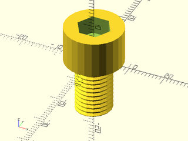

# LibFile: metric\_screws.scad

Screws, Bolts, and Nuts.

To use, add the following lines to the beginning of your file:

    include <BOSL2/std.scad>
    include <BOSL2/metric_screws.scad>

## Table of Contents

1. [Section: Functions](#section-functions)
    - [`get_metric_bolt_head_size()`](#function-get_metric_bolt_head_size)
    - [`get_metric_bolt_head_height()`](#function-get_metric_bolt_head_height)
    - [`get_metric_socket_cap_diam()`](#function-get_metric_socket_cap_diam)
    - [`get_metric_socket_cap_height()`](#function-get_metric_socket_cap_height)
    - [`get_metric_socket_cap_socket_size()`](#function-get_metric_socket_cap_socket_size)
    - [`get_metric_socket_cap_socket_depth()`](#function-get_metric_socket_cap_socket_depth)
    - [`get_metric_iso_coarse_thread_pitch()`](#function-get_metric_iso_coarse_thread_pitch)
    - [`get_metric_iso_fine_thread_pitch()`](#function-get_metric_iso_fine_thread_pitch)
    - [`get_metric_iso_superfine_thread_pitch()`](#function-get_metric_iso_superfine_thread_pitch)
    - [`get_metric_jis_thread_pitch()`](#function-get_metric_jis_thread_pitch)
    - [`get_metric_nut_size()`](#function-get_metric_nut_size)
    - [`get_metric_nut_thickness()`](#function-get_metric_nut_thickness)

2. [Section: Modules](#section-modules)
    - [`generic_screw()`](#module-generic_screw)
    - [`metric_bolt()`](#module-metric_bolt)
    - [`metric_nut()`](#module-metric_nut)

## Section: Functions

### Function: get\_metric\_bolt\_head\_size()

**Description:** 

Returns the diameter of a typical metric bolt's head, based on the bolt `size`.

---

### Function: get\_metric\_bolt\_head\_height()

**Description:** 

Returns the height of a typical metric bolt's head, based on the bolt `size`.

---

### Function: get\_metric\_socket\_cap\_diam()

**Description:** 

Returns the diameter of a typical metric socket cap bolt's head, based on the bolt `size`.

---

### Function: get\_metric\_socket\_cap\_height()

**Description:** 

Returns the height of a typical metric socket cap bolt's head, based on the bolt `size`.

---

### Function: get\_metric\_socket\_cap\_socket\_size()

**Description:** 

Returns the diameter of a typical metric socket cap bolt's hex drive socket, based on the bolt `size`.

---

### Function: get\_metric\_socket\_cap\_socket\_depth()

**Description:** 

Returns the depth of a typical metric socket cap bolt's hex drive socket, based on the bolt `size`.

---

### Function: get\_metric\_iso\_coarse\_thread\_pitch()

**Description:** 

Returns the ISO metric standard coarse threading pitch for a given bolt `size`.

---

### Function: get\_metric\_iso\_fine\_thread\_pitch()

**Description:** 

Returns the ISO metric standard fine threading pitch for a given bolt `size`.

---

### Function: get\_metric\_iso\_superfine\_thread\_pitch()

**Description:** 

Returns the ISO metric standard superfine threading pitch for a given bolt `size`.

---

### Function: get\_metric\_jis\_thread\_pitch()

**Description:** 

Returns the JIS metric standard threading pitch for a given bolt `size`.

---

### Function: get\_metric\_nut\_size()

**Description:** 

Returns the typical metric nut flat-to-flat diameter for a given bolt `size`.

---

### Function: get\_metric\_nut\_thickness()

**Description:** 

Returns the typical metric nut thickness for a given bolt `size`.

---

## Section: Modules

### Module: generic\_screw()

**Usage:** 

- generic\_screw(screwsize, screwlen, headsize, headlen)

**Description:** 

Makes a very simple screw model, useful for making screwholes.

**Arguments:** 

<abbr title="These args can be used by position or by name.">By&nbsp;Position</abbr> | What it does
-------------------- | ------------
`screwsize`          | diameter of threaded part of screw.
`screwlen`           | length of threaded part of screw.
`headsize`           | diameter of the screw head.
`headlen`            | length of the screw head.
`anchor`             | Translate so anchor point is at origin (0,0,0).  See [anchor](attachments.scad#subsection-anchor).  Default: `CENTER`
`spin`               | Rotate this many degrees around the Z axis after anchor.  See [spin](attachments.scad#subsection-spin).  Default: `0`
`orient`             | Vector to rotate top towards, after spin.  See [orient](attachments.scad#subsection-orient).  Default: `UP`

**Extra Anchors:** 

Anchor Name | Position
----------- | --------
"base" | At the base of the head.
"countersunk" | At the head height that would be just barely exposed when countersunk.

**Example 1:** 

 

    include <BOSL2/std.scad>
    include <BOSL2/metric_screws.scad>
    generic_screw(screwsize=3,screwlen=10,headsize=6,headlen=3, anchor="countersunk");

**Example 2:** 

 

    include <BOSL2/std.scad>
    include <BOSL2/metric_screws.scad>
    generic_screw(screwsize=3,screwlen=10,headsize=6,headlen=3, anchor="base");

**Example 3:** Standard Anchors

    include <BOSL2/std.scad>
    include <BOSL2/metric_screws.scad>
    generic_screw(screwsize=3,screwlen=10,headsize=6,headlen=3)
        show_anchors(5, custom=false);

  

**Example 4:** Custom Named Anchors

    include <BOSL2/std.scad>
    include <BOSL2/metric_screws.scad>
    expose_anchors()
      generic_screw(screwsize=3,screwlen=10,headsize=6,headlen=3)
        show_anchors(5, std=false);

  

---

### Module: metric\_bolt()

**Description:** 

Makes a standard metric screw model.

**Arguments:** 

<abbr title="These args can be used by position or by name.">By&nbsp;Position</abbr> | What it does
-------------------- | ------------
`size`               | Diameter of threaded part of screw.
`headtype`           | One of `"hex"`, `"pan"`, `"button"`, `"round"`, `"countersunk"`, `"oval"`, `"socket`".  Default: `"socket"`
`l`                  | Length of screw, except for the head.
`shank`              | Length of unthreaded portion of the shaft.
`pitch`              | If given, render threads of the given pitch.  If 0, then no threads.  Overrides coarse argument.
`details`            | If true model should be rendered with extra details.  (Default: false)
`coarse`             | If true, make coarse threads instead of fine threads.  Default = true
`flange`             | Radius of flange beyond the head.  Default = 0 (no flange)
`phillips`           | If given, the size of the phillips drive hole to add.  (ie: "#1", "#2", or "#3")
`torx`               | If given, the size of the torx drive hole to add.  (ie: 10, 20, 30, etc.)
`anchor`             | Translate so anchor point is at origin (0,0,0).  See [anchor](attachments.scad#subsection-anchor).  Default: `CENTER`
`spin`               | Rotate this many degrees around the Z axis after anchor.  See [spin](attachments.scad#subsection-spin).  Default: `0`
`orient`             | Vector to rotate top towards, after spin.  See [orient](attachments.scad#subsection-orient).  Default: `UP`

**Extra Anchors:** 

Anchor Name | Position
----------- | --------
"base" | At the base of the head.
"countersunk" | At the head height that would be just barely exposed when countersunk.
"shank" | At the bottom start of the unthreaded shank.

**Example 1:** Bolt Head Types

 

    include <BOSL2/std.scad>
    include <BOSL2/metric_screws.scad>
    ydistribute(40) {
        xdistribute(30) {
            // Front Row, Left to Right
            metric_bolt(headtype="pan", size=10, l=15, details=true, phillips="#2");
            metric_bolt(headtype="button", size=10, l=15, details=true, phillips="#2");
            metric_bolt(headtype="round", size=10, l=15, details=true, phillips="#2");
        }
        xdistribute(30) {
            // Back Row, Left to Right
            metric_bolt(headtype="socket", size=10, l=15, details=true);
            metric_bolt(headtype="hex", size=10, l=15, details=true, phillips="#2");
            metric_bolt(headtype="countersunk", size=10, l=15, details=true, phillips="#2");
            metric_bolt(headtype="oval", size=10, l=15, details=true, phillips="#2");
        }
    }

**Example 2:** Details

    include <BOSL2/std.scad>
    include <BOSL2/metric_screws.scad>
    metric_bolt(size=10, l=15, details=true, $fn=32);

  

**Example 3:** No Details Except Threads

    include <BOSL2/std.scad>
    include <BOSL2/metric_screws.scad>
    metric_bolt(size=10, l=15);

  

**Example 4:** No Details, No Threads

    include <BOSL2/std.scad>
    include <BOSL2/metric_screws.scad>
    metric_bolt(size=10, l=15, pitch=0);

  

**Example 5:** Fine Threads

    include <BOSL2/std.scad>
    include <BOSL2/metric_screws.scad>
    metric_bolt(size=10, l=15, coarse=false);

  

**Example 6:** Flange

    include <BOSL2/std.scad>
    include <BOSL2/metric_screws.scad>
    metric_bolt(size=10, l=15, flange=5);

  

**Example 7:** Shank

    include <BOSL2/std.scad>
    include <BOSL2/metric_screws.scad>
    metric_bolt(size=10, l=25, shank=10);

  

**Example 8:** Hex Head with Phillips

    include <BOSL2/std.scad>
    include <BOSL2/metric_screws.scad>
    metric_bolt(headtype="hex", size=10, l=15, phillips="#2");

  

**Example 9:** Hex Head with Torx

    include <BOSL2/std.scad>
    include <BOSL2/metric_screws.scad>
    metric_bolt(headtype="hex", size=10, l=15, torx=50);

  

**Example 10:** Standard Anchors

 

    include <BOSL2/std.scad>
    include <BOSL2/metric_screws.scad>
    metric_bolt(headtype="oval", size=10, l=15, shank=5, details=true, phillips="#2")
        show_anchors(5, custom=false);

**Example 11:** Custom Named Anchors

 

    include <BOSL2/std.scad>
    include <BOSL2/metric_screws.scad>
    expose_anchors(0.125)
      metric_bolt(headtype="oval", size=10, l=15, shank=5, details=true, phillips="#2")
        show_anchors(5, std=false);

---

### Module: metric\_nut()

**Description:** 

Makes a model of a standard nut for a standard metric screw.

**Arguments:** 

<abbr title="These args can be used by position or by name.">By&nbsp;Position</abbr> | What it does
-------------------- | ------------
`size`               | standard metric screw size in mm. (Default: 3)
`hole`               | include the hole in the nut.  (Default: true)
`pitch`              | pitch of threads in the hole.  No threads if not given.
`flange`             | radius of flange beyond the head.  Default = 0 (no flange)
`details`            | true if model should be rendered with extra details.  (Default: false)
`anchor`             | Translate so anchor point is at origin (0,0,0).  See [anchor](attachments.scad#subsection-anchor).  Default: `CENTER`
`spin`               | Rotate this many degrees around the Z axis after anchor.  See [spin](attachments.scad#subsection-spin).  Default: `0`
`orient`             | Vector to rotate top towards, after spin.  See [orient](attachments.scad#subsection-orient).  Default: `UP`
`center`             | If true, centers the nut at the origin.  If false, sits on top of XY plane.  Overrides `anchor` if given.

**Example 1:** No details, No Hole.  Useful for a mask.

    include <BOSL2/std.scad>
    include <BOSL2/metric_screws.scad>
    metric_nut(size=10, hole=false);

  

**Example 2:** Hole, with No Threads

    include <BOSL2/std.scad>
    include <BOSL2/metric_screws.scad>
    metric_nut(size=10, hole=true);

  

**Example 3:** Threads

    include <BOSL2/std.scad>
    include <BOSL2/metric_screws.scad>
    metric_nut(size=10, hole=true, pitch=1.5);

  

**Example 4:** Details

    include <BOSL2/std.scad>
    include <BOSL2/metric_screws.scad>
    metric_nut(size=10, hole=true, pitch=1.5, details=true);

  

**Example 5:** Centered

 

    include <BOSL2/std.scad>
    include <BOSL2/metric_screws.scad>
    metric_nut(size=10, hole=true, pitch=1.5, details=true, center=true);

**Example 6:** Flange

 

    include <BOSL2/std.scad>
    include <BOSL2/metric_screws.scad>
    metric_nut(size=10, hole=true, pitch=1.5, flange=3, details=true);

---

