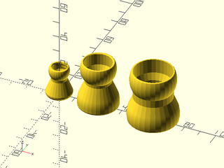
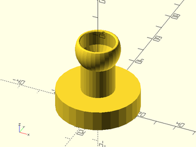
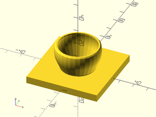
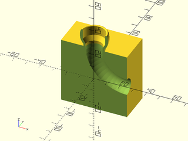

# LibFile: modular\_hose.scad

Modular hose segment and attachment ends.

To use, add the following lines to the beginning of your file:

    include <BOSL2/std.scad>
    include <BOSL2/modular_hose.scad>

## Table of Contents

1. [Section: Modular Hose Parts](#section-modular-hose-parts)
    - [`modular_hose()`](#module-modular_hose)
    - [`modular_hose_radius()`](#function-modular_hose_radius)

## Section: Modular Hose Parts

### Module: modular\_hose()

**Usage:** 

- modular\_hose(size, type, [clearance], [waist\_len], [anchor], [spin], [orient]) [attachments]

**Description:** 

Construct moduler hose segments or modular hose ends for connection to standard
modular hose systems.  The 1/4", 1/2" and 3/4" sizes are supported and you can
produce just one end to make a mount or end attachment to a modular hose,
or you can make modular hose segments.  To make assembly possible with printed
parts you can add clearances that make the ball end smaller and the socket end
larger.  These work by simply increasing the radius of the whole end by the specified
amount.  On a Prusa printer with PETG, a clearance of 0.05 allows the 3/4" hose parts to mate
with standard modular hose or itself.  A clearance of 0.05 to 0.1 allows the 1/2" parts to mate with
standard hose, and with clearance 0 the 1/4" parts will mate with standard hose.  Note that clearance values
are different for the different sizes.  You will have to experiment with your machine and materials.  Small
adjustments will change the stiffness of the connection.

**Arguments:** 

<abbr title="These args can be used by position or by name.">By&nbsp;Position</abbr> | What it does
-------------------- | ------------
`size`               | size of modular hose part, must be 1/4, 1/2 or 3/4.
`type`               | type of part to make, either "segment", "socket" (or "big"), or "ball" (or "small")
`clearance`          | clearance to make assembly possible.  Either a scalar to apply the same to both ends or a vector [small,large] to apply different clearances to the two ends.  Default: 0
`waist_len`          | size of central "waist" of the part.  Default: standard length.

**Example 1:** 

    include <BOSL2/std.scad>
    include <BOSL2/modular_hose.scad>
    modular_hose(1/4,"segment");
    right(25)modular_hose(1/2,"segment");
    right(60)modular_hose(3/4,"segment");

  

**Example 2:** A mount point for modular hose

    include <BOSL2/std.scad>
    include <BOSL2/modular_hose.scad>
    cylinder(l=10, r=20)
       attach(TOP) modular_hose(1/2, "ball", waist_len=15);

  

**Example 3:** Mounting plate for something at the end of the hose

    include <BOSL2/std.scad>
    include <BOSL2/modular_hose.scad>
    cuboid([50,50,5])
       attach(TOP) modular_hose(3/4, "socket", waist_len=0);

  

---

### Function: modular\_hose\_radius()

**Usage:** 

- r = modular\_hose\_radius(size, [outer]);

**Description:** 

Returns the inner (or outer) diameter of the waist section
of the modular hose to enable hollowing out connecting channels.
Note: diameter is accurate to about 1e-4.

**Arguments:** 

<abbr title="These args can be used by position or by name.">By&nbsp;Position</abbr> | What it does
-------------------- | ------------
`size`               | size of hose part, must be 1/4, 1/2 or 3/4
`outer`              | set to true to get the outer diameter.

**Example 1:** 

    include <BOSL2/std.scad>
    include <BOSL2/modular_hose.scad>
    $fn=64;
    back_half()
       diff("remove")
         cuboid(50){
           attach(TOP) modular_hose(1/2, "ball");
           up(0.01)position(TOP+RIGHT)tags("remove")
             rot(180)
             xrot(-90)
             rotate_extrude(angle=135)
             right(25)
             circle(r=modular_hose_radius(1/2));
         }

  

---

