# LibFile: mutators.scad

Functions and modules to mutate children in various ways.

To use, add the following lines to the beginning of your file:

    include <BOSL2/std.scad>

## Table of Contents

1. [Section: Bounding Box](#section-bounding-box)
    - [`bounding_box()`](#module-bounding_box)

2. [Section: Warp Mutators](#section-warp-mutators)
    - [`chain_hull()`](#module-chain_hull)
    - [`path_extrude2d()`](#module-path_extrude2d)
    - [`cylindrical_extrude()`](#module-cylindrical_extrude)
    - [`extrude_from_to()`](#module-extrude_from_to)
    - [`path_extrude()`](#module-path_extrude)

3. [Section: Offset Mutators](#section-offset-mutators)
    - [`minkowski_difference()`](#module-minkowski_difference)
    - [`offset3d()`](#module-offset3d)
    - [`round3d()`](#module-round3d)

## Section: Bounding Box

### Module: bounding\_box()

**Usage:** 

- bounding\_box() ...

**Description:** 

Returns the smallest axis-aligned square (or cube) shape that contains all the 2D (or 3D)
children given.  The module children() is supposed to be a 3d shape when planar=false and
a 2d shape when planar=true otherwise the system will issue a warning of mixing dimension
or scaling by 0.

**Arguments:** 

<abbr title="These args can be used by position or by name.">By&nbsp;Position</abbr> | What it does
-------------------- | ------------
`excess`             | The amount that the bounding box should be larger than needed to bound the children, in each axis.
`planar`             | If true, creates a 2D bounding rectangle.  Is false, creates a 3D bounding cube.  Default: false

**Example 1:** 

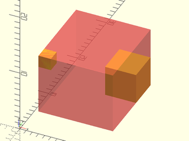

    include <BOSL2/std.scad>
    module shapes() {
        translate([10,8,4]) cube(5);
        translate([3,0,12]) cube(2);
    }
    #bounding_box() shapes();
    shapes();

  

**Example 2:** 

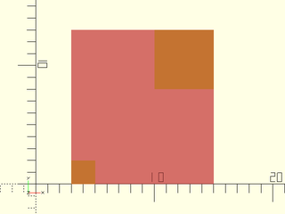

    include <BOSL2/std.scad>
    module shapes() {
        translate([10,8]) square(5);
        translate([3,0]) square(2);
    }
    #bounding_box(planar=true) shapes();
    shapes();

  

---

## Section: Warp Mutators

### Module: chain\_hull()

**Usage:** 

- chain\_hull() ...

**Description:** 

Performs hull operations between consecutive pairs of children,
then unions all of the hull results.  This can be a very slow
operation, but it can provide results that are hard to get
otherwise.

**Side Effects:** 

- `$idx` is set to the index value of the first child of each hulling pair, and can be used to modify each child pair individually.
- `$primary` is set to true when the child is the first in a chain pair.

**Example 1:** 

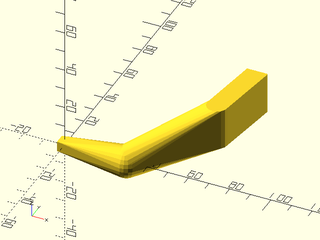

    include <BOSL2/std.scad>
    chain_hull() {
        cube(5, center=true);
        translate([30, 0, 0]) sphere(d=15);
        translate([60, 30, 0]) cylinder(d=10, h=20);
        translate([60, 60, 0]) cube([10,1,20], center=false);
    }

  

**Example 2:** Using `$idx` and `$primary`

 

    include <BOSL2/std.scad>
    chain_hull() {
        zrot(  0) right(100) if ($primary) cube(5+3*$idx,center=true); else sphere(r=10+3*$idx);
        zrot( 45) right(100) if ($primary) cube(5+3*$idx,center=true); else sphere(r=10+3*$idx);
        zrot( 90) right(100) if ($primary) cube(5+3*$idx,center=true); else sphere(r=10+3*$idx);
        zrot(135) right(100) if ($primary) cube(5+3*$idx,center=true); else sphere(r=10+3*$idx);
        zrot(180) right(100) if ($primary) cube(5+3*$idx,center=true); else sphere(r=10+3*$idx);
    }

---

### Module: path\_extrude2d()

**Usage:** 

- path\_extrude2d(path, [caps], [closed]) {...}

**Description:** 

Extrudes 2D children along the given 2D path, with optional rounded endcaps.
It works by constructing straight sections corresponding to each segment of the path and inserting rounded joints at each corner.
If the children are symmetric across the Y axis line then you can set caps=true to produce rounded caps on the ends of the profile.
If you set caps to true for asymmetric children then incorrect caps will be generated.

**Arguments:** 

<abbr title="These args can be used by position or by name.">By&nbsp;Position</abbr> | What it does
-------------------- | ------------
`path`               | The 2D path to extrude the geometry along.
`caps`               | If true, caps each end of the path with a rounded copy of the children.  Children must by symmetric across the Y axis, or results are wrong.  Default: false
`closed`             | If true, connect the starting point of the path to the ending point.  Default: false
`convexity`          | The max number of times a line could pass though a wall.  Default: 10
`s`                  | Mask size to use.  Use a number larger than twice your object's largest axis.  If you make this too large, it messes with centering your view.  Default: The length of the diagonal of the path's bounding box.

**Example 1:** 

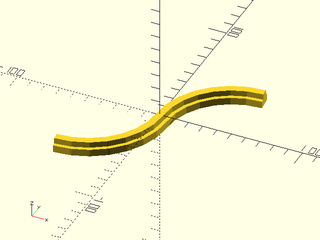

    include <BOSL2/std.scad>
    path = [
        each right(50, p=arc(d=100,angle=[90,180])),
        each left(50, p=arc(d=100,angle=[0,-90])),
    ];
    path_extrude2d(path,caps=false) {
        fwd(2.5) square([5,6],center=true);
        fwd(6) square([10,5],center=true);
    }

  

**Example 2:** 

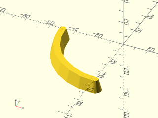

    include <BOSL2/std.scad>
    path_extrude2d(arc(d=100,angle=[180,270]),caps=true)
        trapezoid(w1=10, w2=5, h=10, anchor=BACK);

  

**Example 3:** 

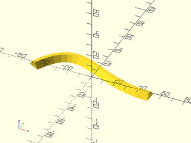

    include <BOSL2/std.scad>
    include <BOSL2/beziers.scad>
    path = bezpath_curve([
        [-50,0], [-25,50], [0,0], [50,0]
    ]);
    path_extrude2d(path, caps=false)
        trapezoid(w1=10, w2=3, h=5, anchor=BACK);

  

**Example 4:** Un-Closed Path

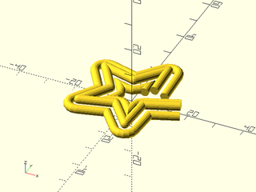

    include <BOSL2/std.scad>
    $fn=16;
    spath = star(id=15,od=35,n=5);
    path_extrude2d(spath, caps=false, closed=false)
        move_copies([[-3.5,1.5],[0.0,3.0],[3.5,1.5]])
            circle(r=1.5);

  

**Example 5:** Complex Endcaps

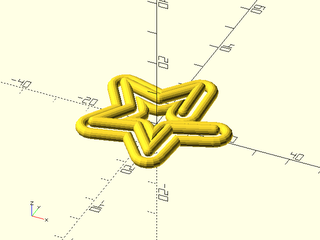

    include <BOSL2/std.scad>
    $fn=16;
    spath = star(id=15,od=35,n=5);
    path_extrude2d(spath, caps=true, closed=false)
        move_copies([[-3.5,1.5],[0.0,3.0],[3.5,1.5]])
            circle(r=1.5);

  

---

### Module: cylindrical\_extrude()

**Usage:** 

- cylindrical\_extrude(size, ir|id, or|od, [convexity]) ...

**Description:** 

Extrudes all 2D children outwards, curved around a cylindrical shape.

**Arguments:** 

<abbr title="These args can be used by position or by name.">By&nbsp;Position</abbr> | What it does
-------------------- | ------------
`or`                 | The outer radius to extrude to.
`od`                 | The outer diameter to extrude to.
`ir`                 | The inner radius to extrude from.
`id`                 | The inner diameter to extrude from.
`size`               | The [X,Y] size of the 2D children to extrude.  Default: [1000,1000]
`convexity`          | The max number of times a line could pass though a wall.  Default: 10
`spin`               | Amount in degrees to spin around cylindrical axis.  Default: 0
`orient`             | The orientation of the cylinder to wrap around, given as a vector.  Default: UP

**Example 1:** 

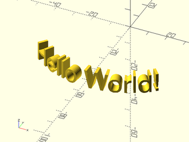

 

    include <BOSL2/std.scad>
    cylindrical_extrude(or=50, ir=45)
        text(text="Hello World!", size=10, halign="center", valign="center");

**Example 2:** Spin Around the Cylindrical Axis

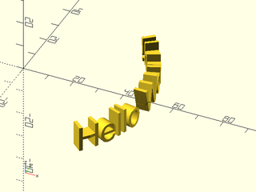

 

    include <BOSL2/std.scad>
    cylindrical_extrude(or=50, ir=45, spin=90)
        text(text="Hello World!", size=10, halign="center", valign="center");

**Example 3:** Orient to the Y Axis.

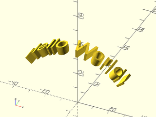

 

    include <BOSL2/std.scad>
    cylindrical_extrude(or=40, ir=35, orient=BACK)
        text(text="Hello World!", size=10, halign="center", valign="center");

---

### Module: extrude\_from\_to()

**Description:** 

Extrudes a 2D shape between the 3d points pt1 and pt2.  Takes as children a set of 2D shapes to extrude.

**Arguments:** 

<abbr title="These args can be used by position or by name.">By&nbsp;Position</abbr> | What it does
-------------------- | ------------
`pt1`                | starting point of extrusion.
`pt2`                | ending point of extrusion.
`convexity`          | max number of times a line could intersect a wall of the 2D shape being extruded.
`twist`              | number of degrees to twist the 2D shape over the entire extrusion length.
`scale`              | scale multiplier for end of extrusion compared the start.
`slices`             | Number of slices along the extrusion to break the extrusion into.  Useful for refining `twist` extrusions.

**Example 1:** 

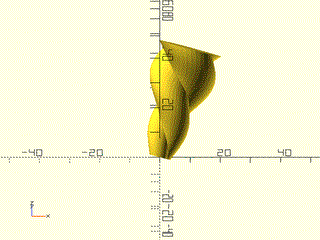

 

    include <BOSL2/std.scad>
    extrude_from_to([0,0,0], [10,20,30], convexity=4, twist=360, scale=3.0, slices=40) {
        xcopies(3) circle(3, $fn=32);
    }

---

### Module: path\_extrude()

**Description:** 

Extrudes 2D children along a 3D path.  This may be slow.

**Arguments:** 

<abbr title="These args can be used by position or by name.">By&nbsp;Position</abbr> | What it does
-------------------- | ------------
`path`               | Array of points for the bezier path to extrude along.
`convexity`          | Maximum number of walls a ray can pass through.
`clipsize`           | Increase if artifacts are left.  Default: 100

**Example 1:** 

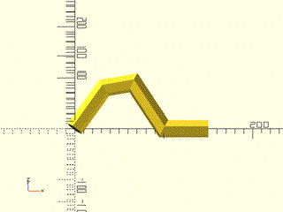

 

    include <BOSL2/std.scad>
    path = [ [0, 0, 0], [33, 33, 33], [66, 33, 40], [100, 0, 0], [150,0,0] ];
    path_extrude(path) circle(r=10, $fn=6);

---

## Section: Offset Mutators

### Module: minkowski\_difference()

**Usage:** 

- minkowski\_difference() { base\_shape(); diff\_shape(); ... }

**Description:** 

Takes a 3D base shape and one or more 3D diff shapes, carves out the diff shapes from the
surface of the base shape, in a way complementary to how `minkowski()` unions shapes to the
surface of its base shape.

**Arguments:** 

<abbr title="These args can be used by position or by name.">By&nbsp;Position</abbr> | What it does
-------------------- | ------------
`planar`             | If true, performs minkowski difference in 2D.  Default: false (3D)

**Example 1:** 

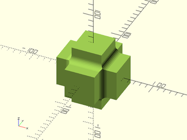

    include <BOSL2/std.scad>
    minkowski_difference() {
        union() {
            cube([120,70,70], center=true);
            cube([70,120,70], center=true);
            cube([70,70,120], center=true);
        }
        sphere(r=10);
    }

  

---

### Module: offset3d()

**Usage:** 

- offset3d(r, [size], [convexity]);

**Description:** 

Expands or contracts the surface of a 3D object by a given amount.  This is very, very slow.
No really, this is unbearably slow.  It uses `minkowski()`.  Use this as a last resort.
This is so slow that no example images will be rendered.

**Arguments:** 

<abbr title="These args can be used by position or by name.">By&nbsp;Position</abbr> | What it does
-------------------- | ------------
`r`                  | Radius to expand object by.  Negative numbers contract the object.
`size`               | Maximum size of object to be contracted, given as a scalar.  Default: 100
`convexity`          | Max number of times a line could intersect the walls of the object.  Default: 10

---

### Module: round3d()

**Usage:** 

- round3d(r) ...
- round3d(or) ...
- round3d(ir) ...
- round3d(or, ir) ...

**Description:** 

Rounds arbitrary 3D objects.  Giving `r` rounds all concave and convex corners.  Giving just `ir`
rounds just concave corners.  Giving just `or` rounds convex corners.  Giving both `ir` and `or`
can let you round to different radii for concave and convex corners.  The 3D object must not have
any parts narrower than twice the `or` radius.  Such parts will disappear.  This is an *extremely*
slow operation.  I cannot emphasize enough just how slow it is.  It uses `minkowski()` multiple times.
Use this as a last resort.  This is so slow that no example images will be rendered.

**Arguments:** 

<abbr title="These args can be used by position or by name.">By&nbsp;Position</abbr> | What it does
-------------------- | ------------
`r`                  | Radius to round all concave and convex corners to.
`or`                 | Radius to round only outside (convex) corners to.  Use instead of `r`.
`ir`                 | Radius to round only inside (concave) corners to.  Use instead of `r`.

---

