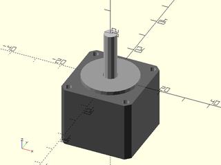

# LibFile: nema\_steppers.scad

Masks and models for NEMA stepper motors.

To use, add the following lines to the beginning of your file:

    include <BOSL2/std.scad>
    include <BOSL2/nema_steppers.scad>

## Table of Contents

1. [Section: Functions](#section-functions)
    - [`nema_motor_width()`](#function-nema_motor_width)
    - [`nema_motor_plinth_height()`](#function-nema_motor_plinth_height)
    - [`nema_motor_plinth_diam()`](#function-nema_motor_plinth_diam)
    - [`nema_motor_screw_spacing()`](#function-nema_motor_screw_spacing)
    - [`nema_motor_screw_size()`](#function-nema_motor_screw_size)
    - [`nema_motor_screw_depth()`](#function-nema_motor_screw_depth)

2. [Section: Motor Models](#section-motor-models)
    - [`nema11_stepper()`](#module-nema11_stepper)
    - [`nema14_stepper()`](#module-nema14_stepper)
    - [`nema17_stepper()`](#module-nema17_stepper)
    - [`nema23_stepper()`](#module-nema23_stepper)
    - [`nema34_stepper()`](#module-nema34_stepper)

3. [Section: Masking Modules](#section-masking-modules)
    - [`nema_mount_holes()`](#module-nema_mount_holes)
    - [`nema11_mount_holes()`](#module-nema11_mount_holes)
    - [`nema14_mount_holes()`](#module-nema14_mount_holes)
    - [`nema17_mount_holes()`](#module-nema17_mount_holes)
    - [`nema23_mount_holes()`](#module-nema23_mount_holes)
    - [`nema34_mount_holes()`](#module-nema34_mount_holes)

## Section: Functions

### Function: nema\_motor\_width()

**Description:** 

Gets width of NEMA motor of given standard size.

**Arguments:** 

<abbr title="These args can be used by position or by name.">By&nbsp;Position</abbr> | What it does
-------------------- | ------------
`size`               | The standard NEMA motor size.

---

### Function: nema\_motor\_plinth\_height()

**Description:** 

Gets plinth height of NEMA motor of given standard size.

**Arguments:** 

<abbr title="These args can be used by position or by name.">By&nbsp;Position</abbr> | What it does
-------------------- | ------------
`size`               | The standard NEMA motor size.

---

### Function: nema\_motor\_plinth\_diam()

**Description:** 

Gets plinth diameter of NEMA motor of given standard size.

**Arguments:** 

<abbr title="These args can be used by position or by name.">By&nbsp;Position</abbr> | What it does
-------------------- | ------------
`size`               | The standard NEMA motor size.

---

### Function: nema\_motor\_screw\_spacing()

**Description:** 

Gets screw spacing of NEMA motor of given standard size.

**Arguments:** 

<abbr title="These args can be used by position or by name.">By&nbsp;Position</abbr> | What it does
-------------------- | ------------
`size`               | The standard NEMA motor size.

---

### Function: nema\_motor\_screw\_size()

**Description:** 

Gets mount screw size of NEMA motor of given standard size.

**Arguments:** 

<abbr title="These args can be used by position or by name.">By&nbsp;Position</abbr> | What it does
-------------------- | ------------
`size`               | The standard NEMA motor size.

---

### Function: nema\_motor\_screw\_depth()

**Description:** 

Gets mount screw-hole depth of NEMA motor of given standard size.

**Arguments:** 

<abbr title="These args can be used by position or by name.">By&nbsp;Position</abbr> | What it does
-------------------- | ------------
`size`               | The standard NEMA motor size.

---

## Section: Motor Models

### Module: nema11\_stepper()

**Description:** 

Creates a model of a NEMA 11 stepper motor.

**Arguments:** 

<abbr title="These args can be used by position or by name.">By&nbsp;Position</abbr> | What it does
-------------------- | ------------
`h`                  | Length of motor body.  Default: 24mm
`shaft`              | Shaft diameter. Default: 5mm
`shaft_len`          | Length of shaft protruding out the top of the stepper motor.  Default: 20mm
`anchor`             | Translate so anchor point is at origin (0,0,0).  See [anchor](attachments.scad#subsection-anchor).  Default: `CENTER`
`spin`               | Rotate this many degrees around the Z axis after anchor.  See [spin](attachments.scad#subsection-spin).  Default: `0`
`orient`             | Vector to rotate top towards, after spin.  See [orient](attachments.scad#subsection-orient).  Default: `UP`

**Extra Anchors:** 

Anchor Name | Position
----------- | --------
"shaft-top" | The top of the shaft.
"shaft-middle" | The middle of the shaft.
"shaft-bottom" | The bottom of the shaft, 0.1mm above the plinth.
"plinth-top" | The top of the plinth.
"screw1" | The screw-hole in the X+Y+ quadrant.
"screw2" | The screw-hole in the X-Y+ quadrant.
"screw3" | The screw-hole in the X-Y- quadrant.
"screw4" | The screw-hole in the X+Y- quadrant.

**Example 1:** 

    include <BOSL2/std.scad>
    include <BOSL2/nema_steppers.scad>
    nema11_stepper();

  

---

### Module: nema14\_stepper()

**Description:** 

Creates a model of a NEMA 14 stepper motor.

**Arguments:** 

<abbr title="These args can be used by position or by name.">By&nbsp;Position</abbr> | What it does
-------------------- | ------------
`h`                  | Length of motor body.  Default: 24mm
`shaft`              | Shaft diameter. Default: 5mm
`shaft_len`          | Length of shaft protruding out the top of the stepper motor.  Default: 24mm
`anchor`             | Translate so anchor point is at origin (0,0,0).  See [anchor](attachments.scad#subsection-anchor).  Default: `CENTER`
`spin`               | Rotate this many degrees around the Z axis after anchor.  See [spin](attachments.scad#subsection-spin).  Default: `0`
`orient`             | Vector to rotate top towards, after spin.  See [orient](attachments.scad#subsection-orient).  Default: `UP`

**Extra Anchors:** 

Anchor Name | Position
----------- | --------
"shaft-top" | The top of the shaft.
"shaft-middle" | The middle of the shaft.
"shaft-bottom" | The bottom of the shaft, 0.1mm above the plinth.
"plinth-top" | The top of the plinth.
"screw1" | The screw-hole in the X+Y+ quadrant.
"screw2" | The screw-hole in the X-Y+ quadrant.
"screw3" | The screw-hole in the X-Y- quadrant.
"screw4" | The screw-hole in the X+Y- quadrant.

**Example 1:** 

    include <BOSL2/std.scad>
    include <BOSL2/nema_steppers.scad>
    nema14_stepper();

  

---

### Module: nema17\_stepper()

**Description:** 

Creates a model of a NEMA 17 stepper motor.

**Arguments:** 

<abbr title="These args can be used by position or by name.">By&nbsp;Position</abbr> | What it does
-------------------- | ------------
`h`                  | Length of motor body.  Default: 34mm
`shaft`              | Shaft diameter. Default: 5mm
`shaft_len`          | Length of shaft protruding out the top of the stepper motor.  Default: 20mm
`anchor`             | Translate so anchor point is at origin (0,0,0).  See [anchor](attachments.scad#subsection-anchor).  Default: `CENTER`
`spin`               | Rotate this many degrees around the Z axis after anchor.  See [spin](attachments.scad#subsection-spin).  Default: `0`
`orient`             | Vector to rotate top towards, after spin.  See [orient](attachments.scad#subsection-orient).  Default: `UP`

**Extra Anchors:** 

Anchor Name | Position
----------- | --------
"shaft-top" | The top of the shaft.
"shaft-middle" | The middle of the shaft.
"shaft-bottom" | The bottom of the shaft, 0.1mm above the plinth.
"plinth-top" | The top of the plinth.
"screw1" | The screw-hole in the X+Y+ quadrant.
"screw2" | The screw-hole in the X-Y+ quadrant.
"screw3" | The screw-hole in the X-Y- quadrant.
"screw4" | The screw-hole in the X+Y- quadrant.

**Example 1:** 

    include <BOSL2/std.scad>
    include <BOSL2/nema_steppers.scad>
    nema17_stepper();

  

---

### Module: nema23\_stepper()

**Description:** 

Creates a model of a NEMA 23 stepper motor.

**Arguments:** 

<abbr title="These args can be used by position or by name.">By&nbsp;Position</abbr> | What it does
-------------------- | ------------
`h`                  | Length of motor body.  Default: 50mm
`shaft`              | Shaft diameter. Default: 6.35mm
`shaft_len`          | Length of shaft protruding out the top of the stepper motor.  Default: 25mm
`anchor`             | Translate so anchor point is at origin (0,0,0).  See [anchor](attachments.scad#subsection-anchor).  Default: `CENTER`
`spin`               | Rotate this many degrees around the Z axis after anchor.  See [spin](attachments.scad#subsection-spin).  Default: `0`
`orient`             | Vector to rotate top towards, after spin.  See [orient](attachments.scad#subsection-orient).  Default: `UP`

**Extra Anchors:** 

Anchor Name | Position
----------- | --------
"shaft-top" | The top of the shaft.
"shaft-middle" | The middle of the shaft.
"shaft-bottom" | The bottom of the shaft, 0.1mm above the plinth.
"plinth-top" | The top of the plinth.
"screw1" | The screw-hole in the X+Y+ quadrant.
"screw2" | The screw-hole in the X-Y+ quadrant.
"screw3" | The screw-hole in the X-Y- quadrant.
"screw4" | The screw-hole in the X+Y- quadrant.

**Example 1:** 

    include <BOSL2/std.scad>
    include <BOSL2/nema_steppers.scad>
    nema23_stepper();

  

---

### Module: nema34\_stepper()

**Description:** 

Creates a model of a NEMA 34 stepper motor.

**Arguments:** 

<abbr title="These args can be used by position or by name.">By&nbsp;Position</abbr> | What it does
-------------------- | ------------
`h`                  | Length of motor body.  Default: 75mm
`shaft`              | Shaft diameter. Default: 12.7mm
`shaft_len`          | Length of shaft protruding out the top of the stepper motor.  Default: 32mm
`anchor`             | Translate so anchor point is at origin (0,0,0).  See [anchor](attachments.scad#subsection-anchor).  Default: `CENTER`
`spin`               | Rotate this many degrees around the Z axis after anchor.  See [spin](attachments.scad#subsection-spin).  Default: `0`
`orient`             | Vector to rotate top towards, after spin.  See [orient](attachments.scad#subsection-orient).  Default: `UP`

**Extra Anchors:** 

Anchor Name | Position
----------- | --------
"shaft-top" | The top of the shaft.
"shaft-middle" | The middle of the shaft.
"shaft-bottom" | The bottom of the shaft, 0.1mm above the plinth.
"plinth-top" | The top of the plinth.
"screw1" | The screw-hole in the X+Y+ quadrant.
"screw2" | The screw-hole in the X-Y+ quadrant.
"screw3" | The screw-hole in the X-Y- quadrant.
"screw4" | The screw-hole in the X+Y- quadrant.

**Example 1:** 

    include <BOSL2/std.scad>
    include <BOSL2/nema_steppers.scad>
    nema34_stepper();

  

---

## Section: Masking Modules

### Module: nema\_mount\_holes()

**Description:** 

Creates a mask to use when making standard NEMA stepper motor mounts.

**Arguments:** 

<abbr title="These args can be used by position or by name.">By&nbsp;Position</abbr> | What it does
-------------------- | ------------
`size`               | The standard NEMA motor size to make a mount for.
`depth`              | The thickness of the mounting hole mask.  Default: 5
`l`                  | The length of the slots, for making an adjustable motor mount.  Default: 5
`anchor`             | Translate so anchor point is at origin (0,0,0).  See [anchor](attachments.scad#subsection-anchor).  Default: `CENTER`
`spin`               | Rotate this many degrees around the Z axis after anchor.  See [spin](attachments.scad#subsection-spin).  Default: `0`
`orient`             | Vector to rotate top towards, after spin.  See [orient](attachments.scad#subsection-orient).  Default: `UP`
`$slop`              | The printer-specific slop value to make parts fit just right.

**Extra Anchors:** 

Anchor Name | Position
----------- | --------
"screw1" | The center top of the screw hole/slot in the X+Y+ quadrant.
"screw2" | The center top of the screw hole/slot in the X-Y+ quadrant.
"screw3" | The center top of the screw hole/slot in the X-Y- quadrant.
"screw4" | The center top of the screw hole/slot in the X+Y- quadrant.

**Example 1:** 

    include <BOSL2/std.scad>
    include <BOSL2/nema_steppers.scad>
    nema_mount_holes(size=14, depth=5, l=5);

  

**Example 2:** 

    include <BOSL2/std.scad>
    include <BOSL2/nema_steppers.scad>
    nema_mount_holes(size=17, depth=5, l=5);

  

**Example 3:** 

    include <BOSL2/std.scad>
    include <BOSL2/nema_steppers.scad>
    nema_mount_holes(size=17, depth=5, l=0);

  

---

### Module: nema11\_mount\_holes()

**Description:** 

Creates a mask to use when making NEMA 11 stepper motor mounts.

**Arguments:** 

<abbr title="These args can be used by position or by name.">By&nbsp;Position</abbr> | What it does
-------------------- | ------------
`depth`              | The thickness of the mounting hole mask.  Default: 5
`l`                  | The length of the slots, for making an adjustable motor mount.  Default: 5
`anchor`             | Translate so anchor point is at origin (0,0,0).  See [anchor](attachments.scad#subsection-anchor).  Default: `CENTER`
`spin`               | Rotate this many degrees around the Z axis after anchor.  See [spin](attachments.scad#subsection-spin).  Default: `0`
`orient`             | Vector to rotate top towards, after spin.  See [orient](attachments.scad#subsection-orient).  Default: `UP`
`$slop`              | The printer-specific slop value to make parts fit just right.

**Extra Anchors:** 

Anchor Name | Position
----------- | --------
"screw1" | The center top of the screw hole/slot in the X+Y+ quadrant.
"screw2" | The center top of the screw hole/slot in the X-Y+ quadrant.
"screw3" | The center top of the screw hole/slot in the X-Y- quadrant.
"screw4" | The center top of the screw hole/slot in the X+Y- quadrant.

**Example 1:** 

    include <BOSL2/std.scad>
    include <BOSL2/nema_steppers.scad>
    nema11_mount_holes(depth=5, l=5);

  

**Example 2:** 

    include <BOSL2/std.scad>
    include <BOSL2/nema_steppers.scad>
    nema11_mount_holes(depth=5, l=0);

  

---

### Module: nema14\_mount\_holes()

**Description:** 

Creates a mask to use when making NEMA 14 stepper motor mounts.

**Arguments:** 

<abbr title="These args can be used by position or by name.">By&nbsp;Position</abbr> | What it does
-------------------- | ------------
`depth`              | The thickness of the mounting hole mask.  Default: 5
`l`                  | The length of the slots, for making an adjustable motor mount.  Default: 5
`anchor`             | Translate so anchor point is at origin (0,0,0).  See [anchor](attachments.scad#subsection-anchor).  Default: `CENTER`
`spin`               | Rotate this many degrees around the Z axis after anchor.  See [spin](attachments.scad#subsection-spin).  Default: `0`
`orient`             | Vector to rotate top towards, after spin.  See [orient](attachments.scad#subsection-orient).  Default: `UP`
`$slop`              | The printer-specific slop value to make parts fit just right.

**Extra Anchors:** 

Anchor Name | Position
----------- | --------
"screw1" | The center top of the screw hole/slot in the X+Y+ quadrant.
"screw2" | The center top of the screw hole/slot in the X-Y+ quadrant.
"screw3" | The center top of the screw hole/slot in the X-Y- quadrant.
"screw4" | The center top of the screw hole/slot in the X+Y- quadrant.

**Example 1:** 

    include <BOSL2/std.scad>
    include <BOSL2/nema_steppers.scad>
    nema14_mount_holes(depth=5, l=5);

  

**Example 2:** 

    include <BOSL2/std.scad>
    include <BOSL2/nema_steppers.scad>
    nema14_mount_holes(depth=5, l=0);

  

---

### Module: nema17\_mount\_holes()

**Description:** 

Creates a mask to use when making NEMA 17 stepper motor mounts.

**Arguments:** 

<abbr title="These args can be used by position or by name.">By&nbsp;Position</abbr> | What it does
-------------------- | ------------
`depth`              | The thickness of the mounting hole mask.  Default: 5
`l`                  | The length of the slots, for making an adjustable motor mount.  Default: 5
`anchor`             | Translate so anchor point is at origin (0,0,0).  See [anchor](attachments.scad#subsection-anchor).  Default: `CENTER`
`spin`               | Rotate this many degrees around the Z axis after anchor.  See [spin](attachments.scad#subsection-spin).  Default: `0`
`orient`             | Vector to rotate top towards, after spin.  See [orient](attachments.scad#subsection-orient).  Default: `UP`
`$slop`              | The printer-specific slop value to make parts fit just right.

**Extra Anchors:** 

Anchor Name | Position
----------- | --------
"screw1" | The center top of the screw hole/slot in the X+Y+ quadrant.
"screw2" | The center top of the screw hole/slot in the X-Y+ quadrant.
"screw3" | The center top of the screw hole/slot in the X-Y- quadrant.
"screw4" | The center top of the screw hole/slot in the X+Y- quadrant.

**Example 1:** 

    include <BOSL2/std.scad>
    include <BOSL2/nema_steppers.scad>
    nema17_mount_holes(depth=5, l=5);

  

**Example 2:** 

    include <BOSL2/std.scad>
    include <BOSL2/nema_steppers.scad>
    nema17_mount_holes(depth=5, l=0);

  

---

### Module: nema23\_mount\_holes()

**Description:** 

Creates a mask to use when making NEMA 23 stepper motor mounts.

**Arguments:** 

<abbr title="These args can be used by position or by name.">By&nbsp;Position</abbr> | What it does
-------------------- | ------------
`depth`              | The thickness of the mounting hole mask.  Default: 5
`l`                  | The length of the slots, for making an adjustable motor mount.  Default: 5
`anchor`             | Translate so anchor point is at origin (0,0,0).  See [anchor](attachments.scad#subsection-anchor).  Default: `CENTER`
`spin`               | Rotate this many degrees around the Z axis after anchor.  See [spin](attachments.scad#subsection-spin).  Default: `0`
`orient`             | Vector to rotate top towards, after spin.  See [orient](attachments.scad#subsection-orient).  Default: `UP`
`$slop`              | The printer-specific slop value to make parts fit just right.

**Extra Anchors:** 

Anchor Name | Position
----------- | --------
"screw1" | The center top of the screw hole/slot in the X+Y+ quadrant.
"screw2" | The center top of the screw hole/slot in the X-Y+ quadrant.
"screw3" | The center top of the screw hole/slot in the X-Y- quadrant.
"screw4" | The center top of the screw hole/slot in the X+Y- quadrant.

**Example 1:** 

    include <BOSL2/std.scad>
    include <BOSL2/nema_steppers.scad>
    nema23_mount_holes(depth=5, l=5);

  

**Example 2:** 

    include <BOSL2/std.scad>
    include <BOSL2/nema_steppers.scad>
    nema23_mount_holes(depth=5, l=0);

  

---

### Module: nema34\_mount\_holes()

**Description:** 

Creates a mask to use when making NEMA 34 stepper motor mounts.

**Arguments:** 

<abbr title="These args can be used by position or by name.">By&nbsp;Position</abbr> | What it does
-------------------- | ------------
`depth`              | The thickness of the mounting hole mask.  Default: 5
`l`                  | The length of the slots, for making an adjustable motor mount.  Default: 5
`anchor`             | Translate so anchor point is at origin (0,0,0).  See [anchor](attachments.scad#subsection-anchor).  Default: `CENTER`
`spin`               | Rotate this many degrees around the Z axis after anchor.  See [spin](attachments.scad#subsection-spin).  Default: `0`
`orient`             | Vector to rotate top towards, after spin.  See [orient](attachments.scad#subsection-orient).  Default: `UP`
`$slop`              | The printer-specific slop value to make parts fit just right.

**Extra Anchors:** 

Anchor Name | Position
----------- | --------
"screw1" | The center top of the screw hole/slot in the X+Y+ quadrant.
"screw2" | The center top of the screw hole/slot in the X-Y+ quadrant.
"screw3" | The center top of the screw hole/slot in the X-Y- quadrant.
"screw4" | The center top of the screw hole/slot in the X+Y- quadrant.

**Example 1:** 

    include <BOSL2/std.scad>
    include <BOSL2/nema_steppers.scad>
    nema34_mount_holes(depth=5, l=5);

  

**Example 2:** 

    include <BOSL2/std.scad>
    include <BOSL2/nema_steppers.scad>
    nema34_mount_holes(depth=5, l=0);

  

---

