# LibFile: partitions.scad

Cut objects with a plane, or partition them into interlocking pieces for easy printing of large objects.

To use, add the following lines to the beginning of your file:

    include <BOSL2/std.scad>

## Table of Contents

1. [Section: Planar Cutting](#section-planar-cutting)
    - [`half_of()`](#functionmodule-half_of)
    - [`left_half()`](#functionmodule-left_half)
    - [`right_half()`](#functionmodule-right_half)
    - [`front_half()`](#functionmodule-front_half)
    - [`back_half()`](#functionmodule-back_half)
    - [`bottom_half()`](#functionmodule-bottom_half)
    - [`top_half()`](#functionmodule-top_half)

2. [Section: Partioning into Interlocking Pieces](#section-partioning-into-interlocking-pieces)
    - [`partition_mask()`](#module-partition_mask)
    - [`partition_cut_mask()`](#module-partition_cut_mask)
    - [`partition()`](#module-partition)

## Section: Planar Cutting

### Function/Module: half\_of()

**Usage:** as module

- half\_of(v, [cp], [s], [planar]) ...

**Usage:** as function

- result = half\_of(p,v,[cp]);

**Description:** 

Slices an object at a cut plane, and masks away everything that is on one side.  The v parameter is either a plane specification or
a normal vector.  The s parameter is needed for the module
version to control the size of the masking cube.  If s is too large then the preview display will flip around and display the
wrong half, but if it is too small it won't fully mask your model.
When called as a function, you must supply a vnf, path or region in p.  If planar is set to true for the module version the operation
is performed in 2D and UP and DOWN are treated as equivalent to BACK and FWD respectively.

**Arguments:** 

<abbr title="These args can be used by position or by name.">By&nbsp;Position</abbr> | What it does
-------------------- | ------------
`p`                  | path, region or VNF to slice.  (Function version)
`v`                  | Normal of plane to slice at.  Keeps everything on the side the normal points to.  Default: [0,0,1] (UP)
`cp`                 | If given as a scalar, moves the cut plane along the normal by the given amount.  If given as a point, specifies a point on the cut plane.  Default: [0,0,0]
`s`                  | Mask size to use.  Use a number larger than twice your object's largest axis.  If you make this too large, OpenSCAD's preview rendering may display the wrong half.  (Module version)  Default: 100
`planar`             | If true, perform a 2D operation.  When planar, a `v` of `UP` or `DOWN` becomes equivalent of `BACK` and `FWD` respectively.  (Module version).  Default: false.

**Example 1:** 

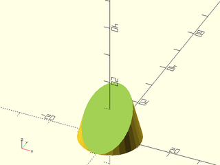

 

    include <BOSL2/std.scad>
    half_of(DOWN+BACK, cp=[0,-10,0]) cylinder(h=40, r1=10, r2=0, center=false);

**Example 2:** 

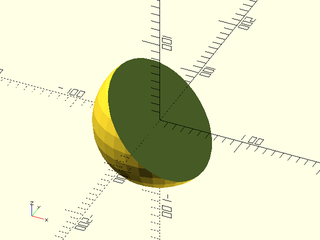

    include <BOSL2/std.scad>
    half_of(DOWN+LEFT, s=200) sphere(d=150);

  

**Example 3:** 

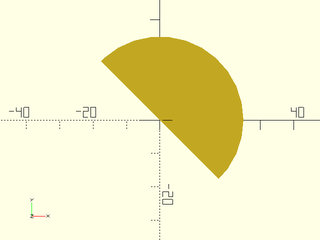

    include <BOSL2/std.scad>
    half_of([1,1], planar=true) circle(d=50);

  

---

### Function/Module: left\_half()

**Usage:** as module

- left\_half([s], [x]) ...
- left\_half(planar=true, [s], [x]) ...

**Usage:** as function

- result = left\_half(p, [x]);

**Description:** 

Slices an object at a vertical Y-Z cut plane, and masks away everything that is right of it.
The s parameter is needed for the module
version to control the size of the masking cube.  If s is too large then the preview display will flip around and display the
wrong half, but if it is too small it won't fully mask your model.

**Arguments:** 

<abbr title="These args can be used by position or by name.">By&nbsp;Position</abbr> | What it does
-------------------- | ------------
`p`                  | VNF, region or path to slice (function version)
`s`                  | Mask size to use.  Use a number larger than twice your object's largest axis.  If you make this too large, OpenSCAD's preview rendering may display the wrong half.  (Module version)  Default: 100
`x`                  | The X coordinate of the cut-plane.  Default: 0
`planar`             | If true, perform a 2D operation.  (Module version)  Default: false.

**Example 1:** 

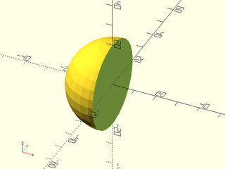

    include <BOSL2/std.scad>
    left_half() sphere(r=20);

  

**Example 2:** 

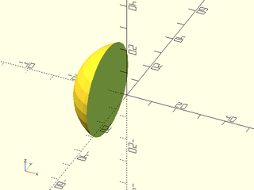

    include <BOSL2/std.scad>
    left_half(x=-8) sphere(r=20);

  

**Example 3:** 

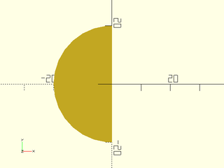

    include <BOSL2/std.scad>
    left_half(planar=true) circle(r=20);

  

---

### Function/Module: right\_half()

**Usage:** as module

- right\_half([s=], [x=]) ...
- right\_half(planar=true, [s=], [x=]) ...

**Usage:** as function

- result = right\_half(p=, [x=]);

**Description:** 

Slices an object at a vertical Y-Z cut plane, and masks away everything that is left of it.
The s parameter is needed for the module
version to control the size of the masking cube.  If s is too large then the preview display will flip around and display the
wrong half, but if it is too small it won't fully mask your model.

**Arguments:** 

<abbr title="These args can be used by position or by name.">By&nbsp;Position</abbr> | What it does
-------------------- | ------------
`p`                  | VNF, region or path to slice (function version)
`s`                  | Mask size to use.  Use a number larger than twice your object's largest axis.  If you make this too large, OpenSCAD's preview rendering may display the wrong half.  (Module version)  Default: 100
`x`                  | The X coordinate of the cut-plane.  Default: 0
`planar`             | If true, perform a 2D operation.  (Module version)  Default: false.

**Example 1:** 

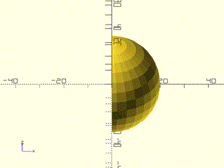

    include <BOSL2/std.scad>
    right_half() sphere(r=20);

  

**Example 2:** 

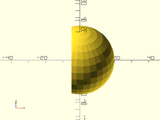

    include <BOSL2/std.scad>
    right_half(x=-5) sphere(r=20);

  

**Example 3:** 

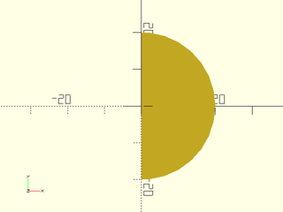

    include <BOSL2/std.scad>
    right_half(planar=true) circle(r=20);

  

---

### Function/Module: front\_half()

**Usage:** 

- front\_half([s], [y]) ...
- front\_half(planar=true, [s], [y]) ...

**Usage:** as function

- result = front\_half(p, [y]);

**Description:** 

Slices an object at a vertical X-Z cut plane, and masks away everything that is behind it.
The s parameter is needed for the module
version to control the size of the masking cube.  If s is too large then the preview display will flip around and display the
wrong half, but if it is too small it won't fully mask your model.

**Arguments:** 

<abbr title="These args can be used by position or by name.">By&nbsp;Position</abbr> | What it does
-------------------- | ------------
`p`                  | VNF, region or path to slice (function version)
`s`                  | Mask size to use.  Use a number larger than twice your object's largest axis.  If you make this too large, OpenSCAD's preview rendering may display the wrong half.  (Module version)  Default: 100
`y`                  | The Y coordinate of the cut-plane.  Default: 0
`planar`             | If true, perform a 2D operation.  (Module version)  Default: false.

**Example 1:** 

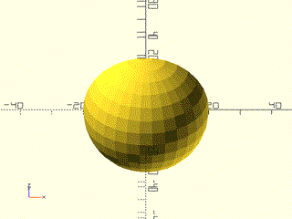

    include <BOSL2/std.scad>
    front_half() sphere(r=20);

  

**Example 2:** 

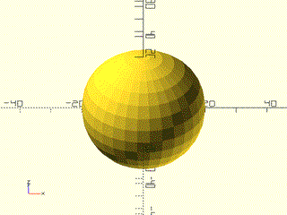

    include <BOSL2/std.scad>
    front_half(y=5) sphere(r=20);

  

**Example 3:** 

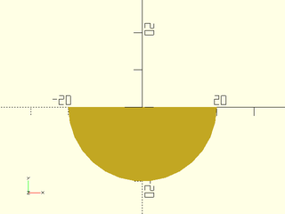

    include <BOSL2/std.scad>
    front_half(planar=true) circle(r=20);

  

---

### Function/Module: back\_half()

**Usage:** 

- back\_half([s], [y]) ...
- back\_half(planar=true, [s], [y]) ...

**Usage:** as function

- result = back\_half(p, [y]);

**Description:** 

Slices an object at a vertical X-Z cut plane, and masks away everything that is in front of it.
The s parameter is needed for the module
version to control the size of the masking cube.  If s is too large then the preview display will flip around and display the
wrong half, but if it is too small it won't fully mask your model.

**Arguments:** 

<abbr title="These args can be used by position or by name.">By&nbsp;Position</abbr> | What it does
-------------------- | ------------
`p`                  | VNF, region or path to slice (function version)
`s`                  | Mask size to use.  Use a number larger than twice your object's largest axis.  If you make this too large, OpenSCAD's preview rendering may display the wrong half.  (Module version)  Default: 100
`y`                  | The Y coordinate of the cut-plane.  Default: 0
`planar`             | If true, perform a 2D operation.  (Module version)  Default: false.

**Example 1:** 

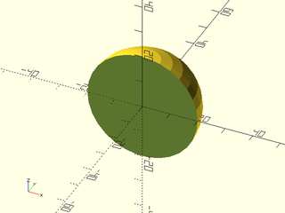

    include <BOSL2/std.scad>
    back_half() sphere(r=20);

  

**Example 2:** 

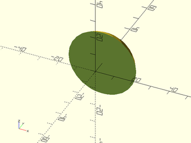

    include <BOSL2/std.scad>
    back_half(y=8) sphere(r=20);

  

**Example 3:** 

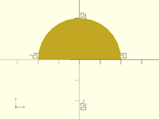

    include <BOSL2/std.scad>
    back_half(planar=true) circle(r=20);

  

---

### Function/Module: bottom\_half()

**Usage:** 

- bottom\_half([s], [z]) ...

**Usage:** as function

- result = bottom\_half(p, [z]);

**Description:** 

Slices an object at a horizontal X-Y cut plane, and masks away everything that is above it.
The s parameter is needed for the module
version to control the size of the masking cube.  If s is too large then the preview display will flip around and display the
wrong half, but if it is too small it won't fully mask your model.

**Arguments:** 

<abbr title="These args can be used by position or by name.">By&nbsp;Position</abbr> | What it does
-------------------- | ------------
`p`                  | VNF, region or path to slice (function version)
`s`                  | Mask size to use.  Use a number larger than twice your object's largest axis.  If you make this too large, OpenSCAD's preview rendering may display the wrong half.  (Module version)  Default: 100
`z`                  | The Z coordinate of the cut-plane.  Default: 0

**Example 1:** 

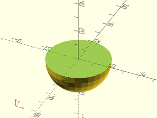

    include <BOSL2/std.scad>
    bottom_half() sphere(r=20);

  

**Example 2:** 

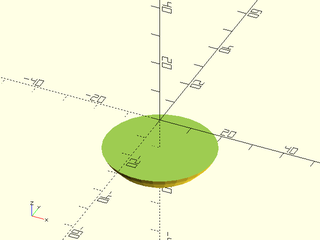

    include <BOSL2/std.scad>
    bottom_half(z=-10) sphere(r=20);

  

---

### Function/Module: top\_half()

**Usage:** 

- top\_half([s], [z]) ...
- result = top\_half(p, [z]);

**Description:** 

Slices an object at a horizontal X-Y cut plane, and masks away everything that is below it.
The s parameter is needed for the module
version to control the size of the masking cube.  If s is too large then the preview display will flip around and display the
wrong half, but if it is too small it won't fully mask your model.

**Arguments:** 

<abbr title="These args can be used by position or by name.">By&nbsp;Position</abbr> | What it does
-------------------- | ------------
`p`                  | VNF, region or path to slice (function version)
`s`                  | Mask size to use.  Use a number larger than twice your object's largest axis.  If you make this too large, OpenSCAD's preview rendering may display the wrong half.  (Module version)  Default: 100
`z`                  | The Z coordinate of the cut-plane.  Default: 0

**Example 1:** 

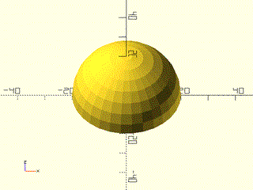

    include <BOSL2/std.scad>
    top_half() sphere(r=20);

  

**Example 2:** 

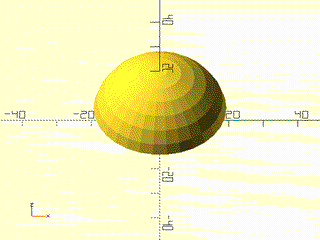

    include <BOSL2/std.scad>
    top_half(z=5) sphere(r=20);

  

---

## Section: Partioning into Interlocking Pieces

### Module: partition\_mask()

**Usage:** 

- partition\_mask(l, w, h, [cutsize], [cutpath], [gap], [inverse], [spin], [orient],);

**Description:** 

Creates a mask that you can use to difference or intersect with an object to remove half of it, leaving behind a side designed to allow assembly of the sub-parts.

**Arguments:** 

<abbr title="These args can be used by position or by name.">By&nbsp;Position</abbr> | What it does
-------------------- | ------------
`l`                  | The length of the cut axis.
`w`                  | The width of the part to be masked, back from the cut plane.
`h`                  | The height of the part to be masked.
`cutsize`            | The width of the cut pattern to be used.
`cutpath`            | The cutpath to use.  Standard named paths are "flat", "sawtooth", "sinewave", "comb", "finger", "dovetail", "hammerhead", and "jigsaw".  Alternatively, you can give a cutpath as a 2D path, where X is between 0 and 1, and Y is between -0.5 and 0.5.
`gap`                | Empty gaps between cutpath iterations.  Default: 0
`inverse`            | If true, create a cutpath that is meant to mate to a non-inverted cutpath.
`spin`               | Rotate this many degrees around the Z axis.  See [spin](attachments.scad#subsection-spin).  Default: `0`
`orient`             | Vector to rotate top towards.  See [orient](attachments.scad#subsection-orient).  Default: `UP`
`$slop`              | The amount to shrink the mask by, to correct for printer-specific fitting.

**Example 1:** 

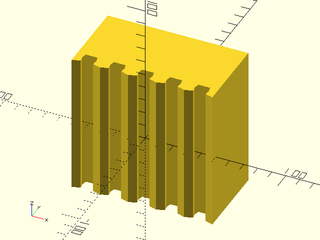

    include <BOSL2/std.scad>
    partition_mask(w=50, gap=0, cutpath="jigsaw");

  

**Example 2:** 

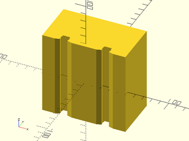

    include <BOSL2/std.scad>
    partition_mask(w=50, gap=30, cutpath="jigsaw");

  

**Example 3:** 

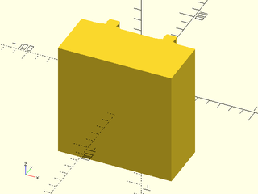

    include <BOSL2/std.scad>
    partition_mask(w=50, gap=30, cutpath="jigsaw", inverse=true);

  

**Example 4:** 

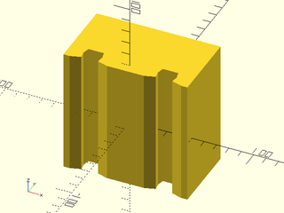

    include <BOSL2/std.scad>
    partition_mask(w=50, gap=30, cutsize=15, cutpath="jigsaw");

  

**Example 5:** 

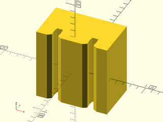

 

    include <BOSL2/std.scad>
    partition_mask(w=50, cutsize=[20,20], gap=30, cutpath="jigsaw");

**Example 6:** 

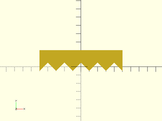

    include <BOSL2/std.scad>
    partition_mask(w=20, cutpath="sawtooth");

  

**Example 7:** 

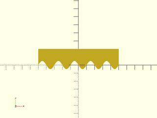

    include <BOSL2/std.scad>
    partition_mask(w=20, cutpath="sinewave");

  

**Example 8:** 

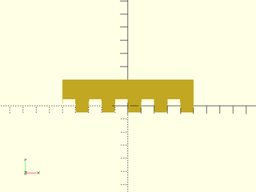

    include <BOSL2/std.scad>
    partition_mask(w=20, cutpath="comb");

  

**Example 9:** 

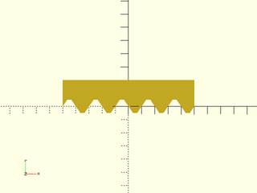

    include <BOSL2/std.scad>
    partition_mask(w=20, cutpath="finger");

  

**Example 10:** 

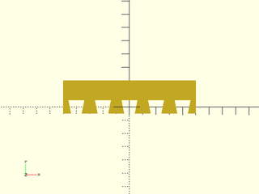

    include <BOSL2/std.scad>
    partition_mask(w=20, cutpath="dovetail");

  

**Example 11:** 

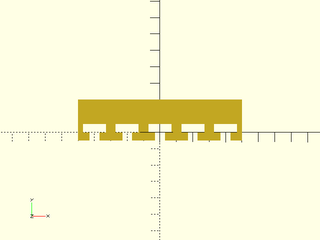

    include <BOSL2/std.scad>
    partition_mask(w=20, cutpath="hammerhead");

  

**Example 12:** 

    include <BOSL2/std.scad>
    partition_mask(w=20, cutpath="jigsaw");

  

---

### Module: partition\_cut\_mask()

**Usage:** 

- partition\_cut\_mask(l, w, h, [cutsize], [cutpath], [gap], [inverse], [spin], [orient]);

**Description:** 

Creates a mask that you can use to difference with an object to cut it into two sub-parts that can be assembled.
The `$slop` value is important to get the proper fit and should probably be smaller than 0.2.  The examples below
use larger values to make the mask easier to see.

**Arguments:** 

<abbr title="These args can be used by position or by name.">By&nbsp;Position</abbr> | What it does
-------------------- | ------------
`l`                  | The length of the cut axis.
`w`                  | The width of the part to be masked, back from the cut plane.
`h`                  | The height of the part to be masked.
`cutsize`            | The width of the cut pattern to be used.
`cutpath`            | The cutpath to use.  Standard named paths are "flat", "sawtooth", "sinewave", "comb", "finger", "dovetail", "hammerhead", and "jigsaw".  Alternatively, you can give a cutpath as a 2D path, where X is between 0 and 1, and Y is between -0.5 and 0.5.  Default: "jigsaw"
`gap`                | Empty gaps between cutpath iterations.  Default: 0
`spin`               | Rotate this many degrees around the Z axis.  See [spin](attachments.scad#subsection-spin).  Default: `0`
`orient`             | Vector to rotate top towards.  See [orient](attachments.scad#subsection-orient).  Default: `UP`
`$slop`              | The width of the cut mask, to correct for printer-specific fitting.  Min: 0.05.

**Example 1:** 

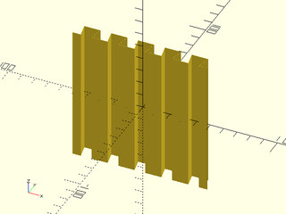

    include <BOSL2/std.scad>
    partition_cut_mask(gap=0, cutpath="dovetail");

  

**Example 2:** 

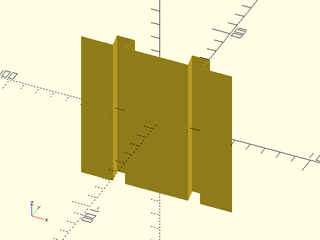

    include <BOSL2/std.scad>
    partition_cut_mask(gap=30, cutpath="dovetail");

  

**Example 3:** 

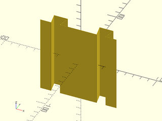

    include <BOSL2/std.scad>
    partition_cut_mask(gap=30, cutsize=15, cutpath="dovetail");

  

**Example 4:** 

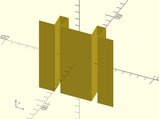

 

    include <BOSL2/std.scad>
    partition_cut_mask(gap=30, cutsize=[20,20], cutpath="dovetail");

**Example 5:** 

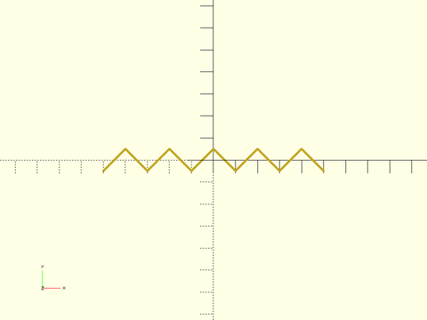

 

    include <BOSL2/std.scad>
    partition_cut_mask(cutpath="sawtooth",$slop=0.5);

**Example 6:** 

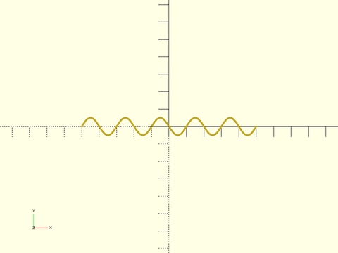

 

    include <BOSL2/std.scad>
    partition_cut_mask(cutpath="sinewave",$slop=0.5);

**Example 7:** 

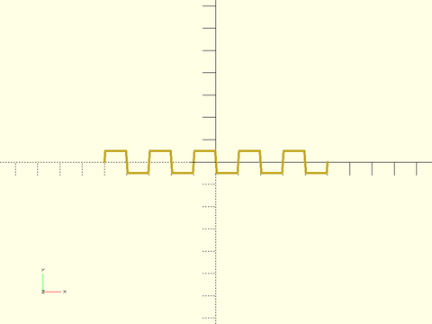

 

    include <BOSL2/std.scad>
    partition_cut_mask(cutpath="comb",$slop=0.5);

**Example 8:** 

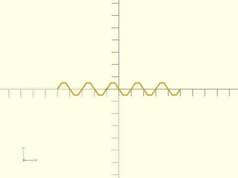

 

    include <BOSL2/std.scad>
    partition_cut_mask(cutpath="finger",$slop=0.5);

**Example 9:** 

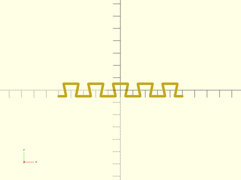

 

    include <BOSL2/std.scad>
    partition_cut_mask(cutpath="dovetail",$slop=1);

**Example 10:** 

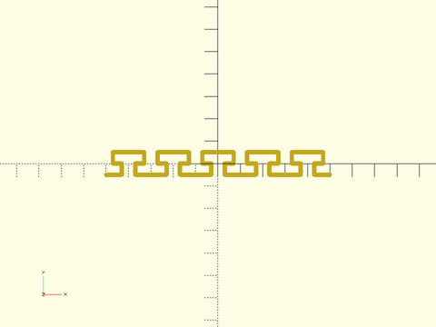

 

    include <BOSL2/std.scad>
    partition_cut_mask(cutpath="hammerhead",$slop=1);

**Example 11:** 

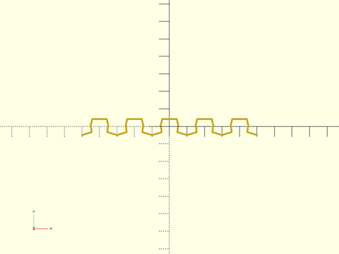

 

    include <BOSL2/std.scad>
    partition_cut_mask(cutpath="jigsaw",$slop=0.5);

---

### Module: partition()

**Usage:** 

- partition(size, [spread], [cutsize], [cutpath], [gap], [spin]) ...

**Description:** 

Partitions an object into two parts, spread apart a small distance, with matched joining edges.

**Arguments:** 

<abbr title="These args can be used by position or by name.">By&nbsp;Position</abbr> | What it does
-------------------- | ------------
`size`               | The [X,Y,Z] size of the object to partition.
`spread`             | The distance to spread the two parts by.
`cutsize`            | The width of the cut pattern to be used.
`cutpath`            | The cutpath to use.  Standard named paths are "flat", "sawtooth", "sinewave", "comb", "finger", "dovetail", "hammerhead", and "jigsaw".  Alternatively, you can give a cutpath as a 2D path, where X is between 0 and 1, and Y is between -0.5 and 0.5.
`gap`                | Empty gaps between cutpath iterations.  Default: 0
`spin`               | Rotate this many degrees around the Z axis.  See [spin](attachments.scad#subsection-spin).  Default: `0`

**Example 1:** 

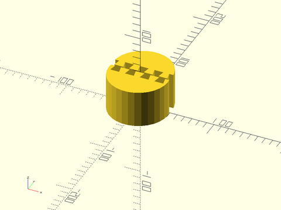

 

    include <BOSL2/std.scad>
    partition(spread=12, cutpath="dovetail") cylinder(h=50, d=80, center=false);

**Example 2:** 

 

    include <BOSL2/std.scad>
    partition(spread=12, gap=30, cutpath="dovetail") cylinder(h=50, d=80, center=false);

**Example 3:** 

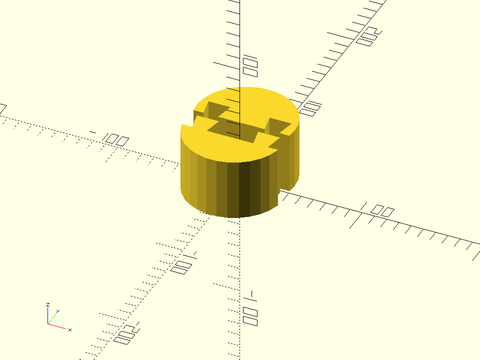

 

    include <BOSL2/std.scad>
    partition(spread=20, gap=20, cutsize=15, cutpath="dovetail") cylinder(h=50, d=80, center=false);

**Example 4:** 

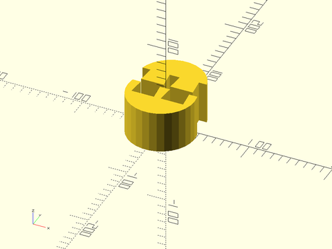

 

    include <BOSL2/std.scad>
    partition(spread=25, gap=15, cutsize=[20,20], cutpath="dovetail") cylinder(h=50, d=80, center=false);

**Example 5:** 

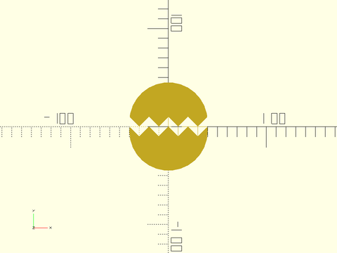

 

    include <BOSL2/std.scad>
    partition(cutpath="sawtooth") cylinder(h=50, d=80, center=false);

**Example 6:** 

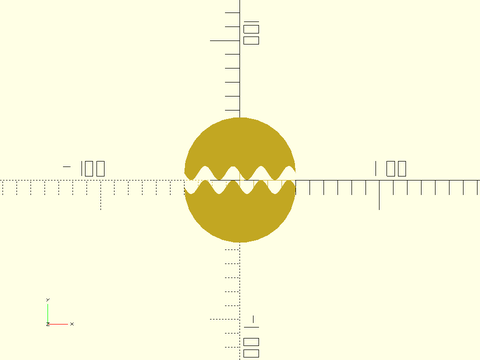

 

    include <BOSL2/std.scad>
    partition(cutpath="sinewave") cylinder(h=50, d=80, center=false);

**Example 7:** 

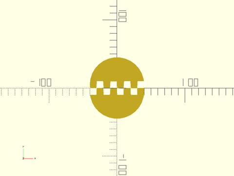

 

    include <BOSL2/std.scad>
    partition(cutpath="comb") cylinder(h=50, d=80, center=false);

**Example 8:** 

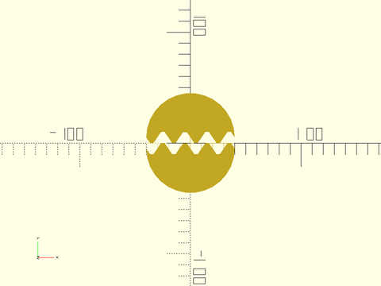

 

    include <BOSL2/std.scad>
    partition(cutpath="finger") cylinder(h=50, d=80, center=false);

**Example 9:** 

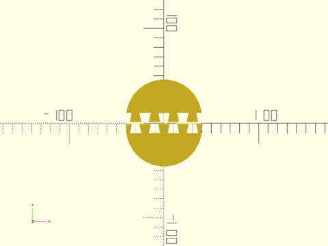

 

    include <BOSL2/std.scad>
    partition(spread=12, cutpath="dovetail") cylinder(h=50, d=80, center=false);

**Example 10:** 

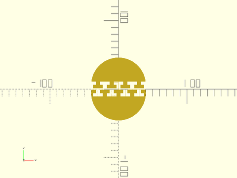

 

    include <BOSL2/std.scad>
    partition(spread=12, cutpath="hammerhead") cylinder(h=50, d=80, center=false);

**Example 11:** 

 

    include <BOSL2/std.scad>
    partition(cutpath="jigsaw") cylinder(h=50, d=80, center=false);

---

