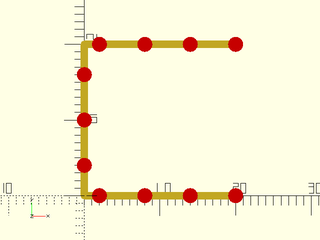
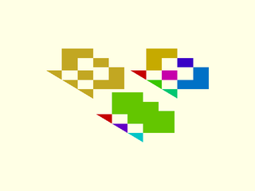

# LibFile: paths.scad

A `path` is a list of points of the same dimensions, usually 2D or 3D, that can
be connected together to form a sequence of line segments or a polygon.
The functions in this file work on paths and also 1-regions, which are regions
that include exactly one path.  When you pass a 1-region to a function, the default
value for `closed` is always `true` because regions represent polygons.
Capabilities include computing length of paths, computing
path tangents and normals, resampling of paths, and cutting paths up into smaller paths.

To use, add the following lines to the beginning of your file:

    include <BOSL2/std.scad>

## Table of Contents

1. [Section: Utility Functions](#section-utility-functions)
    - [`is_path()`](#function-is_path)
    - [`is_1region()`](#function-is_1region)
    - [`force_path()`](#function-force_path)
    - [`is_closed_path()`](#function-is_closed_path)
    - [`close_path()`](#function-close_path)
    - [`cleanup_path()`](#function-cleanup_path)
    - [`path_merge_collinear()`](#function-path_merge_collinear)

2. [Section: Path length calculation](#section-path-length-calculation)
    - [`path_length()`](#function-path_length)
    - [`path_segment_lengths()`](#function-path_segment_lengths)
    - [`path_length_fractions()`](#function-path_length_fractions)

3. [Section: Resampling---changing the number of points in a path](#section-resampling---changing-the-number-of-points-in-a-path)
    - [`subdivide_path()`](#function-subdivide_path)
    - [`subdivide_long_segments()`](#function-subdivide_long_segments)
    - [`resample_path()`](#function-resample_path)

4. [Section: Path Geometry](#section-path-geometry)
    - [`is_path_simple()`](#function-is_path_simple)
    - [`path_closest_point()`](#function-path_closest_point)
    - [`path_tangents()`](#function-path_tangents)
    - [`path_normals()`](#function-path_normals)
    - [`path_curvature()`](#function-path_curvature)
    - [`path_torsion()`](#function-path_torsion)

5. [Section: Breaking paths up into subpaths](#section-breaking-paths-up-into-subpaths)
    - [`path_cut()`](#function-path_cut)
    - [`split_path_at_self_crossings()`](#function-split_path_at_self_crossings)
    - [`polygon_parts()`](#function-polygon_parts)

## Section: Utility Functions

### Function: is\_path()

**Usage:** 

- is\_path(list, [dim], [fast])

**Description:** 

Returns true if `list` is a path.  A path is a list of two or more numeric vectors (AKA points).
All vectors must of the same size, and may only contain numbers that are not inf or nan.
By default the vectors in a path must be 2d or 3d.  Set the `dim` parameter to specify a list
of allowed dimensions, or set it to `undef` to allow any dimension.  (Note that this function
returns `false` on 1-regions.)

**Arguments:** 

<abbr title="These args can be used by position or by name.">By&nbsp;Position</abbr> | What it does
-------------------- | ------------
`list`               | list to check
`dim`                | list of allowed dimensions of the vectors in the path.  Default: [2,3]
`fast`               | set to true for fast check that only looks at first entry.  Default: false

**Example 1:** 

    include <BOSL2/std.scad>
    bool1 = is_path([[3,4],[5,6]]);    // Returns true
    bool2 = is_path([[3,4]]);          // Returns false
    bool3 = is_path([[3,4],[4,5]],2);  // Returns true
    bool4 = is_path([[3,4,3],[5,4,5]],2);  // Returns false
    bool5 = is_path([[3,4,3],[5,4,5]],2);  // Returns false
    bool6 = is_path([[3,4,5],undef,[4,5,6]]);  // Returns false
    bool7 = is_path([[3,5],[undef,undef],[4,5]]);  // Returns false
    bool8 = is_path([[3,4],[5,6],[5,3]]);     // Returns true
    bool9 = is_path([3,4,5,6,7,8]);           // Returns false
    bool10 = is_path([[3,4],[5,6]], dim=[2,3]);// Returns true
    bool11 = is_path([[3,4],[5,6]], dim=[1,3]);// Returns false
    bool12 = is_path([[3,4],"hello"], fast=true); // Returns true
    bool13 = is_path([[3,4],[3,4,5]]);            // Returns false
    bool14 = is_path([[1,2,3,4],[2,3,4,5]]);      // Returns false
    bool15 = is_path([[1,2,3,4],[2,3,4,5]],undef);// Returns true

  

---

### Function: is\_1region()

**Usage:** 

- bool = is\_1region(path, [name])

**Description:** 

If `path` is a region with one component (a 1-region) then return true.  If path is a region with more components
then display an error message about the parameter `name` requiring a path or a single component region.  If the input
is not a region then return false.  This function helps path functions accept 1-regions.

**Arguments:** 

<abbr title="These args can be used by position or by name.">By&nbsp;Position</abbr> | What it does
-------------------- | ------------
`path`               | input to process
`name`               | name of parameter to use in error message.  Default: "path"

---

### Function: force\_path()

**Usage:** 

- outpath = force\_path(path, [name])

**Description:** 

If `path` is a region with one component (a 1-region) then return that component as a path.  If path is a region with more components
then display an error message about the parameter `name` requiring a path or a single component region.  If the input
is not a region then return the input without any checks.  This function helps path functions accept 1-regions.

**Arguments:** 

<abbr title="These args can be used by position or by name.">By&nbsp;Position</abbr> | What it does
-------------------- | ------------
`path`               | input to process
`name`               | name of parameter to use in error message.  Default: "path"

---

### Function: is\_closed\_path()

**Usage:** 

- is\_closed\_path(path, [eps]);

**Description:** 

Returns true if the first and last points in the given path are coincident.

---

### Function: close\_path()

**Usage:** 

- close\_path(path);

**Description:** 

If a path's last point does not coincide with its first point, closes the path so it does.

---

### Function: cleanup\_path()

**Usage:** 

- cleanup\_path(path);

**Description:** 

If a path's last point coincides with its first point, deletes the last point in the path.

---

### Function: path\_merge\_collinear()

**Usage:** 

- path\_merge\_collinear(path, [eps])

**Description:** 

Takes a path and removes unnecessary sequential collinear points.

**Arguments:** 

<abbr title="These args can be used by position or by name.">By&nbsp;Position</abbr> | What it does
-------------------- | ------------
`path`               | A path of any dimension or a 1-region
`closed`             | treat as closed polygon.  Default: false
`eps`                | Largest positional variance allowed.  Default: `EPSILON` (1-e9)

---

## Section: Path length calculation

### Function: path\_length()

**Usage:** 

- path\_length(path,[closed])

**Description:** 

Returns the length of the path.

**Arguments:** 

<abbr title="These args can be used by position or by name.">By&nbsp;Position</abbr> | What it does
-------------------- | ------------
`path`               | Path of any dimension or 1-region.
`closed`             | true if the path is closed.  Default: false

**Example 1:** 

    include <BOSL2/std.scad>
    path = [[0,0], [5,35], [60,-25], [80,0]];
    echo(path_length(path));

  

---

### Function: path\_segment\_lengths()

**Usage:** 

- path\_segment\_lengths(path,[closed])

**Description:** 

Returns list of the length of each segment in a path

**Arguments:** 

<abbr title="These args can be used by position or by name.">By&nbsp;Position</abbr> | What it does
-------------------- | ------------
`path`               | path in any dimension or 1-region
`closed`             | true if the path is closed.  Default: false

---

### Function: path\_length\_fractions()

**Usage:** 

- fracs = path\_length\_fractions(path, [closed]);

**Description:** 

Returns the distance fraction of each point in the path along the path, so the first
point is zero and the final point is 1.  If the path is closed the length of the output
will have one extra point because of the final connecting segment that connects the last
point of the path to the first point.

**Arguments:** 

<abbr title="These args can be used by position or by name.">By&nbsp;Position</abbr> | What it does
-------------------- | ------------
`path`               | path in any dimension or a 1-region
`closed`             | set to true if path is closed.  Default: false

---

## Section: Resampling---changing the number of points in a path

### Function: subdivide\_path()

**Usage:** 

- newpath = subdivide\_path(path, [N|refine], method, [closed], [exact]);

**Description:** 

Takes a path as input (closed or open) and subdivides the path to produce a more
finely sampled path.  The new points can be distributed proportional to length
(`method="length"`) or they can be divided up evenly among all the path segments
(`method="segment"`).  If the extra points don't fit evenly on the path then the
algorithm attempts to distribute them uniformly.  The `exact` option requires that
the final length is exactly as requested.  If you set it to `false` then the
algorithm will favor uniformity and the output path may have a different number of
points due to rounding error.

With the `"segment"` method you can also specify a vector of lengths.  This vector,
`N` specfies the desired point count on each segment: with vector input, `subdivide_path`
attempts to place `N[i]-1` points on segment `i`.  The reason for the -1 is to avoid
double counting the endpoints, which are shared by pairs of segments, so that for
a closed polygon the total number of points will be sum(N).  Note that with an open
path there is an extra point at the end, so the number of points will be sum(N)+1.

**Arguments:** 

<abbr title="These args can be used by position or by name.">By&nbsp;Position</abbr> | What it does
-------------------- | ------------
`path`               | path in any dimension or a 1-region
`N`                  | scalar total number of points desired or with `method="segment"` can be a vector requesting `N[i]-1` points on segment i.
`refine`             | number of points to add each segment.
`closed`             | set to false if the path is open.  Default: True
`exact`              | if true return exactly the requested number of points, possibly sacrificing uniformity.  If false, return uniform point sample that may not match the number of points requested.  Default: True
`method`             | One of `"length"` or `"segment"`.  If `"length"`, adds vertices evenly along the total path length.  If `"segment"`, adds points evenly among the segments.  Default: `"length"`

**Example 1:** 

    include <BOSL2/std.scad>
    mypath = subdivide_path(square([2,2],center=true), 12);
    move_copies(mypath)circle(r=.1,$fn=32);

  

**Example 2:** 

    include <BOSL2/std.scad>
    mypath = subdivide_path(square([8,2],center=true), 12);
    move_copies(mypath)circle(r=.2,$fn=32);

  

**Example 3:** 

 

    include <BOSL2/std.scad>
    mypath = subdivide_path(square([8,2],center=true), 12, method="segment");
    move_copies(mypath)circle(r=.2,$fn=32);

**Example 4:** 

 

    include <BOSL2/std.scad>
    mypath = subdivide_path(square([2,2],center=true), 17, closed=false);
    move_copies(mypath)circle(r=.1,$fn=32);

**Example 5:** Specifying different numbers of points on each segment

 

    include <BOSL2/std.scad>
    mypath = subdivide_path(hexagon(side=2), [2,3,4,5,6,7], method="segment");
    move_copies(mypath)circle(r=.1,$fn=32);

**Example 6:** Requested point total is 14 but 15 points output due to extra end point

 

    include <BOSL2/std.scad>
    mypath = subdivide_path(pentagon(side=2), [3,4,3,4], method="segment", closed=false);
    move_copies(mypath)circle(r=.1,$fn=32);

**Example 7:** Since 17 is not divisible by 5, a completely uniform distribution is not possible.

    include <BOSL2/std.scad>
    mypath = subdivide_path(pentagon(side=2), 17);
    move_copies(mypath)circle(r=.1,$fn=32);

  

**Example 8:** With `exact=false` a uniform distribution, but only 15 points

    include <BOSL2/std.scad>
    mypath = subdivide_path(pentagon(side=2), 17, exact=false);
    move_copies(mypath)circle(r=.1,$fn=32);

  

**Example 9:** With `exact=false` you can also get extra points, here 20 instead of requested 18

    include <BOSL2/std.scad>
    mypath = subdivide_path(pentagon(side=2), 18, exact=false);
    move_copies(mypath)circle(r=.1,$fn=32);

  

**Example 10:** Three-dimensional paths also work

    include <BOSL2/std.scad>
    mypath = subdivide_path([[0,0,0],[2,0,1],[2,3,2]], 12);
    move_copies(mypath)sphere(r=.1,$fn=32);

  

---

### Function: subdivide\_long\_segments()

**Topics:** [Paths](Topics#paths), [Path Subdivision](Topics#path-subdivision)

**Usage:** 

- spath = subdivide\_long\_segments(path, maxlen, [closed=]);

**Description:** 

Evenly subdivides long `path` segments until they are all shorter than `maxlen`.

**Arguments:** 

<abbr title="These args can be used by position or by name.">By&nbsp;Position</abbr> | What it does
-------------------- | ------------
`path`               | path in any dimension or a 1-region
`maxlen`             | The maximum allowed path segment length.

<abbr title="These args must be used by name, ie: name=value">By&nbsp;Name</abbr> | What it does
-------------------- | ------------
`closed`             | If true, treat path like a closed polygon.  Default: true

**See Also:** [subdivide\_path()](#function-subdivide_path), [subdivide\_and\_slice()](skin.scad#function-subdivide_and_slice), [jittered\_poly()](shapes2d.scad#module-jittered_poly)

**Example 1:** 

    include <BOSL2/std.scad>
    path = pentagon(d=100);
    spath = subdivide_long_segments(path, 10, closed=true);
    stroke(path,width=2,closed=true);
    color("red") move_copies(path) circle(d=9,$fn=12);
    color("blue") move_copies(spath) circle(d=5,$fn=12);

  

---

### Function: resample\_path()

**Usage:** 

- newpath = resample\_path(path, N|spacing, [closed]);

**Description:** 

Compute a uniform resampling of the input path.  If you specify `N` then the output path will have N
points spaced uniformly (by linear interpolation along the input path segments).  The only points of the
input path that are guaranteed to appear in the output path are the starting and ending points.
If you specify `spacing` then the length you give will be rounded to the nearest spacing that gives
a uniform sampling of the path and the resulting uniformly sampled path is returned.
Note that because this function operates on a discrete input path the quality of the output depends on
the sampling of the input.  If you want very accurate output, use a lot of points for the input.

**Arguments:** 

<abbr title="These args can be used by position or by name.">By&nbsp;Position</abbr> | What it does
-------------------- | ------------
`path`               | path in any dimension or a 1-region
`N`                  | Number of points in output

<abbr title="These args must be used by name, ie: name=value">By&nbsp;Name</abbr> | What it does
-------------------- | ------------
`spacing`            | Approximate spacing desired
`closed`             | set to true if path is closed.  Default: true

**Example 1:** Subsampling lots of points from a smooth curve

    include <BOSL2/std.scad>
    path = xscale(2,circle($fn=250, r=10));
    sampled = resample_path(path, 16);
    stroke(path);
    color("red")move_copies(sampled) circle($fn=16);

  

**Example 2:** Specified spacing is rounded to make a uniform sampling

    include <BOSL2/std.scad>
    path = xscale(2,circle($fn=250, r=10));
    sampled = resample_path(path, spacing=17);
    stroke(path);
    color("red")move_copies(sampled) circle($fn=16);

  

**Example 3:** Notice that the corners are excluded

    include <BOSL2/std.scad>
    path = square(20);
    sampled = resample_path(path, spacing=6);
    stroke(path,closed=true);
    color("red")move_copies(sampled) circle($fn=16);

  

**Example 4:** Closed set to false

    include <BOSL2/std.scad>
    path = square(20);
    sampled = resample_path(path, spacing=6,closed=false);
    stroke(path);
    color("red")move_copies(sampled) circle($fn=16);

  

---

## Section: Path Geometry

### Function: is\_path\_simple()

**Usage:** 

- bool = is\_path\_simple(path, [closed], [eps]);

**Description:** 

Returns true if the given 2D path is simple, meaning that it has no self-intersections.
Repeated points are not considered self-intersections: a path with such points can
still be simple.
If closed is set to true then treat the path as a polygon.

**Arguments:** 

<abbr title="These args can be used by position or by name.">By&nbsp;Position</abbr> | What it does
-------------------- | ------------
`path`               | 2D path or 1-region
`closed`             | set to true to treat path as a polygon.  Default: false
`eps`                | Epsilon error value used for determine if points coincide.  Default: `EPSILON` (1e-9)

---

### Function: path\_closest\_point()

**Usage:** 

- path\_closest\_point(path, pt);

**Description:** 

Finds the closest path segment, and point on that segment to the given point.
Returns `[SEGNUM, POINT]`

**Arguments:** 

<abbr title="These args can be used by position or by name.">By&nbsp;Position</abbr> | What it does
-------------------- | ------------
`path`               | path of any dimension or a 1-region
`pt`                 | the point to find the closest point to
`closed`             | 

**Example 1:** 

    include <BOSL2/std.scad>
    path = circle(d=100,$fn=6);
    pt = [20,10];
    closest = path_closest_point(path, pt);
    stroke(path, closed=true);
    color("blue") translate(pt) circle(d=3, $fn=12);
    color("red") translate(closest[1]) circle(d=3, $fn=12);

  

---

### Function: path\_tangents()

**Usage:** 

- tangs = path\_tangents(path, [closed], [uniform]);

**Description:** 

Compute the tangent vector to the input path.  The derivative approximation is described in deriv().
The returns vectors will be normalized to length 1.  If any derivatives are zero then
the function fails with an error.  If you set `uniform` to false then the sampling is
assumed to be non-uniform and the derivative is computed with adjustments to produce corrected
values.

**Arguments:** 

<abbr title="These args can be used by position or by name.">By&nbsp;Position</abbr> | What it does
-------------------- | ------------
`path`               | path of any dimension or a 1-region
`closed`             | set to true of the path is closed.  Default: false
`uniform`            | set to false to correct for non-uniform sampling.  Default: true

**Example 1:** A shape with non-uniform sampling gives distorted derivatives that may be undesirable.  Note that derivatives tilt towards the long edges of the rectangle.

 

    include <BOSL2/std.scad>
    rect = square([10,3]);
    tangents = path_tangents(rect,closed=true);
    stroke(rect,closed=true, width=0.25);
    color("purple")
        for(i=[0:len(tangents)-1])
            stroke([rect[i]-tangents[i], rect[i]+tangents[i]],width=.25, endcap2="arrow2");

**Example 2:** Setting uniform to false corrects the distorted derivatives for this example:

 

    include <BOSL2/std.scad>
    rect = square([10,3]);
    tangents = path_tangents(rect,closed=true,uniform=false);
    stroke(rect,closed=true, width=0.25);
    color("purple")
        for(i=[0:len(tangents)-1])
            stroke([rect[i]-tangents[i], rect[i]+tangents[i]],width=.25, endcap2="arrow2");

---

### Function: path\_normals()

**Usage:** 

- norms = path\_normals(path, [tangents], [closed]);

**Description:** 

Compute the normal vector to the input path.  This vector is perpendicular to the
path tangent and lies in the plane of the curve.  For 3d paths we define the plane of the curve
at path point i to be the plane defined by point i and its two neighbors.  At the endpoints of open paths
we use the three end points.  For 3d paths the computed normal is the one lying in this plane that points
towards the center of curvature at that path point.  For 2d paths, which lie in the xy plane, the normal
is the path pointing to the right of the direction the path is traveling.  If points are collinear then
a 3d path has no center of curvature, and hence the
normal is not uniquely defined.  In this case the function issues an error.
For 2d paths the plane is always defined so the normal fails to exist only
when the derivative is zero (in the case of repeated points).

**Arguments:** 

<abbr title="These args can be used by position or by name.">By&nbsp;Position</abbr> | What it does
-------------------- | ------------
`path`               | 2D or 3D path or a 1-region
`tangents`           | path tangents optionally supplied
`closed`             | if true path is treated as a polygon.  Default: false

---

### Function: path\_curvature()

**Usage:** 

- curvs = path\_curvature(path, [closed]);

**Description:** 

Numerically estimate the curvature of the path (in any dimension).

**Arguments:** 

<abbr title="These args can be used by position or by name.">By&nbsp;Position</abbr> | What it does
-------------------- | ------------
`path`               | path in any dimension or a 1-region
`closed`             | if true then treat the path as a polygon.  Default: false

---

### Function: path\_torsion()

**Usage:** 

- torsions = path\_torsion(path, [closed]);

**Description:** 

Numerically estimate the torsion of a 3d path.

**Arguments:** 

<abbr title="These args can be used by position or by name.">By&nbsp;Position</abbr> | What it does
-------------------- | ------------
`path`               | 3D path
`closed`             | if true then treat path as a polygon.  Default: false

---

## Section: Breaking paths up into subpaths

### Function: path\_cut()

**Topics:** [Paths](Topics#paths)

**Usage:** 

- path\_list = path\_cut(path, cutdist, [closed=]);

**Description:** 

Given a list of distances in `cutdist`, cut the path into
subpaths at those lengths, returning a list of paths.
If the input path is closed then the final path will include the
original starting point.  The list of cut distances must be
in ascending order and should not include the endpoints: 0
or len(path).  If you repeat a distance you will get an
empty list in that position in the output.  If you give an
empty cutdist array you will get the input path as output
(without the final vertex doubled in the case of a closed path).

**Arguments:** 

<abbr title="These args can be used by position or by name.">By&nbsp;Position</abbr> | What it does
-------------------- | ------------
`path`               | path of any dimension or a 1-region
`cutdist`            | Distance or list of distances where path is cut
`closed`             | If true, treat the path as a closed polygon.  Default: false

**See Also:** [split\_path\_at\_self\_crossings()](#function-split_path_at_self_crossings)

**Example 1:** 

    include <BOSL2/std.scad>
    path = circle(d=100);
    segs = path_cut(path, [50, 200], closed=true);
    rainbow(segs) stroke($item, endcaps="butt", width=3);

  

---

### Function: split\_path\_at\_self\_crossings()

**Usage:** 

- paths = split\_path\_at\_self\_crossings(path, [closed], [eps]);

**Description:** 

Splits a 2D path into sub-paths wherever the original path crosses itself.
Splits may occur mid-segment, so new vertices will be created at the intersection points.
Returns a list of the resulting subpaths.

**Arguments:** 

<abbr title="These args can be used by position or by name.">By&nbsp;Position</abbr> | What it does
-------------------- | ------------
`path`               | A 2D path or a 1-region.
`closed`             | If true, treat path as a closed polygon.  Default: true
`eps`                | Acceptable variance.  Default: `EPSILON` (1e-9)

**Example 1:** 

 

    include <BOSL2/std.scad>
    path = [ [-100,100], [0,-50], [100,100], [100,-100], [0,50], [-100,-100] ];
    paths = split_path_at_self_crossings(path);
    rainbow(paths) stroke($item, closed=false, width=3);

---

### Function: polygon\_parts()

**Usage:** 

- splitpolys = polygon\_parts(poly, [nonzero], [eps]);

**Description:** 

Given a possibly self-intersecting 2d polygon, constructs a representation of the original polygon as a list of
non-intersecting simple polygons.  If nonzero is set to true then it uses the nonzero method for defining polygon membership.
For simple cases, such as the pentagram, this will produce the outer perimeter of a self-intersecting polygon.

**Arguments:** 

<abbr title="These args can be used by position or by name.">By&nbsp;Position</abbr> | What it does
-------------------- | ------------
`poly`               | a 2D polygon or 1-region
`nonzero`            | If true use the nonzero method for checking if a point is in a polygon.  Otherwise use the even-odd method.  Default: false
`eps`                | The epsilon error value to determine whether two points coincide.  Default: `EPSILON` (1e-9)

**Example 1:** This cross-crossing polygon breaks up into its 3 components (regardless of the value of nonzero).

    include <BOSL2/std.scad>
    poly = [
        [-100,100], [0,-50], [100,100],
        [100,-100], [0,50], [-100,-100]
    ];
    splitpolys = polygon_parts(poly);
    rainbow(splitpolys) stroke($item, closed=true, width=3);

  

**Example 2:** With nonzero=false you get even-odd mode which matches OpenSCAD, so the pentagram breaks apart into its five points.

    include <BOSL2/std.scad>
    pentagram = turtle(["move",100,"left",144], repeat=4);
    left(100)polygon(pentagram);
    rainbow(polygon_parts(pentagram,nonzero=false))
      stroke($item,closed=true,width=2.5);

  

**Example 3:** With nonzero=true you get only the outer perimeter.  You can use this to create the polygon using the nonzero method, which is not supported by OpenSCAD.

    include <BOSL2/std.scad>
    pentagram = turtle(["move",100,"left",144], repeat=4);
    outside = polygon_parts(pentagram,nonzero=true);
    left(100)region(outside);
    rainbow(outside)
      stroke($item,closed=true,width=2.5);

  

**Example 4:** 

    include <BOSL2/std.scad>
    N=12;
    ang=360/N;
    sr=10;
    poly = turtle(["angle", 90+ang/2,
                   "move", sr, "left",
                   "move", 2*sr*sin(ang/2), "left",
                   "repeat", 4,
                      ["move", 2*sr, "left",
                       "move", 2*sr*sin(ang/2), "left"],
                   "move", sr]);
    stroke(poly, width=.3);
    right(20)rainbow(polygon_parts(poly)) polygon($item);

  

**Example 5:** overlapping poly segments disappear

 

    include <BOSL2/std.scad>
    poly = [[0,0], [10,0], [10,10], [0,10],[0,20], [20,10],[10,10], [0,10],[0,0]];
    stroke(poly,width=0.3);
    right(22)stroke(polygon_parts(poly)[0], width=0.3, closed=true);

**Example 6:** Poly segments disappear outside as well

 

    include <BOSL2/std.scad>
    poly = turtle(["repeat", 3, ["move", 17, "left", "move", 10, "left", "move", 7, "left", "move", 10, "left"]]);
    back(2)stroke(poly,width=.5);
    fwd(12)rainbow(polygon_parts(poly)) stroke($item, closed=true, width=0.5);

**Example 7:** This shape has six components

 

    include <BOSL2/std.scad>
    poly = turtle(["repeat", 3, ["move", 15, "left", "move", 7, "left", "move", 10, "left", "move", 17, "left"]]);
    polygon(poly);
    right(22)rainbow(polygon_parts(poly)) polygon($item);

**Example 8:** When the loops of the shape overlap then nonzero gives a different result than the even-odd method.

 

    include <BOSL2/std.scad>
    poly = turtle(["repeat", 3, ["move", 15, "left", "move", 7, "left", "move", 10, "left", "move", 10, "left"]]);
    polygon(poly);
    right(27)rainbow(polygon_parts(poly)) polygon($item);
    move([16,-14])rainbow(polygon_parts(poly,nonzero=true)) polygon($item);

---

