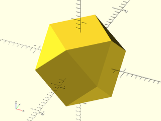
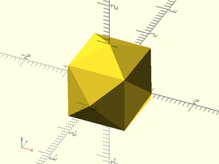

# LibFile: polyhedra.scad

Useful platonic, archimedian, and catalan polyhedra.

To use, add the following lines to the beginning of your file:

    include <BOSL2/std.scad>
    include <BOSL2/polyhedra.scad>

## Table of Contents

1. [Section: Polyhedra](#section-polyhedra)
    - [`regular_polyhedron()`](#module-regular_polyhedron)
    - [`regular_polyhedron_info()`](#function-regular_polyhedron_info)

## Section: Polyhedra

### Module: regular\_polyhedron()

**Description:** 

Creates a regular polyhedron with optional rounding.  Children are placed on the polyhedron's faces.

**Selecting the polyhedron:**
You constrain the polyhedra list by specifying different characteristics, that must all be met
* `name`: e.g. `"dodecahedron"` or `"pentagonal icositetrahedron"`
* `type`: Options are `"platonic"`, `"archimedean"` and `"catalan"`
* `faces`: The required number of faces
* `facetype`: The required face type(s).  List of vertex counts for the faces.  Exactly the listed types of faces must appear:
  * `facetype = 3`: polyhedron with all triangular faces.
  * `facetype = [5,6]`: polyhedron with only pentagons and hexagons. (Must have both!)
* hasfaces: The list of vertex counts for faces; at least one listed type must appear:
  * `hasfaces = 3`: polygon has at least one triangular face
  * `hasfaces = [5,6]`: polygon has a hexagonal or a pentagonal face

The result is a list of selected polyhedra.  You then specify `index` to choose which one of the
remaining polyhedra you want.  If you don't give `index` the first one on the list is created.
Two examples:
* `faces=12, index=2`:  Creates the 3rd solid with 12 faces
* `type="archimedean", faces=14`: Creates the first archimedean solid with 14 faces (there are 3)

**Choosing the size of your polyhedron:**
The default is to create a polyhedron whose smallest edge has length 1.  You can specify the
smallest edge length with the size option.  Alternatively you can specify the size of the
inscribed sphere, midscribed sphere, or circumscribed sphere using `ir`, `mr` and `cr` respectively.
If you specify `cr=3` then the outermost points of the polyhedron will be 3 units from the center.
If you specify `ir=3` then the innermost faces of the polyhedron will be 3 units from the center.
For the platonic solids every face meets the inscribed sphere and every corner touches the
circumscribed sphere.  For the Archimedean solids the inscribed sphere will touch only some of
the faces and for the Catalan solids the circumscribed sphere meets only some of the corners.

**Orientation:**
Orientation is controled by the facedown parameter.  Set this to false to get the canonical orientation.
Set it to true to get the largest face oriented down.  If you set it to a number the module searches for
a face with the specified number of vertices and orients that face down.

**Rounding:**
If you specify the rounding parameter the module makes a rounded polyhedron by first creating an
undersized model and then expanding it with `minkowski()`.  This only produces the correct result
if the in-sphere contacts all of the faces of the polyhedron, which is true for the platonic, the
catalan solids and the trapezohedra but false for the archimedean solids.

**Children:**
The module places children on the faces of the polyhedron.  The child coordinate system is
positioned so that the origin is the center of the face.  If `rotate_children` is true (default)
then the coordinate system is oriented so the z axis is normal to the face, which lies in the xy
plane.  If you give `repeat=true` (default) the children are cycled through to cover all faces.
With `repeat=false` each child is used once.  You can specify `draw=false` to suppress drawing of
the polyhedron, e.g. to use for `difference()` operations.  The module sets various parameters
you can use in your children (see the side effects list below).

**Stellation:**
Technically stellation is an operation of shifting the polyhedron's faces to produce a new shape
that may have self-intersecting faces.  OpenSCAD cannot handle self-intersecting faces, so we
instead erect a pyramid on each face, a process technically referred to as augmentation.  The
height of the pyramid is given by the `stellate` argument.  If `stellate` is `false` or `0` then
no stellation is performed.  Otherwise stellate gives the pyramid height as a multiple of the
edge length.  A negative pyramid height can be used to perform excavation, where a pyramid is
removed from each face.

**Special Polyhedra:**
These can be selected only by name and may require different parameters, or ignore some standard
parameters.
* Trapezohedron: a family of solids with an even number of kite shaped sides.
  One example of a trapezohedron is the d10 die, which is a 10 face trapezohedron.
  You must specify exactly two of `side`, `longside`, `h`, and `r` (or `d`).
  You cannot create trapezohedron shapes using `mr`, `ir`, or `or`.
  * `side`: Length of the short side.
  * `longside`: Length of the long side that extends to the apex.
  * `h`: Distance from the center to the apex.
  * `r`: Radius of the polygon that defines the equatorial vertices.
  * `d`: Diameter of the polygon that defines the equatorial vertices.

* Named stellations: various polyhedra such as the Kepler-Poinsot solids are stellations with
 specific pyramid heights.  To make them easier to generate you can specify them by name.
 This is equivalent to giving the name of the appropriate base solid and the magic stellate
 parameter needed to produce that shape.  The supported solids are:
  * `"great dodecahedron"`
  * `"small stellated dodecahedron"`
  * `"great stellated dodecahedron"`
  * `"small triambic icosahedron"`

**Arguments:** 

<abbr title="These args can be used by position or by name.">By&nbsp;Position</abbr> | What it does
-------------------- | ------------
`name`               | Name of polyhedron to create.

<abbr title="These args must be used by name, ie: name=value">By&nbsp;Name</abbr> | What it does
-------------------- | ------------
`index`              | Index to select from polyhedron list.  Default: 0.
`type`               | Type of polyhedron: "platonic", "archimedean", "catalan".
`faces`              | Number of faces.
`facetype`           | Scalar or vector listing required type of faces as vertex count.  Polyhedron must have faces of every type listed and no other types.
`hasfaces`           | Scalar of vector list face vertex counts.  Polyhedron must have at least one of the listed types of face.
`side`               | Length of the smallest edge of the polyhedron.  Default: 1.
`ir`                 | inner radius.  Polyhedron is scaled so it has the specified inner radius. Overrides side.
`mr`                 | middle radius.  Polyhedron is scaled so it has the specified middle radius.  Overrides side.
`or`                 | outer radius.   Polyhedron is scaled so it has the specified outer radius.  Overrides side.
`r`                  | outer radius.  Overrides or.
`d`                  | outer diameter.  Overrides or.
`anchor`             | Side of the origin to anchor to.  The bounding box of the polyhedron is aligned as specified.  Use directional constants from `constants.scad`.  Default: `CENTER`
`center`             | If given, overrides `anchor`.  A true value sets `anchor=CENTER`, false sets `anchor=UP+BACK+RIGHT`.
`facedown`           | If false display the solid in native orientation.  If true orient it with a largest face down.  If set to a vertex count, orient it so a face with the specified number of vertices is down.  Default: true.
`rounding`           | Specify a rounding radius for the shape.  Note that depending on $fn the dimensions of the shape may have small dimensional errors.
`repeat`             | If true then repeat the children to fill all the faces.  If false use only the available children and stop.  Default: true.
`draw`               | If true then draw the polyhedron.  If false, draw the children but not the polyhedron.  Default: true.
`rotate_children`    | If true then orient children normal to their associated face.  If false orient children to the parent coordinate system.  Default: true.
`stellate`           | Set to a number to erect a pyramid on every face of your polyhedron with the specified height.  The height is a multiple of the side length.  Default: false.
`longside`           | Specify the long side length for a trapezohedron.  Ignored for other shapes.
`h`                  | Specify the height of the apex for a trapezohedron.  Ignored for other shapes.

**Side Effects:** 

- `$faceindex` - Index number of the face
- `$face` - Coordinates of the face (2d if rotate\_children==true, 3d if not)
- `$center` - Face center in the child coordinate system

**Example 1:** All of the available polyhedra by name in their native orientation

    include <BOSL2/std.scad>
    include <BOSL2/polyhedra.scad>
    regular_polyhedron("tetrahedron", facedown=false);

  

**Example 2:** 

    include <BOSL2/std.scad>
    include <BOSL2/polyhedra.scad>
    regular_polyhedron("cube", facedown=false);

  

**Example 3:** 

    include <BOSL2/std.scad>
    include <BOSL2/polyhedra.scad>
    regular_polyhedron("octahedron", facedown=false);

  

**Example 4:** 

    include <BOSL2/std.scad>
    include <BOSL2/polyhedra.scad>
    regular_polyhedron("dodecahedron", facedown=false);

  

**Example 5:** 

    include <BOSL2/std.scad>
    include <BOSL2/polyhedra.scad>
    regular_polyhedron("icosahedron", facedown=false);

  

**Example 6:** 

    include <BOSL2/std.scad>
    include <BOSL2/polyhedra.scad>
    regular_polyhedron("truncated tetrahedron", facedown=false);

  

**Example 7:** 

    include <BOSL2/std.scad>
    include <BOSL2/polyhedra.scad>
    regular_polyhedron("truncated octahedron", facedown=false);

  

**Example 8:** 

    include <BOSL2/std.scad>
    include <BOSL2/polyhedra.scad>
    regular_polyhedron("truncated cube", facedown=false);

  

**Example 9:** 

    include <BOSL2/std.scad>
    include <BOSL2/polyhedra.scad>
    regular_polyhedron("truncated icosahedron", facedown=false);

  

**Example 10:** 

    include <BOSL2/std.scad>
    include <BOSL2/polyhedra.scad>
    regular_polyhedron("truncated dodecahedron", facedown=false);

  

**Example 11:** 

    include <BOSL2/std.scad>
    include <BOSL2/polyhedra.scad>
    regular_polyhedron("cuboctahedron", facedown=false);

  

**Example 12:** 

    include <BOSL2/std.scad>
    include <BOSL2/polyhedra.scad>
    regular_polyhedron("icosidodecahedron", facedown=false);

  

**Example 13:** 

    include <BOSL2/std.scad>
    include <BOSL2/polyhedra.scad>
    regular_polyhedron("rhombicuboctahedron", facedown=false);

  

**Example 14:** 

    include <BOSL2/std.scad>
    include <BOSL2/polyhedra.scad>
    regular_polyhedron("rhombicosidodecahedron", facedown=false);

  

**Example 15:** 

    include <BOSL2/std.scad>
    include <BOSL2/polyhedra.scad>
    regular_polyhedron("truncated cuboctahedron", facedown=false);

  

**Example 16:** 

 

    include <BOSL2/std.scad>
    include <BOSL2/polyhedra.scad>
    regular_polyhedron("truncated icosidodecahedron", facedown=false);

**Example 17:** 

    include <BOSL2/std.scad>
    include <BOSL2/polyhedra.scad>
    regular_polyhedron("snub cube", facedown=false);

  

**Example 18:** 

    include <BOSL2/std.scad>
    include <BOSL2/polyhedra.scad>
    regular_polyhedron("snub dodecahedron", facedown=false);

  

**Example 19:** 

    include <BOSL2/std.scad>
    include <BOSL2/polyhedra.scad>
    regular_polyhedron("triakis tetrahedron", facedown=false);

  

**Example 20:** 

    include <BOSL2/std.scad>
    include <BOSL2/polyhedra.scad>
    regular_polyhedron("tetrakis hexahedron", facedown=false);

  

**Example 21:** 

    include <BOSL2/std.scad>
    include <BOSL2/polyhedra.scad>
    regular_polyhedron("triakis octahedron", facedown=false);

  

**Example 22:** 

    include <BOSL2/std.scad>
    include <BOSL2/polyhedra.scad>
    regular_polyhedron("pentakis dodecahedron", facedown=false);

  

**Example 23:** 

    include <BOSL2/std.scad>
    include <BOSL2/polyhedra.scad>
    regular_polyhedron("triakis icosahedron", facedown=false);

  

**Example 24:** 

    include <BOSL2/std.scad>
    include <BOSL2/polyhedra.scad>
    regular_polyhedron("rhombic dodecahedron", facedown=false);

  

**Example 25:** 

    include <BOSL2/std.scad>
    include <BOSL2/polyhedra.scad>
    regular_polyhedron("rhombic triacontahedron", facedown=false);

  

**Example 26:** 

 

    include <BOSL2/std.scad>
    include <BOSL2/polyhedra.scad>
    regular_polyhedron("deltoidal icositetrahedron", facedown=false);

**Example 27:** 

 

    include <BOSL2/std.scad>
    include <BOSL2/polyhedra.scad>
    regular_polyhedron("deltoidal hexecontahedron", facedown=false);

**Example 28:** 

    include <BOSL2/std.scad>
    include <BOSL2/polyhedra.scad>
    regular_polyhedron("disdyakis dodecahedron", facedown=false);

  

**Example 29:** 

 

    include <BOSL2/std.scad>
    include <BOSL2/polyhedra.scad>
    regular_polyhedron("disdyakis triacontahedron", facedown=false);

**Example 30:** 

 

    include <BOSL2/std.scad>
    include <BOSL2/polyhedra.scad>
    regular_polyhedron("pentagonal icositetrahedron", facedown=false);

**Example 31:** 

 

    include <BOSL2/std.scad>
    include <BOSL2/polyhedra.scad>
    regular_polyhedron("pentagonal hexecontahedron", facedown=false);

**Example 32:** 

 

    include <BOSL2/std.scad>
    include <BOSL2/polyhedra.scad>
    regular_polyhedron("trapezohedron",faces=10, side=1, longside=2.25, facedown=false);

**Example 33:** 

    include <BOSL2/std.scad>
    include <BOSL2/polyhedra.scad>
    regular_polyhedron("great dodecahedron");

  

**Example 34:** 

    include <BOSL2/std.scad>
    include <BOSL2/polyhedra.scad>
    regular_polyhedron("small stellated dodecahedron");

  

**Example 35:** 

    include <BOSL2/std.scad>
    include <BOSL2/polyhedra.scad>
    regular_polyhedron("great stellated dodecahedron");

  

**Example 36:** 

    include <BOSL2/std.scad>
    include <BOSL2/polyhedra.scad>
    regular_polyhedron("small triambic icosahedron");

  

**Example 37:** Third Archimedean solid

    include <BOSL2/std.scad>
    include <BOSL2/polyhedra.scad>
    regular_polyhedron(type="archimedean", index=2);

  

**Example 38:** Solids that have 8 or 10 vertex faces

 

    include <BOSL2/std.scad>
    include <BOSL2/polyhedra.scad>
    N = len(regular_polyhedron_info("index set", hasfaces=[8,10]));
    for(i=[0:N-1]) right(3*i)
      regular_polyhedron(hasfaces=[8,10], index=i, mr=1);

**Example 39:** Solids that include a quadrilateral face

 

    include <BOSL2/std.scad>
    include <BOSL2/polyhedra.scad>
    N = len(regular_polyhedron_info("index set", hasfaces=4));
    for(i=[0:N-1]) right(3*i)
      regular_polyhedron(hasfaces=4, index=i, mr=1);

**Example 40:** Solids with only quadrilateral faces

 

    include <BOSL2/std.scad>
    include <BOSL2/polyhedra.scad>
    N = len(regular_polyhedron_info("index set", facetype=4));
    for(i=[0:N-1]) right(3*i)
      regular_polyhedron(facetype=4, index=i, mr=1);

**Example 41:** Solids that have both pentagons and hexagons and no other face types

    include <BOSL2/std.scad>
    include <BOSL2/polyhedra.scad>
    N = len(regular_polyhedron_info("index set", facetype=[5,6]));
    for(i=[0:N-1]) right(3*i)
      regular_polyhedron(facetype=[5,6], index=i, mr=1);

  

**Example 42:** Rounded octahedron

    include <BOSL2/std.scad>
    include <BOSL2/polyhedra.scad>
    regular_polyhedron("octahedron", side=1, rounding=.2);

  

**Example 43:** Rounded catalon solid

 

    include <BOSL2/std.scad>
    include <BOSL2/polyhedra.scad>
    regular_polyhedron("rhombic dodecahedron", side=1, rounding=0.2);

**Example 44:** Rounded Archimedean solid compared to unrounded version.  The small faces are shifted back from their correct position.

 

    include <BOSL2/std.scad>
    include <BOSL2/polyhedra.scad>
    %regular_polyhedron(type="archimedean", mr=1, rounding=0);
    regular_polyhedron(type="archimedean", mr=1, rounding=0.3);

**Example 45:** Two children are distributed arbitrarily over the faces

    include <BOSL2/std.scad>
    include <BOSL2/polyhedra.scad>
    regular_polyhedron(faces=12,index=2,repeat=true) {
      color("red") sphere(r=.1);
      color("green") sphere(r=.1);
    }

  

**Example 46:** Difference the children from the polyhedron; children depend on $faceindex

    include <BOSL2/std.scad>
    include <BOSL2/polyhedra.scad>
    difference(){
      regular_polyhedron("tetrahedron", side=25);
      regular_polyhedron("tetrahedron", side=25,draw=false)
        down(.3) linear_extrude(height=1)
          text(str($faceindex),halign="center",valign="center");
    }

  

**Example 47:** With `rotate_children` you can control direction of the children.

 

    include <BOSL2/std.scad>
    include <BOSL2/polyhedra.scad>
    regular_polyhedron(name="tetrahedron", anchor=UP, rotate_children=true)
      cylinder(r=.1, h=.5);
    right(2) regular_polyhedron(name="tetrahedron", anchor=UP, rotate_children=false)
      cylinder(r=.1, h=.5);

**Example 48:** Using `$face` you can have full control of the construction of your children.  This example constructs the Great Icosahedron.

 

    include <BOSL2/std.scad>
    include <BOSL2/polyhedra.scad>
    module makestar(pts) {    // Make a star from a point list
        polygon(
          [
            for(i=[0:len(pts)-1]) let(
              p0=select(pts,i),
              p1=select(pts,i+1),
              center=(p0+p1)/2,
              v=sqrt(7/4-PHI)*(p1-p0)
            ) each [p0, [v.y+center.x, -v.x+center.y]]
          ]
        );
    }
    regular_polyhedron("dodecahedron", side=1, repeat=true)
    linear_extrude(scale=0, height=sqrt((5+2*sqrt(5))/5)) makestar($face);

**Example 49:** The spheres are all radius 1 and the octahedra are sized to match the in-sphere, mid-sphere and out-sphere.  The sphere size is slightly adjusted for the in-sphere and out-sphere so you can see the relationship: the sphere is tangent to the faces for the former and the corners poke out for the latter.  Note also the difference in the size of the three octahedra.

 

    include <BOSL2/std.scad>
    include <BOSL2/polyhedra.scad>
    sphere(r=1.005);
    %regular_polyhedron("octahedron", ir=1, facedown=false);
    right(3.5) {
      sphere(r=1);
      %regular_polyhedron("octahedron", mr=1, facedown=false);
    }
    right(6.5) {
      %sphere(r=.95);  // Slightly undersized sphere means the points poke out a bit
      regular_polyhedron("octahedron", or=1,facedown=false);
    }

**Example 50:** For the Archimdean solids the in-sphere does not touch all of the faces, as shown by this example, but the circumscribed sphere meets every vertex.  (This explains the problem for rounding over these solids because the rounding method uses the in-sphere.)

 

    include <BOSL2/std.scad>
    include <BOSL2/polyhedra.scad>
    sphere(r=1.005);
    %regular_polyhedron("snub dodecahedron", ir=1, facedown=false);
    right(3) {
      sphere(r=1);
      %regular_polyhedron("snub dodecahedron", mr=1, facedown=false);
    }
    right(6) {
      %sphere(r=.99);
      regular_polyhedron("snub dodecahedron", or=1,facedown=false);
    }

**Example 51:** For a Catalan solid the in-sphere touches every face but the circumscribed sphere only touches some vertices.

 

    include <BOSL2/std.scad>
    include <BOSL2/polyhedra.scad>
    sphere(r=1.002);
    %regular_polyhedron("pentagonal hexecontahedron", ir=1, facedown=false);
    right(3) {
      sphere(r=1);
      %regular_polyhedron("pentagonal hexecontahedron", mr=1, facedown=false);
    }
    right(6) {
      %sphere(r=.98);
      regular_polyhedron("pentagonal hexecontahedron", or=1,facedown=false);
    }

**Example 52:** Stellate an Archimedian solid, which has mixed faces

    include <BOSL2/std.scad>
    include <BOSL2/polyhedra.scad>
    regular_polyhedron("truncated icosahedron",stellate=1.5,or=1);

  

**Example 53:** Stellate a Catalan solid where faces are not regular

    include <BOSL2/std.scad>
    include <BOSL2/polyhedra.scad>
    regular_polyhedron("triakis tetrahedron",stellate=0.5,or=1);

  

---

### Function: regular\_polyhedron\_info()

**Usage:** 

- x = regular\_polyhedron\_info(info, ....);

**Description:** 

Calculate characteristics of regular polyhedra or the selection set for regular_polyhedron().
Invoke with the same arguments used by regular_polyhedron() and use the `info` argument to
request the desired return value. Set `info` to:
  * `"vnf"`: vnf for the selected polyhedron
  * `"vertices"`: vertex list for the selected polyhedron
  * `"faces"`: list of faces for the selected polyhedron, where each entry on the list is a list of point index values to be used with the vertex list
  * `"face normals"`: list of normal vectors for each face
  * `"in_radius"`: in-sphere radius for the selected polyhedron
  * `"mid_radius"`: mid-sphere radius for the selected polyhedron
  * `"out_radius"`: circumscribed sphere radius for the selected polyhedron
  * `"index set"`: index set selected by your specifications; use its length to determine the valid range for `index`.
  * `"face vertices"`: number of vertices on the faces of the selected polyhedron (always a list)
  * `"edge length"`: length of the smallest edge of the selected polyhedron
  * `"center"`: center for the polyhedron
  * `"type"`: polyhedron type, one of "platonic", "archimedean", "catalan", or "trapezohedron"
  * `"name"`: name of selected polyhedron

**Arguments:** 

<abbr title="These args can be used by position or by name.">By&nbsp;Position</abbr> | What it does
-------------------- | ------------
`name`               | Name of polyhedron to create.

<abbr title="These args must be used by name, ie: name=value">By&nbsp;Name</abbr> | What it does
-------------------- | ------------
`index`              | Index to select from polyhedron list.  Default: 0.
`type`               | Type of polyhedron: "platonic", "archimedean", "catalan".
`faces`              | Number of faces.
`facetype`           | Scalar or vector listing required type of faces as vertex count.  Polyhedron must have faces of every type listed and no other types.
`hasfaces`           | Scalar of vector list face vertex counts.  Polyhedron must have at least one of the listed types of face.
`side`               | Length of the smallest edge of the polyhedron.  Default: 1.
`ir`                 | inner radius.  Polyhedron is scaled so it has the specified inner radius. Overrides side.
`mr`                 | middle radius.  Polyhedron is scaled so it has the specified middle radius.  Overrides side.
`or`                 | outer radius.   Polyhedron is scaled so it has the specified outer radius.  Overrides side.
`r`                  | outer radius.  Overrides or.
`d`                  | outer diameter.  Overrides or.
`anchor`             | Side of the origin to anchor to.  The bounding box of the polyhedron is aligned as specified.  Use directional constants from `constants.scad`.  Default: `CENTER`
`center`             | If given, overrides `anchor`.  A true value sets `anchor=CENTER`, false sets `anchor=UP+BACK+RIGHT`.
`facedown`           | If false display the solid in native orientation.  If true orient it with a largest face down.  If set to a vertex count, orient it so a face with the specified number of vertices is down.  Default: true.
`rounding`           | Specify a rounding radius for the shape.  Note that depending on $fn the dimensions of the shape may have small dimensional errors.
`repeat`             | If true then repeat the children to fill all the faces.  If false use only the available children and stop.  Default: true.
`draw`               | If true then draw the polyhedron.  If false, draw the children but not the polyhedron.  Default: true.
`rotate_children`    | If true then orient children normal to their associated face.  If false orient children to the parent coordinate system.  Default: true.
`stellate`           | Set to a number to erect a pyramid on every face of your polyhedron with the specified height.  The height is a multiple of the side length.  Default: false.
`longside`           | Specify the long side length for a trapezohedron.  Ignored for other shapes.
`h`                  | Specify the height of the apex for a trapezohedron.  Ignored for other shapes.

---

