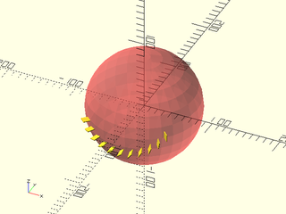
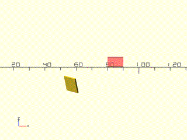
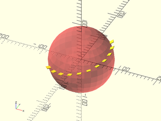
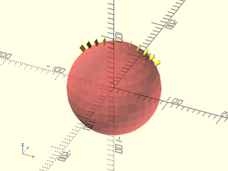
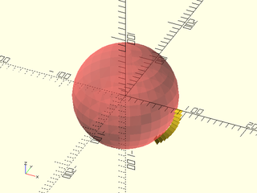
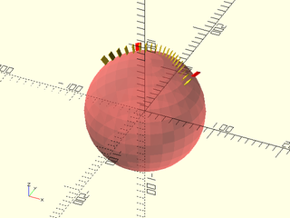
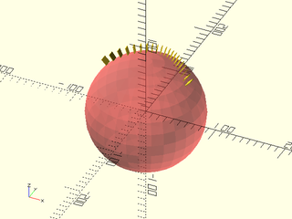

# LibFile: quaternions.scad

Support for Quaternions.

To use, add the following lines to the beginning of your file:

    include <BOSL2/std.scad>

## Table of Contents

1. [Section: Quaternions](#section-quaternions)
    - [`is_quaternion()`](#function-is_quaternion)
    - [`quat()`](#function-quat)
    - [`quat_x()`](#function-quat_x)
    - [`quat_y()`](#function-quat_y)
    - [`quat_z()`](#function-quat_z)
    - [`quat_xyz()`](#function-quat_xyz)
    - [`q_from_to()`](#function-q_from_to)
    - [`q_ident()`](#function-q_ident)
    - [`q_add_s()`](#function-q_add_s)
    - [`q_sub_s()`](#function-q_sub_s)
    - [`q_mul_s()`](#function-q_mul_s)
    - [`q_div_s()`](#function-q_div_s)
    - [`q_add()`](#function-q_add)
    - [`q_sub()`](#function-q_sub)
    - [`q_mul()`](#function-q_mul)
    - [`q_cumulative()`](#function-q_cumulative)
    - [`q_dot()`](#function-q_dot)
    - [`q_neg()`](#function-q_neg)
    - [`q_conj()`](#function-q_conj)
    - [`q_inverse()`](#function-q_inverse)
    - [`q_norm()`](#function-q_norm)
    - [`q_normalize()`](#function-q_normalize)
    - [`q_dist()`](#function-q_dist)
    - [`q_slerp()`](#function-q_slerp)
    - [`q_matrix3()`](#function-q_matrix3)
    - [`q_matrix4()`](#function-q_matrix4)
    - [`q_axis()`](#function-q_axis)
    - [`q_angle()`](#function-q_angle)
    - [`q_rot()`](#functionmodule-q_rot)
    - [`q_rot_copies()`](#module-q_rot_copies)
    - [`q_rotation()`](#function-q_rotation)
    - [`q_rotation_path()`](#functionmodule-q_rotation_path)
    - [`q_nlerp()`](#function-q_nlerp)
    - [`q_squad()`](#function-q_squad)
    - [`q_exp()`](#function-q_exp)
    - [`q_ln()`](#function-q_ln)
    - [`q_pow()`](#function-q_pow)

## Section: Quaternions

Quaternions are fast methods of storing and calculating arbitrary rotations.
Quaternions contain information on both axis of rotation, and rotation angle.
You can chain multiple rotation together by multiplying quaternions together.
They don't suffer from the gimbal-lock issues that `[X,Y,Z]` rotation angles do.
Quaternions are stored internally as a 4-value vector:
`[X,Y,Z,W]`, where the quaternion formula is `W+Xi+Yj+Zk`

### Function: is\_quaternion()

**Usage:** 

- if(is\_quaternion(q)) a=0;

**Description:** 

Return true if q is a valid non-zero quaternion.

**Arguments:** 

<abbr title="These args can be used by position or by name.">By&nbsp;Position</abbr> | What it does
-------------------- | ------------
`q`                  | object to check.

---

### Function: quat()

**Usage:** 

- quat(ax, ang);

**Description:** 

Create a normalized Quaternion from axis and angle of rotation.

**Arguments:** 

<abbr title="These args can be used by position or by name.">By&nbsp;Position</abbr> | What it does
-------------------- | ------------
`ax`                 | Vector of axis of rotation.
`ang`                | Number of degrees to rotate around the axis counter-clockwise, when facing the origin.

---

### Function: quat\_x()

**Usage:** 

- quat\_x(a);

**Description:** 

Create a normalized Quaternion for rotating around the X axis [1,0,0].

**Arguments:** 

<abbr title="These args can be used by position or by name.">By&nbsp;Position</abbr> | What it does
-------------------- | ------------
`a`                  | Number of degrees to rotate around the axis counter-clockwise, when facing the origin.

---

### Function: quat\_y()

**Usage:** 

- quat\_y(a);

**Description:** 

Create a normalized Quaternion for rotating around the Y axis [0,1,0].

**Arguments:** 

<abbr title="These args can be used by position or by name.">By&nbsp;Position</abbr> | What it does
-------------------- | ------------
`a`                  | Number of degrees to rotate around the axis counter-clockwise, when facing the origin.

---

### Function: quat\_z()

**Usage:** 

- quat\_z(a);

**Description:** 

Create a normalized Quaternion for rotating around the Z axis [0,0,1].

**Arguments:** 

<abbr title="These args can be used by position or by name.">By&nbsp;Position</abbr> | What it does
-------------------- | ------------
`a`                  | Number of degrees to rotate around the axis counter-clockwise, when facing the origin.

---

### Function: quat\_xyz()

**Usage:** 

- quat\_xyz([X,Y,Z])

**Description:** 

Creates a normalized quaternion from standard [X,Y,Z] rotation angles in degrees.

**Arguments:** 

<abbr title="These args can be used by position or by name.">By&nbsp;Position</abbr> | What it does
-------------------- | ------------
`a`                  | The triplet of rotation angles, [X,Y,Z]

---

### Function: q\_from\_to()

**Usage:** 

- q = q\_from\_to(v1, v2);

**Description:** 

Returns the normalized quaternion that rotates the non zero 3D vector v1
to the non zero 3D vector v2.

---

### Function: q\_ident()

**Description:** 

Returns the "Identity" zero-rotation Quaternion.

---

### Function: q\_add\_s()

**Usage:** 

- q\_add\_s(q, s)

**Description:** 

Adds a scalar value `s` to the W part of a quaternion `q`.
The returned quaternion is usually not normalized.

---

### Function: q\_sub\_s()

**Usage:** 

- q\_sub\_s(q, s)

**Description:** 

Subtracts a scalar value `s` from the W part of a quaternion `q`.
The returned quaternion is usually not normalized.

---

### Function: q\_mul\_s()

**Usage:** 

- q\_mul\_s(q, s)

**Description:** 

Multiplies each part of a quaternion `q` by a scalar value `s`.
The returned quaternion is usually not normalized.

---

### Function: q\_div\_s()

**Usage:** 

- q\_div\_s(q, s)

**Description:** 

Divides each part of a quaternion `q` by a scalar value `s`.
The returned quaternion is usually not normalized.

---

### Function: q\_add()

**Usage:** 

- q\_add(a, b)

**Description:** 

Adds each part of two quaternions together.
The returned quaternion is usually not normalized.

---

### Function: q\_sub()

**Usage:** 

- q\_sub(a, b)

**Description:** 

Subtracts each part of quaternion `b` from quaternion `a`.
The returned quaternion is usually not normalized.

---

### Function: q\_mul()

**Usage:** 

- q\_mul(a, b)

**Description:** 

Multiplies quaternion `a` by quaternion `b`.
The returned quaternion is normalized if both `a` and `b` are normalized

---

### Function: q\_cumulative()

**Usage:** 

- q\_cumulative(v);

**Description:** 

Given a list of Quaternions, cumulatively multiplies them, returning a list
of each cumulative Quaternion product.  It starts with the first quaternion
given in the list, and applies successive quaternion rotations in list order.
The quaternion in the returned list are normalized if each quaternion in v
is normalized.

---

### Function: q\_dot()

**Usage:** 

- q\_dot(a, b)

**Description:** 

Calculates the dot product between quaternions `a` and `b`.

---

### Function: q\_neg()

**Usage:** 

- q\_neg(q)

**Description:** 

Returns the negative of quaternion `q`.

---

### Function: q\_conj()

**Usage:** 

- q\_conj(q)

**Description:** 

Returns the conjugate of quaternion `q`.

---

### Function: q\_inverse()

**Usage:** 

- qc = q\_inverse(q)

**Description:** 

Returns the multiplication inverse of quaternion `q`  that is normalized only if `q` is normalized.

---

### Function: q\_norm()

**Usage:** 

- q\_norm(q)

**Description:** 

Returns the `norm()` "length" of quaternion `q`.
Normalized quaternions have unitary norm.

---

### Function: q\_normalize()

**Usage:** 

- q\_normalize(q)

**Description:** 

Normalizes quaternion `q`, so that norm([W,X,Y,Z]) == 1.

---

### Function: q\_dist()

**Usage:** 

- q\_dist(q1, q2)

**Description:** 

Returns the "distance" between two quaternions.

---

### Function: q\_slerp()

**Usage:** 

- q\_slerp(q1, q2, u);

**Description:** 

Returns a quaternion that is a spherical interpolation between two quaternions.

**Arguments:** 

<abbr title="These args can be used by position or by name.">By&nbsp;Position</abbr> | What it does
-------------------- | ------------
`q1`                 | The first quaternion. (u=0)
`q2`                 | The second quaternion. (u=1)
`u`                  | The proportional value, from 0 to 1, of what part of the interpolation to return.

**Example 1:** Giving `u` as a Scalar

    include <BOSL2/std.scad>
    a = quat_y(-135);
    b = quat_xyz([0,-30,30]);
    for (u=[0:0.1:1])
        q_rot(q_slerp(a, b, u))
            right(80) cube([10,10,1]);
    #sphere(r=80);

  

**Example 2:** Giving `u` as a Range

    include <BOSL2/std.scad>
    a = quat_z(-135);
    b = quat_xyz([90,0,-45]);
    for (q = q_slerp(a, b, [0:0.1:1]))
        q_rot(q) right(80) cube([10,10,1]);
    #sphere(r=80);

  

---

### Function: q\_matrix3()

**Usage:** 

- q\_matrix3(q);

**Description:** 

Returns the 3x3 rotation matrix for the given normalized quaternion q.

---

### Function: q\_matrix4()

**Usage:** 

- q\_matrix4(q);

**Description:** 

Returns the 4x4 rotation matrix for the given normalized quaternion q.

---

### Function: q\_axis()

**Usage:** 

- q\_axis(q)

**Description:** 

Returns the axis of rotation of a normalized quaternion `q`.
The input doesn't need to be normalized.

---

### Function: q\_angle()

**Usage:** 

- a = q\_angle(q)
- a12 = q\_angle(q1,q2);

**Description:** 

If only q1 is given, returns the angle of rotation (in degrees) of that quaternion.
If both q1 and q2 are given, returns the angle (in degrees) between them.
The input quaternions don't need to be normalized.

---

### Function/Module: q\_rot()

**Usage:** As Module

- q\_rot(q) ...

**Usage:** As Function

- pts = q\_rot(q,p);

**Description:** 

When called as a module, rotates all children by the rotation stored in quaternion `q`.
When called as a function with a `p` argument, rotates the point or list of points in `p` by the rotation stored in quaternion `q`.
When called as a function without a `p` argument, returns the affine3d rotation matrix for the rotation stored in quaternion `q`.

**Example 1:** 

    include <BOSL2/std.scad>
    module shape() translate([80,0,0]) cube([10,10,1]);
    q = quat_xyz([90,-15,-45]);
    q_rot(q) shape();
    #shape();

  

**Example 2:** 

    include <BOSL2/std.scad>
    q = quat_xyz([45,35,10]);
    mat4x4 = q_rot(q);

  

**Example 3:** 

    include <BOSL2/std.scad>
    q = quat_xyz([45,35,10]);
    pt = q_rot(q, p=[4,5,6]);

  

**Example 4:** 

    include <BOSL2/std.scad>
    q = quat_xyz([45,35,10]);
    pts = q_rot(q, p=[[2,3,4], [4,5,6], [9,2,3]]);

  

---

### Module: q\_rot\_copies()

**Usage:** 

- q\_rot\_copies(quats) ...

**Description:** 

For each quaternion given in the list `quats`, rotates to that orientation and creates a copy
of all children.  This is equivalent to `for (q=quats) q_rot(q) ...`.

**Arguments:** 

<abbr title="These args can be used by position or by name.">By&nbsp;Position</abbr> | What it does
-------------------- | ------------
`quats`              | A list containing all quaternions to rotate to and create copies of all children for.

**Example 1:** 

    include <BOSL2/std.scad>
    a = quat_z(-135);
    b = quat_xyz([0,-30,30]);
    q_rot_copies(q_slerp(a, b, [0:0.1:1]))
        right(80) cube([10,10,1]);
    #sphere(r=80);

  

---

### Function: q\_rotation()

**Usage:** 

- q\_rotation(R)

**Description:** 

Returns a normalized quaternion corresponding to the rotation matrix R.
R may be a 3x3 rotation matrix or a homogeneous 4x4 rotation matrix.
The last row and last column of R are ignored for 4x4 matrices.
It doesn't check whether R is in fact a rotation matrix.
If R is not a rotation, the returned quaternion is an unpredictable quaternion .

---

### Function/Module: q\_rotation\_path()

**Usage:** As a function

- path = q\_rotation\_path(q1, n, q2);
- path = q\_rotation\_path(q1, n);

**Usage:** As a module

- q\_rotation\_path(q1, n, q2) ...

**Description:** 

If q2 is undef and it is called as a function, the path, with length n+1 (n>=1), will be the
cumulative multiplications of the matrix rotation of q1 by itself.
If q2 is defined and it is called as a function, returns a rotation matrix path of length n+1 (n>=1)
that interpolates two given rotation quaternions. The first matrix of the sequence is the
matrix rotation of q1 and the last one, the matrix rotation of q2. The intermediary matrix
rotations are an uniform interpolation of the path extreme matrices.
When called as a module, applies to its children() each rotation of the sequence computed
by the function.
The input quaternions don't need to be normalized.

**Arguments:** 

<abbr title="These args can be used by position or by name.">By&nbsp;Position</abbr> | What it does
-------------------- | ------------
`q1`                 | The quaternion of the first rotation.
`q2`                 | The quaternion of the last rotation.
`n`                  | An integer defining the path length ( path length = n+1).

**Example 1:** as a function

    include <BOSL2/std.scad>
    a = quat_y(-135);
    b = quat_xyz([0,-30,30]);
    for (M=q_rotation_path(a, 10, b))
        multmatrix(M)
            right(80) cube([10,10,1]);
    #sphere(r=80);

  

**Example 2:** as a module

    include <BOSL2/std.scad>
    a = quat_y(-135);
    b = quat_xyz([0,-30,30]);
    q_rotation_path(a, 10, b)
       right(80) cube([10,10,1]);
    #sphere(r=80);

  

**Example 3:** as a function

    include <BOSL2/std.scad>
    a = quat_y(5);
    for (M=q_rotation_path(a, 10))
        multmatrix(M)
            right(80) cube([10,10,1]);
    #sphere(r=80);

  

**Example 4:** as a module

    include <BOSL2/std.scad>
    a = quat_y(5);
    q_rotation_path(a, 10)
       right(80) cube([10,10,1]);
    #sphere(r=80);

  

---

### Function: q\_nlerp()

**Usage:** 

- q = q\_nlerp(q1, q2, u);

**Description:** 

Returns a quaternion that is a normalized linear interpolation between two quaternions
when u is a number.
If u is a list of numbers, computes the interpolations for each value in the
list and returns the interpolated quaternions in a list.
The input quaternions don't need to be normalized.

**Arguments:** 

<abbr title="These args can be used by position or by name.">By&nbsp;Position</abbr> | What it does
-------------------- | ------------
`q1`                 | The first quaternion. (u=0)
`q2`                 | The second quaternion. (u=1)
`u`                  | A value (or a list of values), between 0 and 1, of the proportion(s) of each quaternion in the interpolation.

**Example 1:** Giving `u` as a Scalar

    include <BOSL2/std.scad>
    a = quat_y(-135);
    b = quat_xyz([0,-30,30]);
    for (u=[0:0.1:1])
        q_rot(q_nlerp(a, b, u))
            right(80) cube([10,10,1]);
    #sphere(r=80);

  

**Example 2:** Giving `u` as a Range

    include <BOSL2/std.scad>
    a = quat_z(-135);
    b = quat_xyz([90,0,-45]);
    for (q = q_nlerp(a, b, [0:0.1:1]))
        q_rot(q) right(80) cube([10,10,1]);
    #sphere(r=80);

  

---

### Function: q\_squad()

**Usage:** 

- qn = q\_squad(q1,q2,q3,q4,u);

**Description:** 

Returns a quaternion that is a cubic spherical interpolation of the quaternions
q1 and q4 taking the other two quaternions, q2 and q3, as parameter of a cubic
on the sphere similar to the control points of a Bezier curve.
If u is a number, usually between 0 and 1, returns the quaternion that results
from the interpolation.
If u is a list of numbers, computes the interpolations for each value in the
list and returns the interpolated quaternions in a list.
The input quaternions don't need to be normalized.

**Arguments:** 

<abbr title="These args can be used by position or by name.">By&nbsp;Position</abbr> | What it does
-------------------- | ------------
`q1`                 | The start quaternion. (u=0)
`q1`                 | The first intermediate quaternion.
`q2`                 | The second intermediate quaternion.
`q4`                 | The end quaternion. (u=1)
`u`                  | A value (or a list of values), of the proportion(s) of each quaternion in the cubic interpolation.

**Example 1:** Giving `u` as a Scalar

    include <BOSL2/std.scad>
    a = quat_y(-135);
    b = quat_xyz([-50,-50,120]);
    c = quat_xyz([-50,-40,30]);
    d = quat_y(-45);
    color("red"){
      q_rot(b) right(80) cube([10,10,1]);
      q_rot(c) right(80) cube([10,10,1]);
    }
    for (u=[0:0.05:1])
        q_rot(q_squad(a, b, c, d, u))
            right(80) cube([10,10,1]);
    #sphere(r=80);

  

**Example 2:** Giving `u` as a Range

    include <BOSL2/std.scad>
    a = quat_y(-135);
    b = quat_xyz([-50,-50,120]);
    c = quat_xyz([-50,-40,30]);
    d = quat_y(-45);
    for (q = q_squad(a, b, c, d, [0:0.05:1]))
        q_rot(q) right(80) cube([10,10,1]);
    #sphere(r=80);

  

---

### Function: q\_exp()

**Usage:** 

- q2 = q\_exp(q);

**Description:** 

Returns the quaternion that is the exponential of the quaternion q in base e
The returned quaternion is usually not normalized.

---

### Function: q\_ln()

**Usage:** 

- q2 = q\_ln(q);

**Description:** 

Returns the quaternion that is the natural logarithm of the quaternion q.
The returned quaternion is usually not normalized and may be zero.

---

### Function: q\_pow()

**Usage:** 

- q2 = q\_pow(q, r);

**Description:** 

Returns the quaternion that is the power of the quaternion q to the real exponent r.
The returned quaternion is normalized if `q` is normalized.

---

