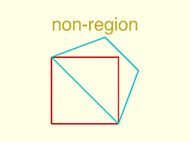
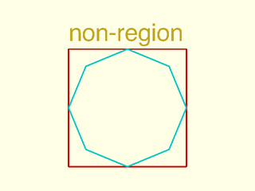

# LibFile: regions.scad

This file provides 2D boolean set operations on polygons, where you can
compute, for example, the intersection or union of the shape defined by point lists, producing
a new point list.  Of course, such operations may produce shapes with multiple
components.  To handle that, we use "regions" which are defined by lists of polygons.
In addition to set operations, you can calculate offsets, determine whether a point is in a
region and you can decompose a region into parts.

To use, add the following lines to the beginning of your file:

    include <BOSL2/std.scad>

## Table of Contents

1. [Section: Regions](#section-regions)
    - [`is_region()`](#function-is_region)
    - [`is_valid_region()`](#function-is_valid_region)
    - [`is_region_simple()`](#function-is_region_simple)
    - [`make_region()`](#function-make_region)
    - [`force_region()`](#function-force_region)

2. [Section: Turning a region into geometry](#section-turning-a-region-into-geometry)
    - [`region()`](#module-region)

3. [Section: Gometrical calculations with regions](#section-gometrical-calculations-with-regions)
    - [`point_in_region()`](#function-point_in_region)
    - [`region_area()`](#function-region_area)
    - [`are_regions_equal()`](#function-are_regions_equal)

4. [Section: Breaking up regions into subregions](#section-breaking-up-regions-into-subregions)
    - [`split_region_at_region_crossings()`](#function-split_region_at_region_crossings)
    - [`region_parts()`](#function-region_parts)

5. [Section: Offset and 2D Boolean Set Operations](#section-offset-and-2d-boolean-set-operations)
    - [`offset()`](#function-offset)
    - [`union()`](#functionmodule-union)
    - [`difference()`](#functionmodule-difference)
    - [`intersection()`](#functionmodule-intersection)
    - [`exclusive_or()`](#functionmodule-exclusive_or)

## Section: Regions

A region is a list of polygons meeting these conditions:

- Every polygon on the list is simple, meaning it does not intersect itself
- Two polygons on the list do not cross each other
- A vertex of one polygon never meets the edge of another one except at a vertex

Note that this means vertex-vertex touching between two polygons is acceptable
to define a region.  Note, however, that regions with vertex-vertex contact usually
cannot be rendered with CGAL.  See [`is_valid_region()`](#function-is_valid_region) for examples of valid regions and
lists of polygons that are not regions.  Note that [`is_region_simple()`](#function-is_region_simple) will identify
regions with no polygon intersections at all, which should render successfully witih CGAL.

The actual geometry of the region is defined by XORing together
all of the polygons in the list.  This may sound obscure, but it simply means that nested
boundaries make rings in the obvious fashion, and non-nested shapes simply union together.
Checking that a list of polygons is a valid region, meaning that it satisfies all of the conditions
above, can be a time consuming test, so it is not done automatically.  It is your responsibility to ensure that your regions are
compliant.  You can construct regions by making a suitable list of polygons, or by using
set operation function such as union() or difference(), which all acccept polygons, as
well as regions, as their inputs.  And if you must you can clean up an ill-formed region using make_region(),
which will break up self-intersecting polygons and polygons that cross each other.

### Function: is\_region()

**Usage:** 

- is\_region(x);

**Description:** 

Returns true if the given item looks like a region.  A region is a list of non-crossing simple polygons.  This test just checks
that the argument is a list whose first entry is a path.

---

### Function: is\_valid\_region()

**Usage:** 

- bool = is\_valid\_region(region, [eps]);

**Description:** 

Returns true if the input is a valid region, meaning that it is a list of simple polygons whose segments do not cross each other.
This test can be time consuming with regions that contain many points.
It differs from `is_region()` which simply checks that the object is a list whose first entry is a path
because it searches all the list polygons for any self-intersections or intersections with each other.
Will also return true if given a single simple polygon.  Use [`make_region()`](#function-make_region) to convert sets of self-intersecting polygons into
a region.

**Arguments:** 

<abbr title="These args can be used by position or by name.">By&nbsp;Position</abbr> | What it does
-------------------- | ------------
`region`             | region to check
`eps`                | tolerance for geometric comparisons.  Default: `EPSILON` = 1e-9

**Example 1:** In all of the examples each polygon in the region appears in a different color.  Two non-intersecting squares make a valid region.

 

    include <BOSL2/std.scad>
    region = [square(10), right(11,square(8))];
    rainbow(region)stroke($item, width=.2,closed=true);
    back(11)text(is_valid_region(region) ? "region" : "non-region", size=2);

**Example 2:** Nested squares form a region

 

    include <BOSL2/std.scad>
    region = [for(i=[3:2:10]) square(i,center=true)];
    rainbow(region)stroke($item, width=.2,closed=true);
    back(6)text(is_valid_region(region) ? "region" : "non-region", size=2,halign="center");

**Example 3:** Also a region:

 

    include <BOSL2/std.scad>
    region= [square(10,center=true), square(5,center=true), right(10,square(7))];
    rainbow(region)stroke($item, width=.2,closed=true);
    back(8)text(is_valid_region(region) ? "region" : "non-region", size=2);

**Example 4:** The squares cross each other, so not a region

 

    include <BOSL2/std.scad>
    object = [square(10), move([8,8], square(8))];
    rainbow(object)stroke($item, width=.2,closed=true);
    back(17)text(is_valid_region(object) ? "region" : "non-region", size=2);

**Example 5:** A union is one way to fix the above example and get a region.  (Note that union is run here on two simple polygons, which are valid regions themselves and hence acceptable inputs to union.

 

    include <BOSL2/std.scad>
    region = union([square(10), move([8,8], square(8))]);
    rainbow(region)stroke($item, width=.25,closed=true);
    back(12)text(is_valid_region(region) ? "region" : "non-region", size=2);

**Example 6:** Not a region due to a self-intersecting (non-simple) hourglass polygon

 

    include <BOSL2/std.scad>
    object = [move([-2,-2],square(14)), [[0,0],[10,0],[0,10],[10,10]]];
    rainbow(object)stroke($item, width=.2,closed=true);
    move([-1.5,13])text(is_valid_region(object) ? "region" : "non-region", size=2);

**Example 7:** Breaking hourglass in half fixes it.  Now it's a region:

 

    include <BOSL2/std.scad>
    region = [move([-2,-2],square(14)), [[0,0],[10,0],[5,5]], [[5,5],[0,10],[10,10]]];
    rainbow(region)stroke($item, width=.2,closed=true);

**Example 8:** A single polygon corner touches an edge, so not a region:

 

    include <BOSL2/std.scad>
    object = [[[-10,0], [-10,10], [20,10], [20,-20], [-10,-20],
               [-10,-10], [0,0], [10,-10], [10,0]]];
    rainbow(object)stroke($item, width=.3,closed=true);
    move([-4,12])text(is_valid_region(object) ? "region" : "non-region", size=3);

**Example 9:** Corners touch in the same polygon, so the polygon is not simple and the object is not a region.

 

    include <BOSL2/std.scad>
    object = [[[0,0],[10,0],[10,10],[-10,10],[-10,0],[0,0],[-5,5],[5,5]]];
    rainbow(object)stroke($item, width=.3,closed=true);
    move([-10,12])text(is_valid_region(object) ? "region" : "non-region", size=3);

**Example 10:** The shape above as a valid region with two polygons:

 

    include <BOSL2/std.scad>
    region = [  [[0,0],[10,0],[10,10],[-10,10],[-10,0]],
                [[0,0],[5,5],[-5,5]]  ];
    rainbow(region)stroke($item, width=.3,closed=true);
    move([-5.5,12])text(is_valid_region(region) ? "region" : "non-region", size=3);

**Example 11:** As with the "broken" hourglass, Touching at corners is OK.  This is a region.

 

    include <BOSL2/std.scad>
    region = [square(10), move([10,10], square(8))];
    rainbow(region)stroke($item, width=.25,closed=true);
    back(12)text(is_valid_region(region) ? "region" : "non-region", size=2);

**Example 12:** These two squares share part of an edge, hence not a region

 

    include <BOSL2/std.scad>
    object = [square(10), move([10,2], square(7))];
    stroke(object[0], width=0.2,closed=true);
    color("red")dashed_stroke(object[1], width=0.25,closed=true);
    back(12)text(is_valid_region(object) ? "region" : "non-region", size=2);

**Example 13:** These two squares share a full edge, hence not a region

 

    include <BOSL2/std.scad>
    object = [square(10), right(10, square(10))];
    stroke(object[0], width=0.2,closed=true);
    color("red")dashed_stroke(object[1], width=0.25,closed=true);
    back(12)text(is_valid_region(object) ? "region" : "non-region", size=2);

**Example 14:** Sharing on edge on the inside, also not a regionn

 

    include <BOSL2/std.scad>
    object = [square(10), [[0,0], [2,2],[2,8],[0,10]]];
    stroke(object[0], width=0.2,closed=true);
    color("red")dashed_stroke(object[1], width=0.25,closed=true);
    back(12)text(is_valid_region(object) ? "region" : "non-region", size=2);

**Example 15:** Crossing at vertices is also bad

 

    include <BOSL2/std.scad>
    object = [square(10), [[10,0],[0,10],[8,13],[13,8]]];
    rainbow(object)stroke($item, width=.2,closed=true);
    back(14)text(is_valid_region(object) ? "region" : "non-region", size=2);

**Example 16:** One polygon touches another in the middle of an edge

 

    include <BOSL2/std.scad>
    object = [square(10), [[10,5],[15,0],[15,10]]];
    rainbow(object)stroke($item, width=.2,closed=true);
    back(11)text(is_valid_region(object) ? "region" : "non-region", size=2);

**Example 17:** The polygon touches the side, but the side has a vertex at the contact point so this is a region

 

    include <BOSL2/std.scad>
    poly1 = [ each square(30,center=true), [15,0]];
    poly2 = right(10,circle(5,$fn=4));
    poly3 = left(0,circle(5,$fn=4));
    poly4 = move([0,-8],square([10,3]));
    region = [poly1,poly2,poly3,poly4];
    rainbow(region)stroke($item, width=.25,closed=true);
    move([-5,16.5])text(is_valid_region(region) ? "region" : "non-region", size=3);
    color("black")move_copies(region[0]) circle(r=.4);

**Example 18:** The polygon touches the side, but not at a vertex so this is not a region

 

    include <BOSL2/std.scad>
    poly1 = fwd(4,[ each square(30,center=true), [15,0]]);
    poly2 = right(10,circle(5,$fn=4));
    poly3 = left(0,circle(5,$fn=4));
    poly4 = move([0,-8],square([10,3]));
    object = [poly1,poly2,poly3,poly4];
    rainbow(object)stroke($item, width=.25,closed=true);
    move([-9,12.5])text(is_valid_region(object) ? "region" : "non-region", size=3);
    color("black")move_copies(object[0]) circle(r=.4);

**Example 19:** The inner polygon touches the middle of the edges, so not a region

 

    include <BOSL2/std.scad>
    poly1 = square(20,center=true);
    poly2 = circle(10,$fn=8);
    object=[poly1,poly2];
    rainbow(object)stroke($item, width=.25,closed=true);
    move([-10,11.4])text(is_valid_region(object) ? "region" : "non-region", size=3);

**Example 20:** The above shape made into a region using [`difference()`](#functionmodule-difference) now has four components that touch at corners

 

    include <BOSL2/std.scad>
    poly1 = square(20,center=true);
    poly2 = circle(10,$fn=8);
    region = difference(poly1,poly2);
    rainbow(region)stroke($item, width=.25,closed=true);
    move([-5,11.4])text(is_valid_region(region) ? "region" : "non-region", size=3);

---

### Function: is\_region\_simple()

**Usage:** 

- bool = is\_region\_simple(region, [eps]);

**Description:** 

We extend the notion of the simple path to regions: a simple region is entirely
non-self-intersecting, meaning that it is formed from a list of simple polygons that
don't intersect each other at all---not even with corner contact points.
Regions with corner contact are valid but may fail CGAL.  Simple regions
should not create problems with CGAL.

**Arguments:** 

<abbr title="These args can be used by position or by name.">By&nbsp;Position</abbr> | What it does
-------------------- | ------------
`region`             | region to check
`eps`                | tolerance for geometric comparisons.  Default: `EPSILON` = 1e-9

**Example 1:** Corner contact means it's not simple

 

    include <BOSL2/std.scad>
    region = [move([-2,-2],square(14)), [[0,0],[10,0],[5,5]], [[5,5],[0,10],[10,10]]];
    rainbow(region)stroke($item, width=.2,closed=true);
    move([-1,13])text(is_region_simple(region) ? "simple" : "not-simple", size=2);

**Example 2:** Moving apart the triangles makes it simple:

 

    include <BOSL2/std.scad>
    region = [move([-2,-2],square(14)), [[0,0],[10,0],[5,4.5]], [[5,5.5],[0,10],[10,10]]];
    rainbow(region)stroke($item, width=.2,closed=true);
    move([1,13])text(is_region_simple(region) ? "simple" : "not-simple", size=2);

---

### Function: make\_region()

**Usage:** 

- region = make\_region(polys, [nonzero], [eps]);

**Description:** 

Takes a list of polygons that may intersect themselves or cross each other
and converts it into a properly defined region without
these defects.

**Arguments:** 

<abbr title="These args can be used by position or by name.">By&nbsp;Position</abbr> | What it does
-------------------- | ------------
`polys`              | list of polygons to use
`nonzero`            | set to true to use nonzero rule for polygon membership.  Default: false
`eps`                | Epsilon for geometric comparisons.  Default: `EPSILON` (1e-9)

**Example 1:** The pentagram is self-intersecting, so it is not a region.  Here it becomes five triangles:

    include <BOSL2/std.scad>
    pentagram = turtle(["move",100,"left",144], repeat=4);
    region = make_region(pentagram);
    rainbow(region)stroke($item, width=1,closed=true);

  

**Example 2:** Alternatively with the nonzero option you can get the perimeter:

    include <BOSL2/std.scad>
    pentagram = turtle(["move",100,"left",144], repeat=4);
    region = make_region(pentagram,nonzero=true);
    rainbow(region)stroke($item, width=1,closed=true);

  

**Example 3:** To crossing squares become two L-shaped components

    include <BOSL2/std.scad>
    region = make_region([square(10), move([5,5],square(8))]);
    rainbow(region)stroke($item, width=.3,closed=true);

  

---

### Function: force\_region()

**Usage:** 

- region = force\_region(poly)

**Description:** 

If the input is a polygon then return it as a region.  Otherwise return it unaltered.

**Arguments:** 

<abbr title="These args can be used by position or by name.">By&nbsp;Position</abbr> | What it does
-------------------- | ------------
`poly`               | polygon to turn into a region

---

## Section: Turning a region into geometry

### Module: region()

**Usage:** 

- region(r, [anchor], [spin], [cp]) { ... };

**Description:** 

Creates the 2D polygons described by the given region or list of polygons.  This module works on
arbitrary lists of polygons that cross each other and hence do not define a valid region.  The
displayed result is the exclusive-or of the polygons listed in the input.

**Arguments:** 

<abbr title="These args can be used by position or by name.">By&nbsp;Position</abbr> | What it does
-------------------- | ------------
`r`                  | region to create as geometry
`anchor`             | Translate so anchor point is at origin (0,0,0).  See [anchor](attachments.scad#subsection-anchor).  Default: `"origin"`
`spin`               | Rotate this many degrees after anchor.  See [spin](attachments.scad#subsection-spin).  Default: `0`
`cp`                 | Centerpoint for determining intersection anchors or centering the shape.  Determintes the base of the anchor vector.  Can be "centroid", "mean", "box" or a 2D point.  Default: "centroid"
`atype`              | Set to "hull" or "intersect" to select anchor type.  Default: "hull"

**Example 1:** Displaying a region

    include <BOSL2/std.scad>
    region([circle(d=50), square(25,center=true)]);

  

**Example 2:** Displaying a list of polygons that intersect each other, which is not a region

    include <BOSL2/std.scad>
    rgn = concat(
        [for (d=[50:-10:10]) circle(d=d-5)],
        [square([60,10], center=true)]
    );
    region(rgn);

  

---

## Section: Gometrical calculations with regions

### Function: point\_in\_region()

**Usage:** 

- check = point\_in\_region(point, region, [eps]);

**Description:** 

Tests if a point is inside, outside, or on the border of a region.
Returns -1 if the point is outside the region.
Returns 0 if the point is on the boundary.
Returns 1 if the point lies inside the region.

**Arguments:** 

<abbr title="These args can be used by position or by name.">By&nbsp;Position</abbr> | What it does
-------------------- | ------------
`point`              | The point to test.
`region`             | The region to test against, as a list of polygon paths.
`eps`                | Acceptable variance.  Default: `EPSILON` (1e-9)

**Example 1:** Red points are in the region.

 

    include <BOSL2/std.scad>
    region = [for(i=[2:4:10]) hexagon(r=i)];
    color("#ff7") region(region);
    for(x=[-10:10], y=[-10:10])
      if (point_in_region([x,y], region)>=0)
        move([x,y]) color("red") circle(0.15, $fn=12);
      else
        move([x,y]) color("#ddf") circle(0.1, $fn=12);

---

### Function: region\_area()

**Usage:** 

- area=region\_area(region);

**Description:** 

Computes the area of the specified valid region. (If the region is invalid and has self intersections
the result is meaningless.)

**Arguments:** 

<abbr title="These args can be used by position or by name.">By&nbsp;Position</abbr> | What it does
-------------------- | ------------
`region`             | region whose area to compute

**Example 1:** 

    include <BOSL2/std.scad>
    area = region_area([square(10), right(20,square(8))]);  // Returns 164

  

---

### Function: are\_regions\_equal()

**Usage:** 

- b = are\_regions\_equal(region1, region2, [eps])

**Description:** 

Returns true if the components of region1 and region2 are the same polygons (in any order)
within given epsilon tolerance.

**Arguments:** 

<abbr title="These args can be used by position or by name.">By&nbsp;Position</abbr> | What it does
-------------------- | ------------
`region1`            | first region
`region2`            | second region
`eps`                | tolerance for comparison

---

## Section: Breaking up regions into subregions

### Function: split\_region\_at\_region\_crossings()

**Usage:** 

- split\_region = split\_region\_at\_region\_crossings(region1, region2, [closed1], [closed2], [eps])

**Description:** 

Splits region1 at the places where polygons in region1 touches each other at corners and at locations
where region1 intersections region2.  Split region2 similarly with respect to region1.
The return is a pair of results of the form [split1, split2] where split1=[frags1,frags2,...]
and frags1 is a list of paths that when placed end to end (in the given order), give the first polygon of region1.
Each path in the list is either entirely inside or entirely outside region2.
Then frags2 is the decomposition of the second polygon into path pieces, and so on.  Finally split2 is
the same list, but for the polygons in region2.
You can pass a single polygon in for either region, but the output will be a singleton list, as if
you passed in a singleton region.  If you set the closed parameters to false then the region components
will be treated as open paths instead of polygons.

**Arguments:** 

<abbr title="These args can be used by position or by name.">By&nbsp;Position</abbr> | What it does
-------------------- | ------------
`region1`            | first region
`region2`            | second region
`closed1`            | if false then treat region1 as list of open paths.  Default: true
`closed2`            | if false then treat region2 as list of open paths.  Default: true
`eps`                | Acceptable variance.  Default: `EPSILON` (1e-9)

**Example 1:** 

    include <BOSL2/std.scad>
    path = square(50,center=false);
    region = [circle(d=80), circle(d=40)];
    paths = split_region_at_region_crossings(path, region);
    color("#aaa") region(region);
    rainbow(paths[0][0]) stroke($item, width=2);
    right(110){
      color("#aaa") region([path]);
      rainbow(flatten(paths[1])) stroke($item, width=2);
    }

  

---

### Function: region\_parts()

**Usage:** 

- rgns = region\_parts(region);

**Description:** 

Divides a region into a list of connected regions.  Each connected region has exactly one clockwise outside boundary
and zero or more counter-clockwise outlines defining internal holes.  Note that behavior is undefined on invalid regions whose
components cross each other.

**Example 1:** 

    include <BOSL2/std.scad>
    R = [for(i=[1:7]) square(i,center=true)];
    region_list = region_parts(R);
    rainbow(region_list) region($item);

  

**Example 2:** 

    include <BOSL2/std.scad>
    R = [back(7,square(3,center=true)),
         square([20,10],center=true),
         left(5,square(8,center=true)),
         for(i=[4:2:8])
           right(5,square(i,center=true))];
    region_list = region_parts(R);
    rainbow(region_list) region($item);

  

---

## Section: Offset and 2D Boolean Set Operations

### Function: offset()

**Usage:** 

- offsetpath = offset(path, [r|delta], [chamfer], [closed], [check\_valid], [quality])
- path\_faces = offset(path, return\_faces=true, [r|delta], [chamfer], [closed], [check\_valid], [quality], [firstface\_index], [flip\_faces])

**Description:** 

Takes a 2D input path, polygon or region and returns a path offset by the specified amount.  As with the built-in
offset() module, you can use `r` to specify rounded offset and `delta` to specify offset with
corners.  If you used `delta` you can set `chamfer` to true to get chamfers.
For paths and polygons positive offsets make the polygons larger.  For paths,
positive offsets shift the path to the left, relative to the direction of the path.  Note
that the path must not include any 180 degree turns, where the path reverses direction.

When offsets shrink the path, segments cross and become invalid.  By default `offset()` checks
for this situation.  To test validity the code checks that segments have distance larger than (r
or delta) from the input path.  This check takes O(N^2) time and may mistakenly eliminate
segments you wanted included in various situations, so you can disable it if you wish by setting
check_valid=false.  Another situation is that the test is not sufficiently thorough and some
segments persist that should be eliminated.  In this case, increase `quality` to 2 or 3.  (This
increases the number of samples on the segment that are checked.)  Run time will increase.  In
some situations you may be able to decrease run time by setting quality to 0, which causes only
segment ends to be checked.

For construction of polyhedra `offset()` can also return face lists.  These list faces between
the original path and the offset path where the vertices are ordered with the original path
first, starting at `firstface_index` and the offset path vertices appearing afterwords.  The
direction of the faces can be flipped using `flip_faces`.  When you request faces the return
value is a list: [offset_path, face_list].

**Arguments:** 

<abbr title="These args can be used by position or by name.">By&nbsp;Position</abbr> | What it does
-------------------- | ------------
`path`               | the path to process.  A list of 2d points.

<abbr title="These args must be used by name, ie: name=value">By&nbsp;Name</abbr> | What it does
-------------------- | ------------
`r`                  | offset radius.  Distance to offset.  Will round over corners.
`delta`              | offset distance.  Distance to offset with pointed corners.
`chamfer`            | chamfer corners when you specify `delta`.  Default: false
`closed`             | if true path is treate as a polygon. Default: False.
`check_valid`        | perform segment validity check.  Default: True.
`quality`            | validity check quality parameter, a small integer.  Default: 1.
`return_faces`       | return face list.  Default: False.
`firstface_index`    | starting index for face list.  Default: 0.
`flip_faces`         | flip face direction.  Default: false

**Example 1:** 

 

    include <BOSL2/std.scad>
    star = star(5, r=100, ir=30);
    #stroke(closed=true, star, width=3);
    stroke(closed=true, width=3, offset(star, delta=10, closed=true));

**Example 2:** 

    include <BOSL2/std.scad>
    star = star(5, r=100, ir=30);
    #stroke(closed=true, star, width=3);
    stroke(closed=true, width=3,
           offset(star, delta=10, chamfer=true, closed=true));

  

**Example 3:** 

    include <BOSL2/std.scad>
    star = star(5, r=100, ir=30);
    #stroke(closed=true, star, width=3);
    stroke(closed=true, width=3,
           offset(star, r=10, closed=true));

  

**Example 4:** 

    include <BOSL2/std.scad>
    star = star(7, r=120, ir=50);
    #stroke(closed=true, width=3, star);
    stroke(closed=true, width=3,
           offset(star, delta=-15, closed=true));

  

**Example 5:** 

    include <BOSL2/std.scad>
    star = star(7, r=120, ir=50);
    #stroke(closed=true, width=3, star);
    stroke(closed=true, width=3,
           offset(star, delta=-15, chamfer=true, closed=true));

  

**Example 6:** 

    include <BOSL2/std.scad>
    star = star(7, r=120, ir=50);
    #stroke(closed=true, width=3, star);
    stroke(closed=true, width=3,
           offset(star, r=-15, closed=true, $fn=20));

  

**Example 7:** This case needs `quality=2` for success

 

    include <BOSL2/std.scad>
    test = [[0,0],[10,0],[10,7],[0,7], [-1,-3]];
    polygon(offset(test,r=-1.9, closed=true, quality=2));
    //polygon(offset(test,r=-1.9, closed=true, quality=1));  // Fails with erroneous 180 deg path error
    %down(.1)polygon(test);

**Example 8:** This case fails if `check_valid=true` when delta is large enough because segments are too close to the opposite side of the curve.

 

    include <BOSL2/std.scad>
    star = star(5, r=22, ir=13);
    stroke(star,width=.3,closed=true);
    color("green")
      stroke(offset(star, delta=-9, closed=true),width=.3,closed=true); // Works with check_valid=true (the default)
    color("red")
      stroke(offset(star, delta=-10, closed=true, check_valid=false),   // Fails if check_valid=true
             width=.3,closed=true);

**Example 9:** But if you use rounding with offset then you need `check_valid=true` when `r` is big enough.  It works without the validity check as long as the offset shape retains a some of the straight edges at the star tip, but once the shape shrinks smaller than that, it fails.  There is no simple way to get a correct result for the case with `r=10`, because as in the previous example, it will fail if you turn on validity checks.

 

    include <BOSL2/std.scad>
    star = star(5, r=22, ir=13);
    color("green")
      stroke(offset(star, r=-8, closed=true,check_valid=false), width=.1, closed=true);
    color("red")
      stroke(offset(star, r=-10, closed=true,check_valid=false), width=.1, closed=true);

**Example 10:** The extra triangles in this example show that the validity check cannot be skipped

    include <BOSL2/std.scad>
    ellipse = scale([20,4], p=circle(r=1,$fn=64));
    stroke(ellipse, closed=true, width=0.3);
    stroke(offset(ellipse, r=-3, check_valid=false, closed=true),
           width=0.3, closed=true);

  

**Example 11:** The triangles are removed by the validity check

    include <BOSL2/std.scad>
    ellipse = scale([20,4], p=circle(r=1,$fn=64));
    stroke(ellipse, closed=true, width=0.3);
    stroke(offset(ellipse, r=-3, check_valid=true, closed=true),
           width=0.3, closed=true);

  

**Example 12:** Open path.  The path moves from left to right and the positive offset shifts to the left of the initial red path.

    include <BOSL2/std.scad>
    sinpath = 2*[for(theta=[-180:5:180]) [theta/4,45*sin(theta)]];
    #stroke(sinpath, width=2);
    stroke(offset(sinpath, r=17.5),width=2);

  

**Example 13:** Region

    include <BOSL2/std.scad>
    rgn = difference(circle(d=100),
                     union(square([20,40], center=true),
                           square([40,20], center=true)));
    #linear_extrude(height=1.1) stroke(rgn, width=1);
    region(offset(rgn, r=-5));

  

---

### Function/Module: union()

**Usage:** 

- union() {...}
- region = union(regions);
- region = union(REGION1,REGION2);
- region = union(REGION1,REGION2,REGION3);

**Description:** 

When called as a function and given a list of regions or 2D polygons,
returns the union of all given regions and polygons.  Result is a single region.
When called as the built-in module, makes the union of the given children.

**Arguments:** 

<abbr title="These args can be used by position or by name.">By&nbsp;Position</abbr> | What it does
-------------------- | ------------
`regions`            | List of regions to union.

**Example 1:** 

 

    include <BOSL2/std.scad>
    shape1 = move([-8,-8,0], p=circle(d=50));
    shape2 = move([ 8, 8,0], p=circle(d=50));
    color("green") region(union(shape1,shape2));
    for (shape = [shape1,shape2]) color("red") stroke(shape, width=0.5, closed=true);

---

### Function/Module: difference()

**Usage:** 

- difference() {...}
- region = difference(regions);
- region = difference(REGION1,REGION2);
- region = difference(REGION1,REGION2,REGION3);

**Description:** 

When called as a function, and given a list of regions or 2D polygons,
takes the first region or polygon and differences away all other regions/polygons from it.  The resulting
region is returned.
When called as the built-in module, makes the set difference of the given children.

**Arguments:** 

<abbr title="These args can be used by position or by name.">By&nbsp;Position</abbr> | What it does
-------------------- | ------------
`regions`            | List of regions or polygons to difference.

**Example 1:** 

 

    include <BOSL2/std.scad>
    shape1 = move([-8,-8,0], p=circle(d=50));
    shape2 = move([ 8, 8,0], p=circle(d=50));
    for (shape = [shape1,shape2]) color("red") stroke(shape, width=0.5, closed=true);
    color("green") region(difference(shape1,shape2));

---

### Function/Module: intersection()

**Usage:** 

- intersection() {...}
- region = intersection(regions);
- region = intersection(REGION1,REGION2);
- region = intersection(REGION1,REGION2,REGION3);

**Description:** 

When called as a function, and given a list of regions or polygons returns the
intersection of all given regions.  Result is a single region.
When called as the built-in module, makes the intersection of all the given children.

**Arguments:** 

<abbr title="These args can be used by position or by name.">By&nbsp;Position</abbr> | What it does
-------------------- | ------------
`regions`            | List of regions to intersect.

**Example 1:** 

 

    include <BOSL2/std.scad>
    shape1 = move([-8,-8,0], p=circle(d=50));
    shape2 = move([ 8, 8,0], p=circle(d=50));
    for (shape = [shape1,shape2]) color("red") stroke(shape, width=0.5, closed=true);
    color("green") region(intersection(shape1,shape2));

---

### Function/Module: exclusive\_or()

**Usage:** 

- exclusive\_or() {...}
- region = exclusive\_or(regions);
- region = exclusive\_or(REGION1,REGION2);
- region = exclusive\_or(REGION1,REGION2,REGION3);

**Description:** 

When called as a function and given a list of regions or 2D polygons,
returns the exclusive_or of all given regions.  Result is a single region.
When called as a module, performs a boolean exclusive-or of up to 10 children.  Note that when
the input regions cross each other the exclusive-or operator will produce shapes that
meet at corners (non-simple regions), which do not render in CGAL.

**Arguments:** 

<abbr title="These args can be used by position or by name.">By&nbsp;Position</abbr> | What it does
-------------------- | ------------
`regions`            | List of regions or polygons to exclusive_or

**Example 1:** As Function.  A linear\_sweep of this shape fails to render in CGAL.

    include <BOSL2/std.scad>
    shape1 = move([-8,-8,0], p=circle(d=50));
    shape2 = move([ 8, 8,0], p=circle(d=50));
    for (shape = [shape1,shape2])
        color("red") stroke(shape, width=0.5, closed=true);
    color("green") region(exclusive_or(shape1,shape2));

  

**Example 2:** As Module.  A linear\_extrude() of the resulting geometry fails to render in CGAL.

    include <BOSL2/std.scad>
    exclusive_or() {
        square(40,center=false);
        circle(d=40);
    }

  

---

