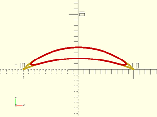
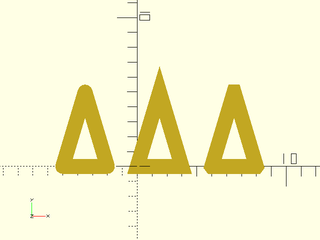
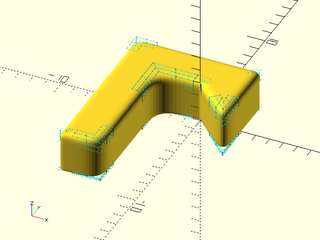

# LibFile: rounding.scad

Routines to create rounded corners, with either circular rounding,
or continuous curvature rounding with no sudden curvature transitions.

To use, add the following lines to the beginning of your file:

    include <BOSL2/std.scad>
    include <BOSL2/rounding.scad>

## Table of Contents

1. [Section: Types of Roundovers](#section-types-of-roundovers)

2. [Section: Rounding Paths](#section-rounding-paths)
    - [`round_corners()`](#function-round_corners)
    - [`smooth_path()`](#function-smooth_path)
    - [`path_join()`](#function-path_join)
    - [`offset_stroke()`](#functionmodule-offset_stroke)

3. [Section: Three-Dimensional Rounding](#section-three-dimensional-rounding)
    - [`offset_sweep()`](#functionmodule-offset_sweep)
    - [`convex_offset_extrude()`](#module-convex_offset_extrude)
    - [`rounded_prism()`](#functionmodule-rounded_prism)
    - [`bent_cutout_mask()`](#module-bent_cutout_mask)

## Section: Types of Roundovers

The functions and modules in this file support two different types of roundovers and some different mechanisms for specifying
the size of the roundover.  The usual circular roundover can produce a tactile "bump" where the curvature changes from flat to
circular.  See https://hackernoon.com/apples-icons-have-that-shape-for-a-very-good-reason-720d4e7c8a14 for details.
We compute continuous curvature rounding using 4th order Bezier curves.  This type of rounding, which we call "smooth" rounding,
does not have a "radius" so we need different ways to specify the size of the roundover.  We introduce the `cut` and `joint`
parameters for this purpose.  They can specify dimensions of circular roundovers, continuous curvature "smooth" roundovers, and even chamfers.

The `cut` parameter specifies the distance from the unrounded corner to the rounded tip, so how
much of the corner to "cut" off.  This can be easier to understand than setting a circular radius, which can be
unexpectedly extreme when the corner is very sharp.  It also allows a systematic specification of
corner treatments that are the same size for all corner treatments.

The `joint` parameter specifies the distance
away from the corner along the path where the roundover or chamfer should start.  This parameter is good for ensuring that
your roundover will fit on the polygon or polyhedron, since you can easily tell whether you have enough space, and whether
adjacent corner treatments will interfere.

For circular rounding you can use the `radius` or `r` parameter to set the rounding radius.

For chamfers you can use `length` to set the length of the chamfer.

The "smooth" rounding method also has a parameter that specifies how smooth the curvature match is.  This parameter, `k`,
ranges from 0 to 1, with a default of 0.5.  Larger values gives a more
abrupt transition and smaller ones a more gradual transition.  If you set the value much higher
than 0.8 the curvature changes abruptly enough that though it is theoretically continuous, it may
not be continuous in practice.  If you set it very small then the transition is so gradual that
the length of the roundover may be extremely long, and the actual rounded part of the curve may be very small.

**Figure 1:** Parameters of a "circle" roundover

 

**Figure 2:** Parameters of a "smooth" roundover with the default of `k=0.5`.  Note the long, slow transition from flat to round.

 

**Figure 3:** Parameters of a "smooth" roundover, with `k=0.75`.  The transition into the roundover is shorter, and faster.  The cut length is bigger for the same joint length.

 

**Figure 4:** Parameters of a "smooth" roundover, with `k=0.15`.  The transition is so gradual that it appears that the roundover is much smaller than specified.  The cut length is much smaller for the same joint length.

 

**Figure 5:** Parameters of a symmetric "chamfer".

 

## Section: Rounding Paths

### Function: round\_corners()

**Usage:** 

- rounded\_path = round\_corners(path, [method], [radius=], [cut=], [joint=], [closed=], [verbose=]);

**Description:** 

Takes a 2D or 3D path as input and rounds each corner
by a specified amount.  The rounding at each point can be different and some points can have zero
rounding.  The `round_corners()` function supports three types of corner treatment: chamfers, circular rounding,
and continuous curvature rounding using 4th order bezier curves.  See
[Types of Roundover](rounding.scad#subsection-types-of-roundover) for details on rounding types.

You select the type of rounding using the `method` parameter, which should be `"smooth"` to
get continuous curvature rounding, `"circle"` to get circular rounding, or `"chamfer"` to get chamfers.  The default is circle
rounding.  Each method accepts multiple options to specify the amount of rounding.  See
[Types of Roundover](rounding.scad#subsection-types-of-roundover) for example diagrams.

* The `cut` parameter specifies the distance from the unrounded corner to the rounded tip, so how
much of the corner to "cut" off.
* The `joint` parameter specifies the distance
away from the corner along the path where the roundover or chamfer should start.  This makes it easy to ensure your roundover will fit,
so use it if you want the largest possible roundover.
* For circular rounding you can use the `radius` or `r` parameter to set the rounding radius.
* For chamfers you can use the `length` parameter, which sets the length of the chamfer edge.

As explained in [Types of Roundover](rounding.scad#subsection-types-of-roundover), the continuous curvature "smooth"
type of rounding also accepts the `k` parameter, between 0 and 1, which specifies how fast the curvature changes at
the joint.  The default is `k=0.5`.

If you select curves that are too large to fit the function will fail with an error.  You can set `verbose=true` to
get a message showing a list of scale factors you can apply to your rounding parameters so that the
roundovers will fit on the curve.  If the scale factors are larger than one
then they indicate how much you can increase the curve sizes before collisions will occur.

The parameters `radius`, `cut`, `joint` and `k` can be numbers, which round every corner using the same parameters, or you
can specify a list to round each corner with different parameters.  If the curve is not closed then the first and last points
of the curve are not rounded.  In this case you can specify a full list of points anyway, and the endpoint values are ignored,
or you can specify a list that has length len(path)-2, omitting the two dummy values.

If your input path includes collinear points you must use a cut or radius value of zero for those "corners".  You can
choose a nonzero joint parameter when the collinear points form a 180 degree angle.  This will cause extra points to be inserted.
If the collinear points form a spike (0 degree angle) then round_corners will fail.

Examples:
* `method="circle", radius=2`:
    Rounds every point with circular, radius 2 roundover
* `method="smooth", cut=2`:
    Rounds every point with continuous curvature rounding with a cut of 2, and a default 0.5 smoothing parameter
* `method="smooth", cut=2, k=0.3`:
    Rounds every point with continuous curvature rounding with a cut of 2, and a very gentle 0.3 smoothness setting

The number of segments used for roundovers is determined by `$fa`, `$fs` and `$fn` as usual for
circular roundovers.  For continuous curvature roundovers `$fs` and `$fn` are used and `$fa` is
ignored.  Note that $fn is interpreted as the number of points on the roundover curve, which is
not equivalent to its meaning for rounding circles because roundovers are usually small fractions
of a circular arc.  As usual, $fn overrides $fs.  When doing continuous curvature rounding be sure to use lots of segments or the effect
will be hidden by the discretization.  Note that if you use $fn with "smooth" then $fn points are added at each corner.
This guarantees a specific output length.  It also means that if
you set `joint` nonzero on a flat "corner", with collinear points, you will get $fn points at that "corner."
If you have two roundovers that fully consume a segment then they share a point where they meet in the segment, which means the output
point count will be decreased by one.

**Arguments:** 

<abbr title="These args can be used by position or by name.">By&nbsp;Position</abbr> | What it does
-------------------- | ------------
`path`               | list of 2d or 3d points defining the path to be rounded.
`method`             | rounding method to use.  Set to "chamfer" for chamfers, "circle" for circular rounding and "smooth" for continuous curvature 4th order bezier rounding.  Default: "circle"

<abbr title="These args must be used by name, ie: name=value">By&nbsp;Name</abbr> | What it does
-------------------- | ------------
`radius|r`           | rounding radius, only compatible with `method="circle"`. Can be a number or vector.
`cut`                | rounding cut distance, compatible with all methods.  Can be a number or vector.
`joint`              | rounding joint distance, compatible with `method="chamfer"` and `method="smooth"`.  Can be a number or vector.
`flat`               | length of the flat edge created by chamfering, compatible with `method="chamfer"`.  Can be a number of vector.
`k`                  | continuous curvature smoothness parameter for `method="smooth"`.  Can be a number or vector.  Default: 0.5
`closed`             | if true treat the path as a closed polygon, otherwise treat it as open.  Default: true.
`verbose`            | if true display rounding scale factors that show how close roundovers are to overlapping.  Default: false

**Example 1:** Standard circular roundover with radius the same at every point. Compare results at the different corners.

 

    include <BOSL2/std.scad>
    include <BOSL2/rounding.scad>
    $fn=36;
    shape = [[0,0], [10,0], [15,12], [6,6], [6, 12], [-3,7]];
    polygon(round_corners(shape, radius=1));
    color("red") down(.1) polygon(shape);

**Example 2:** Circular roundover using the "cut" specification, the same at every corner.

 

    include <BOSL2/std.scad>
    include <BOSL2/rounding.scad>
    $fn=36;
    shape = [[0,0], [10,0], [15,12], [6,6], [6, 12], [-3,7]];
    polygon(round_corners(shape, cut=1));
    color("red") down(.1) polygon(shape);

**Example 3:** Continous curvature roundover using "cut", still the same at every corner.  The default smoothness parameter of 0.5 was too gradual for these roundovers to fit, but 0.7 works.

 

    include <BOSL2/std.scad>
    include <BOSL2/rounding.scad>
    $fn=36;
    shape = [[0,0], [10,0], [15,12], [6,6], [6, 12], [-3,7]];
    polygon(round_corners(shape, method="smooth", cut=1, k=0.7));
    color("red") down(.1) polygon(shape);

**Example 4:** Continuous curvature roundover using "joint", for the last time the same at every corner.  Notice how small the roundovers are.

 

    include <BOSL2/std.scad>
    include <BOSL2/rounding.scad>
    $fn=36;
    shape = [[0,0], [10,0], [15,12], [6,6], [6, 12], [-3,7]];
    polygon(round_corners(shape, method="smooth", joint=1, k=0.7));
    color("red") down(.1) polygon(shape);

**Example 5:** Circular rounding, different at every corner, some corners left unrounded

 

    include <BOSL2/std.scad>
    include <BOSL2/rounding.scad>
    shape = [[0,0], [10,0], [15,12], [6,6], [6, 12], [-3,7]];
    radii = [1.8, 0, 2, 0.3, 1.2, 0];
    polygon(round_corners(shape, radius = radii,$fn=64));
    color("red") down(.1) polygon(shape);

**Example 6:** Continuous curvature rounding, different at every corner, with varying smoothness parameters as well, and `$fs` set very small.  Note that `$fa` is ignored here with method set to "smooth".

 

    include <BOSL2/std.scad>
    include <BOSL2/rounding.scad>
    shape = [[0,0], [10,0], [15,12], [6,6], [6, 12], [-3,7]];
    cuts = [1.5,0,2,0.3, 1.2, 0];
    k = [0.6, 0.5, 0.5, 0.7, 0.3, 0.5];
    polygon(round_corners(shape, method="smooth", cut=cuts, k=k, $fs=0.1));
    color("red") down(.1) polygon(shape);

**Example 7:** Chamfers

 

    include <BOSL2/std.scad>
    include <BOSL2/rounding.scad>
    $fn=36;
    shape = [[0,0], [10,0], [15,12], [6,6], [6, 12], [-3,7]];
    polygon(round_corners(shape, method="chamfer", cut=1));
    color("red") down(.1) polygon(shape);

**Example 8:** 3D printing test pieces to display different curvature shapes.  You can see the discontinuity in the curvature on the "C" piece in the rendered image.

 

    include <BOSL2/std.scad>
    include <BOSL2/rounding.scad>
    ten = square(50);
    cut = 5;
    linear_extrude(height=14) {
      translate([25,25,0])text("C",size=30, valign="center", halign="center");
      translate([85,25,0])text("5",size=30, valign="center", halign="center");
      translate([85,85,0])text("3",size=30, valign="center", halign="center");
      translate([25,85,0])text("7",size=30, valign="center", halign="center");
    }
    linear_extrude(height=13) {
      polygon(round_corners(ten, cut=cut, $fn=96*4));
      translate([60,0,0])polygon(round_corners(ten,  method="smooth", cut=cut, $fn=96));
      translate([60,60,0])polygon(round_corners(ten, method="smooth", cut=cut, k=0.32, $fn=96));
      translate([0,60,0])polygon(round_corners(ten, method="smooth", cut=cut, k=0.7, $fn=96));
    }

**Example 9:** Rounding a path that is not closed in a three different ways.

 

    include <BOSL2/std.scad>
    include <BOSL2/rounding.scad>
    $fs=.1;
    $fa=1;
    zigzagx = [-10, 0, 10, 20, 29, 38, 46, 52, 59, 66, 72, 78, 83, 88, 92, 96, 99, 102, 112];
    zigzagy = concat([0], flatten(repeat([-10,10],8)), [-10,0]);
    zig = hstack(zigzagx,zigzagy);
    stroke(zig,width=1);   // Original shape
    fwd(20)            // Smooth size corners with a cut of 4 and curvature parameter 0.6
      stroke(round_corners(zig,cut=4, k=0.6, method="smooth", closed=false),width=1);
    fwd(40)            // Smooth size corners with circular arcs and a cut of 4
      stroke(round_corners(zig,cut=4,closed=false, method="circle"),width=1);
                       // Smooth size corners with a circular arc and radius 1.5 (close to maximum possible)
    fwd(60)            // Note how the different points are cut back by different amounts
      stroke(round_corners(zig,radius=1.5,closed=false),width=1);

**Example 10:** Rounding some random 3D paths

 

    include <BOSL2/std.scad>
    include <BOSL2/rounding.scad>
    $fn=36;
    list1= [
      [2.887360, 4.03497, 6.372090],
      [5.682210, 9.37103, 0.783548],
      [7.808460, 4.39414, 1.843770],
      [0.941085, 5.30548, 4.467530],
      [1.860540, 9.81574, 6.497530],
      [6.938180, 7.21163, 5.794530]
    ];
    list2= [
      [1.079070, 4.74091, 6.900390],
      [8.775850, 4.42248, 6.651850],
      [5.947140, 9.17137, 6.156420],
      [0.662660, 6.95630, 5.884230],
      [6.564540, 8.86334, 9.953110],
      [5.420150, 4.91874, 3.866960]
    ];
    path_sweep(regular_ngon(n=36,or=.1),round_corners(list1,closed=false, method="smooth", cut = 0.65));
    right(6)
      path_sweep(regular_ngon(n=36,or=.1),round_corners(list2,closed=false, method="circle", cut = 0.75));

**Example 11:** Rounding a spiral with increased rounding along the length

 

    include <BOSL2/std.scad>
    include <BOSL2/rounding.scad>
    // Construct a square spiral path in 3D
    $fn=36;
    square = [[0,0],[1,0],[1,1],[0,1]];
    spiral = flatten(repeat(concat(square,reverse(square)),5));  // Squares repeat 10 times, forward and backward
    squareind = [for(i=[0:9]) each [i,i,i,i]];                   // Index of the square for each point
    z = count(40)*.2+squareind;
    path3d = hstack(spiral,z);                                   // 3D spiral
    rounding = squareind/20;
        // Setting k=1 means curvature won't be continuous, but curves are as round as possible
        // Try changing the value to see the effect.
    rpath = round_corners(path3d, joint=rounding, k=1, method="smooth", closed=false);
    path_sweep( regular_ngon(n=36, or=.1), rpath);

**Example 12:** The rounding invocation that is commented out gives an error because the rounding parameters interfere with each other.  The error message gives a list of factors that can help you fix this: [0.852094, 0.852094, 1.85457, 10.1529]

 

    include <BOSL2/std.scad>
    include <BOSL2/rounding.scad>
    $fn=64;
    path = [[0, 0],[10, 0],[20, 20],[30, -10]];
    debug_polygon(path);
    //polygon(round_corners(path,cut = [1,3,1,1], method="circle"));

**Example 13:** The list of factors shows that the problem is in the first two rounding values, because the factors are smaller than one.  If we multiply the first two parameters by 0.85 then the roundings fit.  The verbose option gives us the same fit factors.

 

    include <BOSL2/std.scad>
    include <BOSL2/rounding.scad>
    $fn=64;
    path = [[0, 0],[10, 0],[20, 20],[30, -10]];
    polygon(round_corners(path,cut = [0.85,3*0.85,1,1], method="circle", verbose=true));

**Example 14:** From the fit factors we can see that rounding at vertices 2 and 3 could be increased a lot.  Applying those factors we get this more rounded shape.  The new fit factors show that we can still further increase the rounding parameters if we wish.

 

    include <BOSL2/std.scad>
    include <BOSL2/rounding.scad>
    $fn=64;
    path = [[0, 0],[10, 0],[20, 20],[30, -10]];
    polygon(round_corners(path,cut = [0.85,3*0.85,2.13, 10.15], method="circle",verbose=true));

**Example 15:** Using the `joint` parameter it's easier to understand whether your roundvers will fit.  We can guarantee a fairly large roundover on any path by picking each one to use up half the segment distance along the shorter of its two segments:

 

    include <BOSL2/std.scad>
    include <BOSL2/rounding.scad>
    $fn=64;
    path = [[0, 0],[10, 0],[20, 20],[30, -10]];
    path_len = path_segment_lengths(path,closed=true);
    halflen = [for(i=idx(path)) min(select(path_len,i-1,i))/2];
    polygon(round_corners(path,joint = halflen, method="circle",verbose=true));

**Example 16:** Chamfering, specifying the chamfer length

    include <BOSL2/std.scad>
    include <BOSL2/rounding.scad>
    path = star(5, step=2, d=100);
    path2 = round_corners(path, method="chamfer", width=5);
    polygon(path2);

  

**Example 17:** Chamfering, specifying the cut

    include <BOSL2/std.scad>
    include <BOSL2/rounding.scad>
    path = star(5, step=2, d=100);
    path2 = round_corners(path, method="chamfer", cut=5);
    polygon(path2);

  

**Example 18:** Chamfering, specifying joint length

    include <BOSL2/std.scad>
    include <BOSL2/rounding.scad>
    path = star(5, step=2, d=100);
    path2 = round_corners(path, method="chamfer", joint=5);
    polygon(path2);

  

**Example 19:** Two passes to apply chamfers first, and then round the unchamfered corners.  Chamfers always add one point, so it's not hard to keep track of the vertices

 

    include <BOSL2/std.scad>
    include <BOSL2/rounding.scad>
    $fn=32;
    shape = square(10);
    chamfered = round_corners(shape, method="chamfer", cut=[2,0,2,0]);
    rounded = round_corners(chamfered,
               cut = [0, 0,    // first original veretex, chamfered
                      1.5,     // second original vertex
                      0, 0,    // third original vertex, chamfered
                      2.5]);   // last original vertex
    polygon(rounded);

**Example 20:** Another example of mixing chamfers and roundings with two passes

    include <BOSL2/std.scad>
    include <BOSL2/rounding.scad>
    path = star(5, step=2, d=100);
    chamfcut = [for (i=[0:4]) each [7,0]];
    radii = [for (i=[0:4]) each [0,0,10]];
    path2=round_corners(
            round_corners(path,
                          method="chamfer",
                          cut=chamfcut),
            radius=radii);
    stroke(path2, closed=true);

  

**Example 21:** Specifying by corner index.  Use [`list_set()`](lists.scad#function-list\_set) to construct the full chamfer cut list.

 

    include <BOSL2/std.scad>
    include <BOSL2/rounding.scad>
    path = star(47, ir=25, or=50);  // long path, lots of corners
    chamfind = [8, 28, 60];         // But only want 3 chamfers
    chamfcut = list_set([],chamfind,[10,13,15],minlen=len(path)-1);
    rpath = round_corners(path, cut=chamfcut, method="chamfer");
    polygon(rpath);

**Example 22:** Two-pass to chamfer and round by index.  Use [`repeat_entries()`](lists.scad#function-repeat\_entries) to correct for first pass chamfers.

 

    include <BOSL2/std.scad>
    include <BOSL2/rounding.scad>
    $fn=32;
    path = star(47, ir=32, or=65);  // long path, lots of corners
    chamfind = [8, 28, 60];         // But only want 3 chamfers
    roundind = [7,9,27,29,59,61];   // And 6 roundovers
    chamfcut = list_set([],chamfind,[10,13,15],minlen=len(path)-1);
    roundcut = list_set([],roundind,repeat(8,6),minlen=len(path)-1);
    dups = list_set([], chamfind, repeat(2,len(chamfind)), dflt=1, minlen=len(path)-1);
    rpath1 = round_corners(path, cut=chamfcut, method="chamfer");
    rpath2 = round_corners(rpath1, cut=repeat_entries(roundcut,dups));
    polygon(rpath2);

---

### Function: smooth\_path()

**Usage:** 

- smoothed = smooth\_path(path, [tangents], &lt;size=|relsize=&gt;, [splinesteps=], [closed=], [uniform=]);

**Description:** 

Smooths the input path using a cubic spline.  Every segment of the path will be replaced by a cubic curve
with `splinesteps` points.  The cubic interpolation will pass through every input point on the path
and will match the tangents at every point.  If you do not specify tangents they will be computed using
path_tangents with uniform=false by default.  Note that setting uniform to true with non-uniform
sampling may be desirable in some cases but tends to produces curves that overshoot the point on the path.

The size or relsize parameter determines how far the curve can bend away from
the input path.  In the case where the curve has a single hump, the size specifies the exact distance
between the specified path and the curve.  If you give relsize then it is relative to the segment
length (e.g. 0.05 means 5% of the segment length).  In 2d when the spline may make an S-curve,
in which case the size parameter specifies the sum of the deviations of the two peaks of the curve.  In 3-space
the bezier curve may have three extrema: two maxima and one minimum.  In this case the size specifies
the sum of the maxima minus the minimum.  At a given segment there is a maximum size: if your size
value is too large it will be rounded down.  See also path_to_bezpath().

**Arguments:** 

<abbr title="These args can be used by position or by name.">By&nbsp;Position</abbr> | What it does
-------------------- | ------------
`path`               | path to smooth
`tangents`           | tangents constraining curve direction at each point.  Default: computed automatically

<abbr title="These args must be used by name, ie: name=value">By&nbsp;Name</abbr> | What it does
-------------------- | ------------
`relsize`            | relative size specification for the curve, a number or vector.  Default: 0.1
`size`               | absolute size specification for the curve, a number or vector
`uniform`            | set to true to compute tangents with uniform=true.  Default: false
`closed`             | true if the curve is closed.  Default: false.

**Example 1:** Original path in green, smoothed path in yellow:

    include <BOSL2/std.scad>
    include <BOSL2/rounding.scad>
    color("green")stroke(square(4), width=0.1);
    stroke(smooth_path(square(4),size=0.4), width=0.1);

  

**Example 2:** Closing the path changes the end tangents

    include <BOSL2/std.scad>
    include <BOSL2/rounding.scad>
    polygon(smooth_path(square(4),size=0.4,closed=true));

  

**Example 3:** Turning on uniform tangent calculation also changes the end derivatives:

 

    include <BOSL2/std.scad>
    include <BOSL2/rounding.scad>
    color("green")stroke(square(4), width=0.1);
    stroke(smooth_path(square(4),size=0.4,uniform=true), width=0.1);

**Example 4:** Here's a wide rectangle.  Using size means all edges bulge the same amount, regardless of their length.

 

    include <BOSL2/std.scad>
    include <BOSL2/rounding.scad>
    color("green")stroke(square([10,4]), closed=true, width=0.1);
    stroke(smooth_path(square([10,4]),size=1,closed=true),width=0.1);

**Example 5:** Here's a wide rectangle.  With relsize the bulge is proportional to the side length.

 

    include <BOSL2/std.scad>
    include <BOSL2/rounding.scad>
    color("green")stroke(square([10,4]), closed=true, width=0.1);
    stroke(smooth_path(square([10,4]),relsize=0.1,closed=true),width=0.1);

**Example 6:** Here's a wide rectangle.  Settting uniform to true biases the tangents to aline more with the line sides

 

    include <BOSL2/std.scad>
    include <BOSL2/rounding.scad>
    color("green")stroke(square([10,4]), closed=true, width=0.1);
    stroke(smooth_path(square([10,4]),uniform=true,relsize=0.1,closed=true),width=0.1);

**Example 7:** A more interesting shape:

    include <BOSL2/std.scad>
    include <BOSL2/rounding.scad>
    path = [[0,0], [4,0], [7,14], [-3,12]];
    polygon(smooth_path(path,size=1,closed=true));

  

**Example 8:** Here's the square again with less smoothing.

    include <BOSL2/std.scad>
    include <BOSL2/rounding.scad>
    polygon(smooth_path(square(4), size=.25,closed=true));

  

**Example 9:** Here's the square with a size that's too big to achieve, so you get the maximum possible curve:

 

    include <BOSL2/std.scad>
    include <BOSL2/rounding.scad>
    color("green")stroke(square(4), width=0.1,closed=true);
    stroke(smooth_path(square(4), size=4, closed=true),closed=true,width=.1);

**Example 10:** You can alter the shape of the curve by specifying your own arbitrary tangent values

 

    include <BOSL2/std.scad>
    include <BOSL2/rounding.scad>
    polygon(smooth_path(square(4),tangents=1.25*[[-2,-1], [-4,1], [1,2], [6,-1]],size=0.4,closed=true));

**Example 11:** Or you can give a different size for each segment

 

    include <BOSL2/std.scad>
    include <BOSL2/rounding.scad>
    polygon(smooth_path(square(4),size = [.4, .05, 1, .3],closed=true));

**Example 12:** Works on 3d paths as well

    include <BOSL2/std.scad>
    include <BOSL2/rounding.scad>
    path = [[0,0,0],[3,3,2],[6,0,1],[9,9,0]];
    stroke(smooth_path(path,relsize=.1),width=.3);

  

**Example 13:** This shows the type of overshoot that can occur with uniform=true.  You can produce overshoots like this if you supply a tangent that is difficult to connect to the adjacent points

    include <BOSL2/std.scad>
    include <BOSL2/rounding.scad>
    pts = [[-3.3, 1.7], [-3.7, -2.2], [3.8, -4.8], [-0.9, -2.4]];
    stroke(smooth_path(pts, uniform=true, relsize=0.1),width=.1);
    color("red")move_copies(pts)circle(r=.15,$fn=12);

  

**Example 14:** With the default of uniform false no overshoot occurs.  Note that the shape of the curve is quite different.

    include <BOSL2/std.scad>
    include <BOSL2/rounding.scad>
    pts = [[-3.3, 1.7], [-3.7, -2.2], [3.8, -4.8], [-0.9, -2.4]];
    stroke(smooth_path(pts, uniform=false, relsize=0.1),width=.1);
    color("red")move_copies(pts)circle(r=.15,$fn=12);

  

---

### Function: path\_join()

**Usage:** 

- joined\_path = path\_join(paths, [joint], [k=], [relocate=], [closed=]);

**Description:** 

Connect a sequence of paths together into a single path with optional continuous curvature rounding
applied at the joints.  By default the first path is taken as specified and subsequent paths are
translated into position so that each path starts where the previous path ended.
If you set relocate to false then this relocation is skipped.
You specify rounding using the `joint` parameter, which specifies the distance away from the corner
where the roundover should start.  The path_join function may remove many path points to cut the path
back by the joint length.  Rounding is using continous curvature 4th order bezier splines and
the parameter `k` specifies how smooth the curvature match is.  This parameter ranges from 0 to 1 with
a default of 0.5.  Use a larger k value to get a curve that is bigger for the same joint value.  When
k=1 the curve may be similar to a circle if your curves are symmetric.  As the path is built up, the joint
parameter applies to the growing path, so if you pick a large joint parameter it may interact with the
previous path sections.  See [Types of Roundover](rounding.scad#subsection-types-of-roundover) for more details
on continuous curvature rounding.

The rounding is created by extending the two clipped paths to define a corner point.  If the extensions of
the paths do not intersect, the function issues an error.  When closed=true the final path should actually close
the shape, repeating the starting point of the shape.  If it does not, then the rounding will fill the gap.

The number of segments in the roundovers is set based on $fn and $fs.  If you use $fn it specifies the number of
segments in the roundover, regardless of its angular extent.

**Arguments:** 

<abbr title="These args can be used by position or by name.">By&nbsp;Position</abbr> | What it does
-------------------- | ------------
`paths`              | list of paths to join
`joint`              | joint distance, either a number, a pair (giving the previous and next joint distance) or a list of numbers and pairs.  Default: 0

<abbr title="These args must be used by name, ie: name=value">By&nbsp;Name</abbr> | What it does
-------------------- | ------------
`k`                  | curvature parameter, either a number or vector.  Default: 0.5
`relocate`           | set to false to prevent paths from being arranged tail to head.  Default: true
`closed`             | set to true to round the junction between the last and first paths.  Default: false

**Example 1:** Connection of 3 simple paths.

    include <BOSL2/std.scad>
    include <BOSL2/rounding.scad>
    horiz = [[0,0],[10,0]];
    vert = [[0,0],[0,10]];
    stroke(path_join([horiz, vert, -horiz]));

  

**Example 2:** Adding curvature with joint of 3

    include <BOSL2/std.scad>
    include <BOSL2/rounding.scad>
    horiz = [[0,0],[10,0]];
    vert = [[0,0],[0,10]];
    stroke(path_join([horiz, vert, -horiz],joint=3,$fn=16));

  

**Example 3:** Setting k=1 increases the amount of curvature

    include <BOSL2/std.scad>
    include <BOSL2/rounding.scad>
    horiz = [[0,0],[10,0]];
    vert = [[0,0],[0,10]];
    stroke(path_join([horiz, vert, -horiz],joint=3,k=1,$fn=16));

  

**Example 4:** Specifying pairs of joint values at a path joint creates an asymmetric curve

 

    include <BOSL2/std.scad>
    include <BOSL2/rounding.scad>
    horiz = [[0,0],[10,0]];
    vert = [[0,0],[0,10]];
    stroke(path_join([horiz, vert, -horiz],joint=[[4,1],[1,4]],$fn=16),width=.3);

**Example 5:** A closed square

 

    include <BOSL2/std.scad>
    include <BOSL2/rounding.scad>
    horiz = [[0,0],[10,0]];
    vert = [[0,0],[0,10]];
    stroke(path_join([horiz, vert, -horiz, -vert],joint=3,k=1,closed=true,$fn=16),closed=true);

**Example 6:** Different curve at each corner by changing the joint size

 

    include <BOSL2/std.scad>
    include <BOSL2/rounding.scad>
    horiz = [[0,0],[10,0]];
    vert = [[0,0],[0,10]];
    stroke(path_join([horiz, vert, -horiz, -vert],joint=[3,0,1,2],k=1,closed=true,$fn=16),closed=true,width=0.4);

**Example 7:** Different curve at each corner by changing the curvature parameter.  Note that k=0 still gives a small curve, unlike joint=0 which gives a sharp corner.

 

    include <BOSL2/std.scad>
    include <BOSL2/rounding.scad>
    horiz = [[0,0],[10,0]];
    vert = [[0,0],[0,10]];
    stroke(path_join([horiz, vert, -horiz, -vert],joint=3,k=[1,.5,0,.7],closed=true,$fn=16),closed=true,width=0.4);

**Example 8:** Joint value of 7 is larger than half the square so curves interfere with each other, which breaks symmetry because they are computed sequentially

 

    include <BOSL2/std.scad>
    include <BOSL2/rounding.scad>
    horiz = [[0,0],[10,0]];
    vert = [[0,0],[0,10]];
    stroke(path_join([horiz, vert, -horiz, -vert],joint=7,k=.4,closed=true,$fn=16),closed=true);

**Example 9:** Unlike round\_corners, we can add curves onto curves.

    include <BOSL2/std.scad>
    include <BOSL2/rounding.scad>
    $fn=64;
    myarc = arc(width=20, thickness=5 );
    stroke(path_join(repeat(myarc,3), joint=4));

  

**Example 10:** Here we make a closed shape from two arcs and round the sharp tips

 

    include <BOSL2/std.scad>
    include <BOSL2/rounding.scad>
    arc1 = arc(width=20, thickness=4,$fn=75);
    arc2 = reverse(arc(width=20, thickness=2,$fn=75));
    stroke(path_join([arc1,arc2]),width=.3);    // Join without rounding
    color("red")stroke(path_join([arc1,arc2], 3,k=1,closed=true), width=.3,closed=true,$fn=12);  // Join with rounding

**Example 11:** Combining arcs with segments

 

    include <BOSL2/std.scad>
    include <BOSL2/rounding.scad>
    arc1 = arc(width=20, thickness=4,$fn=75);
    arc2 = reverse(arc(width=20, thickness=2,$fn=75));
    vpath = [[0,0],[0,-5]];
    stroke(path_join([arc1,vpath,arc2,reverse(vpath)]),width=.2);
    color("red")stroke(path_join([arc1,vpath,arc2,reverse(vpath)], [1,2,2,1],k=1,closed=true), width=.2,closed=true,$fn=12);

**Example 12:** Here relocation is off.  We have three segments (in yellow) and add the curves to the segments.  Notice that joint zero still produces a curve because it refers to the endpoints of the supplied paths.

 

    include <BOSL2/std.scad>
    include <BOSL2/rounding.scad>
    p1 = [[0,0],[2,0]];
    p2 = [[3,1],[1,3]];
    p3 = [[0,3],[-1,1]];
    color("red")stroke(path_join([p1,p2,p3], joint=0, relocate=false,closed=true),width=.3,$fn=12);
    for(x=[p1,p2,p3]) stroke(x,width=.3);

**Example 13:** If you specify closed=true when the last path doesn't meet the first one then it is similar to using relocate=false: the function tries to close the path using a curve.  In the example below, this results in a long curve to the left, when given the unclosed three segments as input.  Note that if the segments are parallel the function fails with an error.  The extension of the curves must intersect in a corner for the rounding to be well-defined.  To get a normal rounding of the closed shape, you must include a fourth path, the last segment that closes the shape.

 

    include <BOSL2/std.scad>
    include <BOSL2/rounding.scad>
    horiz = [[0,0],[10,0]];
    vert = [[0,0],[0,10]];
    h2 = [[0,-3],[10,0]];
    color("red")stroke(path_join([horiz, vert, -h2],closed=true,joint=3,$fn=25),closed=true,width=.5);
    stroke(path_join([horiz, vert, -h2]),width=.3);

**Example 14:** With a single path with closed=true the start and end junction is rounded.

 

    include <BOSL2/std.scad>
    include <BOSL2/rounding.scad>
    tri = regular_ngon(n=3, r=7);
    stroke(path_join([tri], joint=3,closed=true,$fn=12),closed=true,width=.5);

---

### Function/Module: offset\_stroke()

**Usage:** as module

- offset\_stroke(path, [width], [rounded=], [chamfer=], [start=], [end=], [check\_valid=], [quality=], [closed=]);

**Usage:** as function

- path = offset\_stroke(path, [width], closed=false, [rounded=], [chamfer=], [start=], [end=], [check\_valid=], [quality=]);
- region = offset\_stroke(path, [width], closed=true, [rounded=], [chamfer=], [start=], [end=], [check\_valid=], [quality=]);

**Description:** 

Uses `offset()` to compute a stroke for the input path.  Unlike `stroke`, the result does not need to be
centered on the input path.  The corners can be rounded, pointed, or chamfered, and you can make the ends
rounded, flat or pointed with the `start` and `end` parameters.

The `check_valid` and `quality`  parameters are passed through to `offset()`

If `width` is a scalar then the output will be a centered stroke of the specified width.  If width
is a list of two values then those two values will define the stroke side positions relative to the center line, where
as with offset(), the shift is to the left for open paths and outward for closed paths.  For example,
setting `width` to `[0,1]` will create a stroke of width 1 that extends entirely to the left of the input, and and [-4,-6]
will create a stroke of width 2 offset 4 units to the right of the input path.

If closed==false then the function form will return a path.  If closed==true then it will return a region.  The `start` and
`end` parameters are forbidden for closed paths.

Three simple end treatments are supported, "flat" (the default), "round" and "pointed".  The "flat" treatment
cuts off the ends perpendicular to the path and the "round" treatment applies a semicircle to the end.  The
"pointed" end treatment caps the stroke with a centered triangle that has 45 degree angles on each side.

More complex end treatments are available through parameter lists with helper functions to ease parameter passing.  The parameter list
keywords are
   - "for" : must appear first in the list and have the value "offset_stroke"
   - "type": the type of end treatment, one of "shifted_point", "roundover", or "flat"
   - "angle": relative angle (relative to the path)
   - "abs_angle": absolute angle (angle relative to x-axis)
   - "cut": cut distance for roundovers, a single value to round both corners identically or a list of two values for the two corners.  Negative values round outward.
   - "k": curvature smoothness parameter for roundovers, default 0.75

Function helpers for defining ends, prefixed by "os" for offset_stroke, are:
   - os_flat(angle|absangle): specify a flat end either relative to the path or relative to the x-axis
   - os_pointed(dist, [loc]): specify a pointed tip where the point is distance `loc` from the centerline (positive is the left direction as for offset), and `dist` is the distance from the path end to the point tip.  The default value for `loc` is zero (the center).  You must specify `dist` when using this option.
   - os_round(cut, [angle|absangle], [k]).  Rounded ends with the specified cut distance, based on the specified angle or absolute angle.  The `k` parameter is the smoothness parameter for continuous curvature rounding.  See [Types of Roundover](rounding.scad#subsection-types-of-roundover) for more details on
     continuous curvature rounding.

Note that `offset_stroke()` will attempt to apply roundovers and angles at the ends even when it means deleting segments of the stroke, unlike round_corners which only works on a segment adjacent to a corner.  If you specify an overly extreme angle it will fail to find an intersection with the stroke and display an error.  When you specify an angle the end segment is rotated around the center of the stroke and the last segment of the stroke one one side is extended to the corner.

The `$fn` and `$fs` variables are used in the usual way to determine the number of segments for roundings produced by the offset
invocations and roundings produced by the semi-circular "round" end treatment.  The os_round() end treatment
uses a bezier curve, and will produce segments of approximate length `$fs` or it will produce `$fn` segments.
(This means that even a quarter circle will have `$fn` segments, unlike the usual case where it would have `$fn/4` segments.)

**Arguments:** 

<abbr title="These args can be used by position or by name.">By&nbsp;Position</abbr> | What it does
-------------------- | ------------
`path`               | 2d path that defines the stroke
`width`              | width of the stroke, a scalar or a vector of 2 values giving the offset from the path.  Default: 1

<abbr title="These args must be used by name, ie: name=value">By&nbsp;Name</abbr> | What it does
-------------------- | ------------
`rounded`            | set to true to use rounded offsets, false to use sharp (delta) offsets.  Default: true
`chamfer`            | set to true to use chamfers when `rounded=false`.  Default: false
`start`              | end treatment for the start of the stroke.  See above for details.  Default: "flat"
`end`                | end treatment for the end of the stroke.  See above for details.  Default: "flat"
`check_valid`        | passed to offset().  Default: true
`quality`            | passed to offset().  Default: 1
`closed`             | true if the curve is closed, false otherwise.  Default: false

**Example 1:** Basic examples illustrating flat, round, and pointed ends, on a finely sampled arc and a path made from 3 segments.

 

    include <BOSL2/std.scad>
    include <BOSL2/rounding.scad>
    arc = arc(points=[[1,1],[3,4],[6,3]],N=50);
    path = [[0,0],[6,2],[9,7],[8,10]];
    xdistribute(spacing=10){
      offset_stroke(path, width = 2);
      offset_stroke(path, start="round", end="round", width = 2);
      offset_stroke(path, start="pointed", end="pointed", width = 2);
    }
    fwd(10) xdistribute(spacing=10){
      offset_stroke(arc, width = 2);
      offset_stroke(arc, start="round", end="round", width = 2);
      offset_stroke(arc, start="pointed", end="pointed", width = 2);
    }

**Example 2:** The effect of the `rounded` and `chamfer` options is most evident at sharp corners.  This only affects the middle of the path, not the ends.

    include <BOSL2/std.scad>
    include <BOSL2/rounding.scad>
    sharppath = [[0,0], [1.5,5], [3,0]];
    xdistribute(spacing=5){
      offset_stroke(sharppath, $fn=16);
      offset_stroke(sharppath, rounded=false);
      offset_stroke(sharppath, rounded=false, chamfer=true);
    }

  

**Example 3:** When closed is enabled all the corners are affected by those options.

 

    include <BOSL2/std.scad>
    include <BOSL2/rounding.scad>
    sharppath = [[0,0], [1.5,5], [3,0]];
    xdistribute(spacing=5){
      offset_stroke(sharppath,closed=true, $fn=16);
      offset_stroke(sharppath, rounded=false, closed=true);
      offset_stroke(sharppath, rounded=false, chamfer=true, closed=true);
    }

**Example 4:** The left stroke uses flat ends with a relative angle of zero.  The right hand one uses flat ends with an absolute angle of zero, so the ends are parallel to the x-axis.

 

    include <BOSL2/std.scad>
    include <BOSL2/rounding.scad>
    path = [[0,0],[6,2],[9,7],[8,10]];
    offset_stroke(path, start=os_flat(angle=0), end=os_flat(angle=0));
    right(5)
      offset_stroke(path, start=os_flat(abs_angle=0), end=os_flat(abs_angle=0));

**Example 5:** With continuous sampling the end treatment can remove segments or extend the last segment linearly, as shown here.  Again the left side uses relative angle flat ends and the right hand example uses absolute angle.

 

    include <BOSL2/std.scad>
    include <BOSL2/rounding.scad>
    arc = arc(points=[[4,0],[3,4],[6,3]],N=50);
    offset_stroke(arc, start=os_flat(angle=45), end=os_flat(angle=45));
    right(5)
      offset_stroke(arc, start=os_flat(abs_angle=45), end=os_flat(abs_angle=45));

**Example 6:** The os\_pointed() end treatment allows adjustment of the point tip, as shown here.  The width is 2 so a location of 1 is at the edge.

 

    include <BOSL2/std.scad>
    include <BOSL2/rounding.scad>
    arc = arc(points=[[1,1],[3,4],[6,3]],N=50);
    offset_stroke(arc, width=2, start=os_pointed(loc=1,dist=3),end=os_pointed(loc=1,dist=3));
    right(10)
      offset_stroke(arc, width=2, start=os_pointed(dist=4),end=os_pointed(dist=-1));
    fwd(7)
      offset_stroke(arc, width=2, start=os_pointed(loc=2,dist=2),end=os_pointed(loc=.5,dist=-1));

**Example 7:** The os\_round() end treatment adds roundovers to the end corners by specifying the `cut` parameter.  In the first example, the cut parameter is the same at each corner.  The bezier smoothness parameter `k` is given to allow a larger cut.  In the second example, each corner is given a different roundover, including zero for no rounding at all.  The red shows the same strokes without the roundover.

 

    include <BOSL2/std.scad>
    include <BOSL2/rounding.scad>
    $fn=36;
    arc = arc(points=[[1,1],[3,4],[6,3]],N=50);
    path = [[0,0],[6,2],[9,7],[8,10]];
    offset_stroke(path, width=2, rounded=false,start=os_round(angle=-20, cut=0.4,k=.9), end=os_round(angle=-35, cut=0.4,k=.9));
    color("red")down(.1)offset_stroke(path, width=2, rounded=false,start=os_flat(-20), end=os_flat(-35));
    right(9){
      offset_stroke(arc, width=2, rounded=false, start=os_round(cut=[.3,.6],angle=-45), end=os_round(angle=20,cut=[.6,0]));
      color("red")down(.1)offset_stroke(arc, width=2, rounded=false, start=os_flat(-45), end=os_flat(20));
    }

**Example 8:** Negative cut values produce a flaring end.  Note how the absolute angle aligns the ends of the first example withi the axes.  In the second example positive and negative cut values are combined.  Note also that very different cuts are needed at the start end to produce a similar looking flare.

 

    include <BOSL2/std.scad>
    include <BOSL2/rounding.scad>
    arc = arc(points=[[1,1],[3,4],[6,3]],N=50);
    path = [[0,0],[6,2],[9,7],[8,10]];
    offset_stroke(path, width=2, rounded=false,start=os_round(cut=-1, abs_angle=90), end=os_round(cut=-0.5, abs_angle=0),$fn=36);
    right(10)
       offset_stroke(arc, width=2, rounded=false, start=os_round(cut=[-.75,-.2], angle=-45), end=os_round(cut=[-.2,.2], angle=20),$fn=36);

**Example 9:** Setting the width to a vector allows you to offset the stroke.  Here with successive increasing offsets we create a set of parallel strokes

    include <BOSL2/std.scad>
    include <BOSL2/rounding.scad>
    path = [[0,0],[4,4],[8,4],[2,9],[10,10]];
    for(i=[0:.25:2])
      offset_stroke(path, rounded=false,width = [i,i+.08]);

  

**Example 10:** Setting rounded=true in the above example makes a very big difference in the result.

    include <BOSL2/std.scad>
    include <BOSL2/rounding.scad>
    path = [[0,0],[4,4],[8,4],[2,9],[10,10]];
    for(i=[0:.25:2])
      offset_stroke(path, rounded=true,width = [i,i+.08], $fn=36);

  

**Example 11:** In this example a spurious triangle appears.  This results from overly enthusiastic validity checking.  Turning validity checking off fixes it in this case.

 

    include <BOSL2/std.scad>
    include <BOSL2/rounding.scad>
    path = [[0,0],[4,4],[8,4],[2,9],[10,10]];
    offset_stroke(path, check_valid=true,rounded=false,width = [1.4, 1.5]);
    right(2)
      offset_stroke(path, check_valid=false,rounded=false,width = [1.4, 1.5]);

**Example 12:** But in this case, disabling the validity check produces an invalid result.

 

    include <BOSL2/std.scad>
    include <BOSL2/rounding.scad>
    path = [[0,0],[4,4],[8,4],[2,9],[10,10]];
    offset_stroke(path, check_valid=true,rounded=false,width = [1.9, 2]);
    translate([1,-0.25])
      offset_stroke(path, check_valid=false,rounded=false,width = [1.9, 2]);

**Example 13:** Self-intersecting paths are handled differently than with the `stroke()` module.

    include <BOSL2/std.scad>
    include <BOSL2/rounding.scad>
    $fn=16;
    path = turtle(["move",10,"left",144], repeat=4);
    stroke(path, closed=true);
    right(12)
      offset_stroke(path, width=1, closed=true);

  

---

## Section: Three-Dimensional Rounding

### Function/Module: offset\_sweep()

**Usage:** most common module arguments.  See Arguments list below for more.

- offset\_sweep(path, &lt;height|h|l&gt;, [bottom], [top], [offset=], [convexity=],...) [attachments]

**Usage:** most common function arguments.  See Arguments list below for more.

- vnf = offset\_sweep(path, &lt;height|h|l&gt;, [bottom], [top], [offset=], ...)

**Description:** 

Takes a 2d path as input and extrudes it upwards and/or downward.  Each layer in the extrusion is produced using `offset()` to expand or shrink the previous layer.  When invoked as a function returns a VNF; when invoked as a module produces geometry.
Using the `top` and/or `bottom` arguments you can specify a sequence of offsets values, or you can use several built-in offset profiles that
provide end treatments such as roundovers.
The height of the resulting object can be specified using the `height` argument, in which case `height` must be larger than the combined height
of the end treatments.  If you omit `height` then the object height will be the height of just the top and bottom end treatments.

The path is shifted by `offset()` multiple times in sequence
to produce the final shape (not multiple shifts from one parent), so coarse definition of the input path will degrade
from the successive shifts.  If the result seems rough or strange try increasing the number of points you use for
your input.  If you get unexpected corners in your result you may have forgotten to set `$fn` or `$fa` and `$fs`.
Be aware that large numbers of points (especially when check_valid is true) can lead to lengthy run times.  If your
shape doesn't develop new corners from the offsetting you may be able to save a lot of time by setting `check_valid=false`.  Be aware that
disabling the validity check when it is needed can generate invalid polyhedra that will produce CGAL errors upon
rendering.  Such validity errors will also occur if you specify a self-intersecting shape.
The offset profile is quantized to 1/1024 steps to avoid failures in offset() that can occur with very tiny offsets.

The build-in profiles are: circular rounding, teardrop rounding, continuous curvature rounding, and chamfer.
Also note that when a rounding radius is negative the rounding will flare outwards.  The easiest way to specify
the profile is by using the profile helper functions.  These functions take profile parameters, as well as some
general settings and translate them into a profile specification, with error checking on your input.  The description below
describes the helper functions and the parameters specific to each function.  Below that is a description of the generic
settings that you can optionally use with all of the helper functions.  For more details on the "cut" and "joint" rounding parameters, and
on continuous curvature rounding, see [Types of Roundover](rounding.scad#subsection-types-of-roundover).

- profile: os_profile(points)
  Define the offset profile with a list of points.  The first point must be [0,0] and the roundover should rise in the positive y direction, with positive x values for inward motion (standard roundover) and negative x values for flaring outward.  If the y value ever decreases then you might create a self-intersecting polyhedron, which is invalid.  Such invalid polyhedra will create cryptic assertion errors when you render your model and it is your responsibility to avoid creating them.  Note that the starting point of the profile is the center of the extrusion.  If you use a profile as the top it will rise upwards.  If you use it as the bottom it will be inverted, and will go downward.
- circle: os_circle(r|cut).  Define circular rounding either by specifying the radius or cut distance.
- smooth: os_smooth(cut|joint, [k]).  Define continuous curvature rounding, with `cut` and `joint` as for round_corners. The k parameter controls how fast the curvature changes and should be between 0 and 1.
- teardrop: os_teardrop(r|cut).  Rounding using a 1/8 circle that then changes to a 45 degree chamfer.  The chamfer is at the end, and enables the object to be 3d printed without support.  The radius gives the radius of the circular part.
- chamfer: os_chamfer([height], [width], [cut], [angle]).  Chamfer the edge at desired angle or with desired height and width.  You can specify height and width together and the angle will be ignored, or specify just one of height and width and the angle is used to determine the shape.  Alternatively, specify "cut" along with angle to specify the cut back distance of the chamfer.
- mask: os_mask(mask, [out]).  Create a profile from one of the [2d masking shapes](shapes2d.scad#5-2d-masking-shapes).  The `out` parameter specifies that the mask should flare outward (like crown molding or baseboard).  This is set false by default.

The general settings that you can use with all of the helper functions are mostly used to control how offset_sweep() calls the offset() function.
- extra: Add an extra vertical step of the specified height, to be used for intersections or differences.  This extra step will extend the resulting object beyond the height you specify.  Default: 0
- check_valid: passed to offset().  Default: true
- quality: passed to offset().  Default: 1
- steps: Number of vertical steps to use for the profile.  (Not used by os_profile).  Default: 16
- offset: Select "round" (r=) or "delta" (delta=) offset types for offset. You can also choose "chamfer" but this leads to exponential growth in the number of vertices with the steps parameter.  Default: "round"

Many of the arguments are described as setting "default" values because they establish settings which may be overridden by
the top and bottom profile specifications.

You will generally want to use the above helper functions to generate the profiles.
The profile specification is a list of pairs of keywords and values, e.g. ["for","offset_sweep","r",12, type, "circle"]. The keywords are
- "for" - must appear first in the list and have the value "offset_sweep"
- "type" - type of rounding to apply, one of "circle", "teardrop", "chamfer", "smooth", or "profile" (Default: "circle")
- "r" - the radius of the roundover, which may be zero for no roundover, or negative to round or flare outward.  Default: 0
- "cut" - the cut distance for the roundover or chamfer, which may be negative for flares
- "chamfer_width" - the width of a chamfer
- "chamfer_height" - the height of a chamfer
- "angle" - the chamfer angle, measured from the vertical (so zero is vertical, 90 is horizontal).  Default: 45
- "joint" - the joint distance for a "smooth" roundover
- "k" - the curvature smoothness parameter for "smooth" roundovers, a value in [0,1].  Default: 0.75
- "points" - point list for use with the "profile" type
- "extra" - extra height added for unions/differences.  This makes the shape taller than the requested height.  (Default: 0)
- "check_valid" - passed to offset.  Default: true.
- "quality" - passed to offset.  Default: 1.
- "steps" - number of vertical steps to use for the roundover.  Default: 16.
- "offset" - select "round" (r=), "delta" (delta=), or "chamfer" offset type for offset.  Default: "round"

Note that if you set the "offset" parameter to "chamfer" then every exterior corner turns from one vertex into two vertices with
each offset operation.  Since the offsets are done one after another, each on the output of the previous one, this leads to
exponential growth in the number of vertices.  This can lead to long run times or yield models that
run out of recursion depth and give a cryptic error.  Furthermore, the generated vertices are distributed non-uniformly.  Generally you
will get a similar or better looking model with fewer vertices using "round" instead of
"chamfer".  Use the "chamfer" style offset only in cases where the number of steps is very small or just one (such as when using
the `os_chamfer` profile type).

**Arguments:** 

<abbr title="These args can be used by position or by name.">By&nbsp;Position</abbr> | What it does
-------------------- | ------------
`path`               | 2d path (list of points) to extrude
`height`             / `l`                  / `h`                  | total height (including rounded portions, but not extra sections) of the output.  Default: combined height of top and bottom end treatments.
`bottom`             | rounding spec for the bottom end
`top`                | rounding spec for the top end.

<abbr title="These args must be used by name, ie: name=value">By&nbsp;Name</abbr> | What it does
-------------------- | ------------
`offset`             | default offset, `"round"` or `"delta"`.  Default: `"round"`
`steps`              | default step count.  Default: 16
`quality`            | default quality.  Default: 1
`check_valid`        | default check_valid.  Default: true.
`extra`              | default extra height.  Default: 0
`cut`                | default cut value.
`chamfer_width`      | default width value for chamfers.
`chamfer_height`     | default height value for chamfers.
`angle`              | default angle for chamfers.  Default: 45
`joint`              | default joint value for smooth roundover.
`k`                  | default curvature parameter value for "smooth" roundover
`convexity`          | convexity setting for use with polyhedron.  (module only) Default: 10
`anchor`             | Translate so anchor point is at the origin.  (module only) Default: "origin"
`spin`               | Rotate this many degrees around Z axis after anchor.  (module only) Default: 0
`orient`             | Vector to rotate top towards after spin  (module only)
`extent`             | use extent method for computing anchors. (module only)  Default: false
`cp`                 | set centerpoint for anchor computation.  (module only) Default: object centroid

**Example 1:** Rounding a star shaped prism with postive radius values

 

    include <BOSL2/std.scad>
    include <BOSL2/rounding.scad>
    star = star(5, r=22, ir=13);
    rounded_star = round_corners(star, cut=flatten(repeat([.5,0],5)), $fn=24);
    offset_sweep(rounded_star, height=20, bottom=os_circle(r=4), top=os_circle(r=1), steps=15);

**Example 2:** Rounding a star shaped prism with negative radius values.  The starting shape has no corners, so the value of `$fn` does not matter.

 

    include <BOSL2/std.scad>
    include <BOSL2/rounding.scad>
    star = star(5, r=22, ir=13);
    rounded_star = round_corners(star, cut=flatten(repeat([.5,0],5)), $fn=36);
    offset_sweep(rounded_star, height=20, bottom=os_circle(r=-4), top=os_circle(r=-1), steps=15);

**Example 3:** If the shape has sharp corners, make sure to set `$fn/$fs/$fa`.  The corners of this triangle are not round, even though `offset="round"` (the default) because the number of segments is small.

 

    include <BOSL2/std.scad>
    include <BOSL2/rounding.scad>
    triangle = [[0,0],[10,0],[5,10]];
    offset_sweep(triangle, height=6, bottom = os_circle(r=-2),steps=4);

**Example 4:** Can improve the result by increasing $fn

 

    include <BOSL2/std.scad>
    include <BOSL2/rounding.scad>
    $fn=12;
    triangle = [[0,0],[10,0],[5,10]];
    offset_sweep(triangle, height=6, bottom = os_circle(r=-2),steps=4);

**Example 5:** Using $fa and $fs works too; it produces a different looking triangulation of the rounded corner

 

    include <BOSL2/std.scad>
    include <BOSL2/rounding.scad>
    $fa=1;$fs=0.3;
    triangle = [[0,0],[10,0],[5,10]];
    offset_sweep(triangle, height=6, bottom = os_circle(r=-2),steps=4);

**Example 6:** Here is the star chamfered at the top with a teardrop rounding at the bottom. Check out the rounded corners on the chamfer.  The large $fn value ensures a smooth curve on the concave corners of the chamfer.  It has no effect anywhere else on the model.  Observe how the rounded star points vanish at the bottom in the teardrop: the number of vertices does not remain constant from layer to layer.

 

    include <BOSL2/std.scad>
    include <BOSL2/rounding.scad>
    star = star(5, r=22, ir=13);
    rounded_star = round_corners(star, cut=flatten(repeat([.5,0],5)), $fn=24);
    offset_sweep(rounded_star, height=20, bottom=os_teardrop(r=4), top=os_chamfer(width=4),$fn=64);

**Example 7:** We round a cube using the continous curvature rounding profile.  But note that the corners are not smooth because the curved square collapses into a square with corners.    When a collapse like this occurs, we cannot turn `check_valid` off.  For a better result use `rounded_prism()` instead.

 

    include <BOSL2/std.scad>
    include <BOSL2/rounding.scad>
    square = square(1);
    rsquare = round_corners(square, method="smooth", cut=0.1, k=0.7, $fn=36);
    end_spec = os_smooth(cut=0.1, k=0.7, steps=22);
    offset_sweep(rsquare, height=1, bottom=end_spec, top=end_spec);

**Example 8:** A nice rounded box, with a teardrop base and circular rounded interior and top

 

    include <BOSL2/std.scad>
    include <BOSL2/rounding.scad>
    box = square([255,50]);
    rbox = round_corners(box, method="smooth", cut=4, $fn=12);
    thickness = 2;
    difference(){
      offset_sweep(rbox, height=50, check_valid=false, steps=22, bottom=os_teardrop(r=2), top=os_circle(r=1));
      up(thickness)
        offset_sweep(offset(rbox, r=-thickness, closed=true,check_valid=false),
                      height=48, steps=22, check_valid=false, bottom=os_circle(r=4), top=os_circle(r=-1,extra=1));
    }

**Example 9:** This box is much thicker, and cut in half to show the profiles.  Note also that we can turn `check_valid` off for the outside and for the top inside, but not for the bottom inside.  This example shows use of the direct keyword syntax without the helper functions.

 

    include <BOSL2/std.scad>
    include <BOSL2/rounding.scad>
    smallbox = square([75,50]);
    roundbox = round_corners(smallbox, method="smooth", cut=4, $fn=12);
    thickness=4;
    height=50;
    back_half(y=25, s=200)
      difference(){
        offset_sweep(roundbox, height=height, bottom=["for","offset_sweep","r",10,"type","teardrop"],
                                              top=["for","offset_sweep","r",2], steps = 22, check_valid=false);
        up(thickness)
          offset_sweep(offset(roundbox, r=-thickness, closed=true),
                        height=height-thickness, steps=22,
                        bottom=["for","offset_sweep","r",6],
                        top=["for","offset_sweep","type","chamfer","angle",30,"chamfer_height",-3,"extra",1,"check_valid",false]);
    }

**Example 10:** A box with multiple sections and rounded dividers

 

    include <BOSL2/std.scad>
    include <BOSL2/rounding.scad>
    thickness = 2;
    box = square([255,50]);
    cutpoints = [0, 125, 190, 255];
    rbox = round_corners(box, method="smooth", cut=4, $fn=12);
    back_half(y=25, s=700)
      difference(){
        offset_sweep(rbox, height=50, check_valid=false, steps=22, bottom=os_teardrop(r=2), top=os_circle(r=1));
        up(thickness)
          for(i=[0:2]){
            ofs = i==1 ? 2 : 0;
            hole = round_corners([[cutpoints[i]-ofs,0], [cutpoints[i]-ofs,50], [cutpoints[i+1]+ofs, 50], [cutpoints[i+1]+ofs,0]],
                                 method="smooth", cut=4, $fn=36);
            offset_sweep(offset(hole, r=-thickness, closed=true,check_valid=false),
                          height=48, steps=22, check_valid=false, bottom=os_circle(r=4), top=os_circle(r=-1,extra=1));
          }
      }

**Example 11:** Star shaped box

 

    include <BOSL2/std.scad>
    include <BOSL2/rounding.scad>
    star = star(5, r=22, ir=13);
    rounded_star = round_corners(star, cut=flatten(repeat([.5,0],5)), $fn=24);
    thickness = 2;
    ht=20;
    difference(){
      offset_sweep(rounded_star, height=ht, bottom=["for","offset_sweep","r",4], top=["for","offset_sweep","r",1], steps=15);
      up(thickness)
          offset_sweep(offset(rounded_star,r=-thickness,closed=true),
                        height=ht-thickness, check_valid=false,
                        bottom=os_circle(r=7), top=os_circle(r=-1, extra=1),$fn=40);
      }

**Example 12:** A profile defined by an arbitrary sequence of points.

 

    include <BOSL2/std.scad>
    include <BOSL2/rounding.scad>
    star = star(5, r=22, ir=13);
    rounded_star = round_corners(star, cut=flatten(repeat([.5,0],5)), $fn=24);
    profile = os_profile(points=[[0,0],[.3,.1],[.6,.3],[.9,.9], [1.2, 2.7],[.8,2.7],[.8,3]]);
    offset_sweep(reverse(rounded_star), height=20, top=profile, bottom=profile, $fn=32);

**Example 13:** Parabolic rounding

 

    include <BOSL2/std.scad>
    include <BOSL2/rounding.scad>
    star = star(5, r=22, ir=13);
    rounded_star = round_corners(star, cut=flatten(repeat([.5,0],5)), $fn=24);
    offset_sweep(rounded_star, height=20, top=os_profile(points=[for(r=[0:.1:2])[sqr(r),r]]),
                                           bottom=os_profile(points=[for(r=[0:.2:5])[-sqrt(r),r]]),$fn=32);

**Example 14:** This example uses a sine wave offset profile.  Note that we give no specification for the bottom, so it is straight.

 

    include <BOSL2/std.scad>
    include <BOSL2/rounding.scad>
    sq = [[0,0],[20,0],[20,20],[0,20]];
    sinwave = os_profile(points=[for(theta=[0:5:720]) [4*sin(theta), theta/700*15]]);
    offset_sweep(sq, height=20, top=sinwave, $fn=32);

**Example 15:** The same as the previous example but `offset="delta"`

 

    include <BOSL2/std.scad>
    include <BOSL2/rounding.scad>
    sq = [[0,0],[20,0],[20,20],[0,20]];
    sinwave = os_profile(points=[for(theta=[0:5:720]) [4*sin(theta), theta/700*15]]);
    offset_sweep(sq, height=20, top=sinwave, offset="delta");

**Example 16:** a box with a flared top.  A nice roundover on the top requires a profile edge, but we can use "extra" to create a small chamfer.

 

    include <BOSL2/std.scad>
    include <BOSL2/rounding.scad>
    rhex = round_corners(hexagon(side=10), method="smooth", joint=2, $fs=0.2);
    back_half()
      difference(){
        offset_sweep(rhex, height=10, bottom=os_teardrop(r=2), top=os_teardrop(r=-4, extra=0.2));
        up(1)
          offset_sweep(offset(rhex,r=-1), height=9.5, bottom=os_circle(r=2), top=os_teardrop(r=-4));
      }

**Example 17:** Using os\_mask to create ogee profiles:

 

    include <BOSL2/std.scad>
    include <BOSL2/rounding.scad>
    ogee = mask2d_ogee([
        "xstep",1,  "ystep",1,  // Starting shoulder.
        "fillet",5, "round",5,  // S-curve.
        "ystep",1,              // Ending shoulder.
    ]);
    star = star(5, r=220, ir=130);
    rounded_star = round_corners(star, cut=flatten(repeat([5,0],5)), $fn=24);
    offset_sweep(rounded_star, height=100, top=os_mask(ogee), bottom=os_mask(ogee,out=true));

---

### Module: convex\_offset\_extrude()

**Description:** 

Extrudes 2d children with layers formed from the convex hull of the offset of each child according to a sequence of offset values.
Like `offset_sweep` this module can use built-in offset profiles to provide treatments such as roundovers or chamfers but unlike `offset_sweep()` it
operates on 2d children rather than a point list.  Each offset is computed using
the native `offset()` module from the input geometry.
If your shape has corners that you want rounded by offset be sure to set `$fn` or `$fs` appropriately.
If your geometry has internal holes or is too small for the specified offset then you may get
unexpected results.

The build-in profiles are: circular rounding, teardrop rounding, continuous curvature rounding, and chamfer.
Also note that when a rounding radius is negative the rounding will flare outwards.  The easiest way to specify
the profile is by using the profile helper functions.  These functions take profile parameters, as well as some
general settings and translate them into a profile specification, with error checking on your input.  The description below
describes the helper functions and the parameters specific to each function.  Below that is a description of the generic
settings that you can optionally use with all of the helper functions.
For more details on the "cut" and "joint" rounding parameters, and
on continuous curvature rounding, see [Types of Roundover](rounding.scad#subsection-types-of-roundover).

The final shape is created by combining convex hulls of small extrusions.  The thickness of these small extrusions may result
your model being slightly too long (if the curvature at the end is flaring outward), so if the exact length is very important
you may need to intersect with a bounding cube.  (Note that extra length can also be intentionally added with the `extra` argument.)

- profile: os_profile(points)
  Define the offset profile with a list of points.  The first point must be [0,0] and the roundover should rise in the positive y direction, with positive x values for inward motion (standard roundover) and negative x values for flaring outward.  If the y value ever decreases then you might create a self-intersecting polyhedron, which is invalid.  Such invalid polyhedra will create cryptic assertion errors when you render your model and it is your responsibility to avoid creating them.  Note that the starting point of the profile is the center of the extrusion.  If you use a profile as the top it will rise upwards.  If you use it as the bottom it will be inverted, and will go downward.
- circle: os_circle(r|cut).  Define circular rounding either by specifying the radius or cut distance.
- smooth: os_smooth(cut|joint, [k]).  Define continuous curvature rounding, with `cut` and `joint` as for round_corners.  The k parameter controls how fast the curvature changes and should be between 0 and 1.
- teardrop: os_teardrop(r|cut).  Rounding using a 1/8 circle that then changes to a 45 degree chamfer.  The chamfer is at the end, and enables the object to be 3d printed without support.  The radius gives the radius of the circular part.
- chamfer: os_chamfer([height], [width], [cut], [angle]).  Chamfer the edge at desired angle or with desired height and width.  You can specify height and width together and the angle will be ignored, or specify just one of height and width and the angle is used to determine the shape.  Alternatively, specify "cut" along with angle to specify the cut back distance of the chamfer.

The general settings that you can use with all of the helper functions are mostly used to control how offset_sweep() calls the offset() function.
- extra: Add an extra vertical step of the specified height, to be used for intersections or differences.  This extra step will extend the resulting object beyond the height you specify.  Default: 0
- steps: Number of vertical steps to use for the profile.  (Not used by os_profile).  Default: 16
- offset: Select "round" (r=), "delta" (delta=), or "chamfer" offset types for offset.  Default: "round"

Many of the arguments are described as setting "default" values because they establish settings which may be overridden by
the top and bottom profile specifications.

You will generally want to use the above helper functions to generate the profiles.
The profile specification is a list of pairs of keywords and values, e.g. ["r",12, type, "circle"]. The keywords are
- "type" - type of rounding to apply, one of "circle", "teardrop", "chamfer", "smooth", or "profile" (Default: "circle")
- "r" - the radius of the roundover, which may be zero for no roundover, or negative to round or flare outward.  Default: 0
- "cut" - the cut distance for the roundover or chamfer, which may be negative for flares
- "chamfer_width" - the width of a chamfer
- "chamfer_height" - the height of a chamfer
- "angle" - the chamfer angle, measured from the vertical (so zero is vertical, 90 is horizontal).  Default: 45
- "joint" - the joint distance for a "smooth" roundover
- "k" - the curvature smoothness parameter for "smooth" roundovers, a value in [0,1].  Default: 0.75
- "points" - point list for use with the "profile" type
- "extra" - extra height added for unions/differences.  This makes the shape taller than the requested height.  (Default: 0)
- "steps" - number of vertical steps to use for the roundover.  Default: 16.
- "offset" - select "round" (r=) or "delta" (delta=) offset type for offset.  Default: "round"

Note that unlike `offset_sweep`, because the offset operation is always performed from the base shape, using chamfered offsets does not increase the
number of vertices or lead to any special complications.

**Arguments:** 

<abbr title="These args can be used by position or by name.">By&nbsp;Position</abbr> | What it does
-------------------- | ------------
`height`             / `l`                  / `h`                  | total height (including rounded portions, but not extra sections) of the output.  Default: combined height of top and bottom end treatments.
`top`                | rounding spec for the top end.
`bottom`             | rounding spec for the bottom end
`offset`             | default offset, `"round"`, `"delta"`, or `"chamfer"`.  Default: `"round"`
`steps`              | default step count.  Default: 16
`extra`              | default extra height.  Default: 0
`cut`                | default cut value.
`chamfer_width`      | default width value for chamfers.
`chamfer_height`     | default height value for chamfers.
`angle`              | default angle for chamfers.  Default: 45
`joint`              | default joint value for smooth roundover.
`k`                  | default curvature parameter value for "smooth" roundover
`convexity`          | convexity setting for use with polyhedron.  Default: 10

**Example 1:** Chamfered elliptical prism.  If you stretch a chamfered cylinder the chamfer will be uneven.

 

    include <BOSL2/std.scad>
    include <BOSL2/rounding.scad>
    convex_offset_extrude(bottom = os_chamfer(height=-2), top=os_chamfer(height=1), height=7)
    xscale(4)circle(r=6,$fn=64);

**Example 2:** Elliptical prism with circular roundovers.

 

    include <BOSL2/std.scad>
    include <BOSL2/rounding.scad>
    convex_offset_extrude(bottom=os_circle(r=-2), top=os_circle(r=1), height=7,steps=10)
    xscale(4)circle(r=6,$fn=64);

**Example 3:** If you give a non-convex input you get a convex hull output

 

    include <BOSL2/std.scad>
    include <BOSL2/rounding.scad>
    right(50) linear_extrude(height=7) star(5,r=22,ir=13);
    convex_offset_extrude(bottom = os_chamfer(height=-2), top=os_chamfer(height=1), height=7, $fn=32)
      star(5,r=22,ir=13);

---

### Function/Module: rounded\_prism()

**Usage:** as a module

- rounded\_prism(bottom, [top], &lt;height=|h=|length=|l=&gt;, [joint\_top=], [joint\_bot=], [joint\_sides=], [k=], [k\_top=], [k\_bot=], [k\_sides=], [splinesteps=], [debug=], [convexity=],...) [attachments];

**Usage:** as a function

- vnf = rounded\_prism(bottom, [top], &lt;height=|h=|length=|l=&gt;, [joint\_top=], [joint\_bot=], [joint\_sides=], [k=], [k\_top=], [k\_bot=], [k\_sides=], [splinesteps=], [debug=]);

**Description:** 

Construct a generalized prism with continuous curvature rounding.  You supply the polygons for the top and bottom of the prism.  The only
limitation is that joining the edges must produce a valid polyhedron with coplanar side faces.  You specify the rounding by giving
the joint distance away from the corner for the rounding curve.  The k parameter ranges from 0 to 1 with a default of 0.5.  Larger
values give a more abrupt transition and smaller ones a more gradual transition.  If you set the value much higher
than 0.8 the curvature changes abruptly enough that though it is theoretically continuous, it may
not be continuous in practice.  A value of 0.92 is a good approximation to a circle.  If you set it very small then the transition
is so gradual that the roundover may be very small.  If you want a very smooth roundover, set the joint parameter as large as possible and
then adjust the k value down as low as gives a sufficiently large roundover.  See
[Types of Roundover](rounding.scad#subsection-types-of-roundover) for more information on continuous curvature rounding.

You can specify the bottom and top polygons by giving two compatible 3d paths.  You can also give 2d paths and a height/length and the
two shapes will be offset in the z direction from each other.  The final option is to specify just the bottom along with a height/length;
in this case the top will be a copy of the bottom, offset in the z direction by the specified height.

You define rounding for all of the top edges, all of the bottom edges, and independently for each of the connecting side edges.
You specify rounding the rounding by giving the joint distance for where the curved section should start.  If the joint distance is 1 then
it means the curved section begins 1 unit away from the edge (in the perpendicular direction).  Typically each joint distance is a scalar
value and the rounding is symmetric around each edge.  However, you can specify a 2-vector for the joint distance to produce asymmetric
rounding which is different on the two sides of the edge.  This may be useful when one one edge in your polygon is much larger than another.
For the top and bottom you can specify negative joint distances.  If you give a scalar negative value then the roundover will flare
outward.  If you give a vector value then a negative value then if joint_top[0] is negative the shape will flare outward, but if
joint_top[1] is negative the shape will flare upward.  At least one value must be non-negative.  The same rules apply for joint_bot.
The joint_sides parameter must be entirely nonnegative.

If you set `debug` to true the module version will display the polyhedron even when it is invalid and it will show the bezier patches at the corners.
This can help troubleshoot problems with your parameters.  With the function form setting debug to true causes it to return [patches,vnf] where
patches is a list of the bezier control points for the corner patches.

**Arguments:** 

<abbr title="These args can be used by position or by name.">By&nbsp;Position</abbr> | What it does
-------------------- | ------------
`bottom`             | 2d or 3d path describing bottom polygon
`top`                | 2d or 3d path describing top polygon (must be the same dimension as bottom)

<abbr title="These args must be used by name, ie: name=value">By&nbsp;Name</abbr> | What it does
-------------------- | ------------
`height`             / `length`             / `h`                  / `l`                  | height of the shape when you give 2d bottom
`joint_top`          | rounding length for top (number or 2-vector).  Default: 0
`joint_bot`          | rounding length for bottom (number or 2-vector).  Default: 0
`joint_sides`        | rounding length for side edges, a number/2-vector or list of them.  Default: 0
`k`                  | continuous curvature rounding parameter for all edges.  Default: 0.5
`k_top`              | continuous curvature rounding parameter for top
`k_bot`              | continuous curvature rounding parameter for bottom
`k_bot`              | continuous curvature rounding parameter for bottom
`splinesteps`        | number of segments to use for curved patches.  Default: 16
`debug`              | turn on debug mode which displays illegal polyhedra and shows the bezier corner patches for troubleshooting purposes.  Default: False
`convexity`          | convexity parameter for polyhedron(), only for module version.  Default: 10
`anchor`             | Translate so anchor point is at the origin.  (module only) Default: "origin"
`spin`               | Rotate this many degrees around Z axis after anchor.  (module only) Default: 0
`orient`             | Vector to rotate top towards after spin  (module only)
`extent`             | use extent method for computing anchors. (module only)  Default: false
`cp`                 | set centerpoint for anchor computation.  (module only) Default: object centroid

**Example 1:** Uniformly rounded pentagonal prism

 

    include <BOSL2/std.scad>
    include <BOSL2/rounding.scad>
    rounded_prism(pentagon(3), height=3, joint_top=0.5, joint_bot=0.5, joint_sides=0.5);

**Example 2:** Maximum possible rounding.

 

    include <BOSL2/std.scad>
    include <BOSL2/rounding.scad>
    rounded_prism(pentagon(3), height=3, joint_top=1.5, joint_bot=1.5, joint_sides=1.5);

**Example 3:** Decreasing k from the default of 0.5 to 0.3 gives a smoother round over which takes up more space, so it appears less rounded.

 

    include <BOSL2/std.scad>
    include <BOSL2/rounding.scad>
    rounded_prism(pentagon(3), height=3, joint_top=1.5, joint_bot=1.5, joint_sides=1.5, k=0.3, splinesteps=32);

**Example 4:** Increasing k from the default of 0.5 to 0.92 approximates a circular roundover, which does not have continuous curvature.  Notice the visible "edges" at the boundary of the corner and edge patches.

 

    include <BOSL2/std.scad>
    include <BOSL2/rounding.scad>
    rounded_prism(pentagon(3), height=3, joint_top=0.5, joint_bot=0.5, joint_sides=0.5, k=0.92);

**Example 5:** rounding just one edge

 

    include <BOSL2/std.scad>
    include <BOSL2/rounding.scad>
    rounded_prism(pentagon(side=3), height=3, joint_top=0.5, joint_bot=0.5, joint_sides=[0,0,0.5,0,0], splinesteps=16);

**Example 6:** rounding all the edges differently

 

    include <BOSL2/std.scad>
    include <BOSL2/rounding.scad>
    rounded_prism(pentagon(side=3), height=3, joint_top=0.25, joint_bot=0.5, joint_sides=[1.7,.5,.7,1.2,.4], splinesteps=32);

**Example 7:** different k values for top, bottom and sides

 

    include <BOSL2/std.scad>
    include <BOSL2/rounding.scad>
    rounded_prism(pentagon(side=3.0), height=3.0, joint_top=1.4, joint_bot=1.4, joint_sides=0.7, k_top=0.7, k_bot=0.3, k_sides=0.5, splinesteps=48);

**Example 8:** flared bottom

 

    include <BOSL2/std.scad>
    include <BOSL2/rounding.scad>
    rounded_prism(pentagon(3), height=3, joint_top=1.0, joint_bot=-0.5, joint_sides=0.5);

**Example 9:** truncated pyramid

 

    include <BOSL2/std.scad>
    include <BOSL2/rounding.scad>
    rounded_prism(pentagon(3), apply(scale(.7),pentagon(3)), height=3, joint_top=0.5, joint_bot=0.5, joint_sides=0.5);

**Example 10:** top translated

 

    include <BOSL2/std.scad>
    include <BOSL2/rounding.scad>
    rounded_prism(pentagon(3), apply(right(2),pentagon(3)), height=3, joint_top=0.5, joint_bot=0.5, joint_sides=0.5);

**Example 11:** top rotated: fails due to non-coplanar side faces

    include <BOSL2/std.scad>
    include <BOSL2/rounding.scad>
    rounded_prism(pentagon(3), apply(rot(45),pentagon(3)), height=3, joint_top=0.5, joint_bot=0.5, joint_sides=0.5);

  

**Example 12:** skew top

 

    include <BOSL2/std.scad>
    include <BOSL2/rounding.scad>
    rounded_prism(path3d(pentagon(3)), apply(affine3d_skew_yz(0,-20),path3d(pentagon(3),3)), joint_top=0.5, joint_bot=0.5, joint_sides=0.5);

**Example 13:** this rotation gives coplanar sides

 

    include <BOSL2/std.scad>
    include <BOSL2/rounding.scad>
    rounded_prism(path3d(square(4)), apply(yrot(-100)*right(2),path3d(square(4),3)), joint_top=0.5, joint_bot=0.5, joint_sides=0.5);

**Example 14:** a shape with concave corners

 

    include <BOSL2/std.scad>
    include <BOSL2/rounding.scad>
    M = path3d(turtle(["left", 180, "length",3,"move", "left", "move", 3, "right", "move", "right", "move", 4, "right", "move", 3, "right", "move", 2]));
    rounded_prism(M, apply(up(3),M), joint_top=0.75, joint_bot=0.2, joint_sides=[.2,2.5,2,0.5,1.5,.5,2.5], splinesteps=32);

**Example 15:** using debug mode to see the corner patch sizes, which may help figure out problems with interfering corners or invalid polyhedra.  The corner patches must not intersect each other.

 

    include <BOSL2/std.scad>
    include <BOSL2/rounding.scad>
    M = path3d(turtle(["left", 180, "length",3,"move", "left", "move", 3, "right", "move", "right", "move", 4, "right", "move", 3, "right", "move", 2]));
    rounded_prism(M, apply(up(3),M), joint_top=0.75, joint_bot=0.2, joint_sides=[.2,2.5,2,0.5,1.5,.5,2.5], splinesteps=16,debug=true);

**Example 16:** applying transformation to the previous example

 

    include <BOSL2/std.scad>
    include <BOSL2/rounding.scad>
    M = path3d(turtle(["left", 180, "length",3,"move", "left", "move", 3, "right", "move", "right", "move", 4, "right", "move", 3, "right", "move", 2]));
    rounded_prism(M, apply(right(1)*scale(.75)*up(3),M), joint_top=0.5, joint_bot=0.2, joint_sides=[.2,1,1,0.5,1.5,.5,2], splinesteps=32);

**Example 17:** this example shows most of the different types of patches that rounded\_prism creates.  Note that some of the patches are close to interfering with each other across the top of the polyhedron, which would create an invalid result.

 

    include <BOSL2/std.scad>
    include <BOSL2/rounding.scad>
    N = apply(rot(180)*yscale(.8),turtle(["length",3,"left", "move", 2, "right", 135, "move", sqrt(2), "left", "move", sqrt(2), "right", 135, "move", 2]));
    rounded_prism(N, height=3, joint_bot=0.5, joint_top=1.25, joint_sides=[[1,1.75],0,.5,.5,2], debug=true);

**Example 18:** This object has different scales on its different axies.  Here is the largest symmetric rounding that fits.  Note that the rounding is slightly smaller than the object dimensions because of roundoff error.

 

    include <BOSL2/std.scad>
    include <BOSL2/rounding.scad>
    rounded_prism(square([100.1,30.1]), height=8.1, joint_top=4, joint_bot=4, joint_sides=15, k_sides=0.3, splinesteps=32);

**Example 19:** Using asymetric rounding enables a much more rounded form:

 

    include <BOSL2/std.scad>
    include <BOSL2/rounding.scad>
    rounded_prism(square([100.1,30.1]), height=8.1, joint_top=[15,4], joint_bot=[15,4], joint_sides=[[15,50],[50,15],[15,50],[50,15]], k_sides=0.3, splinesteps=32);

**Example 20:** Flaring the top upward instead of outward.  The bottom has an asymmetric rounding with a small flare but a large rounding up the side.

 

    include <BOSL2/std.scad>
    include <BOSL2/rounding.scad>
    rounded_prism(pentagon(3), height=3, joint_top=[1,-1], joint_bot=[-0.5,2], joint_sides=0.5);

**Example 21:** Sideways polygons:

 

    include <BOSL2/std.scad>
    include <BOSL2/rounding.scad>
    rounded_prism(apply(yrot(95),path3d(hexagon(3))), apply(yrot(95), path3d(hexagon(3),3)), joint_top=2, joint_bot=1, joint_sides=1);

**Example 22:** Chamfer a polyhedron by setting splinesteps to 1

 

    include <BOSL2/std.scad>
    include <BOSL2/rounding.scad>
    N = apply(rot(180)*yscale(.8),turtle(["length",3,"left", "move", 2, "right", 135, "move", sqrt(2), "left", "move", sqrt(2), "right", 135, "move", 2]));
    rounded_prism(N, height=3, joint_bot=-0.3, joint_top=.4, joint_sides=[.75,0,.2,.2,.7], splinesteps=1);

---

### Module: bent\_cutout\_mask()

**Usage:** 

- bent\_cutout\_mask(r|radius, thickness, path);

**Description:** 

Creates a mask for cutting a round-edged hole out of a vertical cylindrical shell.  The specified radius
is the center radius of the cylindrical shell.  The path needs to be sampled finely enough
so that it can follow the curve of the cylinder.  The thickness may need to be slighly oversized to
handle the faceting of the cylinder.  The path is wrapped around a cylinder, keeping the
same dimensions that is has on the plane, with y axis mapping to the z axis and the x axis bending
around the curve of the cylinder.  The angular span of the path on the cylinder must be somewhat
less than 180 degrees, and the path shouldn't have closely spaced points at concave points of high curvature because
this will cause self-intersection in the mask polyhedron, resulting in CGAL failures.

**Arguments:** 

<abbr title="These args can be used by position or by name.">By&nbsp;Position</abbr> | What it does
-------------------- | ------------
`r`                  / `radius`             | center radius of the cylindrical shell to cut a hole in
`thickness`          | thickness of cylindrical shell (may need to be slighly oversized)
`path`               | 2d path that defines the hole to cut

**Example 1:** The mask as long pointed ends because this was the most efficient way to close off those ends.

    include <BOSL2/std.scad>
    include <BOSL2/rounding.scad>
    bent_cutout_mask(10, 1, apply(xscale(3),circle(r=3)),$fn=64);

  

**Example 2:** An elliptical hole.  Note the thickness is slightly increased to 1.05 compared to the actual thickness of 1.

 

    include <BOSL2/std.scad>
    include <BOSL2/rounding.scad>
    rot(-90) {
      $fn=128;
      difference(){
        cyl(r=10.5, h=10);
        cyl(r=9.5, h=11);
        bent_cutout_mask(10, 1.05, apply(xscale(3),circle(r=3)),$fn=64);
      }
    }

**Example 3:** An elliptical hole in a thick cylinder

    include <BOSL2/std.scad>
    include <BOSL2/rounding.scad>
    rot(-90) {
      $fn=128;
      difference(){
        cyl(r=14.5, h=15);
        cyl(r=9.5, h=16);
        bent_cutout_mask(12, 5.1, apply(xscale(3),circle(r=3)));
      }
    }

  

**Example 4:** Complex shape example

 

    include <BOSL2/std.scad>
    include <BOSL2/rounding.scad>
    rot(-90) {
      $fn=128;
      difference(){
        cyl(r=10.5, h=10, $fn=128);
        cyl(r=9.5, h=11, $fn=128);
        bent_cutout_mask(10, 1.05, apply(scale(3),supershape(step=2,m1=5, n1=0.3,n2=1.7)),$fn=32);
      }
    }

**Example 5:** this shape is invalid due to self-intersections at the inner corners

 

    include <BOSL2/std.scad>
    include <BOSL2/rounding.scad>
    rot(-90) {
      $fn=128;
      difference(){
        cylinder(r=10.5, h=10,center=true);
        cylinder(r=9.5, h=11,center=true);
        bent_cutout_mask(10, 1.05, apply(scale(3),supershape(step=2,m1=5, n1=0.1,n2=1.7)),$fn=32);
      }
    }

**Example 6:** increasing the step gives a valid shape, but the shape looks terrible with so few points.

 

    include <BOSL2/std.scad>
    include <BOSL2/rounding.scad>
    rot(-90) {
      $fn=128;
      difference(){
        cylinder(r=10.5, h=10,center=true);
        cylinder(r=9.5, h=11,center=true);
        bent_cutout_mask(10, 1.05, apply(scale(3),supershape(step=12,m1=5, n1=0.1,n2=1.7)),$fn=32);
      }
    }

**Example 7:** uniform resampling produces a somewhat better result, but room remains for improvement.  The lesson is that concave corners in your cutout cause trouble.  To get a very good result we need to non-uniformly sample the supershape with more points at the star tips and few points at the inner corners.

 

    include <BOSL2/std.scad>
    include <BOSL2/rounding.scad>
    rot(-90) {
      $fn=128;
      difference(){
        cylinder(r=10.5, h=10,center=true);
        cylinder(r=9.5, h=11,center=true);
        bent_cutout_mask(10, 1.05, apply(scale(3),resample_path(supershape(step=1,m1=5, n1=0.10,n2=1.7),60,closed=true)),$fn=32);
      }
    }

**Example 8:** The cutout spans 177 degrees.  If you decrease the tube radius to 2.5 the cutout spans over 180 degrees and the model fails.

 

    include <BOSL2/std.scad>
    include <BOSL2/rounding.scad>
    r=2.6;     // Don't make this much smaller or it will fail
    rot(-90) {
      $fn=128;
      difference(){
        tube(or=r, wall=1, h=10, anchor=CENTER);
        bent_cutout_mask(r-0.5, 1.05, apply(scale(3),supershape(step=1,m1=5, n1=0.15,n2=1.7)),$fn=32);
      }
    }

**Example 9:** A square hole is not as simple as it seems.  The model valid, but wrong, because the square didn't have enough samples to follow the curvature of the cylinder.

    include <BOSL2/std.scad>
    include <BOSL2/rounding.scad>
    r=25;
    rot(-90) {
      $fn=128;
      difference(){
        tube(or=r, wall=2, h=45);
        bent_cutout_mask(r-1, 2.1, back(5,p=square([18,18])));
      }
    }

  

**Example 10:** Adding additional points fixed this problem

 

    include <BOSL2/std.scad>
    include <BOSL2/rounding.scad>
    r=25;
    rot(-90) {
      $fn=128;
      difference(){
        tube(or=r, wall=2, h=45);
        bent_cutout_mask(r-1, 2.1, subdivide_path(back(5,p=square([18,18])),64,closed=true));
      }
    }

**Example 11:** Rounding just the exterior corners of this star avoids the problems we had above with concave corners of the supershape, as long as we don't oversample the star.

 

    include <BOSL2/std.scad>
    include <BOSL2/rounding.scad>
    r=25;
    rot(-90) {
      $fn=128;
      difference(){
        tube(or=r, wall=2, h=45);
        bent_cutout_mask(r-1, 2.1, apply(back(15),subdivide_path(round_corners(star(n=7,ir=5,or=10), cut=flatten(repeat([0.5,0],7)),$fn=32),14*15,closed=true)));
      }
    }

**Example 12:** Cutting a slot in a cylinder is tricky if you want rounded corners at the top.  This slot profile has slightly angled top edges to blend into the top edge of the cylinder.

 

    include <BOSL2/std.scad>
    include <BOSL2/rounding.scad>
    function slot(slotwidth, slotheight, slotradius) = let(
        angle = 85,
        slot = round_corners(
            turtle([
                "right",
                "move", slotwidth,
                "left", angle,
                "move", 2*slotwidth,
                "right", angle,
                "move", slotheight,
                "left",
                "move", slotwidth,
                "left",
                "move", slotheight,
                "right", angle,
                "move", 2*slotwidth,
                "left", angle,
                "move", slotwidth
            ]),
            radius = [0,0,each repeat(slotradius,4),0,0], closed=false
        )
    ) apply(left(max(column(slot,0))/2)*fwd(min(column(slot,1))), slot);
    stroke(slot(15,29,7));

**Example 13:** A cylindrical container with rounded edges and a rounded finger slot.

 

    include <BOSL2/std.scad>
    include <BOSL2/rounding.scad>
    function slot(slotwidth, slotheight, slotradius) = let(
        angle = 85,
        slot = round_corners(
            turtle([
                "right",
                "move", slotwidth,
                "left", angle,
                "move", 2*slotwidth,
                "right", angle,
                "move", slotheight,
                "left",
                "move", slotwidth,
                "left",
                "move", slotheight,
                "right", angle,
                "move", 2*slotwidth,
                "left", angle,
                "move", slotwidth
            ]),
            radius = [0,0,each repeat(slotradius,4),0,0], closed=false
        )
    ) apply(left(max(column(slot,0))/2)*fwd(min(column(slot,1))), slot);
    diam = 80;
    wall = 4;
    height = 40;
    rot(-90) {
        $fn=128;
        difference(){
            cyl(d=diam, rounding=wall/2, h=height, anchor=BOTTOM);
            up(wall)cyl(d=diam-2*wall, rounding1=wall, rounding2=-wall/2, h=height-wall+.01, anchor=BOTTOM);
            bent_cutout_mask(diam/2-wall/2, wall+.1, subdivide_path(apply(back(10),slot(15, 29, 7)),250));
        }
    }

---

