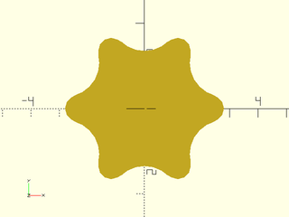

# LibFile: screw\_drive.scad

Recess masks for screw heads

To use, add the following lines to the beginning of your file:

    include <BOSL2/std.scad>
    include <BOSL2/screw_drive.scad>

## Table of Contents

1. [Section: Phillips Drive](#section-phillips-drive)
    - [`phillips_mask()`](#module-phillips_mask)
    - [`phillips_depth()`](#function-phillips_depth)
    - [`phillips_diam()`](#function-phillips_diam)

2. [Section: Torx Drive](#section-torx-drive)
    - [`torx_outer_diam()`](#function-torx_outer_diam)
    - [`torx_inner_diam()`](#function-torx_inner_diam)
    - [`torx_depth()`](#function-torx_depth)
    - [`torx_tip_radius()`](#function-torx_tip_radius)
    - [`torx_rounding_radius()`](#function-torx_rounding_radius)
    - [`torx_mask2d()`](#module-torx_mask2d)
    - [`torx_mask()`](#module-torx_mask)

3. [Section: Robertson/Square Drives](#section-robertsonsquare-drives)
    - [`robertson_mask()`](#module-robertson_mask)

## Section: Phillips Drive

### Module: phillips\_mask()

**Description:** 

Creates a mask for creating a Phillips drive recess given the Phillips size.  Each mask can
be lowered to different depths to create different sizes of recess.

**Arguments:** 

<abbr title="These args can be used by position or by name.">By&nbsp;Position</abbr> | What it does
-------------------- | ------------
`size`               | The size of the bit as an integer or string.  "#0", "#1", "#2", "#3", or "#4"

<abbr title="These args must be used by name, ie: name=value">By&nbsp;Name</abbr> | What it does
-------------------- | ------------
`anchor`             | Translate so anchor point is at origin (0,0,0).  See [anchor](attachments.scad#subsection-anchor).  Default: `CENTER`
`spin`               | Rotate this many degrees around the Z axis after anchor.  See [spin](attachments.scad#subsection-spin).  Default: `0`
`orient`             | Vector to rotate top towards, after spin.  See [orient](attachments.scad#subsection-orient).  Default: `UP`

**Example 1:** 

    include <BOSL2/std.scad>
    include <BOSL2/screw_drive.scad>
    xdistribute(10) {
       phillips_mask(size="#1");
       phillips_mask(size="#2");
       phillips_mask(size=3);
       phillips_mask(size=4);
    }

  

---

### Function: phillips\_depth()

**Usage:** 

- depth = phillips\_depth(size, d);

**Description:** 

Returns the depth of the Phillips recess required to produce the specified diameter, or
undef if not possible.

**Arguments:** 

<abbr title="These args can be used by position or by name.">By&nbsp;Position</abbr> | What it does
-------------------- | ------------
`size`               | size as a number or text string like "#2"
`d`                  | desired diameter

---

### Function: phillips\_diam()

**Usage:** 

- diam = phillips\_diam(size, depth);

**Description:** 

Returns the diameter at the top of the Phillips recess when constructed at the specified depth,
or undef if that depth is not valid.

**Arguments:** 

<abbr title="These args can be used by position or by name.">By&nbsp;Position</abbr> | What it does
-------------------- | ------------
`size`               | size as number or text string like "#2"
`depth`              | depth of recess to find the diameter of

---

## Section: Torx Drive

### Function: torx\_outer\_diam()

**Usage:** 

- diam = torx\_outer\_diam(size);

**Description:** 

Get the typical outer diameter of Torx profile.

**Arguments:** 

<abbr title="These args can be used by position or by name.">By&nbsp;Position</abbr> | What it does
-------------------- | ------------
`size`               | Torx size.

---

### Function: torx\_inner\_diam()

**Usage:** 

- diam = torx\_inner\_diam(size);

**Description:** 

Get typical inner diameter of Torx profile.

**Arguments:** 

<abbr title="These args can be used by position or by name.">By&nbsp;Position</abbr> | What it does
-------------------- | ------------
`size`               | Torx size.

---

### Function: torx\_depth()

**Usage:** 

- depth = torx\_depth(size);

**Description:** 

Gets typical drive hole depth.

**Arguments:** 

<abbr title="These args can be used by position or by name.">By&nbsp;Position</abbr> | What it does
-------------------- | ------------
`size`               | Torx size.

---

### Function: torx\_tip\_radius()

**Usage:** 

- rad = torx\_tip\_radius(size);

**Description:** 

Gets minor rounding radius of Torx profile.

**Arguments:** 

<abbr title="These args can be used by position or by name.">By&nbsp;Position</abbr> | What it does
-------------------- | ------------
`size`               | Torx size.

---

### Function: torx\_rounding\_radius()

**Usage:** 

- rad = torx\_rounding\_radius(size);

**Description:** 

Gets major rounding radius of Torx profile.

**Arguments:** 

<abbr title="These args can be used by position or by name.">By&nbsp;Position</abbr> | What it does
-------------------- | ------------
`size`               | Torx size.

---

### Module: torx\_mask2d()

**Usage:** 

- torx\_mask2d(size);

**Description:** 

Creates a torx bit 2D profile.

**Arguments:** 

<abbr title="These args can be used by position or by name.">By&nbsp;Position</abbr> | What it does
-------------------- | ------------
`size`               | Torx size.

**Example 1:** 

    include <BOSL2/std.scad>
    include <BOSL2/screw_drive.scad>
    torx_mask2d(size=30, $fa=1, $fs=1);

  

---

### Module: torx\_mask()

**Usage:** 

- torx\_mask(size, l, [center]);

**Description:** 

Creates a torx bit tip.

**Arguments:** 

<abbr title="These args can be used by position or by name.">By&nbsp;Position</abbr> | What it does
-------------------- | ------------
`size`               | Torx size.
`l`                  | Length of bit.
`center`             | If true, centers bit vertically.

<abbr title="These args must be used by name, ie: name=value">By&nbsp;Name</abbr> | What it does
-------------------- | ------------
`anchor`             | Translate so anchor point is at origin (0,0,0).  See [anchor](attachments.scad#subsection-anchor).  Default: `CENTER`
`spin`               | Rotate this many degrees around the Z axis after anchor.  See [spin](attachments.scad#subsection-spin).  Default: `0`
`orient`             | Vector to rotate top towards, after spin.  See [orient](attachments.scad#subsection-orient).  Default: `UP`

**Example 1:** 

    include <BOSL2/std.scad>
    include <BOSL2/screw_drive.scad>
    torx_mask(size=30, l=10, $fa=1, $fs=1);

  

---

## Section: Robertson/Square Drives

### Module: robertson\_mask()

**Usage:** 

- robertson\_mask(size, [extra]);

**Description:** 

Creates a mask for creating a Robertson/Square drive recess given the drive size as an integer.
The width of the recess will be oversized by `2 * $slop`.  Note that this model is based
on an incomplete spec.   https://www.aspenfasteners.com/content/pdf/square_drive_specification.pdf
We determined the angle by doing print tests on a Prusa MK3S with $slop set to 0.05.

**Arguments:** 

<abbr title="These args can be used by position or by name.">By&nbsp;Position</abbr> | What it does
-------------------- | ------------
`size`               | The size of the square drive, as an integer from 0 to 4.
`extra`              | Extra length of drive mask to create.
`ang`                | taper angle of each face.  Default: 2.5
`$slop`              | enlarge recess by this twice amount.  Default: 0

**Example 1:** 

    include <BOSL2/std.scad>
    include <BOSL2/screw_drive.scad>
    robertson_mask(size=2);

  

**Example 2:** 

    include <BOSL2/std.scad>
    include <BOSL2/screw_drive.scad>
    difference() {
        cyl(d1=2, d2=8, h=4, anchor=TOP);
        robertson_mask(size=2);
    }

  

---

