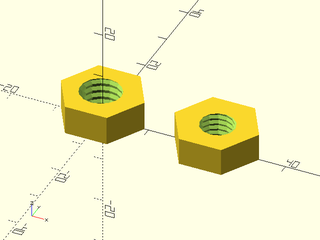

# LibFile: screws.scad

Functions and modules for creating metric and UTS standard screws and nuts.

To use, add the following lines to the beginning of your file:

    include <BOSL2/std.scad>
    include <BOSL2/screws.scad>

## Table of Contents

1. [Section: Generic Screw Creation](#section-generic-screw-creation)
    - [`screw_info()`](#function-screw_info)
    - [`screw_head()`](#module-screw_head)
    - [`screw()`](#module-screw)
    - [`thread_specification()`](#function-thread_specification)
    - [`nut()`](#module-nut)

## Section: Generic Screw Creation

### Function: screw\_info()

**Usage:** 

- info = screw\_info(name, [head], [thread], [drive], [drive\_size], [oversize])

**Description:** 

Look up screw characteristics for the specified screw type.

For metric (ISO) the `name=` argument is formatted in a string like: `"M<size>x<pitch>,<length>"`.
e.g. `"M6x1,10"` specifies a 6mm diameter screw with a thread pitch of 1mm and length of 10mm.
You can omit the pitch or length, e.g. `"M6x1"`, or `"M6,10"`, or just `"M6"`.

For English (UTS) `name=` is a string like `"<size>-<threadcount>,<length>"`.
e.g. `"#8-32,1/2"`, or `"1/4-20,1"`.  Units are in inches, including the length.  Size can be a
number from 0 to 12 with or without a leading `#` to specify a screw gauge size, or any other
value to specify a diameter in inches, either as a float or a fraction, so `"0.5-13"` and
`"1/2-13"` are equivalent.  To force interpretation of the value as inches add `''` (two
single-quotes) to the end, e.g. `"1''-4"` is a one inch screw and `"1-80"` is a very small
1-gauge screw.  The pitch is specified using a thread count, the number of threads per inch.
The length is in inches.

If you omit the pitch then a standard screw pitch will be supplied from lookup tables for the
screw diameter you have chosen.  For each screw diameter, multiple standard pitches are possible.
The available thread pitch types are:
- `"coarse"`
- `"fine"`
- `"extrafine"` or `"extra fine"`
- `"superfine"` or `"super fine"` (Metric/ISO only.)
- `"UNC"` (English/UTS only.  Same as `"coarse"`.)
- `"UNF"` (English/UTS only.  Same as `"fine"`.)
- `"UNEF"` (English/UTS only.  Same as `"extrafine"`.)

The default pitch selection is `"coarse"`.  Note that this selection is case insensitive.  Set the
`thread=` argument to one of these values to choose a different pitch.  Note that not every pitch
category is defined at every diameter.  You can also specify the thread pitch directly, for example
you could set `thread=2` which would produce threads with a pitch of 2mm.  The final option is to
specify `thread="none"` to produce an unthreaded screw either to simplify the model or to use for
cutting out screw holes.  Setting the pitch to `0` (zero) also produces an unthreaded screw.
If you specify a numeric thread value it will override any value given in the `name=` argument.

The `head=` parameter specifies the type of head the screw will have.  Options for the head are
`"flat"`, `"flat small"`, `"flat large"`, `"flat undercut"`, `"round"`, `"pan"`, `"pan flat"`,
`"pan round"`, `"socket"`, `"hex"`, `"button"`, `"cheese"`, `"fillister"`,  or `"none"`

Note that different sized flat heads exist for the same screw type.  Sometimes this depends on
the type of recess.  If you specify `"flat"` then the size will be chosen appropriately for the
recess you specify.  The default is `"none"`.

The `drive=` argument specifies the recess type.  Options for the drive are `"none"`, `"hex"`,
`"slot"`, `"phillips"`, `"ph0"` to `"ph4"` (for phillips of the specified size), `"torx"` or
`"t<size>"` (for Torx at a specified size, e.g. `"t20"`).  The default drive is `"none"`

Only some combinations of head and drive type are supported:

Head              | Drive
----------------- | ----------------------------
`"none"`          | hex, torx
`"hex"`           | *none*
`"socket"`        | hex, torx
`"button"`        | hex, torx
`"flat"`          | slot, phillips, hex, torx
`"round"`         | slot, phillips (UTS/English only.)
`"fillister"`     | slot, phillips (UTS/English only.)
`"flat small"`    | phillips, slot (UTS/English only.)
`"flat large"`    | hex, torx (UTS/English only.)
`"flat undercut"` | slot, phillips (UTS/English only.)
`"pan"`           | slot, phillips (ISO/Metric only.)
`"cheese"`        | slot, phillips (ISO/Metric only.)

The drive size is specified appropriately to the drive type: drive number for phillips or torx,
and allen width in mm or inches (as appropriate) for hex.  Drive size is determined automatically
from the screw size, but by passing the `drive_size=` argument you can override the default, or
in cases where no default exists you can specify it.

The `oversize=` parameter adds the specified amount to the screw and head diameter to make an
oversized screw.  This is intended for generating clearance holes, not for dealing with printer
inaccuracy.  Does not affect length, thread pitch or head height.

The output is a [[struct|structs.scad]] with the following fields:

Field              | What it is
------------------ | ---------------
`"system"`         | Either `"UTS"` or `"ISO"` (used for correct tolerance computation).
`"diameter"`       | The nominal diameter of the screw shaft in mm.
`"pitch"`          | The thread pitch in mm.
`"head"`           | The type of head (a string from the list above).
`"head_size"`      | Size of the head in mm.
`"head_angle"`     | Countersink angle for flat heads.
`"head_height"`    | Height of the head (when needed to specify the head).
`"drive"`          | The drive type (`"phillips"`, `"torx"`, `"slot"`, `"hex"`, `"none"`)
`"drive_size"`     | The drive size, either a drive number (phillips or torx) or a dimension in mm (hex).  Not defined for slot drive.
`"drive_diameter"` | Diameter of a phillips drive.
`"drive_width"`    | Width of the arms of the cross in a phillips drive or the slot for a slot drive.
`"drive_depth"`    | Depth of the drive recess.
`"length"`         | Length of the screw in mm measured in the customary fashion.  For flat head screws the total length and for other screws, the length from the bottom of the head to the screw tip.

**Arguments:** 

<abbr title="These args can be used by position or by name.">By&nbsp;Position</abbr> | What it does
-------------------- | ------------
`name`               | screw specification, e.g. "M5x1" or "#8-32"
`head`               | head type (see list above).  Default: none
`thread`             | thread type or specification.  Default: "coarse"
`drive`              | drive type.  Default: none
`drive_size`         | size of drive recess to override computed value
`oversize`           | amount to increase screw diameter for clearance holes.  Default: 0

---

### Module: screw\_head()

**Usage:** 

- screw\_head(screw\_info, [details])

**Description:** 

Draws the screw head described by the data structure `screw_info`, which
should have the fields produced by `screw_info()`.  See that function for
details on the fields.  Standard orientation is with the head centered at (0,0)
and oriented in the +z direction.  Flat heads appear below the xy plane.
Other heads appear sitting on the xy plane.

---

### Module: screw()

**Usage:** 

- screw([name],[head],[thread],[drive],[drive\_size], [length], [shank], [oversize], [tolerance], [$slop], [spec], [details], [anchor], [anchor\_head], [orient], [spin])

**Description:** 

Create a screw.

Most of these parameters are described in the entry for `screw_info()`.

The tolerance determines the actual thread sizing based on the
nominal size.  For UTS threads it is either "1A", "2A" or "3A", in
order of increasing tightness.  The default tolerance is "2A", which
is the general standard for manufactured bolts.  For ISO the tolerance
has the form of a number and letter.  The letter specifies the "fundamental deviation", also called the "tolerance position", the gap
from the nominal size, and must be "e", "f", "g", or "h", where "e" is
the loosest and "h" means no gap.  The number specifies the allowed
range (variability) of the thread heights.  It must be a value from
3-9 for crest diameter and one of 4, 6, or 8 for pitch diameter.  A
tolerance "6g" specifies both pitch and crest diameter to be the same,
but they can be different, with a tolerance like "5g6g" specifies a pitch diameter tolerance of "5g" and a crest diameter tolerance of "6g".
Smaller numbers give a tighter tolerance.  The default ISO tolerance is "6g".

The $slop argument gives an extra gap to account for printing overextrusion. It defaults to 0.2.

**Arguments:** 

<abbr title="These args can be used by position or by name.">By&nbsp;Position</abbr> | What it does
-------------------- | ------------
`name`               | screw specification, e.g. "M5x1" or "#8-32"
`head`               | head type (see list above).  Default: none
`thread`             | thread type or specification.  Default: "coarse"
`drive`              | drive type.  Default: none
`drive_size`         | size of drive recess to override computed value
`oversize`           | amount to increase screw diameter for clearance holes.  Default: 0
`spec`               | screw specification from `screw_info()`.  If you specify this you can omit all the preceeding parameters.
`length`             | length of screw (in mm)
`shank`              | length of unthreaded portion of screw (in mm).  Default: 0
`details`            | toggle some details in rendering.  Default: false
`tolerance`          | screw tolerance.  Determines actual screw thread geometry based on nominal sizing.  Default is "2A" for UTS and "6g" for ISO.
`$slop`              | add extra gap to account for printer overextrusion.  Default: 0.2
`anchor`             | anchor relative to the shaft of the screw
`anchor_head`        | anchor relative to the screw head

**Example 1:** Selected UTS (English) screws

 

    include <BOSL2/std.scad>
    include <BOSL2/screws.scad>
    $fn=32;
    xdistribute(spacing=8){
      screw("#6", length=12);
      screw("#6-32", head="button", drive="torx",length=12);
      screw("#6-32,3/4", head="hex");
      screw("#6", thread="fine", head="fillister",length=12, drive="phillips");
      screw("#6", head="flat small",length=12,drive="slot");
      screw("#6-32", head="flat large", length=12, drive="torx");
      screw("#6-32", head="flat undercut",length=12);
      screw("#6-24", head="socket",length=12);          // Non-standard threading
      screw("#6-32", drive="hex", drive_size=1.5, length=12);
    }

**Example 2:** A few examples of ISO (metric) screws

 

    include <BOSL2/std.scad>
    include <BOSL2/screws.scad>
    $fn=32;
    xdistribute(spacing=8){
      screw("M3", head="flat small",length=12);
      screw("M3", head="button",drive="torx",length=12);
      screw("M3", head="pan", drive="phillips",length=12);
      screw("M3x1", head="pan", drive="slot",length=12);   // Non-standard threading!
      screw("M3", head="flat large",length=12);
      screw("M3", thread="none", head="flat", drive="hex",length=12);  // No threads
      screw("M3", head="socket",length=12);
      screw("M5", head="hex", length=12);
    }

**Example 3:** Demonstration of all head types for UTS screws (using pitch zero for fast preview)

 

    include <BOSL2/std.scad>
    include <BOSL2/screws.scad>
    xdistribute(spacing=15){
      ydistribute(spacing=15){
         screw("1/4", thread=0,length=8, anchor=TOP, head="none", drive="hex");
         screw("1/4", thread=0,length=8, anchor=TOP, head="none", drive="torx");
         screw("1/4", thread=0,length=8, anchor=TOP, head="none");
      }
      screw("1/4", thread=0, length=8, anchor=TOP, head="hex");
      ydistribute(spacing=15){
         screw("1/4", thread=0,length=8, anchor=TOP, head="socket", drive="hex");
         screw("1/4", thread=0,length=8, anchor=TOP, head="socket", drive="torx");
         screw("1/4", thread=0,length=8, anchor=TOP, head="socket");
      }
      ydistribute(spacing=15){
         screw("1/4", thread=0,length=8, anchor=TOP, head="button", drive="hex");
         screw("1/4", thread=0,length=8, anchor=TOP, head="button", drive="torx");
         screw("1/4", thread=0,length=8, anchor=TOP, head="button");
      }
      ydistribute(spacing=15){
         screw("1/4", thread=0,length=8, anchor=TOP, head="round", drive="slot");
         screw("1/4", thread=0,length=8, anchor=TOP, head="round", drive="phillips");
         screw("1/4", thread=0,length=8, anchor=TOP, head="round");
      }
      ydistribute(spacing=15){
         screw("1/4", thread=0,length=8, anchor=TOP, head="fillister", drive="slot");
         screw("1/4", thread=0,length=8, anchor=TOP, head="fillister", drive="phillips");
         screw("1/4", thread=0,length=8, anchor=TOP, head="fillister");
      }
      ydistribute(spacing=15){
         screw("1/4", thread=0,length=8, anchor=TOP, head="flat", drive="slot");
         screw("1/4", thread=0,length=8, anchor=TOP, head="flat", drive="phillips");
         screw("1/4", thread=0,length=8, anchor=TOP, head="flat", drive="hex");
         screw("1/4", thread=0,length=8, anchor=TOP, head="flat", drive="torx");
         screw("1/4", thread=0,length=8, anchor=TOP, head="flat large");
         screw("1/4", thread=0,length=8, anchor=TOP, head="flat small");
      }
      ydistribute(spacing=15){
         screw("1/4", thread=0,length=8, anchor=TOP, head="flat undercut", drive="slot");
         screw("1/4", thread=0,length=8, anchor=TOP, head="flat undercut", drive="phillips");
         screw("1/4", thread=0,length=8, anchor=TOP, head="flat undercut");
      }
    }

**Example 4:** Demonstration of all head types for metric screws without threading.

 

    include <BOSL2/std.scad>
    include <BOSL2/screws.scad>
    xdistribute(spacing=15){
      ydistribute(spacing=15){
        screw("M6x0", length=8, anchor=TOP,  head="none", drive="hex");
        screw("M6x0", length=8, anchor=TOP,  head="none", drive="torx");
        screw("M6x0", length=8, anchor=TOP);
      }
      screw("M6x0", length=8, anchor=TOP,  head="hex");
      ydistribute(spacing=15){
        screw("M6x0", length=8, anchor=TOP,  head="socket", drive="hex");
        screw("M6x0", length=8, anchor=TOP,  head="socket", drive="torx");
        screw("M6x0", length=8, anchor=TOP,  head="socket");
      }
      ydistribute(spacing=15){
        screw("M6x0", length=8, anchor=TOP,  head="pan", drive="slot");
        screw("M6x0", length=8, anchor=TOP,  head="pan", drive="phillips");
        screw("M6x0", length=8, anchor=TOP,  head="pan");
        screw("M6x0", length=8, anchor=TOP,  head="pan flat");
      }
      ydistribute(spacing=15){
        screw("M6x0", length=8, anchor=TOP,  head="button", drive="hex");
        screw("M6x0", length=8, anchor=TOP,  head="button", drive="torx");
        screw("M6x0", length=8, anchor=TOP,  head="button");
      }
      ydistribute(spacing=15){
        screw("M6x0", length=8, anchor=TOP,  head="cheese", drive="slot");
        screw("M6x0", length=8, anchor=TOP,  head="cheese", drive="phillips");
        screw("M6x0", length=8, anchor=TOP,  head="cheese");
      }
      ydistribute(spacing=15){
        screw("M6x0", length=8, anchor=TOP,  head="flat", drive="phillips");
        screw("M6x0", length=8, anchor=TOP,  head="flat", drive="slot");
        screw("M6x0", length=8, anchor=TOP,  head="flat", drive="hex");
        screw("M6x0", length=8, anchor=TOP,  head="flat", drive="torx");
        screw("M6x0", length=8, anchor=TOP,  head="flat small");
        screw("M6x0", length=8, anchor=TOP,  head="flat large");
      }
    }

**Example 5:** The three different English (UTS) screw tolerances

 

    include <BOSL2/std.scad>
    include <BOSL2/screws.scad>
    module label(val)
    {
      difference(){
         children();
         yflip()linear_extrude(height=.35) text(val,valign="center",halign="center",size=8);
      }
    }
    $fn=64;
    xdistribute(spacing=15){
      label("1") screw("1/4-20,5/8", head="hex",orient=DOWN,anchor_head=TOP,tolerance="1A");  // Loose
      label("2") screw("1/4-20,5/8", head="hex",orient=DOWN,anchor_head=TOP,tolerance="2A");  // Standard
      label("3") screw("1/4-20,5/8", head="hex",orient=DOWN,anchor_head=TOP,tolerance="3A");  // Tight
    }

**Example 6:** This example shows the gap between nut and bolt at the loosest tolerance for UTS.  This gap is what enables the parts to mesh without binding and is part of the definition for standard metal hardware.

 

    include <BOSL2/std.scad>
    include <BOSL2/screws.scad>
    $slop=0;
    $fn=32;
    projection(cut=true)xrot(-90){
        screw("1/4-20,1/4", head="hex",orient=UP,anchor=BOTTOM,tolerance="1A");
        down(INCH*1/20*2.58) nut("1/4-20", thickness=8, diameter=0.5*INCH,tolerance="1B");
    }

---

### Function: thread\_specification()

**Usage:** 

- thread\_specification(screw\_spec, [tolerance], [internal])

**Description:** 

Determines actual thread geometry for a given screw with specified tolerance.  If tolerance is omitted the default is used.  If tolerance
is "none" or 0 then return the nominal thread geometry.

The return value is a structure with the following fields:
- pitch: the thread pitch
- d_major: major diameter range
- d_pitch: pitch diameter range
- d_minor: minor diameter range
- basic: vector `[minor, pitch, major]` of the nominal or "basic" diameters for the threads

---

### Module: nut()

**Usage:** 

- nut([name],diameter, thickness,[thread],[oversize],[spec],[tolerance],[details],[$slop])

**Description:** 

Generates a hexagonal nut.
The name, thread and oversize parameters are described under `screw_info()`.  As for screws,
you can give the specification in `spec` and then omit the name.  The diameter is the flat-to-flat
size of the nut produced.

The tolerance determines the actual thread sizing based on the
nominal size.
For UTS threads the tolerance is either "1B", "2B" or "3B", in
order of increasing tightness.  The default tolerance is "2B", which
is the general standard for manufactured nuts.  For ISO the tolerance
has the form of a number and letter.  The letter specifies the "fundamental deviation", also called the "tolerance position", the gap
from the nominal size, and must be "G", or "H", where "G" is looser
he loosest and "H" means no gap.  The number specifies the allowed
range (variability) of the thread heights.  Smaller  numbers give tigher tolerances.  It must be a value from
4-8, so an allowed (loose) tolerance is "7G".  The default ISO tolerance is "6H".

The $slop parameter determines extra gaps left to account for printing overextrusion.  It defaults to 0.

**Arguments:** 

<abbr title="These args can be used by position or by name.">By&nbsp;Position</abbr> | What it does
-------------------- | ------------
`name`               | screw specification, e.g. "M5x1" or "#8-32"
`diameter`           | outside diameter of nut (flat to flat dimension)
`thickness`          | thickness of nut (in mm)

<abbr title="These args must be used by name, ie: name=value">By&nbsp;Name</abbr> | What it does
-------------------- | ------------
`thread`             | thread type or specification.  Default: "coarse"
`oversize`           | amount to increase screw diameter for clearance holes.  Default: 0
`spec`               | screw specification from `screw_info()`.  If you specify this you can omit all the preceeding parameters.
`bevel`              | bevel the nut.  Default: false
`tolerance`          | nut tolerance.  Determines actual nut thread geometry based on nominal sizing.  Default is "2B" for UTS and "6H" for ISO.
`$slop`              | extra space left to account for printing over-extrusion.  Default: 0

**Example 1:** A metric and UTS nut

    include <BOSL2/std.scad>
    include <BOSL2/screws.scad>
    nut("3/8", 5/8*INCH, 1/4*INCH);
    right(25)
       nut("M8", 16, 6);

  

**Example 2:** The three different UTS nut tolerances

 

    include <BOSL2/std.scad>
    include <BOSL2/screws.scad>
    module mark(number)
    {
      difference(){
         children();
         ycopies(n=number, spacing=1.5)right(.25*INCH-2)up(8-.35)cyl(d=1, h=1);
      }
    }
    $fn=64;
    xdistribute(spacing=17){
      mark(1) nut("1/4-20", thickness=8, diameter=0.5*INCH,tolerance="1B");
      mark(2) nut("1/4-20", thickness=8, diameter=0.5*INCH,tolerance="2B");
      mark(3) nut("1/4-20", thickness=8, diameter=0.5*INCH,tolerance="3B");
    }

---

