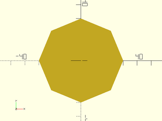
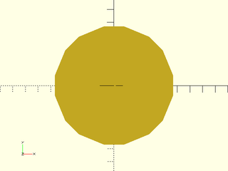
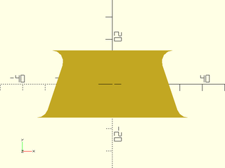
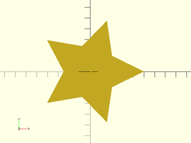
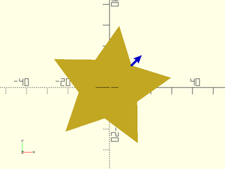
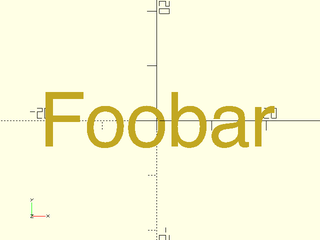

# LibFile: shapes2d.scad

This file includes redefinitions of the core modules to
work with attachment, and functional forms of those modules
that produce paths.  You can create regular polygons
with optional rounded corners and alignment features not
available with circle().  The file also provides teardrop2d,
which is useful for 3D printable holes.
Many of the commands have module forms that produce geometry and
function forms that produce a path.

To use, add the following lines to the beginning of your file:

    include <BOSL2/std.scad>

## Table of Contents

1. [Section: 2D Primitives](#section-2d-primitives)
    - [`square()`](#functionmodule-square)
    - [`rect()`](#functionmodule-rect)
    - [`circle()`](#functionmodule-circle)
    - [`ellipse()`](#functionmodule-ellipse)

2. [Section: Polygons](#section-polygons)
    - [`regular_ngon()`](#functionmodule-regular_ngon)
    - [`pentagon()`](#functionmodule-pentagon)
    - [`hexagon()`](#functionmodule-hexagon)
    - [`octagon()`](#functionmodule-octagon)
    - [`right_triangle()`](#functionmodule-right_triangle)
    - [`trapezoid()`](#functionmodule-trapezoid)
    - [`star()`](#functionmodule-star)
    - [`jittered_poly()`](#module-jittered_poly)

3. [Section: Curved 2D Shapes](#section-curved-2d-shapes)
    - [`teardrop2d()`](#functionmodule-teardrop2d)
    - [`egg()`](#functionmodule-egg)
    - [`glued_circles()`](#functionmodule-glued_circles)
    - [`supershape()`](#functionmodule-supershape)
    - [`reuleaux_polygon()`](#functionmodule-reuleaux_polygon)

4. [Section: Text](#section-text)
    - [`text()`](#module-text)

5. [Section: Rounding 2D shapes](#section-rounding-2d-shapes)
    - [`round2d()`](#module-round2d)
    - [`shell2d()`](#module-shell2d)

## Section: 2D Primitives

### Function/Module: square()

**Topics:** [Shapes (2D)](Topics#shapes-2d), [Path Generators (2D)](Topics#path-generators-2d)

**Usage:** As a Module

- square(size, [center], ...);

**Usage:** With Attachments

- square(size, [center], ...) { attachables }

**Usage:** As a Function

- path = square(size, [center], ...);

**Description:** 

When called as the builtin module, creates a 2D square or rectangle of the given size.
When called as a function, returns a 2D path/list of points for a square/rectangle of the given size.

**Arguments:** 

<abbr title="These args can be used by position or by name.">By&nbsp;Position</abbr> | What it does
-------------------- | ------------
`size`               | The size of the square to create.  If given as a scalar, both X and Y will be the same size.
`center`             | If given and true, overrides `anchor` to be `CENTER`.  If given and false, overrides `anchor` to be `FRONT+LEFT`.

<abbr title="These args must be used by name, ie: name=value">By&nbsp;Name</abbr> | What it does
-------------------- | ------------
`anchor`             | Translate so anchor point is at origin (0,0,0).  See [anchor](attachments.scad#subsection-anchor).  Default: `CENTER`
`spin`               | Rotate this many degrees around the Z axis after anchor.  See [spin](attachments.scad#subsection-spin).  Default: `0`

**See Also:** [rect()](#functionmodule-rect)

**Example 1:** 

    include <BOSL2/std.scad>
    square(40);

  

**Example 2:** Centered

    include <BOSL2/std.scad>
    square([40,30], center=true);

  

**Example 3:** Called as Function

    include <BOSL2/std.scad>
    path = square([40,30], anchor=FRONT, spin=30);
    stroke(path, closed=true);
    move_copies(path) color("blue") circle(d=2,$fn=8);

  

---

### Function/Module: rect()

**Usage:** As Module

- rect(size, [rounding], [chamfer], ...);

**Usage:** With Attachments

- rect(size, ...) { attachables }

**Usage:** As Function

- path = rect(size, [rounding], [chamfer], ...);

**Topics:** [Shapes (2D)](Topics#shapes-2d), [Paths (2D)](Topics#paths-2d), [Path Generators](Topics#path-generators), [Attachable](Topics#attachable)

**Description:** 

When called as a module, creates a 2D rectangle of the given size, with optional rounding or chamfering.
When called as a function, returns a 2D path/list of points for a square/rectangle of the given size.

**Arguments:** 

<abbr title="These args can be used by position or by name.">By&nbsp;Position</abbr> | What it does
-------------------- | ------------
`size`               | The size of the rectangle to create.  If given as a scalar, both X and Y will be the same size.
`rounding`           | The rounding radius for the corners.  If negative, produces external roundover spikes on the X axis. If given as a list of four numbers, gives individual radii for each corner, in the order [X+Y+,X-Y+,X-Y-,X+Y-]. Default: 0 (no rounding)
`chamfer`            | The chamfer size for the corners.  If negative, produces external chamfer spikes on the X axis. If given as a list of four numbers, gives individual chamfers for each corner, in the order [X+Y+,X-Y+,X-Y-,X+Y-].  Default: 0 (no chamfer)
`anchor`             | Translate so anchor point is at origin (0,0,0).  See [anchor](attachments.scad#subsection-anchor).  Default: `CENTER`
`spin`               | Rotate this many degrees around the Z axis after anchor.  See [spin](attachments.scad#subsection-spin).  Default: `0`

**See Also:** [square()](#functionmodule-square)

**Example 1:** 

    include <BOSL2/std.scad>
    rect(40);

  

**Example 2:** Anchored

    include <BOSL2/std.scad>
    rect([40,30], anchor=FRONT);

  

**Example 3:** Spun

    include <BOSL2/std.scad>
    rect([40,30], anchor=FRONT, spin=30);

  

**Example 4:** Chamferred Rect

    include <BOSL2/std.scad>
    rect([40,30], chamfer=5);

  

**Example 5:** Rounded Rect

    include <BOSL2/std.scad>
    rect([40,30], rounding=5);

  

**Example 6:** Negative-Chamferred Rect

    include <BOSL2/std.scad>
    rect([40,30], chamfer=-5);

  

**Example 7:** Negative-Rounded Rect

    include <BOSL2/std.scad>
    rect([40,30], rounding=-5);

  

**Example 8:** Mixed Chamferring and Rounding

 

    include <BOSL2/std.scad>
    rect([40,30],rounding=[5,0,10,0],chamfer=[0,8,0,15],$fa=1,$fs=1);

**Example 9:** Called as Function

    include <BOSL2/std.scad>
    path = rect([40,30], chamfer=5, anchor=FRONT, spin=30);
    stroke(path, closed=true);
    move_copies(path) color("blue") circle(d=2,$fn=8);

  

---

### Function/Module: circle()

**Topics:** [Shapes (2D)](Topics#shapes-2d), [Path Generators (2D)](Topics#path-generators-2d)

**Usage:** As a Module

- circle(r|d=, ...);

**Usage:** With Attachments

- circle(r|d=, ...) { attachables }

**Usage:** As a Function

- path = circle(r|d=, ...);

**Description:** 

When called as the builtin module, creates a 2D polygon that approximates a circle of the given size.
When called as a function, returns a 2D list of points (path) for a polygon that approximates a circle of the given size.

**Arguments:** 

<abbr title="These args can be used by position or by name.">By&nbsp;Position</abbr> | What it does
-------------------- | ------------
`r`                  | The radius of the circle to create.
`d`                  | The diameter of the circle to create.

<abbr title="These args must be used by name, ie: name=value">By&nbsp;Name</abbr> | What it does
-------------------- | ------------
`anchor`             | Translate so anchor point is at origin (0,0,0).  See [anchor](attachments.scad#subsection-anchor).  Default: `CENTER`
`spin`               | Rotate this many degrees around the Z axis after anchor.  See [spin](attachments.scad#subsection-spin).  Default: `0`

**See Also:** [ellipse()](#functionmodule-ellipse), [circle\_2tangents()](geometry.scad#functionmodule-circle_2tangents), [circle\_3points()](geometry.scad#functionmodule-circle_3points)

**Example 1:** By Radius

    include <BOSL2/std.scad>
    circle(r=25);

  

**Example 2:** By Diameter

    include <BOSL2/std.scad>
    circle(d=50);

  

**Example 3:** Called as Function

    include <BOSL2/std.scad>
    path = circle(d=50, anchor=FRONT, spin=45);

  

---

### Function/Module: ellipse()

**Usage:** As a Module

- ellipse(r|d=, [realign=], [circum=], ...);

**Usage:** With Attachments

- ellipse(r|d=, [realign=], [circum=], ...) { attachables }

**Usage:** As a Function

- path = ellipse(r|d=, [realign=], [circum=], ...);

**Topics:** [Shapes (2D)](Topics#shapes-2d), [Paths (2D)](Topics#paths-2d), [Path Generators](Topics#path-generators), [Attachable](Topics#attachable)

**Description:** 

When called as a module, creates a 2D polygon that approximates a circle or ellipse of the given size.
When called as a function, returns a 2D list of points (path) for a polygon that approximates a circle or ellipse of the given size.
By default the point list or shape is the same as the one you would get by scaling the output of [`circle()`](#functionmodule-circle), but with this module your
attachments to the ellipse will retain their dimensions, whereas scaling a circle with attachments will also scale the attachments.
If you set unifom to true then you will get a polygon with congruent sides whose vertices lie on the ellipse.

**Arguments:** 

<abbr title="These args can be used by position or by name.">By&nbsp;Position</abbr> | What it does
-------------------- | ------------
`r`                  | Radius of the circle or pair of semiaxes of ellipse

<abbr title="These args must be used by name, ie: name=value">By&nbsp;Name</abbr> | What it does
-------------------- | ------------
`d`                  | Diameter of the circle or a pair giving the full X and Y axis lengths.
`realign`            | If false starts the approximate ellipse with a point on the X+ axis.  If true the midpoint of a side is on the X+ axis and the first point of the polygon is below the X+ axis.  This can result in a very different polygon when $fn is small.  Default: false
`circum`             | If true, the polygon that approximates the circle will be upsized slightly to circumscribe the theoretical circle.  If false, it inscribes the theoretical circle.  Default: false
`anchor`             | Translate so anchor point is at origin (0,0,0).  See [anchor](attachments.scad#subsection-anchor).  Default: `CENTER`
`spin`               | Rotate this many degrees around the Z axis after anchor.  See [spin](attachments.scad#subsection-spin).  Default: `0`

**See Also:** [circle()](#functionmodule-circle), [circle\_2tangents()](geometry.scad#functionmodule-circle_2tangents), [circle\_3points()](geometry.scad#functionmodule-circle_3points)

**Example 1:** By Radius

    include <BOSL2/std.scad>
    ellipse(r=25);

  

**Example 2:** By Diameter

    include <BOSL2/std.scad>
    ellipse(d=50);

  

**Example 3:** Anchoring

    include <BOSL2/std.scad>
    ellipse(d=50, anchor=FRONT);

  

**Example 4:** Spin

    include <BOSL2/std.scad>
    ellipse(d=50, anchor=FRONT, spin=45);

  

**Example 5:** Called as Function

    include <BOSL2/std.scad>
    path = ellipse(d=50, anchor=FRONT, spin=45);

  

**Example 6:** Uniformly sampled hexagon at the top, regular non-uniform one at the bottom

 

    include <BOSL2/std.scad>
    r=[10,3];
    ydistribute(7){
      union(){
        stroke([ellipse(r=r, $fn=100)],width=0.05,color="blue");
        stroke([ellipse(r=r, $fn=6)],width=0.1,color="red");
      }
      union(){
        stroke([ellipse(r=r, $fn=100)],width=0.05,color="blue");
        stroke([ellipse(r=r, $fn=6,uniform=true)],width=0.1,color="red");
      }
    }

**Example 7:** The realigned hexagons are even more different

 

    include <BOSL2/std.scad>
    r=[10,3];
    ydistribute(7){
      union(){
        stroke([ellipse(r=r, $fn=100)],width=0.05,color="blue");
        stroke([ellipse(r=r, $fn=6,realign=true)],width=0.1,color="red");
      }
      union(){
        stroke([ellipse(r=r, $fn=100)],width=0.05,color="blue");
        stroke([ellipse(r=r, $fn=6,realign=true,uniform=true)],width=0.1,color="red");
      }
    }

**Example 8:** For odd $fn the result may not look very elliptical:

 

    include <BOSL2/std.scad>
    r=[10,3];
    ydistribute(7){
      union(){
        stroke([ellipse(r=r, $fn=100)],width=0.05,color="blue");
        stroke([ellipse(r=r, $fn=5,realign=false)],width=0.1,color="red");
      }
      union(){
        stroke([ellipse(r=r, $fn=100)],width=0.05,color="blue");
        stroke([ellipse(r=r, $fn=5,realign=false,uniform=true)],width=0.1,color="red");
      }
    }

**Example 9:** The same ellipse, turned 90 deg, gives a very different result:

 

    include <BOSL2/std.scad>
    r=[3,10];
    xdistribute(7){
      union(){
        stroke([ellipse(r=r, $fn=100)],width=0.1,color="blue");
        stroke([ellipse(r=r, $fn=5,realign=false)],width=0.2,color="red");
      }
      union(){
        stroke([ellipse(r=r, $fn=100)],width=0.1,color="blue");
        stroke([ellipse(r=r, $fn=5,realign=false,uniform=true)],width=0.2,color="red");
      }
    }

---

## Section: Polygons

### Function/Module: regular\_ngon()

**Usage:** 

- regular\_ngon(n, r/d=/or=/od=, [realign=]);
- regular\_ngon(n, ir=/id=, [realign=]);
- regular\_ngon(n, side=, [realign=]);

**Topics:** [Shapes (2D)](Topics#shapes-2d), [Paths (2D)](Topics#paths-2d), [Path Generators](Topics#path-generators), [Attachable](Topics#attachable)

**Description:** 

When called as a function, returns a 2D path for a regular N-sided polygon.
When called as a module, creates a 2D regular N-sided polygon.

**Arguments:** 

<abbr title="These args can be used by position or by name.">By&nbsp;Position</abbr> | What it does
-------------------- | ------------
`n`                  | The number of sides.
`r`                  / `or`                 | Outside radius, at points.

<abbr title="These args must be used by name, ie: name=value">By&nbsp;Name</abbr> | What it does
-------------------- | ------------
`d`                  / `od`                 | Outside diameter, at points.
`ir`                 | Inside radius, at center of sides.
`id`                 | Inside diameter, at center of sides.
`side`               | Length of each side.
`rounding`           | Radius of rounding for the tips of the polygon.  Default: 0 (no rounding)
`realign`            | If false, vertex 0 will lie on the X+ axis.  If true then the midpoint of the last edge will lie on the X+ axis, and vertex 0 will be below the X axis.    Default: false
`align_tip`          | If given as a 2D vector, rotates the whole shape so that the first vertex points in that direction.  This occurs before spin.
`align_side`         | If given as a 2D vector, rotates the whole shape so that the normal of side0 points in that direction.  This occurs before spin.
`anchor`             | Translate so anchor point is at origin (0,0,0).  See [anchor](attachments.scad#subsection-anchor).  Default: `CENTER`
`spin`               | Rotate this many degrees around the Z axis after anchor.  See [spin](attachments.scad#subsection-spin).  Default: `0`

**Extra Anchors:** 

Anchor Name | Position
----------- | --------
"tip0", "tip1", etc. | Each tip has an anchor, pointing outwards.
"side0", "side1", etc. | The center of each side has an anchor, pointing outwards.

**See Also:** [circle()](#functionmodule-circle), [pentagon()](#functionmodule-pentagon), [hexagon()](#functionmodule-hexagon), [octagon()](#functionmodule-octagon), [ellipse()](#functionmodule-ellipse), [star()](#functionmodule-star)

**Example 1:** by Outer Size

    include <BOSL2/std.scad>
    regular_ngon(n=5, or=30);
    regular_ngon(n=5, od=60);

  

**Example 2:** by Inner Size

    include <BOSL2/std.scad>
    regular_ngon(n=5, ir=30);
    regular_ngon(n=5, id=60);

  

**Example 3:** by Side Length

    include <BOSL2/std.scad>
    regular_ngon(n=8, side=20);

  

**Example 4:** Realigned

    include <BOSL2/std.scad>
    regular_ngon(n=8, side=20, realign=true);

  

**Example 5:** Alignment by Tip

    include <BOSL2/std.scad>
    regular_ngon(n=5, r=30, align_tip=BACK+RIGHT)
        attach("tip0", FWD) color("blue")
            stroke([[0,0],[0,7]], endcap2="arrow2");

  

**Example 6:** Alignment by Side

    include <BOSL2/std.scad>
    regular_ngon(n=5, r=30, align_side=BACK+RIGHT)
        attach("side0", FWD) color("blue")
            stroke([[0,0],[0,7]], endcap2="arrow2");

  

**Example 7:** Rounded

    include <BOSL2/std.scad>
    regular_ngon(n=5, od=100, rounding=20, $fn=20);

  

**Example 8:** Called as Function

    include <BOSL2/std.scad>
    stroke(closed=true, regular_ngon(n=6, or=30));

  

---

### Function/Module: pentagon()

**Usage:** 

- pentagon(or|od=, [realign=]);
- pentagon(ir=|id=, [realign=]);
- pentagon(side=, [realign=]);

**Topics:** [Shapes (2D)](Topics#shapes-2d), [Paths (2D)](Topics#paths-2d), [Path Generators](Topics#path-generators), [Attachable](Topics#attachable)

**Description:** 

When called as a function, returns a 2D path for a regular pentagon.
When called as a module, creates a 2D regular pentagon.

**Arguments:** 

<abbr title="These args can be used by position or by name.">By&nbsp;Position</abbr> | What it does
-------------------- | ------------
`r`                  / `or`                 | Outside radius, at points.

<abbr title="These args must be used by name, ie: name=value">By&nbsp;Name</abbr> | What it does
-------------------- | ------------
`d`                  / `od`                 | Outside diameter, at points.
`ir`                 | Inside radius, at center of sides.
`id`                 | Inside diameter, at center of sides.
`side`               | Length of each side.
`rounding`           | Radius of rounding for the tips of the polygon.  Default: 0 (no rounding)
`realign`            | If false, vertex 0 will lie on the X+ axis.  If true then the midpoint of the last edge will lie on the X+ axis, and vertex 0 will be below the X axis.    Default: false
`align_tip`          | If given as a 2D vector, rotates the whole shape so that the first vertex points in that direction.  This occurs before spin.
`align_side`         | If given as a 2D vector, rotates the whole shape so that the normal of side0 points in that direction.  This occurs before spin.
`anchor`             | Translate so anchor point is at origin (0,0,0).  See [anchor](attachments.scad#subsection-anchor).  Default: `CENTER`
`spin`               | Rotate this many degrees around the Z axis after anchor.  See [spin](attachments.scad#subsection-spin).  Default: `0`

**Extra Anchors:** 

Anchor Name | Position
----------- | --------
"tip0" ... "tip4" | Each tip has an anchor, pointing outwards.
"side0" ... "side4" | The center of each side has an anchor, pointing outwards.

**See Also:** [circle()](#functionmodule-circle), [regular\_ngon()](#functionmodule-regular_ngon), [hexagon()](#functionmodule-hexagon), [octagon()](#functionmodule-octagon), [ellipse()](#functionmodule-ellipse), [star()](#functionmodule-star)

**Example 1:** by Outer Size

    include <BOSL2/std.scad>
    pentagon(or=30);
    pentagon(od=60);

  

**Example 2:** by Inner Size

    include <BOSL2/std.scad>
    pentagon(ir=30);
    pentagon(id=60);

  

**Example 3:** by Side Length

    include <BOSL2/std.scad>
    pentagon(side=20);

  

**Example 4:** Realigned

    include <BOSL2/std.scad>
    pentagon(side=20, realign=true);

  

**Example 5:** Alignment by Tip

    include <BOSL2/std.scad>
    pentagon(r=30, align_tip=BACK+RIGHT)
        attach("tip0", FWD) color("blue")
            stroke([[0,0],[0,7]], endcap2="arrow2");

  

**Example 6:** Alignment by Side

    include <BOSL2/std.scad>
    pentagon(r=30, align_side=BACK+RIGHT)
        attach("side0", FWD) color("blue")
            stroke([[0,0],[0,7]], endcap2="arrow2");

  

**Example 7:** Rounded

    include <BOSL2/std.scad>
    pentagon(od=100, rounding=20, $fn=20);

  

**Example 8:** Called as Function

    include <BOSL2/std.scad>
    stroke(closed=true, pentagon(or=30));

  

---

### Function/Module: hexagon()

**Usage:** As Module

- hexagon(r/or, [realign=], &lt;align\_tip=|align\_side=&gt;, [rounding=], ...);
- hexagon(d=/od=, ...);
- hexagon(ir=/id=, ...);
- hexagon(side=, ...);

**Usage:** With Attachments

- hexagon(r/or, ...) { attachments }

**Usage:** As Function

- path = hexagon(r/or, ...);
- path = hexagon(d=/od=, ...);
- path = hexagon(ir=/id=, ...);
- path = hexagon(side=, ...);

**Topics:** [Shapes (2D)](Topics#shapes-2d), [Paths (2D)](Topics#paths-2d), [Path Generators](Topics#path-generators), [Attachable](Topics#attachable)

**Description:** 

When called as a function, returns a 2D path for a regular hexagon.
When called as a module, creates a 2D regular hexagon.

**Arguments:** 

<abbr title="These args can be used by position or by name.">By&nbsp;Position</abbr> | What it does
-------------------- | ------------
`r`                  / `or`                 | Outside radius, at points.

<abbr title="These args must be used by name, ie: name=value">By&nbsp;Name</abbr> | What it does
-------------------- | ------------
`d`                  / `od`                 | Outside diameter, at points.
`ir`                 | Inside radius, at center of sides.
`id`                 | Inside diameter, at center of sides.
`side`               | Length of each side.
`rounding`           | Radius of rounding for the tips of the polygon.  Default: 0 (no rounding)
`realign`            | If false, vertex 0 will lie on the X+ axis.  If true then the midpoint of the last edge will lie on the X+ axis, and vertex 0 will be below the X axis.    Default: false
`align_tip`          | If given as a 2D vector, rotates the whole shape so that the first vertex points in that direction.  This occurs before spin.
`align_side`         | If given as a 2D vector, rotates the whole shape so that the normal of side0 points in that direction.  This occurs before spin.
`anchor`             | Translate so anchor point is at origin (0,0,0).  See [anchor](attachments.scad#subsection-anchor).  Default: `CENTER`
`spin`               | Rotate this many degrees around the Z axis after anchor.  See [spin](attachments.scad#subsection-spin).  Default: `0`

**Extra Anchors:** 

Anchor Name | Position
----------- | --------
"tip0" ... "tip5" | Each tip has an anchor, pointing outwards.
"side0" ... "side5" | The center of each side has an anchor, pointing outwards.

**See Also:** [circle()](#functionmodule-circle), [regular\_ngon()](#functionmodule-regular_ngon), [pentagon()](#functionmodule-pentagon), [octagon()](#functionmodule-octagon), [ellipse()](#functionmodule-ellipse), [star()](#functionmodule-star)

**Example 1:** by Outer Size

    include <BOSL2/std.scad>
    hexagon(or=30);
    hexagon(od=60);

  

**Example 2:** by Inner Size

    include <BOSL2/std.scad>
    hexagon(ir=30);
    hexagon(id=60);

  

**Example 3:** by Side Length

    include <BOSL2/std.scad>
    hexagon(side=20);

  

**Example 4:** Realigned

    include <BOSL2/std.scad>
    hexagon(side=20, realign=true);

  

**Example 5:** Alignment by Tip

    include <BOSL2/std.scad>
    hexagon(r=30, align_tip=BACK+RIGHT)
        attach("tip0", FWD) color("blue")
            stroke([[0,0],[0,7]], endcap2="arrow2");

  

**Example 6:** Alignment by Side

    include <BOSL2/std.scad>
    hexagon(r=30, align_side=BACK+RIGHT)
        attach("side0", FWD) color("blue")
            stroke([[0,0],[0,7]], endcap2="arrow2");

  

**Example 7:** Rounded

    include <BOSL2/std.scad>
    hexagon(od=100, rounding=20, $fn=20);

  

**Example 8:** Called as Function

    include <BOSL2/std.scad>
    stroke(closed=true, hexagon(or=30));

  

---

### Function/Module: octagon()

**Usage:** As Module

- octagon(r/or, [realign=], &lt;align\_tip=|align\_side=&gt;, [rounding=], ...);
- octagon(d=/od=, ...);
- octagon(ir=/id=, ...);
- octagon(side=, ...);

**Usage:** With Attachments

- octagon(r/or, ...) { attachments }

**Usage:** As Function

- path = octagon(r/or, ...);
- path = octagon(d=/od=, ...);
- path = octagon(ir=/id=, ...);
- path = octagon(side=, ...);

**Topics:** [Shapes (2D)](Topics#shapes-2d), [Paths (2D)](Topics#paths-2d), [Path Generators](Topics#path-generators), [Attachable](Topics#attachable)

**Description:** 

When called as a function, returns a 2D path for a regular octagon.
When called as a module, creates a 2D regular octagon.

**Arguments:** 

<abbr title="These args can be used by position or by name.">By&nbsp;Position</abbr> | What it does
-------------------- | ------------
`r`                  / `or`                 | Outside radius, at points.
`d`                  / `od`                 | Outside diameter, at points.
`ir`                 | Inside radius, at center of sides.
`id`                 | Inside diameter, at center of sides.
`side`               | Length of each side.
`rounding`           | Radius of rounding for the tips of the polygon.  Default: 0 (no rounding)
`realign`            | If false, vertex 0 will lie on the X+ axis.  If true then the midpoint of the last edge will lie on the X+ axis, and vertex 0 will be below the X axis.    Default: false
`align_tip`          | If given as a 2D vector, rotates the whole shape so that the first vertex points in that direction.  This occurs before spin.
`align_side`         | If given as a 2D vector, rotates the whole shape so that the normal of side0 points in that direction.  This occurs before spin.
`anchor`             | Translate so anchor point is at origin (0,0,0).  See [anchor](attachments.scad#subsection-anchor).  Default: `CENTER`
`spin`               | Rotate this many degrees around the Z axis after anchor.  See [spin](attachments.scad#subsection-spin).  Default: `0`

**Extra Anchors:** 

Anchor Name | Position
----------- | --------
"tip0" ... "tip7" | Each tip has an anchor, pointing outwards.
"side0" ... "side7" | The center of each side has an anchor, pointing outwards.

**See Also:** [circle()](#functionmodule-circle), [regular\_ngon()](#functionmodule-regular_ngon), [pentagon()](#functionmodule-pentagon), [hexagon()](#functionmodule-hexagon), [ellipse()](#functionmodule-ellipse), [star()](#functionmodule-star)

**Example 1:** by Outer Size

    include <BOSL2/std.scad>
    octagon(or=30);
    octagon(od=60);

  

**Example 2:** by Inner Size

    include <BOSL2/std.scad>
    octagon(ir=30);
    octagon(id=60);

  

**Example 3:** by Side Length

    include <BOSL2/std.scad>
    octagon(side=20);

  

**Example 4:** Realigned

    include <BOSL2/std.scad>
    octagon(side=20, realign=true);

  

**Example 5:** Alignment by Tip

    include <BOSL2/std.scad>
    octagon(r=30, align_tip=BACK+RIGHT)
        attach("tip0", FWD) color("blue")
            stroke([[0,0],[0,7]], endcap2="arrow2");

  

**Example 6:** Alignment by Side

    include <BOSL2/std.scad>
    octagon(r=30, align_side=BACK+RIGHT)
        attach("side0", FWD) color("blue")
            stroke([[0,0],[0,7]], endcap2="arrow2");

  

**Example 7:** Rounded

    include <BOSL2/std.scad>
    octagon(od=100, rounding=20, $fn=20);

  

**Example 8:** Called as Function

    include <BOSL2/std.scad>
    stroke(closed=true, octagon(or=30));

  

---

### Function/Module: right\_triangle()

**Usage:** As Module

- right\_triangle(size, [center], ...);

**Usage:** With Attachments

- right\_triangle(size, [center], ...) { attachments }

**Usage:** As Function

- path = right\_triangle(size, [center], ...);

**Description:** 

Creates a right triangle with the Hypotenuse in the X+Y+ quadrant.

**Arguments:** 

<abbr title="These args can be used by position or by name.">By&nbsp;Position</abbr> | What it does
-------------------- | ------------
`size`               | The width and length of the right triangle, given as a scalar or an XY vector.
`center`             | If true, forces `anchor=CENTER`.  If false, forces `anchor=[-1,-1]`.  Default: undef (use `anchor=`)

<abbr title="These args must be used by name, ie: name=value">By&nbsp;Name</abbr> | What it does
-------------------- | ------------
`anchor`             | Translate so anchor point is at origin (0,0,0).  See [anchor](attachments.scad#subsection-anchor).  Default: `CENTER`
`spin`               | Rotate this many degrees around the Z axis after anchor.  See [spin](attachments.scad#subsection-spin).  Default: `0`

**Example 1:** 

    include <BOSL2/std.scad>
    right_triangle([40,30]);

  

**Example 2:** With `center=true`

    include <BOSL2/std.scad>
    right_triangle([40,30], center=true);

  

**Example 3:** Anchors

    include <BOSL2/std.scad>
    right_triangle([40,30])
        show_anchors();

  

---

### Function/Module: trapezoid()

**Usage:** As Module

- trapezoid(h, w1, w2, [shift=], [rounding=], [chamfer=], ...);
- trapezoid(h, w1, angle=, ...);
- trapezoid(h, w2, angle=, ...);
- trapezoid(w1, w2, angle=, ...);

**Usage:** With Attachments

- trapezoid(h, w1, w2, ...) { attachments }

**Usage:** As Function

- path = trapezoid(h, w1, w2, ...);
- path = trapezoid(h, w1, angle=, ...);
- path = trapezoid(h, w2=, angle=, ...);
- path = trapezoid(w1=, w2=, angle=, ...);

**Topics:** [Shapes (2D)](Topics#shapes-2d), [Paths (2D)](Topics#paths-2d), [Path Generators](Topics#path-generators), [Attachable](Topics#attachable)

**Description:** 

When called as a function, returns a 2D path for a trapezoid with parallel front and back sides.
When called as a module, creates a 2D trapezoid with parallel front and back sides.

**Arguments:** 

<abbr title="These args can be used by position or by name.">By&nbsp;Position</abbr> | What it does
-------------------- | ------------
`h`                  | The Y axis height of the trapezoid.
`w1`                 | The X axis width of the front end of the trapezoid.
`w2`                 | The X axis width of the back end of the trapezoid.

<abbr title="These args must be used by name, ie: name=value">By&nbsp;Name</abbr> | What it does
-------------------- | ------------
`angle`              | If given in place of `h`, `w1`, or `w2`, then the missing value is calculated such that the right side has that angle away from the Y axis.
`shift`              | Scalar value to shift the back of the trapezoid along the X axis by.  Default: 0
`rounding`           | The rounding radius for the corners.  If given as a list of four numbers, gives individual radii for each corner, in the order [X+Y+,X-Y+,X-Y-,X+Y-]. Default: 0 (no rounding)
`chamfer`            | The Length of the chamfer faces at the corners.  If given as a list of four numbers, gives individual chamfers for each corner, in the order [X+Y+,X-Y+,X-Y-,X+Y-].  Default: 0 (no chamfer)
`flip`               | If true, negative roundings and chamfers will point forward and back instead of left and right.  Default: `false`.
`anchor`             | Translate so anchor point is at origin (0,0,0).  See [anchor](attachments.scad#subsection-anchor).  Default: `CENTER`
`spin`               | Rotate this many degrees around the Z axis after anchor.  See [spin](attachments.scad#subsection-spin).  Default: `0`

**See Also:** [rect()](#functionmodule-rect), [square()](#functionmodule-square)

**Example 1:** 

    include <BOSL2/std.scad>
    trapezoid(h=30, w1=40, w2=20);

  

**Example 2:** 

    include <BOSL2/std.scad>
    trapezoid(h=25, w1=20, w2=35);

  

**Example 3:** 

    include <BOSL2/std.scad>
    trapezoid(h=20, w1=40, w2=0);

  

**Example 4:** 

    include <BOSL2/std.scad>
    trapezoid(h=20, w1=30, angle=30);

  

**Example 5:** 

    include <BOSL2/std.scad>
    trapezoid(h=20, w1=20, angle=-30);

  

**Example 6:** 

    include <BOSL2/std.scad>
    trapezoid(h=20, w2=10, angle=30);

  

**Example 7:** 

    include <BOSL2/std.scad>
    trapezoid(h=20, w2=30, angle=-30);

  

**Example 8:** 

    include <BOSL2/std.scad>
    trapezoid(w1=30, w2=10, angle=30);

  

**Example 9:** Chamfered Trapezoid

    include <BOSL2/std.scad>
    trapezoid(h=30, w1=60, w2=40, chamfer=5);

  

**Example 10:** Negative Chamfered Trapezoid

    include <BOSL2/std.scad>
    trapezoid(h=30, w1=60, w2=40, chamfer=-5);

  

**Example 11:** Flipped Negative Chamfered Trapezoid

    include <BOSL2/std.scad>
    trapezoid(h=30, w1=60, w2=40, chamfer=-5, flip=true);

  

**Example 12:** Rounded Trapezoid

    include <BOSL2/std.scad>
    trapezoid(h=30, w1=60, w2=40, rounding=5);

  

**Example 13:** Negative Rounded Trapezoid

    include <BOSL2/std.scad>
    trapezoid(h=30, w1=60, w2=40, rounding=-5);

  

**Example 14:** Flipped Negative Rounded Trapezoid

    include <BOSL2/std.scad>
    trapezoid(h=30, w1=60, w2=40, rounding=-5, flip=true);

  

**Example 15:** Mixed Chamfering and Rounding

 

    include <BOSL2/std.scad>
    trapezoid(h=30, w1=60, w2=40, rounding=[5,0,-10,0],chamfer=[0,8,0,-15],$fa=1,$fs=1);

**Example 16:** Called as Function

    include <BOSL2/std.scad>
    stroke(closed=true, trapezoid(h=30, w1=40, w2=20));

  

---

### Function/Module: star()

**Usage:** As Module

- star(n, r/or, ir, [realign=], [align\_tip=], [align\_pit=], ...);
- star(n, r/or, step=, ...);

**Usage:** With Attachments

- star(n, r/or, ir, ...) { attachments }

**Usage:** As Function

- path = star(n, r/or, ir, [realign=], [align\_tip=], [align\_pit=], ...);
- path = star(n, r/or, step=, ...);

**Topics:** [Shapes (2D)](Topics#shapes-2d), [Paths (2D)](Topics#paths-2d), [Path Generators](Topics#path-generators), [Attachable](Topics#attachable)

**Description:** 

When called as a function, returns the path needed to create a star polygon with N points.
When called as a module, creates a star polygon with N points.

**Arguments:** 

<abbr title="These args can be used by position or by name.">By&nbsp;Position</abbr> | What it does
-------------------- | ------------
`n`                  | The number of stellate tips on the star.
`r`                  / `or`                 | The radius to the tips of the star.
`ir`                 | The radius to the inner corners of the star.

<abbr title="These args must be used by name, ie: name=value">By&nbsp;Name</abbr> | What it does
-------------------- | ------------
`d`                  / `od`                 | The diameter to the tips of the star.
`id`                 | The diameter to the inner corners of the star.
`step`               | Calculates the radius of the inner star corners by virtually drawing a straight line `step` tips around the star.  2 <= step < n/2
`realign`            | If false, vertex 0 will lie on the X+ axis.  If true then the midpoint of the last edge will lie on the X+ axis, and vertex 0 will be below the X axis.    Default: false
`align_tip`          | If given as a 2D vector, rotates the whole shape so that the first star tip points in that direction.  This occurs before spin.
`align_pit`          | If given as a 2D vector, rotates the whole shape so that the first inner corner is pointed towards that direction.  This occurs before spin.
`anchor`             | Translate so anchor point is at origin (0,0,0).  See [anchor](attachments.scad#subsection-anchor).  Default: `CENTER`
`spin`               | Rotate this many degrees around the Z axis after anchor.  See [spin](attachments.scad#subsection-spin).  Default: `0`
`atype`              | Choose "hull" or "intersect" anchor methods.  Default: "hull"

**Extra Anchors:** 

Anchor Name | Position
----------- | --------
"tip0" ... "tip4" | Each tip has an anchor, pointing outwards.
"pit0" ... "pit4" | The inside corner between each tip has an anchor, pointing outwards.
"midpt0" ... "midpt4" | The center-point between each pair of tips has an anchor, pointing outwards.

**See Also:** [circle()](#functionmodule-circle), [ellipse()](#functionmodule-ellipse)

**Example 1:** 

    include <BOSL2/std.scad>
    star(n=5, r=50, ir=25);

  

**Example 2:** 

    include <BOSL2/std.scad>
    star(n=5, r=50, step=2);

  

**Example 3:** 

    include <BOSL2/std.scad>
    star(n=7, r=50, step=2);

  

**Example 4:** 

    include <BOSL2/std.scad>
    star(n=7, r=50, step=3);

  

**Example 5:** Realigned

    include <BOSL2/std.scad>
    star(n=7, r=50, step=3, realign=true);

  

**Example 6:** Alignment by Tip

    include <BOSL2/std.scad>
    star(n=5, ir=15, or=30, align_tip=BACK+RIGHT)
        attach("tip0", FWD) color("blue")
            stroke([[0,0],[0,7]], endcap2="arrow2");

  

**Example 7:** Alignment by Pit

    include <BOSL2/std.scad>
    star(n=5, ir=15, or=30, align_pit=BACK+RIGHT)
        attach("pit0", FWD) color("blue")
            stroke([[0,0],[0,7]], endcap2="arrow2");

  

**Example 8:** Called as Function

    include <BOSL2/std.scad>
    stroke(closed=true, star(n=5, r=50, ir=25));

  

---

### Module: jittered\_poly()

**Topics:** [Extrusions](Topics#extrusions)

**Usage:** 

- jittered\_poly(path, [dist]);

**Description:** 

Creates a 2D polygon shape from the given path in such a way that any extra
collinear points are not stripped out in the way that `polygon()` normally does.
This is useful for refining the mesh of a `linear_extrude()` with twist.

**Arguments:** 

<abbr title="These args can be used by position or by name.">By&nbsp;Position</abbr> | What it does
-------------------- | ------------
`path`               | The path to add jitter to.
`dist`               | The amount to jitter points by.  Default: 1/512 (0.00195)

**See Also:** [subdivide\_long\_segments()](paths.scad#function-subdivide_long_segments)

**Example 1:** 

    include <BOSL2/std.scad>
    d = 100; h = 75; quadsize = 5;
    path = pentagon(d=d);
    spath = subdivide_long_segments(path, quadsize, closed=true);
    linear_extrude(height=h, twist=72, slices=h/quadsize)
       jittered_poly(spath);

  

---

## Section: Curved 2D Shapes

### Function/Module: teardrop2d()

**Usage:** As Module

- teardrop2d(r/d=, [ang], [cap\_h]);

**Usage:** With Attachments

- teardrop2d(r/d=, [ang], [cap\_h], ...) { attachments }

**Usage:** As Function

- path = teardrop2d(r/d=, [ang], [cap\_h]);

**Topics:** [Shapes (2D)](Topics#shapes-2d), [Paths (2D)](Topics#paths-2d), [Path Generators](Topics#path-generators), [Attachable](Topics#attachable)

**Description:** 

Makes a 2D teardrop shape. Useful for extruding into 3D printable holes.  Uses "intersect" style anchoring.

**Arguments:** 

<abbr title="These args can be used by position or by name.">By&nbsp;Position</abbr> | What it does
-------------------- | ------------
`r`                  | radius of circular part of teardrop.  (Default: 1)
`ang`                | angle of hat walls from the Y axis.  (Default: 45 degrees)
`cap_h`              | if given, height above center where the shape will be truncated.

<abbr title="These args must be used by name, ie: name=value">By&nbsp;Name</abbr> | What it does
-------------------- | ------------
`d`                  | diameter of spherical portion of bottom. (Use instead of r)
`anchor`             | Translate so anchor point is at origin (0,0,0).  See [anchor](attachments.scad#subsection-anchor).  Default: `CENTER`
`spin`               | Rotate this many degrees around the Z axis after anchor.  See [spin](attachments.scad#subsection-spin).  Default: `0`

**See Also:** [teardrop()](shapes3d.scad#functionmodule-teardrop), [onion()](shapes3d.scad#functionmodule-onion)

**Example 1:** Typical Shape

    include <BOSL2/std.scad>
    teardrop2d(r=30, ang=30);

  

**Example 2:** Crop Cap

    include <BOSL2/std.scad>
    teardrop2d(r=30, ang=30, cap_h=40);

  

**Example 3:** Close Crop

    include <BOSL2/std.scad>
    teardrop2d(r=30, ang=30, cap_h=20);

  

---

### Function/Module: egg()

**Usage:** As Module

- egg(length, r1, r2, R);

**Usage:** As Function

- path = egg(length, r1|d2, r2|d2, R|D);

**Topics:** [Shapes (2D)](Topics#shapes-2d), [Paths (2D)](Topics#paths-2d), [Path Generators](Topics#path-generators), [Attachable](Topics#attachable)

**Description:** 

Constructs an egg-shaped object by connecting two circles with convex arcs that are tangent to the circles.
You specify the length of the egg, the radii of the two circles, and the desired arc radius.
Note that because the side radius, R, is often much larger than the end radii, you may get better
results using `$fs` and `$fa` to control the number of semgments rather than using `$fn`.
This shape may be useful for creating a cam.

**Arguments:** 

<abbr title="These args can be used by position or by name.">By&nbsp;Position</abbr> | What it does
-------------------- | ------------
`length`             | length of the egg
`r1`                 | radius of the left-hand circle
`r2`                 | radius of the right-hand circle
`R`                  | radius of the joining arcs

<abbr title="These args must be used by name, ie: name=value">By&nbsp;Name</abbr> | What it does
-------------------- | ------------
`d1`                 | diameter of the left-hand circle
`d2`                 | diameter of the right-hand circle
`D`                  | diameter of the joining arcs

**Extra Anchors:** 

Anchor Name | Position
----------- | --------
"left" | center of the left circle
"right" | center of the right circle

**See Also:** [circle()](#functionmodule-circle), [ellipse()](#functionmodule-ellipse), [glued\_circles()](#functionmodule-glued_circles)

**Example 1:** This first example shows how the egg is constructed from two circles and two joining arcs.

    include <BOSL2/std.scad>
    $fn=100;
    color("red") stroke(egg(78,25,12, 60),closed=true);
    stroke([left(14,circle(25)),
            right(27,circle(12))]);

  

**Example 2:** Varying length between circles

 

    include <BOSL2/std.scad>
    r1 = 25; r2 = 12; R = 65;
    length = floor(lookup($t, [[0,55], [0.5,90], [1,55]]));
    egg(length,r1,r2,R,$fn=180);
    color("black") text(str("length=",length), size=8, halign="center", valign="center");

**Example 3:** Varying tangent arc radius R

 

    include <BOSL2/std.scad>
    length = 78; r1 = 25; r2 = 12;
    R = floor(lookup($t, [[0,45], [0.5,150], [1,45]]));
    egg(length,r1,r2,R,$fn=180);
    color("black") text(str("R=",R), size=8, halign="center", valign="center");

**Example 4:** Varying circle radius r2

 

    include <BOSL2/std.scad>
    length = 78; r1 = 25; R = 65;
    r2 = floor(lookup($t, [[0,5], [0.5,30], [1,5]]));
    egg(length,r1,r2,R,$fn=180);
    color("black") text(str("r2=",r2), size=8, halign="center", valign="center");

---

### Function/Module: glued\_circles()

**Usage:** As Module

- glued\_circles(r/d=, [spread=], [tangent=], ...);

**Usage:** With Attachments

- glued\_circles(r/d=, [spread=], [tangent=], ...) { attachments }

**Usage:** As Function

- path = glued\_circles(r/d=, [spread=], [tangent=], ...);

**Topics:** [Shapes (2D)](Topics#shapes-2d), [Paths (2D)](Topics#paths-2d), [Path Generators](Topics#path-generators), [Attachable](Topics#attachable)

**Description:** 

When called as a function, returns a 2D path forming a shape of two circles joined by curved waist.
When called as a module, creates a 2D shape of two circles joined by curved waist.  Uses "hull" style anchoring.

**Arguments:** 

<abbr title="These args can be used by position or by name.">By&nbsp;Position</abbr> | What it does
-------------------- | ------------
`r`                  | The radius of the end circles.
`spread`             | The distance between the centers of the end circles.  Default: 10
`tangent`            | The angle in degrees of the tangent point for the joining arcs, measured away from the Y axis.  Default: 30

<abbr title="These args must be used by name, ie: name=value">By&nbsp;Name</abbr> | What it does
-------------------- | ------------
`d`                  | The diameter of the end circles.
`anchor`             | Translate so anchor point is at origin (0,0,0).  See [anchor](attachments.scad#subsection-anchor).  Default: `CENTER`
`spin`               | Rotate this many degrees around the Z axis after anchor.  See [spin](attachments.scad#subsection-spin).  Default: `0`

**See Also:** [circle()](#functionmodule-circle), [ellipse()](#functionmodule-ellipse), [egg()](#functionmodule-egg)

**Example 1:** 

    include <BOSL2/std.scad>
    glued_circles(r=15, spread=40, tangent=45);

  

**Example 2:** 

    include <BOSL2/std.scad>
    glued_circles(d=30, spread=30, tangent=30);

  

**Example 3:** 

    include <BOSL2/std.scad>
    glued_circles(d=30, spread=30, tangent=15);

  

**Example 4:** 

    include <BOSL2/std.scad>
    glued_circles(d=30, spread=30, tangent=-30);

  

**Example 5:** Called as Function

 

    include <BOSL2/std.scad>
    stroke(closed=true, glued_circles(r=15, spread=40, tangent=45));

---

### Function/Module: supershape()

**Usage:** As Module

- supershape(step, [m1=], [m2=], [n1=], [n2=], [n3=], [a=], [b=], &lt;r=/d=&gt;);

**Usage:** With Attachments

- supershape(step, [m1=], [m2=], [n1=], [n2=], [n3=], [a=], [b=], &lt;r=/d=&gt;) { attachments }

**Usage:** As Function

- path = supershape(step, [m1=], [m2=], [n1=], [n2=], [n3=], [a=], [b=], &lt;r=/d=&gt;);

**Topics:** [Shapes (2D)](Topics#shapes-2d), [Paths (2D)](Topics#paths-2d), [Path Generators](Topics#path-generators), [Attachable](Topics#attachable)

**Description:** 

When called as a function, returns a 2D path for the outline of the [Superformula](https://en.wikipedia.org/wiki/Superformula) shape.
When called as a module, creates a 2D [Superformula](https://en.wikipedia.org/wiki/Superformula) shape.
Note that the "hull" type anchoring (the default) is more intuitive for concave star-like shapes, but the anchor points do not
necesarily lie on the line of the anchor vector, which can be confusing, especially for simpler, ellipse-like shapes.

**Arguments:** 

<abbr title="These args can be used by position or by name.">By&nbsp;Position</abbr> | What it does
-------------------- | ------------
`step`               | The angle step size for sampling the superformula shape.  Smaller steps are slower but more accurate.
`m1`                 | The m1 argument for the superformula. Default: 4.
`m2`                 | The m2 argument for the superformula. Default: m1.
`n1`                 | The n1 argument for the superformula. Default: 1.
`n2`                 | The n2 argument for the superformula. Default: n1.
`n3`                 | The n3 argument for the superformula. Default: n2.
`a`                  | The a argument for the superformula.  Default: 1.
`b`                  | The b argument for the superformula.  Default: a.
`r`                  | Radius of the shape.  Scale shape to fit in a circle of radius r.

<abbr title="These args must be used by name, ie: name=value">By&nbsp;Name</abbr> | What it does
-------------------- | ------------
`d`                  | Diameter of the shape.  Scale shape to fit in a circle of diameter d.
`anchor`             | Translate so anchor point is at origin (0,0,0).  See [anchor](attachments.scad#subsection-anchor).  Default: `CENTER`
`spin`               | Rotate this many degrees around the Z axis after anchor.  See [spin](attachments.scad#subsection-spin).  Default: `0`
`atype`              | Select "hull" or "intersect" style anchoring.  Default: "hull".

**See Also:** [circle()](#functionmodule-circle), [ellipse()](#functionmodule-ellipse)

**Example 1:** 

    include <BOSL2/std.scad>
    supershape(step=0.5,m1=16,m2=16,n1=0.5,n2=0.5,n3=16,r=50);

  

**Example 2:** Called as Function

 

    include <BOSL2/std.scad>
    stroke(closed=true, supershape(step=0.5,m1=16,m2=16,n1=0.5,n2=0.5,n3=16,d=100));

**Example 3:** 

 

    include <BOSL2/std.scad>
    for(n=[2:5]) right(2.5*(n-2)) supershape(m1=4,m2=4,n1=n,a=1,b=2);  // Superellipses

**Example 4:** 

 

    include <BOSL2/std.scad>
    m=[2,3,5,7]; for(i=[0:3]) right(2.5*i) supershape(.5,m1=m[i],n1=1);

**Example 5:** 

 

    include <BOSL2/std.scad>
    m=[6,8,10,12]; for(i=[0:3]) right(2.7*i) supershape(.5,m1=m[i],n1=1,b=1.5);  // m should be even

**Example 6:** 

 

    include <BOSL2/std.scad>
    m=[1,2,3,5]; for(i=[0:3]) fwd(1.5*i) supershape(m1=m[i],n1=0.4);

**Example 7:** 

 

    include <BOSL2/std.scad>
    supershape(m1=5, n1=4, n2=1); right(2.5) supershape(m1=5, n1=40, n2=10);

**Example 8:** 

 

    include <BOSL2/std.scad>
    m=[2,3,5,7]; for(i=[0:3]) right(2.5*i) supershape(m1=m[i], n1=60, n2=55, n3=30);

**Example 9:** 

 

    include <BOSL2/std.scad>
    n=[0.5,0.2,0.1,0.02]; for(i=[0:3]) right(2.5*i) supershape(m1=5,n1=n[i], n2=1.7);

**Example 10:** 

    include <BOSL2/std.scad>
    supershape(m1=2, n1=1, n2=4, n3=8);

  

**Example 11:** 

    include <BOSL2/std.scad>
    supershape(m1=7, n1=2, n2=8, n3=4);

  

**Example 12:** 

    include <BOSL2/std.scad>
    supershape(m1=7, n1=3, n2=4, n3=17);

  

**Example 13:** 

    include <BOSL2/std.scad>
    supershape(m1=4, n1=1/2, n2=1/2, n3=4);

  

**Example 14:** 

 

    include <BOSL2/std.scad>
    supershape(m1=4, n1=4.0,n2=16, n3=1.5, a=0.9, b=9);

**Example 15:** 

 

    include <BOSL2/std.scad>
    for(i=[1:4]) right(3*i) supershape(m1=i, m2=3*i, n1=2);

**Example 16:** 

 

    include <BOSL2/std.scad>
    m=[4,6,10]; for(i=[0:2]) right(i*5) supershape(m1=m[i], n1=12, n2=8, n3=5, a=2.7);

**Example 17:** 

 

    include <BOSL2/std.scad>
    for(i=[-1.5:3:1.5]) right(i*1.5) supershape(m1=2,m2=10,n1=i,n2=1);

**Example 18:** 

 

    include <BOSL2/std.scad>
    for(i=[1:3],j=[-1,1]) translate([3.5*i,1.5*j])supershape(m1=4,m2=6,n1=i*j,n2=1);

**Example 19:** 

 

    include <BOSL2/std.scad>
    for(i=[1:3]) right(2.5*i)supershape(step=.5,m1=88, m2=64, n1=-i*i,n2=1,r=1);

**Example 20:** 

 

    include <BOSL2/std.scad>
    linear_extrude(height=0.3, scale=0) supershape(step=1, m1=6, n1=0.4, n2=0, n3=6);

**Example 21:** 

 

    include <BOSL2/std.scad>
    linear_extrude(height=5, scale=0) supershape(step=1, b=3, m1=6, n1=3.8, n2=16, n3=10);

---

### Function/Module: reuleaux\_polygon()

**Usage:** As Module

- reuleaux\_polygon(N, r|d, ...);

**Usage:** As Function

- path = reuleaux\_polygon(N, r|d, ...);

**Topics:** [Shapes (2D)](Topics#shapes-2d), [Paths (2D)](Topics#paths-2d), [Path Generators](Topics#path-generators), [Attachable](Topics#attachable)

**Description:** 

Creates a 2D Reuleaux Polygon; a constant width shape that is not circular.  Uses "intersect" type anchoring.

**Arguments:** 

<abbr title="These args can be used by position or by name.">By&nbsp;Position</abbr> | What it does
-------------------- | ------------
`N`                  | Number of "sides" to the Reuleaux Polygon.  Must be an odd positive number.  Default: 3
`r`                  | Radius of the shape.  Scale shape to fit in a circle of radius r.

<abbr title="These args must be used by name, ie: name=value">By&nbsp;Name</abbr> | What it does
-------------------- | ------------
`d`                  | Diameter of the shape.  Scale shape to fit in a circle of diameter d.
`anchor`             | Translate so anchor point is at origin (0,0,0).  See [anchor](attachments.scad#subsection-anchor).  Default: `CENTER`
`spin`               | Rotate this many degrees around the Z axis after anchor.  See [spin](attachments.scad#subsection-spin).  Default: `0`

**Extra Anchors:** 

Anchor Name | Position
----------- | --------
"tip0", "tip1", etc. | Each tip has an anchor, pointing outwards.

**See Also:** [regular\_ngon()](#functionmodule-regular_ngon), [pentagon()](#functionmodule-pentagon), [hexagon()](#functionmodule-hexagon), [octagon()](#functionmodule-octagon)

**Example 1:** 

    include <BOSL2/std.scad>
    reuleaux_polygon(N=3, r=50);

  

**Example 2:** 

    include <BOSL2/std.scad>
    reuleaux_polygon(N=5, d=100);

  

**Example 3:** Standard vector anchors are based on extents

    include <BOSL2/std.scad>
    reuleaux_polygon(N=3, d=50) show_anchors(custom=false);

  

**Example 4:** Named anchors exist for the tips

    include <BOSL2/std.scad>
    reuleaux_polygon(N=3, d=50) show_anchors(std=false);

  

---

## Section: Text

### Module: text()

**Topics:** [Attachments](Topics#attachments), [Text](Topics#text)

**Usage:** 

- text(text, [size], [font], ...);

**Description:** 

Creates a 3D text block that can be attached to other attachable objects.
NOTE: This cannot have children attached to it.

**Arguments:** 

<abbr title="These args can be used by position or by name.">By&nbsp;Position</abbr> | What it does
-------------------- | ------------
`text`               | The text string to instantiate as an object.
`size`               | The font size used to create the text block.  Default: 10
`font`               | The name of the font used to create the text block.  Default: "Helvetica"

<abbr title="These args must be used by name, ie: name=value">By&nbsp;Name</abbr> | What it does
-------------------- | ------------
`halign`             | If given, specifies the horizontal alignment of the text.  `"left"`, `"center"`, or `"right"`.  Overrides `anchor=`.
`valign`             | If given, specifies the vertical alignment of the text.  `"top"`, `"center"`, `"baseline"` or `"bottom"`.  Overrides `anchor=`.
`spacing`            | The relative spacing multiplier between characters.  Default: `1.0`
`direction`          | The text direction.  `"ltr"` for left to right.  `"rtl"` for right to left. `"ttb"` for top to bottom. `"btt"` for bottom to top.  Default: `"ltr"`
`language`           | The language the text is in.  Default: `"en"`
`script`             | The script the text is in.  Default: `"latin"`
`anchor`             | Translate so anchor point is at origin (0,0,0).  See [anchor](attachments.scad#subsection-anchor).  Default: `"baseline"`
`spin`               | Rotate this many degrees around the Z axis.  See [spin](attachments.scad#subsection-spin).  Default: `0`

**Extra Anchors:** 

Anchor Name | Position
----------- | --------
"baseline" | Anchors at the baseline of the text, at the start of the string.
str("baseline",VECTOR) | Anchors at the baseline of the text, modified by the X and Z components of the appended vector.

**See Also:** [attachable()](attachments.scad#module-attachable)

**Example 1:** 

    include <BOSL2/std.scad>
    text("Foobar", size=10);

  

**Example 2:** 

    include <BOSL2/std.scad>
    text("Foobar", size=12, font="Helvetica");

  

**Example 3:** 

    include <BOSL2/std.scad>
    text("Foobar", anchor=CENTER);

  

**Example 4:** 

    include <BOSL2/std.scad>
    text("Foobar", anchor=str("baseline",CENTER));

  

**Example 5:** Using line\_of() distributor

    include <BOSL2/std.scad>
    txt = "This is the string.";
    line_of(spacing=[10,-5],n=len(txt))
        text(txt[$idx], size=10, anchor=CENTER);

  

**Example 6:** Using arc\_of() distributor

 

    include <BOSL2/std.scad>
    txt = "This is the string";
    arc_of(r=50, n=len(txt), sa=0, ea=180)
        text(select(txt,-1-$idx), size=10, anchor=str("baseline",CENTER), spin=-90);

---

## Section: Rounding 2D shapes

### Module: round2d()

**Usage:** 

- round2d(r) ...
- round2d(or) ...
- round2d(ir) ...
- round2d(or, ir) ...

**Description:** 

Rounds arbitrary 2D objects.  Giving `r` rounds all concave and convex corners.  Giving just `ir`
rounds just concave corners.  Giving just `or` rounds convex corners.  Giving both `ir` and `or`
can let you round to different radii for concave and convex corners.  The 2D object must not have
any parts narrower than twice the `or` radius.  Such parts will disappear.

**Arguments:** 

<abbr title="These args can be used by position or by name.">By&nbsp;Position</abbr> | What it does
-------------------- | ------------
`r`                  | Radius to round all concave and convex corners to.
`or`                 | Radius to round only outside (convex) corners to.  Use instead of `r`.
`ir`                 | Radius to round only inside (concave) corners to.  Use instead of `r`.

**Example 1:** 

 

    include <BOSL2/std.scad>
    round2d(r=10) {square([40,100], center=true); square([100,40], center=true);}

**Example 2:** 

 

    include <BOSL2/std.scad>
    round2d(or=10) {square([40,100], center=true); square([100,40], center=true);}

**Example 3:** 

 

    include <BOSL2/std.scad>
    round2d(ir=10) {square([40,100], center=true); square([100,40], center=true);}

**Example 4:** 

 

    include <BOSL2/std.scad>
    round2d(or=16,ir=8) {square([40,100], center=true); square([100,40], center=true);}

---

### Module: shell2d()

**Usage:** 

- shell2d(thickness, [or], [ir], [fill], [round])

**Description:** 

Creates a hollow shell from 2D children, with optional rounding.

**Arguments:** 

<abbr title="These args can be used by position or by name.">By&nbsp;Position</abbr> | What it does
-------------------- | ------------
`thickness`          | Thickness of the shell.  Positive to expand outward, negative to shrink inward, or a two-element list to do both.
`or`                 | Radius to round corners on the outside of the shell.  If given a list of 2 radii, [CONVEX,CONCAVE], specifies the radii for convex and concave corners separately.  Default: 0 (no outside rounding)
`ir`                 | Radius to round corners on the inside of the shell.  If given a list of 2 radii, [CONVEX,CONCAVE], specifies the radii for convex and concave corners separately.  Default: 0 (no inside rounding)

**Example 1:** 

 

    include <BOSL2/std.scad>
    shell2d(10) {square([40,100], center=true); square([100,40], center=true);}

**Example 2:** 

 

    include <BOSL2/std.scad>
    shell2d(-10) {square([40,100], center=true); square([100,40], center=true);}

**Example 3:** 

 

    include <BOSL2/std.scad>
    shell2d([-10,10]) {square([40,100], center=true); square([100,40], center=true);}

**Example 4:** 

 

    include <BOSL2/std.scad>
    shell2d(10,or=10) {square([40,100], center=true); square([100,40], center=true);}

**Example 5:** 

 

    include <BOSL2/std.scad>
    shell2d(10,ir=10) {square([40,100], center=true); square([100,40], center=true);}

**Example 6:** 

 

    include <BOSL2/std.scad>
    shell2d(10,or=[10,0]) {square([40,100], center=true); square([100,40], center=true);}

**Example 7:** 

 

    include <BOSL2/std.scad>
    shell2d(10,or=[0,10]) {square([40,100], center=true); square([100,40], center=true);}

**Example 8:** 

 

    include <BOSL2/std.scad>
    shell2d(10,ir=[10,0]) {square([40,100], center=true); square([100,40], center=true);}

**Example 9:** 

 

    include <BOSL2/std.scad>
    shell2d(10,ir=[0,10]) {square([40,100], center=true); square([100,40], center=true);}

**Example 10:** 

 

    include <BOSL2/std.scad>
    shell2d(8,or=[16,8],ir=[16,8]) {square([40,100], center=true); square([100,40], center=true);}

---

