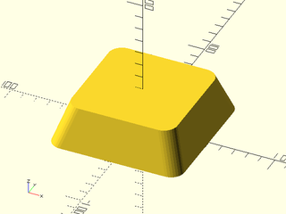
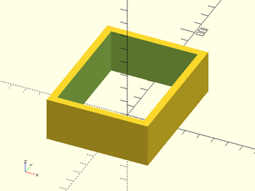
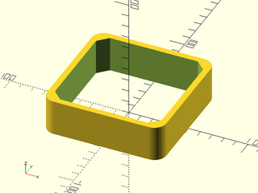
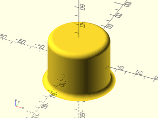
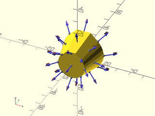
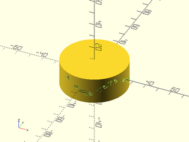

# LibFile: shapes3d.scad

Some standard modules for making 3d shapes with attachment support, and function forms
that produce a VNF.  Also included are shortcuts cylinders in each orientation and extended versions of
the standard modules that provide roundovers and chamfers.  The spheroid() module provides
several different ways to make a sphere, and the text modules let you write text on a path
so you can place it on a curved object.

To use, add the following lines to the beginning of your file:

    include <BOSL2/std.scad>

## Table of Contents

1. [Section: Cuboids, Prismoids and Pyramids](#section-cuboids-prismoids-and-pyramids)
    - [`cube()`](#functionmodule-cube)
    - [`cuboid()`](#module-cuboid)
    - [`prismoid()`](#functionmodule-prismoid)
    - [`octahedron()`](#functionmodule-octahedron)
    - [`rect_tube()`](#module-rect_tube)
    - [`wedge()`](#functionmodule-wedge)

2. [Section: Cylinders](#section-cylinders)
    - [`cylinder()`](#functionmodule-cylinder)
    - [`cyl()`](#module-cyl)
    - [`xcyl()`](#module-xcyl)
    - [`ycyl()`](#module-ycyl)
    - [`zcyl()`](#module-zcyl)
    - [`tube()`](#module-tube)
    - [`pie_slice()`](#functionmodule-pie_slice)

3. [Section: Other Round Objects](#section-other-round-objects)
    - [`sphere()`](#functionmodule-sphere)
    - [`spheroid()`](#functionmodule-spheroid)
    - [`torus()`](#functionmodule-torus)
    - [`teardrop()`](#functionmodule-teardrop)
    - [`onion()`](#functionmodule-onion)

4. [Section: Text](#section-text)
    - [`text3d()`](#module-text3d)
    - [`path_text()`](#module-path_text)

5. [Section: Miscellaneous](#section-miscellaneous)
    - [`interior_fillet()`](#module-interior_fillet)
    - [`heightfield()`](#functionmodule-heightfield)
    - [`ruler()`](#module-ruler)

## Section: Cuboids, Prismoids and Pyramids

### Function/Module: cube()

**Topics:** [Shapes (3D)](Topics#shapes-3d), [Attachable](Topics#attachable), [VNF Generators](Topics#vnf-generators)

**Usage:** As Module

- cube(size, [center], ...);

**Usage:** With Attachments

- cube(size, [center], ...) { attachments }

**Usage:** As Function

- vnf = cube(size, [center], ...);

**Description:** 

Creates a 3D cubic object with support for anchoring and attachments.
This can be used as a drop-in replacement for the built-in `cube()` module.
When called as a function, returns a [VNF](vnf.scad) for a cube.

**Arguments:** 

<abbr title="These args can be used by position or by name.">By&nbsp;Position</abbr> | What it does
-------------------- | ------------
`size`               | The size of the cube.
`center`             | If given, overrides `anchor`.  A true value sets `anchor=CENTER`, false sets `anchor=FRONT+LEFT+BOTTOM`.

<abbr title="These args must be used by name, ie: name=value">By&nbsp;Name</abbr> | What it does
-------------------- | ------------
`anchor`             | Translate so anchor point is at origin (0,0,0).  See [anchor](attachments.scad#subsection-anchor).  Default: `CENTER`
`spin`               | Rotate this many degrees around the Z axis after anchor.  See [spin](attachments.scad#subsection-spin).  Default: `0`
`orient`             | Vector to rotate top towards, after spin.  See [orient](attachments.scad#subsection-orient).  Default: `UP`

**See Also:** [cuboid()](#module-cuboid), [prismoid()](#functionmodule-prismoid)

**Example 1:** Simple cube.

    include <BOSL2/std.scad>
    cube(40);

  

**Example 2:** Rectangular cube.

    include <BOSL2/std.scad>
    cube([20,40,50]);

  

**Example 3:** Anchoring.

    include <BOSL2/std.scad>
    cube([20,40,50], anchor=BOTTOM+FRONT);

  

**Example 4:** Spin.

    include <BOSL2/std.scad>
    cube([20,40,50], anchor=BOTTOM+FRONT, spin=30);

  

**Example 5:** Orientation.

    include <BOSL2/std.scad>
    cube([20,40,50], anchor=BOTTOM+FRONT, spin=30, orient=FWD);

  

**Example 6:** Standard Connectors.

    include <BOSL2/std.scad>
    cube(40, center=true) show_anchors();

  

**Example 7:** Called as Function

    include <BOSL2/std.scad>
    vnf = cube([20,40,50]);
    vnf_polyhedron(vnf);

  

---

### Module: cuboid()

**Usage:** Standard Cubes

- cuboid(size, [anchor=], [spin=], [orient=]);
- cuboid(size, p1=, ...);
- cuboid(p1=, p2=, ...);

**Usage:** Chamfered Cubes

- cuboid(size, [chamfer=], [edges=], [except=], [trimcorners=], ...);

**Usage:** Rounded Cubes

- cuboid(size, [rounding=], [teardrop=], [edges=], [except=], [trimcorners=], ...);

**Usage:** Attaching children

- cuboid(size, [anchor=], ...) [attachments];

**Description:** 

Creates a cube or cuboid object, with optional chamfering or rounding of edges and corners.
You cannot mix chamfering and rounding: just one edge treatment with the same size applies to all selected edges.
Negative chamfers and roundings can be applied to create external fillets, but they
only apply to edges around the top or bottom faces.  If you specify an edge set other than "ALL"
with negative roundings or chamfers then you will get an error.  See [Specifying Edges](attachments.scad#section-specifying-edges)
for information on how to specify edge sets.

**Arguments:** 

<abbr title="These args can be used by position or by name.">By&nbsp;Position</abbr> | What it does
-------------------- | ------------
`size`               | The size of the cube, a number or length 3 vector.

<abbr title="These args must be used by name, ie: name=value">By&nbsp;Name</abbr> | What it does
-------------------- | ------------
`chamfer`            | Size of chamfer, inset from sides.  Default: No chamfering.
`rounding`           | Radius of the edge rounding.  Default: No rounding.
`edges`              | Edges to mask.  See [Specifying Edges](attachments.scad#section-specifying-edges).  Default: all edges.
`except`             | Edges to explicitly NOT mask.  See [Specifying Edges](attachments.scad#section-specifying-edges).  Default: No edges.
`trimcorners`        | If true, rounds or chamfers corners where three chamfered/rounded edges meet.  Default: `true`
`teardrop`           | If given as a number, rounding around the bottom edge of the cuboid won't exceed this many degrees from vertical.  If true, the limit angle is 45 degrees.  Default: `false`
`p1`                 | Align the cuboid's corner at `p1`, if given.  Forces `anchor=FRONT+LEFT+BOTTOM`.
`p2`                 | If given with `p1`, defines the cornerpoints of the cuboid.
`anchor`             | Translate so anchor point is at origin (0,0,0).  See [anchor](attachments.scad#subsection-anchor).  Default: `CENTER`
`spin`               | Rotate this many degrees around the Z axis.  See [spin](attachments.scad#subsection-spin).  Default: `0`
`orient`             | Vector to rotate top towards.  See [orient](attachments.scad#subsection-orient).  Default: `UP`

**Example 1:** Simple regular cube.

    include <BOSL2/std.scad>
    cuboid(40);

  

**Example 2:** Cube with minimum cornerpoint given.

    include <BOSL2/std.scad>
    cuboid(20, p1=[10,0,0]);

  

**Example 3:** Rectangular cube, with given X, Y, and Z sizes.

    include <BOSL2/std.scad>
    cuboid([20,40,50]);

  

**Example 4:** Cube by Opposing Corners.

    include <BOSL2/std.scad>
    cuboid(p1=[0,10,0], p2=[20,30,30]);

  

**Example 5:** Chamferred Edges and Corners.

    include <BOSL2/std.scad>
    cuboid([30,40,50], chamfer=5);

  

**Example 6:** Chamferred Edges, Untrimmed Corners.

    include <BOSL2/std.scad>
    cuboid([30,40,50], chamfer=5, trimcorners=false);

  

**Example 7:** Rounded Edges and Corners

    include <BOSL2/std.scad>
    cuboid([30,40,50], rounding=10);

  

**Example 8:** Rounded Edges and Corners with Teardrop Bottoms

    include <BOSL2/std.scad>
    cuboid([30,40,50], rounding=10, teardrop=true);

  

**Example 9:** Rounded Edges, Untrimmed Corners

    include <BOSL2/std.scad>
    cuboid([30,40,50], rounding=10, trimcorners=false);

  

**Example 10:** Chamferring Selected Edges

    include <BOSL2/std.scad>
    cuboid(
        [30,40,50], chamfer=5,
        edges=[TOP+FRONT,TOP+RIGHT,FRONT+RIGHT],
        $fn=24
    );

  

**Example 11:** Rounding Selected Edges

    include <BOSL2/std.scad>
    cuboid(
        [30,40,50], rounding=5,
        edges=[TOP+FRONT,TOP+RIGHT,FRONT+RIGHT],
        $fn=24
    );

  

**Example 12:** Negative Chamferring

    include <BOSL2/std.scad>
    cuboid(
        [30,40,50], chamfer=-5,
        edges=[TOP,BOT], except=RIGHT,
        $fn=24
    );

  

**Example 13:** Negative Chamferring, Untrimmed Corners

    include <BOSL2/std.scad>
    cuboid(
        [30,40,50], chamfer=-5,
        edges=[TOP,BOT], except=RIGHT,
        trimcorners=false, $fn=24
    );

  

**Example 14:** Negative Rounding

    include <BOSL2/std.scad>
    cuboid(
        [30,40,50], rounding=-5,
        edges=[TOP,BOT], except=RIGHT,
        $fn=24
    );

  

**Example 15:** Negative Rounding, Untrimmed Corners

    include <BOSL2/std.scad>
    cuboid(
        [30,40,50], rounding=-5,
        edges=[TOP,BOT], except=RIGHT,
        trimcorners=false, $fn=24
    );

  

**Example 16:** Standard Connectors

    include <BOSL2/std.scad>
    cuboid(40) show_anchors();

  

---

### Function/Module: prismoid()

**Usage:** Typical Prismoids

- prismoid(size1, size2, h|l, [shift], ...);

**Usage:** Attaching Children

- prismoid(size1, size2, h|l, [shift], ...) [attachments];

**Usage:** Chamfered Prismoids

- prismoid(size1, size2, h|l, [chamfer=], ...);
- prismoid(size1, size2, h|l, [chamfer1=], [chamfer2=], ...);

**Usage:** Rounded Prismoids

- prismoid(size1, size2, h|l, [rounding=], ...);
- prismoid(size1, size2, h|l, [rounding1=], [rounding2=], ...);

**Usage:** As Function

- vnf = prismoid(size1, size2, h|l, [shift], [rounding], [chamfer]);
- vnf = prismoid(size1, size2, h|l, [shift], [rounding1], [rounding2], [chamfer1], [chamfer2]);

**Description:** 

Creates a rectangular prismoid shape with optional roundovers and chamfering.
You can only round or chamfer the vertical(ish) edges.  For those edges, you can
specify rounding and/or chamferring per-edge, and for top and bottom separately.

**Arguments:** 

<abbr title="These args can be used by position or by name.">By&nbsp;Position</abbr> | What it does
-------------------- | ------------
`size1`              | [width, length] of the bottom end of the prism.
`size2`              | [width, length] of the top end of the prism.
`h|l`                | Height of the prism.
`shift`              | [X,Y] amount to shift the center of the top end with respect to the center of the bottom end.

<abbr title="These args must be used by name, ie: name=value">By&nbsp;Name</abbr> | What it does
-------------------- | ------------
`rounding`           | The roundover radius for the vertical-ish edges of the prismoid.  If given as a list of four numbers, gives individual radii for each corner, in the order [X+Y+,X-Y+,X-Y-,X+Y-]. Default: 0 (no rounding)
`rounding1`          | The roundover radius for the bottom of the vertical-ish edges of the prismoid.  If given as a list of four numbers, gives individual radii for each corner, in the order [X+Y+,X-Y+,X-Y-,X+Y-].
`rounding2`          | The roundover radius for the top of the vertical-ish edges of the prismoid.  If given as a list of four numbers, gives individual radii for each corner, in the order [X+Y+,X-Y+,X-Y-,X+Y-].
`chamfer`            | The chamfer size for the vertical-ish edges of the prismoid.  If given as a list of four numbers, gives individual chamfers for each corner, in the order [X+Y+,X-Y+,X-Y-,X+Y-].  Default: 0 (no chamfer)
`chamfer1`           | The chamfer size for the bottom of the vertical-ish edges of the prismoid.  If given as a list of four numbers, gives individual chamfers for each corner, in the order [X+Y+,X-Y+,X-Y-,X+Y-].
`chamfer2`           | The chamfer size for the top of the vertical-ish edges of the prismoid.  If given as a list of four numbers, gives individual chamfers for each corner, in the order [X+Y+,X-Y+,X-Y-,X+Y-].
`anchor`             | Translate so anchor point is at origin (0,0,0).  See [anchor](attachments.scad#subsection-anchor).  Default: `CENTER`
`spin`               | Rotate this many degrees around the Z axis after anchor.  See [spin](attachments.scad#subsection-spin).  Default: `0`
`orient`             | Vector to rotate top towards, after spin.  See [orient](attachments.scad#subsection-orient).  Default: `UP`

**See Also:** [rounded\_prism()](rounding.scad#functionmodule-rounded_prism)

**Example 1:** Rectangular Pyramid

    include <BOSL2/std.scad>
    prismoid([40,40], [0,0], h=20);

  

**Example 2:** Prism

    include <BOSL2/std.scad>
    prismoid(size1=[40,40], size2=[0,40], h=20);

  

**Example 3:** Truncated Pyramid

    include <BOSL2/std.scad>
    prismoid(size1=[35,50], size2=[20,30], h=20);

  

**Example 4:** Wedge

    include <BOSL2/std.scad>
    prismoid(size1=[60,35], size2=[30,0], h=30);

  

**Example 5:** Truncated Tetrahedron

    include <BOSL2/std.scad>
    prismoid(size1=[10,40], size2=[40,10], h=40);

  

**Example 6:** Inverted Truncated Pyramid

    include <BOSL2/std.scad>
    prismoid(size1=[15,5], size2=[30,20], h=20);

  

**Example 7:** Right Prism

    include <BOSL2/std.scad>
    prismoid(size1=[30,60], size2=[0,60], shift=[-15,0], h=30);

  

**Example 8:** Shifting/Skewing

    include <BOSL2/std.scad>
    prismoid(size1=[50,30], size2=[20,20], h=20, shift=[15,5]);

  

**Example 9:** Rounding

    include <BOSL2/std.scad>
    prismoid(100, 80, rounding=10, h=30);

  

**Example 10:** Outer Chamfer Only

    include <BOSL2/std.scad>
    prismoid(100, 80, chamfer=5, h=30);

  

**Example 11:** Gradiant Rounding

    include <BOSL2/std.scad>
    prismoid(100, 80, rounding1=10, rounding2=0, h=30);

  

**Example 12:** Per Corner Rounding

    include <BOSL2/std.scad>
    prismoid(100, 80, rounding=[0,5,10,15], h=30);

  

**Example 13:** Per Corner Chamfer

    include <BOSL2/std.scad>
    prismoid(100, 80, chamfer=[0,5,10,15], h=30);

  

**Example 14:** Mixing Chamfer and Rounding

    include <BOSL2/std.scad>
    prismoid(
        100, 80, h=30,
        chamfer=[0,5,0,10],
        rounding=[5,0,10,0]
    );

  

**Example 15:** Really Mixing It Up

    include <BOSL2/std.scad>
    prismoid(
        size1=[100,80], size2=[80,60], h=20,
        chamfer1=[0,5,0,10], chamfer2=[5,0,10,0],
        rounding1=[5,0,10,0], rounding2=[0,5,0,10]
    );

  

**Example 16:** Standard Connectors

    include <BOSL2/std.scad>
    prismoid(size1=[50,30], size2=[20,20], h=20, shift=[15,5])
        show_anchors();

  

---

### Function/Module: octahedron()

**Usage:** As Module

- octahedron(size, ...);

**Usage:** With Attachments

- octahedron(size, ...) { attachments }

**Usage:** As Function

- vnf = octahedron(size, ...);

**Description:** 

When called as a module, creates an octahedron with axis-aligned points.
When called as a function, creates a [[VNF|vnf.scad]] of an octahedron with axis-aligned points.

**Arguments:** 

<abbr title="These args can be used by position or by name.">By&nbsp;Position</abbr> | What it does
-------------------- | ------------
`size`               | Width of the octahedron, tip to tip.

<abbr title="These args must be used by name, ie: name=value">By&nbsp;Name</abbr> | What it does
-------------------- | ------------
`anchor`             | Translate so anchor point is at origin (0,0,0).  See [anchor](attachments.scad#subsection-anchor).  Default: `CENTER`
`spin`               | Rotate this many degrees around the Z axis after anchor.  See [spin](attachments.scad#subsection-spin).  Default: `0`
`orient`             | Vector to rotate top towards, after spin.  See [orient](attachments.scad#subsection-orient).  Default: `UP`

**Example 1:** 

    include <BOSL2/std.scad>
    octahedron(size=40);

  

**Example 2:** Anchors

    include <BOSL2/std.scad>
    octahedron(size=40) show_anchors();

  

---

### Module: rect\_tube()

**Usage:** Typical Rectangular Tubes

- rect\_tube(h, size, isize, [center], [shift]);
- rect\_tube(h, size, wall=, [center=]);
- rect\_tube(h, isize=, wall=, [center=]);

**Usage:** Tapering Rectangular Tubes

- rect\_tube(h, size1=, size2=, wall=, ...);
- rect\_tube(h, isize1=, isize2=, wall=, ...);
- rect\_tube(h, size1=, size2=, isize1=, isize2=, ...);

**Usage:** Chamfered

- rect\_tube(h, size, isize, chamfer=, ...);
- rect\_tube(h, size, isize, chamfer1=, chamfer2= ...);
- rect\_tube(h, size, isize, ichamfer=, ...);
- rect\_tube(h, size, isize, ichamfer1=, ichamfer2= ...);
- rect\_tube(h, size, isize, chamfer=, ichamfer=, ...);

**Usage:** Rounded

- rect\_tube(h, size, isize, rounding=, ...);
- rect\_tube(h, size, isize, rounding1=, rounding2= ...);
- rect\_tube(h, size, isize, irounding=, ...);
- rect\_tube(h, size, isize, irounding1=, irounding2= ...);
- rect\_tube(h, size, isize, rounding=, irounding=, ...);

**Usage:** Attaching Children

- rect\_tube(h, size, isize, ...) [attachments];

**Description:** 

Creates a rectangular or prismoid tube with optional roundovers and/or chamfers.
You can only round or chamfer the vertical(ish) edges.  For those edges, you can
specify rounding and/or chamferring per-edge, and for top and bottom, inside and
outside  separately.

**Arguments:** 

<abbr title="These args can be used by position or by name.">By&nbsp;Position</abbr> | What it does
-------------------- | ------------
`h|l`                | The height or length of the rectangular tube.  Default: 1
`size`               | The outer [X,Y] size of the rectangular tube.
`isize`              | The inner [X,Y] size of the rectangular tube.
`center`             | If given, overrides `anchor`.  A true value sets `anchor=CENTER`, false sets `anchor=UP`.
`shift`              | [X,Y] amount to shift the center of the top end with respect to the center of the bottom end.

<abbr title="These args must be used by name, ie: name=value">By&nbsp;Name</abbr> | What it does
-------------------- | ------------
`wall`               | The thickness of the rectangular tube wall.
`size1`              | The [X,Y] size of the outside of the bottom of the rectangular tube.
`size2`              | The [X,Y] size of the outside of the top of the rectangular tube.
`isize1`             | The [X,Y] size of the inside of the bottom of the rectangular tube.
`isize2`             | The [X,Y] size of the inside of the top of the rectangular tube.
`rounding`           | The roundover radius for the outside edges of the rectangular tube.
`rounding1`          | The roundover radius for the outside bottom corner of the rectangular tube.
`rounding2`          | The roundover radius for the outside top corner of the rectangular tube.
`chamfer`            | The chamfer size for the outside edges of the rectangular tube.
`chamfer1`           | The chamfer size for the outside bottom corner of the rectangular tube.
`chamfer2`           | The chamfer size for the outside top corner of the rectangular tube.
`irounding`          | The roundover radius for the inside edges of the rectangular tube. Default: Same as `rounding`
`irounding1`         | The roundover radius for the inside bottom corner of the rectangular tube.
`irounding2`         | The roundover radius for the inside top corner of the rectangular tube.
`ichamfer`           | The chamfer size for the inside edges of the rectangular tube.  Default: Same as `chamfer`
`ichamfer1`          | The chamfer size for the inside bottom corner of the rectangular tube.
`ichamfer2`          | The chamfer size for the inside top corner of the rectangular tube.
`anchor`             | Translate so anchor point is at origin (0,0,0).  See [anchor](attachments.scad#subsection-anchor).  Default: `BOTTOM`
`spin`               | Rotate this many degrees around the Z axis after anchor.  See [spin](attachments.scad#subsection-spin).  Default: `0`
`orient`             | Vector to rotate top towards, after spin.  See [orient](attachments.scad#subsection-orient).  Default: `UP`

**Example 1:** 

    include <BOSL2/std.scad>
    rect_tube(size=50, wall=5, h=30);

  

**Example 2:** 

    include <BOSL2/std.scad>
    rect_tube(size=[100,60], wall=5, h=30);

  

**Example 3:** 

    include <BOSL2/std.scad>
    rect_tube(isize=[60,80], wall=5, h=30);

  

**Example 4:** 

    include <BOSL2/std.scad>
    rect_tube(size=[100,60], isize=[90,50], h=30);

  

**Example 5:** 

    include <BOSL2/std.scad>
    rect_tube(size1=[100,60], size2=[70,40], wall=5, h=30);

  

**Example 6:** 

    include <BOSL2/std.scad>
    rect_tube(
        size1=[100,60], size2=[70,40],
        isize1=[40,20], isize2=[65,35], h=15
    );

  

**Example 7:** Outer Rounding Only

    include <BOSL2/std.scad>
    rect_tube(size=100, wall=5, rounding=10, irounding=0, h=30);

  

**Example 8:** Outer Chamfer Only

    include <BOSL2/std.scad>
    rect_tube(size=100, wall=5, chamfer=5, ichamfer=0, h=30);

  

**Example 9:** Outer Rounding, Inner Chamfer

    include <BOSL2/std.scad>
    rect_tube(size=100, wall=5, rounding=10, ichamfer=8, h=30);

  

**Example 10:** Inner Rounding, Outer Chamfer

    include <BOSL2/std.scad>
    rect_tube(size=100, wall=5, chamfer=10, irounding=8, h=30);

  

**Example 11:** Gradiant Rounding

    include <BOSL2/std.scad>
    rect_tube(
        size1=100, size2=80, wall=5, h=30,
        rounding1=10, rounding2=0,
        irounding1=8, irounding2=0
    );

  

**Example 12:** Per Corner Rounding

    include <BOSL2/std.scad>
    rect_tube(
        size=100, wall=10, h=30,
        rounding=[0,5,10,15], irounding=0
    );

  

**Example 13:** Per Corner Chamfer

    include <BOSL2/std.scad>
    rect_tube(
        size=100, wall=10, h=30,
        chamfer=[0,5,10,15], ichamfer=0
    );

  

**Example 14:** Mixing Chamfer and Rounding

    include <BOSL2/std.scad>
    rect_tube(
        size=100, wall=10, h=30,
        chamfer=[0,5,0,10], ichamfer=0,
        rounding=[5,0,10,0], irounding=0
    );

  

**Example 15:** Really Mixing It Up

    include <BOSL2/std.scad>
    rect_tube(
        size1=[100,80], size2=[80,60],
        isize1=[50,30], isize2=[70,50], h=20,
        chamfer1=[0,5,0,10], ichamfer1=[0,3,0,8],
        chamfer2=[5,0,10,0], ichamfer2=[3,0,8,0],
        rounding1=[5,0,10,0], irounding1=[3,0,8,0],
        rounding2=[0,5,0,10], irounding2=[0,3,0,8]
    );

  

---

### Function/Module: wedge()

**Usage:** As Module

- wedge(size, [center], ...);

**Usage:** With Attachments

- wedge(size, [center], ...) { attachments }

**Usage:** As Function

- vnf = wedge(size, [center], ...);

**Description:** 

When called as a module, creates a 3D triangular wedge with the hypotenuse in the X+Z+ quadrant.
When called as a function, creates a VNF for a 3D triangular wedge with the hypotenuse in the X+Z+ quadrant.

**Arguments:** 

<abbr title="These args can be used by position or by name.">By&nbsp;Position</abbr> | What it does
-------------------- | ------------
`size`               | [width, thickness, height]
`center`             | If given, overrides `anchor`.  A true value sets `anchor=CENTER`, false sets `anchor=UP`.

<abbr title="These args must be used by name, ie: name=value">By&nbsp;Name</abbr> | What it does
-------------------- | ------------
`anchor`             | Translate so anchor point is at origin (0,0,0).  See [anchor](attachments.scad#subsection-anchor).  Default: `FRONT+LEFT+BOTTOM`
`spin`               | Rotate this many degrees around the Z axis after anchor.  See [spin](attachments.scad#subsection-spin).  Default: `0`
`orient`             | Vector to rotate top towards, after spin.  See [orient](attachments.scad#subsection-orient).  Default: `UP`

**Example 1:** Centered

    include <BOSL2/std.scad>
    wedge([20, 40, 15], center=true);

  

**Example 2:** *Non*-Centered

    include <BOSL2/std.scad>
    wedge([20, 40, 15]);

  

**Example 3:** Standard Connectors

    include <BOSL2/std.scad>
    wedge([20, 40, 15]) show_anchors();

  

---

## Section: Cylinders

### Function/Module: cylinder()

**Topics:** [Shapes (3D)](Topics#shapes-3d), [Attachable](Topics#attachable), [VNF Generators](Topics#vnf-generators)

**Usage:** As Module

- cylinder(h, r=/d=, [center=], ...);
- cylinder(h, r1/d1=, r2/d2=, [center=], ...);

**Usage:** With Attachments

- cylinder(h, r=/d=, [center=]) {attachments}

**Usage:** As Function

- vnf = cylinder(h, r=/d=, [center=], ...);
- vnf = cylinder(h, r1/d1=, r2/d2=, [center=], ...);

**Description:** 

Creates a 3D cylinder or conic object with support for anchoring and attachments.
This can be used as a drop-in replacement for the built-in `cylinder()` module.
When called as a function, returns a [VNF](vnf.scad) for a cylinder.

**Arguments:** 

<abbr title="These args can be used by position or by name.">By&nbsp;Position</abbr> | What it does
-------------------- | ------------
`l`                  / `h`                  | The height of the cylinder.
`r1`                 | The bottom radius of the cylinder.  (Before orientation.)
`r2`                 | The top radius of the cylinder.  (Before orientation.)
`center`             | If given, overrides `anchor`.  A true value sets `anchor=CENTER`, false sets `anchor=BOTTOM`.

<abbr title="These args must be used by name, ie: name=value">By&nbsp;Name</abbr> | What it does
-------------------- | ------------
`d1`                 | The bottom diameter of the cylinder.  (Before orientation.)
`d2`                 | The top diameter of the cylinder.  (Before orientation.)
`r`                  | The radius of the cylinder.
`d`                  | The diameter of the cylinder.
`anchor`             | Translate so anchor point is at origin (0,0,0).  See [anchor](attachments.scad#subsection-anchor).  Default: `CENTER`
`spin`               | Rotate this many degrees around the Z axis after anchor.  See [spin](attachments.scad#subsection-spin).  Default: `0`
`orient`             | Vector to rotate top towards, after spin.  See [orient](attachments.scad#subsection-orient).  Default: `UP`

**See Also:** [cyl()](#module-cyl)

**Example 1:** By Radius

    include <BOSL2/std.scad>
    xdistribute(30) {
        cylinder(h=40, r=10);
        cylinder(h=40, r1=10, r2=5);
    }

  

**Example 2:** By Diameter

    include <BOSL2/std.scad>
    xdistribute(30) {
        cylinder(h=40, d=25);
        cylinder(h=40, d1=25, d2=10);
    }

  

**Example 3:** Anchoring

 

    include <BOSL2/std.scad>
    cylinder(h=40, r1=10, r2=5, anchor=BOTTOM+FRONT);

**Example 4:** Spin

 

    include <BOSL2/std.scad>
    cylinder(h=40, r1=10, r2=5, anchor=BOTTOM+FRONT, spin=45);

**Example 5:** Orient

 

    include <BOSL2/std.scad>
    cylinder(h=40, r1=10, r2=5, anchor=BOTTOM+FRONT, spin=45, orient=FWD);

**Example 6:** Standard Connectors

 

    include <BOSL2/std.scad>
    xdistribute(40) {
        cylinder(h=30, d=25) show_anchors();
        cylinder(h=30, d1=25, d2=10) show_anchors();
    }

---

### Module: cyl()

**Usage:** Normal Cylinders

- cyl(l|h, r, [center], [circum=], [realign=]);
- cyl(l|h, d=, ...);
- cyl(l|h, r1=, r2=, ...);
- cyl(l|h, d1=, d2=, ...);

**Usage:** Chamferred Cylinders

- cyl(l|h, r|d, chamfer=, [chamfang=], [from\_end=], ...);
- cyl(l|h, r|d, chamfer1=, [chamfang1=], [from\_end=], ...);
- cyl(l|h, r|d, chamfer2=, [chamfang2=], [from\_end=], ...);
- cyl(l|h, r|d, chamfer1=, chamfer2=, [chamfang1=], [chamfang2=], [from\_end=], ...);

**Usage:** Rounded End Cylinders

- cyl(l|h, r|d, rounding=, ...);
- cyl(l|h, r|d, rounding1=, ...);
- cyl(l|h, r|d, rounding2=, ...);
- cyl(l|h, r|d, rounding1=, rounding2=, ...);

**Description:** 

Creates cylinders in various anchorings and orientations, with optional rounding and chamfers.
You can use `h` and `l` interchangably, and all variants allow specifying size by either `r`|`d`,
or `r1`|`d1` and `r2`|`d2`.  Note: the chamfers and rounding cannot be cumulatively longer than
the cylinder's length.

**Arguments:** 

<abbr title="These args can be used by position or by name.">By&nbsp;Position</abbr> | What it does
-------------------- | ------------
`l`                  / `h`                  | Length of cylinder along oriented axis.  Default: 1
`r`                  | Radius of cylinder.  Default: 1
`center`             | If given, overrides `anchor`.  A true value sets `anchor=CENTER`, false sets `anchor=DOWN`.

<abbr title="These args must be used by name, ie: name=value">By&nbsp;Name</abbr> | What it does
-------------------- | ------------
`r1`                 | Radius of the negative (X-, Y-, Z-) end of cylinder.
`r2`                 | Radius of the positive (X+, Y+, Z+) end of cylinder.
`d`                  | Diameter of cylinder.
`d1`                 | Diameter of the negative (X-, Y-, Z-) end of cylinder.
`d2`                 | Diameter of the positive (X+, Y+, Z+) end of cylinder.
`circum`             | If true, cylinder should circumscribe the circle of the given size.  Otherwise inscribes.  Default: `false`
`chamfer`            | The size of the chamfers on the ends of the cylinder.  Default: none.
`chamfer1`           | The size of the chamfer on the bottom end of the cylinder.  Default: none.
`chamfer2`           | The size of the chamfer on the top end of the cylinder.  Default: none.
`chamfang`           | The angle in degrees of the chamfers on the ends of the cylinder.
`chamfang1`          | The angle in degrees of the chamfer on the bottom end of the cylinder.
`chamfang2`          | The angle in degrees of the chamfer on the top end of the cylinder.
`from_end`           | If true, chamfer is measured from the end of the cylinder, instead of inset from the edge.  Default: `false`.
`rounding`           | The radius of the rounding on the ends of the cylinder.  Default: none.
`rounding1`          | The radius of the rounding on the bottom end of the cylinder.
`rounding2`          | The radius of the rounding on the top end of the cylinder.
`realign`            | If true, rotate the cylinder by half the angle of one face.
`anchor`             | Translate so anchor point is at origin (0,0,0).  See [anchor](attachments.scad#subsection-anchor).  Default: `CENTER`
`spin`               | Rotate this many degrees around the Z axis after anchor.  See [spin](attachments.scad#subsection-spin).  Default: `0`
`orient`             | Vector to rotate top towards, after spin.  See [orient](attachments.scad#subsection-orient).  Default: `UP`

**Example 1:** By Radius

    include <BOSL2/std.scad>
    xdistribute(30) {
        cyl(l=40, r=10);
        cyl(l=40, r1=10, r2=5);
    }

  

**Example 2:** By Diameter

    include <BOSL2/std.scad>
    xdistribute(30) {
        cyl(l=40, d=25);
        cyl(l=40, d1=25, d2=10);
    }

  

**Example 3:** Chamferring

    include <BOSL2/std.scad>
    xdistribute(60) {
        // Shown Left to right.
        cyl(l=40, d=40, chamfer=7);  // Default chamfang=45
        cyl(l=40, d=40, chamfer=7, chamfang=30, from_end=false);
        cyl(l=40, d=40, chamfer=7, chamfang=30, from_end=true);
    }

  

**Example 4:** Rounding

    include <BOSL2/std.scad>
    cyl(l=40, d=40, rounding=10);

  

**Example 5:** Heterogenous Chamfers and Rounding

    include <BOSL2/std.scad>
    ydistribute(80) {
        // Shown Front to Back.
        cyl(l=40, d=40, rounding1=15, orient=UP);
        cyl(l=40, d=40, chamfer2=5, orient=UP);
        cyl(l=40, d=40, chamfer1=12, rounding2=10, orient=UP);
    }

  

**Example 6:** Putting it all together

    include <BOSL2/std.scad>
    cyl(
        l=40, d1=25, d2=15,
        chamfer1=10, chamfang1=30,
        from_end=true, rounding2=5
    );

  

**Example 7:** External Chamfers

    include <BOSL2/std.scad>
    cyl(l=50, r=30, chamfer=-5, chamfang=30, $fa=1, $fs=1);

  

**Example 8:** External Roundings

    include <BOSL2/std.scad>
    cyl(l=50, r=30, rounding1=-5, rounding2=5, $fa=1, $fs=1);

  

**Example 9:** Standard Connectors

    include <BOSL2/std.scad>
    xdistribute(40) {
        cyl(l=30, d=25) show_anchors();
        cyl(l=30, d1=25, d2=10) show_anchors();
    }

  

---

### Module: xcyl()

**Usage:** Typical

- xcyl(l|h, r, [anchor=]);
- xcyl(l|h, d=, [anchor=]);
- xcyl(l|h, r1=|d1=, r2=|d2=, [anchor=]);

**Usage:** Attaching Children

- xcyl(l|h, r, [anchor=]) [attachments];

**Description:** 

Creates a cylinder oriented along the X axis.

**Arguments:** 

<abbr title="These args can be used by position or by name.">By&nbsp;Position</abbr> | What it does
-------------------- | ------------
`l`                  / `h`                  | Length of cylinder along oriented axis. Default: 1
`r`                  | Radius of cylinder.  Default: 1

<abbr title="These args must be used by name, ie: name=value">By&nbsp;Name</abbr> | What it does
-------------------- | ------------
`r1`                 | Optional radius of left (X-) end of cylinder.
`r2`                 | Optional radius of right (X+) end of cylinder.
`d`                  | Optional diameter of cylinder. (use instead of `r`)
`d1`                 | Optional diameter of left (X-) end of cylinder.
`d2`                 | Optional diameter of right (X+) end of cylinder.
`anchor`             | Translate so anchor point is at origin (0,0,0).  See [anchor](attachments.scad#subsection-anchor).  Default: `CENTER`

**Example 1:** By Radius

    include <BOSL2/std.scad>
    ydistribute(50) {
        xcyl(l=35, r=10);
        xcyl(l=35, r1=15, r2=5);
    }

  

**Example 2:** By Diameter

    include <BOSL2/std.scad>
    ydistribute(50) {
        xcyl(l=35, d=20);
        xcyl(l=35, d1=30, d2=10);
    }

  

---

### Module: ycyl()

**Usage:** Typical

- ycyl(l|h, r, [anchor=]);
- ycyl(l|h, d=, [anchor=]);
- ycyl(l|h, r1=|d1=, r2=|d2=, [anchor=]);

**Usage:** Attaching Children

- ycyl(l|h, r, [anchor=]) [attachments];

**Description:** 

Creates a cylinder oriented along the Y axis.

**Arguments:** 

<abbr title="These args can be used by position or by name.">By&nbsp;Position</abbr> | What it does
-------------------- | ------------
`l`                  / `h`                  | Length of cylinder along oriented axis. (Default: `1.0`)
`r`                  | Radius of cylinder.

<abbr title="These args must be used by name, ie: name=value">By&nbsp;Name</abbr> | What it does
-------------------- | ------------
`r1`                 | Radius of front (Y-) end of cone.
`r2`                 | Radius of back (Y+) end of one.
`d`                  | Diameter of cylinder.
`d1`                 | Diameter of front (Y-) end of one.
`d2`                 | Diameter of back (Y+) end of one.
`anchor`             | Translate so anchor point is at origin (0,0,0).  See [anchor](attachments.scad#subsection-anchor).  Default: `CENTER`

**Example 1:** By Radius

    include <BOSL2/std.scad>
    xdistribute(50) {
        ycyl(l=35, r=10);
        ycyl(l=35, r1=15, r2=5);
    }

  

**Example 2:** By Diameter

    include <BOSL2/std.scad>
    xdistribute(50) {
        ycyl(l=35, d=20);
        ycyl(l=35, d1=30, d2=10);
    }

  

---

### Module: zcyl()

**Usage:** Typical

- zcyl(l|h, r, [anchor=]);
- zcyl(l|h, d=, [anchor=]);
- zcyl(l|h, r1=|d1=, r2=|d2=, [anchor=]);

**Usage:** Attaching Children

- zcyl(l|h, r, [anchor=]) [attachments];

**Description:** 

Creates a cylinder oriented along the Z axis.

**Arguments:** 

<abbr title="These args can be used by position or by name.">By&nbsp;Position</abbr> | What it does
-------------------- | ------------
`l`                  / `h`                  | Length of cylinder along oriented axis. (Default: 1.0)
`r`                  | Radius of cylinder.

<abbr title="These args must be used by name, ie: name=value">By&nbsp;Name</abbr> | What it does
-------------------- | ------------
`r1`                 | Radius of front (Y-) end of cone.
`r2`                 | Radius of back (Y+) end of one.
`d`                  | Diameter of cylinder.
`d1`                 | Diameter of front (Y-) end of one.
`d2`                 | Diameter of back (Y+) end of one.
`anchor`             | Translate so anchor point is at origin (0,0,0).  See [anchor](attachments.scad#subsection-anchor).  Default: `CENTER`

**Example 1:** By Radius

    include <BOSL2/std.scad>
    xdistribute(50) {
        zcyl(l=35, r=10);
        zcyl(l=35, r1=15, r2=5);
    }

  

**Example 2:** By Diameter

    include <BOSL2/std.scad>
    xdistribute(50) {
        zcyl(l=35, d=20);
        zcyl(l=35, d1=30, d2=10);
    }

  

---

### Module: tube()

**Usage:** Typical

- tube(h|l, or, ir, [center], [realign=]);
- tube(h|l, or=|od=, ir=|id=, ...);
- tube(h|l, ir|id, wall, ...);
- tube(h|l, or|od, wall, ...);
- tube(h|l, ir1|id1, ir2|id2, wall, ...);
- tube(h|l, or1|od1, or2|od2, wall, ...);
- tube(h|l, ir1|id1, ir2|id2, or1|od1, or2|od2, [realign]);

**Usage:** Attaching Children

- tube(h|l, or, ir, [center]) [attachments];

**Description:** 

Makes a hollow tube with the given outer size and wall thickness.

**Arguments:** 

<abbr title="These args can be used by position or by name.">By&nbsp;Position</abbr> | What it does
-------------------- | ------------
`h`                  / `l`                  | height of tube. Default: 1
`or`                 | Outer radius of tube. Default: 1
`ir`                 | Inner radius of tube.
`center`             | If given, overrides `anchor`.  A true value sets `anchor=CENTER`, false sets `anchor=DOWN`.

<abbr title="These args must be used by name, ie: name=value">By&nbsp;Name</abbr> | What it does
-------------------- | ------------
`od`                 | Outer diameter of tube.
`id`                 | Inner diameter of tube.
`wall`               | horizontal thickness of tube wall. Default 0.5
`or1`                | Outer radius of bottom of tube.  Default: value of r)
`or2`                | Outer radius of top of tube.  Default: value of r)
`od1`                | Outer diameter of bottom of tube.
`od2`                | Outer diameter of top of tube.
`ir1`                | Inner radius of bottom of tube.
`ir2`                | Inner radius of top of tube.
`id1`                | Inner diameter of bottom of tube.
`id2`                | Inner diameter of top of tube.
`realign`            | If true, rotate the tube by half the angle of one face.
`anchor`             | Translate so anchor point is at origin (0,0,0).  See [anchor](attachments.scad#subsection-anchor).  Default: `CENTER`
`spin`               | Rotate this many degrees around the Z axis after anchor.  See [spin](attachments.scad#subsection-spin).  Default: `0`
`orient`             | Vector to rotate top towards, after spin.  See [orient](attachments.scad#subsection-orient).  Default: `UP`

**Example 1:** These all Produce the Same Tube

    include <BOSL2/std.scad>
    tube(h=30, or=40, wall=5);
    tube(h=30, ir=35, wall=5);
    tube(h=30, or=40, ir=35);
    tube(h=30, od=80, id=70);

  

**Example 2:** These all Produce the Same Conical Tube

    include <BOSL2/std.scad>
    tube(h=30, or1=40, or2=25, wall=5);
    tube(h=30, ir1=35, or2=20, wall=5);
    tube(h=30, or1=40, or2=25, ir1=35, ir2=20);

  

**Example 3:** Circular Wedge

    include <BOSL2/std.scad>
    tube(h=30, or1=40, or2=30, ir1=20, ir2=30);

  

**Example 4:** Standard Connectors

    include <BOSL2/std.scad>
    tube(h=30, or=40, wall=5) show_anchors();

  

---

### Function/Module: pie\_slice()

**Usage:** As Module

- pie\_slice(l|h, r, ang, [center]);
- pie\_slice(l|h, d=, ang=, ...);
- pie\_slice(l|h, r1=|d1=, r2=|d2=, ang=, ...);

**Usage:** As Function

- vnf = pie\_slice(l|h, r, ang, [center]);
- vnf = pie\_slice(l|h, d=, ang=, ...);
- vnf = pie\_slice(l|h, r1=|d1=, r2=|d2=, ang=, ...);

**Usage:** Attaching Children

- pie\_slice(l|h, r, ang, ...) [attachments];

**Description:** 

Creates a pie slice shape.

**Arguments:** 

<abbr title="These args can be used by position or by name.">By&nbsp;Position</abbr> | What it does
-------------------- | ------------
`h`                  / `l`                  | height of pie slice.
`r`                  | radius of pie slice.
`ang`                | pie slice angle in degrees.
`center`             | If given, overrides `anchor`.  A true value sets `anchor=CENTER`, false sets `anchor=UP`.

<abbr title="These args must be used by name, ie: name=value">By&nbsp;Name</abbr> | What it does
-------------------- | ------------
`r1`                 | bottom radius of pie slice.
`r2`                 | top radius of pie slice.
`d`                  | diameter of pie slice.
`d1`                 | bottom diameter of pie slice.
`d2`                 | top diameter of pie slice.
`anchor`             | Translate so anchor point is at origin (0,0,0).  See [anchor](attachments.scad#subsection-anchor).  Default: `CENTER`
`spin`               | Rotate this many degrees around the Z axis after anchor.  See [spin](attachments.scad#subsection-spin).  Default: `0`
`orient`             | Vector to rotate top towards, after spin.  See [orient](attachments.scad#subsection-orient).  Default: `UP`

**Example 1:** Cylindrical Pie Slice

    include <BOSL2/std.scad>
    pie_slice(ang=45, l=20, r=30);

  

**Example 2:** Conical Pie Slice

    include <BOSL2/std.scad>
    pie_slice(ang=60, l=20, d1=50, d2=70);

  

**Example 3:** Big Slice

    include <BOSL2/std.scad>
    pie_slice(ang=300, l=20, d1=50, d2=70);

  

**Example 4:** Generating a VNF

    include <BOSL2/std.scad>
    vnf = pie_slice(ang=150, l=20, r1=30, r2=50);
    vnf_polyhedron(vnf);

  

---

## Section: Other Round Objects

### Function/Module: sphere()

**Topics:** [Shapes (3D)](Topics#shapes-3d), [Attachable](Topics#attachable), [VNF Generators](Topics#vnf-generators)

**Usage:** As Module

- sphere(r|d=, [circum=], [style=], ...);

**Usage:** With Attachments

- sphere(r|d=, ...) { attachments }

**Usage:** As Function

- vnf = sphere(r|d=, [circum=], [style=], ...);

**Description:** 

Creates a sphere object, with support for anchoring and attachments.
This is a drop-in replacement for the built-in `sphere()` module.
When called as a function, returns a [VNF](vnf.scad) for a sphere.

**Arguments:** 

<abbr title="These args can be used by position or by name.">By&nbsp;Position</abbr> | What it does
-------------------- | ------------
`r`                  | Radius of the sphere.

<abbr title="These args must be used by name, ie: name=value">By&nbsp;Name</abbr> | What it does
-------------------- | ------------
`d`                  | Diameter of the sphere.
`circum`             | If true, the sphere is made large enough to circumscribe the sphere of the ideal side.  Otherwise inscribes.  Default: false (inscribes)
`style`              | The style of the sphere's construction. One of "orig", "aligned", "stagger", "octa", or "icosa".  Default: "orig"
`anchor`             | Translate so anchor point is at origin (0,0,0).  See [anchor](attachments.scad#subsection-anchor).  Default: `CENTER`
`spin`               | Rotate this many degrees around the Z axis after anchor.  See [spin](attachments.scad#subsection-spin).  Default: `0`
`orient`             | Vector to rotate top towards, after spin.  See [orient](attachments.scad#subsection-orient).  Default: `UP`

**See Also:** [spheroid()](#functionmodule-spheroid)

**Example 1:** By Radius

    include <BOSL2/std.scad>
    sphere(r=50);

  

**Example 2:** By Diameter

    include <BOSL2/std.scad>
    sphere(d=100);

  

**Example 3:** style="orig"

    include <BOSL2/std.scad>
    sphere(d=100, style="orig", $fn=10);

  

**Example 4:** style="aligned"

    include <BOSL2/std.scad>
    sphere(d=100, style="aligned", $fn=10);

  

**Example 5:** style="stagger"

    include <BOSL2/std.scad>
    sphere(d=100, style="stagger", $fn=10);

  

**Example 6:** style="icosa"

    include <BOSL2/std.scad>
    sphere(d=100, style="icosa", $fn=10);
    // In "icosa" style, $fn is quantized
    //   to the nearest multiple of 5.

  

**Example 7:** Anchoring

    include <BOSL2/std.scad>
    sphere(d=100, anchor=FRONT);

  

**Example 8:** Spin

    include <BOSL2/std.scad>
    sphere(d=100, anchor=FRONT, spin=45);

  

**Example 9:** Orientation

    include <BOSL2/std.scad>
    sphere(d=100, anchor=FRONT, spin=45, orient=FWD);

  

**Example 10:** Standard Connectors

    include <BOSL2/std.scad>
    sphere(d=50) show_anchors();

  

**Example 11:** Called as Function

    include <BOSL2/std.scad>
    vnf = sphere(d=100, style="icosa");
    vnf_polyhedron(vnf);

  

---

### Function/Module: spheroid()

**Usage:** Typical

- spheroid(r|d, [circum], [style]);

**Usage:** Attaching Children

- spheroid(r|d, [circum], [style]) [attachments];

**Usage:** As Function

- vnf = spheroid(r|d, [circum], [style]);

**Description:** 

Creates a spheroid object, with support for anchoring and attachments.
This is a drop-in replacement for the built-in `sphere()` module.
When called as a function, returns a [VNF](vnf.scad) for a spheroid.
The exact triangulation of this spheroid can be controlled via the `style=`
argument, where the value can be one of `"orig"`, `"aligned"`, `"stagger"`,
`"octa"`, or `"icosa"`.
- `style="orig"` constructs a sphere the same way that the OpenSCAD `sphere()` built-in does.
- `style="aligned"` constructs a sphere where, if `$fn` is a multiple of 4, it has vertices at all axis maxima and minima.  ie: its bounding box is exactly the sphere diameter in length on all three axes.  This is the default.
- `style="stagger"` forms a sphere where all faces are triangular, but the top and bottom poles have thinner triangles.
- `style="octa"` forms a sphere by subdividing an octahedron.  This makes more uniform faces over the entirety of the sphere, and guarantees the bounding box is the sphere diameter in size on all axes.  The effective `$fn` value is quantized to a multiple of 4.  This is used in constructing rounded corners for various other shapes.
- `style="icosa"` forms a sphere by subdividing an icosahedron.  This makes even more uniform faces over the whole sphere.  The effective `$fn` value is quantized to a multiple of 5.  This sphere has a guaranteed bounding box when `$fn` is a multiple of 10.

By default the object spheroid() produces is a polyhedron whose vertices all lie on the requested sphere.  This means
the approximating polyhedron is inscribed in the sphere.
The `circum` argument requests a circumscribing sphere, where the true sphere is
inside and tangent to all the faces of the approximating polyhedron.  To produce
a circumscribing polyhedron, we use the dual polyhedron of the basic form.  The dual of a polyhedron is
a new polyhedron whose vertices are obtained from the faces of the parent polyhedron.
The "orig" and "align" forms are duals of each other.  If you request a circumscribing polyhedron in
these styles then the polyhedron will look the same as the default inscribing form.  But for the other
styles, the duals are completely different from their parents, and from each other.  Generation of the circumscribed versions (duals)
for "octa" and "icosa" is fast if you use the module form but can be very slow (several minutes) if you use the functional
form and choose a large $fn value.

With style="align", the circumscribed sphere has its maximum radius on the X and Y axes
but is undersized on the Z axis.  With style="octa" the circumscribed sphere has faces at each axis, so
the radius on the axes is equal to the specified radius, which is the *minimum* radius of the circumscribed sphere.
The same thing is true for style="icosa" when $fn is a multiple of 10.  This would enable you to create spherical
holes with guaranteed on-axis dimensions.

**Arguments:** 

<abbr title="These args can be used by position or by name.">By&nbsp;Position</abbr> | What it does
-------------------- | ------------
`r`                  | Radius of the spheroid.
`style`              | The style of the spheroid's construction. One of "orig", "aligned", "stagger", "octa", or "icosa".  Default: "aligned"

<abbr title="These args must be used by name, ie: name=value">By&nbsp;Name</abbr> | What it does
-------------------- | ------------
`d`                  | Diameter of the spheroid.
`circum`             | If true, the approximate sphere circumscribes the true sphere of the requested size.  Otherwise inscribes.  Note that for some styles, the circumscribed sphere looks different than the inscribed sphere.  Default: false (inscribes)
`anchor`             | Translate so anchor point is at origin (0,0,0).  See [anchor](attachments.scad#subsection-anchor).  Default: `CENTER`
`spin`               | Rotate this many degrees around the Z axis after anchor.  See [spin](attachments.scad#subsection-spin).  Default: `0`
`orient`             | Vector to rotate top towards, after spin.  See [orient](attachments.scad#subsection-orient).  Default: `UP`

**Example 1:** By Radius

    include <BOSL2/std.scad>
    spheroid(r=50);

  

**Example 2:** By Diameter

    include <BOSL2/std.scad>
    spheroid(d=100);

  

**Example 3:** style="orig"

    include <BOSL2/std.scad>
    spheroid(d=100, style="orig", $fn=10);

  

**Example 4:** style="aligned"

    include <BOSL2/std.scad>
    spheroid(d=100, style="aligned", $fn=10);

  

**Example 5:** style="stagger"

    include <BOSL2/std.scad>
    spheroid(d=100, style="stagger", $fn=10);

  

**Example 6:** style="stagger" with circum=true

    include <BOSL2/std.scad>
    spheroid(d=100, style="stagger", circum=true, $fn=10);

  

**Example 7:** style="octa", octahedral based tesselation.  In this style, $fn is quantized to a multiple of 4.

    include <BOSL2/std.scad>
    spheroid(d=100, style="octa", $fn=10);

  

**Example 8:** style="octa", with circum=true, produces mostly very irregular hexagonal faces

    include <BOSL2/std.scad>
    spheroid(d=100, style="octa", circum=true, $fn=16);

  

**Example 9:** style="icosa", icosahedral based tesselation.  In this style, $fn is quantized to a multiple of 5.

    include <BOSL2/std.scad>
    spheroid(d=100, style="icosa", $fn=10);

  

**Example 10:** style="icosa", circum=true.  This style has hexagons and 12 pentagons, similar to (but not the same as) a soccer ball.

    include <BOSL2/std.scad>
    spheroid(d=100, style="icosa", circum=true, $fn=10);

  

**Example 11:** Anchoring

    include <BOSL2/std.scad>
    spheroid(d=100, anchor=FRONT);

  

**Example 12:** Spin

    include <BOSL2/std.scad>
    spheroid(d=100, anchor=FRONT, spin=45);

  

**Example 13:** Orientation

    include <BOSL2/std.scad>
    spheroid(d=100, anchor=FRONT, spin=45, orient=FWD);

  

**Example 14:** Standard Connectors

    include <BOSL2/std.scad>
    spheroid(d=50) show_anchors();

  

**Example 15:** Called as Function

    include <BOSL2/std.scad>
    vnf = spheroid(d=100, style="icosa");
    vnf_polyhedron(vnf);

  

**Example 16:** With "orig" the circumscribing sphere has the same form.  The green sphere is a tiny bit oversized so it pokes through the low points in the circumscribed sphere with low $fn.  This demonstrates that these spheres are in fact circumscribing.

    include <BOSL2/std.scad>
    color("green")spheroid(r=10.01, $fn=256);
    spheroid(r=10, style="orig", circum=true, $fn=16);

  

**Example 17:** With "aligned" the same is true: the circumscribing sphere is also aligned, if $fn is divisible by 4.

    include <BOSL2/std.scad>
    color("green")spheroid(r=10.01, $fn=256);
    spheroid(r=10, style="aligned", circum=true, $fn=16);

  

**Example 18:** For the other styles, the circumscribing sphere is different, as shown here with "stagger"

    include <BOSL2/std.scad>
    color("green")spheroid(r=10.01, $fn=256);
    spheroid(r=10, style="stagger", circum=true, $fn=16);

  

**Example 19:** The dual of "octa" that provides the circumscribing sphere has weird asymmetric hexagonal faces:

    include <BOSL2/std.scad>
    color("green")spheroid(r=10.01, $fn=256);
    spheroid(r=10, style="octa", circum=true, $fn=16);

  

**Example 20:** The dual of "icosa" features hexagons and always 12 pentagons:

    include <BOSL2/std.scad>
    color("green")spheroid(r=10.01, $fn=256);
    spheroid(r=10, style="icosa", circum=true, $fn=16);

  

---

### Function/Module: torus()

**Usage:** As Module

- torus(r\_maj|d\_maj, r\_min|d\_min, [center], ...);
- torus(or|od, ir|id, ...);
- torus(r\_maj|d\_maj, or|od, ...);
- torus(r\_maj|d\_maj, ir|id, ...);
- torus(r\_min|d\_min, or|od, ...);
- torus(r\_min|d\_min, ir|id, ...);

**Usage:** Attaching Children

- torus(or|od, ir|id, ...) [attachments];

**Usage:** As Function

- vnf = torus(r\_maj|d\_maj, r\_min|d\_min, [center], ...);
- vnf = torus(or|od, ir|id, ...);
- vnf = torus(r\_maj|d\_maj, or|od, ...);
- vnf = torus(r\_maj|d\_maj, ir|id, ...);
- vnf = torus(r\_min|d\_min, or|od, ...);
- vnf = torus(r\_min|d\_min, ir|id, ...);

**Description:** 

Creates a torus shape.

**Figure 1:** 

 

**Arguments:** 

<abbr title="These args can be used by position or by name.">By&nbsp;Position</abbr> | What it does
-------------------- | ------------
`r_maj`              | major radius of torus ring. (use with 'r_min', or 'd_min')
`r_min`              | minor radius of torus ring. (use with 'r_maj', or 'd_maj')
`center`             | If given, overrides `anchor`.  A true value sets `anchor=CENTER`, false sets `anchor=DOWN`.

<abbr title="These args must be used by name, ie: name=value">By&nbsp;Name</abbr> | What it does
-------------------- | ------------
`d_maj`              | major diameter of torus ring. (use with 'r_min', or 'd_min')
`d_min`              | minor diameter of torus ring. (use with 'r_maj', or 'd_maj')
`or`                 | outer radius of the torus. (use with 'ir', or 'id')
`ir`                 | inside radius of the torus. (use with 'or', or 'od')
`od`                 | outer diameter of the torus. (use with 'ir' or 'id')
`id`                 | inside diameter of the torus. (use with 'or' or 'od')
`anchor`             | Translate so anchor point is at origin (0,0,0).  See [anchor](attachments.scad#subsection-anchor).  Default: `CENTER`
`orient`             | Vector to rotate top towards, after spin.  See [orient](attachments.scad#subsection-orient).  Default: `UP`

**Example 1:** 

    include <BOSL2/std.scad>
    // These all produce the same torus.
    torus(r_maj=22.5, r_min=7.5);
    torus(d_maj=45, d_min=15);
    torus(or=30, ir=15);
    torus(od=60, id=30);
    torus(d_maj=45, id=30);
    torus(d_maj=45, od=60);
    torus(d_min=15, id=30);
    torus(d_min=15, od=60);
    vnf_polyhedron(torus(d_min=15, od=60), convexity=4);

  

**Example 2:** Standard Connectors

    include <BOSL2/std.scad>
    torus(od=60, id=30) show_anchors();

  

---

### Function/Module: teardrop()

**Usage:** Typical

- teardrop(h|l, r, [ang], [cap\_h], ...);
- teardrop(h|l, d=, [ang=], [cap\_h=], ...);

**Usage:** Psuedo-Conical

- teardrop(h|l, r1=, r2=, [ang=], [cap\_h1=], [cap\_h2=], ...);
- teardrop(h|l, d1=, d2=, [ang=], [cap\_h1=], [cap\_h2=], ...);

**Usage:** Attaching Children

- teardrop(h|l, r, ...) [attachments];

**Usage:** As Function

- vnf = teardrop(h|l=, r|d=, [ang=], [cap\_h=], ...);
- vnf = teardrop(h|l=, r1=|d1=, r2=|d2=, [ang=], [cap\_h=], ...);
- vnf = teardrop(h|l=, r1=|d1=, r2=|d2=, [ang=], [cap\_h1=], [cap\_h2=], ...);

**Description:** 

Makes a teardrop shape in the XZ plane. Useful for 3D printable holes.

**Arguments:** 

<abbr title="These args can be used by position or by name.">By&nbsp;Position</abbr> | What it does
-------------------- | ------------
`h`                  / `l`                  | Thickness of teardrop. Default: 1
`r`                  | Radius of circular part of teardrop.  Default: 1
`ang`                | Angle of hat walls from the Z axis.  Default: 45 degrees
`cap_h`              | If given, height above center where the shape will be truncated. Default: `undef` (no truncation)

<abbr title="These args must be used by name, ie: name=value">By&nbsp;Name</abbr> | What it does
-------------------- | ------------
`r1`                 | Radius of circular portion of the front end of the teardrop shape.
`r2`                 | Radius of circular portion of the back end of the teardrop shape.
`d`                  | Diameter of circular portion of the teardrop shape.
`d1`                 | Diameter of circular portion of the front end of the teardrop shape.
`d2`                 | Diameter of circular portion of the back end of the teardrop shape.
`cap_h1`             | If given, height above center where the shape will be truncated, on the front side. Default: `undef` (no truncation)
`cap_h2`             | If given, height above center where the shape will be truncated, on the back side. Default: `undef` (no truncation)
`anchor`             | Translate so anchor point is at origin (0,0,0).  See [anchor](attachments.scad#subsection-anchor).  Default: `CENTER`
`spin`               | Rotate this many degrees around the Z axis after anchor.  See [spin](attachments.scad#subsection-spin).  Default: `0`
`orient`             | Vector to rotate top towards, after spin.  See [orient](attachments.scad#subsection-orient).  Default: `UP`

**Extra Anchors:** 

AnchorName | Position
----------- | --------
cap | The center of the top of the cap, oriented with the cap face normal.
cap_fwd | The front edge of the cap.
cap_back | The back edge of the cap.

**Example 1:** Typical Shape

    include <BOSL2/std.scad>
    teardrop(r=30, h=10, ang=30);

  

**Example 2:** Crop Cap

    include <BOSL2/std.scad>
    teardrop(r=30, h=10, ang=30, cap_h=40);

  

**Example 3:** Close Crop

    include <BOSL2/std.scad>
    teardrop(r=30, h=10, ang=30, cap_h=20);

  

**Example 4:** Psuedo-Conical

    include <BOSL2/std.scad>
    teardrop(r1=20, r2=30, h=40, cap_h1=25, cap_h2=35);

  

**Example 5:** Getting a VNF

    include <BOSL2/std.scad>
    vnf = teardrop(r1=25, r2=30, l=20, cap_h1=25, cap_h2=35);
    vnf_polyhedron(vnf);

  

**Example 6:** Standard Conical Connectors

    include <BOSL2/std.scad>
    teardrop(d1=20, d2=30, h=20, cap_h1=11, cap_h2=16)
        show_anchors(custom=false);

  

**Example 7:** Named Conical Connectors

    include <BOSL2/std.scad>
    teardrop(d1=20, d2=30, h=20, cap_h1=11, cap_h2=16)
        show_anchors(std=false);

  

---

### Function/Module: onion()

**Usage:** As Module

- onion(r|d=, [ang=], [cap\_h=], ...);

**Usage:** Attaching Children

- onion(r, ...) [attachments];

**Usage:** As Function

- vnf = onion(r|d=, [ang=], [cap\_h=], ...);

**Description:** 

Creates a sphere with a conical hat, to make a 3D teardrop.

**Arguments:** 

<abbr title="These args can be used by position or by name.">By&nbsp;Position</abbr> | What it does
-------------------- | ------------
`r`                  | radius of spherical portion of the bottom. Default: 1
`ang`                | Angle of cone on top from vertical. Default: 45 degrees
`cap_h`              | If given, height above sphere center to truncate teardrop shape.  Default: `undef` (no truncation)

<abbr title="These args must be used by name, ie: name=value">By&nbsp;Name</abbr> | What it does
-------------------- | ------------
`d`                  | diameter of spherical portion of bottom.
`anchor`             | Translate so anchor point is at origin (0,0,0).  See [anchor](attachments.scad#subsection-anchor).  Default: `CENTER`
`spin`               | Rotate this many degrees around the Z axis after anchor.  See [spin](attachments.scad#subsection-spin).  Default: `0`
`orient`             | Vector to rotate top towards, after spin.  See [orient](attachments.scad#subsection-orient).  Default: `UP`

**Extra Anchors:** 

AnchorName | Position
----------- | --------
cap | The center of the top of the cap, oriented with the cap face normal.
tip | The position where an un-capped onion would come to a point, oriented in the direction the point is from the center.

**Example 1:** Typical Shape

    include <BOSL2/std.scad>
    onion(r=30, ang=30);

  

**Example 2:** Crop Cap

    include <BOSL2/std.scad>
    onion(r=30, ang=30, cap_h=40);

  

**Example 3:** Close Crop

    include <BOSL2/std.scad>
    onion(r=30, ang=30, cap_h=20);

  

**Example 4:** Onions are useful for making the tops of large cylindrical voids.

    include <BOSL2/std.scad>
    difference() {
        cuboid([100,50,100], anchor=FWD+BOT);
        down(0.1)
            cylinder(h=50,d=50,anchor=BOT)
                attach(TOP)
                    onion(d=50, cap_h=30);
    }

  

**Example 5:** Standard Connectors

    include <BOSL2/std.scad>
    onion(d=30, ang=30, cap_h=20) show_anchors();

  

---

## Section: Text

### Module: text3d()

**Topics:** [Attachments](Topics#attachments), [Text](Topics#text)

**Usage:** 

- text3d(text, [h], [size], [font], ...);

**Description:** 

Creates a 3D text block that can be attached to other attachable objects.
NOTE: This cannot have children attached to it.

**Arguments:** 

<abbr title="These args can be used by position or by name.">By&nbsp;Position</abbr> | What it does
-------------------- | ------------
`text`               | The text string to instantiate as an object.
`h`                  | The height to which the text should be extruded.  Default: 1
`size`               | The font size used to create the text block.  Default: 10
`font`               | The name of the font used to create the text block.  Default: "Helvetica"

<abbr title="These args must be used by name, ie: name=value">By&nbsp;Name</abbr> | What it does
-------------------- | ------------
`halign`             | If given, specifies the horizontal alignment of the text.  `"left"`, `"center"`, or `"right"`.  Overrides `anchor=`.
`valign`             | If given, specifies the vertical alignment of the text.  `"top"`, `"center"`, `"baseline"` or `"bottom"`.  Overrides `anchor=`.
`spacing`            | The relative spacing multiplier between characters.  Default: `1.0`
`direction`          | The text direction.  `"ltr"` for left to right.  `"rtl"` for right to left. `"ttb"` for top to bottom. `"btt"` for bottom to top.  Default: `"ltr"`
`language`           | The language the text is in.  Default: `"en"`
`script`             | The script the text is in.  Default: `"latin"`
`anchor`             | Translate so anchor point is at origin (0,0,0).  See [anchor](attachments.scad#subsection-anchor).  Default: `"baseline"`
`spin`               | Rotate this many degrees around the Z axis.  See [spin](attachments.scad#subsection-spin).  Default: `0`
`orient`             | Vector to rotate top towards.  See [orient](attachments.scad#subsection-orient).  Default: `UP`

**Extra Anchors:** 

AnchorName | Position
----------- | --------
"baseline" | Anchors at the baseline of the text, at the start of the string.
str("baseline",VECTOR) | Anchors at the baseline of the text, modified by the X and Z components of the appended vector.

**See Also:** [attachable()](attachments.scad#module-attachable)

**Example 1:** 

    include <BOSL2/std.scad>
    text3d("Foobar", h=3, size=10);

  

**Example 2:** 

    include <BOSL2/std.scad>
    text3d("Foobar", h=2, size=12, font="Helvetica");

  

**Example 3:** 

    include <BOSL2/std.scad>
    text3d("Foobar", h=2, anchor=CENTER);

  

**Example 4:** 

    include <BOSL2/std.scad>
    text3d("Foobar", h=2, anchor=str("baseline",CENTER));

  

**Example 5:** 

    include <BOSL2/std.scad>
    text3d("Foobar", h=2, anchor=str("baseline",BOTTOM+RIGHT));

  

**Example 6:** Using line\_of() distributor

    include <BOSL2/std.scad>
    txt = "This is the string.";
    line_of(spacing=[10,-5],n=len(txt))
        text3d(txt[$idx], size=10, anchor=CENTER);

  

**Example 7:** Using arc\_of() distributor

 

    include <BOSL2/std.scad>
    txt = "This is the string";
    arc_of(r=50, n=len(txt), sa=0, ea=180)
        text3d(select(txt,-1-$idx), size=10, anchor=str("baseline",CENTER), spin=-90);

---

### Module: path\_text()

**Usage:** 

- path\_text(path, text, [size], [thickness], [font], [lettersize], [offset], [reverse], [normal], [top], [textmetrics])

**Description:** 

Place the text letter by letter onto the specified path using textmetrics (if available and requested)
or user specified letter spacing.  The path can be 2D or 3D.  In 2D the text appears along the path with letters upright
as determined by the path direction.  In 3D by default letters are positioned on the tangent line to the path with the path normal
pointing toward the reader.  The path normal points away from the center of curvature (the opposite of the normal produced
by path_normals()).  Note that this means that if the center of curvature switches sides the text will flip upside down.
If you want text on such a path you must supply your own normal or top vector.

Text appears starting at the beginning of the path, so if the 3D path moves right to left
then a left-to-right reading language will display in the wrong order. (For a 2D path text will appear upside down.)
The text for a 3D path appears positioned to be read from "outside" of the curve (from a point on the other side of the
curve from the center of curvature).  If you need the text to read properly from the inside, you can set reverse to
true to flip the text, or supply your own normal.

If you do not have the experimental textmetrics feature enabled then you must specify the space for the letters
using lettersize, which can be a scalar or array.  You will have the easiest time getting good results by using
a monospace font such as Courier.  Note that even with text metrics, spacing may be different because path_text()
doesn't do kerning to adjust positions of individual glyphs.  Also if your font has ligatures they won't be used.

By default letters appear centered on the path.  The offset can be specified to shift letters toward the reader (in
the direction of the normal).

You can specify your own normal by setting `normal` to a direction or a list of directions.  Your normal vector should
point toward the reader.  You can also specify
top, which directs the top of the letters in a desired direction.  If you specify your own directions and they
are not perpendicular to the path then the direction you specify will take priority and the
letters will not rest on the tangent line of the path.  Note that the normal or top directions that you
specify must not be parallel to the path.

**Arguments:** 

<abbr title="These args can be used by position or by name.">By&nbsp;Position</abbr> | What it does
-------------------- | ------------
`path`               | path to place the text on
`text`               | text to create
`size`               | font size
`thickness`          | thickness of letters (not allowed for 2D path)
`font`               | font to use

<abbr title="These args must be used by name, ie: name=value">By&nbsp;Name</abbr> | What it does
-------------------- | ------------
`lettersize`         | scalar or array giving size of letters
`center`             | center text on the path instead of starting at the first point.  Default: false
`offset`             | distance to shift letters "up" (towards the reader).  Not allowed for 2D path.  Default: 0
`normal`             | direction or list of directions pointing towards the reader of the text.  Not allowed for 2D path.
`top`                | direction or list of directions pointing toward the top of the text
`reverse`            | reverse the letters if true.  Not allowed for 2D path.  Default: false
`textmetrics`        | if set to true and lettersize is not given then use the experimental textmetrics feature.  You must be running a dev snapshot that includes this feature and have the feature turned on in your preferences.  Default: false

**Example 1:** The examples use Courier, a monospaced font.  The width is 1/1.2 times the specified size for this font.  This text could wrap around a cylinder.

 

    include <BOSL2/std.scad>
    path = path3d(arc(100, r=25, angle=[245, 370]));
    color("red")stroke(path, width=.3);
    path_text(path, "Example text", font="Courier", size=5, lettersize = 5/1.2);

**Example 2:** By setting the normal to UP we can get text that lies flat, for writing around the edge of a disk:

 

    include <BOSL2/std.scad>
    path = path3d(arc(100, r=25, angle=[245, 370]));
    color("red")stroke(path, width=.3);
    path_text(path, "Example text", font="Courier", size=5, lettersize = 5/1.2, normal=UP);

**Example 3:** If we want text that reads from the other side we can use reverse.  Note we have to reverse the direction of the path and also set the reverse option.

 

    include <BOSL2/std.scad>
    path = reverse(path3d(arc(100, r=25, angle=[65, 190])));
    color("red")stroke(path, width=.3);
    path_text(path, "Example text", font="Courier", size=5, lettersize = 5/1.2, reverse=true);

**Example 4:** text debossed onto a cylinder in a spiral.  The text is 1 unit deep because it is half in, half out.

 

    include <BOSL2/std.scad>
    text = ("A long text example to wrap around a cylinder, possibly for a few times.");
    L = 5*len(text);
    maxang = 360*L/(PI*50);
    spiral = [for(a=[0:1:maxang]) [25*cos(a), 25*sin(a), 10-30/maxang*a]];
    difference(){
      cyl(d=50, l=50, $fn=120);
      path_text(spiral, text, size=5, lettersize=5/1.2, font="Courier", thickness=2);
    }

**Example 5:** Same example but text embossed.  Make sure you have enough depth for the letters to fully overlap the object.

 

    include <BOSL2/std.scad>
    text = ("A long text example to wrap around a cylinder, possibly for a few times.");
    L = 5*len(text);
    maxang = 360*L/(PI*50);
    spiral = [for(a=[0:1:maxang]) [25*cos(a), 25*sin(a), 10-30/maxang*a]];
    cyl(d=50, l=50, $fn=120);
    path_text(spiral, text, size=5, lettersize=5/1.2, font="Courier", thickness=2);

**Example 6:** Here the text baseline sits on the path.  (Note the default orientation makes text readable from below, so we specify the normal.)

 

    include <BOSL2/std.scad>
    path = arc(100, points = [[-20, 0, 20], [0,0,5], [20,0,20]]);
    color("red")stroke(path,width=.2);
    path_text(path, "Example Text", size=5, lettersize=5/1.2, font="Courier", normal=FRONT);

**Example 7:** If we use top to orient the text upward, the text baseline is no longer aligned with the path.

 

    include <BOSL2/std.scad>
    path = arc(100, points = [[-20, 0, 20], [0,0,5], [20,0,20]]);
    color("red")stroke(path,width=.2);
    path_text(path, "Example Text", size=5, lettersize=5/1.2, font="Courier", top=UP);

**Example 8:** This sine wave wrapped around the cylinder has a twisting normal that produces wild letter layout.  We fix it with a custom normal which is different at every path point.

 

    include <BOSL2/std.scad>
    path = [for(theta = [0:360]) [25*cos(theta), 25*sin(theta), 4*cos(theta*4)]];
    normal = [for(theta = [0:360]) [cos(theta), sin(theta),0]];
    zrot(-120)
    difference(){
      cyl(r=25, h=20, $fn=120);
      path_text(path, "A sine wave wiggles", font="Courier", lettersize=5/1.2, size=5, normal=normal);
    }

**Example 9:** The path center of curvature changes, and the text flips.

 

    include <BOSL2/std.scad>
    path =  zrot(-120,p=path3d( concat(arc(100, r=25, angle=[0,90]), back(50,p=arc(100, r=25, angle=[268, 180])))));
    color("red")stroke(path,width=.2);
    path_text(path, "A shorter example",  size=5, lettersize=5/1.2, font="Courier", thickness=2);

**Example 10:** We can fix it with top:

 

    include <BOSL2/std.scad>
    path =  zrot(-120,p=path3d( concat(arc(100, r=25, angle=[0,90]), back(50,p=arc(100, r=25, angle=[268, 180])))));
    color("red")stroke(path,width=.2);
    path_text(path, "A shorter example",  size=5, lettersize=5/1.2, font="Courier", thickness=2, top=UP);

**Example 11:** With a 2D path instead of 3D there's no ambiguity about direction and it works by default:

 

    include <BOSL2/std.scad>
    path =  zrot(-120,p=concat(arc(100, r=25, angle=[0,90]), back(50,p=arc(100, r=25, angle=[268, 180]))));
    color("red")stroke(path,width=.2);
    path_text(path, "A shorter example",  size=5, lettersize=5/1.2, font="Courier");

---

## Section: Miscellaneous

### Module: interior\_fillet()

**Usage:** Typical

- interior\_fillet(l, r, [ang], [overlap], ...);
- interior\_fillet(l, d=, [ang=], [overlap=], ...);

**Usage:** Attaching Children

- interior\_fillet(l, r, [ang], [overlap], ...) [attachments];

**Description:** 

Creates a shape that can be unioned into a concave joint between two faces, to fillet them.
Center this part along the concave edge to be chamfered and union it in.

**Arguments:** 

<abbr title="These args can be used by position or by name.">By&nbsp;Position</abbr> | What it does
-------------------- | ------------
`l`                  | Length of edge to fillet.
`r`                  | Radius of fillet.
`ang`                | Angle between faces to fillet.
`overlap`            | Overlap size for unioning with faces.

<abbr title="These args must be used by name, ie: name=value">By&nbsp;Name</abbr> | What it does
-------------------- | ------------
`d`                  | Diameter of fillet.
`anchor`             | Translate so anchor point is at origin (0,0,0).  See [anchor](attachments.scad#subsection-anchor).  Default: `FRONT+LEFT`
`spin`               | Rotate this many degrees around the Z axis after anchor.  See [spin](attachments.scad#subsection-spin).  Default: `0`
`orient`             | Vector to rotate top towards, after spin.  See [orient](attachments.scad#subsection-orient).  Default: `UP`

**Example 1:** 

    include <BOSL2/std.scad>
    union() {
        translate([0,2,-4])
            cube([20, 4, 24], anchor=BOTTOM);
        translate([0,-10,-4])
            cube([20, 20, 4], anchor=BOTTOM);
        color("green")
            interior_fillet(
                l=20, r=10,
                spin=180, orient=RIGHT
            );
    }

  

**Example 2:** 

    include <BOSL2/std.scad>
    interior_fillet(l=40, r=10, spin=-90);

  

**Example 3:** Using with Attachments

    include <BOSL2/std.scad>
    cube(50,center=true) {
      position(FRONT+LEFT)
        interior_fillet(l=50, r=10, spin=-90);
      position(BOT+FRONT)
        interior_fillet(l=50, r=10, spin=180, orient=RIGHT);
    }

  

---

### Function/Module: heightfield()

**Usage:** As Module

- heightfield(data, [size], [bottom], [maxz], [xrange], [yrange], [style], [convexity], ...);

**Usage:** Attaching Children

- heightfield(data, [size], ...) [attachments];

**Usage:** As Function

- vnf = heightfield(data, [size], [bottom], [maxz], [xrange], [yrange], [style], ...);

**Description:** 

Given a regular rectangular 2D grid of scalar values, or a function literal, generates a 3D
surface where the height at any given point is the scalar value for that position.

**Arguments:** 

<abbr title="These args can be used by position or by name.">By&nbsp;Position</abbr> | What it does
-------------------- | ------------
`data`               | This is either the 2D rectangular array of heights, or a function literal that takes X and Y arguments.
`size`               | The [X,Y] size of the surface to create.  If given as a scalar, use it for both X and Y sizes. Default: `[100,100]`
`bottom`             | The Z coordinate for the bottom of the heightfield object to create.  Any heights lower than this will be truncated to very slightly above this height.  Default: -20
`maxz`               | The maximum height to model.  Truncates anything taller to this height.  Default: 99
`xrange`             | A range of values to iterate X over when calculating a surface from a function literal.  Default: [-1 : 0.01 : 1]
`yrange`             | A range of values to iterate Y over when calculating a surface from a function literal.  Default: [-1 : 0.01 : 1]
`style`              | The style of subdividing the quads into faces.  Valid options are "default", "alt", and "quincunx".  Default: "default"

<abbr title="These args must be used by name, ie: name=value">By&nbsp;Name</abbr> | What it does
-------------------- | ------------
`convexity`          | Max number of times a line could intersect a wall of the surface being formed. Module only.  Default: 10
`anchor`             | Translate so anchor point is at origin (0,0,0).  See [anchor](attachments.scad#subsection-anchor).  Default: `CENTER`
`spin`               | Rotate this many degrees around the Z axis.  See [spin](attachments.scad#subsection-spin).  Default: `0`
`orient`             | Vector to rotate top towards.  See [orient](attachments.scad#subsection-orient).  Default: `UP`

**Example 1:** 

    include <BOSL2/std.scad>
    heightfield(size=[100,100], bottom=-20, data=[
        for (y=[-180:4:180]) [
            for(x=[-180:4:180])
            10*cos(3*norm([x,y]))
        ]
    ]);

  

**Example 2:** 

    include <BOSL2/std.scad>
    intersection() {
        heightfield(size=[100,100], data=[
            for (y=[-180:5:180]) [
                for(x=[-180:5:180])
                10+5*cos(3*x)*sin(3*y)
            ]
        ]);
        cylinder(h=50,d=100);
    }

  

**Example 3:** Heightfield by Function

    include <BOSL2/std.scad>
    fn = function (x,y) 10*sin(x*360)*cos(y*360);
    heightfield(size=[100,100], data=fn);

  

**Example 4:** Heightfield by Function, with Specific Ranges

    include <BOSL2/std.scad>
    fn = function (x,y) 2*cos(5*norm([x,y]));
    heightfield(
        size=[100,100], bottom=-20, data=fn,
        xrange=[-180:2:180], yrange=[-180:2:180]
    );

  

---

### Module: ruler()

**Usage:** 

- ruler(length, width, [thickness=], [depth=], [labels=], [pipscale=], [maxscale=], [colors=], [alpha=], [unit=], [inch=]);

**Description:** 

Creates a ruler for checking dimensions of the model

**Arguments:** 

<abbr title="These args can be used by position or by name.">By&nbsp;Position</abbr> | What it does
-------------------- | ------------
`length`             | length of the ruler.  Default 100
`width`              | width of the ruler.  Default: size of the largest unit division

<abbr title="These args must be used by name, ie: name=value">By&nbsp;Name</abbr> | What it does
-------------------- | ------------
`thickness`          | thickness of the ruler. Default: 1
`depth`              | the depth of mark subdivisions. Default: 3
`labels`             | draw numeric labels for depths where labels are larger than 1.  Default: false
`pipscale`           | width scale of the pips relative to the next size up.  Default: 1/3
`maxscale`           | log10 of the maximum width divisions to display.  Default: based on input length
`colors`             | colors to use for the ruler, a list of two values.  Default: `["black","white"]`
`alpha`              | transparency value.  Default: 1.0
`unit`               | unit to mark.  Scales the ruler marks to a different length.  Default: 1
`inch`               | set to true for a ruler scaled to inches (assuming base dimension is mm).  Default: false
`anchor`             | Translate so anchor point is at origin (0,0,0).  See [anchor](attachments.scad#subsection-anchor).  Default: `LEFT+BACK+TOP`
`spin`               | Rotate this many degrees around the Z axis.  See [spin](attachments.scad#subsection-spin).  Default: `0`
`orient`             | Vector to rotate top towards.  See [orient](attachments.scad#subsection-orient).  Default: `UP`

**Example 1:** 

    include <BOSL2/std.scad>
    ruler(100,depth=3);

  

**Example 2:** 

 

    include <BOSL2/std.scad>
    ruler(100,depth=3,labels=true);

**Example 3:** 

    include <BOSL2/std.scad>
    ruler(27);

  

**Example 4:** 

    include <BOSL2/std.scad>
    ruler(27,maxscale=0);

  

**Example 5:** 

 

    include <BOSL2/std.scad>
    ruler(100,pipscale=3/4,depth=2);

**Example 6:** 

 

    include <BOSL2/std.scad>
    ruler(100,width=2,depth=2);

**Example 7:** Metric vs Imperial

 

    include <BOSL2/std.scad>
    ruler(12,width=50,inch=true,labels=true,maxscale=0);
    fwd(50)ruler(300,width=50,labels=true);

---

