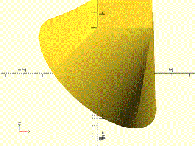
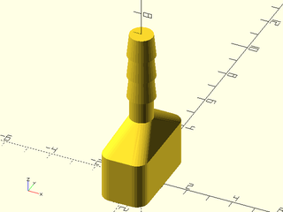
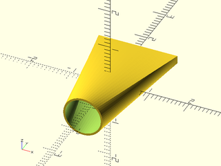
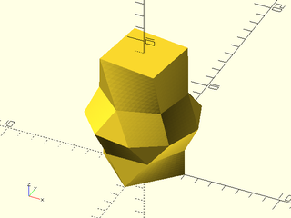
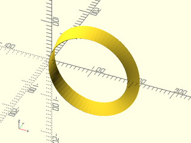
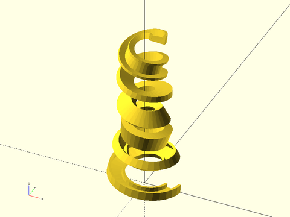
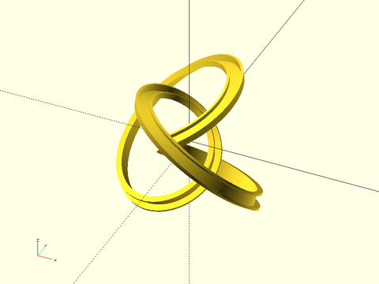
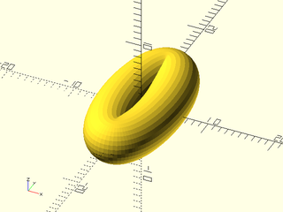

# LibFile: skin.scad

This file provides functions and modules that construct shapes from a list of cross sections.
In the case of skin() you specify each cross sectional shape yourself, and the number of
points can vary.  The various forms of sweep use a fixed shape, which may follow a path, or
be transformed in other ways to produce the list of cross sections.  In all cases it is the
user's responsibility to avoid creating a self-intersecting shape, which will produce
cryptic CGAL errors.  This file was inspired by list-comprehension-demos skin():
- https://github.com/openscad/list-comprehension-demos/blob/master/skin.scad

To use, add the following lines to the beginning of your file:

    include <BOSL2/std.scad>

## Table of Contents

1. [Section: Skin and sweep](#section-skin-and-sweep)
    - [`skin()`](#functionmodule-skin)
    - [`linear_sweep()`](#functionmodule-linear_sweep)
    - [`spiral_sweep()`](#functionmodule-spiral_sweep)
    - [`path_sweep()`](#functionmodule-path_sweep)
    - [`path_sweep2d()`](#functionmodule-path_sweep2d)
    - [`sweep()`](#functionmodule-sweep)

2. [Section: Functions for resampling and slicing profile lists](#section-functions-for-resampling-and-slicing-profile-lists)
    - [`subdivide_and_slice()`](#function-subdivide_and_slice)
    - [`slice_profiles()`](#function-slice_profiles)
    - [`rot_resample()`](#function-rot_resample)
    - [`associate_vertices()`](#function-associate_vertices)

## Section: Skin and sweep

### Function/Module: skin()

**Usage:** As module:

- skin(profiles, slices, [z=], [refine=], [method=], [sampling=], [caps=], [closed=], [style=], [convexity=], [anchor=],[cp=],[spin=],[orient=],[atype=]) {attachments};

**Usage:** As function:

- vnf = skin(profiles, slices, [z=], [refine=], [method=], [sampling=], [caps=], [closed=], [style=], [anchor=],[cp=],[spin=],[orient=],[atype=]);

**Description:** 

Given a list of two or more path `profiles` in 3d space, produces faces to skin a surface between
the profiles.  Optionally the first and last profiles can have endcaps, or the first and last profiles
can be connected together.  Each profile should be roughly planar, but some variation is allowed.
Each profile must rotate in the same clockwise direction.  If called as a function, returns a
[VNF structure](vnf.scad) `[VERTICES, FACES]`.  If called as a module, creates a polyhedron
 of the skinned profiles.

The profiles can be specified either as a list of 3d curves or they can be specified as
2d curves with heights given in the `z` parameter.  It is your responsibility to ensure
that the resulting polyhedron is free from self-intersections, which would make it invalid
and can result in cryptic CGAL errors upon rendering with a second object present, even though the polyhedron appears
OK during preview or when rendered by itself.

For this operation to be well-defined, the profiles must all have the same vertex count and
we must assume that profiles are aligned so that vertex `i` links to vertex `i` on all polygons.
Many interesting cases do not comply with this restriction.  Two basic methods can handle
these cases: either subdivide edges (insert additional points along edges)
or duplicate vertcies (insert edges of length 0) so that both polygons have
the same number of points.
Duplicating vertices allows two distinct points in one polygon to connect to a single point
in the other one, creating
triangular faces.  You can adjust non-matching polygons yourself
either by resampling them using `subdivide_path` or by duplicating vertices using
`repeat_entries`.  It is OK to pass a polygon that has the same vertex repeated, such as
a square with 5 points (two of which are identical), so that it can match up to a pentagon.
Such a combination would create a triangular face at the location of the duplicated vertex.
Alternatively, `skin` provides methods (described below) for inserting additional vertices
automatically to make incompatible paths match.

In order for skinned surfaces to look good it is usually necessary to use a fine sampling of
points on all of the profiles, and a large number of extra interpolated slices between the
profiles that you specify.  It is generally best if the triangles forming your polyhedron
are approximately equilateral.  The `slices` parameter specifies the number of slices to insert
between each pair of profiles, either a scalar to insert the same number everywhere, or a vector
to insert a different number between each pair.

Resampling may occur, depending on the `method` parameter, to make profiles compatible.
To force (possibly additional) resampling of the profiles to increase the point density you can set `refine=N`, which
will multiply the number of points on your profile by `N`.  You can choose between two resampling
schemes using the `sampling` option, which you can set to `"length"` or `"segment"`.
The length resampling method resamples proportional to length.
The segment method divides each segment of a profile into the same number of points.
This means that if you refine a profile with the "segment" method you will get N points
on each edge, but if you refine a profile with the "length" method you will get new points
distributed around the profile based on length, so small segments will get fewer new points than longer ones.
A uniform division may be impossible, in which case the code computes an approximation, which may result
in arbitrary distribution of extra points.  See `subdivide_path` for more details.
Note that when dealing with continuous curves it is always better to adjust the
sampling in your code to generate the desired sampling rather than using the `refine` argument.

You can choose from five methods for specifying alignment for incommensurate profiles.
The available methods are `"distance"`, `"fast_distance"`, `"tangent"`, `"direct"` and `"reindex"`.
It is useful to distinguish between continuous curves like a circle and discrete profiles
like a hexagon or star, because the algorithms' suitability depend on this distinction.

The default method for aligning profiles is `method="direct"`.
If you simply supply a list of compatible profiles it will link them up
exactly as you have provided them.  You may find that profiles you want to connect define the
right shapes but the point lists don't start from points that you want aligned in your skinned
polyhedron.  You can correct this yourself using `reindex_polygon`, or you can use the "reindex"
method which will look for the index choice that will minimize the length of all of the edges
in the polyhedron---in will produce the least twisted possible result.  This algorithm has quadratic
run time so it can be slow with very large profiles.

When the profiles are incommensurate, the "direct" and "reindex" resample them to match.  As noted above,
for continuous input curves, it is better to generate your curves directly at the desired sample size,
but for mapping between a discrete profile like a hexagon and a circle, the hexagon must be resampled
to match the circle.  When you use "direct" or "reindex" the default `sampling` value is
of `sampling="length"` to approximate a uniform length sampling of the profile.  This will generally
produce the natural result for connecting two continuously sampled profiles or a continuous
profile and a polygonal one.  However depending on your particular case,
`sampling="segment"` may produce a more pleasing result.  These two approaches differ only when
the segments of your input profiles have unequal length.

The "distance", "fast_distance" and "tangent" methods work by duplicating vertices to create
triangular faces.  In the skined object created by two polygons, every vertex of a polygon must
have an edge that connects to some vertex on the other one.  If you connect two squares this can be
accomplished with four edges, but if you want to connect a square to a pentagon you must add a
fifth edge for the "extra" vertex on the pentagon.  You must now decide which vertex on the square to
connect the "extra" edge to.  How do you decide where to put that fifth edge?  The "distance" method answers this
question by using an optimization: it minimizes the total length of all the edges connecting
the two polygons.   This algorithm generally produces a good result when both profiles are discrete ones with
a small number of vertices.  It is computationally intensive (O(N^3)) and may be
slow on large inputs.  The resulting surfaces generally have curved faces, so be
sure to select a sufficiently large value for `slices` and `refine`.  Note that for
this method, `sampling` must be set to `"segment"`, and hence this is the default setting.
Using sampling by length would ignore the repeated vertices and ruin the alignment.
The "fast_distance" method restricts the optimization by assuming that an edge should connect
vertex 0 of the two polygons.  This reduces the run time to O(N^2) and makes
the method usable on profiles with more points if you take care to index the inputs to match.

The `"tangent"` method generally produces good results when
connecting a discrete polygon to a convex, finely sampled curve.  Given a polygon and a curve, consider one edge
on the polygon.  Find a plane passing through the edge that is tangent to the curve.  The endpoints of the edge and
the point of tangency define a triangular face in the output polyhedron.  If you work your way around the polygon
edges, you can establish a series of triangular faces in this way, with edges linking the polygon to the curve.
You can then complete the edge assignment by connecting all the edges in between the triangular faces together,
with many edges meeting at each polygon vertex.  The result is an alternation of flat triangular faces with conical
curves joining them.  Another way to think about it is that it splits the points on the curve up into groups and
connects all the points in one group to the same vertex on the polygon.

The "tangent" method may fail if the curved profile is non-convex, or doesn't have enough points to distinguish
all of the tangent points from each other.    The algorithm treats whichever input profile has fewer points as the polygon
and the other one as the curve.  Using `refine` with this method will have little effect on the model, so
you should do it only for agreement with other profiles, and these models are linear, so extra slices also
have no effect.  For best efficiency set `refine=1` and `slices=0`.  As with the "distance" method, refinement
must be done using the "segment" sampling scheme to preserve alignment across duplicated points.
Note that the "tangent" method produces similar results to the "distance" method on curved inputs.  If this
method fails due to concavity, "fast_distance" may be a good option.

It is possible to specify `method` and `refine` as arrays, but it is important to observe
matching rules when you do this.  If a pair of profiles is connected using "tangent" or "distance"
then the `refine` values for those two profiles must be equal.  If a profile is connected by
a vertex duplicating method on one side and a resampling method on the other side, then
`refine` must be set so that the resulting number of vertices matches the number that is
used for the resampled profiles.  The best way to avoid confusion is to ensure that the
profiles connected by "direct" or "realign" all have the same number of points and at the
transition, the refined number of points matches.

**Arguments:** 

<abbr title="These args can be used by position or by name.">By&nbsp;Position</abbr> | What it does
-------------------- | ------------
`profiles`           | list of 2d or 3d profiles to be skinned.  (If 2d must also give `z`.)
`slices`             | scalar or vector number of slices to insert between each pair of profiles.  Set to zero to use only the profiles you provided.  Recommend starting with a value around 10.

<abbr title="These args must be used by name, ie: name=value">By&nbsp;Name</abbr> | What it does
-------------------- | ------------
`refine`             | resample profiles to this number of points per edge.  Can be a list to give a refinement for each profile.  Recommend using a value above 10 when using the "distance" or "fast_distance" methods.  Default: 1.
`sampling`           | sampling method to use with "direct" and "reindex" methods.  Can be "length" or "segment".  Ignored if any profile pair uses either the "distance", "fast_distance", or "tangent" methods.  Default: "length".
`closed`             | set to true to connect first and last profile (to make a torus).  Default: false
`caps`               | true to create endcap faces when closed is false.  Can be a length 2 boolean array.  Default is true if closed is false.
`method`             | method for connecting profiles, one of "distance", "fast_distance", "tangent", "direct" or "reindex".  Default: "direct".
`z`                  | array of height values for each profile if the profiles are 2d
`convexity`          | convexity setting for use with polyhedron.  (module only) Default: 10
`anchor`             | Translate so anchor point is at the origin.  Default: "origin"
`spin`               | Rotate this many degrees around Z axis after anchor.  Default: 0
`orient`             | Vector to rotate top towards after spin
`atype`              | Select "hull" or "intersect anchor types. Default: "hull"
`cp`                 | Centerpoint for determining "intersect" anchors or centering the shape.  Determintes the base of the anchor vector.  Can be "centroid", "mean", "box" or a 3D point.  Default: "centroid"
`style`              | vnf_vertex_array style.  Default: "min_edge"

**Example 1:** 

    include <BOSL2/std.scad>
    skin([octagon(4), circle($fn=70,r=2)], z=[0,3], slices=10);

  

**Example 2:** Rotating the pentagon place the zero index at different locations, giving a twist

 

    include <BOSL2/std.scad>
    skin([rot(90,p=pentagon(4)), circle($fn=80,r=2)], z=[0,3], slices=10);

**Example 3:** You can untwist it with the "reindex" method

 

    include <BOSL2/std.scad>
    skin([rot(90,p=pentagon(4)), circle($fn=80,r=2)], z=[0,3], slices=10, method="reindex");

**Example 4:** Offsetting the starting edge connects to circles in an interesting way:

    include <BOSL2/std.scad>
    circ = circle($fn=80, r=3);
    skin([circ, rot(110,p=circ)], z=[0,5], slices=20);

  

**Example 5:** 

 

    include <BOSL2/std.scad>
    skin([ yrot(37,p=path3d(circle($fn=128, r=4))), path3d(square(3),3)], method="reindex",slices=10);

**Example 6:** Ellipses connected with twist

    include <BOSL2/std.scad>
    ellipse = xscale(2.5,p=circle($fn=80));
    skin([ellipse, rot(45,p=ellipse)], z=[0,1.5], slices=10);

  

**Example 7:** Ellipses connected without a twist.  (Note ellipses stay in the same position: just the connecting edges are different.)

 

    include <BOSL2/std.scad>
    ellipse = xscale(2.5,p=circle($fn=80));
    skin([ellipse, rot(45,p=ellipse)], z=[0,1.5], slices=10, method="reindex");

**Example 8:** 

 

    include <BOSL2/std.scad>
    $fn=24;
    skin([
          yrot(0, p=yscale(2,p=path3d(circle(d=75)))),
          [[40,0,100], [35,-15,100], [20,-30,100],[0,-40,100],[-40,0,100],[0,40,100],[20,30,100], [35,15,100]]
    ],slices=10);

**Example 9:** 

 

    include <BOSL2/std.scad>
    $fn=48;
    skin([
        for (b=[0,90]) [
            for (a=[360:-360/$fn:0.01])
                point3d(polar_to_xy((100+50*cos((a+b)*2))/2,a),b/90*100)
        ]
    ], slices=20);

**Example 10:** Vaccum connector example from list-comprehension-demos

    include <BOSL2/std.scad>
    include <BOSL2/rounding.scad>
    $fn=32;
    base = round_corners(square([2,4],center=true), radius=0.5);
    skin([
        path3d(base,0),
        path3d(base,2),
        path3d(circle(r=0.5),3),
        path3d(circle(r=0.5),4),
        for(i=[0:2]) each [path3d(circle(r=0.6), i+4),
                           path3d(circle(r=0.5), i+5)]
    ],slices=0);

  

**Example 11:** Vaccum nozzle example from list-comprehension-demos, using "length" sampling (the default)

    include <BOSL2/std.scad>
    xrot(90)down(1.5)
    difference() {
        skin(
            [square([2,.2],center=true),
             circle($fn=64,r=0.5)], z=[0,3],
            slices=40,sampling="length",method="reindex");
        skin(
            [square([1.9,.1],center=true),
             circle($fn=64,r=0.45)], z=[-.01,3.01],
            slices=40,sampling="length",method="reindex");
    }

  

**Example 12:** Same thing with "segment" sampling

    include <BOSL2/std.scad>
    xrot(90)down(1.5)
    difference() {
        skin(
            [square([2,.2],center=true),
             circle($fn=64,r=0.5)], z=[0,3],
            slices=40,sampling="segment",method="reindex");
        skin(
            [square([1.9,.1],center=true),
             circle($fn=64,r=0.45)], z=[-.01,3.01],
            slices=40,sampling="segment",method="reindex");
    }

  

**Example 13:** Forma Candle Holder (from list-comprehension-demos)

 

    include <BOSL2/std.scad>
    r = 50;
    height = 140;
    layers = 10;
    wallthickness = 5;
    holeradius = r - wallthickness;
    difference() {
        skin([for (i=[0:layers-1]) zrot(-30*i,p=path3d(hexagon(ir=r),i*height/layers))],slices=0);
        up(height/layers) cylinder(r=holeradius, h=height);
    }

**Example 14:** A box that is octagonal on the outside and circular on the inside

 

    include <BOSL2/std.scad>
    height = 45;
    sub_base = octagon(d=71, rounding=2, $fn=128);
    base = octagon(d=75, rounding=2, $fn=128);
    interior = regular_ngon(n=len(base), d=60);
    right_half()
      skin([ sub_base, base, base, sub_base, interior], z=[0,2,height, height, 2], slices=0, refine=1, method="reindex");

**Example 15:** Connecting a pentagon and circle with the "tangent" method produces large triangular faces and cone shaped corners.

 

    include <BOSL2/std.scad>
    skin([pentagon(4), circle($fn=80,r=2)], z=[0,3], slices=10, method="tangent");

**Example 16:** rounding corners of a square.  Note that `$fn` makes the number of points constant, and avoiding the `rounding=0` case keeps everything simple.  In this case, the connections between profiles are linear, so there is no benefit to setting `slices` bigger than zero.

 

    include <BOSL2/std.scad>
    shapes = [for(i=[.01:.045:2])zrot(-i*180/2,cp=[-8,0,0],p=xrot(90,p=path3d(regular_ngon(n=4, side=4, rounding=i, $fn=64))))];
    rotate(180) skin( shapes, slices=0);

**Example 17:** Here's a simplified version of the above, with `i=0` included.  That first layer doesn't look good.

 

    include <BOSL2/std.scad>
    shapes = [for(i=[0:.2:1]) path3d(regular_ngon(n=4, side=4, rounding=i, $fn=32),i*5)];
    skin(shapes, slices=0);

**Example 18:** You can fix it by specifying "tangent" for the first method, but you still need "direct" for the rest.

 

    include <BOSL2/std.scad>
    shapes = [for(i=[0:.2:1]) path3d(regular_ngon(n=4, side=4, rounding=i, $fn=32),i*5)];
    skin(shapes, slices=0, method=concat(["tangent"],repeat("direct",len(shapes)-2)));

**Example 19:** Connecting square to pentagon using "direct" method.

 

    include <BOSL2/std.scad>
    skin([regular_ngon(n=4, r=4), regular_ngon(n=5,r=5)], z=[0,4], refine=10, slices=10);

**Example 20:** Connecting square to shifted pentagon using "direct" method.

 

    include <BOSL2/std.scad>
    skin([regular_ngon(n=4, r=4), right(4,p=regular_ngon(n=5,r=5))], z=[0,4], refine=10, slices=10);

**Example 21:** In this example reindexing does not fix the orientation of the triangle because it happens in 3d within skin(), so we have to reverse the triangle manually

 

    include <BOSL2/std.scad>
    ellipse = yscale(3,circle(r=10, $fn=32));
    tri = move([-50/3,-9],[[0,0], [50,0], [0,27]]);
    skin([ellipse, reverse(tri)], z=[0,20], slices=20, method="reindex");

**Example 22:** You can get a nicer transition by rotating the polygons for better alignment.  You have to resample yourself before calling `align_polygon`. The orientation is fixed so we do not need to reverse.

    include <BOSL2/std.scad>
    ellipse = yscale(3,circle(r=10, $fn=32));
    tri = move([-50/3,-9],
               subdivide_path([[0,0], [50,0], [0,27]], 32));
    aligned = align_polygon(ellipse,tri, [0:5:180]);
    skin([ellipse, aligned], z=[0,20], slices=20);

  

**Example 23:** The "distance" method is a completely different approach.

 

    include <BOSL2/std.scad>
    skin([regular_ngon(n=4, r=4), regular_ngon(n=5,r=5)], z=[0,4], refine=10, slices=10, method="distance");

**Example 24:** Connecting pentagon to heptagon inserts two triangular faces on each side

    include <BOSL2/std.scad>
    small = path3d(circle(r=3, $fn=5));
    big = up(2,p=yrot( 0,p=path3d(circle(r=3, $fn=7), 6)));
    skin([small,big],method="distance", slices=10, refine=10);

  

**Example 25:** But just a slight rotation of the top profile moves the two triangles to one end

    include <BOSL2/std.scad>
    small = path3d(circle(r=3, $fn=5));
    big = up(2,p=yrot(14,p=path3d(circle(r=3, $fn=7), 6)));
    skin([small,big],method="distance", slices=10, refine=10);

  

**Example 26:** Another "distance" example:

 

    include <BOSL2/std.scad>
    off = [0,2];
    shape = turtle(["right",45,"move", "left",45,"move", "left",45, "move", "jump", [.5+sqrt(2)/2,8]]);
    rshape = rot(180,cp=centroid(shape)+off, p=shape);
    skin([shape,rshape],z=[0,4], method="distance",slices=10,refine=15);

**Example 27:** Slightly shifting the profile changes the optimal linkage

 

    include <BOSL2/std.scad>
    off = [0,1];
    shape = turtle(["right",45,"move", "left",45,"move", "left",45, "move", "jump", [.5+sqrt(2)/2,8]]);
    rshape = rot(180,cp=centroid(shape)+off, p=shape);
    skin([shape,rshape],z=[0,4], method="distance",slices=10,refine=15);

**Example 28:** This optimal solution doesn't look terrible:

 

    include <BOSL2/std.scad>
    prof1 = path3d([[-50,-50], [-50,50], [50,50], [25,25], [50,0], [25,-25], [50,-50]]);
    prof2 = path3d(regular_ngon(n=7, r=50),100);
    skin([prof1, prof2], method="distance", slices=10, refine=10);

**Example 29:** But this one looks better.  The "distance" method doesn't find it because it uses two more edges, so it clearly has a higher total edge distance.  We force it by doubling the first two vertices of one of the profiles.

 

    include <BOSL2/std.scad>
    prof1 = path3d([[-50,-50], [-50,50], [50,50], [25,25], [50,0], [25,-25], [50,-50]]);
    prof2 = path3d(regular_ngon(n=7, r=50),100);
    skin([repeat_entries(prof1,[2,2,1,1,1,1,1]),
          prof2],
         method="distance", slices=10, refine=10);

**Example 30:** The "distance" method will often produces results similar to the "tangent" method if you use it with a polygon and a curve, but the results can also look like this:

 

    include <BOSL2/std.scad>
    skin([path3d(circle($fn=128, r=10)), xrot(39, p=path3d(square([8,10]),10))],  method="distance", slices=0);

**Example 31:** Using the "tangent" method produces:

 

    include <BOSL2/std.scad>
    skin([path3d(circle($fn=128, r=10)), xrot(39, p=path3d(square([8,10]),10))],  method="tangent", slices=0);

**Example 32:** Torus using hexagons and pentagons, where `closed=true`

 

    include <BOSL2/std.scad>
    hex = right(7,p=path3d(hexagon(r=3)));
    pent = right(7,p=path3d(pentagon(r=3)));
    N=5;
    skin(
         [for(i=[0:2*N-1]) yrot(360*i/2/N, p=(i%2==0 ? hex : pent))],
         refine=1,slices=0,method="distance",closed=true);

**Example 33:** A smooth morph is achieved when you can calculate all the slices yourself.  Since you provide all the slices, set `slices=0`.

 

    include <BOSL2/std.scad>
    skin([for(n=[.1:.02:.5])
             yrot(n*60-.5*60,p=path3d(supershape(step=360/128,m1=5,n1=n, n2=1.7),5-10*n))],
         slices=0);

**Example 34:** Another smooth supershape morph:

 

    include <BOSL2/std.scad>
    skin([for(alpha=[-.2:.05:1.5])
             path3d(supershape(step=360/256,m1=7, n1=lerp(2,3,alpha),
                               n2=lerp(8,4,alpha), n3=lerp(4,17,alpha)),alpha*5)],
         slices=0);

**Example 35:** Several polygons connected using "distance"

    include <BOSL2/std.scad>
    skin([regular_ngon(n=4, r=3),
          regular_ngon(n=6, r=3),
          regular_ngon(n=9, r=4),
          rot(17,p=regular_ngon(n=6, r=3)),
          rot(37,p=regular_ngon(n=4, r=3))],
         z=[0,2,4,6,9], method="distance", slices=10, refine=10);

  

**Example 36:** Vertex count of the polygon changes at every profile

 

    include <BOSL2/std.scad>
    skin([
        for (ang = [0:10:90])
        rot([0,ang,0], cp=[200,0,0], p=path3d(circle(d=100,$fn=12-(ang/10))))
    ],method="distance",slices=10,refine=10);

**Example 37:** Möbius Strip.  This is a tricky model because when you work your way around to the connection, the direction of the profiles is flipped, so how can the proper geometry be created?  The trick is to duplicate the first profile and turn the caps off.  The model closes up and forms a valid polyhedron.

 

    include <BOSL2/std.scad>
    skin([
      for (ang = [0:5:360])
      rot([0,ang,0], cp=[100,0,0], p=rot(ang/2, p=path3d(square([1,30],center=true))))
    ], caps=false, slices=0, refine=20);

**Example 38:** This model of two scutoids packed together is based on https://www.thingiverse.com/thing:3024272 by mathgrrl

 

    include <BOSL2/std.scad>
    sidelen = 10;  // Side length of scutoid
    height = 25;   // Height of scutoid
    angle = -15;   // Angle (twists the entire form)
    push = -5;     // Push (translates the base away from the top)
    flare = 1;     // Flare (the two pieces will be different unless this is 1)
    midpoint = .5; // Height of the extra vertex (as a fraction of total height); the two pieces will be different unless this is .5)
    pushvec = rot(angle/2,p=push*RIGHT);  // Push direction is the the average of the top and bottom mating edges
    pent = path3d(apply(move(pushvec)*rot(angle),pentagon(side=sidelen,align_side=RIGHT,anchor="side0")));
    hex = path3d(hexagon(side=flare*sidelen, align_side=RIGHT, anchor="side0"),height);
    pentmate = path3d(pentagon(side=flare*sidelen,align_side=LEFT,anchor="side0"),height);
              // Native index would require mapping first and last vertices together, which is not allowed, so shift
    hexmate = list_rotate(
                            path3d(apply(move(pushvec)*rot(angle),hexagon(side=sidelen,align_side=LEFT,anchor="side0"))),
                            -1);
    join_vertex = lerp(
                        mean(select(hex,1,2)),     // midpoint of "extra" hex edge
                        mean(select(hexmate,0,1)), // midpoint of "extra" hexmate edge
                        midpoint);
    augpent = repeat_entries(pent, [1,2,1,1,1]);         // Vertex 1 will split at the top forming a triangular face with the hexagon
    augpent_mate = repeat_entries(pentmate,[2,1,1,1,1]); // For mating pentagon it is vertex 0 that splits
               // Middle is the interpolation between top and bottom except for the join vertex, which is doubled because it splits
    middle = list_set(lerp(augpent,hex,midpoint),[1,2],[join_vertex,join_vertex]);
    middle_mate = list_set(lerp(hexmate,augpent_mate,midpoint), [0,1], [join_vertex,join_vertex]);
    skin([augpent,middle,hex],  slices=10, refine=10, sampling="segment");
    color("green")skin([augpent_mate,middle_mate,hexmate],  slices=10,refine=10, sampling="segment");

**Example 39:** If you create a self-intersecting polyhedron the result is invalid.  In some cases self-intersection may be obvous.  Here is a more subtle example.

 

    include <BOSL2/std.scad>
    skin([
           for (a = [0:30:180]) let(
               pos  = [-60*sin(a),     0, a    ],
               pos2 = [-60*sin(a+0.1), 0, a+0.1]
           ) move(pos,
               p=rot(from=UP, to=pos2-pos,
                   p=path3d(circle(d=150))
               )
           )
       ],refine=1,slices=0);
       color("red") {
           zrot(25) fwd(130) xrot(75) {
               linear_extrude(height=0.1) {
                   ydistribute(25) {
                       text(text="BAD POLYHEDRONS!", size=20, halign="center", valign="center");
                       text(text="CREASES MAKE", size=20, halign="center", valign="center");
                   }
               }
           }
           up(160) zrot(25) fwd(130) xrot(75) {
               stroke(zrot(30, p=yscale(0.5, p=circle(d=120))),width=10,closed=true);
           }
       }

---

### Function/Module: linear\_sweep()

**Usage:** 

- linear\_sweep(region, height, [center], [slices], [twist], [scale], [style], [convexity]) {attachments};

**Description:** 

If called as a module, creates a polyhedron that is the linear extrusion of the given 2D region or polygon.
If called as a function, returns a VNF that can be used to generate a polyhedron of the linear extrusion
of the given 2D region or polygon.  The benefit of using this, over using `linear_extrude region(rgn)` is
that it supports `anchor`, `spin`, `orient` and attachments.  You can also make more refined
twisted extrusions by using `maxseg` to subsample flat faces.
Note that the center option centers vertically using the named anchor "zcenter" whereas
`anchor=CENTER` centers the entire shape relative to
the shape's centroid, or other centerpoint you specify.  The centerpoint can be "centroid", "mean", "box" or
a custom point location.

**Arguments:** 

<abbr title="These args can be used by position or by name.">By&nbsp;Position</abbr> | What it does
-------------------- | ------------
`region`             | The 2D [Region](regions.scad) or polygon that is to be extruded.
`height`             | The height to extrude the region.  Default: 1
`center`             | If true, the created polyhedron will be vertically centered.  If false, it will be extruded upwards from the XY plane.  Default: `false`
`slices`             | The number of slices to divide the shape into along the Z axis, to allow refinement of detail, especially when working with a twist.  Default: `twist/5`
`maxseg`             | If given, then any long segments of the region will be subdivided to be shorter than this length.  This can refine twisting flat faces a lot.  Default: `undef` (no subsampling)
`twist`              | The number of degrees to rotate the shape clockwise around the Z axis, as it rises from bottom to top.  Default: 0
`scale`              | The amount to scale the shape, from bottom to top.  Default: 1
`style`              | The style to use when triangulating the surface of the object.  Valid values are `"default"`, `"alt"`, or `"quincunx"`.
`convexity`          | Max number of surfaces any single ray could pass through.  Module use only.
`anchor`             | Translate so anchor point is at origin (0,0,0).  See [anchor](attachments.scad#subsection-anchor).  Default: `"origin"`
`atype`              | Set to "hull" or "intersect" to select anchor type.  Default: "hull"
`cp`                 | Centerpoint for determining intersection anchors or centering the shape.  Determintes the base of the anchor vector.  Can be "centroid", "mean", "box" or a 3D point.  Default: "centroid"
`spin`               | Rotate this many degrees around the Z axis after anchor.  See [spin](attachments.scad#subsection-spin).  Default: `0`
`orient`             | Vector to rotate top towards, after spin.  See [orient](attachments.scad#subsection-orient).  Default: `UP`

**Example 1:** Extruding a Compound Region.

 

    include <BOSL2/std.scad>
    rgn1 = [for (d=[10:10:60]) circle(d=d,$fn=8)];
    rgn2 = [square(30,center=false)];
    rgn3 = [for (size=[10:10:20]) move([15,15],p=square(size=size, center=true))];
    mrgn = union(rgn1,rgn2);
    orgn = difference(mrgn,rgn3);
    linear_sweep(orgn,height=20,convexity=16);

**Example 2:** With Twist, Scale, Slices and Maxseg.

 

    include <BOSL2/std.scad>
    rgn1 = [for (d=[10:10:60]) circle(d=d,$fn=8)];
    rgn2 = [square(30,center=false)];
    rgn3 = [for (size=[10:10:20]) move([15,15],p=square(size=size, center=true))];
    mrgn = union(rgn1,rgn2);
    orgn = difference(mrgn,rgn3);
    linear_sweep(orgn,height=50,maxseg=2,slices=40,twist=180,scale=0.5,convexity=16);

**Example 3:** Anchors on an Extruded Region

 

    include <BOSL2/std.scad>
    rgn1 = [for (d=[10:10:60]) circle(d=d,$fn=8)];
    rgn2 = [square(30,center=false)];
    rgn3 = [for (size=[10:10:20]) move([15,15],p=square(size=size, center=true))];
    mrgn = union(rgn1,rgn2);
    orgn = difference(mrgn,rgn3);
    linear_sweep(orgn,height=20,convexity=16) show_anchors();

---

### Function/Module: spiral\_sweep()

**Usage:** 

- spiral\_sweep(poly, h, r, turns, [higbee], [center], [r1], [r2], [d], [d1], [d2], [higbee1], [higbee2], [internal], [anchor], [spin], [orient]);
- vnf = spiral\_sweep(poly, h, r, turns, ...);

**Description:** 

Takes a closed 2D polygon path, centered on the XY plane, and sweeps/extrudes it along a 3D spiral path
of a given radius, height and degrees of rotation.  The origin in the profile traces out the helix of the specified radius.
If turns is positive the path will be right-handed;  if turns is negative the path will be left-handed.

Higbee specifies tapering applied to the ends of the extrusion and is given as the linear distance
over which to taper.

**Arguments:** 

<abbr title="These args can be used by position or by name.">By&nbsp;Position</abbr> | What it does
-------------------- | ------------
`poly`               | Array of points of a polygon path, to be extruded.
`h`                  | height of the spiral to extrude along.
`r`                  | Radius of the spiral to extrude along. Default: 50
`turns`              | number of revolutions to spiral up along the height.

<abbr title="These args must be used by name, ie: name=value">By&nbsp;Name</abbr> | What it does
-------------------- | ------------
`d`                  | Diameter of the spiral to extrude along.
`higbee`             | Length to taper thread ends over.
`higbee1`            | Taper length at start
`higbee2`            | Taper length at end
`internal`           | direction to taper the threads with higbee.  If true threads taper outward; if false they taper inward.   Default: false
`anchor`             | Translate so anchor point is at origin (0,0,0).  See [anchor](attachments.scad#subsection-anchor).  Default: `CENTER`
`spin`               | Rotate this many degrees around the Z axis after anchor.  See [spin](attachments.scad#subsection-spin).  Default: `0`
`orient`             | Vector to rotate top towards, after spin.  See [orient](attachments.scad#subsection-orient).  Default: `UP`
`center`             | If given, overrides `anchor`.  A true value sets `anchor=CENTER`, false sets `anchor=BOTTOM`.

**Example 1:** 

    include <BOSL2/std.scad>
    poly = [[-10,0], [-3,-5], [3,-5], [10,0], [0,-30]];
    spiral_sweep(poly, h=200, r=50, turns=3, $fn=36);

  

---

### Function/Module: path\_sweep()

**Usage:** As module

- path\_sweep(shape, path, [method], [normal=], [closed=], [twist=], [twist\_by\_length=], [symmetry=], [last\_normal=], [tangent=], [uniform=], [relaxed=], [caps=], [style=], [convexity=], [anchor=], [cp=], [spin=], [orient=], [atype=]) {attachments};

**Usage:** As function

- vnf = path\_sweep(shape, path, [method], [normal=], [closed=], [twist=], [twist\_by\_length=], [symmetry=], [last\_normal=], [tangent=], [uniform=], [relaxed=], [caps=], [style=], [transforms=], [anchor=], [cp=], [spin=], [orient=], [atype=]) {attachments};

**Description:** 

Takes as input `shape`, a 2D polygon path (list of points), and `path`, a 2d or 3d path (also a list of points)
and constructs a polyhedron by sweeping the shape along the path. When run as a module returns the polyhedron geometry.
When run as a function returns a VNF by default or if you set `transforms=true` then it returns a list of transformations suitable as input to `sweep`.

The sweeping process places one copy of the shape for each point in the path.  The origin in `shape` is translated to
the point in `path`.  The normal vector of the shape, which points in the Z direction, is aligned with the tangent
vector for the path, so this process is constructing a shape whose normal cross sections are equal to your specified shape.
If you do not supply a list of tangent vectors then an approximate tangent vector is computed
based on the path points you supply using [`path_tangents()`](paths.scad#function-path_tangents).

**Figure 1:** This example shows how the shape, in this case the quadrilateral defined by `[[0, 0], [0, 1], [0.25, 1], [1, 0]]`, appears as the cross section of the swept polyhedron.  The blue line shows the path.  The normal vector to the shape is shown in black; it is based at the origin and points upwards in the Z direction.  The sweep aligns this normal vector with the blue path tangent, which in this case, flips the shape around.  Note that for a 2D path like this one, the Y direction in the shape is mapped to the Z direction in the sweep.

 

**Figure 2:** The same sweep operation with the path traveling in the opposite direction.  Note that in order to line up the normal correctly, the shape is reversed compared to Figure 1, so the resulting sweep looks quite different.

 

If your shape is too large for the curves in the path you can create a situation where the shapes cross each
other.  This results in an invalid polyhedron, which may appear OK when previewed or rendered alone, but will give rise
to cryptic CGAL errors when rendered with a second object in your model.  You may be able to use [`path_sweep2d()`](#functionmodule-path_sweep2d)
to produce a valid model in cases like this.  You can debug models like this using the `profiles=true` option which will show all
the cross sections in your polyhedron.  If any of them intersect, the polyhedron will be invalid.

**Figure 3:** We have scaled the path to an ellipse and show a large triangle as the shape.  The triangle is sometimes bigger than the local radius of the path, leading to an invalid polyhedron, which you can identify because the red lines cross in the middle.

 

When performing a path sweep, the normal vector of the shape aligns with the tangent vector of the
path, but this leaves an ambiguity about how the shape is rotated.  For 2D paths it is easy to resolve
this ambiguity by aligning the Y axis in the shape to the Z axis in the swept polyhedron.  We can force the
shape to twist with the `twist` parameter and get a result like the one shown below.

**Figure 4:** The shape twists as we sweep.  Note that it still aligns the origin in the shape with the path, and still aligns the normal vector with the path tangent vector.

 

When the path is full three-dimensional, things can become more complex.  It is no longer possible to use a simple
alignment rule like the one we use in 2D.  You may find that the shape rotates
unexpectedly around its axis as it traverses the path.  The `method` parameter allows you to specify how the shapes
are aligned, resulting in different twist in the resulting polyhedron.  You can choose from three different methods
for selecting the rotation of your shape.  None of these methods will produce good, or even valid, results on all
inputs, so it is important to select a suitable method.

The three methods you can choose using the `method` parameter are:

The "incremental" method (the default) works by adjusting the shape at each step by the minimal rotation that makes the shape normal to the tangent
at the next point.  This method is robust in that it always produces a valid result for well-behaved paths with sufficiently high
sampling.  Unfortunately, it can produce a large amount of undesirable twist.  When constructing a closed shape this algorithm in
its basic form provides no guarantee that the start and end shapes match up.  To prevent a sudden twist at the last segment,
the method calculates the required twist for a good match and distributes it over the whole model (as if you had specified a
twist amount).  By default the end shape is required to match the starting shape exactly, but if your shape as rotational
symmetry you can specify this using the `symmetry` argument, and then a smaller amount of twist is needed to make this adjustment.
The symmetry argument gives the number of rotations that map the shape exactly onto itself, so a pentagon has 5-fold symmetry.
This argument is only valid for closed sweeps.  To start the algorithm, we need an initial condition.  This is supplied by
using the `normal` argument to give a direction to align the Y axis of your shape.  By default the normal points UP if the path
makes an angle of 45 deg or less with the xy plane and it points BACK if the path makes a higher angle with the XY plane.  You
can also supply `last_normal` which provides an ending orientation constraint.  Be aware that the curve may still exhibit
twisting in the middle.  This method is the default because it is the most robust, not because it generally produces the best result.

The "natural" method works by computing the Frenet frame at each point on the path.  This is defined by the tangent to the curve and
the normal which lies in the plane defined by the curve at each point.  This normal points in the direction of curvature of the curve.
The result is a very well behaved set of shape positions without any unexpected twisting---as long as the curvature never falls to zero.  At a
point of zero curvature (a flat point), the curve does not define a plane and the natural normal is not defined.  Furthermore, even if
you skip over this troublesome point so the normal is defined, it can change direction abruptly when the curvature is zero, leading to
a nasty twist and an invalid model.  A simple example is a circular arc joined to another arc that curves the other direction.  Note
that the X axis of the shape is aligned with the normal from the Frenet frame.

The "manual" method allows you to specify your desired normal either globally with a single vector, or locally with
a list of normal vectors for every path point.  The normal you supply is projected to be orthogonal to the tangent to the
path and the Y direction of your shape will be aligned with the projected normal.  (Note this is different from the "natural" method.)
Careless choice of a normal may result in a twist in the shape, or an error if your normal is parallel to the path tangent.
If you set `relax=true` then the condition that the cross sections are orthogonal to the path is relaxed and the swept object
uses the actual specified normal.  In this case, the tangent is projected to be orthogonal to your supplied normal to define
the cross section orientation.  Specifying a list of normal vectors gives you complete control over the orientation of your
cross sections and can be useful if you want to position your model to be on the surface of some solid.

For any method you can use the `twist` argument to add the specified number of degrees of twist into the model.
If the model is closed then the twist must be a multiple of 360/symmetry.  The twist is normally spread uniformly along your shape
based on the path length.  If you set `twist_by_length` to false then the twist will be uniform based on the point count of your path.
Twisted shapes will produce twisted faces, so if you want them to look good you should use lots of points on your path and also
lots of points on the shape.  If your shape is a simple polygon, use {{subdivide_path()}} or [`subdivide_long_segments()`](paths.scad#function-subdivide_long_segments) to
increase the number of points.

**Arguments:** 

<abbr title="These args can be used by position or by name.">By&nbsp;Position</abbr> | What it does
-------------------- | ------------
`shape`              | A 2D polygon path or region describing the shape to be swept.
`path`               | 2D or 3D path giving the path to sweep over
`method`             | one of "incremental", "natural" or "manual".  Default: "incremental"

<abbr title="These args must be used by name, ie: name=value">By&nbsp;Name</abbr> | What it does
-------------------- | ------------
`normal`             | normal vector for initializing the incremental method, or for setting normals with method="manual".  Default: UP if the path makes an angle lower than 45 degrees to the xy plane, BACK otherwise.
`closed`             | path is a closed loop.  Default: false
`twist`              | amount of twist to add in degrees.  For closed sweeps must be a multiple of 360/symmetry.  Default: 0
`symmetry`           | symmetry of the shape when closed=true.  Allows the shape to join with a 360/symmetry rotation instead of a full 360 rotation.  Default: 1
`last_normal`        | normal to last point in the path for the "incremental" method.  Constrains the orientation of the last cross section if you supply it.
`uniform`            | if set to false then compute tangents using the uniform=false argument, which may give better results when your path is non-uniformly sampled.  This argument is passed to [`path_tangents()`](paths.scad#function-path_tangents).  Default: true
`tangent`            | a list of tangent vectors in case you need more accuracy (particularly at the end points of your curve)
`relaxed`            | set to true with the "manual" method to relax the orthogonality requirement of cross sections to the path tangent.  Default: false
`caps`               | Can be a boolean or vector of two booleans.  Set to false to disable caps at the two ends.  Default: true
`style`              | vnf_vertex_array style.  Default: "min_edge"
`profiles`           | if true then display all the cross section profiles instead of the solid shape.  Can help debug a sweep.  (module only) Default: false
`width`              | the width of lines used for profile display.  (module only) Default: 1
`transforms`         | set to true to return transforms instead of a VNF.  These transforms can be manipulated and passed to sweep().  (function only)  Default: false.
`convexity`          | convexity parameter for polyhedron().  (module only)  Default: 10
`anchor`             | Translate so anchor point is at the origin. Default: "origin"
`spin`               | Rotate this many degrees around Z axis after anchor. Default: 0
`orient`             | Vector to rotate top towards after spin
`atype`              | Select "hull" or "intersect" anchor types.  Default: "hull"
`cp`                 | Centerpoint for determining "intersect" anchors or centering the shape.  Determintes the base of the anchor vector.  Can be "centroid", "mean", "box" or a 3D point.  Default: "centroid"

**Example 1:** A simple sweep of a square along a sine wave:

    include <BOSL2/std.scad>
    path = [for(theta=[-180:5:180]) [theta/10, 10*sin(theta)]];
    sq = square(6,center=true);
    path_sweep(sq,path);

  

**Example 2:** If the square is not centered, then we get a different result because the shape is in a different place relative to the origin:

    include <BOSL2/std.scad>
    path = [for(theta=[-180:5:180]) [theta/10, 10*sin(theta)]];
    sq = square(6);
    path_sweep(sq,path);

  

**Example 3:** It may not be obvious, but the polyhedron in the previous example is invalid.  It will eventually give CGAL errors when you combine it with other shapes.  To see this, set profiles to true and look at the left side.  The profiles cross each other and intersect.  Any time this happens, your polyhedron is invalid, even if it seems to be working at first.  Another observation from the profile display is that we have more profiles than needed over a lot of the shape, so if the model is slow, using fewer profiles in the flat portion of the curve might speed up the calculation.

 

    include <BOSL2/std.scad>
    path = [for(theta=[-180:5:180]) [theta/10, 10*sin(theta)]];
    sq = square(6);
    path_sweep(sq,path,profiles=true,width=.1,$fn=8);

**Example 4:** We'll use this shape in several examples

 

    include <BOSL2/std.scad>
    ushape = [[-10, 0],[-10, 10],[ -7, 10],[ -7, 2],[  7, 2],[  7, 7],[ 10, 7],[ 10, 0]];
    polygon(ushape);

**Example 5:** Sweep along a clockwise elliptical arc, using default "incremental" method.

 

    include <BOSL2/std.scad>
    ushape = [[-10, 0],[-10, 10],[ -7, 10],[ -7, 2],[  7, 2],[  7, 7],[ 10, 7],[ 10, 0]];
    elliptic_arc = xscale(2, p=arc($fn=64,angle=[180,00], r=30));  // Clockwise
    path_sweep(ushape, path3d(elliptic_arc));

**Example 6:** Sweep along a counter-clockwise elliptical arc.  Note that the orientation of the shape flips.

 

    include <BOSL2/std.scad>
    ushape = [[-10, 0],[-10, 10],[ -7, 10],[ -7, 2],[  7, 2],[  7, 7],[ 10, 7],[ 10, 0]];
    elliptic_arc = xscale(2, p=arc($fn=64,angle=[0,180], r=30));   // Counter-clockwise
    path_sweep(ushape, path3d(elliptic_arc));

**Example 7:** Sweep along a clockwise elliptical arc, using "natural" method, which lines up the X axis of the shape with the direction of curvature.  This means the X axis will point inward, so a counterclockwise arc gives:

 

    include <BOSL2/std.scad>
    ushape = [[-10, 0],[-10, 10],[ -7, 10],[ -7, 2],[  7, 2],[  7, 7],[ 10, 7],[ 10, 0]];
    elliptic_arc = xscale(2, p=arc($fn=64,angle=[0,180], r=30));  // Counter-clockwise
    path_sweep(ushape, elliptic_arc, method="natural");

**Example 8:** Sweep along a clockwise elliptical arc, using "natural" method.  If the curve is clockwise then the shape flips upside-down to align the X axis.

 

    include <BOSL2/std.scad>
    ushape = [[-10, 0],[-10, 10],[ -7, 10],[ -7, 2],[  7, 2],[  7, 7],[ 10, 7],[ 10, 0]];
    elliptic_arc = xscale(2, p=arc($fn=64,angle=[180,0], r=30));  // Clockwise
    path_sweep(ushape, path3d(elliptic_arc), method="natural");

**Example 9:** Sweep along a clockwise elliptical arc, using "manual" method.  You can orient the shape in a direction you choose (subject to the constraint that the profiles remain normal to the path):

 

    include <BOSL2/std.scad>
    ushape = [[-10, 0],[-10, 10],[ -7, 10],[ -7, 2],[  7, 2],[  7, 7],[ 10, 7],[ 10, 0]];
    elliptic_arc = xscale(2, p=arc($fn=64,angle=[180,0], r=30));  // Clockwise
    path_sweep(ushape, path3d(elliptic_arc), method="manual", normal=UP+RIGHT);

**Example 10:** Here we changed the ellipse to be more pointy, and with the same results as above we get a shape with an irregularity in the middle where it maintains the specified direction around the point of the ellipse.  If the ellipse were more pointing, this would result in a bad polyhedron:

 

    include <BOSL2/std.scad>
    ushape = [[-10, 0],[-10, 10],[ -7, 10],[ -7, 2],[  7, 2],[  7, 7],[ 10, 7],[ 10, 0]];
    elliptic_arc = yscale(2, p=arc($fn=64,angle=[180,0], r=30));  // Clockwise
    path_sweep(ushape, path3d(elliptic_arc), method="manual", normal=UP+RIGHT);

**Example 11:** It is easy to produce an invalid shape when your path has a smaller radius of curvature than the width of your shape.  The exact threshold where the shape becomes invalid depends on the density of points on your path.  The error may not be immediately obvious, as the swept shape appears fine when alone in your model, but adding a cube to the model reveals the problem.  In this case the pentagon is turned so its longest direction points inward to create the singularity.

 

    include <BOSL2/std.scad>
    qpath = [for(x=[-3:.01:3]) [x,x*x/1.8,0]];
    echo(radius_of_curvature = 1/max(path_curvature(qpath)));   // Prints 0.9, but we use pentagon with radius of 1.0 > 0.9
    path_sweep(apply(rot(90),pentagon(r=1)), qpath, normal=BACK, method="manual");
    cube(0.5);    // Adding a small cube forces a CGAL computation which reveals the error by displaying nothing or giving a cryptic message

**Example 12:** Using the `relax` option we allow the profiles to deviate from orthogonality to the path.  This eliminates the crease that broke the previous example because the sections are all parallel to each other.

 

    include <BOSL2/std.scad>
    qpath = [for(x=[-3:.01:3]) [x,x*x/1.8,0]];
    path_sweep(apply(rot(90),pentagon(r=1)), qpath, normal=BACK, method="manual", relaxed=true);
    cube(0.5);    // Adding a small cube is not a problem with this valid model

**Example 13:** Using the `profiles=true` option can help debug bad polyhedra such as this one.  If any of the profiles intersect or cross each other, the polyhedron will be invalid.  In this case, you can see these intersections in the middle of the shape, which may give insight into how to fix your shape.   The profiles may also help you identify cases with a valid polyhedron where you have more profiles than needed to adequately define the shape.

 

    include <BOSL2/std.scad>
    tri= scale([4.5,2.5],[[0, 0], [0, 1], [1, 0]]);
    path = left(4,xscale(1.5,arc(r=5,N=25,angle=[-70,70])));
    path_sweep(tri,path,profiles=true,width=.1);

**Example 14:** This 3d arc produces a result that twists to an undefined angle.  By default the incremental method sets the starting normal to UP, but the ending normal is unconstrained.

 

    include <BOSL2/std.scad>
    ushape = [[-10, 0],[-10, 10],[ -7, 10],[ -7, 2],[  7, 2],[  7, 7],[ 10, 7],[ 10, 0]];
    arc = yrot(37, p=path3d(arc($fn=64, r=30, angle=[0,180])));
    path_sweep(ushape, arc, method="incremental");

**Example 15:** You can constrain the last normal as well.  Here we point it right, which produces a nice result.

 

    include <BOSL2/std.scad>
    ushape = [[-10, 0],[-10, 10],[ -7, 10],[ -7, 2],[  7, 2],[  7, 7],[ 10, 7],[ 10, 0]];
    arc = yrot(37, p=path3d(arc($fn=64, r=30, angle=[0,180])));
    path_sweep(ushape, arc, method="incremental", last_normal=RIGHT);

**Example 16:** Here we constrain the last normal to UP.  Be aware that the behavior in the middle is unconstrained.

 

    include <BOSL2/std.scad>
    ushape = [[-10, 0],[-10, 10],[ -7, 10],[ -7, 2],[  7, 2],[  7, 7],[ 10, 7],[ 10, 0]];
    arc = yrot(37, p=path3d(arc($fn=64, r=30, angle=[0,180])));
    path_sweep(ushape, arc, method="incremental", last_normal=UP);

**Example 17:** The "natural" method produces a very different result

 

    include <BOSL2/std.scad>
    ushape = [[-10, 0],[-10, 10],[ -7, 10],[ -7, 2],[  7, 2],[  7, 7],[ 10, 7],[ 10, 0]];
    arc = yrot(37, p=path3d(arc($fn=64, r=30, angle=[0,180])));
    path_sweep(ushape, arc, method="natural");

**Example 18:** When the path starts at an angle of more that 45 deg to the xy plane the initial normal for "incremental" is BACK.  This produces the effect of the shape rising up out of the xy plane.  (Using UP for a vertical path is invalid, hence the need for a split in the defaults.)

 

    include <BOSL2/std.scad>
    ushape = [[-10, 0],[-10, 10],[ -7, 10],[ -7, 2],[  7, 2],[  7, 7],[ 10, 7],[ 10, 0]];
    arc = xrot(75, p=path3d(arc($fn=64, r=30, angle=[0,180])));
    path_sweep(ushape, arc, method="incremental");

**Example 19:** Adding twist

    include <BOSL2/std.scad>
    // Counter-clockwise
    elliptic_arc = xscale(2, p=arc($fn=64,angle=[0,180], r=3));
    path_sweep(pentagon(r=1), path3d(elliptic_arc), twist=72);

  

**Example 20:** Closed shape

    include <BOSL2/std.scad>
    ellipse = xscale(2, p=circle($fn=64, r=3));
    path_sweep(pentagon(r=1), path3d(ellipse), closed=true);

  

**Example 21:** Closed shape with added twist

    include <BOSL2/std.scad>
    ellipse = xscale(2, p=circle($fn=64, r=3));
    // Looks better with finer sampling
    pentagon = subdivide_path(pentagon(r=1), 30);
    path_sweep(pentagon, path3d(ellipse),
               closed=true, twist=360);

  

**Example 22:** The last example was a lot of twist.  In order to use less twist you have to tell `path_sweep` that your shape has symmetry, in this case 5-fold.  Mobius strip with pentagon cross section:

    include <BOSL2/std.scad>
    ellipse = xscale(2, p=circle($fn=64, r=3));
    // Looks better with finer sampling
    pentagon = subdivide_path(pentagon(r=1), 30);
    path_sweep(pentagon, path3d(ellipse), closed=true,
               symmetry = 5, twist=2*360/5);

  

**Example 23:** A helical path reveals the big problem with the "incremental" method: it can introduce unexpected and extreme twisting.  (Note helix example came from list-comprehension-demos)

 

    include <BOSL2/std.scad>
    function helix(t) = [(t / 1.5 + 0.5) * 30 * cos(6 * 360 * t),
                         (t / 1.5 + 0.5) * 30 * sin(6 * 360 * t),
                          200 * (1 - t)];
    helix_steps = 200;
    helix = [for (i=[0:helix_steps]) helix(i/helix_steps)];
    ushape = [[-10, 0],[-10, 10],[ -7, 10],[ -7, 2],[  7, 2],[  7, 7],[ 10, 7],[ 10, 0]];
    path_sweep(ushape, helix);

**Example 24:** You can constrain both ends, but still the twist remains:

 

    include <BOSL2/std.scad>
    function helix(t) = [(t / 1.5 + 0.5) * 30 * cos(6 * 360 * t),
                         (t / 1.5 + 0.5) * 30 * sin(6 * 360 * t),
                          200 * (1 - t)];
    helix_steps = 200;
    helix = [for (i=[0:helix_steps]) helix(i/helix_steps)];
    ushape = [[-10, 0],[-10, 10],[ -7, 10],[ -7, 2],[  7, 2],[  7, 7],[ 10, 7],[ 10, 0]];
    path_sweep(ushape, helix, normal=UP, last_normal=UP);

**Example 25:** Even if you manually guess the amount of twist and remove it, the result twists one way and then the other:

 

    include <BOSL2/std.scad>
    function helix(t) = [(t / 1.5 + 0.5) * 30 * cos(6 * 360 * t),
                         (t / 1.5 + 0.5) * 30 * sin(6 * 360 * t),
                          200 * (1 - t)];
    helix_steps = 200;
    helix = [for (i=[0:helix_steps]) helix(i/helix_steps)];
    ushape = [[-10, 0],[-10, 10],[ -7, 10],[ -7, 2],[  7, 2],[  7, 7],[ 10, 7],[ 10, 0]];
    path_sweep(ushape, helix, normal=UP, last_normal=UP, twist=360);

**Example 26:** To get a good result you must use a different method.

 

    include <BOSL2/std.scad>
    function helix(t) = [(t / 1.5 + 0.5) * 30 * cos(6 * 360 * t),
                         (t / 1.5 + 0.5) * 30 * sin(6 * 360 * t),
                          200 * (1 - t)];
    helix_steps = 200;
    helix = [for (i=[0:helix_steps]) helix(i/helix_steps)];
    ushape = [[-10, 0],[-10, 10],[ -7, 10],[ -7, 2],[  7, 2],[  7, 7],[ 10, 7],[ 10, 0]];
    path_sweep(ushape, helix, method="natural");

**Example 27:** Note that it may look like the shape above is flat, but the profiles are very slightly tilted due to the nonzero torsion of the curve.  If you want as flat as possible, specify it so with the "manual" method:

 

    include <BOSL2/std.scad>
    function helix(t) = [(t / 1.5 + 0.5) * 30 * cos(6 * 360 * t),
                         (t / 1.5 + 0.5) * 30 * sin(6 * 360 * t),
                          200 * (1 - t)];
    helix_steps = 200;
    helix = [for (i=[0:helix_steps]) helix(i/helix_steps)];
    ushape = [[-10, 0],[-10, 10],[ -7, 10],[ -7, 2],[  7, 2],[  7, 7],[ 10, 7],[ 10, 0]];
    path_sweep(ushape, helix, method="manual", normal=UP);

**Example 28:** What if you want to angle the shape inward?  This requires a different normal at every point in the path:

 

    include <BOSL2/std.scad>
    function helix(t) = [(t / 1.5 + 0.5) * 30 * cos(6 * 360 * t),
                         (t / 1.5 + 0.5) * 30 * sin(6 * 360 * t),
                          200 * (1 - t)];
    helix_steps = 200;
    helix = [for (i=[0:helix_steps]) helix(i/helix_steps)];
    normals = [for(i=[0:helix_steps]) [-cos(6*360*i/helix_steps), -sin(6*360*i/helix_steps), 2.5]];
    ushape = [[-10, 0],[-10, 10],[ -7, 10],[ -7, 2],[  7, 2],[  7, 7],[ 10, 7],[ 10, 0]];
    path_sweep(ushape, helix, method="manual", normal=normals);

**Example 29:** When using "manual" it is important to choose a normal that works for the whole path, producing a consistent result.  Here we have specified an upward normal, and indeed the shape is pointed up everywhere, but two abrupt transitional twists render the model invalid.

 

    include <BOSL2/std.scad>
    yzcircle = yrot(90,p=path3d(circle($fn=64, r=30)));
    ushape = [[-10, 0],[-10, 10],[ -7, 10],[ -7, 2],[  7, 2],[  7, 7],[ 10, 7],[ 10, 0]];
    path_sweep(ushape, yzcircle, method="manual", normal=UP, closed=true);

**Example 30:** The "natural" method will introduce twists when the curvature changes direction.  A warning is displayed.

 

    include <BOSL2/std.scad>
    arc1 = path3d(arc(angle=90, r=30));
    arc2 = xrot(-90, cp=[0,30],p=path3d(arc(angle=[90,180], r=30)));
    two_arcs = path_merge_collinear(concat(arc1,arc2));
    ushape = [[-10, 0],[-10, 10],[ -7, 10],[ -7, 2],[  7, 2],[  7, 7],[ 10, 7],[ 10, 0]];
    path_sweep(ushape, two_arcs, method="natural");

**Example 31:** The only simple way to get a good result is the "incremental" method:

 

    include <BOSL2/std.scad>
    arc1 = path3d(arc(angle=90, r=30));
    arc2 = xrot(-90, cp=[0,30],p=path3d(arc(angle=[90,180], r=30)));
    arc3 = apply( translate([-30,60,30])*yrot(90), path3d(arc(angle=[270,180], r=30)));
    three_arcs = path_merge_collinear(concat(arc1,arc2,arc3));
    ushape = [[-10, 0],[-10, 10],[ -7, 10],[ -7, 2],[  7, 2],[  7, 7],[ 10, 7],[ 10, 0]];
    path_sweep(ushape, three_arcs, method="incremental");

**Example 32:** knot example from list-comprehension-demos, "incremental" method

 

    include <BOSL2/std.scad>
    function knot(a,b,t) =   // rolling knot
         [ a * cos (3 * t) / (1 - b* sin (2 *t)),
           a * sin( 3 * t) / (1 - b* sin (2 *t)),
         1.8 * b * cos (2 * t) /(1 - b* sin (2 *t))];
    a = 0.8; b = sqrt (1 - a * a);
    ksteps = 400;
    knot_path = [for (i=[0:ksteps-1]) 50 * knot(a,b,(i/ksteps)*360)];
    ushape = [[-10, 0],[-10, 10],[ -7, 10],[ -7, 2],[  7, 2],[  7, 7],[ 10, 7],[ 10, 0]];
    path_sweep(ushape, knot_path, closed=true, method="incremental");

**Example 33:** knot example from list-comprehension-demos, "natural" method.  Which one do you like better?

 

    include <BOSL2/std.scad>
    function knot(a,b,t) =   // rolling knot
         [ a * cos (3 * t) / (1 - b* sin (2 *t)),
           a * sin( 3 * t) / (1 - b* sin (2 *t)),
         1.8 * b * cos (2 * t) /(1 - b* sin (2 *t))];
    a = 0.8; b = sqrt (1 - a * a);
    ksteps = 400;
    knot_path = [for (i=[0:ksteps-1]) 50 * knot(a,b,(i/ksteps)*360)];
    ushape = [[-10, 0],[-10, 10],[ -7, 10],[ -7, 2],[  7, 2],[  7, 7],[ 10, 7],[ 10, 0]];
    path_sweep(ushape, knot_path, closed=true, method="natural");

**Example 34:** knot with twist.  Note if you twist it the other direction the center section untwists because of the natural twist there.  Also compare to the "incremental" method which has less twist in the center.

 

    include <BOSL2/std.scad>
    function knot(a,b,t) =   // rolling knot
         [ a * cos (3 * t) / (1 - b* sin (2 *t)),
           a * sin( 3 * t) / (1 - b* sin (2 *t)),
         1.8 * b * cos (2 * t) /(1 - b* sin (2 *t))];
    a = 0.8; b = sqrt (1 - a * a);
    ksteps = 400;
    knot_path = [for (i=[0:ksteps-1]) 50 * knot(a,b,(i/ksteps)*360)];
    path_sweep(subdivide_path(pentagon(r=12),30), knot_path, closed=true, twist=-360*8, symmetry=5, method="natural");

**Example 35:** twisted knot with twist distributed by path sample points instead of by length using `twist_by_length=false`

 

    include <BOSL2/std.scad>
    function knot(a,b,t) =   // rolling knot
            [ a * cos (3 * t) / (1 - b* sin (2 *t)),
              a * sin( 3 * t) / (1 - b* sin (2 *t)),
            1.8 * b * cos (2 * t) /(1 - b* sin (2 *t))];
    a = 0.8; b = sqrt (1 - a * a);
    ksteps = 400;
    knot_path = [for (i=[0:ksteps-1]) 50 * knot(a,b,(i/ksteps)*360)];
    path_sweep(subdivide_path(pentagon(r=12),30), knot_path, closed=true, twist=-360*8, symmetry=5, method="natural", twist_by_length=false);

**Example 36:** This torus knot example comes from list-comprehension-demos.  The knot lies on the surface of a torus.  When we use the "natural" method the swept figure is angled compared to the surface of the torus because the curve doesn't follow geodesics of the torus.

 

    include <BOSL2/std.scad>
    function knot(phi,R,r,p,q) =
        [ (r * cos(q * phi) + R) * cos(p * phi),
          (r * cos(q * phi) + R) * sin(p * phi),
           r * sin(q * phi) ];
    ushape = 3*[[-10, 0],[-10, 10],[ -7, 10],[ -7, 2],[  7, 2],[  7, 7],[ 10, 7],[ 10, 0]];
    points = 50;       // points per loop
    R = 400; r = 150;  // Torus size
    p = 2;  q = 5;     // Knot parameters
    %torus(r_maj=R,r_min=r);
    k = max(p,q) / gcd(p,q) * points;
    knot_path   = [ for (i=[0:k-1]) knot(360*i/k/gcd(p,q),R,r,p,q) ];
    path_sweep(rot(90,p=ushape),knot_path,  method="natural", closed=true);

**Example 37:** By computing the normal to the torus at the path we can orient the path to lie on the surface of the torus:

 

    include <BOSL2/std.scad>
    function knot(phi,R,r,p,q) =
        [ (r * cos(q * phi) + R) * cos(p * phi),
          (r * cos(q * phi) + R) * sin(p * phi),
           r * sin(q * phi) ];
    function knot_normal(phi,R,r,p,q) =
        knot(phi,R,r,p,q)
            - R*unit(knot(phi,R,r,p,q)
                - [0,0, knot(phi,R,r,p,q)[2]]) ;
    ushape = 3*[[-10, 0],[-10, 10],[ -7, 10],[ -7, 2],[  7, 2],[  7, 7],[ 10, 7],[ 10, 0]];
    points = 50;       // points per loop
    R = 400; r = 150;  // Torus size
    p = 2;  q = 5;     // Knot parameters
    %torus(r_maj=R,r_min=r);
    k = max(p,q) / gcd(p,q) * points;
    knot_path   = [ for (i=[0:k-1]) knot(360*i/k/gcd(p,q),R,r,p,q) ];
    normals = [ for (i=[0:k-1]) knot_normal(360*i/k/gcd(p,q),R,r,p,q) ];
    path_sweep(ushape,knot_path,normal=normals, method="manual", closed=true);

**Example 38:** You can request the transformations and manipulate them before passing them on to sweep.  Here we construct a tube that changes scale by first generating the transforms and then applying the scale factor and connecting the inside and outside.  Note that the wall thickness varies because it is produced by scaling.

 

    include <BOSL2/std.scad>
    shape = star(n=5, r=10, ir=5);
    rpath = arc(25, points=[[29,6,-4], [3,4,6], [1,1,7]]);
    trans = path_sweep(shape, rpath, transforms=true);
    outside = [for(i=[0:len(trans)-1]) trans[i]*scale(lerp(1,1.5,i/(len(trans)-1)))];
    inside = [for(i=[len(trans)-1:-1:0]) trans[i]*scale(lerp(1.1,1.4,i/(len(trans)-1)))];
    sweep(shape, concat(outside,inside),closed=true);

**Example 39:** Using path\_sweep on a region

 

    include <BOSL2/std.scad>
    rgn1 = [for (d=[10:10:60]) circle(d=d,$fn=8)];
    rgn2 = [square(30,center=false)];
    rgn3 = [for (size=[10:10:20]) move([15,15],p=square(size=size, center=true))];
    mrgn = union(rgn1,rgn2);
    orgn = difference(mrgn,rgn3);
    path_sweep(orgn,arc(r=40,angle=180));

**Example 40:** A region with a twist

 

    include <BOSL2/std.scad>
    region = [for(i=pentagon(5)) move(i,p=circle(r=2,$fn=25))];
    path_sweep(region,
               circle(r=16,$fn=75),closed=true,
               twist=360/5*2,symmetry=5);

**Example 41:** Cutting a cylinder with a curved path.  Note that in this case, the incremental method produces just a slight twist but the natural method produces an extreme twist.  But manual specification produces no twist, as desired:

    include <BOSL2/std.scad>
    $fn=90;
    r=8;
    thickness=1;
    len=21;
    curve = [for(theta=[0:4:359])
               [r*cos(theta), r*sin(theta), 10+sin(6*theta)]];
    difference(){
      cylinder(r=r, l=len);
      down(.5)cylinder(r=r-thickness, l=len+1);
      path_sweep(left(.05,square([1.1,1])), curve, closed=true,
                 method="manual", normal=UP);
    }

  

---

### Function/Module: path\_sweep2d()

**Usage:** as module

- path\_sweep2d(shape, path, [closed], [caps], [quality], [style], [convexity=], [anchor=], [spin=], [orient=], [atype=], [cp=]) {attachments};

**Usage:** as function

- vnf = path\_sweep2d(shape, path, [closed], [caps], [quality], [style], [anchor=], [spin=], [orient=], [atype=], [cp=]);

**Description:** 

Takes an input 2D polygon (the shape) and a 2d path, and constructs a polyhedron by sweeping the shape along the path.
When run as a module returns the polyhedron geometry.  When run as a function returns a VNF.

See [`path_sweep()`](#functionmodule-path_sweep) for more details on how the sweep operation works and for introductory examples.
This 2d version is different because local self-intersections (creases in the output) are allowed and do not produce CGAL errors.
This is accomplished by using offset() calculations, which are more expensive than simply copying the shape along
the path, so if you do not have local self-intersections, use [`path_sweep()`](#functionmodule-path_sweep) instead.  If xmax is the largest x value (in absolute value)
of the shape, then path_sweep2d() will work as long as the offset of `path` exists at `delta=xmax`.  If the offset vanishes, as in the
case of a circle offset by more than its radius, then you will get an error about a degenerate offset.
Note that global self-intersections will still give rise to CGAL errors.  You should be able to handle these by partitioning your model.  The y axis of the
shape is mapped to the z axis in the swept polyhedron, and no twisting can occur.
The quality parameter is passed to offset to determine the offset quality.

**Arguments:** 

<abbr title="These args can be used by position or by name.">By&nbsp;Position</abbr> | What it does
-------------------- | ------------
`shape`              | a 2D polygon describing the shape to be swept
`path`               | a 2D path giving the path to sweep over
`closed`             | path is a closed loop.  Default: false
`caps`               | true to create endcap faces when closed is false.  Can be a length 2 boolean array.  Default is true if closed is false.
`quality`            | quality of offset used in calculation.  Default: 1
`style`              | vnf_vertex_array style.  Default: "min_edge"

<abbr title="These args must be used by name, ie: name=value">By&nbsp;Name</abbr> | What it does
-------------------- | ------------
`convexity`          | convexity parameter for polyhedron (module only)  Default: 10
`anchor`             | Translate so anchor point is at the origin.  Default: "origin"
`spin`               | Rotate this many degrees around Z axis after anchor.  Default: 0
`orient`             | Vector to rotate top towards after spin
`atype`              | Select "hull" or "intersect" anchor types.  Default: "hull"
`cp`                 | Centerpoint for determining "intersect" anchors or centering the shape.  Determintes the base of the anchor vector.  Can be "centroid", "mean", "box" or a 3D point.  Default: "centroid"

**Example 1:** Sine wave example with self-intersections at each peak.  This would fail with path\_sweep().

    include <BOSL2/std.scad>
    sinewave = [for(i=[-30:10:360*2+30]) [i/40,3*sin(i)]];
    path_sweep2d(circle(r=3,$fn=15), sinewave);

  

**Example 2:** The ends can look weird if they are in a place where self intersection occurs.  This is a natural result of how offset behaves at ends of a path.

    include <BOSL2/std.scad>
    coswave = [for(i=[0:10:360*1.5]) [i/40,3*cos(i)]];
    zrot(-20)
      path_sweep2d( circle(r=3,$fn=15), coswave);

  

**Example 3:** This closed path example works ok as long as the hole in the center remains open.

 

    include <BOSL2/std.scad>
    ellipse = yscale(3,p=circle(r=3,$fn=120));
    path_sweep2d(circle(r=2.5,$fn=32), reverse(ellipse), closed=true);

**Example 4:** When the hole is closed a global intersection renders the model invalid.  You can fix this by taking the union of the two (valid) halves.

 

    include <BOSL2/std.scad>
    ellipse = yscale(3,p=circle(r=3,$fn=120));
    L = len(ellipse);
    path_sweep2d(circle(r=3.25, $fn=32), select(ellipse,floor(L*.2),ceil(L*.8)),closed=false);
    path_sweep2d(circle(r=3.25, $fn=32), select(ellipse,floor(L*.7),ceil(L*.3)),closed=false);

---

### Function/Module: sweep()

**Usage:** As Module

- sweep(shape, transforms, [closed], [caps], [style], [convexity=], [anchor=], [spin=], [orient=], [atype=]) [attachments];

**Usage:** As Function

- vnf = sweep(shape, transforms, [closed], [caps], [style], [anchor=], [spin=], [orient=], [atype=]);

**Description:** 

The input `shape` must be a non-self-intersecting 2D polygon or region, and `transforms`
is a list of 4x4 transformation matrices.  The sweep algorithm applies each transformation in sequence
to the shape input and links the resulting polygons together to form a polyhedron.
If `closed=true` then the first and last transformation are linked together.
The `caps` parameter controls whether the ends of the shape are closed.
As a function, returns the VNF for the polyhedron.  As a module, computes the polyhedron.

Note that this is a very powerful, general framework for producing polyhedra.  It is important
to ensure that your resulting polyhedron does not include any self-intersections, or it will
be invalid and will generate CGAL errors.  If you get such errors, most likely you have an
overlooked self-intersection.  Note also that the errors will not occur when your shape is alone
in your model, but will arise if you add a second object to the model.  This may mislead you into
thinking the second object caused a problem.  Even adding a simple cube to the model will reveal the problem.

**Arguments:** 

<abbr title="These args can be used by position or by name.">By&nbsp;Position</abbr> | What it does
-------------------- | ------------
`shape`              | 2d path or region, describing the shape to be swept.
`transforms`         | list of 4x4 matrices to apply
`closed`             | set to true to form a closed (torus) model.  Default: false
`caps`               | true to create endcap faces when closed is false.  Can be a singe boolean to specify endcaps at both ends, or a length 2 boolean array.  Default is true if closed is false.
`style`              | vnf_vertex_array style.  Default: "min_edge"

<abbr title="These args must be used by name, ie: name=value">By&nbsp;Name</abbr> | What it does
-------------------- | ------------
`convexity`          | convexity setting for use with polyhedron.  (module only) Default: 10
`anchor`             | Translate so anchor point is at the origin. Default: "origin"
`spin`               | Rotate this many degrees around Z axis after anchor. Default: 0
`orient`             | Vector to rotate top towards after spin  (module only)
`atype`              | Select "hull" or "intersect" anchor types.  Default: "hull"
`cp`                 | Centerpoint for determining "intersect" anchors or centering the shape.  Determintes the base of the anchor vector.  Can be "centroid", "mean", "box" or a 3D point.  Default: "centroid"

**Example 1:** A bent object that also changes shape along its length.

 

    include <BOSL2/std.scad>
    radius = 75;
    angle = 40;
    shape = circle(r=5,$fn=32);
    T = [for(i=[0:25]) xrot(-angle*i/25,cp=[0,radius,0])*scale([1+i/25, 2-i/25,1])];
    sweep(shape,T);

**Example 2:** This is the "sweep-drop" example from list-comprehension-demos.

 

    include <BOSL2/std.scad>
    function drop(t) = 100 * 0.5 * (1 - cos(180 * t)) * sin(180 * t) + 1;
    function path(t) = [0, 0, 80 + 80 * cos(180 * t)];
    function rotate(t) = 180 * pow((1 - t), 3);
    step = 0.01;
    path_transforms = [for (t=[0:step:1-step]) translate(path(t)) * zrot(rotate(t)) * scale([drop(t), drop(t), 1])];
    sweep(circle(1, $fn=12), path_transforms);

**Example 3:** Another example from list-comprehension-demos

 

    include <BOSL2/std.scad>
    function f(x) = 3 - 2.5 * x;
    function r(x) = 2 * 180 * x * x * x;
    pathstep = 1;
    height = 100;
    shape_points = subdivide_path(square(10),40,closed=true);
    path_transforms = [for (i=[0:pathstep:height]) let(t=i/height) up(i) * scale([f(t),f(t),i]) * zrot(r(t))];
    sweep(shape_points, path_transforms);

**Example 4:** Twisted container.  Note that this technique doesn't create a fixed container wall thickness.

 

    include <BOSL2/std.scad>
    shape = subdivide_path(square(30,center=true), 40, closed=true);
    outside = [for(i=[0:24]) up(i)*rot(i)*scale(1.25*i/24+1)];
    inside = [for(i=[24:-1:2]) up(i)*rot(i)*scale(1.2*i/24+1)];
    sweep(shape, concat(outside,inside));

---

## Section: Functions for resampling and slicing profile lists

### Function: subdivide\_and\_slice()

**Topics:** [Paths](Topics#paths), [Path Subdivision](Topics#path-subdivision)

**Usage:** 

- newprof = subdivide\_and\_slice(profiles, slices, [numpoints], [method], [closed]);

**Description:** 

Subdivides the input profiles to have length `numpoints` where `numpoints` must be at least as
big as the largest input profile.  By default `numpoints` is set equal to the length of the
largest profile.  You can set `numpoints="lcm"` to sample to the least common multiple of all
curves, which will avoid sampling artifacts but may produce a huge output.  After subdivision,
profiles are sliced.

**Arguments:** 

<abbr title="These args can be used by position or by name.">By&nbsp;Position</abbr> | What it does
-------------------- | ------------
`profiles`           | profiles to operate on
`slices`             | number of slices to insert between each pair of profiles.  May be a vector
`numpoints`          | number of points after sampling.
`method`             | method used for calling `subdivide_path`, either `"length"` or `"segment"`.  Default: `"length"`
`closed`             | the first and last profile are connected.  Default: false

---

### Function: slice\_profiles()

**Topics:** [Paths](Topics#paths), [Path Subdivision](Topics#path-subdivision)

**Usage:** 

- profs = slice\_profiles(profiles, slices, [closed]);

**Description:** 

Given an input list of profiles, linearly interpolate between each pair to produce a
more finely sampled list.  The parameters `slices` specifies the number of slices to
be inserted between each pair of profiles and can be a number or a list.

**Arguments:** 

<abbr title="These args can be used by position or by name.">By&nbsp;Position</abbr> | What it does
-------------------- | ------------
`profiles`           | list of paths to operate on.  They must be lists of the same shape and length.
`slices`             | number of slices to insert between each pair, or a list to vary the number inserted.
`closed`             | set to true if last profile connects to first one.  Default: false

---

### Function: rot\_resample()

**Usage:** 

- rlist = rot\_resample(rotlist, N, [method], [twist], [scale], [smoothlen], [long], [turns], [closed])

**Description:** 

Takes as input a list of rotation matrices in 3d.  Produces as output a resampled
list of rotation operators (4x4 matrixes) suitable for use with sweep().  You can optionally apply twist to
the output with the twist parameter, which is either a scalar to apply a uniform
overall twist, or a vector to apply twist non-uniformly.  Similarly you can apply
scaling either overall or with a vector.  The smoothlen parameter applies smoothing
to the twist and scaling to prevent abrupt changes.  This is done by a moving average
of the smoothing or scaling values.  The default of 1 means no smoothing.  The long parameter causes
the interpolation to be done the "long" way around the rotation instead of the short way.
Note that the rotation matrix cannot distinguish which way you rotate, only the place you
end after rotation.  Another ambiguity arises if your rotation is more than 360 degrees.
You can add turns with the turns parameter, so giving turns=1 will add 360 degrees to the
rotation so it completes one full turn plus the additional rotation given my the transform.
You can give long as a scalar or as a vector.  Finally if closed is true then the
resampling will connect back to the beginning.

The default is to resample based on the length of the arc defined by each rotation operator.  This produces
uniform sampling over all of the transformations.  It requires that each rotation has nonzero length.
In this case N specifies the total number of samples.  If you set method to "count" then N you get
N samples for each transform.  You can set N to a vector to vary the samples at each step.

**Arguments:** 

<abbr title="These args can be used by position or by name.">By&nbsp;Position</abbr> | What it does
-------------------- | ------------
`rotlist`            | list of rotation operators in 3d to resample
`N`                  | Number of rotations to produce as output when method is "length" or number for each transformation if method is "count".  Can be a vector when method is "count"
`--`                
`method`             | sampling method, either "length" or "count"
`twist`              | scalar or vector giving twist to add overall or at each rotation.  Default: none
`scale`              | scalar or vector giving scale factor to add overall or at each rotation.  Default: none
`smoothlen`          | amount of smoothing to apply to scaling and twist.  Should be an odd integer.  Default: 1
`long`               | resample the "long way" around the rotation, a boolean or list of booleans.  Default: false
`turns`              | add extra turns.  If a scalar adds the turns to every rotation, or give a vector.  Default: 0
`closed`             | if true then the rotation list is treated as closed.  Default: false

**Example 1:** Resampling the arc from a compound rotation with translations thrown in.

 

    include <BOSL2/std.scad>
    tran = rot_resample([ident(4), back(5)*up(4)*xrot(-10)*zrot(-20)*yrot(117,cp=[10,0,0])], N=25);
    sweep(circle(r=1,$fn=3), tran);

**Example 2:** Applying a scale factor

 

    include <BOSL2/std.scad>
    tran = rot_resample([ident(4), back(5)*up(4)*xrot(-10)*zrot(-20)*yrot(117,cp=[10,0,0])], N=25, scale=2);
    sweep(circle(r=1,$fn=3), tran);

**Example 3:** Applying twist

 

    include <BOSL2/std.scad>
    tran = rot_resample([ident(4), back(5)*up(4)*xrot(-10)*zrot(-20)*yrot(117,cp=[10,0,0])], N=25, twist=60);
    sweep(circle(r=1,$fn=3), tran);

**Example 4:** Going the long way

 

    include <BOSL2/std.scad>
    tran = rot_resample([ident(4), back(5)*up(4)*xrot(-10)*zrot(-20)*yrot(117,cp=[10,0,0])], N=25, long=true);
    sweep(circle(r=1,$fn=3), tran);

**Example 5:** Getting transformations from turtle3d

 

    include <BOSL2/std.scad>
    include<BOSL2/turtle3d.scad>
    tran=turtle3d(["arcsteps",1,"up", 10, "arczrot", 10,170],transforms=true);
    sweep(circle(r=1,$fn=3),rot_resample(tran, N=40));

**Example 6:** If you specify a larger angle in turtle you need to use the long argument

 

    include <BOSL2/std.scad>
    include<BOSL2/turtle3d.scad>
    tran=turtle3d(["arcsteps",1,"up", 10, "arczrot", 10,270],transforms=true);
    sweep(circle(r=1,$fn=3),rot_resample(tran, N=40,long=true));

**Example 7:** And if the angle is over 360 you need to add turns to get the right result.  Note long is false when the remaining angle after subtracting full turns is below 180:

 

    include <BOSL2/std.scad>
    include<BOSL2/turtle3d.scad>
    tran=turtle3d(["arcsteps",1,"up", 10, "arczrot", 10,90+360],transforms=true);
    sweep(circle(r=1,$fn=3),rot_resample(tran, N=40,long=false,turns=1));

**Example 8:** Here the remaining angle is 270, so long must be set to true

 

    include <BOSL2/std.scad>
    include<BOSL2/turtle3d.scad>
    tran=turtle3d(["arcsteps",1,"up", 10, "arczrot", 10,270+360],transforms=true);
    sweep(circle(r=1,$fn=3),rot_resample(tran, N=40,long=true,turns=1));

**Example 9:** Note the visible line at the scale transition

 

    include <BOSL2/std.scad>
    include<BOSL2/turtle3d.scad>
    tran = turtle3d(["arcsteps",1,"arcup", 10, 90, "arcdown", 10, 90], transforms=true);
    rtran = rot_resample(tran,200,scale=[1,6]);
    sweep(circle(1,$fn=32),rtran);

**Example 10:** Observe how using a large smoothlen value eases that transition

 

    include <BOSL2/std.scad>
    include<BOSL2/turtle3d.scad>
    tran = turtle3d(["arcsteps",1,"arcup", 10, 90, "arcdown", 10, 90], transforms=true);
    rtran = rot_resample(tran,200,scale=[1,6],smoothlen=17);
    sweep(circle(1,$fn=32),rtran);

**Example 11:** A similar issues can arise with twist, where a "line" is visible at the transition

 

    include <BOSL2/std.scad>
    include<BOSL2/turtle3d.scad>
    tran = turtle3d(["arcsteps", 1, "arcup", 10, 90, "move", 10], transforms=true,state=[1,-.5,0]);
    rtran = rot_resample(tran,100,twist=[0,60],smoothlen=1);
    sweep(subdivide_path(rect([3,3]),40),rtran);

**Example 12:** Here's the smoothed twist transition

 

    include <BOSL2/std.scad>
    include<BOSL2/turtle3d.scad>
    tran = turtle3d(["arcsteps", 1, "arcup", 10, 90, "move", 10], transforms=true,state=[1,-.5,0]);
    rtran = rot_resample(tran,100,twist=[0,60],smoothlen=17);
    sweep(subdivide_path(rect([3,3]),40),rtran);

**Example 13:** Toothed belt based on a list-comprehension-demos example.  This version has a smoothed twist transition.  Try changing smoothlen to 1 to see the more abrupt transition that occurs without smoothing.

 

    include <BOSL2/std.scad>
    include<BOSL2/turtle3d.scad>
    r_small = 19;       // radius of small curve
    r_large = 46;       // radius of large curve
    flat_length = 100;  // length of flat belt section
    teeth=42;           // number of teeth
    belt_width = 12;
    tooth_height = 9;
    belt_thickness = 3;
    angle = 180 - 2*atan((r_large-r_small)/flat_length);
    beltprofile = path3d(subdivide_path(
                    square([belt_width, belt_thickness],anchor=FWD),
                    20));
    beltrots =
      turtle3d(["arcsteps",1,
                "move", flat_length,
                "arcleft", r_small, angle,
                "move", flat_length,
      // Closing path will be interpolated
      //        "arcleft", r_large, 360-angle
               ],transforms=true);
    beltpath = rot_resample(beltrots,teeth*4,
                            twist=[180,0,-180,0],
                            long=[false,false,false,true],
                            smoothlen=15,closed=true);
    belt = [for(i=idx(beltpath))
              let(tooth = floor((i+$t*4)/2)%2)
              apply(beltpath[i]*
                      yscale(tooth
                             ? tooth_height/belt_thickness
                             : 1),
                    beltprofile)
           ];
    skin(belt,slices=0,closed=true);

---

### Function: associate\_vertices()

**Usage:** 

- newpoly = associate\_vertices(polygons, split);

**Description:** 

Takes as input a list of polygons and duplicates specified vertices in each polygon in the list through the series so
that the input can be passed to `skin()`.  This allows you to decide how the vertices are linked up rather than accepting
the automatically computed minimal distance linkage.  However, the number of vertices in the polygons must not decrease in the list.
The output is a list of polygons that all have the same number of vertices with some duplicates.  You specify the vertex splitting
using the `split` which is a list where each entry corresponds to a polygon: split[i] is a value or list specifying which vertices in polygon i to split.
Give the empty list if you don't want a split for a particular polygon.  If you list a vertex once then it will be split and mapped to
two vertices in the next polygon.  If you list it N times then N copies will be created to map to N+1 vertices in the next polygon.
You must ensure that each mapping produces the correct number of vertices to exactly map onto every vertex of the next polygon.
Note that if you split (only) vertex i of a polygon that means it will map to vertices i and i+1 of the next polygon.  Vertex 0 will always
map to vertex 0 and the last vertices will always map to each other, so if you want something different than that you'll need to reindex
your polygons.

**Arguments:** 

<abbr title="These args can be used by position or by name.">By&nbsp;Position</abbr> | What it does
-------------------- | ------------
`polygons`           | list of polygons to split
`split`              | list of lists of split vertices

**Example 1:** If you skin together a square and hexagon using the optimal distance method you get two triangular faces on opposite sides:

 

    include <BOSL2/std.scad>
    sq = regular_ngon(4,side=2);
    hex = apply(rot(15),hexagon(side=2));
    skin([sq,hex], slices=10, refine=10, method="distance", z=[0,4]);

**Example 2:** Using associate\_vertices you can change the location of the triangular faces.  Here they are connect to two adjacent vertices of the square:

 

    include <BOSL2/std.scad>
    sq = regular_ngon(4,side=2);
    hex = apply(rot(15),hexagon(side=2));
    skin(associate_vertices([sq,hex],[[1,2]]), slices=10, refine=10, sampling="segment", z=[0,4]);

**Example 3:** Here the two triangular faces connect to a single vertex on the square.  Note that we had to rotate the hexagon to line them up because the vertices match counting forward, so in this case vertex 0 of the square matches to vertices 0, 1, and 2 of the hexagon.

 

    include <BOSL2/std.scad>
    sq = regular_ngon(4,side=2);
    hex = apply(rot(60),hexagon(side=2));
    skin(associate_vertices([sq,hex],[[0,0]]), slices=10, refine=10, sampling="segment", z=[0,4]);

**Example 4:** This example shows several polygons, with only a single vertex split at each step:

 

    include <BOSL2/std.scad>
    sq = regular_ngon(4,side=2);
    pent = pentagon(side=2);
    hex = hexagon(side=2);
    sep = regular_ngon(7,side=2);
    profiles = associate_vertices([sq,pent,hex,sep], [1,3,4]);
    skin(profiles ,slices=10, refine=10, method="distance", z=[0,2,4,6]);

**Example 5:** The polygons cannot shrink, so if you want to have decreasing polygons you'll need to concatenate multiple results.  Note that it is perfectly ok to duplicate a profile as shown here, where the pentagon is duplicated:

 

    include <BOSL2/std.scad>
    sq = regular_ngon(4,side=2);
    pent = pentagon(side=2);
    grow = associate_vertices([sq,pent], [1]);
    shrink = associate_vertices([sq,pent], [2]);
    skin(concat(grow, reverse(shrink)), slices=10, refine=10, method="distance", z=[0,2,2,4]);

---

