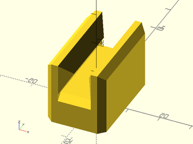
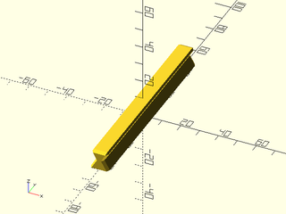

# LibFile: sliders.scad

Simple V-groove based sliders and rails.

To use, add the following lines to the beginning of your file:

    include <BOSL2/std.scad>
    include <BOSL2/sliders.scad>

## Table of Contents

1. [Section: Modules](#section-modules)
    - [`slider()`](#module-slider)
    - [`rail()`](#module-rail)

## Section: Modules

### Module: slider()

**Usage:** 

- slider(l, w, h, [base], [wall], [ang], [$slop])

**Description:** 

Creates a slider to match a V-groove rail.

**Arguments:** 

<abbr title="These args can be used by position or by name.">By&nbsp;Position</abbr> | What it does
-------------------- | ------------
`l`                  | Length (long axis) of slider.
`w`                  | Width of slider.
`h`                  | Height of slider.
`base`               | Height of slider base.
`wall`               | Width of wall behind each side of the slider.
`ang`                | Overhang angle for slider, to facilitate supportless printig.
`anchor`             | Translate so anchor point is at origin (0,0,0).  See [anchor](attachments.scad#subsection-anchor).  Default: `CENTER`
`spin`               | Rotate this many degrees around the Z axis after anchor.  See [spin](attachments.scad#subsection-spin).  Default: `0`
`orient`             | Vector to rotate top towards, after spin.  See [orient](attachments.scad#subsection-orient).  Default: `UP`
`$slop`              | The printer-specific slop value to make parts fit just right.

**Example 1:** 

    include <BOSL2/std.scad>
    include <BOSL2/sliders.scad>
    slider(l=30, base=10, wall=4, $slop=0.2, spin=90);

  

---

### Module: rail()

**Usage:** 

- rail(l, w, h, [chamfer], [ang])

**Description:** 

Creates a V-groove rail.

**Arguments:** 

<abbr title="These args can be used by position or by name.">By&nbsp;Position</abbr> | What it does
-------------------- | ------------
`l`                  | Length (long axis) of slider.
`w`                  | Width of slider.
`h`                  | Height of slider.
`chamfer`            | Size of chamfer at end of rail.
`ang`                | Overhang angle for slider, to facilitate supportless printig.
`anchor`             | Translate so anchor point is at origin (0,0,0).  See [anchor](attachments.scad#subsection-anchor).  Default: `BOTTOM`
`spin`               | Rotate this many degrees around the Z axis after anchor.  See [spin](attachments.scad#subsection-spin).  Default: `0`
`orient`             | Vector to rotate top towards, after spin.  See [orient](attachments.scad#subsection-orient).  Default: `UP`

**Example 1:** 

    include <BOSL2/std.scad>
    include <BOSL2/sliders.scad>
    rail(l=100, w=10, h=10);

  

---

