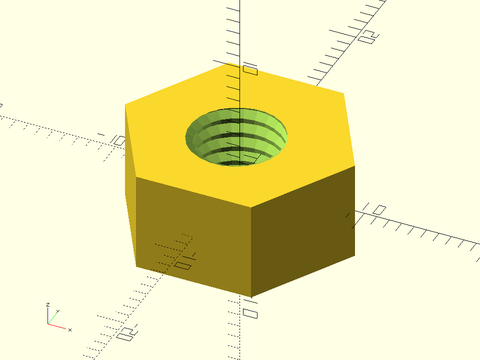
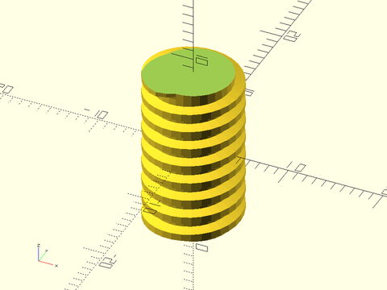
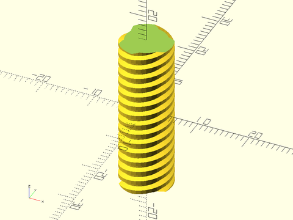

# LibFile: threading.scad

Triangular and Trapezoidal-Threaded Screw Rods and Nuts.

To use, add the following lines to the beginning of your file:

    include <BOSL2/std.scad>
    include <BOSL2/threading.scad>

## Table of Contents

1. [Section: Standard (UTS/ISO) Threading](#section-standard-utsiso-threading)
    - [`threaded_rod()`](#module-threaded_rod)
    - [`threaded_nut()`](#module-threaded_nut)

2. [Section: Trapezoidal Threading](#section-trapezoidal-threading)
    - [`trapezoidal_threaded_rod()`](#module-trapezoidal_threaded_rod)
    - [`trapezoidal_threaded_nut()`](#module-trapezoidal_threaded_nut)
    - [`acme_threaded_rod()`](#module-acme_threaded_rod)
    - [`acme_threaded_nut()`](#module-acme_threaded_nut)

3. [Section: Pipe Threading](#section-pipe-threading)
    - [`npt_threaded_rod()`](#module-npt_threaded_rod)

4. [Section: Buttress Threading](#section-buttress-threading)
    - [`buttress_threaded_rod()`](#module-buttress_threaded_rod)
    - [`buttress_threaded_nut()`](#module-buttress_threaded_nut)

5. [Section: Square Threading](#section-square-threading)
    - [`square_threaded_rod()`](#module-square_threaded_rod)
    - [`square_threaded_nut()`](#module-square_threaded_nut)

6. [Section: Ball Screws](#section-ball-screws)
    - [`ball_screw_rod()`](#module-ball_screw_rod)

7. [Section: Generic Threading](#section-generic-threading)
    - [`generic_threaded_rod()`](#module-generic_threaded_rod)
    - [`generic_threaded_nut()`](#module-generic_threaded_nut)
    - [`thread_helix()`](#module-thread_helix)

## Section: Standard (UTS/ISO) Threading

### Module: threaded\_rod()

**Description:** 

Constructs a standard ISO (metric) or UTS (English) threaded rod.  These threads are close to triangular,
with a 60 degree thread angle.  You can give the outer diameter and get the "basic form" or you can
set d to a triplet [d_min, d_pitch, d_major] where are parameters determined by the ISO and UTS specifications
that define clearance sizing for the threading.  See screws.scad for how to make screws
using the specification parameters.

**Arguments:** 

<abbr title="These args can be used by position or by name.">By&nbsp;Position</abbr> | What it does
-------------------- | ------------
`d`                  | Outer diameter of threaded rod, or a triplet of [d_min, d_pitch, d_major].
`l`                  | length of threaded rod.
`pitch`              | Length between threads.
`left_handed`        | if true, create left-handed threads.  Default = false
`bevel`              | if true, bevel the thread ends.  Default: false
`bevel1`             | if true bevel the bottom end.
`bevel2`             | if true bevel the top end.
`starts`             | The number of lead starts.  Default: 1
`internal`           | If true, make this a mask for making internal threads.
`d1`                 | Bottom outside diameter of threads.
`d2`                 | Top outside diameter of threads.
`higbee`             | Length to taper thread ends over.  Default: 0
`higbee1`            | Length to taper bottom thread end over.
`higbee2`            | Length to taper top thread end over.
`anchor`             | Translate so anchor point is at origin (0,0,0).  See [anchor](attachments.scad#subsection-anchor).  Default: `CENTER`
`spin`               | Rotate this many degrees around the Z axis after anchor.  See [spin](attachments.scad#subsection-spin).  Default: `0`
`orient`             | Vector to rotate top towards, after spin.  See [orient](attachments.scad#subsection-orient).  Default: `UP`
`$slop`              | The printer-specific slop value, which adds clearance (`4*$slop`) to internal threads.

**Example 1:** 

    include <BOSL2/std.scad>
    include <BOSL2/threading.scad>
    projection(cut=true)
        threaded_rod(d=10, l=15, pitch=1.5, orient=BACK);

  

**Example 2:** 

 

    include <BOSL2/std.scad>
    include <BOSL2/threading.scad>
    threaded_rod(d=10, l=20, pitch=1.25, left_handed=true, $fa=1, $fs=1);

**Example 3:** 

 

    include <BOSL2/std.scad>
    include <BOSL2/threading.scad>
    threaded_rod(d=25, l=20, pitch=2, $fa=1, $fs=1);

**Example 4:** Diamond threading where both left-handed and right-handed nuts travel (in the same direction) on the threaded rod:

 

    include <BOSL2/std.scad>
    include <BOSL2/threading.scad>
    $slop = 0.075;
    d = 3/8*INCH;
    pitch = 1/16*INCH;
    starts=3;
    xdistribute(19){
        intersection(){
          threaded_rod(l=40, pitch=pitch, d=d,starts=starts,anchor=BOTTOM);
          threaded_rod(l=40, pitch=pitch, d=d, left_handed=true,starts=starts,anchor=BOTTOM);
        }
        threaded_nut(od=4.5/8*INCH,id=d,h=3/8*INCH,pitch=pitch,starts=starts,anchor=BOTTOM);
        threaded_nut(od=4.5/8*INCH,id=d,h=3/8*INCH,pitch=pitch,starts=starts,left_handed=true,anchor=BOTTOM);
    }

---

### Module: threaded\_nut()

**Description:** 

Constructs a hex nut for an ISO (metric) or UTS (English) threaded rod.

**Arguments:** 

<abbr title="These args can be used by position or by name.">By&nbsp;Position</abbr> | What it does
-------------------- | ------------
`od`                 | diameter of the nut.
`id`                 | diameter of threaded rod to screw onto.
`h`                  | height/thickness of nut.
`pitch`              | Length between threads.

<abbr title="These args must be used by name, ie: name=value">By&nbsp;Name</abbr> | What it does
-------------------- | ------------
`starts`             | The number of lead starts.  Default: 1
`left_handed`        | if true, create left-handed threads.  Default = false
`bevel`              | if true, bevel the thread ends.  Default: false
`bevel1`             | if true bevel the bottom end.
`bevel2`             | if true bevel the top end.
`anchor`             | Translate so anchor point is at origin (0,0,0).  See [anchor](attachments.scad#subsection-anchor).  Default: `CENTER`
`spin`               | Rotate this many degrees around the Z axis after anchor.  See [spin](attachments.scad#subsection-spin).  Default: `0`
`orient`             | Vector to rotate top towards, after spin.  See [orient](attachments.scad#subsection-orient).  Default: `UP`
`$slop`              | The printer-specific slop value, which adds clearance (`4*$slop`) to internal threads.

**Example 1:** 

 

    include <BOSL2/std.scad>
    include <BOSL2/threading.scad>
    threaded_nut(od=16, id=8, h=8, pitch=1.25, $slop=0.05, $fa=1, $fs=1);

**Example 2:** 

 

    include <BOSL2/std.scad>
    include <BOSL2/threading.scad>
    threaded_nut(od=16, id=8, h=8, pitch=1.25, left_handed=true, bevel=true, $slop=0.1, $fa=1, $fs=1);

---

## Section: Trapezoidal Threading

### Module: trapezoidal\_threaded\_rod()

**Description:** 

Constructs a threaded rod with a symmetric trapezoidal thread.  Trapezoidal threads are used for lead screws because
they are one of the strongest symmetric profiles.  This tooth shape is stronger than a similarly
sized square thread becuase of its wider base.  However, it does place a radial load on the nut, unlike the square thread.
For loads in only one direction the asymmetric buttress thread profile can bear greater loads.

By default produces the nominal dimensions
for metric trapezoidal threads: a thread angle of 30 degrees and a depth set to half the pitch.
You can also specify your own trapezoid parameters.  For ACME threads see acme_threaded_rod().

**Figure 1:** 

 

**Arguments:** 

<abbr title="These args can be used by position or by name.">By&nbsp;Position</abbr> | What it does
-------------------- | ------------
`d`                  | Outer diameter of threaded rod.
`l`                  | Length of threaded rod.
`pitch`              | Thread spacing.
`thread_angle`       | Angle between two thread faces.  Default: 30
`thread_depth`       | Depth of threads.  Default: pitch/2

<abbr title="These args must be used by name, ie: name=value">By&nbsp;Name</abbr> | What it does
-------------------- | ------------
`left_handed`        | If true, create left-handed threads.  Default: false
`bevel`              | if true, bevel the thread ends.  Default: false
`bevel1`             | if true bevel the bottom end.
`bevel2`             | if true bevel the top end.
`starts`             | The number of lead starts.  Default: 1
`internal`           | If true, make this a mask for making internal threads.  Default: false
`d1`                 | Bottom outside diameter of threads.
`d2`                 | Top outside diameter of threads.
`higbee`             | Length to taper thread ends over.  Default: 0 (No higbee thread tapering)
`higbee1`            | Length to taper bottom thread end over.
`higbee2`            | Length to taper top thread end over.
`center`             | If given, overrides `anchor`.  A true value sets `anchor=CENTER`, false sets `anchor=UP`.
`anchor`             | Translate so anchor point is at origin (0,0,0).  See [anchor](attachments.scad#subsection-anchor).  Default: `CENTER`
`spin`               | Rotate this many degrees around the Z axis after anchor.  See [spin](attachments.scad#subsection-spin).  Default: `0`
`orient`             | Vector to rotate top towards, after spin.  See [orient](attachments.scad#subsection-orient).  Default: `UP`
`$slop`              | The printer-specific slop value, which adds clearance (`4*$slop`) to internal threads.

**Example 1:** 

 

    include <BOSL2/std.scad>
    include <BOSL2/threading.scad>
    projection(cut=true)
        trapezoidal_threaded_rod(d=10, l=15, pitch=2, orient=BACK);

**Example 2:** 

 

    include <BOSL2/std.scad>
    include <BOSL2/threading.scad>
    trapezoidal_threaded_rod(d=10, l=40, pitch=2, $fn=32);  // Standard metric threading

**Example 3:** 

 

    include <BOSL2/std.scad>
    include <BOSL2/threading.scad>
    trapezoidal_threaded_rod(d=10, l=17, pitch=2, higbee=25, $fn=32);  // Standard metric threading

**Example 4:** 

 

    include <BOSL2/std.scad>
    include <BOSL2/threading.scad>
    trapezoidal_threaded_rod(d=10, l=17, pitch=2, bevel=true, $fn=32);  // Standard metric threading

**Example 5:** 

 

    include <BOSL2/std.scad>
    include <BOSL2/threading.scad>
    trapezoidal_threaded_rod(d=10, l=30, pitch=2, left_handed=true, $fa=1, $fs=1);  // Standard metric threading

**Example 6:** 

 

    include <BOSL2/std.scad>
    include <BOSL2/threading.scad>
    trapezoidal_threaded_rod(d=10, l=40, pitch=3, left_handed=true, starts=3, $fn=36);

**Example 7:** 

 

    include <BOSL2/std.scad>
    include <BOSL2/threading.scad>
    trapezoidal_threaded_rod(l=25, d=10, pitch=2, starts=3, $fa=1, $fs=1, orient=RIGHT, anchor=BOTTOM);

**Example 8:** 

 

    include <BOSL2/std.scad>
    include <BOSL2/threading.scad>
    trapezoidal_threaded_rod(d=60, l=16, pitch=8, thread_depth=3, thread_angle=90, left_handed=true, $fa=2, $fs=2);

**Example 9:** 

 

    include <BOSL2/std.scad>
    include <BOSL2/threading.scad>
    trapezoidal_threaded_rod(d=60, l=16, pitch=8, thread_depth=3, thread_angle=90, left_handed=true, starts=4, $fa=2, $fs=2);

**Example 10:** 

 

    include <BOSL2/std.scad>
    include <BOSL2/threading.scad>
    trapezoidal_threaded_rod(d=16, l=40, pitch=2, thread_angle=60);

**Example 11:** 

 

    include <BOSL2/std.scad>
    include <BOSL2/threading.scad>
    trapezoidal_threaded_rod(d=25, l=40, pitch=10, thread_depth=8/3, thread_angle=100, starts=4, center=false, $fa=2, $fs=2);

**Example 12:** 

 

    include <BOSL2/std.scad>
    include <BOSL2/threading.scad>
    trapezoidal_threaded_rod(d=50, l=35, pitch=8, thread_angle=60, starts=11, higbee=10,$fn=120);

**Example 13:** Using as a Mask to Make Internal Threads

 

    include <BOSL2/std.scad>
    include <BOSL2/threading.scad>
    bottom_half() difference() {
        cube(50, center=true);
        trapezoidal_threaded_rod(d=40, l=51, pitch=5, thread_angle=30, internal=true, orient=RIGHT, $fn=36);
    }

---

### Module: trapezoidal\_threaded\_nut()

**Description:** 

Constructs a hex nut for a symmetric trapzoidal threaded rod.
By default produces the nominal dimensions
for metric trapezoidal threads: a thread angle of 30 degrees and a depth set to half the pitch.
You can also specify your own trapezoid parameters.  For ACME threads see acme_threaded_nut().

**Arguments:** 

<abbr title="These args can be used by position or by name.">By&nbsp;Position</abbr> | What it does
-------------------- | ------------
`od`                 | diameter of the nut.
`id`                 | diameter of threaded rod to screw onto.
`h`                  | height/thickness of nut.
`pitch`              | Thread spacing.
`thread_angle`       | Angle between two thread faces.  Default: 30
`thread_depth`       | Depth of the threads.  Default: pitch/2

<abbr title="These args must be used by name, ie: name=value">By&nbsp;Name</abbr> | What it does
-------------------- | ------------
`left_handed`        | if true, create left-handed threads.  Default = false
`starts`             | The number of lead starts.  Default = 1
`bevel`              | if true, bevel the thread ends.  Default: false
`bevel1`             | if true bevel the bottom end.
`bevel2`             | if true bevel the top end.
`anchor`             | Translate so anchor point is at origin (0,0,0).  See [anchor](attachments.scad#subsection-anchor).  Default: `CENTER`
`spin`               | Rotate this many degrees around the Z axis after anchor.  See [spin](attachments.scad#subsection-spin).  Default: `0`
`orient`             | Vector to rotate top towards, after spin.  See [orient](attachments.scad#subsection-orient).  Default: `UP`
`$slop`              | The printer-specific slop value, which adds clearance (`4*$slop`) to internal threads.

**Example 1:** 

 

    include <BOSL2/std.scad>
    include <BOSL2/threading.scad>
    trapezoidal_threaded_nut(od=16, id=8, h=8, pitch=2, $slop=0.1, anchor=UP);

**Example 2:** 

 

    include <BOSL2/std.scad>
    include <BOSL2/threading.scad>
    trapezoidal_threaded_nut(od=16, id=8, h=8, pitch=2, bevel=true, $slop=0.05, anchor=UP);

**Example 3:** 

 

    include <BOSL2/std.scad>
    include <BOSL2/threading.scad>
    trapezoidal_threaded_nut(od=17.4, id=10, h=10, pitch=2, $slop=0.1, left_handed=true);

**Example 4:** 

 

    include <BOSL2/std.scad>
    include <BOSL2/threading.scad>
    trapezoidal_threaded_nut(od=17.4, id=10, h=10, pitch=2, starts=3, $fa=1, $fs=1, $slop=0.15);

---

### Module: acme\_threaded\_rod()

**Description:** 

Constructs an ACME trapezoidal threaded screw rod.  This form has a 29 degree thread angle with a
symmetric trapezoidal thread.

**Arguments:** 

<abbr title="These args can be used by position or by name.">By&nbsp;Position</abbr> | What it does
-------------------- | ------------
`d`                  | Outer diameter of threaded rod.
`l`                  | length of threaded rod.
`tpi`                | threads per inch.

<abbr title="These args must be used by name, ie: name=value">By&nbsp;Name</abbr> | What it does
-------------------- | ------------
`pitch`              | thread spacing (alternative to tpi)
`starts`             | The number of lead starts.  Default = 1
`left_handed`        | if true, create left-handed threads.  Default = false
`bevel`              | if true, bevel the thread ends.  Default: false
`bevel1`             | if true bevel the bottom end.
`bevel2`             | if true bevel the top end.
`internal`           | If true, this is a mask for making internal threads.
`higbee`             | Length to taper thread ends over.  Default: 0 (No higbee thread tapering)
`higbee1`            | Length to taper bottom thread end over.
`higbee2`            | Length to taper top thread end over.
`anchor`             | Translate so anchor point is at origin (0,0,0).  See [anchor](attachments.scad#subsection-anchor).  Default: `CENTER`
`spin`               | Rotate this many degrees around the Z axis after anchor.  See [spin](attachments.scad#subsection-spin).  Default: `0`
`orient`             | Vector to rotate top towards, after spin.  See [orient](attachments.scad#subsection-orient).  Default: `UP`
`$slop`              | The printer-specific slop value, which adds clearance (`4*$slop`) to internal threads.

**Example 1:** 

    include <BOSL2/std.scad>
    include <BOSL2/threading.scad>
    projection(cut=true)
        acme_threaded_rod(d=10, l=15, pitch=2, orient=BACK);

  

**Example 2:** 

 

    include <BOSL2/std.scad>
    include <BOSL2/threading.scad>
    acme_threaded_rod(d=3/8*INCH, l=20, pitch=1/8*INCH, $fn=32);

**Example 3:** 

 

    include <BOSL2/std.scad>
    include <BOSL2/threading.scad>
    acme_threaded_rod(d=10, l=30, pitch=2, starts=3, $fa=1, $fs=1);

---

### Module: acme\_threaded\_nut()

**Description:** 

Constructs a hex nut for an ACME threaded screw rod.

**Arguments:** 

<abbr title="These args can be used by position or by name.">By&nbsp;Position</abbr> | What it does
-------------------- | ------------
`od`                 | diameter of the nut.
`id`                 | diameter of threaded rod to screw onto.
`h`                  | height/thickness of nut.
`tpi`                | threads per inch

<abbr title="These args must be used by name, ie: name=value">By&nbsp;Name</abbr> | What it does
-------------------- | ------------
`pitch`              | Thread spacing (alternative to tpi)
`left_handed`        | if true, create left-handed threads.  Default = false
`bevel`              | if true, bevel the thread ends.  Default: false
`bevel1`             | if true bevel the bottom end.
`bevel2`             | if true bevel the top end.
`anchor`             | Translate so anchor point is at origin (0,0,0).  See [anchor](attachments.scad#subsection-anchor).  Default: `CENTER`
`spin`               | Rotate this many degrees around the Z axis after anchor.  See [spin](attachments.scad#subsection-spin).  Default: `0`
`orient`             | Vector to rotate top towards, after spin.  See [orient](attachments.scad#subsection-orient).  Default: `UP`
`$slop`              | The printer-specific slop value, which adds clearance (`4*$slop`) to internal threads.

**Example 1:** 

 

    include <BOSL2/std.scad>
    include <BOSL2/threading.scad>
    acme_threaded_nut(od=16, id=3/8*INCH, h=8, tpi=8, $slop=0.05);

**Example 2:** 

 

    include <BOSL2/std.scad>
    include <BOSL2/threading.scad>
    acme_threaded_nut(od=16, id=1/2*INCH, h=10, tpi=12, starts=3, $slop=0.1, $fa=1, $fs=1);

---

## Section: Pipe Threading

### Module: npt\_threaded\_rod()

**Description:** 

Constructs a standard NPT pipe end threading. If `internal=true`, creates a mask for making
internal pipe threads.  Tapers smaller upwards if `internal=false`.  Tapers smaller downwards
if `internal=true`.  If `hollow=true` and `internal=false`, then the pipe threads will be
hollowed out into a pipe with the apropriate internal diameter.

**Arguments:** 

<abbr title="These args can be used by position or by name.">By&nbsp;Position</abbr> | What it does
-------------------- | ------------
`size`               | NPT standard pipe size in inches.  1/16", 1/8", 1/4", 3/8", 1/2", 3/4", 1", 1+1/4", 1+1/2", or 2".  Default: 1/2"

<abbr title="These args must be used by name, ie: name=value">By&nbsp;Name</abbr> | What it does
-------------------- | ------------
`left_handed`        | If true, create left-handed threads.  Default = false
`bevel`              | if true, bevel the thread ends.  Default: false
`bevel1`             | if true bevel the bottom end.
`bevel2`             | if true bevel the top end.
`hollow`             | If true, create a pipe with the correct internal diameter.
`internal`           | If true, make this a mask for making internal threads.
`anchor`             | Translate so anchor point is at origin (0,0,0).  See [anchor](attachments.scad#subsection-anchor).  Default: `CENTER`
`spin`               | Rotate this many degrees around the Z axis after anchor.  See [spin](attachments.scad#subsection-spin).  Default: `0`
`orient`             | Vector to rotate top towards, after spin.  See [orient](attachments.scad#subsection-orient).  Default: `UP`
`$slop`              | The printer-specific slop value, which adds clearance (`4*$slop`) to internal threads.p

**Example 1:** The straight gray rectangle reveals the tapered threads.

 

    include <BOSL2/std.scad>
    include <BOSL2/threading.scad>
    projection(cut=true) npt_threaded_rod(size=1/4, orient=BACK);
    right(.533*INCH/2) color("gray") rect([2,0.5946*INCH],anchor=LEFT);

**Example 2:** 

    include <BOSL2/std.scad>
    include <BOSL2/threading.scad>
    npt_threaded_rod(size=3/8, $fn=72);

  

**Example 3:** 

 

    include <BOSL2/std.scad>
    include <BOSL2/threading.scad>
    npt_threaded_rod(size=1/2, $fn=72, bevel=true);

**Example 4:** 

 

    include <BOSL2/std.scad>
    include <BOSL2/threading.scad>
    npt_threaded_rod(size=1/2, left_handed=true, $fn=72);

**Example 5:** 

 

    include <BOSL2/std.scad>
    include <BOSL2/threading.scad>
    npt_threaded_rod(size=3/4, hollow=true, $fn=96);

**Example 6:** 

 

    include <BOSL2/std.scad>
    include <BOSL2/threading.scad>
    diff("remove"){
       cuboid([40,40,40])
       tags("remove"){
         up(.01)position(TOP)
             npt_threaded_rod(size=3/4, $fn=96, internal=true, $slop=0.1, anchor=TOP);
         cyl(d=3/4*INCH, l=42, $fn=32);
       }
    }

---

## Section: Buttress Threading

### Module: buttress\_threaded\_rod()

**Description:** 

Constructs a simple buttress threaded rod with a 45 degree angle.  The buttress thread or sawtooth thread has low friction and high loading
in one direction at the cost of higher friction and inferior loading in the other direction.  Buttress threads are sometimes used on
vises, which are loaded only in one direction.

**Arguments:** 

<abbr title="These args can be used by position or by name.">By&nbsp;Position</abbr> | What it does
-------------------- | ------------
`d`                  | Outer diameter of threaded rod.
`l`                  | length of threaded rod.
`pitch`              | Thread spacing.

<abbr title="These args must be used by name, ie: name=value">By&nbsp;Name</abbr> | What it does
-------------------- | ------------
`left_handed`        | if true, create left-handed threads.  Default = false
`bevel`              | if true, bevel the thread ends.  Default: false
`bevel1`             | if true bevel the bottom end.
`bevel2`             | if true bevel the top end.
`internal`           | If true, this is a mask for making internal threads.
`higbee`             | Length to taper thread ends over.  Default: 0
`higbee1`            | Length to taper bottom thread end over.
`higbee2`            | Length to taper top thread end over.
`d1`                 | Bottom outside diameter of threads.
`d2`                 | Top outside diameter of threads.
`anchor`             | Translate so anchor point is at origin (0,0,0).  See [anchor](attachments.scad#subsection-anchor).  Default: `CENTER`
`spin`               | Rotate this many degrees around the Z axis after anchor.  See [spin](attachments.scad#subsection-spin).  Default: `0`
`orient`             | Vector to rotate top towards, after spin.  See [orient](attachments.scad#subsection-orient).  Default: `UP`
`$slop`              | The printer-specific slop value, which adds clearance (`4*$slop`) to internal threads.

**Example 1:** 

    include <BOSL2/std.scad>
    include <BOSL2/threading.scad>
    projection(cut=true)
        buttress_threaded_rod(d=10, l=15, pitch=2, orient=BACK);

  

**Example 2:** 

 

    include <BOSL2/std.scad>
    include <BOSL2/threading.scad>
    buttress_threaded_rod(d=10, l=20, pitch=1.25, left_handed=true, $fa=1, $fs=1);

**Example 3:** 

 

    include <BOSL2/std.scad>
    include <BOSL2/threading.scad>
    buttress_threaded_rod(d=25, l=20, pitch=2, $fa=1, $fs=1);

---

### Module: buttress\_threaded\_nut()

**Description:** 

Constructs a hex nut for a simple buttress threaded screw rod.

**Arguments:** 

<abbr title="These args can be used by position or by name.">By&nbsp;Position</abbr> | What it does
-------------------- | ------------
`od`                 | diameter of the nut.
`id`                 | diameter of threaded rod to screw onto.
`h`                  | height/thickness of nut.
`pitch`              | Thread spacing.

<abbr title="These args must be used by name, ie: name=value">By&nbsp;Name</abbr> | What it does
-------------------- | ------------
`left_handed`        | if true, create left-handed threads.  Default = false
`bevel`              | if true, bevel the thread ends.  Default: false
`bevel1`             | if true bevel the bottom end.
`bevel2`             | if true bevel the top end.
`anchor`             | Translate so anchor point is at origin (0,0,0).  See [anchor](attachments.scad#subsection-anchor).  Default: `CENTER`
`spin`               | Rotate this many degrees around the Z axis after anchor.  See [spin](attachments.scad#subsection-spin).  Default: `0`
`orient`             | Vector to rotate top towards, after spin.  See [orient](attachments.scad#subsection-orient).  Default: `UP`
`$slop`              | The printer-specific slop value, which adds clearance (`4*$slop`) to internal threads.

**Example 1:** 

 

    include <BOSL2/std.scad>
    include <BOSL2/threading.scad>
    buttress_threaded_nut(od=16, id=8, h=8, pitch=1.25, left_handed=true, $slop=0.05, $fa=1, $fs=1);

---

## Section: Square Threading

### Module: square\_threaded\_rod()

**Description:** 

Constructs a square profile threaded screw rod.  The greatest advantage of square threads is that they have the least friction and a much higher intrinsic efficiency than trapezoidal threads.
They produce no radial load on the nut.  However, square threads cannot carry as much load as trapezoidal threads.

**Arguments:** 

<abbr title="These args can be used by position or by name.">By&nbsp;Position</abbr> | What it does
-------------------- | ------------
`d`                  | Outer diameter of threaded rod.
`l`                  | length of threaded rod.
`pitch`              | Thread spacing.

<abbr title="These args must be used by name, ie: name=value">By&nbsp;Name</abbr> | What it does
-------------------- | ------------
`left_handed`        | if true, create left-handed threads.  Default = false
`bevel`              | if true, bevel the thread ends.  Default: false
`bevel1`             | if true bevel the bottom end.
`bevel2`             | if true bevel the top end.
`starts`             | The number of lead starts.  Default = 1
`internal`           | If true, this is a mask for making internal threads.
`higbee`             | Length to taper thread ends over.  Default: 0
`higbee1`            | Length to taper bottom thread end over.
`higbee2`            | Length to taper top thread end over.
`d1`                 | Bottom outside diameter of threads.
`d2`                 | Top outside diameter of threads.
`anchor`             | Translate so anchor point is at origin (0,0,0).  See [anchor](attachments.scad#subsection-anchor).  Default: `CENTER`
`spin`               | Rotate this many degrees around the Z axis after anchor.  See [spin](attachments.scad#subsection-spin).  Default: `0`
`orient`             | Vector to rotate top towards, after spin.  See [orient](attachments.scad#subsection-orient).  Default: `UP`
`$slop`              | The printer-specific slop value, which adds clearance (`4*$slop`) to internal threads.

**Example 1:** 

    include <BOSL2/std.scad>
    include <BOSL2/threading.scad>
    projection(cut=true)
        square_threaded_rod(d=10, l=15, pitch=2, orient=BACK);

  

**Example 2:** 

 

    include <BOSL2/std.scad>
    include <BOSL2/threading.scad>
    square_threaded_rod(d=10, l=20, pitch=2, starts=2, $fn=32);

---

### Module: square\_threaded\_nut()

**Description:** 

Constructs a hex nut for a square profile threaded screw rod.

**Arguments:** 

<abbr title="These args can be used by position or by name.">By&nbsp;Position</abbr> | What it does
-------------------- | ------------
`od`                 | diameter of the nut.
`id`                 | diameter of threaded rod to screw onto.
`h`                  | height/thickness of nut.
`pitch`              | Length between threads.

<abbr title="These args must be used by name, ie: name=value">By&nbsp;Name</abbr> | What it does
-------------------- | ------------
`left_handed`        | if true, create left-handed threads.  Default = false
`bevel`              | if true, bevel the thread ends.  Default: false
`bevel1`             | if true bevel the bottom end.
`bevel2`             | if true bevel the top end.
`starts`             | The number of lead starts.  Default = 1
`anchor`             | Translate so anchor point is at origin (0,0,0).  See [anchor](attachments.scad#subsection-anchor).  Default: `CENTER`
`spin`               | Rotate this many degrees around the Z axis after anchor.  See [spin](attachments.scad#subsection-spin).  Default: `0`
`orient`             | Vector to rotate top towards, after spin.  See [orient](attachments.scad#subsection-orient).  Default: `UP`
`$slop`              | The printer-specific slop value, which adds clearance (`4*$slop`) to internal threads.

**Example 1:** 

 

    include <BOSL2/std.scad>
    include <BOSL2/threading.scad>
    square_threaded_nut(od=16, id=10, h=10, pitch=2, starts=2, $slop=0.1, $fn=32);

---

## Section: Ball Screws

### Module: ball\_screw\_rod()

**Description:** 

Constructs a ball screw rod.  This type of rod is used with ball bearings.

**Arguments:** 

<abbr title="These args can be used by position or by name.">By&nbsp;Position</abbr> | What it does
-------------------- | ------------
`d`                  | Outer diameter of threaded rod.
`l`                  | length of threaded rod.
`pitch`              | Thread spacing. Also, the diameter of the ball bearings used.
`ball_diam`          | The diameter of the ball bearings to use with this ball screw.
`ball_arc`           | The arc portion that should touch the ball bearings. Default: 120 degrees.

<abbr title="These args must be used by name, ie: name=value">By&nbsp;Name</abbr> | What it does
-------------------- | ------------
`left_handed`        | if true, create left-handed threads.  Default = false
`starts`             | The number of lead starts.  Default = 1
`bevel`              | if true, bevel the thread ends.  Default: false
`bevel1`             | if true bevel the bottom end.
`bevel2`             | if true bevel the top end.
`internal`           | If true, make this a mask for making internal threads.
`anchor`             | Translate so anchor point is at origin (0,0,0).  See [anchor](attachments.scad#subsection-anchor).  Default: `CENTER`
`spin`               | Rotate this many degrees around the Z axis after anchor.  See [spin](attachments.scad#subsection-spin).  Default: `0`
`orient`             | Vector to rotate top towards, after spin.  See [orient](attachments.scad#subsection-orient).  Default: `UP`
`$slop`              | The printer-specific slop value, which adds clearance (`4*$slop`) to internal threads.

**Example 1:** Thread Profile, ball\_diam=4, ball\_arc=100

 

    include <BOSL2/std.scad>
    include <BOSL2/threading.scad>
    projection(cut=true) ball_screw_rod(d=10, l=15, pitch=5, ball_diam=4, ball_arc=100, orient=BACK, $fn=24);

**Example 2:** Thread Profile, ball\_diam=4, ball\_arc=120

 

    include <BOSL2/std.scad>
    include <BOSL2/threading.scad>
    projection(cut=true) ball_screw_rod(d=10, l=15, pitch=5, ball_diam=4, ball_arc=120, orient=BACK, $fn=24);

**Example 3:** Thread Profile, ball\_diam=3, ball\_arc=120

 

    include <BOSL2/std.scad>
    include <BOSL2/threading.scad>
    projection(cut=true) ball_screw_rod(d=10, l=15, pitch=5, ball_diam=3, ball_arc=120, orient=BACK, $fn=24);

**Example 4:** 

 

    include <BOSL2/std.scad>
    include <BOSL2/threading.scad>
    ball_screw_rod(d=15, l=20, pitch=8, ball_diam=5, ball_arc=120, $fa=1, $fs=0.5);

**Example 5:** 

 

    include <BOSL2/std.scad>
    include <BOSL2/threading.scad>
    ball_screw_rod(d=15, l=20, pitch=5, ball_diam=4, ball_arc=120, $fa=1, $fs=0.5);

**Example 6:** 

 

    include <BOSL2/std.scad>
    include <BOSL2/threading.scad>
    ball_screw_rod(d=15, l=20, pitch=5, ball_diam=4, ball_arc=120, left_handed=true, $fa=1, $fs=0.5);

---

## Section: Generic Threading

### Module: generic\_threaded\_rod()

**Description:** 

Constructs a generic threaded rod using an arbitrary thread profile that you supply.  The rod can be tapered (e.g. for pipe threads).
For specific thread types use other modules that supply the appropriate profile.

You give the profile as a 2D path that will be scaled by the pitch to produce the final thread shape.  The profile X values
must be between -1/2 and 1/2.  The Y=0 point will align with the specified rod diameter, so generally you want a Y value of zero at the peak (which
makes your specified diameter the outer diameter of the threads).
The value in the valleys of the thread should then be `-depth/pitch` due to the scaling by the thread pitch.  The segment between the end
of one thread and the start of the next is added automatically, so you should not have the path start and end at equivalent points (X = ±1/2 with the same Y value).
Generally you should center the profile horizontally in the interval [-1/2, 1/2].

If internal is true then produce a thread mask to difference from an object.
When internal is true the rod diameter is enlarged to correct for the polygonal nature of circles to ensure that the internal diameter is the specified size.
The diameter is also increased by `4 * $slop` to create clearance for threading by allowing a `2 * $slop` gap on each side.
If bevel is set to true and internal is false then the ends of the rod will be beveled.  When bevel is true and internal is true the ends of the rod will
be filled in so that the rod mask will create a bevel when subtracted from an object.  The bevel is at 45 deg and is the depth of the threads.

Higbee specifies tapering of the thread ends to make screws easier to start.  Specify the number of degrees for the taper.  Higbee
only works for external threads.  It is ignored if internal is true.

**Arguments:** 

<abbr title="These args can be used by position or by name.">By&nbsp;Position</abbr> | What it does
-------------------- | ------------
`d`                  | Outer diameter of threaded rod.
`l`                  | Length of threaded rod.
`pitch`              | Thread spacing.
`profile`            | A 2D path giving the shape of a thread

<abbr title="These args must be used by name, ie: name=value">By&nbsp;Name</abbr> | What it does
-------------------- | ------------
`left_handed`        | If true, create left-handed threads.  Default: false
`bevel`              | if true, bevel the thread ends.  Default: false
`bevel1`             | if true bevel the bottom end.
`bevel2`             | if true bevel the top end.
`starts`             | The number of lead starts.  Default: 1
`internal`           | If true, make this a mask for making internal threads.  Default: false
`d1`                 | Bottom outside diameter of threads.
`d2`                 | Top outside diameter of threads.
`higbee`             | Angle to taper thread ends over.  Default: 0 (No higbee thread tapering)
`higbee1`            | Angle to taper bottom thread end over.
`higbee2`            | Angle to taper top thread end over.
`center`             | If given, overrides `anchor`.  A true value sets `anchor=CENTER`, false sets `anchor=UP`.
`anchor`             | Translate so anchor point is at origin (0,0,0).  See [anchor](attachments.scad#subsection-anchor).  Default: `CENTER`
`spin`               | Rotate this many degrees around the Z axis after anchor.  See [spin](attachments.scad#subsection-spin).  Default: `0`
`orient`             | Vector to rotate top towards, after spin.  See [orient](attachments.scad#subsection-orient).  Default: `UP`
`$slop`              | The printer-specific slop value, which adds clearance (`4*$slop`) to internal threads.

**Example 1:** Example Tooth Profile

    include <BOSL2/std.scad>
    include <BOSL2/threading.scad>
    pitch = 2;
    depth = pitch * cos(30) * 5/8;
    profile = [
        [-7/16, -depth/pitch*1.07],
        [-6/16, -depth/pitch],
        [-1/16,  0],
        [ 1/16,  0],
        [ 6/16, -depth/pitch],
        [ 7/16, -depth/pitch*1.07]
    ];
    stroke(profile, width=0.02);

  

**Example 2:** 

    include <BOSL2/std.scad>
    include <BOSL2/threading.scad>
    pitch = 2;
    depth = pitch * cos(30) * 5/8;
    profile = [
        [-7/16, -depth/pitch*1.07],
        [-6/16, -depth/pitch],
        [-1/16,  0],
        [ 1/16,  0],
        [ 6/16, -depth/pitch],
        [ 7/16, -depth/pitch*1.07]
    ];
    generic_threaded_rod(d=10, l=40, pitch=2, profile=profile);

  

---

### Module: generic\_threaded\_nut()

**Description:** 

Constructs a hexagonal nut for an generic threaded rod using a user-supplied thread profile.
See generic_threaded_rod for details on the profile specification.

**Arguments:** 

<abbr title="These args can be used by position or by name.">By&nbsp;Position</abbr> | What it does
-------------------- | ------------
`od`                 | diameter of the nut.
`id`                 | diameter of threaded rod to screw onto.
`h`                  | height/thickness of nut.
`pitch`              | Thread spacing.
`profile`            | Thread profile.

<abbr title="These args must be used by name, ie: name=value">By&nbsp;Name</abbr> | What it does
-------------------- | ------------
`left_handed`        | if true, create left-handed threads.  Default = false
`starts`             | The number of lead starts.  Default = 1
`bevel`              | if true, bevel the thread ends.  Default: false
`bevel1`             | if true bevel the bottom end.
`bevel2`             | if true bevel the top end.
`id1`                | inner diameter at the bottom
`id2`                | inner diameter at the top
`anchor`             | Translate so anchor point is at origin (0,0,0).  See [anchor](attachments.scad#subsection-anchor).  Default: `CENTER`
`spin`               | Rotate this many degrees around the Z axis after anchor.  See [spin](attachments.scad#subsection-spin).  Default: `0`
`orient`             | Vector to rotate top towards, after spin.  See [orient](attachments.scad#subsection-orient).  Default: `UP`
`$slop`              | The printer-specific slop value, which adds clearance (`4*$slop`) to internal threads.

---

### Module: thread\_helix()

**Usage:** 

- thread\_helix(d, pitch, [thread\_depth], [flank\_angle], [twist], [profile=], [left\_handed=], [higbee=], [internal=]);

**Description:** 

Creates a right-handed helical thread with optional end tapering.  Unlike generic_threaded_rod, this module just generates the thread, and
you specify the angle of thread you want, which makes it easy to put complete threads onto a longer shaft.  It also makes a more finely
divided taper at the thread ends.  However, it takes about twice as long to render compared to generic_threaded_rod.

You can specify a thread_depth and flank_angle, in which
case you get a symmetric trapezoidal thread, whose inner diameter (the base of the threads for external threading)
is d (so the total diameter will be d + thread_depth).  This differs from the threaded_rod modules, where the specified
diameter is the outer diameter.
Alternatively you can give a profile, following the same rules as for general_threaded_rod.
The Y=0 point will align with the specified diameter, and the profile should
range in X from -1/2 to 1/2.  You cannot specify both the profile and the thread_depth or flank_angle.

Unlike generic_threaded_rod, when internal=true this module generates the threads, not a thread mask.
The profile needs to be inverted to produce the proper thread form.  If you use the built-in trapezoidal
thread you get the inverted thread, designed so that the inner diameter is d.  With adequate clearance
this thread will mate with the thread that uses the same parameters but has internal=false.  Note that
unlike the threaded_rod modules, thread_helix does not adjust the diameter for faceting, nor does it
subtract any $slop for clearance.

Higbee specifies tapering applied to the ends of the threads and is given as the linear distance
over which to taper.  Tapering works on both internal and external threads.

**Arguments:** 

<abbr title="These args can be used by position or by name.">By&nbsp;Position</abbr> | What it does
-------------------- | ------------
`d`                  | Inside base diameter of threads.  Default: 10
`pitch`              | Distance between threads.  Default: 2mm/thread
`thread_depth`       | Depth of threads from top to bottom.
`flank_angle`        | Angle of thread faces to plane perpendicular to screw.  Default: 15 degrees.
`turns`              | Number of revolutions to rotate thread around.  Default: 2.

<abbr title="These args must be used by name, ie: name=value">By&nbsp;Name</abbr> | What it does
-------------------- | ------------
`profile`            | If an asymmetrical thread profile is needed, it can be specified here.
`starts`             | The number of thread starts.  Default: 1
`left_handed`        | If true, thread has a left-handed winding.
`internal`           | If true, invert threads for internal threading.
`d1`                 | Bottom inside base diameter of threads.
`d2`                 | Top inside base diameter of threads.
`higbee`             | Length to taper thread ends over.  Default: 0
`higbee1`            | Length to taper bottom thread end over.
`higbee2`            | Length to taper top thread end over.
`anchor`             | Translate so anchor point is at origin (0,0,0).  See [anchor](attachments.scad#subsection-anchor).  Default: `CENTER`
`spin`               | Rotate this many degrees around the Z axis after anchor.  See [spin](attachments.scad#subsection-spin).  Default: `0`
`orient`             | Vector to rotate top towards, after spin.  See [orient](attachments.scad#subsection-orient).  Default: `UP`

**Figure 1:** 

 

**Example 1:** Typical Tooth Profile

    include <BOSL2/std.scad>
    include <BOSL2/threading.scad>
    pitch = 2;
    depth = pitch * cos(30) * 5/8;
    profile = [
        [-6/16, 0           ],
        [-1/16, depth/pitch ],
        [ 1/16, depth/pitch ],
        [ 6/16, 0           ],
    ];
    stroke(profile, width=0.02);

  

**Example 2:** 

 

    include <BOSL2/std.scad>
    include <BOSL2/threading.scad>
    thread_helix(d=10, pitch=2, thread_depth=0.75, flank_angle=15, turns=2.5, $fn=72);

**Example 3:** 

 

    include <BOSL2/std.scad>
    include <BOSL2/threading.scad>
    thread_helix(d=10, pitch=2, thread_depth=0.75, flank_angle=15, turns=2.5, higbee=1, $fn=72);

**Example 4:** 

 

    include <BOSL2/std.scad>
    include <BOSL2/threading.scad>
    thread_helix(d=10, pitch=2, thread_depth=0.75, flank_angle=15, turns=2, higbee=2, internal=true, $fn=72);

**Example 5:** 

 

    include <BOSL2/std.scad>
    include <BOSL2/threading.scad>
    thread_helix(d=10, pitch=2, thread_depth=0.75, flank_angle=15, turns=1, left_handed=true, higbee=1, $fn=36);

---

