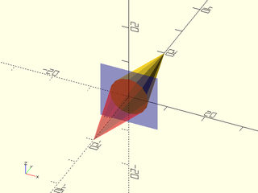
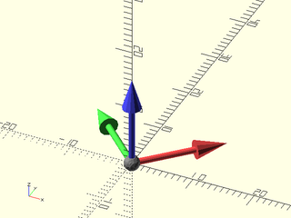
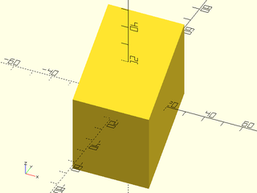

# LibFile: transforms.scad

Functions and modules that provide shortcuts for translation,
rotation and mirror operations.  Also provided are skew and frame_map
which remaps the coordinate axes.  The shortcuts can act on
geometry, like the usual OpenSCAD rotate() and translate(). They
also work as functions that operate on lists of points in various
forms: paths, VNFS and bezier patches. Lastly, the function form
of the shortcuts can return a matrix representing the operation
the shortcut performs. The rotation and scaling shortcuts accept
an optional centerpoint for the rotation or scaling operation.

Almost all of the transformation functions take a point, a point
list, bezier patch, or VNF as a second positional argument to
operate on.  The exceptions are rot(), frame_map() and skew().

To use, add the following lines to the beginning of your file:

    include <BOSL2/std.scad>

## Table of Contents

1. [Section: Affine Transformations](#section-affine-transformations)

2. [Section: Translations](#section-translations)
    - [`move()`](#functionmodule-move)
    - [`left()`](#functionmodule-left)
    - [`right()`](#functionmodule-right)
    - [`fwd()`](#functionmodule-fwd)
    - [`back()`](#functionmodule-back)
    - [`down()`](#functionmodule-down)
    - [`up()`](#functionmodule-up)

3. [Section: Rotations](#section-rotations)
    - [`rot()`](#functionmodule-rot)
    - [`xrot()`](#functionmodule-xrot)
    - [`yrot()`](#functionmodule-yrot)
    - [`zrot()`](#functionmodule-zrot)

4. [Section: Scaling](#section-scaling)
    - [`scale()`](#functionmodule-scale)
    - [`xscale()`](#functionmodule-xscale)
    - [`yscale()`](#functionmodule-yscale)
    - [`zscale()`](#functionmodule-zscale)

5. [Section: Reflection (Mirroring)](#section-reflection-mirroring)
    - [`mirror()`](#functionmodule-mirror)
    - [`xflip()`](#functionmodule-xflip)
    - [`yflip()`](#functionmodule-yflip)
    - [`zflip()`](#functionmodule-zflip)

6. [Section: Other Transformations](#section-other-transformations)
    - [`frame_map()`](#functionmodule-frame_map)
    - [`skew()`](#functionmodule-skew)

7. [Section: Applying transformation matrices to data](#section-applying-transformation-matrices-to-data)
    - [`apply()`](#function-apply)

## Section: Affine Transformations

OpenSCAD provides various built-in modules to transform geometry by
translation, scaling, rotation, and mirroring.  All of these operations
are affine transformations.  A three-dimensional affine transformation
can be represented by a 4x4 matrix.  The transformation shortcuts in this
file generally have three modes of operation.  They can operate
directly on geometry like their OpenSCAD built-in equivalents.  For example,
`left(10) cube()`.  They can operate on a list of points (or various other
types of geometric data).  For example, operating on a list of points: `points = left(10, [[1,2,3],[4,5,6]])`.
The third option is that the shortcut can return the transformation matrix
corresponding to its action.  For example, `M=left(10)`.

This capability allows you to store and manipulate transformations, and can
be useful in more advanced modeling.  You can multiply these matrices
together, analogously to applying a sequence of operations with the
built-in transformations.  So you can write `zrot(37)left(5)cube()`
to perform two operations on a cube.  You can also store
that same transformation by multiplying the matrices together: `M = zrot(37) * left(5)`.
Note that the order is exactly the same as the order used to apply the transformation.

Suppose you have constructed `M` as above.  What now?  You can use
the OpensCAD built-in `multmatrix` to apply it to some geometry:  `multmatrix(M) cube()`.
Alternative you can use the BOSL2 function `apply` to apply `M` to a point, a list
of points, a bezier patch, or a VNF.  For example, `points = apply(M, [[3,4,5],[5,6,7]])`.
Note that the `apply` function can work on both 2D and 3D data, but if you want to
operate on 2D data, you must choose transformations that don't modify z

You can use matrices as described above without understanding the details, just
treating a matrix as a box that stores a transformation.  The OpenSCAD manual section for multmatrix
gives some details of how this works.  We'll elaborate a bit more below.  An affine transformation
matrix for three dimensional data is a 4x4 matrix.  The top left 3x3 portion gives the linear
transformation to apply to the data.  For example, it could be a rotation or scaling, or combination of both.
The 3x1 column at the top right gives the translation to apply.  The bottom row should be `[0,0,0,1]`.  That
bottom row is only present to enable
the matrices to be multiplied together.  OpenSCAD ignores it and in fact `multmatrix` will
accept a 3x4 matrix, where that row is missing.  In order for a matrix to act on a point you have to
augment the point with an extra 1, making it a length 4 vector.  In OpenSCAD you can then compute the
the affine transformed point as `tran_point = M * point`.  However, this syntax hides a complication that
arises if you have a list of points.  A list of points like `[[1,2,3,1],[4,5,6,1],[7,8,9,1]]` has the augmented points
as row vectors on the list.  In order to transform such a list, it needs to be muliplied on the right
side, not the left side.

## Section: Translations

### Function/Module: move()

**Aliases:** translate()

**Usage:** As Module

- move([x=], [y=], [z=]) ...
- move(v) ...

**Usage:** As a function to translate points, VNF, or Bezier patch

- pts = move(v, p);
- pts = move([x=], [y=], [z=], p=);
- pts = move(STRING, p);

**Usage:** Get Translation Matrix

- mat = move(v);
- mat = move([x=], [y=], [z=]);

**Topics:** [Affine](Topics#affine), [Matrices](Topics#matrices), [Transforms](Topics#transforms), [Translation](Topics#translation)

**Description:** 

Translates position by the given amount.
* Called as a module, moves/translates all children.
* Called as a function with a point in the `p` argument, returns the translated point.
* Called as a function with a list of points in the `p` argument, returns the translated list of points.
* Called as a function with a [bezier patch](beziers.scad) in the `p` argument, returns the translated patch.
* Called as a function with a [VNF structure](vnf.scad) in the `p` argument, returns the translated VNF.
* Called as a function with the `p` argument, returns the translated point or list of points.
* Called as a function with the `p` argument set to a VNF or a polygon and `v` set to "centroid", "mean" or "box", translates the argument to the centroid, mean, or bounding box center respectively.
* Called as a function without a `p` argument, with a 2D offset vector `v`, returns an affine2d translation matrix.
* Called as a function without a `p` argument, with a 3D offset vector `v`, returns an affine3d translation matrix.

**Arguments:** 

<abbr title="These args can be used by position or by name.">By&nbsp;Position</abbr> | What it does
-------------------- | ------------
`v`                  | An [X,Y,Z] vector to translate by.  For function form with `p` is a point list or VNF, can be "centroid", "mean" or "box".
`p`                  | Either a point, or a list of points to be translated when used as a function.

<abbr title="These args must be used by name, ie: name=value">By&nbsp;Name</abbr> | What it does
-------------------- | ------------
`x`                  | X axis translation.
`y`                  | Y axis translation.
`z`                  | Z axis translation.

**See Also:** [left()](#functionmodule-left), [right()](#functionmodule-right), [fwd()](#functionmodule-fwd), [back()](#functionmodule-back), [down()](#functionmodule-down), [up()](#functionmodule-up), [spherical\_to\_xyz()](coords.scad#function-spherical_to_xyz), [altaz\_to\_xyz()](coords.scad#function-altaz_to_xyz), [cylindrical\_to\_xyz()](coords.scad#function-cylindrical_to_xyz), [polar\_to\_xy()](coords.scad#function-polar_to_xy)

**Example 1:** 

    include <BOSL2/std.scad>
    #sphere(d=10);
    move([0,20,30]) sphere(d=10);

  

**Example 2:** 

    include <BOSL2/std.scad>
    #sphere(d=10);
    move(y=20) sphere(d=10);

  

**Example 3:** 

    include <BOSL2/std.scad>
    #sphere(d=10);
    move(x=-10, y=-5) sphere(d=10);

  

**Example 4:** Using Altitude-Azimuth Coordinates

    include <BOSL2/std.scad>
    #sphere(d=10);
    move(altaz_to_xyz(30,90,20)) sphere(d=10);

  

**Example 5:** Using Spherical Coordinates

    include <BOSL2/std.scad>
    #sphere(d=10);
    move(spherical_to_xyz(20,45,30)) sphere(d=10);

  

**Example 6:** 

    include <BOSL2/std.scad>
    path = square([50,30], center=true);
    #stroke(path, closed=true);
    stroke(move([10,20],p=path), closed=true);

  

**Example 7:** 

    include <BOSL2/std.scad>
    pt1 = move([0,20,30], p=[15,23,42]);       // Returns: [15, 43, 72]
    pt2 = move(y=10, p=[15,23,42]);            // Returns: [15, 33, 42]
    pt3 = move([0,3,1], p=[[1,2,3],[4,5,6]]);  // Returns: [[1,5,4], [4,8,7]]
    pt4 = move(y=11, p=[[1,2,3],[4,5,6]]);     // Returns: [[1,13,3], [4,16,6]]
    mat2d = move([2,3]);    // Returns: [[1,0,2],[0,1,3],[0,0,1]]
    mat3d = move([2,3,4]);  // Returns: [[1,0,0,2],[0,1,0,3],[0,0,1,4],[0,0,0,1]]

  

---

### Function/Module: left()

**Usage:** As Module

- left(x) ...

**Usage:** Translate Points

- pts = left(x, p);

**Usage:** Get Translation Matrix

- mat = left(x);

**Topics:** [Affine](Topics#affine), [Matrices](Topics#matrices), [Transforms](Topics#transforms), [Translation](Topics#translation)

**Description:** 

If called as a module, moves/translates all children left (in the X- direction) by the given amount.
If called as a function with the `p` argument, returns the translated point or list of points.
If called as a function without the `p` argument, returns an affine3d translation matrix.

**Arguments:** 

<abbr title="These args can be used by position or by name.">By&nbsp;Position</abbr> | What it does
-------------------- | ------------
`x`                  | Scalar amount to move left.
`p`                  | Either a point, or a list of points to be translated when used as a function.

**See Also:** [move()](#functionmodule-move), [right()](#functionmodule-right), [fwd()](#functionmodule-fwd), [back()](#functionmodule-back), [down()](#functionmodule-down), [up()](#functionmodule-up)

**Example 1:** 

    include <BOSL2/std.scad>
    #sphere(d=10);
    left(20) sphere(d=10);

  

**Example 2:** 

    include <BOSL2/std.scad>
    pt1 = left(20, p=[23,42]);           // Returns: [3,42]
    pt2 = left(20, p=[15,23,42]);        // Returns: [-5,23,42]
    pt3 = left(3, p=[[1,2,3],[4,5,6]]);  // Returns: [[-2,2,3], [1,5,6]]
    mat3d = left(4);  // Returns: [[1,0,0,-4],[0,1,0,0],[0,0,1,0],[0,0,0,1]]

  

---

### Function/Module: right()

**Aliases:** xmove()

**Usage:** As Module

- right(x) ...

**Usage:** Translate Points

- pts = right(x, p);

**Usage:** Get Translation Matrix

- mat = right(x);

**Topics:** [Affine](Topics#affine), [Matrices](Topics#matrices), [Transforms](Topics#transforms), [Translation](Topics#translation)

**Description:** 

If called as a module, moves/translates all children right (in the X+ direction) by the given amount.
If called as a function with the `p` argument, returns the translated point or list of points.
If called as a function without the `p` argument, returns an affine3d translation matrix.

**Arguments:** 

<abbr title="These args can be used by position or by name.">By&nbsp;Position</abbr> | What it does
-------------------- | ------------
`x`                  | Scalar amount to move right.
`p`                  | Either a point, or a list of points to be translated when used as a function.

**See Also:** [move()](#functionmodule-move), [left()](#functionmodule-left), [fwd()](#functionmodule-fwd), [back()](#functionmodule-back), [down()](#functionmodule-down), [up()](#functionmodule-up)

**Example 1:** 

    include <BOSL2/std.scad>
    #sphere(d=10);
    right(20) sphere(d=10);

  

**Example 2:** 

    include <BOSL2/std.scad>
    pt1 = right(20, p=[23,42]);           // Returns: [43,42]
    pt2 = right(20, p=[15,23,42]);        // Returns: [35,23,42]
    pt3 = right(3, p=[[1,2,3],[4,5,6]]);  // Returns: [[4,2,3], [7,5,6]]
    mat3d = right(4);  // Returns: [[1,0,0,4],[0,1,0,0],[0,0,1,0],[0,0,0,1]]

  

---

### Function/Module: fwd()

**Usage:** As Module

- fwd(y) ...

**Usage:** Translate Points

- pts = fwd(y, p);

**Usage:** Get Translation Matrix

- mat = fwd(y);

**Topics:** [Affine](Topics#affine), [Matrices](Topics#matrices), [Transforms](Topics#transforms), [Translation](Topics#translation)

**Description:** 

If called as a module, moves/translates all children forward (in the Y- direction) by the given amount.
If called as a function with the `p` argument, returns the translated point or list of points.
If called as a function without the `p` argument, returns an affine3d translation matrix.

**Arguments:** 

<abbr title="These args can be used by position or by name.">By&nbsp;Position</abbr> | What it does
-------------------- | ------------
`y`                  | Scalar amount to move forward.
`p`                  | Either a point, or a list of points to be translated when used as a function.

**See Also:** [move()](#functionmodule-move), [left()](#functionmodule-left), [right()](#functionmodule-right), [back()](#functionmodule-back), [down()](#functionmodule-down), [up()](#functionmodule-up)

**Example 1:** 

    include <BOSL2/std.scad>
    #sphere(d=10);
    fwd(20) sphere(d=10);

  

**Example 2:** 

    include <BOSL2/std.scad>
    pt1 = fwd(20, p=[23,42]);           // Returns: [23,22]
    pt2 = fwd(20, p=[15,23,42]);        // Returns: [15,3,42]
    pt3 = fwd(3, p=[[1,2,3],[4,5,6]]);  // Returns: [[1,-1,3], [4,2,6]]
    mat3d = fwd(4);  // Returns: [[1,0,0,0],[0,1,0,-4],[0,0,1,0],[0,0,0,1]]

  

---

### Function/Module: back()

**Aliases:** ymove()

**Usage:** As Module

- back(y) ...

**Usage:** Translate Points

- pts = back(y, p);

**Usage:** Get Translation Matrix

- mat = back(y);

**Topics:** [Affine](Topics#affine), [Matrices](Topics#matrices), [Transforms](Topics#transforms), [Translation](Topics#translation)

**Description:** 

If called as a module, moves/translates all children back (in the Y+ direction) by the given amount.
If called as a function with the `p` argument, returns the translated point or list of points.
If called as a function without the `p` argument, returns an affine3d translation matrix.

**Arguments:** 

<abbr title="These args can be used by position or by name.">By&nbsp;Position</abbr> | What it does
-------------------- | ------------
`y`                  | Scalar amount to move back.
`p`                  | Either a point, or a list of points to be translated when used as a function.

**See Also:** [move()](#functionmodule-move), [left()](#functionmodule-left), [right()](#functionmodule-right), [fwd()](#functionmodule-fwd), [down()](#functionmodule-down), [up()](#functionmodule-up)

**Example 1:** 

    include <BOSL2/std.scad>
    #sphere(d=10);
    back(20) sphere(d=10);

  

**Example 2:** 

    include <BOSL2/std.scad>
    pt1 = back(20, p=[23,42]);           // Returns: [23,62]
    pt2 = back(20, p=[15,23,42]);        // Returns: [15,43,42]
    pt3 = back(3, p=[[1,2,3],[4,5,6]]);  // Returns: [[1,5,3], [4,8,6]]
    mat3d = back(4);  // Returns: [[1,0,0,0],[0,1,0,4],[0,0,1,0],[0,0,0,1]]

  

---

### Function/Module: down()

**Usage:** As Module

- down(z) ...

**Usage:** Translate Points

- pts = down(z, p);

**Usage:** Get Translation Matrix

- mat = down(z);

**Topics:** [Affine](Topics#affine), [Matrices](Topics#matrices), [Transforms](Topics#transforms), [Translation](Topics#translation)

**Description:** 

If called as a module, moves/translates all children down (in the Z- direction) by the given amount.
If called as a function with the `p` argument, returns the translated point or list of points.
If called as a function without the `p` argument, returns an affine3d translation matrix.

**Arguments:** 

<abbr title="These args can be used by position or by name.">By&nbsp;Position</abbr> | What it does
-------------------- | ------------
`z`                  | Scalar amount to move down.
`p`                  | Either a point, or a list of points to be translated when used as a function.

**See Also:** [move()](#functionmodule-move), [left()](#functionmodule-left), [right()](#functionmodule-right), [fwd()](#functionmodule-fwd), [back()](#functionmodule-back), [up()](#functionmodule-up)

**Example 1:** 

    include <BOSL2/std.scad>
    #sphere(d=10);
    down(20) sphere(d=10);

  

**Example 2:** 

    include <BOSL2/std.scad>
    pt1 = down(20, p=[15,23,42]);        // Returns: [15,23,22]
    pt2 = down(3, p=[[1,2,3],[4,5,6]]);  // Returns: [[1,2,0], [4,5,3]]
    mat3d = down(4);  // Returns: [[1,0,0,0],[0,1,0,0],[0,0,1,-4],[0,0,0,1]]

  

---

### Function/Module: up()

**Aliases:** zmove()

**Usage:** As Module

- up(z) ...

**Usage:** Translate Points

- pts = up(z, p);

**Usage:** Get Translation Matrix

- mat = up(z);

**Topics:** [Affine](Topics#affine), [Matrices](Topics#matrices), [Transforms](Topics#transforms), [Translation](Topics#translation)

**Description:** 

If called as a module, moves/translates all children up (in the Z+ direction) by the given amount.
If called as a function with the `p` argument, returns the translated point or list of points.
If called as a function without the `p` argument, returns an affine3d translation matrix.

**Arguments:** 

<abbr title="These args can be used by position or by name.">By&nbsp;Position</abbr> | What it does
-------------------- | ------------
`z`                  | Scalar amount to move up.
`p`                  | Either a point, or a list of points to be translated when used as a function.

**See Also:** [move()](#functionmodule-move), [left()](#functionmodule-left), [right()](#functionmodule-right), [fwd()](#functionmodule-fwd), [back()](#functionmodule-back), [down()](#functionmodule-down)

**Example 1:** 

    include <BOSL2/std.scad>
    #sphere(d=10);
    up(20) sphere(d=10);

  

**Example 2:** 

    include <BOSL2/std.scad>
    pt1 = up(20, p=[15,23,42]);        // Returns: [15,23,62]
    pt2 = up(3, p=[[1,2,3],[4,5,6]]);  // Returns: [[1,2,6], [4,5,9]]
    mat3d = up(4);  // Returns: [[1,0,0,0],[0,1,0,0],[0,0,1,4],[0,0,0,1]]

  

---

## Section: Rotations

### Function/Module: rot()

**Usage:** As a Module

- rot(a, [cp], [reverse]) {...}
- rot([X,Y,Z], [cp], [reverse]) {...}
- rot(a, v, [cp], [reverse]) {...}
- rot(from, to, [a], [reverse]) {...}

**Usage:** As a Function to transform data in `p`

- pts = rot(a, p=, [cp=], [reverse=]);
- pts = rot([X,Y,Z], p=, [cp=], [reverse=]);
- pts = rot(a, v, p=, [cp=], [reverse=]);
- pts = rot([a], from=, to=, p=, [reverse=]);

**Usage:** As a Function to return a transform matrix

- M = rot(a, [cp=], [reverse=]);
- M = rot([X,Y,Z], [cp=], [reverse=]);
- M = rot(a, v, [cp=], [reverse=]);
- M = rot(from=, to=, [a=], [reverse=]);

**Topics:** [Affine](Topics#affine), [Matrices](Topics#matrices), [Transforms](Topics#transforms), [Rotation](Topics#rotation)

**Description:** 

This is a shorthand version of the built-in `rotate()`, and operates similarly, with a few additional capabilities.
You can specify the rotation to perform in one of several ways:
* `rot(30)` or `rot(a=30)` rotates 30 degrees around the Z axis.
* `rot([20,30,40])` or `rot(a=[20,30,40])` rotates 20 degrees around the X axis, then 30 degrees around the Y axis, then 40 degrees around the Z axis.
* `rot(30, [1,1,0])` or `rot(a=30, v=[1,1,0])` rotates 30 degrees around the axis vector `[1,1,0]`.
* `rot(from=[0,0,1], to=[1,0,0])` rotates the `from` vector to line up with the `to` vector, in this case the top to the right and hence equivalent to `rot(a=90,v=[0,1,0]`.
* `rot(from=[0,1,1], to=[1,1,0], a=45)` rotates 45 degrees around the `from` vector ([0,1,1]) and then rotates the `from` vector to align with the `to` vector.  Equivalent to `rot(from=[0,1,1],to=[1,1,0]) rot(a=45,v=[0,1,1])`.  You can also regard `a` as as post-rotation around the `to` vector.  For this form, `a` must be a scalar.
* If the `cp` centerpoint argument is given, then rotations are performed around that centerpoint.  So `rot(args...,cp=[1,2,3])` is equivalent to `move(-[1,2,3])rot(args...)move([1,2,3])`.
* If the `reverse` argument is true, then the rotations performed will be exactly reversed.

The behavior and return value varies depending on how `rot()` is called:
* Called as a module, rotates all children.
* Called as a function with a `p` argument containing a point, returns the rotated point.
* Called as a function with a `p` argument containing a list of points, returns the list of rotated points.
* Called as a function with a [bezier patch](beziers.scad) in the `p` argument, returns the rotated patch.
* Called as a function with a [VNF structure](vnf.scad) in the `p` argument, returns the rotated VNF.
* Called as a function without a `p` argument, returns the affine3d rotational matrix.
Note that unlike almost all the other transformations, the `p` argument must be given as a named argument.

**Arguments:** 

<abbr title="These args can be used by position or by name.">By&nbsp;Position</abbr> | What it does
-------------------- | ------------
`a`                  | Scalar angle or vector of XYZ rotation angles to rotate by, in degrees.  If you use the `from` and `to` arguments then `a` must be a scalar.  Default: `0`
`v`                  | vector for the axis of rotation.  Default: [0,0,1] or UP

<abbr title="These args must be used by name, ie: name=value">By&nbsp;Name</abbr> | What it does
-------------------- | ------------
`cp`                 | centerpoint to rotate around. Default: [0,0,0]
`from`               | Starting vector for vector-based rotations.
`to`                 | Target vector for vector-based rotations.
`reverse`            | If true, exactly reverses the rotation, including axis rotation ordering.  Default: false
`p`                  | If called as a function, this contains data to rotate: a point, list of points, bezier patch or VNF.

**See Also:** [xrot()](#functionmodule-xrot), [yrot()](#functionmodule-yrot), [zrot()](#functionmodule-zrot)

**Example 1:** 

    include <BOSL2/std.scad>
    #cube([2,4,9]);
    rot([30,60,0], cp=[0,0,9]) cube([2,4,9]);

  

**Example 2:** 

    include <BOSL2/std.scad>
    #cube([2,4,9]);
    rot(30, v=[1,1,0], cp=[0,0,9]) cube([2,4,9]);

  

**Example 3:** 

    include <BOSL2/std.scad>
    #cube([2,4,9]);
    rot(from=UP, to=LEFT+BACK) cube([2,4,9]);

  

**Example 4:** 

    include <BOSL2/std.scad>
    path = square([50,30], center=true);
    #stroke(path, closed=true);
    stroke(rot(30,p=path), closed=true);

  

---

### Function/Module: xrot()

**Usage:** As Module

- xrot(a, [cp=]) ...

**Usage:** As a function to rotate points

- rotated = xrot(a, p, [cp=]);

**Usage:** As a function to return rotation matrix

- mat = xrot(a, [cp=]);

**Topics:** [Affine](Topics#affine), [Matrices](Topics#matrices), [Transforms](Topics#transforms), [Rotation](Topics#rotation)

**Description:** 

Rotates around the X axis by the given number of degrees.  If `cp` is given, rotations are performed around that centerpoint.
* Called as a module, rotates all children.
* Called as a function with a `p` argument containing a point, returns the rotated point.
* Called as a function with a `p` argument containing a list of points, returns the list of rotated points.
* Called as a function with a [bezier patch](beziers.scad) in the `p` argument, returns the rotated patch.
* Called as a function with a [VNF structure](vnf.scad) in the `p` argument, returns the rotated VNF.
* Called as a function without a `p` argument, returns the affine3d rotational matrix.

**Arguments:** 

<abbr title="These args can be used by position or by name.">By&nbsp;Position</abbr> | What it does
-------------------- | ------------
`a`                  | angle to rotate by in degrees.
`p`                  | If called as a function, this contains data to rotate: a point, list of points, bezier patch or VNF.

<abbr title="These args must be used by name, ie: name=value">By&nbsp;Name</abbr> | What it does
-------------------- | ------------
`cp`                 | centerpoint to rotate around. Default: [0,0,0]

**See Also:** [rot()](#functionmodule-rot), [yrot()](#functionmodule-yrot), [zrot()](#functionmodule-zrot)

**Example 1:** 

    include <BOSL2/std.scad>
    #cylinder(h=50, r=10, center=true);
    xrot(90) cylinder(h=50, r=10, center=true);

  

---

### Function/Module: yrot()

**Usage:** As Module

- yrot(a, [cp=]) ...

**Usage:** Rotate Points

- rotated = yrot(a, p, [cp=]);

**Usage:** Get Rotation Matrix

- mat = yrot(a, [cp=]);

**Topics:** [Affine](Topics#affine), [Matrices](Topics#matrices), [Transforms](Topics#transforms), [Rotation](Topics#rotation)

**Description:** 

Rotates around the Y axis by the given number of degrees.  If `cp` is given, rotations are performed around that centerpoint.
* Called as a module, rotates all children.
* Called as a function with a `p` argument containing a point, returns the rotated point.
* Called as a function with a `p` argument containing a list of points, returns the list of rotated points.
* Called as a function with a [bezier patch](beziers.scad) in the `p` argument, returns the rotated patch.
* Called as a function with a [VNF structure](vnf.scad) in the `p` argument, returns the rotated VNF.
* Called as a function without a `p` argument, returns the affine3d rotational matrix.

**Arguments:** 

<abbr title="These args can be used by position or by name.">By&nbsp;Position</abbr> | What it does
-------------------- | ------------
`a`                  | angle to rotate by in degrees.
`p`                  | If called as a function, this contains data to rotate: a point, list of points, bezier patch or VNF.

<abbr title="These args must be used by name, ie: name=value">By&nbsp;Name</abbr> | What it does
-------------------- | ------------
`cp`                 | centerpoint to rotate around. Default: [0,0,0]

**See Also:** [rot()](#functionmodule-rot), [xrot()](#functionmodule-xrot), [zrot()](#functionmodule-zrot)

**Example 1:** 

    include <BOSL2/std.scad>
    #cylinder(h=50, r=10, center=true);
    yrot(90) cylinder(h=50, r=10, center=true);

  

---

### Function/Module: zrot()

**Usage:** As Module

- zrot(a, [cp=]) ...

**Usage:** As Function to rotate points

- rotated = zrot(a, p, [cp=]);

**Usage:** As Function to return rotation matrix

- mat = zrot(a, [cp=]);

**Topics:** [Affine](Topics#affine), [Matrices](Topics#matrices), [Transforms](Topics#transforms), [Rotation](Topics#rotation)

**Description:** 

Rotates around the Z axis by the given number of degrees.  If `cp` is given, rotations are performed around that centerpoint.
* Called as a module, rotates all children.
* Called as a function with a `p` argument containing a point, returns the rotated point.
* Called as a function with a `p` argument containing a list of points, returns the list of rotated points.
* Called as a function with a [bezier patch](beziers.scad) in the `p` argument, returns the rotated patch.
* Called as a function with a [VNF structure](vnf.scad) in the `p` argument, returns the rotated VNF.
* Called as a function without a `p` argument, returns the affine3d rotational matrix.

**Arguments:** 

<abbr title="These args can be used by position or by name.">By&nbsp;Position</abbr> | What it does
-------------------- | ------------
`a`                  | angle to rotate by in degrees.
`p`                  | If called as a function, this contains data to rotate: a point, list of points, bezier patch or VNF.

<abbr title="These args must be used by name, ie: name=value">By&nbsp;Name</abbr> | What it does
-------------------- | ------------
`cp`                 | centerpoint to rotate around. Default: [0,0,0]

**See Also:** [rot()](#functionmodule-rot), [xrot()](#functionmodule-xrot), [yrot()](#functionmodule-yrot)

**Example 1:** 

    include <BOSL2/std.scad>
    #cube(size=[60,20,40], center=true);
    zrot(90) cube(size=[60,20,40], center=true);

  

---

## Section: Scaling

### Function/Module: scale()

**Usage:** As Module

- scale(SCALAR) ...
- scale([X,Y,Z]) ...

**Usage:** Scale Points

- pts = scale(v, p, [cp=]);

**Usage:** Get Scaling Matrix

- mat = scale(v, [cp=]);

**Topics:** [Affine](Topics#affine), [Matrices](Topics#matrices), [Transforms](Topics#transforms), [Scaling](Topics#scaling)

**Description:** 

Scales by the [X,Y,Z] scaling factors given in `v`.  If `v` is given as a scalar number, all axes are scaled uniformly by that amount.
* Called as the built-in module, scales all children.
* Called as a function with a point in the `p` argument, returns the scaled point.
* Called as a function with a list of points in the `p` argument, returns the list of scaled points.
* Called as a function with a [bezier patch](beziers.scad) in the `p` argument, returns the scaled patch.
* Called as a function with a [VNF structure](vnf.scad) in the `p` argument, returns the scaled VNF.
* Called as a function without a `p` argument, and a 2D list of scaling factors in `v`, returns an affine2d scaling matrix.
* Called as a function without a `p` argument, and a 3D list of scaling factors in `v`, returns an affine3d scaling matrix.

**Arguments:** 

<abbr title="These args can be used by position or by name.">By&nbsp;Position</abbr> | What it does
-------------------- | ------------
`v`                  | Either a numeric uniform scaling factor, or a list of [X,Y,Z] scaling factors.  Default: 1
`p`                  | If called as a function, the point or list of points to scale.

<abbr title="These args must be used by name, ie: name=value">By&nbsp;Name</abbr> | What it does
-------------------- | ------------
`cp`                 | If given, centers the scaling on the point `cp`.

**See Also:** [xscale()](#functionmodule-xscale), [yscale()](#functionmodule-yscale), [zscale()](#functionmodule-zscale)

**Example 1:** 

    include <BOSL2/std.scad>
    pt1 = scale(3, p=[3,1,4]);        // Returns: [9,3,12]
    pt2 = scale([2,3,4], p=[3,1,4]);  // Returns: [6,3,16]
    pt3 = scale([2,3,4], p=[[1,2,3],[4,5,6]]);  // Returns: [[2,6,12], [8,15,24]]
    mat2d = scale([2,3]);    // Returns: [[2,0,0],[0,3,0],[0,0,1]]
    mat3d = scale([2,3,4]);  // Returns: [[2,0,0,0],[0,3,0,0],[0,0,4,0],[0,0,0,1]]

  

**Example 2:** 

    include <BOSL2/std.scad>
    path = circle(d=50,$fn=12);
    #stroke(path,closed=true);
    stroke(scale([1.5,3],p=path),closed=true);

  

---

### Function/Module: xscale()

**Usage:** As Module

- xscale(x, [cp=]) ...

**Usage:** Scale Points

- scaled = xscale(x, p, [cp=]);

**Usage:** Get Affine Matrix

- mat = xscale(x, [cp=]);

**Topics:** [Affine](Topics#affine), [Matrices](Topics#matrices), [Transforms](Topics#transforms), [Scaling](Topics#scaling)

**Description:** 

Scales along the X axis by the scaling factor `x`.
* Called as the built-in module, scales all children.
* Called as a function with a point in the `p` argument, returns the scaled point.
* Called as a function with a list of points in the `p` argument, returns the list of scaled points.
* Called as a function with a [bezier patch](beziers.scad) in the `p` argument, returns the scaled patch.
* Called as a function with a [VNF structure](vnf.scad) in the `p` argument, returns the scaled VNF.
* Called as a function without a `p` argument, and a 2D list of scaling factors in `v`, returns an affine2d scaling matrix.
* Called as a function without a `p` argument, and a 3D list of scaling factors in `v`, returns an affine3d scaling matrix.

**Arguments:** 

<abbr title="These args can be used by position or by name.">By&nbsp;Position</abbr> | What it does
-------------------- | ------------
`x`                  | Factor to scale by, along the X axis.
`p`                  | A point, path, bezier patch, or VNF to scale, when called as a function.

<abbr title="These args must be used by name, ie: name=value">By&nbsp;Name</abbr> | What it does
-------------------- | ------------
`cp`                 | If given as a point, centers the scaling on the point `cp`.  If given as a scalar, centers scaling on the point `[cp,0,0]`

**See Also:** [scale()](#functionmodule-scale), [yscale()](#functionmodule-yscale), [zscale()](#functionmodule-zscale)

**Example 1:** As Module

    include <BOSL2/std.scad>
    xscale(3) sphere(r=10);

  

**Example 2:** Scaling Points

    include <BOSL2/std.scad>
    path = circle(d=50,$fn=12);
    #stroke(path,closed=true);
    stroke(xscale(2,p=path),closed=true);

  

---

### Function/Module: yscale()

**Usage:** As Module

- yscale(y, [cp=]) ...

**Usage:** Scale Points

- scaled = yscale(y, p, [cp=]);

**Usage:** Get Affine Matrix

- mat = yscale(y, [cp=]);

**Topics:** [Affine](Topics#affine), [Matrices](Topics#matrices), [Transforms](Topics#transforms), [Scaling](Topics#scaling)

**Description:** 

Scales along the Y axis by the scaling factor `y`.
* Called as the built-in module, scales all children.
* Called as a function with a point in the `p` argument, returns the scaled point.
* Called as a function with a list of points in the `p` argument, returns the list of scaled points.
* Called as a function with a [bezier patch](beziers.scad) in the `p` argument, returns the scaled patch.
* Called as a function with a [VNF structure](vnf.scad) in the `p` argument, returns the scaled VNF.
* Called as a function without a `p` argument, and a 2D list of scaling factors in `v`, returns an affine2d scaling matrix.
* Called as a function without a `p` argument, and a 3D list of scaling factors in `v`, returns an affine3d scaling matrix.

**Arguments:** 

<abbr title="These args can be used by position or by name.">By&nbsp;Position</abbr> | What it does
-------------------- | ------------
`y`                  | Factor to scale by, along the Y axis.
`p`                  | A point, path, bezier patch, or VNF to scale, when called as a function.

<abbr title="These args must be used by name, ie: name=value">By&nbsp;Name</abbr> | What it does
-------------------- | ------------
`cp`                 | If given as a point, centers the scaling on the point `cp`.  If given as a scalar, centers scaling on the point `[0,cp,0]`

**See Also:** [scale()](#functionmodule-scale), [xscale()](#functionmodule-xscale), [zscale()](#functionmodule-zscale)

**Example 1:** As Module

    include <BOSL2/std.scad>
    yscale(3) sphere(r=10);

  

**Example 2:** Scaling Points

    include <BOSL2/std.scad>
    path = circle(d=50,$fn=12);
    #stroke(path,closed=true);
    stroke(yscale(2,p=path),closed=true);

  

---

### Function/Module: zscale()

**Usage:** As Module

- zscale(z, [cp=]) ...

**Usage:** Scale Points

- scaled = zscale(z, p, [cp=]);

**Usage:** Get Affine Matrix

- mat = zscale(z, [cp=]);

**Topics:** [Affine](Topics#affine), [Matrices](Topics#matrices), [Transforms](Topics#transforms), [Scaling](Topics#scaling)

**Description:** 

Scales along the Z axis by the scaling factor `z`.
* Called as the built-in module, scales all children.
* Called as a function with a point in the `p` argument, returns the scaled point.
* Called as a function with a list of points in the `p` argument, returns the list of scaled points.
* Called as a function with a [bezier patch](beziers.scad) in the `p` argument, returns the scaled patch.
* Called as a function with a [VNF structure](vnf.scad) in the `p` argument, returns the scaled VNF.
* Called as a function without a `p` argument, and a 2D list of scaling factors in `v`, returns an affine2d scaling matrix.
* Called as a function without a `p` argument, and a 3D list of scaling factors in `v`, returns an affine3d scaling matrix.

**Arguments:** 

<abbr title="These args can be used by position or by name.">By&nbsp;Position</abbr> | What it does
-------------------- | ------------
`z`                  | Factor to scale by, along the Z axis.
`p`                  | A point, path, bezier patch, or VNF to scale, when called as a function.

<abbr title="These args must be used by name, ie: name=value">By&nbsp;Name</abbr> | What it does
-------------------- | ------------
`cp`                 | If given as a point, centers the scaling on the point `cp`.  If given as a scalar, centers scaling on the point `[0,0,cp]`

**See Also:** [scale()](#functionmodule-scale), [xscale()](#functionmodule-xscale), [yscale()](#functionmodule-yscale)

**Example 1:** As Module

    include <BOSL2/std.scad>
    zscale(3) sphere(r=10);

  

**Example 2:** Scaling Points

    include <BOSL2/std.scad>
    path = xrot(90,p=path3d(circle(d=50,$fn=12)));
    #stroke(path,closed=true);
    stroke(zscale(2,path),closed=true);

  

---

## Section: Reflection (Mirroring)

### Function/Module: mirror()

**Usage:** As Module

- mirror(v) ...

**Usage:** As Function

- pt = mirror(v, p);

**Usage:** Get Reflection/Mirror Matrix

- mat = mirror(v);

**Topics:** [Affine](Topics#affine), [Matrices](Topics#matrices), [Transforms](Topics#transforms), [Reflection](Topics#reflection), [Mirroring](Topics#mirroring)

**Description:** 

Mirrors/reflects across the plane or line whose normal vector is given in `v`.
* Called as the built-in module, mirrors all children across the line/plane.
* Called as a function with a point in the `p` argument, returns the point mirrored across the line/plane.
* Called as a function with a list of points in the `p` argument, returns the list of points, with each one mirrored across the line/plane.
* Called as a function with a [bezier patch](beziers.scad) in the `p` argument, returns the mirrored patch.
* Called as a function with a [VNF structure](vnf.scad) in the `p` argument, returns the mirrored VNF.
* Called as a function without a `p` argument, and with a 2D normal vector `v`, returns the affine2d 3x3 mirror matrix.
* Called as a function without a `p` argument, and with a 3D normal vector `v`, returns the affine3d 4x4 mirror matrix.

**Arguments:** 

<abbr title="These args can be used by position or by name.">By&nbsp;Position</abbr> | What it does
-------------------- | ------------
`v`                  | The normal vector of the line or plane to mirror across.
`p`                  | If called as a function, the point or list of points to scale.

**See Also:** [xflip()](#functionmodule-xflip), [yflip()](#functionmodule-yflip), [zflip()](#functionmodule-zflip)

**Example 1:** 

    include <BOSL2/std.scad>
    n = [1,0,0];
    module obj() right(20) rotate([0,15,-15]) cube([40,30,20]);
    obj();
    mirror(n) obj();
    rot(a=atan2(n.y,n.x),from=UP,to=n) {
        color("red") anchor_arrow(s=20, flag=false);
        color("#7777") cube([75,75,0.1], center=true);
    }

  

**Example 2:** 

    include <BOSL2/std.scad>
    n = [1,1,0];
    module obj() right(20) rotate([0,15,-15]) cube([40,30,20]);
    obj();
    mirror(n) obj();
    rot(a=atan2(n.y,n.x),from=UP,to=n) {
        color("red") anchor_arrow(s=20, flag=false);
        color("#7777") cube([75,75,0.1], center=true);
    }

  

**Example 3:** 

    include <BOSL2/std.scad>
    n = [1,1,1];
    module obj() right(20) rotate([0,15,-15]) cube([40,30,20]);
    obj();
    mirror(n) obj();
    rot(a=atan2(n.y,n.x),from=UP,to=n) {
        color("red") anchor_arrow(s=20, flag=false);
        color("#7777") cube([75,75,0.1], center=true);
    }

  

**Example 4:** 

    include <BOSL2/std.scad>
    n = [0,1];
    path = rot(30, p=square([50,30]));
    color("gray") rot(from=[0,1],to=n) stroke([[-60,0],[60,0]]);
    color("red") stroke([[0,0],10*n],endcap2="arrow2");
    #stroke(path,closed=true);
    stroke(mirror(n, p=path),closed=true);

  

**Example 5:** 

    include <BOSL2/std.scad>
    n = [1,1];
    path = rot(30, p=square([50,30]));
    color("gray") rot(from=[0,1],to=n) stroke([[-60,0],[60,0]]);
    color("red") stroke([[0,0],10*n],endcap2="arrow2");
    #stroke(path,closed=true);
    stroke(mirror(n, p=path),closed=true);

  

---

### Function/Module: xflip()

**Usage:** As Module

- xflip([x]) ...

**Usage:** As Function

- pt = xflip(p, [x]);

**Usage:** Get Affine Matrix

- pt = xflip([x]);

**Topics:** [Affine](Topics#affine), [Matrices](Topics#matrices), [Transforms](Topics#transforms), [Reflection](Topics#reflection), [Mirroring](Topics#mirroring)

**Description:** 

Mirrors/reflects across the origin [0,0,0], along the X axis.  If `x` is given, reflects across [x,0,0] instead.
* Called as the built-in module, mirrors all children across the line/plane.
* Called as a function with a point in the `p` argument, returns the point mirrored across the line/plane.
* Called as a function with a list of points in the `p` argument, returns the list of points, with each one mirrored across the line/plane.
* Called as a function with a [bezier patch](beziers.scad) in the `p` argument, returns the mirrored patch.
* Called as a function with a [VNF structure](vnf.scad) in the `p` argument, returns the mirrored VNF.
* Called as a function without a `p` argument, returns the affine3d 4x4 mirror matrix.

**Arguments:** 

<abbr title="These args can be used by position or by name.">By&nbsp;Position</abbr> | What it does
-------------------- | ------------
`x`                  | The X coordinate of the plane of reflection.  Default: 0
`p`                  | If given, the point, path, patch, or VNF to mirror.  Function use only.

**See Also:** [mirror()](#functionmodule-mirror), [yflip()](#functionmodule-yflip), [zflip()](#functionmodule-zflip)

**Example 1:** 

    include <BOSL2/std.scad>
    xflip() yrot(90) cylinder(d1=10, d2=0, h=20);
    color("blue", 0.25) cube([0.01,15,15], center=true);
    color("red", 0.333) yrot(90) cylinder(d1=10, d2=0, h=20);

  

**Example 2:** 

    include <BOSL2/std.scad>
    xflip(x=-5) yrot(90) cylinder(d1=10, d2=0, h=20);
    color("blue", 0.25) left(5) cube([0.01,15,15], center=true);
    color("red", 0.333) yrot(90) cylinder(d1=10, d2=0, h=20);

  

---

### Function/Module: yflip()

**Usage:** As Module

- yflip([y]) ...

**Usage:** As Function

- pt = yflip(p, [y]);

**Usage:** Get Affine Matrix

- pt = yflip([y]);

**Topics:** [Affine](Topics#affine), [Matrices](Topics#matrices), [Transforms](Topics#transforms), [Reflection](Topics#reflection), [Mirroring](Topics#mirroring)

**Description:** 

Mirrors/reflects across the origin [0,0,0], along the Y axis.  If `y` is given, reflects across [0,y,0] instead.
* Called as the built-in module, mirrors all children across the line/plane.
* Called as a function with a point in the `p` argument, returns the point mirrored across the line/plane.
* Called as a function with a list of points in the `p` argument, returns the list of points, with each one mirrored across the line/plane.
* Called as a function with a [bezier patch](beziers.scad) in the `p` argument, returns the mirrored patch.
* Called as a function with a [VNF structure](vnf.scad) in the `p` argument, returns the mirrored VNF.
* Called as a function without a `p` argument, returns the affine3d 4x4 mirror matrix.

**Arguments:** 

<abbr title="These args can be used by position or by name.">By&nbsp;Position</abbr> | What it does
-------------------- | ------------
`p`                  | If given, the point, path, patch, or VNF to mirror.  Function use only.
`y`                  | The Y coordinate of the plane of reflection.  Default: 0

**See Also:** [mirror()](#functionmodule-mirror), [xflip()](#functionmodule-xflip), [zflip()](#functionmodule-zflip)

**Example 1:** 

    include <BOSL2/std.scad>
    yflip() xrot(90) cylinder(d1=10, d2=0, h=20);
    color("blue", 0.25) cube([15,0.01,15], center=true);
    color("red", 0.333) xrot(90) cylinder(d1=10, d2=0, h=20);

  

**Example 2:** 

    include <BOSL2/std.scad>
    yflip(y=5) xrot(90) cylinder(d1=10, d2=0, h=20);
    color("blue", 0.25) back(5) cube([15,0.01,15], center=true);
    color("red", 0.333) xrot(90) cylinder(d1=10, d2=0, h=20);

  

---

### Function/Module: zflip()

**Usage:** As Module

- zflip([z]) ...

**Usage:** As Function

- pt = zflip(p, [z]);

**Usage:** Get Affine Matrix

- pt = zflip([z]);

**Topics:** [Affine](Topics#affine), [Matrices](Topics#matrices), [Transforms](Topics#transforms), [Reflection](Topics#reflection), [Mirroring](Topics#mirroring)

**Description:** 

Mirrors/reflects across the origin [0,0,0], along the Z axis.  If `z` is given, reflects across [0,0,z] instead.
* Called as the built-in module, mirrors all children across the line/plane.
* Called as a function with a point in the `p` argument, returns the point mirrored across the line/plane.
* Called as a function with a list of points in the `p` argument, returns the list of points, with each one mirrored across the line/plane.
* Called as a function with a [bezier patch](beziers.scad) in the `p` argument, returns the mirrored patch.
* Called as a function with a [VNF structure](vnf.scad) in the `p` argument, returns the mirrored VNF.
* Called as a function without a `p` argument, returns the affine3d 4x4 mirror matrix.

**Arguments:** 

<abbr title="These args can be used by position or by name.">By&nbsp;Position</abbr> | What it does
-------------------- | ------------
`p`                  | If given, the point, path, patch, or VNF to mirror.  Function use only.
`z`                  | The Z coordinate of the plane of reflection.  Default: 0

**See Also:** [mirror()](#functionmodule-mirror), [xflip()](#functionmodule-xflip), [yflip()](#functionmodule-yflip)

**Example 1:** 

    include <BOSL2/std.scad>
    zflip() cylinder(d1=10, d2=0, h=20);
    color("blue", 0.25) cube([15,15,0.01], center=true);
    color("red", 0.333) cylinder(d1=10, d2=0, h=20);

  

**Example 2:** 

    include <BOSL2/std.scad>
    zflip(z=-5) cylinder(d1=10, d2=0, h=20);
    color("blue", 0.25) down(5) cube([15,15,0.01], center=true);
    color("red", 0.333) cylinder(d1=10, d2=0, h=20);

  

---

## Section: Other Transformations

### Function/Module: frame\_map()

**Usage:** As module

- frame\_map(v1, v2, v3, [reverse=]) { ... }

**Usage:** As function to remap points

- transformed = frame\_map(v1, v2, v3, p=points, [reverse=]);

**Usage:** As function to return a transformation matrix:

- map = frame\_map(v1, v2, v3, [reverse=]);
- map = frame\_map(x=VECTOR1, y=VECTOR2, [reverse=]);
- map = frame\_map(x=VECTOR1, z=VECTOR2, [reverse=]);
- map = frame\_map(y=VECTOR1, z=VECTOR2, [reverse=]);

**Topics:** [Affine](Topics#affine), [Matrices](Topics#matrices), [Transforms](Topics#transforms), [Rotation](Topics#rotation)

**Description:** 

Maps one coordinate frame to another.  You must specify two or
three of `x`, `y`, and `z`.  The specified axes are mapped to the vectors you supplied, so if you
specify x=[1,1] then the x axis will be mapped to the line y=x.  If you
give two inputs, the third vector is mapped to the appropriate normal to maintain a right hand
coordinate system.  If the vectors you give are orthogonal the result will be a rotation and the
`reverse` parameter will supply the inverse map, which enables you to map two arbitrary
coordinate systems to each other by using the canonical coordinate system as an intermediary.
You cannot use the `reverse` option with non-orthogonal inputs.  Note that only the direction
of the specified vectors matters: the transformation will not apply scaling, though it can
skew if your provide non-orthogonal axes.

**Arguments:** 

<abbr title="These args can be used by position or by name.">By&nbsp;Position</abbr> | What it does
-------------------- | ------------
`x`                  | Destination 3D vector for x axis.
`y`                  | Destination 3D vector for y axis.
`z`                  | Destination 3D vector for z axis.
`p`                  | If given, the point, path, patch, or VNF to operate on.  Function use only.
`reverse`            | reverse direction of the map for orthogonal inputs.  Default: false

**See Also:** [rot()](#functionmodule-rot), [xrot()](#functionmodule-xrot), [yrot()](#functionmodule-yrot), [zrot()](#functionmodule-zrot)

**Example 1:** Remap axes after linear extrusion

 

    include <BOSL2/std.scad>
    frame_map(x=[0,1,0], y=[0,0,1]) linear_extrude(height=10) square(3);

**Example 2:** This map is just a rotation around the z axis

    include <BOSL2/std.scad>
    mat = frame_map(x=[1,1,0], y=[-1,1,0]);
    multmatrix(mat) frame_ref();

  

**Example 3:** This map is not a rotation because x and y aren't orthogonal

    include <BOSL2/std.scad>
    frame_map(x=[1,0,0], y=[1,1,0]) cube(10);

  

**Example 4:** This sends [1,1,0] to [0,1,1] and [-1,1,0] to [0,-1,1].  (Original directions shown in light shade, final directions shown dark.)

 

    include <BOSL2/std.scad>
    mat = frame_map(x=[0,1,1], y=[0,-1,1]) * frame_map(x=[1,1,0], y=[-1,1,0],reverse=true);
    color("purple",alpha=.2) stroke([[0,0,0],10*[1,1,0]]);
    color("green",alpha=.2)  stroke([[0,0,0],10*[-1,1,0]]);
    multmatrix(mat) {
       color("purple") stroke([[0,0,0],10*[1,1,0]]);
       color("green") stroke([[0,0,0],10*[-1,1,0]]);
    }

---

### Function/Module: skew()

**Usage:** As Module

- skew([sxy=], [sxz=], [syx=], [syz=], [szx=], [szy=]) ...

**Usage:** As Function

- pts = skew(p, [sxy=], [sxz=], [syx=], [syz=], [szx=], [szy=]);

**Usage:** Get Affine Matrix

- mat = skew([sxy=], [sxz=], [syx=], [syz=], [szx=], [szy=]);

**Topics:** [Affine](Topics#affine), [Matrices](Topics#matrices), [Transforms](Topics#transforms), [Skewing](Topics#skewing)

**Description:** 

Skews geometry by the given skew factors.
* Called as the built-in module, skews all children.
* Called as a function with a point in the `p` argument, returns the skewed point.
* Called as a function with a list of points in the `p` argument, returns the list of skewed points.
* Called as a function with a [bezier patch](beziers.scad) in the `p` argument, returns the skewed patch.
* Called as a function with a [VNF structure](vnf.scad) in the `p` argument, returns the skewed VNF.
* Called as a function without a `p` argument, returns the affine3d 4x4 skew matrix.
Each skew factor is a multiplier.  For example, if `sxy=2`, then it will skew along the X axis by 2x the value of the Y axis.

**Arguments:** 

<abbr title="These args can be used by position or by name.">By&nbsp;Position</abbr> | What it does
-------------------- | ------------
`p`                  | If given, the point, path, patch, or VNF to skew.  Function use only.

<abbr title="These args must be used by name, ie: name=value">By&nbsp;Name</abbr> | What it does
-------------------- | ------------
`sxy`                | Skew factor multiplier for skewing along the X axis as you get farther from the Y axis.  Default: 0
`sxz`                | Skew factor multiplier for skewing along the X axis as you get farther from the Z axis.  Default: 0
`syx`                | Skew factor multiplier for skewing along the Y axis as you get farther from the X axis.  Default: 0
`syz`                | Skew factor multiplier for skewing along the Y axis as you get farther from the Z axis.  Default: 0
`szx`                | Skew factor multiplier for skewing along the Z axis as you get farther from the X axis.  Default: 0
`szy`                | Skew factor multiplier for skewing along the Z axis as you get farther from the Y axis.  Default: 0

**Example 1:** Skew along the X axis in 2D.

    include <BOSL2/std.scad>
    skew(sxy=0.5) square(40, center=true);

  

**Example 2:** Skew along the Y axis in 2D.

    include <BOSL2/std.scad>
    skew(syx=0.5) square(40, center=true);

  

**Example 3:** Skew along the X axis in 3D as a factor of Y coordinate.

    include <BOSL2/std.scad>
    skew(sxy=0.5) cube(40, center=true);

  

**Example 4:** Skew along the X axis in 3D as a factor of Z coordinate.

    include <BOSL2/std.scad>
    skew(sxz=0.5) cube(40, center=true);

  

**Example 5:** Skew along the Y axis in 3D as a factor of X coordinate.

    include <BOSL2/std.scad>
    skew(syx=0.5) cube(40, center=true);

  

**Example 6:** Skew along the Y axis in 3D as a factor of Z coordinate.

    include <BOSL2/std.scad>
    skew(syz=0.5) cube(40, center=true);

  

**Example 7:** Skew along the Z axis in 3D as a factor of X coordinate.

    include <BOSL2/std.scad>
    skew(szx=0.5) cube(40, center=true);

  

**Example 8:** Skew along the Z axis in 3D as a factor of Y coordinate.

    include <BOSL2/std.scad>
    skew(szy=0.75) cube(40, center=true);

  

**Example 9:** Skew Along Multiple Axes.

    include <BOSL2/std.scad>
    skew(sxy=0.5, syx=0.3, szy=0.75) cube(40, center=true);

  

**Example 10:** Calling as a 2D Function

    include <BOSL2/std.scad>
    pts = skew(p=square(40,center=true), sxy=0.5);
    color("yellow") stroke(pts, closed=true);
    color("blue") move_copies(pts) circle(d=3, $fn=8);

  

**Example 11:** Calling as a 3D Function

 

    include <BOSL2/std.scad>
    pts = skew(p=path3d(square(40,center=true)), szx=0.5, szy=0.3);
    stroke(pts,closed=true,dots=true,dots_color="blue");

---

## Section: Applying transformation matrices to data

### Function: apply()

**Usage:** 

- pts = apply(transform, points);

**Topics:** [Affine](Topics#affine), [Matrices](Topics#matrices), [Transforms](Topics#transforms)

**Description:** 

Applies the specified transformation matrix `transform` to a point, point list, bezier patch or VNF.
When `points` contains 2D or 3D points the transform matrix may be a 4x4 affine matrix or a 3x4 matrix---
the 4x4 matrix with its final row removed.  When the data is 2D the matrix must not operate on the Z axis,
except possibly by scaling it.  When points contains 2D data you can also supply the transform as
a 3x3 affine transformation matrix or the corresponding 2x3 matrix with the last row deleted.

Any other combination of matrices will produce an error, including acting with a 2D matrix (3x3) on 3D data.
The output of apply is always the same dimension as the input---projections are not supported.

**Arguments:** 

<abbr title="These args can be used by position or by name.">By&nbsp;Position</abbr> | What it does
-------------------- | ------------
`transform`          | The 2D (3x3 or 2x3) or 3D (4x4 or 3x4) transformation matrix to apply.
`points`             | The point, point list, bezier patch, or VNF to apply the transformation to.

**Example 1:** 

    include <BOSL2/std.scad>
    path1 = path3d(circle(r=40));
    tmat = xrot(45);
    path2 = apply(tmat, path1);
    #stroke(path1,closed=true);
    stroke(path2,closed=true);

  

**Example 2:** 

    include <BOSL2/std.scad>
    path1 = circle(r=40);
    tmat = translate([10,5]);
    path2 = apply(tmat, path1);
    #stroke(path1,closed=true);
    stroke(path2,closed=true);

  

**Example 3:** 

    include <BOSL2/std.scad>
    path1 = circle(r=40);
    tmat = rot(30) * back(15) * scale([1.5,0.5,1]);
    path2 = apply(tmat, path1);
    #stroke(path1,closed=true);
    stroke(path2,closed=true);

  

---

