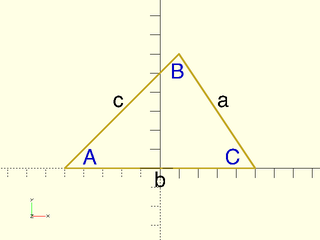
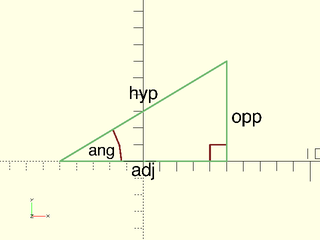

# LibFile: trigonometry.scad

Trigonometry shortcuts for people who can't be bothered to remember
all the function relations, or silly acronyms like SOHCAHTOA.

To use, add the following lines to the beginning of your file:

    include <BOSL2/std.scad>

## Table of Contents

1. [Section: 2D General Triangle Functions](#section-2d-general-triangle-functions)
    - [`law_of_cosines()`](#function-law_of_cosines)
    - [`law_of_sines()`](#function-law_of_sines)
    - [`triangle_area()`](#function-triangle_area)

2. [Section: 2D Right Triangle Functions](#section-2d-right-triangle-functions)
    - [`hyp_opp_to_adj()`](#function-hyp_opp_to_adj)
    - [`hyp_ang_to_adj()`](#function-hyp_ang_to_adj)
    - [`opp_ang_to_adj()`](#function-opp_ang_to_adj)
    - [`hyp_adj_to_opp()`](#function-hyp_adj_to_opp)
    - [`hyp_ang_to_opp()`](#function-hyp_ang_to_opp)
    - [`adj_ang_to_opp()`](#function-adj_ang_to_opp)
    - [`adj_opp_to_hyp()`](#function-adj_opp_to_hyp)
    - [`adj_ang_to_hyp()`](#function-adj_ang_to_hyp)
    - [`opp_ang_to_hyp()`](#function-opp_ang_to_hyp)
    - [`hyp_adj_to_ang()`](#function-hyp_adj_to_ang)
    - [`hyp_opp_to_ang()`](#function-hyp_opp_to_ang)
    - [`adj_opp_to_ang()`](#function-adj_opp_to_ang)

## Section: 2D General Triangle Functions

### Function: law\_of\_cosines()

**Usage:** 

- C = law\_of\_cosines(a, b, c);
- c = law\_of\_cosines(a, b, C=);

**Topics:** [Geometry](Topics#geometry), [Trigonometry](Topics#trigonometry), [Triangles](Topics#triangles)

**Description:** 

Applies the Law of Cosines for an arbitrary triangle.  Given three side lengths, returns the
angle in degrees for the corner opposite of the third side.  Given two side lengths, and the
angle between them, returns the length of the third side.

**Figure 1:** 

 

**Arguments:** 

<abbr title="These args can be used by position or by name.">By&nbsp;Position</abbr> | What it does
-------------------- | ------------
`a`                  | The length of the first side.
`b`                  | The length of the second side.
`c`                  | The length of the third side.

<abbr title="These args must be used by name, ie: name=value">By&nbsp;Name</abbr> | What it does
-------------------- | ------------
`C`                  | The angle in degrees of the corner opposite of the third side.

**See Also:** [law\_of\_sines()](#function-law_of_sines)

---

### Function: law\_of\_sines()

**Usage:** 

- B = law\_of\_sines(a, A, b);
- b = law\_of\_sines(a, A, B=);

**Topics:** [Geometry](Topics#geometry), [Trigonometry](Topics#trigonometry), [Triangles](Topics#triangles)

**Description:** 

Applies the Law of Sines for an arbitrary triangle.  Given two triangle side lengths and the
angle between them, returns the angle of the corner opposite of the second side.  Given a side
length, the opposing angle, and a second angle, returns the length of the side opposite of the
second angle.

**Figure 1:** 

 

**Arguments:** 

<abbr title="These args can be used by position or by name.">By&nbsp;Position</abbr> | What it does
-------------------- | ------------
`a`                  | The length of the first side.
`A`                  | The angle in degrees of the corner opposite of the first side.
`b`                  | The length of the second side.

<abbr title="These args must be used by name, ie: name=value">By&nbsp;Name</abbr> | What it does
-------------------- | ------------
`B`                  | The angle in degrees of the corner opposite of the second side.

**See Also:** [law\_of\_cosines()](#function-law_of_cosines)

---

### Function: triangle\_area()

**Usage:** 

- area = triangle\_area(p1,p2,p3);

**Topics:** [Geometry](Topics#geometry), [Trigonometry](Topics#trigonometry), [Triangles](Topics#triangles), [Area](Topics#area)

**Description:** 

Returns the area of a triangle formed between three 2D or 3D vertices.
Result will be negative if the points are 2D and in clockwise order.

**Arguments:** 

<abbr title="These args can be used by position or by name.">By&nbsp;Position</abbr> | What it does
-------------------- | ------------
`p1`                 | The first vertex of the triangle.
`p2`                 | The second vertex of the triangle.
`p3`                 | The third vertex of the triangle.

**Example 1:** 

    include <BOSL2/std.scad>
    triangle_area([0,0], [5,10], [10,0]);  // Returns -50
    triangle_area([10,0], [5,10], [0,0]);  // Returns 50

  

---

## Section: 2D Right Triangle Functions

This is a set of functions to make it easier to perform trig calculations on right triangles.
In general, all these functions are named using these abbreviations:
- **hyp**: The length of the Hypotenuse.
- **adj**: The length of the side adjacent to the angle.
- **opp**: The length of the side opposite to the angle.
- **ang**: The angle size in degrees.

If you know two of those, and want to know the value of a third, you will need to call a
function named like `AAA_BBB_to_CCC()`.  For example, if you know the length of the hypotenuse,
and the length of the side adjacent to the angle, and want to learn the length of the side
opposite to the angle, you will call `opp = hyp_adj_to_opp(hyp,adj);`.

**Figure 1:** 

 

### Function: hyp\_opp\_to\_adj()

**Alias:** opp\_hyp\_to\_adj()

**Usage:** 

- adj = hyp\_opp\_to\_adj(hyp,opp);
- adj = opp\_hyp\_to\_adj(opp,hyp);

**Topics:** [Geometry](Topics#geometry), [Trigonometry](Topics#trigonometry), [Triangles](Topics#triangles)

**Description:** 

Given the lengths of the hypotenuse and opposite side of a right triangle, returns the length
of the adjacent side.

**Arguments:** 

<abbr title="These args can be used by position or by name.">By&nbsp;Position</abbr> | What it does
-------------------- | ------------
`hyp`                | The length of the hypotenuse of the right triangle.
`opp`                | The length of the side of the right triangle that is opposite from the primary angle.

**Example 1:** 

    include <BOSL2/std.scad>
    hyp = hyp_opp_to_adj(5,3);  // Returns: 4

  

---

### Function: hyp\_ang\_to\_adj()

**Alias:** ang\_hyp\_to\_adj()

**Usage:** 

- adj = hyp\_ang\_to\_adj(hyp,ang);
- adj = ang\_hyp\_to\_adj(ang,hyp);

**Topics:** [Geometry](Topics#geometry), [Trigonometry](Topics#trigonometry), [Triangles](Topics#triangles)

**Description:** 

Given the length of the hypotenuse and the angle of the primary corner of a right triangle,
returns the length of the adjacent side.

**Arguments:** 

<abbr title="These args can be used by position or by name.">By&nbsp;Position</abbr> | What it does
-------------------- | ------------
`hyp`                | The length of the hypotenuse of the right triangle.
`ang`                | The angle in degrees of the primary corner of the right triangle.

**Example 1:** 

    include <BOSL2/std.scad>
    adj = hyp_ang_to_adj(8,60);  // Returns: 4

  

---

### Function: opp\_ang\_to\_adj()

**Alias:** ang\_opp\_to\_adj()

**Usage:** 

- adj = opp\_ang\_to\_adj(opp,ang);
- adj = ang\_opp\_to\_adj(ang,opp);

**Topics:** [Geometry](Topics#geometry), [Trigonometry](Topics#trigonometry), [Triangles](Topics#triangles)

**Description:** 

Given the angle of the primary corner of a right triangle, and the length of the side opposite of it,
returns the length of the adjacent side.

**Arguments:** 

<abbr title="These args can be used by position or by name.">By&nbsp;Position</abbr> | What it does
-------------------- | ------------
`opp`                | The length of the side of the right triangle that is opposite from the primary angle.
`ang`                | The angle in degrees of the primary corner of the right triangle.

**Example 1:** 

    include <BOSL2/std.scad>
    adj = opp_ang_to_adj(8,30);  // Returns: 4

  

---

### Function: hyp\_adj\_to\_opp()

**Alias:** adj\_hyp\_to\_opp()

**Usage:** 

- opp = hyp\_adj\_to\_opp(hyp,adj);
- opp = adj\_hyp\_to\_opp(adj,hyp);

**Topics:** [Geometry](Topics#geometry), [Trigonometry](Topics#trigonometry), [Triangles](Topics#triangles)

**Description:** 

Given the length of the hypotenuse and the adjacent side, returns the length of the opposite side.

**Arguments:** 

<abbr title="These args can be used by position or by name.">By&nbsp;Position</abbr> | What it does
-------------------- | ------------
`hyp`                | The length of the hypotenuse of the right triangle.
`adj`                | The length of the side of the right triangle that is adjacent to the primary angle.

**Example 1:** 

    include <BOSL2/std.scad>
    opp = hyp_adj_to_opp(5,4);  // Returns: 3

  

---

### Function: hyp\_ang\_to\_opp()

**Alias:** ang\_hyp\_to\_opp()

**Usage:** 

- opp = hyp\_ang\_to\_opp(hyp,ang);
- opp = ang\_hyp\_to\_opp(ang,hyp);

**Topics:** [Geometry](Topics#geometry), [Trigonometry](Topics#trigonometry), [Triangles](Topics#triangles)

**Description:** 

Given the length of the hypotenuse of a right triangle, and the angle of the corner, returns the length of the opposite side.

**Arguments:** 

<abbr title="These args can be used by position or by name.">By&nbsp;Position</abbr> | What it does
-------------------- | ------------
`hyp`                | The length of the hypotenuse of the right triangle.
`ang`                | The angle in degrees of the primary corner of the right triangle.

**Example 1:** 

    include <BOSL2/std.scad>
    opp = hyp_ang_to_opp(8,30);  // Returns: 4

  

---

### Function: adj\_ang\_to\_opp()

**Alias:** ang\_adj\_to\_opp()

**Usage:** 

- opp = adj\_ang\_to\_opp(adj,ang);
- opp = ang\_adj\_to\_opp(ang,adj);

**Topics:** [Geometry](Topics#geometry), [Trigonometry](Topics#trigonometry), [Triangles](Topics#triangles)

**Description:** 

Given the length of the adjacent side of a right triangle, and the angle of the corner, returns the length of the opposite side.

**Arguments:** 

<abbr title="These args can be used by position or by name.">By&nbsp;Position</abbr> | What it does
-------------------- | ------------
`adj`                | The length of the side of the right triangle that is adjacent to the primary angle.
`ang`                | The angle in degrees of the primary corner of the right triangle.

**Example 1:** 

    include <BOSL2/std.scad>
    opp = adj_ang_to_opp(8,45);  // Returns: 8

  

---

### Function: adj\_opp\_to\_hyp()

**Alias:** opp\_adj\_to\_hyp()

**Usage:** 

- hyp = adj\_opp\_to\_hyp(adj,opp);
- hyp = opp\_adj\_to\_hyp(opp,adj);

**Topics:** [Geometry](Topics#geometry), [Trigonometry](Topics#trigonometry), [Triangles](Topics#triangles)

**Description:** 

Given the length of the adjacent and opposite sides of a right triangle, returns the length of thee hypotenuse.

**Arguments:** 

<abbr title="These args can be used by position or by name.">By&nbsp;Position</abbr> | What it does
-------------------- | ------------
`adj`                | The length of the side of the right triangle that is adjacent to the primary angle.
`opp`                | The length of the side of the right triangle that is opposite from the primary angle.

**Example 1:** 

    include <BOSL2/std.scad>
    hyp = adj_opp_to_hyp(3,4);  // Returns: 5

  

---

### Function: adj\_ang\_to\_hyp()

**Alias:** ang\_adj\_to\_hyp()

**Usage:** 

- hyp = adj\_ang\_to\_hyp(adj,ang);
- hyp = ang\_adj\_to\_hyp(ang,adj);

**Topics:** [Geometry](Topics#geometry), [Trigonometry](Topics#trigonometry), [Triangles](Topics#triangles)

**Description:** 

For a right triangle, given the length of the adjacent side, and the corner angle, returns the length of the hypotenuse.

**Arguments:** 

<abbr title="These args can be used by position or by name.">By&nbsp;Position</abbr> | What it does
-------------------- | ------------
`adj`                | The length of the side of the right triangle that is adjacent to the primary angle.
`ang`                | The angle in degrees of the primary corner of the right triangle.

**Example 1:** 

    include <BOSL2/std.scad>
    hyp = adj_ang_to_hyp(4,60);  // Returns: 8

  

---

### Function: opp\_ang\_to\_hyp()

**Alias:** ang\_opp\_to\_hyp()

**Usage:** 

- hyp = opp\_ang\_to\_hyp(opp,ang);
- hyp = ang\_opp\_to\_hyp(ang,opp);

**Topics:** [Geometry](Topics#geometry), [Trigonometry](Topics#trigonometry), [Triangles](Topics#triangles)

**Description:** 

For a right triangle, given the length of the opposite side, and the corner angle, returns the length of the hypotenuse.

**Arguments:** 

<abbr title="These args can be used by position or by name.">By&nbsp;Position</abbr> | What it does
-------------------- | ------------
`opp`                | The length of the side of the right triangle that is opposite from the primary angle.
`ang`                | The angle in degrees of the primary corner of the right triangle.

**Example 1:** 

    include <BOSL2/std.scad>
    hyp = opp_ang_to_hyp(4,30);  // Returns: 8

  

---

### Function: hyp\_adj\_to\_ang()

**Alias:** adj\_hyp\_to\_ang()

**Usage:** 

- ang = hyp\_adj\_to\_ang(hyp,adj);
- ang = adj\_hyp\_to\_ang(adj,hyp);

**Description:** 

For a right triangle, given the lengths of the hypotenuse and the adjacent sides, returns the angle of the corner.

**Arguments:** 

<abbr title="These args can be used by position or by name.">By&nbsp;Position</abbr> | What it does
-------------------- | ------------
`hyp`                | The length of the hypotenuse of the right triangle.
`adj`                | The length of the side of the right triangle that is adjacent to the primary angle.

**Example 1:** 

    include <BOSL2/std.scad>
    ang = hyp_adj_to_ang(8,4);  // Returns: 60 degrees

  

---

### Function: hyp\_opp\_to\_ang()

**Alias:** opp\_hyp\_to\_ang()

**Usage:** 

- ang = hyp\_opp\_to\_ang(hyp,opp);
- ang = opp\_hyp\_to\_ang(opp,hyp);

**Topics:** [Geometry](Topics#geometry), [Trigonometry](Topics#trigonometry), [Triangles](Topics#triangles)

**Description:** 

For a right triangle, given the lengths of the hypotenuse and the opposite sides, returns the angle of the corner.

**Arguments:** 

<abbr title="These args can be used by position or by name.">By&nbsp;Position</abbr> | What it does
-------------------- | ------------
`hyp`                | The length of the hypotenuse of the right triangle.
`opp`                | The length of the side of the right triangle that is opposite from the primary angle.

**Example 1:** 

    include <BOSL2/std.scad>
    ang = hyp_opp_to_ang(8,4);  // Returns: 30 degrees

  

---

### Function: adj\_opp\_to\_ang()

**Alias:** opp\_adj\_to\_ang()

**Usage:** 

- ang = adj\_opp\_to\_ang(adj,opp);
- ang = opp\_adj\_to\_ang(opp,adj);

**Topics:** [Geometry](Topics#geometry), [Trigonometry](Topics#trigonometry), [Triangles](Topics#triangles)

**Description:** 

For a right triangle, given the lengths of the adjacent and opposite sides, returns the angle of the corner.

**Arguments:** 

<abbr title="These args can be used by position or by name.">By&nbsp;Position</abbr> | What it does
-------------------- | ------------
`adj`                | The length of the side of the right triangle that is adjacent to the primary angle.
`opp`                | The length of the side of the right triangle that is opposite from the primary angle.

**Example 1:** 

    include <BOSL2/std.scad>
    ang = adj_opp_to_ang(sqrt(3)/2,0.5);  // Returns: 30 degrees

  

---

