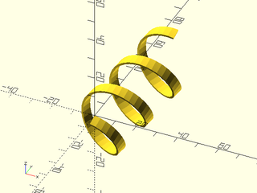
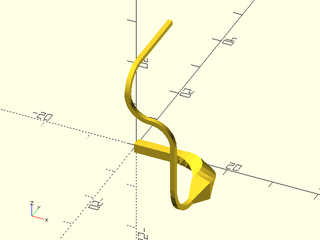

# LibFile: turtle3d.scad

Three dimensional turtle graphics to generate 3d paths or sequences
of 3d transformations.

To use, add the following lines to the beginning of your file:

    include <BOSL2/std.scad>
    include <BOSL2/turtle3d.scad>

## Table of Contents

1. [Section: Functions](#section-functions)
    - [`turtle3d()`](#function-turtle3d)

## Section: Functions

### Function: turtle3d()

**Usage:** 

- turtle3d(commands, [state], [transforms], [full\_state], [repeat])

**Description:** 

Like the classic two dimensional turtle, the 3d turtle flies through space following a sequence
of turtle graphics commands to generate either a sequence of transformations (suitable for input
to sweep) or a 3d path.  The turtle state keeps track of the position and orientation (including twist)
and scale of the turtle.  By default the turtle begins pointing along the X axis with the "right" direction
along the -Y axis and the "up" direction aligned with the Z axis.  You can give a direction vector
for the state input to change the starting direction.  Because of the complexity of object positioning
in three space, some types of movement require compound commands.  These compound commands are lists that specify several operations
all applied to one turtle step.  For example:  ["move", 4, "twist", 25] executes a twist while moving, and
the command ["arc", 4, "grow", 2, "right", 45, "up", 30] turns to the right and up while also growing the object.

You can turn the turtle using relative commands, "right", "left", "up" and "down", which operate relative
to the turtle's current orientation.   This is sometimes confusing, so you can also use absolute
commands which turn the turtle relative to the absolute coordinate system, the "xrot", "yrot" and "zrot"
commands.  You can use "setdir" to point the turtle along a given vector.
If you want a valid transformation list for use with sweep you will usually want to avoid abrupt changes
in the orientation of the turtle.  To do this, use the "arc"
forms for turns.  This form, with commands like "arcright" and "arcup" creates an arc with a gradual
change in the turtle orientation, which usually produces a better result for sweep operations.

Another potential problem for sweep is a command that makes movements not relative to the turtle's current direction such as
"jump" or "untily".  These commands are not a problem for tracing out a path, but if you want a swept shape to
maintain a constant cross sectional shape then you need to avoid them.  operations and avoid the movement commands
which do not move relative to the turtle direction such as the "jump" commands.

If you use sweep to convert a turtle path into a 3d shape the result depends both on the path the shape traces out but also
the twist and size of the shape.  The "twist" parameter described below to the compound commands has no effect on
the turtle orientation for the purpose of defining movement, but it will rotate the swept shape around the origin
as it traces out the path.  Similarly the "grow" and "shrink" options allow you to change the size of the swept
polygon without any effect on the turtle.  The "roll" command differs from "twist" in that it both rotates the swept
polygon but also changes the turtle's orientation, so it will alter subsequent operations of the turtle.  Note that
when making a path, "twist" will have no effect, but "roll" may have an effect because of how it changes the path.

The compound "move" command accepts a "reverse" argument.  If you specify "reverse" it reflects the
turtle direction to point backwards.  This enables you to back out to create a hollow shape.  But be
aware that everything is reversed, so turns will be the opposite direction.  So for example if you
used "arcright" on the outside you might expect arcleft when reversed on the inside, but it will
be "arcright" again.  (Note that "reverse" is the only command that appears by itself with no argument

By default you get a simple path (like the 2d turtle) which ignores growing/shrinking or twisting in the
transformation.  If you select transform=true then you will get a list of transformations returned.  Some of
of the commands are likely to produce transformation lists that are invalid for sweep.  The "jump" commands
can move in directions not perpendicular to the current direction of movement, which may produce bad results.
The turning commands like "left" or "up" can rotate the frame so that a sweep operation is invalid.
The `T` column in the list below marks commands that operate relative
to the current frame that should generally produce valid sweep transformations.
Be aware that it is possible to create a self intersection, and hence an invalid swept shape, if the radii of
arcs in turtle are smaller than the width of the polygon you use with sweep.

The turtle state is a list containing:
  - a list of path transformations, the transformations that move the turtle along the path
  - a list of object transformations, the transformations that twist or scale the cross section as the turtle moves
  - the current movement step size (scalar)
  - the current default angle
  - the current default arcsteps

Commands   |T | Arguments          | What it does
---------- |--| ------------------ | -------------------------------
"move"     |x | [dist]             | Move turtle scale*dist units in the turtle direction.  Default dist=1.
"xmove"    |  | [dist]             | Move turtle scale*dist units in the x direction. Default dist=1.  Does not change turtle direction.
"ymove"    |  | [dist]             | Move turtle scale*dist units in the y direction. Default dist=1.  Does not change turtle direction.
"zmove"    |  | [dist]             | Move turtle scale*dist units in the y direction. Default dist=1.  Does not change turtle direction.
"xyzmove"  |  | vector             | Move turtle by the specified vector.  Does not change turtle direction.
"untilx"   |x | xtarget            | Move turtle in turtle direction until x==xtarget.  Produces an error if xtarget is not reachable.
"untily"   |x | ytarget            | Move turtle in turtle direction until y==ytarget.  Produces an error if ytarget is not reachable.
"untilz"   |x | ytarget            | Move turtle in turtle direction until y==ytarget.  Produces an error if ztarget is not reachable.
"jump"     |  | point              | Move the turtle to the specified point
"xjump"    |  | x                  | Move the turtle's x position to the specified value
"yjump     |  | y                  | Move the turtle's y position to the specified value
"zjump     |  | y                  | Move the turtle's y position to the specified value
"left"     |  | [angle]            | Turn turtle left by specified angle or default angle
"right"    |  | [angle]            | Turn turtle to the right by specified angle or default angle
"up"       |  | [angle]            | Turn turtle up by specified angle or default angle
"down"     |  | [angle]            | Turn turtle down by specified angle or default angle
"xrot"     |x | [angle]            | Turn turtle around x-axis by specified angle or default angle
"yrot"     |x | [angle]            | Turn turtle around y-axis by specified angle or default angle
"zrot"     |x | [angle]            | Turn turtle around z-axis by specified angle or default angle
"rot"      |x | rotation           | Turn turtle by specified rotation relative to absolute coordinates
"angle"    |x | angle              | Set the default turn angle.
"setdir"   |  | vector             | Rotate the reference frame along the shortest path to specified direction
"length"   |x | length             | Change the turtle move distance to `length`
"scale"    |x | factor             | Multiply turtle move distances by `factor`.  Does not rescale the cross sectional shape in transformation lists.
"addlength"|x | length             | Add `length` to the turtle move distance
"repeat"   |x | count, commands    | Repeats a list of commands `count` times.  (To repeat a compound command put it in a list: `[["move",10,"grow",2]]`)
"arcleft"  |x | radius, [angle]    | Draw an arc from the current position toward the left at the specified radius and angle.  The turtle turns by `angle`.
"arcright" |x | radius, [angle]    | Draw an arc from the current position upward at the specified radius and angle
"arcup"    |x | radius, [angle]    | Draw an arc from the current position down at the specified radius and angle
"arcdown"  |x | radius, [angle]    | Draw an arc from the current position down at the specified radius and angle
"arcxrot"  |x | radius, [angle]    | Draw an arc turning around x-axis by specified angle or default angle
"arcyrot"  |x | radius, [angle]    | Draw an arc turning around y-axis by specified angle or default angle
"arczrot"  |x | radius, [angle]    | Draw an arc turning around z-axis by specified angle or default angle
"arcrot"   |x | radius, rotation   | Draw an arc turning by the specified absolute rotation with given radius
"arctodir" |x | radius, vector     | Draw an arc turning to point in the (absolute) direction of given vector
"arcsteps" |x | count              | Specifies the number of segments to use for drawing arcs.  If you set it to zero then the standard `$fn`, `$fa` and `$fs` variables define the number of segments.

Compound commands are lists that group multiple commands to be applied simultaneously during a
turtle movement.  Example: `["move", 5, "shrink", 2]`.  The subcommands that may appear are
listed below.  Each compound command must begin with either "move" or "arc".  The order of
subcommands is not important.  Left/right turning is applied before up/down.  You cannot combine
"rot" or "todir" with any other turning commands.

Subcommands  | Arguments          | What it does
------------ | ------------------ | -------------------------------
"move"       | dist               | Compound command is a forward movement operation
"arc"        | radius             | Compound command traces an arc
"grow"       | factor             | Increase size by specified factor (e.g. 2 doubles the size); factor can be a 2-vector
"shrink"     | factor             | Decrease size by specified factor (e.g. 2 halves the size); factor can be a 2-vector
"twist"      | angle              | Twist by the specified angle over the arc or segment (does not change frame orientation)
"roll"       | angle              | Roll by the specified angle over the arc or segment (changes the orientation of the frame)
"steps"      | count              | Divide arc or segment into this many steps.  Default is 1 for segments, arcsteps for arcs
"reverse"    |                    | For "move" only: If given then reverses the turtle after the move
"right"      | angle              | For "arc" only: Turn to the right by specified angle
"left"       | angle              | For "arc" only: Turn to the left by specified angle
"up"         | angle              | For "arc" only: Turn up by specified angle
"down"       | angle              | For "arc" only: Turn down by specified angle
"xrot"       | angle              | For "arc" only: Absolute rotation around x axis. Cannot be combined with any other rotation.
"yrot"       | angle              | For "arc" only: Absolute rotation around y axis. Cannot be combined with any other rotation.
"zrot"       | angle              | For "arc" only: Absolute rotation around z axis. Cannot be combined with any other rotation.
"rot"        | rotation           | For "arc" only: Turn by specified absolute rotation as a matrix, e.g. xrot(33)*zrot(47).  Cannot be combined with any other rotation.
"todir"      | vector             | For "arc" only: Turn to point in the specified direction

The "twist", "shrink" and "grow" subcommands will only have an effect if you return a transformation list.  They do not
change the path the turtle traces.  The "roll" subcommand, on the other hand, changes the turtle frame orientation, so it can alter the path.
The "xrot", "yrot" and "zrot" subcommands can make turns larger than 180 degrees, and even larger than 360 degrees.  If you use "up",
"down", "left" or "right" alone then you can give any angle, but if you combine "up"/"down" with "left"/"right" then the specified
angles must be smaller than 180 degrees.  (This is because the algorithm decodes the rotation into an angle smaller than 180, so
the results are very strange if larger angles are permitted.)

**Arguments:** 

<abbr title="These args can be used by position or by name.">By&nbsp;Position</abbr> | What it does
-------------------- | ------------
`commands`           | List of turtle3d commands
`state`              | Starting turtle direction or full turtle state (from a previous call).  Default: RIGHT
`transforms`         | If true teturn list of transformations instead of points.  Default: false
`full_state`         | If true return full turtle state for continuing the path in subsequent turtle calls.  Default: false
`repeat`             | Number of times to repeat the command list.  Default: 1

**Example 1:** Angled rectangle

 

    include <BOSL2/std.scad>
    include <BOSL2/turtle3d.scad>
    path = turtle3d(["up",25,"move","left","move",3,"left","move"]);
    stroke(path,closed=true, width=.2);

**Example 2:** Path with rounded corners.  Note first and last point of the path are duplicates.

 

    include <BOSL2/std.scad>
    include <BOSL2/turtle3d.scad>
    r = 0.25;
    path = turtle3d(["up",25,"move","arcleft",r,"move",3,"arcleft",r,"move","arcleft",r,"move",3,"arcleft",r]);
    stroke(path,closed=true, width=.2);

**Example 3:** Non-coplanar figure

 

    include <BOSL2/std.scad>
    include <BOSL2/turtle3d.scad>
    path = turtle3d(["up",25,"move","left","move",3,"up","left",0,"move"]);
    stroke(path,closed=true, width=.2);

**Example 4:** Square spiral.  Note that the core twists because the "up" and "left" turns are relative to the previous turns.

    include <BOSL2/std.scad>
    include <BOSL2/turtle3d.scad>
    include<BOSL2/skin.scad>
    path = turtle3d(["move",10,"left","up",15],repeat=50);
    path_sweep(circle(d=1, $fn=12), path);

  

**Example 5:** Square spiral, second try.  Use roll to create the spiral instead of turning up.  It still twists because the left turns are inclined.

    include <BOSL2/std.scad>
    include <BOSL2/turtle3d.scad>
    include<BOSL2/skin.scad>
    path = turtle3d(["move",10,"left","roll",10],repeat=50);
    path_sweep(circle(d=1, $fn=12), path);

  

**Example 6:** Square spiral, third try.  One way to avoid the core twisting in the spiral is to use absolute turns.  Note that the vertical rise is controlled by the starting upward angle of the turtle, which is preserved as we rotate around the z axis.

    include <BOSL2/std.scad>
    include <BOSL2/turtle3d.scad>
    include<BOSL2/skin.scad>
    path = turtle3d(["up", 5, "repeat", 12, ["move",10,"zrot"]]);
    path_sweep(circle(d=1, $fn=12), path);

  

**Example 7:** Square spiral, rounded corners.  Careful use of rotations can work for sweep, but it may be better to round the corners.  Here we return a list of transforms and use sweep instead of path\_sweep:

 

    include <BOSL2/std.scad>
    include <BOSL2/turtle3d.scad>
    include<BOSL2/skin.scad>
    path = turtle3d(["up", 5, "repeat", 12, ["move",10,"arczrot",4]],transforms=true);
    sweep(circle(d=1, $fn=12), path);

**Example 8:** Mixing relative and absolute commands

 

    include <BOSL2/std.scad>
    include <BOSL2/turtle3d.scad>
    include<BOSL2/skin.scad>
    path = turtle3d(["repeat", 4, ["move",80,"arczrot",40],
                     "arcyrot",40,-90,
                     "move",40,
                     "arcxrot",40,90,
                     ["arc",14,"rot",xrot(90)*zrot(-33)],
                     "move",80,
                     "arcyrot",40,
                     "arcup",40,
                     "arcleft",40,
                     "arcup",30,
                     ["move",100,"twist",90,"steps",20],
                    ],
                    state=[1,0,.2],transforms=true);
    ushape = rot(90,p=[[-10, 0],[-10, 10],[ -7, 10],[ -7, 2],[  7, 2],[  7, 7],[ 10, 7],[ 10, 0]]);
    sweep(ushape, path);

**Example 9:** Generic helix, constructed by a sequence of movements and then rotations

 

    include <BOSL2/std.scad>
    include <BOSL2/turtle3d.scad>
    include<BOSL2/skin.scad>
    radius=14;       // Helix radius
    pitch=20;        // Distance from one turn to the next
    turns=3;         // Number of turns
    turn_steps=32;   // Number of steps on each turn
    axis = [1,4,1];  // Helix axis
    up_angle = atan2(pitch,2*PI*radius);
    helix = turtle3d([
                       "up", up_angle,
                       "zrot", 360/turn_steps/2,
                       "rot", rot(from=UP,to=axis), // to correct the turtle direction
                       "repeat", turn_steps*turns,
                       [
                        "move", norm([2*PI*radius, pitch])/turn_steps,
                        "rot",  rot(360/turn_steps,v=axis)
                       ],
                      ], transforms=true);
    sweep(subdivide_path(square([5,1]),20), helix);

**Example 10:** Helix generated by a single command.  Note this only works for x, y, or z aligned helixes because the generic rot cannot handle multi-turn angles.

    include <BOSL2/std.scad>
    include <BOSL2/turtle3d.scad>
    include<BOSL2/skin.scad>
    pitch=20;       // Distance from one turn to the next
    radius=14;      // Helix radius
    turns=3;        // Number of turns
    turn_steps=33;  // Steps on each turn
    up_angle = atan2(pitch,2*PI*radius);
    helix = turtle3d([
                      "up", up_angle,
                      [
                        "arc", radius,
                        "zrot", 360*turns,
                        "steps", turn_steps*turns,
                      ]
                     ], transforms=true);
    sweep(subdivide_path(square([5,1]),80), helix);

  

**Example 11:** Expanding helix

 

    include <BOSL2/std.scad>
    include <BOSL2/turtle3d.scad>
    include<BOSL2/skin.scad>
    path = turtle3d(["length",.2,"angle",360/20,"up",5,"repeat",50,["move","zrot","addlength",0.05]]);
    path_sweep(circle(d=1, $fn=12), path);

**Example 12:** Adding some twist to the model

 

    include <BOSL2/std.scad>
    include <BOSL2/turtle3d.scad>
    include<BOSL2/skin.scad>
    r = 2.5;
    trans = turtle3d(["move",10,
                      "arcleft",r,
                      ["move",30,"twist",180,"steps",40],
                      "arcleft",r,
                      "move",10,
                      "arcleft",r,
                      ["move",30,"twist",360,"steps",40],
                      "arcleft",r],
                     state=yrot(25,p=RIGHT),transforms=true);
    sweep(supershape(m1=4,n1=4,n2=16,n3=1.5,a=.9,b=9,step=5),trans);

**Example 13:** Twist does not change the turtle orientation, but roll does.  The only change from the previous example is twist was changed to roll.

 

    include <BOSL2/std.scad>
    include <BOSL2/turtle3d.scad>
    include<BOSL2/skin.scad>
    r = 2;
    trans = turtle3d(["move",10,
                      "arcleft",r,
                      ["move",30,"roll",180,"steps",40],
                      "arcleft",r,
                      "move",10,
                      "arcleft",r,
                      ["move",30,"roll",360,"steps",40],
                      "arcleft",r],
                     state=yrot(25,p=RIGHT),transforms=true);
    sweep(supershape(m1=4,n1=4,n2=16,n3=1.5,a=.9,b=9,step=5),trans);

**Example 14:** Use of shrink and grow

    include <BOSL2/std.scad>
    include <BOSL2/turtle3d.scad>
    include<BOSL2/skin.scad>
    $fn=32;
    T = turtle3d([
                  "move",10,
                  ["arc",8,"right", 90, "twist", 90, "grow", 2],
                  ["move", 5,"shrink",4,"steps",4],
                  ["arc",8, "right", 45, "up", 90],
                  "move", 10,
                  "arcright", 5, 90,
                  "arcleft", 5, 90,
                  "arcup", 5, 90,
                  "untily", -1,
                 ],state=RIGHT, transforms=true);
    sweep(square(2,center=true),T);

  

**Example 15:** After several moves you may not understand the turtle orientation. An absolute reorientation with "arctodir" is helpful to head in a known direction

    include <BOSL2/std.scad>
    include <BOSL2/turtle3d.scad>
    include<BOSL2/skin.scad>
    trans = turtle3d([
                   "move",5,
                   "arcup",1,
                   "move",8,
                   "arcright",1,
                   "move",6,
                   "arcdown",1,
                   "move",4,
                   ["arc",2,"right",45,"up",25,"roll",25],
                   "untilz",4,
                   "move",1,
                   "arctodir",1,DOWN,
                   "untilz",0
                   ],transforms=true);
    sweep(square(1,center=true),trans);

  

**Example 16:** The "grow" and "shrink" commands can take a vector giving x and y scaling

    include <BOSL2/std.scad>
    include <BOSL2/turtle3d.scad>
    include<BOSL2/skin.scad>
    tr = turtle3d([
                    "move", 1.5,
                    ["move", 5, "grow", [1,2],  "steps", 10],
                    ["move", 5, "grow", [2,0.5],"steps", 10]
                   ], transforms=true);
    sweep(circle($fn=32,r=1), tr);

  

**Example 17:** With "twist" added the anisotropic "grow" interacts with "twist", producing a complex form

 

    include <BOSL2/std.scad>
    include <BOSL2/turtle3d.scad>
    include<BOSL2/skin.scad>
    tr = turtle3d([
                    "move", 1.5,
                    ["move", 5, "grow", [1,2],  "steps", 20, "twist",90],
                    ["move", 5, "grow", [0.5,2],"steps", 20, "twist",90]
                   ], transforms=true);
    sweep(circle($fn=64,r=1), tr);

**Example 18:** Making a tube with "reverse".  Note that the move direction is the same even though the direction is reversed.

    include <BOSL2/std.scad>
    include <BOSL2/turtle3d.scad>
    include<BOSL2/skin.scad>
    tr = turtle3d([ "move", 4,
                    ["move",0, "grow", .8, "reverse"],
                    "move", 4
                  ],  transforms=true);
    back_half(s=10)
      sweep(circle(r=1,$fn=16), tr, closed=true);

  

**Example 19:** To close the tube at one end we set closed to false in sweep.

    include <BOSL2/std.scad>
    include <BOSL2/turtle3d.scad>
    include<BOSL2/skin.scad>
    tr = turtle3d([ "move", 4,
                    ["move",0, "grow", .8, "reverse"],
                    "move", 3.75
                  ],  transforms=true);
    back_half(s=10)
      sweep(circle(r=1,$fn=16), tr, closed=false);

  

**Example 20:** Cookie cutter using "reverse"

    include <BOSL2/std.scad>
    include <BOSL2/turtle3d.scad>
    include<BOSL2/skin.scad>
    cutter = turtle3d( [
                        ["move", 10, "shrink", 1.3, ],
                        ["move", 2, "reverse" ],
                        ["move", 8, "shrink", 1.3 ],
                       ], transforms=true,state=UP);
    cookie_shape = star(5, r=10, ir=5);
    sweep(cookie_shape, cutter, closed=true);

  

**Example 21:** angled shopvac adapter.  Shopvac tubing wedges together because the tubes are slightly tapered.  We can make this part without using any difference() operations by using "reverse" to trace out the interior portion of the part.  Note that it's "arcright" even when reversed.

 

    include <BOSL2/std.scad>
    include <BOSL2/turtle3d.scad>
    include<BOSL2/skin.scad>
    inch = 25.4;
    insert_ID = 2.3*inch;        // Size of shopvac tube at larger end of taper
    wall = 1.7;                  // Desired wall thickness
    seg1_bot_ID = insert_ID;     // Bottom section, to have tube inserted, specify ID
    seg2_bot_OD = insert_ID+.03; // Top section inserts into a tube, so specify tapered OD
    seg2_top_OD = 2.26*inch;     // The slightly oversized value gave me a better fit
    seg1_len = 3*inch;           // Length of bottom section
    seg2_len = 2*inch;           // Length of top section
    bend_angle=45;               // Angle to bend, 45 or less to print without supports!
    // Other diameters derived from the wall thickness
    seg1_bot_OD = seg1_bot_ID+2*wall;
    seg2_bot_ID = seg2_bot_OD-2*wall;
    seg2_top_ID = seg2_top_OD-2*wall;
    bend_r = 0.5*inch+seg1_bot_OD/2;   // Bend radius to get constant wall thickness
    trans = turtle3d([
                        ["move", seg1_len, "grow", seg2_bot_OD/seg1_bot_OD],
                        "arcright", bend_r, bend_angle,
                        ["move", seg2_len, "grow", seg2_top_OD/seg2_bot_OD],
                        ["move", 0, , "reverse", "grow", seg2_top_ID/seg2_top_OD],
                        ["move", seg2_len, "grow", seg2_bot_ID/seg2_top_ID],
                        "arcright", bend_r, bend_angle,
                        ["move", seg1_len, "grow", seg1_bot_ID/seg2_bot_ID]
                     ],
                     state=UP, transforms=true);
    back_half()      // Remove this to get a usable part
      sweep(circle(d=seg1_bot_OD, $fn=128), trans, closed=true);

**Example 22:** Closed spiral

    include <BOSL2/std.scad>
    include <BOSL2/turtle3d.scad>
    include<BOSL2/skin.scad>
    steps = 500;
    spiral = turtle3d([
                       ["arc", 20,
                        "twist", 120,
                        "zrot", 360*4,
                        "steps",steps,
                        "shrink",1.5],
                       ["arc", 20,
                        "twist", 120,
                        "zrot", 360*4,
                        "steps",steps/5 ],
                       ["arc", 20,
                        "twist", 120,
                        "zrot", 360*4,
                        "steps",steps,
                        "grow",1.5],
                       ], transforms=true);
    sweep(fwd(25,p=circle(r=2,$fn=24)), spiral, caps=false);

  

**Example 23:** Mobius strip (square)

 

    include <BOSL2/std.scad>
    include <BOSL2/turtle3d.scad>
    include<BOSL2/skin.scad>
    mobius = turtle3d([["arc", 20, "zrot", 360,"steps",100,"twist",180]], transforms=true);
    sweep(subdivide_path(square(8,center=true),16), mobius, closed=false);

**Example 24:** Torus knot

 

    include <BOSL2/std.scad>
    include <BOSL2/turtle3d.scad>
    include<BOSL2/skin.scad>
    p = 3;      // (number of turns)*gcd(p,q)
    q = 10;     // (number of dives)*gcd(p,q)
    steps = 60; // steps per turn
    cordR  = 2; // knot cord radius
    torusR = 20;// torus major radius
    torusr = 4; // torus minor radius
    knot_radius = torusr + 0.75*cordR; // inner radius of knot, set to torusr to put knot
    wind_angle = atan(p / q *torusR / torusr);            // center on torus surface
    m = gcd(p,q);
    torus_knot0 =
        turtle3d([ "arcsteps", 1,
                   "repeat", p*steps/m-1 ,
                      [ [ "arc", torusR, "left", 360/steps, "twist", 360*q/p/steps ] ]
                 ], transforms=true);
    torus_knot = [for(tr=torus_knot0) tr*xrot(wind_angle+90)];
    torus = turtle3d( ["arcsteps", steps, "arcleft", torusR, 360], transforms=true);
    fwd(torusR){ // to center the torus and knot at the origin
        color([.8,.7,1])
          sweep(right(knot_radius,p=circle(cordR,$fn=16)), torus_knot,closed=true);
        color("blue")
          sweep(circle(torusr,$fn=24), torus);
    }

---

