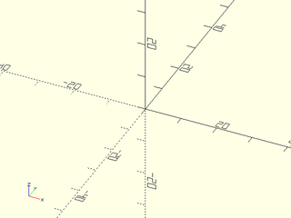
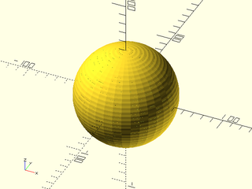

# LibFile: utility.scad

Functions for type checking, handling undefs, processing function arguments,
and testing.

To use, add the following lines to the beginning of your file:

    include <BOSL2/std.scad>

## Table of Contents

1. [Section: Type Checking](#section-type-checking)
    - [`typeof()`](#function-typeof)
    - [`is_type()`](#function-is_type)
    - [`is_def()`](#function-is_def)
    - [`is_str()`](#function-is_str)
    - [`is_int()`](#function-is_int)
    - [`is_nan()`](#function-is_nan)
    - [`is_finite()`](#function-is_finite)
    - [`is_range()`](#function-is_range)
    - [`valid_range()`](#function-valid_range)
    - [`is_func()`](#function-is_func)
    - [`is_consistent()`](#function-is_consistent)
    - [`same_shape()`](#function-same_shape)
    - [`is_bool_list()`](#function-is_bool_list)

2. [Section: Handling `undef`s.](#section-handling-undefs)
    - [`default()`](#function-default)
    - [`first_defined()`](#function-first_defined)
    - [`one_defined()`](#function-one_defined)
    - [`num_defined()`](#function-num_defined)
    - [`any_defined()`](#function-any_defined)
    - [`all_defined()`](#function-all_defined)

3. [Section: Processing Arguments to Functions and Modules](#section-processing-arguments-to-functions-and-modules)
    - [`get_anchor()`](#function-get_anchor)
    - [`get_radius()`](#function-get_radius)
    - [`scalar_vec3()`](#function-scalar_vec3)
    - [`segs()`](#function-segs)
    - [`no_children()`](#module-no_children)
    - [`no_function()`](#function-no_function)
    - [`no_module()`](#module-no_module)

4. [Section: Testing Helpers](#section-testing-helpers)
    - [`assert_approx()`](#module-assert_approx)
    - [`assert_equal()`](#module-assert_equal)
    - [`shape_compare()`](#module-shape_compare)

5. [Section: Looping Helpers](#section-looping-helpers)
    - [`looping()`](#function-looping)
    - [`loop_while()`](#function-loop_while)
    - [`loop_done()`](#function-loop_done)


## Section: Type Checking


### Function: typeof()

**Usage:** 

- typ = typeof(x);

**Topics:** [Type Checking](Topics#type-checking)

**Description:** 

Returns a string representing the type of the value.  One of "undef", "boolean", "number", "nan", "string", "list", "range", "function" or "invalid".
Some malformed "ranges", like '[0:NAN:INF]' and '[0:"a":INF]', may be classified as "undef" or "invalid".

**See Also:** [is\_type()](#function-is_type)

**Example 1:** 

    include <BOSL2/std.scad>
    typ = typeof(undef);  // Returns: "undef"
    typ = typeof(true);  // Returns: "boolean"
    typ = typeof(42);  // Returns: "number"
    typ = typeof(NAN);  // Returns: "nan"
    typ = typeof("foo");  // Returns: "string"
    typ = typeof([3,4,5]);  // Returns: "list"
    typ = typeof([3:1:8]);  // Returns: "range"
    typ = typeof(function (x,y) x+y);  // Returns: "function"

<br clear="all" /><br/>

---

### Function: is\_type()

**Usage:** 

- bool = is\_type(x, types);

**Topics:** [Type Checking](Topics#type-checking)

**Description:** 

Returns true if the type of the value `x` is one of those given as strings in the list `types`.
Valid types are "undef", "boolean", "number", "nan", "string", "list", "range", or "function".

**Arguments:** 

<abbr title="These args can be used by position or by name.">By&nbsp;Position</abbr> | What it does
-------------------- | ------------
`x`                  | The value to check the type of.
`types`              | A list of types to check

**See Also:** [typeof()](#function-typeof)

**Example 1:** 

    include <BOSL2/std.scad>
    is_str_or_list = is_type("foo", ["string","list"]);   // Returns: true
    is_str_or_list2 = is_type([1,2,3], ["string","list"]);  // Returns: true
    is_str_or_list3 = is_type(2, ["string","list"]);  // Returns: false
    is_str = is_type("foo", "string");  // Returns: true
    is_str2 = is_type([3,4], "string");  // Returns: false
    is_str3 = is_type(["foo"], "string");  // Returns: false
    is_str4 = is_type(3, "string");  // Returns: false

<br clear="all" /><br/>

---

### Function: is\_def()

**Usage:** 

- bool = is\_def(x);

**Topics:** [Type Checking](Topics#type-checking)

**Description:** 

Returns true if `x` is not `undef`.  False if `x==undef`.

**See Also:** [typeof()](#function-typeof), [is\_type()](#function-is_type), [is\_str()](#function-is_str)

**Example 1:** 

    include <BOSL2/std.scad>
    bool = is_def(undef);  // Returns: false
    bool = is_def(false);  // Returns: true
    bool = is_def(42);     // Returns: true
    bool = is_def("foo");  // Returns: true

<br clear="all" /><br/>

---

### Function: is\_str()

**Usage:** 

- bool = is\_str(x);

**Topics:** [Type Checking](Topics#type-checking)

**Description:** 

Returns true if `x` is a string.  A shortcut for `is_string()`.

**See Also:** [typeof()](#function-typeof), [is\_type()](#function-is_type), [is\_int()](#function-is_int), [is\_def()](#function-is_def)

**Example 1:** 

    include <BOSL2/std.scad>
    bool = is_str(undef);  // Returns: false
    bool = is_str(false);  // Returns: false
    bool = is_str(42);     // Returns: false
    bool = is_str("foo");  // Returns: true

<br clear="all" /><br/>

---

### Function: is\_int()

**Alias:** is\_integer()


**Usage:** 

- bool = is\_int(n);
- bool = is\_integer(n);

**Topics:** [Type Checking](Topics#type-checking)

**Description:** 

Returns true if the given value is an integer (it is a number and it rounds to itself).

**See Also:** [typeof()](#function-typeof), [is\_type()](#function-is_type), [is\_str()](#function-is_str), [is\_def()](#function-is_def)

**Example 1:** 

    include <BOSL2/std.scad>
    bool = is_int(undef);  // Returns: false
    bool = is_int(false);  // Returns: false
    bool = is_int(42);     // Returns: true
    bool = is_int("foo");  // Returns: false

<br clear="all" /><br/>

---

### Function: is\_nan()

**Usage:** 

- bool = is\_nan(x);

**Topics:** [Type Checking](Topics#type-checking)

**Description:** 

Returns true if a given value `x` is nan, a floating point value representing "not a number".

**See Also:** [typeof()](#function-typeof), [is\_type()](#function-is_type), [is\_str()](#function-is_str), [is\_def()](#function-is_def), [is\_int()](#function-is_int)

**Example 1:** 

    include <BOSL2/std.scad>
    bool = is_nan(undef);  // Returns: false
    bool = is_nan(false);  // Returns: false
    bool = is_nan(42);     // Returns: false
    bool = is_nan("foo");  // Returns: false
    bool = is_nan(NAN);    // Returns: true

<br clear="all" /><br/>

---

### Function: is\_finite()

**Usage:** 

- bool = is\_finite(x);

**Topics:** [Type Checking](Topics#type-checking)

**Description:** 

Returns true if a given value `x` is a finite number.

**See Also:** [typeof()](#function-typeof), [is\_type()](#function-is_type), [is\_str()](#function-is_str), [is\_def()](#function-is_def), [is\_int()](#function-is_int), [is\_nan()](#function-is_nan)

**Example 1:** 

    include <BOSL2/std.scad>
    bool = is_finite(undef);  // Returns: false
    bool = is_finite(false);  // Returns: false
    bool = is_finite(42);     // Returns: true
    bool = is_finite("foo");  // Returns: false
    bool = is_finite(NAN);    // Returns: false
    bool = is_finite(INF);    // Returns: false
    bool = is_finite(-INF);   // Returns: false

<br clear="all" /><br/>

---

### Function: is\_range()

**Usage:** 

- bool = is\_range(x);

**Topics:** [Type Checking](Topics#type-checking)

**Description:** 

Returns true if its argument is a range

**See Also:** [typeof()](#function-typeof), [is\_type()](#function-is_type), [is\_str()](#function-is_str), [is\_def()](#function-is_def), [is\_int()](#function-is_int)

**Example 1:** 

    include <BOSL2/std.scad>
    bool = is_range(undef);   // Returns: false
    bool = is_range(false);   // Returns: false
    bool = is_range(42);      // Returns: false
    bool = is_range([3,4,5]); // Returns: false
    bool = is_range("foo");   // Returns: false
    bool = is_range([3:5]);   // Returns: true

<br clear="all" /><br/>

---

### Function: valid\_range()

**Usage:** 

- bool = valid\_range(x);

**Topics:** [Type Checking](Topics#type-checking)

**Description:** 

Returns true if its argument is a valid range (deprecated ranges excluded).

**See Also:** [typeof()](#function-typeof), [is\_type()](#function-is_type), [is\_str()](#function-is_str), [is\_def()](#function-is_def), [is\_int()](#function-is_int), [is\_range()](#function-is_range)

**Example 1:** 

    include <BOSL2/std.scad>
    bool = is_range(undef);   // Returns: false
    bool = is_range(false);   // Returns: false
    bool = is_range(42);      // Returns: false
    bool = is_range([3,4,5]); // Returns: false
    bool = is_range("foo");   // Returns: false
    bool = is_range([3:5]);   // Returns: true
    bool = is_range([3:1]);   // Returns: false

<br clear="all" /><br/>

---

### Function: is\_func()

**Usage:** 

- bool = is\_func(x);

**Description:** 

Returns true if OpenSCAD supports function literals, and the given item is one.

**Arguments:** 

<abbr title="These args can be used by position or by name.">By&nbsp;Position</abbr> | What it does
-------------------- | ------------
`x`                  | The value to check against.

**Example 1:** 

    include <BOSL2/std.scad>
    f = function (a) a==2;
    bool = is_func(f);  // Returns: true

<br clear="all" /><br/>

---

### Function: is\_consistent()

**Usage:** 

- bool = is\_consistent(list, [pattern]);

**Topics:** [Type Checking](Topics#type-checking)

**Description:** 

Tests whether input is a list of entries which all have the same list structure
and are filled with finite numerical data.  You can optionally specify a required
list structure with the pattern argument.
It returns `true` for the empty list regardless the value of the `pattern`.

**Arguments:** 

<abbr title="These args can be used by position or by name.">By&nbsp;Position</abbr> | What it does
-------------------- | ------------
`list`               | list to check
`pattern`            | optional pattern required to match

**See Also:** [typeof()](#function-typeof), [is\_type()](#function-is_type), [is\_str()](#function-is_str), [is\_def()](#function-is_def), [is\_int()](#function-is_int), [is\_range()](#function-is_range), [is\_homogeneous()](lists.scad#function-is_homogeneous)

**Example 1:** 

    include <BOSL2/std.scad>
    is_consistent([3,4,5]);              // Returns true
    is_consistent([[3,4],[4,5],[6,7]]);  // Returns true
    is_consistent([[3,4,5],[3,4]]);      // Returns false
    is_consistent([[3,[3,4,[5]]], [5,[2,9,[9]]]]); // Returns true
    is_consistent([[3,[3,4,[5]]], [5,[2,9,9]]]);   // Returns false
    is_consistent([3,4,5], 0);            // Returns true
    is_consistent([3,4,undef], 0);        // Returns false
    is_consistent([[3,4],[4,5]], [1,1]);  // Returns true
    is_consistent([[3,"a"],[4,true]], [1,undef]);  // Returns true
    is_consistent([[3,4], 6, [4,5]], [1,1]);  // Returns false
    is_consistent([[1,[3,4]], [4,[5,6]]], [1,[2,3]]);    // Returns true
    is_consistent([[1,[3,INF]], [4,[5,6]]], [1,[2,3]]);  // Returns false
    is_consistent([], [1,[2,3]]);                        // Returns true

<br clear="all" /><br/>

---

### Function: same\_shape()

**Usage:** 

- bool = same\_shape(a,b);

**Topics:** [Type Checking](Topics#type-checking)

**Description:** 

Tests whether the inputs `a` and `b` are both numeric and are the same shaped list.

**See Also:** [is\_homogeneous()](lists.scad#function-is_homogeneous), [is\_consistent()](#function-is_consistent)

**Example 1:** 

    include <BOSL2/std.scad>
    same_shape([3,[4,5]],[7,[3,4]]);   // Returns true
    same_shape([3,4,5], [7,[3,4]]);    // Returns false

<br clear="all" /><br/>

---

### Function: is\_bool\_list()

**Usage:** 

- check = is\_bool\_list(list,[length])

**Topics:** [Type Checking](Topics#type-checking)

**Description:** 

Tests whether input is a list containing only booleans, and optionally checks its length.

**Arguments:** 

<abbr title="These args can be used by position or by name.">By&nbsp;Position</abbr> | What it does
-------------------- | ------------
`list`               | list to test
`length`             | if given, list must be this length

**See Also:** [is\_homogeneous()](lists.scad#function-is_homogeneous), [is\_consistent()](#function-is_consistent)

---

## Section: Handling `undef`s.


### Function: default()

**Usage:** 

- val = default(val, dflt);

**Topics:** [Undef Handling](Topics#undef-handling)

**Description:** 

Returns the value given as `v` if it is not `undef`.
Otherwise, returns the value of `dflt`.

**Arguments:** 

<abbr title="These args can be used by position or by name.">By&nbsp;Position</abbr> | What it does
-------------------- | ------------
`v`                  | Value to pass through if not `undef`.
`dflt`               | Value to return if `v` *is* `undef`.

**See Also:** [first\_defined()](#function-first_defined), [one\_defined()](#function-one_defined), [num\_defined()](#function-num_defined)

---

### Function: first\_defined()

**Usage:** 

- val = first\_defined(v, [recursive]);

**Topics:** [Undef Handling](Topics#undef-handling)

**Description:** 

Returns the first item in the list that is not `undef`.
If all items are `undef`, or list is empty, returns `undef`.

**Arguments:** 

<abbr title="These args can be used by position or by name.">By&nbsp;Position</abbr> | What it does
-------------------- | ------------
`v`                  | The list whose items are being checked.
`recursive`          | If true, sublists are checked recursively for defined values.  The first sublist that has a defined item is returned.

**See Also:** [default()](#function-default), [one\_defined()](#function-one_defined), [num\_defined()](#function-num_defined), [any\_defined()](#function-any_defined), [all\_defined()](#function-all_defined)

**Example 1:** 

    include <BOSL2/std.scad>
    val = first_defined([undef,7,undef,true]);  // Returns: 7

<br clear="all" /><br/>

---

### Function: one\_defined()

**Usage:** 

- val = one\_defined(vals, names, [dflt])

**Topics:** [Undef Handling](Topics#undef-handling)

**Description:** 

Examines the input list `vals` and returns the entry which is not `undef`.
If more than one entry is not `undef` then an error is asserted, specifying
"Must define exactly one of" followed by the names in the `names` parameter.
If `dflt` is given, and all `vals` are `undef`, then the value in `dflt` is returned.
If `dflt` is *not* given, and all `vals` are `undef`, then an error is asserted.

**Arguments:** 

<abbr title="These args can be used by position or by name.">By&nbsp;Position</abbr> | What it does
-------------------- | ------------
`vals`               | The values to return the first one which is not `undef`.
`names`              | A string with comma-separated names for the arguments whose values are passed in `vals`.
`dflt`               | If given, the value returned if all `vals` are `undef`.

**See Also:** [default()](#function-default), [first\_defined()](#function-first_defined), [num\_defined()](#function-num_defined), [any\_defined()](#function-any_defined), [all\_defined()](#function-all_defined)

**Example 1:** 

    include <BOSL2/std.scad>
    length1 = one_defined([length,L,l], ["length","L","l"]);
    length2 = one_defined([length,L,l], "length,L,l", dflt=1);

<br clear="all" /><br/>

---

### Function: num\_defined()

**Usage:** 

- cnt = num\_defined(v);

**Topics:** [Undef Handling](Topics#undef-handling)

**Description:** 

Counts how many items in list `v` are not `undef`.

**See Also:** [default()](#function-default), [first\_defined()](#function-first_defined), [one\_defined()](#function-one_defined), [any\_defined()](#function-any_defined), [all\_defined()](#function-all_defined)

**Example 1:** 

    include <BOSL2/std.scad>
    cnt = num_defined([3,7,undef,2,undef,undef,1]);  // Returns: 4

<br clear="all" /><br/>

---

### Function: any\_defined()

**Usage:** 

- bool = any\_defined(v, [recursive]);

**Topics:** [Undef Handling](Topics#undef-handling)

**Description:** 

Returns true if any item in the given array is not `undef`.

**Arguments:** 

<abbr title="These args can be used by position or by name.">By&nbsp;Position</abbr> | What it does
-------------------- | ------------
`v`                  | The list whose items are being checked.
`recursive`          | If true, any sublists are evaluated recursively.

**See Also:** [default()](#function-default), [first\_defined()](#function-first_defined), [one\_defined()](#function-one_defined), [num\_defined()](#function-num_defined), [all\_defined()](#function-all_defined)

**Example 1:** 

    include <BOSL2/std.scad>
    bool = any_defined([undef,undef,undef]);    // Returns: false
    bool = any_defined([undef,42,undef]);       // Returns: true
    bool = any_defined([34,42,87]);             // Returns: true
    bool = any_defined([undef,undef,[undef]]);  // Returns: true
    bool = any_defined([undef,undef,[undef]],recursive=true);  // Returns: false
    bool = any_defined([undef,undef,[42]],recursive=true);     // Returns: true

<br clear="all" /><br/>

---

### Function: all\_defined()

**Usage:** 

- bool = all\_defined(v, [recursive]);

**Description:** 

Returns true if all items in the given array are not `undef`.

**Arguments:** 

<abbr title="These args can be used by position or by name.">By&nbsp;Position</abbr> | What it does
-------------------- | ------------
`v`                  | The list whose items are being checked.
`recursive`          | If true, any sublists are evaluated recursively.

**Example 1:** 

    include <BOSL2/std.scad>
    bool = all_defined([undef,undef,undef]);    // Returns: false
    bool = all_defined([undef,42,undef]);       // Returns: false
    bool = all_defined([34,42,87]);             // Returns: true
    bool = all_defined([23,34,[undef]]);        // Returns: true
    bool = all_defined([23,34,[undef]],recursive=true);  // Returns: false
    bool = all_defined([23,34,[42]],recursive=true);     // Returns: true

<br clear="all" /><br/>

---

## Section: Processing Arguments to Functions and Modules


### Function: get\_anchor()

**Usage:** 

- anchr = get\_anchor(anchor,center,[uncentered],[dflt]);

**Topics:** [Argument Handling](Topics#argument-handling)

**Description:** 

Calculated the correct anchor from `anchor` and `center`.  In order:
- If `center` is not `undef` and `center` evaluates as true, then `CENTER` (`[0,0,0]`) is returned.
- Otherwise, if `center` is not `undef` and `center` evaluates as false, then the value of `uncentered` is returned.
- Otherwise, if `anchor` is not `undef`, then the value of `anchor` is returned.
- Otherwise, the value of `dflt` is returned.
This ordering ensures that `center` will override `anchor`.

**Arguments:** 

<abbr title="These args can be used by position or by name.">By&nbsp;Position</abbr> | What it does
-------------------- | ------------
`anchor`             | The anchor name or vector.
`center`             | If not `undef`, this overrides the value of `anchor`.
`uncentered`         | The value to return if `center` is not `undef` and evaluates as false.  Default: BOTTOM
`dflt`               | The default value to return if both `anchor` and `center` are `undef`.  Default: `CENTER`

**See Also:** [get\_radius()](#function-get_radius)

**Example 1:** 

    include <BOSL2/std.scad>
    anchr1 = get_anchor(undef, undef, BOTTOM, TOP);  // Returns: [0, 0, 1] (TOP)
    anchr2 = get_anchor(RIGHT, undef, BOTTOM, TOP);  // Returns: [1, 0, 0] (RIGHT)
    anchr3 = get_anchor(undef, false, BOTTOM, TOP);  // Returns: [0, 0,-1] (BOTTOM)
    anchr4 = get_anchor(RIGHT, false, BOTTOM, TOP);  // Returns: [0, 0,-1] (BOTTOM)
    anchr5 = get_anchor(undef, true,  BOTTOM, TOP);  // Returns: [0, 0, 0] (CENTER)
    anchr6 = get_anchor(RIGHT, true,  BOTTOM, TOP);  // Returns: [0, 0, 0] (CENTER)

<br clear="all" /><br/>

---

### Function: get\_radius()

**Usage:** 

- r = get\_radius([r1=], [r2=], [r=], [d1=], [d2=], [d=], [dflt=]);

**Topics:** [Argument Handling](Topics#argument-handling)

**Description:** 

Given various radii and diameters, returns the most specific radius.  If a diameter is most
specific, returns half its value, giving the radius.  If no radii or diameters are defined,
returns the value of `dflt`.  Value specificity order is `r1`, `r2`, `d1`, `d2`, `r`, `d`,
then `dflt`.  Only one of `r1`, `r2`, `d1`, or `d2` can be defined at once, or else it errors
out, complaining about conflicting radius/diameter values.  Only one of `r` or `d` can be
defined at once, or else it errors out, complaining about conflicting radius/diameter values.

**Arguments:** 

<abbr title="These args can be used by position or by name.">By&nbsp;Position</abbr> | What it does
-------------------- | ------------
`r1`                 | Most specific radius.
`r2`                 | Second most specific radius.
`r`                  | Most general radius.
`d1`                 | Most specific diameter.
`d2`                 | Second most specific diameter.
`d`                  | Most general diameter.
`dflt`               | Value to return if all other values given are `undef`.

**See Also:** [get\_anchor()](#function-get_anchor)

**Example 1:** 

    include <BOSL2/std.scad>
    r = get_radius(r1=undef, r=undef, dflt=undef);  // Returns: undef
    r = get_radius(r1=undef, r=undef, dflt=1);      // Returns: 1
    r = get_radius(r1=undef, r=6, dflt=1);          // Returns: 6
    r = get_radius(r1=7, r=6, dflt=1);              // Returns: 7
    r = get_radius(r1=undef, r2=8, r=6, dflt=1);    // Returns: 8
    r = get_radius(r1=undef, r2=8, d=6, dflt=1);    // Returns: 8
    r = get_radius(r1=undef, d=6, dflt=1);          // Returns: 3
    r = get_radius(d1=7, d=6, dflt=1);              // Returns: 3.5
    r = get_radius(d1=7, d2=8, d=6, dflt=1);        // Returns: 3.5
    r = get_radius(d1=undef, d2=8, d=6, dflt=1);    // Returns: 4
    r = get_radius(r1=8, d=6, dflt=1);              // Returns: 8

<br clear="all" /><br/>

---

### Function: scalar\_vec3()

**Usage:** 

- vec = scalar\_vec3(v, [dflt]);

**Topics:** [Argument Handling](Topics#argument-handling)

**Description:** 

This is expands a scalar or a list with length less than 3 to a length 3 vector in the
same way that OpenSCAD expands short vectors in some contexts, e.g. cube(10) or rotate([45,90]).
If `v` is a scalar, and `dflt==undef`, returns `[v, v, v]`.
If `v` is a scalar, and `dflt!=undef`, returns `[v, dflt, dflt]`.
If `v` is a vector, returns the first 3 items, with any missing values replaced by `dflt`.
If `v` is `undef`, returns `undef`.

**Arguments:** 

<abbr title="These args can be used by position or by name.">By&nbsp;Position</abbr> | What it does
-------------------- | ------------
`v`                  | Value to return vector from.
`dflt`               | Default value to set empty vector parts from.

**See Also:** [get\_anchor()](#function-get_anchor), [get\_radius()](#function-get_radius), [force\_list()](lists.scad#function-force_list)

**Example 1:** 

    include <BOSL2/std.scad>
    vec = scalar_vec3(undef);      // Returns: undef
    vec = scalar_vec3(10);         // Returns: [10,10,10]
    vec = scalar_vec3(10,1);       // Returns: [10,1,1]
    vec = scalar_vec3([10,10],1);  // Returns: [10,10,1]

<br clear="all" /><br/>

---

### Function: segs()

**Usage:** 

- sides = segs(r);

**Topics:** [Geometry](Topics#geometry)

**Description:** 

Calculate the standard number of sides OpenSCAD would give a circle based on `$fn`, `$fa`, and `$fs`.

**Arguments:** 

<abbr title="These args can be used by position or by name.">By&nbsp;Position</abbr> | What it does
-------------------- | ------------
`r`                  | Radius of circle to get the number of segments for.

**Example 1:** 

    include <BOSL2/std.scad>
    $fn=12; sides=segs(10);  // Returns: 12
    $fa=2; $fs=3, sides=segs(10);  // Returns: 21

<br clear="all" /><br/>

---

### Module: no\_children()

**Usage:** 

- no\_children($children);

**Topics:** [Error Checking](Topics#error-checking)

**Description:** 

Assert that the calling module does not support children.  Prints an error message to this effect and fails if children are present,
as indicated by its argument.

**Arguments:** 

<abbr title="These args can be used by position or by name.">By&nbsp;Position</abbr> | What it does
-------------------- | ------------
`$children`          | number of children the module has.

**See Also:** [no\_function()](#function-no_function), [no\_module()](#module-no_module)

**Example 1:** 


    include <BOSL2/std.scad>
    module foo() {
        no_children($children);
    }

<br clear="all" /><br/>

---

### Function: no\_function()

**Usage:** 

- dummy = no\_function(name)

**Topics:** [Error Checking](Topics#error-checking)

**Description:** 

Asserts that the function, "name", only exists as a module.

**See Also:** [no\_children()](#module-no_children), [no\_module()](#module-no_module)

**Example 1:** 

    include <BOSL2/std.scad>
    x = no_function("foo");

<br clear="all" /><br/>

---

### Module: no\_module()

**Usage:** 

- no\_module();

**Topics:** [Error Checking](Topics#error-checking)

**Description:** 

Asserts that the called module exists only as a function.

**See Also:** [no\_children()](#module-no_children), [no\_function()](#function-no_function)

**Example 1:** 


    include <BOSL2/std.scad>
    module foo() { no_module(); }

<br clear="all" /><br/>

---

## Section: Testing Helpers


### Module: assert\_approx()

**Usage:** 

- assert\_approx(got, expected, [info]);

**Topics:** [Error Checking](Topics#error-checking), [Debugging](Topics#debugging)

**Description:** 

Tests if the value gotten is what was expected.  If not, then
the expected and received values are printed to the console and
an assertion is thrown to stop execution.

**Arguments:** 

<abbr title="These args can be used by position or by name.">By&nbsp;Position</abbr> | What it does
-------------------- | ------------
`got`                | The value actually received.
`expected`           | The value that was expected.
`info`               | Extra info to print out to make the error clearer.

**See Also:** [no\_children()](#module-no_children), [no\_function()](#function-no_function), [no\_module()](#module-no_module), [assert\_equal()](#module-assert_equal)

**Example 1:** 


<br clear="all" />

    include <BOSL2/std.scad>
    assert_approx(1/3, 0.333333333333333, str("number=",1,", demon=",3));

---

### Module: assert\_equal()

**Usage:** 

- assert\_equal(got, expected, [info]);

**Topics:** [Error Checking](Topics#error-checking), [Debugging](Topics#debugging)

**Description:** 

Tests if the value gotten is what was expected.  If not, then the expected and received values
are printed to the console and an assertion is thrown to stop execution.

**Arguments:** 

<abbr title="These args can be used by position or by name.">By&nbsp;Position</abbr> | What it does
-------------------- | ------------
`got`                | The value actually received.
`expected`           | The value that was expected.
`info`               | Extra info to print out to make the error clearer.

**See Also:** [no\_children()](#module-no_children), [no\_function()](#function-no_function), [no\_module()](#module-no_module), [assert\_approx()](#module-assert_approx)

**Example 1:** 



    include <BOSL2/std.scad>
    assert_approx(3*9, 27, str("a=",3,", b=",9));

<br clear="all" /><br/>

---

### Module: shape\_compare()

**Usage:** 

- shape\_compare([eps]) {test\_shape(); expected\_shape();}

**Topics:** [Error Checking](Topics#error-checking), [Debugging](Topics#debugging), [Testing](Topics#testing)

**Description:** 

Compares two child shapes, returning empty geometry if they are very nearly the same shape and size.
Returns the differential geometry if they are not quite the same shape and size.

**Arguments:** 

<abbr title="These args can be used by position or by name.">By&nbsp;Position</abbr> | What it does
-------------------- | ------------
`eps`                | The surface of the two shapes must be within this size of each other.  Default: 1/1024

**See Also:** [assert\_approx()](#module-assert_approx), [assert\_equal()](#module-assert_equal)

**Example 1:** 



    include <BOSL2/std.scad>
    $fn=36;
    shape_compare() {
        sphere(d=100);
        rotate_extrude() right_half(planar=true) circle(d=100);
    }

<br clear="all" /><br/>

---

## Section: Looping Helpers

You can use a list comprehension with a C-style for loop to iteratively make a calculation.

The syntax is: `[for (INIT; CONDITION; NEXT) RETVAL]` where:
- INIT is zero or more `let()` style assignments that are evaluated exactly one time, before the first loop.
- CONDITION is an expression evaluated at the start of each loop.  If true, continues with the loop.
- RETVAL is an expression that returns a list item for each loop.
- NEXT is one or more `let()` style assignments that is evaluated at the end of each loop.

Since the INIT phase is only run once, and the CONDITION and RETVAL expressions cannot update
variables, that means that only the NEXT phase can be used for iterative calculations.
Unfortunately, the NEXT phase runs *after* the RETVAL expression, which means that you need
to run the loop one extra time to return the final value.  This tends to make the loop code
look rather ugly.  The `looping()`, `loop_while()` and `loop_done()` functions
can make this somewhat more legible.

```openscad
function flat_sum(l) = [
    for (
        i = 0,
        total = 0,
        state = 0;

        looping(state);

        state = loop_while(state, i < len(l)),
        total = total +
            loop_done(state) ? 0 :
            let( x = l[i] )
            is_list(x) ? flat_sum(x) : x,
        i = i + 1
    ) if (loop_done(state)) total;
].x;
```

### Function: looping()

**Usage:** 

- bool = looping(state);

**Topics:** [Iteration](Topics#iteration)

**Description:** 

Returns true if the `state` value indicates the current loop should continue.  This is useful
when using C-style for loops to iteratively calculate a value.  Used with `loop_while()` and
`loop_done()`.  See [Looping Helpers](section-looping-helpers) for an example.

**Arguments:** 

<abbr title="These args can be used by position or by name.">By&nbsp;Position</abbr> | What it does
-------------------- | ------------
`state`              | The loop state value.

**See Also:** [loop\_while()](#function-loop_while), [loop\_done()](#function-loop_done)

---

### Function: loop\_while()

**Usage:** 

- state = loop\_while(state, continue);

**Topics:** [Iteration](Topics#iteration)

**Description:** 

Given the current `state`, and a boolean `continue` that indicates if the loop should still be
continuing, returns the updated state value for the the next loop.  This is useful when using
C-style for loops to iteratively calculate a value.  Used with `looping()` and `loop_done()`.
See [Looping Helpers](section-looping-helpers) for an example.

**Arguments:** 

<abbr title="These args can be used by position or by name.">By&nbsp;Position</abbr> | What it does
-------------------- | ------------
`state`              | The loop state value.
`continue`           | A boolean value indicating whether the current loop should progress.

**See Also:** [looping()](#function-looping), [loop\_done()](#function-loop_done)

---

### Function: loop\_done()

**Usage:** 

- bool = loop\_done(state);

**Topics:** [Iteration](Topics#iteration)

**Description:** 

Returns true if the `state` value indicates the loop is finishing.  This is useful when using
C-style for loops to iteratively calculate a value.  Used with `looping()` and `loop_while()`.
See [Looping Helpers](#5-looping-helpers) for an example.

**Arguments:** 

<abbr title="These args can be used by position or by name.">By&nbsp;Position</abbr> | What it does
-------------------- | ------------
`state`              | The loop state value.

**See Also:** [looping()](#function-looping), [loop\_while()](#function-loop_while)

---

