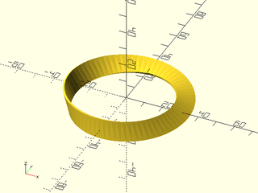
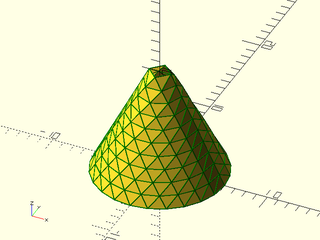
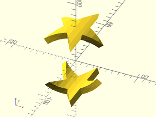

# LibFile: vnf.scad

The Vertices'N'Faces structure (VNF) holds the data used by polyhedron() to construct objects: a vertex
list and a list of faces.  This library makes it easier to construct polyhedra by providing
functions to construct, merge, and modify VNF data, while avoiding common pitfalls such as
reversed faces.

To use, add the following lines to the beginning of your file:

    include <BOSL2/std.scad>

## Table of Contents

1. [Section: Creating Polyhedrons with VNF Structures](#section-creating-polyhedrons-with-vnf-structures)
    - [`vnf_vertex_array()`](#function-vnf_vertex_array)
    - [`vnf_tri_array()`](#function-vnf_tri_array)
    - [`vnf_join()`](#function-vnf_join)
    - [`vnf_from_polygons()`](#function-vnf_from_polygons)
    - [`vnf_from_region()`](#function-vnf_from_region)

2. [Section: VNF Testing and Access](#section-vnf-testing-and-access)
    - [`is_vnf()`](#function-is_vnf)
    - [`is_vnf_list()`](#function-is_vnf_list)
    - [`vnf_vertices()`](#function-vnf_vertices)
    - [`vnf_faces()`](#function-vnf_faces)

3. [Section: Altering the VNF Internals](#section-altering-the-vnf-internals)
    - [`vnf_reverse_faces()`](#function-vnf_reverse_faces)
    - [`vnf_quantize()`](#function-vnf_quantize)
    - [`vnf_merge_points()`](#function-vnf_merge_points)
    - [`vnf_drop_unused_points()`](#function-vnf_drop_unused_points)
    - [`vnf_triangulate()`](#function-vnf_triangulate)
    - [`vnf_slice()`](#function-vnf_slice)

4. [Section: Turning a VNF into geometry](#section-turning-a-vnf-into-geometry)
    - [`vnf_polyhedron()`](#module-vnf_polyhedron)
    - [`vnf_wireframe()`](#module-vnf_wireframe)

5. [Section: Operations on VNFs](#section-operations-on-vnfs)
    - [`vnf_volume()`](#function-vnf_volume)
    - [`vnf_area()`](#function-vnf_area)
    - [`vnf_halfspace()`](#function-vnf_halfspace)
    - [`vnf_bend()`](#function-vnf_bend)

6. [Section: Debugging Polyhedrons](#section-debugging-polyhedrons)
    - [`debug_vnf()`](#module-debug_vnf)
    - [`vnf_validate()`](#functionmodule-vnf_validate)

## Section: Creating Polyhedrons with VNF Structures

VNF stands for "Vertices'N'Faces".  VNF structures are 2-item lists, `[VERTICES,FACES]` where the
first item is a list of vertex points, and the second is a list of face indices into the vertex
list.  Each VNF is self contained, with face indices referring only to its own vertex list.
You can construct a `polyhedron()` in parts by describing each part in a self-contained VNF, then
merge the various VNFs to get the completed polyhedron vertex list and faces.

### Function: vnf\_vertex\_array()

**Usage:** 

- vnf = vnf\_vertex\_array(points, [caps], [cap1], [cap2], [style], [reverse], [col\_wrap], [row\_wrap]);

**Description:** 

Creates a VNF structure from a rectangular vertex list, by dividing the vertices into columns and rows,
adding faces to tile the surface.  You can optionally have faces added to wrap the last column
back to the first column, or wrap the last row to the first.  Endcaps can be added to either
the first and/or last rows.  The style parameter determines how the quadrilaterals are divided into
triangles.  The default style is an arbitrary, systematic subdivision in the same direction.  The "alt" style
is the uniform subdivision in the other (alternate) direction.  The "min_edge" style picks the shorter edge to
subdivide for each quadrilateral, so the division may not be uniform across the shape.  The "quincunx" style
adds a vertex in the center of each quadrilateral and creates four triangles, and the "convex" and "concave" styles
chooses the locally convex/concave subdivision.  Degenerate faces
are not included in the output, but if this results in unused vertices they will still appear in the output.

**Arguments:** 

<abbr title="These args can be used by position or by name.">By&nbsp;Position</abbr> | What it does
-------------------- | ------------
`points`             | A list of vertices to divide into columns and rows.

<abbr title="These args must be used by name, ie: name=value">By&nbsp;Name</abbr> | What it does
-------------------- | ------------
`caps`               | If true, add endcap faces to the first AND last rows.
`cap1`               | If true, add an endcap face to the first row.
`cap2`               | If true, add an endcap face to the last row.
`col_wrap`           | If true, add faces to connect the last column to the first.
`row_wrap`           | If true, add faces to connect the last row to the first.
`reverse`            | If true, reverse all face normals.
`style`              | The style of subdividing the quads into faces.  Valid options are "default", "alt", "min_edge", "quincunx", "convex" and "concave".

**Example 1:** 

 

    include <BOSL2/std.scad>
    vnf = vnf_vertex_array(
        points=[
            for (h = [0:5:180-EPSILON]) [
                for (t = [0:5:360-EPSILON])
                    cylindrical_to_xyz(100 + 12 * cos((h/2 + t)*6), t, h)
            ]
        ],
        col_wrap=true, caps=true, reverse=true, style="alt"
    );
    vnf_polyhedron(vnf);

**Example 2:** Both `col_wrap` and `row_wrap` are true to make a torus.

    include <BOSL2/std.scad>
    vnf = vnf_vertex_array(
        points=[
            for (a=[0:5:360-EPSILON])
                apply(
                    zrot(a) * right(30) * xrot(90),
                    path3d(circle(d=20))
                )
        ],
        col_wrap=true, row_wrap=true, reverse=true
    );
    vnf_polyhedron(vnf);

  

**Example 3:** Möbius Strip.  Note that `row_wrap` is not used, and the first and last profile copies are the same.

    include <BOSL2/std.scad>
    vnf = vnf_vertex_array(
        points=[
            for (a=[0:5:360]) apply(
                zrot(a) * right(30) * xrot(90) * zrot(a/2+60),
                path3d(square([1,10], center=true))
            )
        ],
        col_wrap=true, reverse=true
    );
    vnf_polyhedron(vnf);

  

**Example 4:** Assembling a Polyhedron from Multiple Parts

 

    include <BOSL2/std.scad>
    wall_points = [
        for (a = [-90:2:90]) apply(
            up(a) * scale([1-0.1*cos(a*6),1-0.1*cos((a+90)*6),1]),
            path3d(circle(d=100))
        )
    ];
    cap = [
        for (a = [0:0.01:1+EPSILON]) apply(
            up(90-5*sin(a*360*2)) * scale([a,a,1]),
            wall_points[0]
        )
    ];
    cap1 = [for (p=cap) down(90, p=zscale(-1, p=p))];
    cap2 = [for (p=cap) up(90, p=p)];
    vnf1 = vnf_vertex_array(points=wall_points, col_wrap=true);
    vnf2 = vnf_vertex_array(points=cap1, col_wrap=true);
    vnf3 = vnf_vertex_array(points=cap2, col_wrap=true, reverse=true);
    vnf_polyhedron([vnf1, vnf2, vnf3]);

---

### Function: vnf\_tri\_array()

**Usage:** 

- vnf = vnf\_tri\_array(points, [row\_wrap], [reverse])

**Description:** 

Produces a vnf from an array of points where each row length can differ from the adjacent rows by up to 2 in length.  This enables
the construction of triangular VNF patches.  The resulting VNF can be wrapped along the rows by setting `row_wrap` to true.
You cannot wrap columns: if you need to do that you'll need to merge two VNF arrays that share edges.  Degenerate faces
are not included in the output, but if this results in unused vertices they will still appear in the output.

**Arguments:** 

<abbr title="These args can be used by position or by name.">By&nbsp;Position</abbr> | What it does
-------------------- | ------------
`points`             | List of point lists for each row
`row_wrap`           | If true then add faces connecting the first row and last row.  These rows must differ by at most 2 in length.
`reverse`            | Set this to reverse the direction of the faces

**Example 1:** Each row has one more point than the preceeding one.

    include <BOSL2/std.scad>
    pts = [for(y=[1:1:10]) [for(x=[0:y-1]) [x,y,y]]];
    vnf = vnf_tri_array(pts);
    vnf_wireframe(vnf,width=0.1);
    color("red")move_copies(flatten(pts)) sphere(r=.15,$fn=9);

  

**Example 2:** Each row has two more points than the preceeding one.

    include <BOSL2/std.scad>
    pts = [for(y=[0:2:10]) [for(x=[-y/2:y/2]) [x,y,y]]];
    vnf = vnf_tri_array(pts);
    vnf_wireframe(vnf,width=0.1);
    color("red")move_copies(flatten(pts)) sphere(r=.15,$fn=9);

  

**Example 3:** Merging two VNFs to construct a cone with one point length change between rows.

 

    include <BOSL2/std.scad>
    pts1 = [for(z=[0:10]) path3d(arc(3+z,r=z/2+1, angle=[0,180]),10-z)];
    pts2 = [for(z=[0:10]) path3d(arc(3+z,r=z/2+1, angle=[180,360]),10-z)];
    vnf = vnf_join([vnf_tri_array(pts1),
                      vnf_tri_array(pts2)]);
    color("green")vnf_wireframe(vnf,width=0.1);
    vnf_polyhedron(vnf);

**Example 4:** Cone with length change two between rows

 

    include <BOSL2/std.scad>
    pts1 = [for(z=[0:1:10]) path3d(arc(3+2*z,r=z/2+1, angle=[0,180]),10-z)];
    pts2 = [for(z=[0:1:10]) path3d(arc(3+2*z,r=z/2+1, angle=[180,360]),10-z)];
    vnf = vnf_join([vnf_tri_array(pts1),
                     vnf_tri_array(pts2)]);
    color("green")vnf_wireframe(vnf,width=0.1);
    vnf_polyhedron(vnf);

**Example 5:** Point count can change irregularly

 

    include <BOSL2/std.scad>
    lens = [10,9,7,5,6,8,8,10];
    pts = [for(y=idx(lens)) lerpn([-lens[y],y,y],[lens[y],y,y],lens[y])];
    vnf = vnf_tri_array(pts);
    vnf_wireframe(vnf,width=0.1);
    color("red")move_copies(flatten(pts)) sphere(r=.15,$fn=9);

---

### Function: vnf\_join()

**Usage:** 

- vnf = vnf\_join([VNF, VNF, VNF, ...]);

**Description:** 

Given a list of VNF structures, merges them all into a single VNF structure.
Combines all the points of the input VNFs and labels the faces appropriately.
All the points in the input VNFs will appear in the output, even if they are
duplicates of each other.  It is valid to repeat points in a VNF, but if you
with to remove the duplicates that will occur along joined edges, use [`vnf_merge_points()`](#function-vnf_merge_points).

Note that this is a tool for manipulating polyhedron data.  It is for
building up a full polyhedron from partial polyhedra.
It is *not* a union operator for VNFs.  The VNFs to be joined must not intersect each other,
except at edges, or the result will be an invalid polyhedron.  Similarly the
result must not have any other illegal polyhedron characteristics, such as creating
more than two faces sharing the same edge.
If you want a valid result it is your responsibility to ensure that the polyhedron
has no holes, no intersecting faces or edges, and obeys all the requirements
that CGAL expects.

For example, if you combine two pyramids to try to make an octahedron, the result will
be invalid because of the two internal faces created by the pyramid bases.  A valid
use would be to build a cube missing one face and a pyramid missing its base and
then join them into a cube with a point.

**Arguments:** 

<abbr title="These args can be used by position or by name.">By&nbsp;Position</abbr> | What it does
-------------------- | ------------
`vnfs`               | a list of the VNFs to joint into one VNF.

---

### Function: vnf\_from\_polygons()

**Usage:** 

- vnf = vnf\_from\_polygons(polygons);

**Description:** 

Given a list of 3d polygons, produces a VNF containing those polygons.
It is up to the caller to make sure that the points are in the correct order to make the face
normals point outwards.  No checking for duplicate vertices is done.  If you want to
remove duplicate vertices use [`vnf_merge_points()`](#function-vnf_merge_points).

**Arguments:** 

<abbr title="These args can be used by position or by name.">By&nbsp;Position</abbr> | What it does
-------------------- | ------------
`polygons`           | The list of 3d polygons to turn into a VNF

---

### Function: vnf\_from\_region()

**Usage:** 

- vnf = vnf\_from\_region(region, [transform], [reverse]);

**Description:** 

Given a (two-dimensional) region, applies the given transformation matrix to it and makes a (three-dimensional) triangulated VNF of
faces for that region, reversed if desired.

**Arguments:** 

<abbr title="These args can be used by position or by name.">By&nbsp;Position</abbr> | What it does
-------------------- | ------------
`region`             | The region to conver to a vnf.
`transform`          | If given, a transformation matrix to apply to the faces generated from the region.  Default: No transformation applied.
`reverse`            | If true, reverse the normals of the faces generated from the region.  An untransformed region will have face normals pointing `UP`.  Default: false

**Example 1:** 

    include <BOSL2/std.scad>
    region = [square([20,10],center=true),
              right(5,square(4,center=true)),
              left(5,square(6,center=true))];
    vnf = vnf_from_region(region);
    color("gray")down(.125)
         linear_extrude(height=.125)region(region);
    vnf_wireframe(vnf,width=.25);

  

---

## Section: VNF Testing and Access

### Function: is\_vnf()

**Usage:** 

- bool = is\_vnf(x);

**Description:** 

Returns true if the given value looks like a VNF structure.

---

### Function: is\_vnf\_list()

**Description:** 

Returns true if the given value looks passingly like a list of VNF structures.

---

### Function: vnf\_vertices()

**Description:** 

Given a VNF structure, returns the list of vertex points.

---

### Function: vnf\_faces()

**Description:** 

Given a VNF structure, returns the list of faces, where each face is a list of indices into the VNF vertex list.

---

## Section: Altering the VNF Internals

### Function: vnf\_reverse\_faces()

**Usage:** 

- rvnf = vnf\_reverse\_faces(vnf);

**Description:** 

Reverses the orientation of all the faces in the given VNF.

---

### Function: vnf\_quantize()

**Usage:** 

- vnf2 = vnf\_quantize(vnf,[q]);

**Description:** 

Quantizes the vertex coordinates of the VNF to the given quanta `q`.

**Arguments:** 

<abbr title="These args can be used by position or by name.">By&nbsp;Position</abbr> | What it does
-------------------- | ------------
`vnf`                | The VNF to quantize.
`q`                  | The quanta to quantize the VNF coordinates to.

---

### Function: vnf\_merge\_points()

**Usage:** 

- new\_vnf = vnf\_merge\_points(vnf, [eps]);

**Description:** 

Given a VNF, consolidates all duplicate vertices with a tolerance `eps`, relabeling the faces as necessary,
and eliminating any face with fewer than 3 vertices.  Unreferenced vertices of the input VNF are not dropped.
To remove such vertices uses [`vnf_drop_unused_points()`](#function-vnf_drop_unused_points).

**Arguments:** 

<abbr title="These args can be used by position or by name.">By&nbsp;Position</abbr> | What it does
-------------------- | ------------
`vnf`                | a VNF to consolidate
`eps`                | the tolerance in finding duplicates. Default: EPSILON

---

### Function: vnf\_drop\_unused\_points()

**Usage:** 

- clean\_vnf=vnf\_drop\_unused\_points(vnf);

**Description:** 

Remove all unreferenced vertices from a VNF.  Note that in most
cases unreferenced vertices cause no harm, and this function may
be slow on large VNFs.

---

### Function: vnf\_triangulate()

**Usage:** 

- vnf2 = vnf\_triangulate(vnf);

**Description:** 

Triangulates faces in the VNF that have more than 3 vertices.

**Arguments:** 

<abbr title="These args can be used by position or by name.">By&nbsp;Position</abbr> | What it does
-------------------- | ------------
`vnf`                | vnf to triangulate

**Example 1:** 

 

    include <BOSL2/std.scad>
    include <BOSL2/polyhedra.scad>
    vnf = zrot(33,regular_polyhedron_info("vnf", "dodecahedron", side=12));
    vnf_polyhedron(vnf);
    triangulated = vnf_triangulate(vnf);
    color("red")vnf_wireframe(triangulated,width=.3);

---

### Function: vnf\_slice()

**Usage:** 

- sliced = vnf\_slice(vnf, dir, cuts);

**Description:** 

Slice the faces of a VNF along a specified axis direction at a given list
of cut points.  The cut points can appear in any order.  You can use this to refine the faces of a VNF before applying
a nonlinear transformation to its vertex set.

**Arguments:** 

<abbr title="These args can be used by position or by name.">By&nbsp;Position</abbr> | What it does
-------------------- | ------------
`vnf`                | vnf to slice
`dir`                | normal direction to the slices, either "X", "Y" or "Z"
`cuts`               | X, Y or Z values where cuts occur

**Example 1:** 

    include <BOSL2/std.scad>
    include <BOSL2/polyhedra.scad>
    vnf = regular_polyhedron_info("vnf", "dodecahedron", side=12);
    vnf_polyhedron(vnf);
    sliced = vnf_slice(vnf, "X", [-6,-1,10]);
    color("red")vnf_wireframe(sliced,width=.3);

  

---

## Section: Turning a VNF into geometry

### Module: vnf\_polyhedron()

**Usage:** 

- vnf\_polyhedron(vnf);
- vnf\_polyhedron([VNF, VNF, VNF, ...]);

**Description:** 

Given a VNF structure, or a list of VNF structures, creates a polyhedron from them.

**Arguments:** 

<abbr title="These args can be used by position or by name.">By&nbsp;Position</abbr> | What it does
-------------------- | ------------
`vnf`                | A VNF structure, or list of VNF structures.
`convexity`          | Max number of times a line could intersect a wall of the shape.
`extent`             | If true, calculate anchors by extents, rather than intersection.  Default: true.
`cp`                 | Centerpoint for determining intersection anchors or centering the shape.  Determintes the base of the anchor vector.  Can be "centroid", "mean", "box" or a 3D point.  Default: "centroid"
`anchor`             | Translate so anchor point is at origin (0,0,0).  See [anchor](attachments.scad#subsection-anchor).  Default: `"origin"`
`spin`               | Rotate this many degrees around the Z axis after anchor.  See [spin](attachments.scad#subsection-spin).  Default: `0`
`orient`             | Vector to rotate top towards, after spin.  See [orient](attachments.scad#subsection-orient).  Default: `UP`
`atype`              | Select "hull" or "intersect" anchor type.  Default: "hull"

---

### Module: vnf\_wireframe()

**Usage:** 

- vnf\_wireframe(vnf, [width]);

**Description:** 

Given a VNF, creates a wire frame ball-and-stick model of the polyhedron with a cylinder for
each edge and a sphere at each vertex.  The width parameter specifies the width of the sticks
that form the wire frame and the diameter of the balls.

**Arguments:** 

<abbr title="These args can be used by position or by name.">By&nbsp;Position</abbr> | What it does
-------------------- | ------------
`vnf`                | A vnf structure
`width`              | width of the cylinders forming the wire frame.  Default: 1

**Example 1:** 

    include <BOSL2/std.scad>
    $fn=32;
    ball = sphere(r=20, $fn=6);
    vnf_wireframe(ball,width=1);

  

**Example 2:** 

    include <BOSL2/std.scad>
    include <BOSL2/polyhedra.scad>
    $fn=32;
    cube_oct = regular_polyhedron_info("vnf",
                       name="cuboctahedron", or=20);
    vnf_wireframe(cube_oct);

  

**Example 3:** The spheres at the vertex are imperfect at aligning with the cylinders, so especially at low $fn things look prety ugly.  This is normal.

    include <BOSL2/std.scad>
    include <BOSL2/polyhedra.scad>
    $fn=8;
    octahedron = regular_polyhedron_info("vnf",
                          name="octahedron", or=20);
    vnf_wireframe(octahedron,width=5);

  

---

## Section: Operations on VNFs

### Function: vnf\_volume()

**Usage:** 

- vol = vnf\_volume(vnf);

**Description:** 

Returns the volume enclosed by the given manifold VNF.   The VNF must describe a valid polyhedron with consistent face direction and
no holes; otherwise the results are undefined.  Returns a positive volume if face direction is clockwise and a negative volume
if face direction is counter-clockwise.

---

### Function: vnf\_area()

**Usage:** 

- area = vnf\_area(vnf);

**Description:** 

Returns the surface area in any VNF by adding up the area of all its faces.  The VNF need not be a manifold.

---

### Function: vnf\_halfspace()

**Usage:** 

- newvnf = vnf\_halfspace(plane, vnf, [closed]);

**Description:** 

Returns the intersection of the vnf with a half space.  The half space is defined by
plane = [A,B,C,D], taking the side where the normal [A,B,C] points: Ax+By+Cz≥D.
If closed is set to false then the cut face is not included in the vnf.  This could
allow further extension of the vnf by merging with other vnfs.

**Arguments:** 

<abbr title="These args can be used by position or by name.">By&nbsp;Position</abbr> | What it does
-------------------- | ------------
`plane`              | plane defining the boundary of the half space
`vnf`                | vnf to cut
`closed`             | if false do not return include cut face(s).  Default: true

**Example 1:** 

    include <BOSL2/std.scad>
    vnf = cube(10,center=true);
    cutvnf = vnf_halfspace([-1,1,-1,0], vnf);
    vnf_polyhedron(cutvnf);

  

**Example 2:** Cut face has 2 components

    include <BOSL2/std.scad>
    vnf = path_sweep(circle(r=4, $fn=16),
                     circle(r=20, $fn=64),closed=true);
    cutvnf = vnf_halfspace([-1,1,-4,0], vnf);
    vnf_polyhedron(cutvnf);

  

**Example 3:** Cut face is not simply connected

    include <BOSL2/std.scad>
    vnf = path_sweep(circle(r=4, $fn=16),
                     circle(r=20, $fn=64),closed=true);
    cutvnf = vnf_halfspace([0,0.7,-4,0], vnf);
    vnf_polyhedron(cutvnf);

  

**Example 4:** Cut object has multiple components

 

    include <BOSL2/std.scad>
    function knot(a,b,t) =   // rolling knot
         [ a * cos (3 * t) / (1 - b* sin (2 *t)),
           a * sin( 3 * t) / (1 - b* sin (2 *t)),
         1.8 * b * cos (2 * t) /(1 - b* sin (2 *t))];
    a = 0.8; b = sqrt (1 - a * a);
    ksteps = 400;
    knot_path = [for (i=[0:ksteps-1]) 50 * knot(a,b,(i/ksteps)*360)];
    ushape = [[-10, 0],[-10, 10],[ -7, 10],[ -7, 2],[  7, 2],[  7, 7],[ 10, 7],[ 10, 0]];
    knot=path_sweep(ushape, knot_path, closed=true, method="incremental");
    cut_knot = vnf_halfspace([1,0,0,0], knot);
    vnf_polyhedron(cut_knot);

---

### Function: vnf\_bend()

**Usage:** 

- bentvnf = vnf\_bend(vnf,r,d,[axis]);

**Description:** 

Bend a VNF around the X, Y or Z axis, splitting up faces as necessary.  Returns the bent
VNF.  For bending around the Z axis the input VNF must not cross the Y=0 plane.  For bending
around the X or Y axes the VNF must not cross the Z=0 plane.  Note that if you wrap a VNF all the way around
it may intersect itself, which produces an invalid polyhedron.  It is your responsibility to
avoid this situation.  The 1:1
radius is where the curved length of the bent VNF matches the length of the original VNF.  If the
`r` or `d` arguments are given, then they will specify the 1:1 radius or diameter.  If they are
not given, then the 1:1 radius will be defined by the distance of the furthest vertex in the
original VNF from the Z=0 plane.  You can adjust the granularity of the bend using the standard
`$fa`, `$fs`, and `$fn` variables.

**Arguments:** 

<abbr title="These args can be used by position or by name.">By&nbsp;Position</abbr> | What it does
-------------------- | ------------
`vnf`                | The original VNF to bend.
`r`                  | If given, the radius where the size of the original shape is the same as in the original.

<abbr title="These args must be used by name, ie: name=value">By&nbsp;Name</abbr> | What it does
-------------------- | ------------
`d`                  | If given, the diameter where the size of the original shape is the same as in the original.
`axis`               | The axis to wrap around.  "X", "Y", or "Z".  Default: "Z"

**Example 1:** 

    include <BOSL2/std.scad>
    vnf0 = cube([100,40,10], center=true);
    vnf1 = up(50, p=vnf0);
    vnf2 = down(50, p=vnf0);
    bent1 = vnf_bend(vnf1, axis="Y");
    bent2 = vnf_bend(vnf2, axis="Y");
    vnf_polyhedron([bent1,bent2]);

  

**Example 2:** 

    include <BOSL2/std.scad>
    vnf0 = linear_sweep(star(n=5,step=2,d=100), height=10);
    vnf1 = up(50, p=vnf0);
    vnf2 = down(50, p=vnf0);
    bent1 = vnf_bend(vnf1, axis="Y");
    bent2 = vnf_bend(vnf2, axis="Y");
    vnf_polyhedron([bent1,bent2]);

  

**Example 3:** 

    include <BOSL2/std.scad>
    rgn = union(rect([100,20]),
                rect([20,100]));
    vnf0 = linear_sweep(zrot(45,p=rgn), height=10);
    vnf1 = up(50, p=vnf0);
    vnf2 = down(50, p=vnf0);
    bent1 = vnf_bend(vnf1, axis="Y");
    bent2 = vnf_bend(vnf2, axis="Y");
    vnf_polyhedron([bent1,bent2]);

  

**Example 4:** Bending Around X Axis.

    include <BOSL2/std.scad>
    rgnr = union(
        rect([20,100]),
        back(50, p=trapezoid(w1=40, w2=0, h=20, anchor=FRONT))
    );
    vnf0 = xrot(00,p=linear_sweep(rgnr, height=10));
    vnf1 = up(50, p=vnf0);
    #vnf_polyhedron(vnf1);
    bent1 = vnf_bend(vnf1, axis="X");
    vnf_polyhedron([bent1]);

  

**Example 5:** Bending Around Y Axis.

    include <BOSL2/std.scad>
    rgn = union(
        rect([20,100]),
        back(50, p=trapezoid(w1=40, w2=0, h=20, anchor=FRONT))
    );
    rgnr = zrot(-90, p=rgn);
    vnf0 = xrot(00,p=linear_sweep(rgnr, height=10));
    vnf1 = up(50, p=vnf0);
    #vnf_polyhedron(vnf1);
    bent1 = vnf_bend(vnf1, axis="Y");
    vnf_polyhedron([bent1]);

  

**Example 6:** Bending Around Z Axis.

    include <BOSL2/std.scad>
    rgn = union(
        rect([20,100]),
        back(50, p=trapezoid(w1=40, w2=0, h=20, anchor=FRONT))
    );
    rgnr = zrot(90, p=rgn);
    vnf0 = xrot(90,p=linear_sweep(rgnr, height=10));
    vnf1 = fwd(50, p=vnf0);
    #vnf_polyhedron(vnf1);
    bent1 = vnf_bend(vnf1, axis="Z");
    vnf_polyhedron([bent1]);

  

**Example 7:** Bending more than once around the cylinder

    include <BOSL2/std.scad>
    $fn=32;
    vnf = apply(fwd(5)*yrot(30),cube([100,2,5],center=true));
    bent = vnf_bend(vnf, axis="Z");
    vnf_polyhedron(bent);

  

---

## Section: Debugging Polyhedrons

### Module: debug\_vnf()

**Usage:** 

- debug\_vnf(vnfs, [faces], [vertices], [opacity], [size], [convexity]);

**Topics:** [Polyhedra](Topics#polyhedra), [Debugging](Topics#debugging)

**Description:** 

A drop-in module to replace `vnf_polyhedron()` to help debug vertices and faces.
Draws all the vertices at their 3D position, numbered in blue by their
position in the vertex array.  Each face will have its face number drawn
in red, aligned with the center of face.  All given faces are drawn with
transparency. All children of this module are drawn with transparency.
Works best with Thrown-Together preview mode, to see reversed faces.
You can set opacity to 0 if you want to supress the display of the polyhedron faces.

The vertex numbers are shown rotated to face you.  As you rotate your polyhedron you
can rerun the preview to display them oriented for viewing from a different viewpoint.

**Arguments:** 

<abbr title="These args can be used by position or by name.">By&nbsp;Position</abbr> | What it does
-------------------- | ------------
`vnf`                | vnf to display

<abbr title="These args must be used by name, ie: name=value">By&nbsp;Name</abbr> | What it does
-------------------- | ------------
`faces`              | if true display face numbers.  Default: true
`vertices`           | if true display vertex numbers.  Default: true
`opacity`            | Opacity of the polyhedron faces.  Default: 0.5
`convexity`          | The max number of walls a ray can pass through the given polygon paths.
`size`               | The size of the text used to label the faces and vertices.  Default: 1

**Example 1:** 

 

    include <BOSL2/std.scad>
    verts = [for (z=[-10,10], a=[0:120:359.9]) [10*cos(a),10*sin(a),z]];
    faces = [[0,1,2], [5,4,3], [0,3,4], [0,4,1], [1,4,5], [1,5,2], [2,5,3], [2,3,0]];
    debug_vnf([verts,faces], size=2);

---

### Function/Module: vnf\_validate()

**Usage:** As Function

- fails = vnf\_validate(vnf);

**Usage:** As Module

- vnf\_validate(vnf, [size]);

**Description:** 

When called as a function, returns a list of non-manifold errors with the given VNF.
Each error has the format `[ERR_OR_WARN,CODE,MESG,POINTS,COLOR]`.
When called as a module, echoes the non-manifold errors to the console, and color hilites the
bad edges and vertices, overlaid on a transparent gray polyhedron of the VNF.

Currently checks for these problems:

Type    | Color    | Code         | Message
------- | -------- | ------------ | ---------------------------------
WARNING | Yellow   | BIG_FACE     | Face has more than 3 vertices, and may confuse CGAL.
WARNING | Brown    | NULL_FACE    | Face has zero area.
ERROR   | Cyan     | NONPLANAR    | Face vertices are not coplanar.
ERROR   | Brown    | DUP_FACE     | Multiple instances of the same face.
ERROR   | Orange   | MULTCONN     | Multiply Connected Geometry. Too many faces attached at Edge.
ERROR   | Violet   | REVERSAL     | Faces reverse across edge.
ERROR   | Red      | T_JUNCTION   | Vertex is mid-edge on another Face.
ERROR   | Blue     | FACE_ISECT   | Faces intersect.
ERROR   | Magenta  | HOLE_EDGE    | Edge bounds Hole.

Still to implement:
- Overlapping coplanar faces.

**Arguments:** 

<abbr title="These args can be used by position or by name.">By&nbsp;Position</abbr> | What it does
-------------------- | ------------
`vnf`                | The VNF to validate.
`size`               | The width of the lines and diameter of points used to highlight edges and vertices.  Module only.  Default: 1
`check_isects`       | If true, performs slow checks for intersecting faces.  Default: false

**Example 1:** BIG\_FACE Warnings; Faces with More Than 3 Vertices.  CGAL often will fail to accept that a face is planar after a rotation, if it has more than 3 vertices.

    include <BOSL2/std.scad>
    vnf = skin([
        path3d(regular_ngon(n=3, d=100),0),
        path3d(regular_ngon(n=5, d=100),100)
    ], slices=0, caps=true, method="tangent");
    vnf_validate(vnf);

  

**Example 2:** NONPLANAR Errors; Face Vertices are Not Coplanar

    include <BOSL2/std.scad>
    a = [  0,  0,-50];
    b = [-50,-50, 50];
    c = [-50, 50, 50];
    d = [ 50, 50, 60];
    e = [ 50,-50, 50];
    vnf = vnf_from_polygons([
        [a, b, e], [a, c, b], [a, d, c], [a, e, d], [b, c, d, e]
    ]);
    vnf_validate(vnf);

  

**Example 3:** MULTCONN Errors; More Than Two Faces Attached to the Same Edge.  This confuses CGAL, and can lead to failed renders.

 

    include <BOSL2/std.scad>
    vnf = vnf_triangulate(linear_sweep(union(square(50), square(50,anchor=BACK+RIGHT)), height=50));
    vnf_validate(vnf);

**Example 4:** REVERSAL Errors; Faces Reversed Across Edge

    include <BOSL2/std.scad>
    vnf1 = skin([
        path3d(square(100,center=true),0),
        path3d(square(100,center=true),100),
    ], slices=0, caps=false);
    vnf = vnf_join([vnf1, vnf_from_polygons([
        [[-50,-50,  0], [ 50, 50,  0], [-50, 50,  0]],
        [[-50,-50,  0], [ 50,-50,  0], [ 50, 50,  0]],
        [[-50,-50,100], [-50, 50,100], [ 50, 50,100]],
        [[-50,-50,100], [ 50,-50,100], [ 50, 50,100]],
    ])]);
    vnf_validate(vnf);

  

**Example 5:** T\_JUNCTION Errors; Vertex is Mid-Edge on Another Face.

    include <BOSL2/std.scad>
    vnf1 = skin([
        path3d(square(100,center=true),0),
        path3d(square(100,center=true),100),
    ], slices=0, caps=false);
    vnf = vnf_join([vnf1, vnf_from_polygons([
        [[-50,-50,0], [50,50,0], [-50,50,0]],
        [[-50,-50,0], [50,-50,0], [50,50,0]],
        [[-50,-50,100], [-50,50,100], [0,50,100]],
        [[-50,-50,100], [0,50,100], [0,-50,100]],
        [[0,-50,100], [0,50,100], [50,50,100]],
        [[0,-50,100], [50,50,100], [50,-50,100]],
    ])]);
    vnf_validate(vnf);

  

**Example 6:** FACE\_ISECT Errors; Faces Intersect

 

    include <BOSL2/std.scad>
    vnf = vnf_join([
        vnf_triangulate(linear_sweep(square(100,center=true), height=100)),
        move([75,35,30],p=vnf_triangulate(linear_sweep(square(100,center=true), height=100)))
    ]);
    vnf_validate(vnf,size=2,check_isects=true);

**Example 7:** HOLE\_EDGE Errors; Edges Adjacent to Holes.

    include <BOSL2/std.scad>
    vnf = skin([
        path3d(regular_ngon(n=4, d=100),0),
        path3d(regular_ngon(n=5, d=100),100)
    ], slices=0, caps=false);
    vnf_validate(vnf,size=2);

  

---

