# LibFile: walls.scad

Various wall constructions.

To use, add the following lines to the beginning of your file:

    include <BOSL2/std.scad>
    include <BOSL2/walls.scad>

## Table of Contents

1. [Section: Walls](#section-walls)
    - [`narrowing_strut()`](#module-narrowing_strut)
    - [`thinning_wall()`](#module-thinning_wall)
    - [`thinning_triangle()`](#module-thinning_triangle)
    - [`sparse_strut()`](#module-sparse_strut)
    - [`sparse_strut3d()`](#module-sparse_strut3d)
    - [`corrugated_wall()`](#module-corrugated_wall)

## Section: Walls

### Module: narrowing\_strut()

**Usage:** 

- narrowing\_strut(w, l, wall, [ang]);

**Description:** 

Makes a rectangular strut with the top side narrowing in a triangle.
The shape created may be likened to an extruded home plate from baseball.
This is useful for constructing parts that minimize the need to support
overhangs.

**Arguments:** 

<abbr title="These args can be used by position or by name.">By&nbsp;Position</abbr> | What it does
-------------------- | ------------
`w`                  | Width (thickness) of the strut.
`l`                  | Length of the strut.
`wall`               | height of rectangular portion of the strut.
`ang`                | angle that the trianglar side will converge at.
`anchor`             | Translate so anchor point is at origin (0,0,0).  See [anchor](attachments.scad#subsection-anchor).  Default: `CENTER`
`spin`               | Rotate this many degrees around the Z axis after anchor.  See [spin](attachments.scad#subsection-spin).  Default: `0`
`orient`             | Vector to rotate top towards, after spin.  See [orient](attachments.scad#subsection-orient).  Default: `UP`

**Example 1:** 

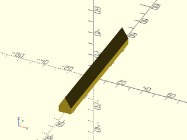

    include <BOSL2/std.scad>
    include <BOSL2/walls.scad>
    narrowing_strut(w=10, l=100, wall=5, ang=30);

  

---

### Module: thinning\_wall()

**Usage:** 

- thinning\_wall(h, l, thick, [ang], [strut], [wall]);

**Description:** 

Makes a rectangular wall which thins to a smaller width in the center,
with angled supports to prevent critical overhangs.

**Arguments:** 

<abbr title="These args can be used by position or by name.">By&nbsp;Position</abbr> | What it does
-------------------- | ------------
`h`                  | Height of wall.
`l`                  | Length of wall.  If given as a vector of two numbers, specifies bottom and top lengths, respectively.
`thick`              | Thickness of wall.
`wall`               | The thickness of the thinned portion of the wall.  Default: `thick/2`
`ang`                | Maximum overhang angle of diagonal brace.
`braces`             | If true, adds diagonal crossbraces for strength.
`strut`              | The width of the borders and diagonal braces.  Default: `thick/2`
`anchor`             | Translate so anchor point is at origin (0,0,0).  See [anchor](attachments.scad#subsection-anchor).  Default: `CENTER`
`spin`               | Rotate this many degrees around the Z axis after anchor.  See [spin](attachments.scad#subsection-spin).  Default: `0`
`orient`             | Vector to rotate top towards, after spin.  See [orient](attachments.scad#subsection-orient).  Default: `UP`

**Example 1:** Typical Shape

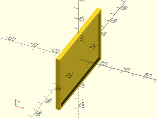

    include <BOSL2/std.scad>
    include <BOSL2/walls.scad>
    thinning_wall(h=50, l=80, thick=4);

  

**Example 2:** Trapezoidal

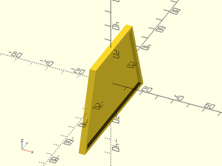

    include <BOSL2/std.scad>
    include <BOSL2/walls.scad>
    thinning_wall(h=50, l=[80,50], thick=4);

  

**Example 3:** Trapezoidal with Braces

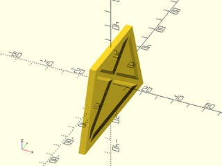

 

    include <BOSL2/std.scad>
    include <BOSL2/walls.scad>
    thinning_wall(h=50, l=[80,50], thick=4, strut=4, wall=2, braces=true);

---

### Module: thinning\_triangle()

**Usage:** 

- thinning\_triangle(h, l, thick, [ang], [strut], [wall], [diagonly], [center]);

**Description:** 

Makes a triangular wall with thick edges, which thins to a smaller width in
the center, with angled supports to prevent critical overhangs.

**Arguments:** 

<abbr title="These args can be used by position or by name.">By&nbsp;Position</abbr> | What it does
-------------------- | ------------
`h`                  | height of wall.
`l`                  | length of wall.
`thick`              | thickness of wall.
`ang`                | maximum overhang angle of diagonal brace.
`strut`              | the width of the diagonal brace.
`wall`               | the thickness of the thinned portion of the wall.
`diagonly`           | boolean, which denotes only the diagonal side (hypotenuse) should be thick.
`center`             | If true, centers shape.  If false, overrides `anchor` with `UP+BACK`.
`anchor`             | Translate so anchor point is at origin (0,0,0).  See [anchor](attachments.scad#subsection-anchor).  Default: `CENTER`
`spin`               | Rotate this many degrees around the Z axis after anchor.  See [spin](attachments.scad#subsection-spin).  Default: `0`
`orient`             | Vector to rotate top towards, after spin.  See [orient](attachments.scad#subsection-orient).  Default: `UP`

**Example 1:** Centered

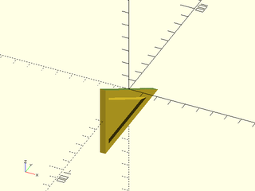

 

    include <BOSL2/std.scad>
    include <BOSL2/walls.scad>
    thinning_triangle(h=50, l=80, thick=4, ang=30, strut=5, wall=2, center=true);

**Example 2:** All Braces

 

    include <BOSL2/std.scad>
    include <BOSL2/walls.scad>
    thinning_triangle(h=50, l=80, thick=4, ang=30, strut=5, wall=2, center=false);

**Example 3:** Diagonal Brace Only

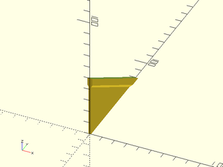

 

    include <BOSL2/std.scad>
    include <BOSL2/walls.scad>
    thinning_triangle(h=50, l=80, thick=4, ang=30, strut=5, wall=2, diagonly=true, center=false);

---

### Module: sparse\_strut()

**Usage:** 

- sparse\_strut(h, l, thick, [strut], [maxang], [max\_bridge])

**Description:** 

Makes an open rectangular strut with X-shaped cross-bracing, designed to reduce
the need for support material in 3D printing.

**Arguments:** 

<abbr title="These args can be used by position or by name.">By&nbsp;Position</abbr> | What it does
-------------------- | ------------
`h`                  | height of strut wall.
`l`                  | length of strut wall.
`thick`              | thickness of strut wall.
`maxang`             | maximum overhang angle of cross-braces.
`max_bridge`         | maximum bridging distance between cross-braces.
`strut`              | the width of the cross-braces.
`anchor`             | Translate so anchor point is at origin (0,0,0).  See [anchor](attachments.scad#subsection-anchor).  Default: `CENTER`
`spin`               | Rotate this many degrees around the Z axis after anchor.  See [spin](attachments.scad#subsection-spin).  Default: `0`
`orient`             | Vector to rotate top towards, after spin.  See [orient](attachments.scad#subsection-orient).  Default: `UP`

**Example 1:** Typical Shape

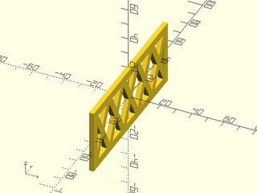

    include <BOSL2/std.scad>
    include <BOSL2/walls.scad>
    sparse_strut(h=40, l=100, thick=3);

  

**Example 2:** Thinner Strut

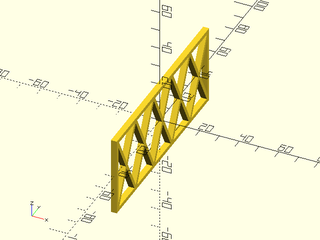

    include <BOSL2/std.scad>
    include <BOSL2/walls.scad>
    sparse_strut(h=40, l=100, thick=3, strut=2);

  

**Example 3:** Larger maxang

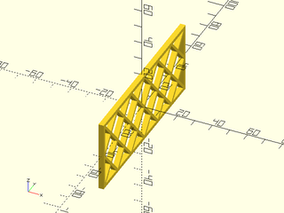

    include <BOSL2/std.scad>
    include <BOSL2/walls.scad>
    sparse_strut(h=40, l=100, thick=3, strut=2, maxang=45);

  

**Example 4:** Longer max\_bridge

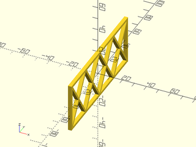

 

    include <BOSL2/std.scad>
    include <BOSL2/walls.scad>
    sparse_strut(h=40, l=100, thick=3, strut=2, maxang=45, max_bridge=30);

---

### Module: sparse\_strut3d()

**Usage:** 

- sparse\_strut3d(h, w, l, [thick], [maxang], [max\_bridge], [strut]);

**Description:** 

Makes an open rectangular strut with X-shaped cross-bracing, designed to reduce the
need for support material in 3D printing.

**Arguments:** 

<abbr title="These args can be used by position or by name.">By&nbsp;Position</abbr> | What it does
-------------------- | ------------
`h`                  | Z size of strut.
`w`                  | X size of strut.
`l`                  | Y size of strut.
`thick`              | thickness of strut walls.
`maxang`             | maximum overhang angle of cross-braces.
`max_bridge`         | maximum bridging distance between cross-braces.
`strut`              | the width of the cross-braces.
`anchor`             | Translate so anchor point is at origin (0,0,0).  See [anchor](attachments.scad#subsection-anchor).  Default: `CENTER`
`spin`               | Rotate this many degrees around the Z axis after anchor.  See [spin](attachments.scad#subsection-spin).  Default: `0`
`orient`             | Vector to rotate top towards, after spin.  See [orient](attachments.scad#subsection-orient).  Default: `UP`

**Example 1:** Typical Shape

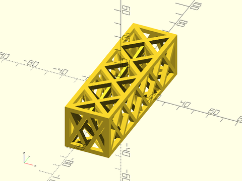

    include <BOSL2/std.scad>
    include <BOSL2/walls.scad>
    sparse_strut3d(h=30, w=30, l=100);

  

**Example 2:** Thinner strut

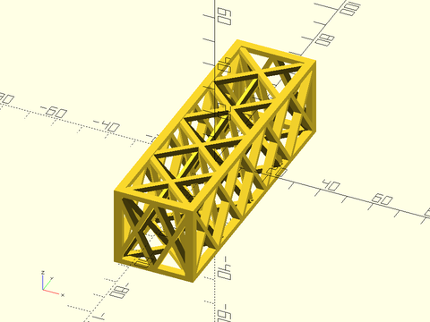

    include <BOSL2/std.scad>
    include <BOSL2/walls.scad>
    sparse_strut3d(h=30, w=30, l=100, strut=2);

  

**Example 3:** Larger maxang

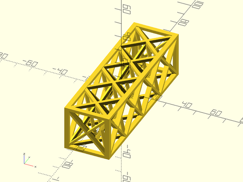

 

    include <BOSL2/std.scad>
    include <BOSL2/walls.scad>
    sparse_strut3d(h=30, w=30, l=100, strut=2, maxang=50);

**Example 4:** Smaller max\_bridge

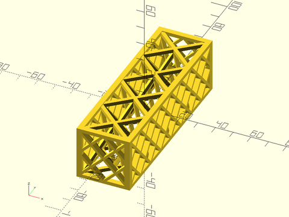

 

    include <BOSL2/std.scad>
    include <BOSL2/walls.scad>
    sparse_strut3d(h=30, w=30, l=100, strut=2, maxang=50, max_bridge=20);

---

### Module: corrugated\_wall()

**Usage:** 

- corrugated\_wall(h, l, thick, [strut], [wall]);

**Description:** 

Makes a corrugated wall which relieves contraction stress while still
providing support strength.  Designed with 3D printing in mind.

**Arguments:** 

<abbr title="These args can be used by position or by name.">By&nbsp;Position</abbr> | What it does
-------------------- | ------------
`h`                  | height of strut wall.
`l`                  | length of strut wall.
`thick`              | thickness of strut wall.
`strut`              | the width of the cross-braces.
`wall`               | thickness of corrugations.
`anchor`             | Translate so anchor point is at origin (0,0,0).  See [anchor](attachments.scad#subsection-anchor).  Default: `CENTER`
`spin`               | Rotate this many degrees around the Z axis after anchor.  See [spin](attachments.scad#subsection-spin).  Default: `0`
`orient`             | Vector to rotate top towards, after spin.  See [orient](attachments.scad#subsection-orient).  Default: `UP`

**Example 1:** Typical Shape

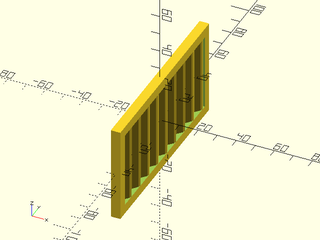

    include <BOSL2/std.scad>
    include <BOSL2/walls.scad>
    corrugated_wall(h=50, l=100);

  

**Example 2:** Wider Strut

    include <BOSL2/std.scad>
    include <BOSL2/walls.scad>
    corrugated_wall(h=50, l=100, strut=8);

  

**Example 3:** Thicker Wall

    include <BOSL2/std.scad>
    include <BOSL2/walls.scad>
    corrugated_wall(h=50, l=100, strut=8, wall=3);

  

---

