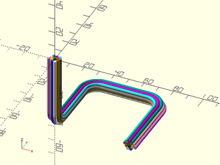

# LibFile: wiring.scad

Rendering for wiring bundles

To use, add the following lines to the beginning of your file:

    include <BOSL2/std.scad>
    include <BOSL2/wiring.scad>

## Table of Contents

1. [Section: Functions](#section-functions)
    - [`hex_offset_ring()`](#function-hex_offset_ring)
    - [`hex_offsets()`](#function-hex_offsets)

2. [Section: Modules](#section-modules)
    - [`wiring()`](#module-wiring)

## Section: Functions

### Function: hex\_offset\_ring()

**Usage:** 

- hex\_offset\_ring(d, lev)

**Description:** 

Returns a hexagonal ring of points, with a spacing of `d`.
If `lev=0`, returns a single point at `[0,0]`.  All greater
levels return 6 times `lev` points.

**Arguments:** 

<abbr title="These args can be used by position or by name.">By&nbsp;Position</abbr> | What it does
-------------------- | ------------
`d`                  | Base unit diameter to build rings upon.
`lev`                | How many rings to produce.

**Example 1:** 

    include <BOSL2/std.scad>
    include <BOSL2/wiring.scad>
    hex_offset_ring(d=1, lev=3); // Returns a hex ring of 18 points.

  

---

### Function: hex\_offsets()

**Usage:** 

- hex\_offsets(n, d)

**Description:** 

Returns the centerpoints for the optimal hexagonal packing
of at least `n` circular items, of diameter `d`.  Will return
enough points to fill out the last ring, even if that is more
than `n` points.

**Arguments:** 

<abbr title="These args can be used by position or by name.">By&nbsp;Position</abbr> | What it does
-------------------- | ------------
`n`                  | Number of items to bundle.
`d`                  | How far to space each point away from others.

---

## Section: Modules

### Module: wiring()

**Usage:** 

- wiring(path, wires, [wirediam], [rounding], [wirenum], [bezsteps]);

**Description:** 

Returns a 3D object representing a bundle of wires that follow a given path,
with the corners rounded to a given radius.  There are 17 base wire colors.
If you have more than 17 wires, colors will get re-used.

**Arguments:** 

<abbr title="These args can be used by position or by name.">By&nbsp;Position</abbr> | What it does
-------------------- | ------------
`path`               | The 3D path that the wire bundle should follow.
`wires`              | The number of wires in the wiring bundle.
`wirediam`           | The diameter of each wire in the bundle.
`rounding`           | The radius that the path corners will be rounded to.
`wirenum`            | The first wire's offset into the color table.
`corner_steps`       | The corner roundings in the path will be converted into this number of segments.

**Example 1:** 

 

    include <BOSL2/std.scad>
    include <BOSL2/wiring.scad>
    wiring([[50,0,-50], [50,50,-50], [0,50,-50], [0,0,-50], [0,0,0]], rounding=10, wires=13);

---

